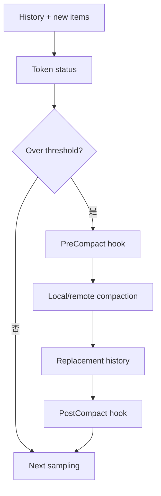

# 附录 F｜Context 预算、压缩与 Reference Context

> 源码基线：`upstream/main@283bc4cf011047314b4804c0f1ccd06e4f6a95c5`（2026-06-24）。

第 07 章解释了 Prompt 的来源，本专题进一步回答三个问题：

1. Codex 如何知道上下文快满了？
2. Compaction 后怎样保持会话连续？
3. Resume/Fork 为什么不能只读最后一条摘要？

## 1. Context 是有版本的运行时状态

`ContextManager` 保存模型可见 history，并维护 generation。以下操作会改变 generation：

- compaction；
- rollback；
- replacement history；
-恢复时重建。

普通追加不会回头改写旧项；语义重写必须明确提升 generation，让缓存和并发读取知道历史视图已变化。

## 2. Token status

运行时跟踪：

-当前输入 token；
-模型 context window；
-可用剩余量；
-压缩阈值；
- window number / ID；
-工具输出和注入预算。

计数不是等到 API 返回 context overflow 才处理。Turn 开始前和每次采样后都可以判断是否需要压缩。



## 3. Stable prefix

Prompt 缓存依赖稳定前缀。Codex 尽量保持：

- base instructions；
- reference context；
-不变的历史前缀；
-工具规格顺序。

配置或 world state 变化时追加 context update，而不是重新渲染所有旧消息。频繁改写前缀会造成缓存 miss，也让恢复语义更难验证。

## 4. Reference Context

Reference context 表示构建当前会话世界视图时使用的稳定基线。它与最近一次上下文更新共同决定模型当前看到：

- cwd / environment；
- approval 与 sandbox；
- model/personality/collaboration mode；
-项目指令；
-可用扩展。

`record_context_updates_and_set_reference_context_item` 在新回合前记录差异并更新参考项。

## 5. Compaction 输出

压缩可以由本地或远程实现完成，但结果必须成为明确 replacement history。压缩不能：

-无界保留原文加摘要；
-丢失仍活跃的用户目标；
-把控制事件伪装成用户文本；
-破坏 tool call / output 配对；
-超过单项硬上限。

压缩后的首次请求还要保留 window metadata，便于后续再次压缩和恢复。

## 6. Tool output 截断

上下文治理不仅处理聊天历史。Shell、MCP、Code Mode 和图片输出都必须在进入模型历史前采用：

-字节或 token cap；
- head/tail；
-摘要；
-外部文件引用；
-明确 truncation marker。

UI 可以看到更丰富的流式输出，模型输入仍必须有界。

## 7. Resume/Fork 重建

恢复会重放 rollout：

```text
session metadata
→ initial/reference context
→ response items
→ compaction replacements
→ rollback markers
→ latest context updates
→ previous turn settings
```

最终得到的 history 应与原线程在同一点的 live history 等价。Fork 再以该有效视图作为新线程初始历史，并记录父子 lineage。

## 8. 验证不变量

- 不重写普通历史；
- 每项有硬上限；
- tool call/output 配对；
-压缩前后任务语义连续；
- live history 与 replay reconstruction 相等；
- rollback 后 reference context 可恢复；
-不同 window 的 ID/number 单调一致。

## 9. 源码阅读路线

```bash
rg -n "struct ContextManager|generation|for_prompt" codex-rs/core/src/context_manager
rg -n "context_window_token_status|auto_compact|compact" codex-rs/core/src/session
rg -n "reference_context|record_context_updates" codex-rs/core/src
rg -n "ReplacementHistory|window_number|window_id" codex-rs/core/src codex-rs/protocol/src
rg -n "reconstruct_history_from_rollout" codex-rs/core/src/session
```

核心结论：

> Context 管理不是“把旧消息删短”，而是维护一个可计量、可替换、可重放且尽量缓存稳定的模型可见状态。
