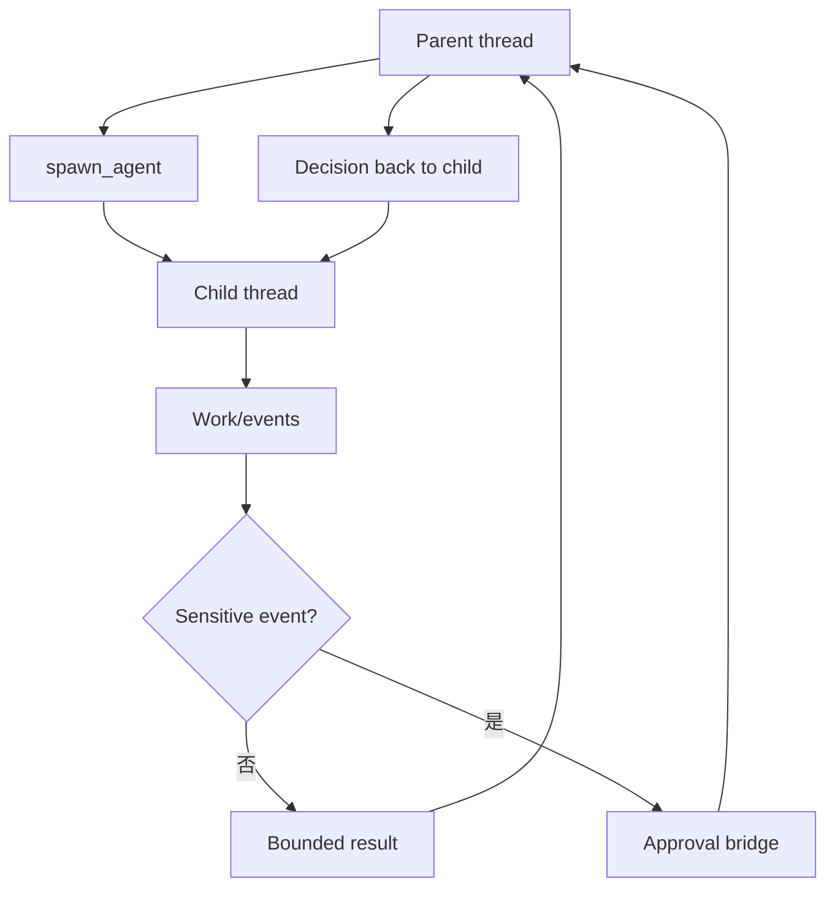

# 附录 G｜Multi-Agent、Review、Guardian 与 Goal

> 源码基线：`upstream/main@283bc4cf011047314b4804c0f1ccd06e4f6a95c5`（2026-06-24）。

这四类能力共享“另一个执行单元参与当前工作”的表象，但角色不同：

| 能力 | 处理对象 | 产物 |
| --- | --- | --- |
| Multi-Agent | 可拆分子任务 | 子线程结果 |
| Review | 代码变更 | findings |
| Guardian | 高风险审批 | allow/deny 建议或决定 |
| Goal | 长期目标 | active/complete/blocked 状态与 accounting |

## 1. 子 Agent 是隔离线程

Spawn 会创建独立 Codex session/thread，而不是在父 history 中模拟角色。子 Agent 可继承：

- base instructions 与必要 world state；
-环境；
- exec policy；
- Skills/Plugins/MCP 服务；
-权限边界。

但拥有独立 history、事件流和取消状态。默认还会限制递归协作，防止任务树无限扩张。



## 2. Fork mode 与 override

Full-history fork 复制父线程有效历史。为避免身份漂移，完整 fork 与 role/model/reasoning override 存在约束。

普通 delegated task 更适合传递精简输入，让探索噪声留在子线程，只把结论带回父线程。

## 3. Wait、send、interrupt、close

父 Agent 通过工具控制生命周期：

- wait：带 deadline 等待活动；
- send/follow-up：追加任务信息；
- interrupt：中止当前 child turn；
- close：释放子 Agent；
- list/status：观察状态。

Wait 订阅 activity，而不是阻塞整个 runtime。超时是正常结果，不自动等同于子 Agent 失败。

## 4. 审批桥

子 Agent 触发 shell、patch、permissions、MCP elicitation 时，delegate 层拦截事件：

1. 拼接必要调用上下文；
2.路由到父 session 或 Guardian；
3.得到决策；
4.作为 `Op` 回送 child。

这保证子 Agent 无法自行批准其危险动作。

## 5. Review

Review task 使用专门姿态检查 diff、文件和测试。输出应：

- findings 优先；
-按严重级排序；
-引用具体文件/位置；
-说明影响和触发条件；
-指出测试缺口；
-没有发现时明确说明剩余风险。

Review 不是安全审批。它可以判断代码缺陷，但不负责授权命令执行。

## 6. Guardian

Guardian 接收有界的审批快照：

-当前用户授权语义；
-具体 action JSON；
-触发网络请求的 command/tool；
- tenant policy；
-必要的只读证据。

Guardian 使用隔离 review session，避免主 Agent 的 Skills、memory 或长对话污染安全判断。结果还要经过既定 policy，不是另一个模型一句“看起来安全”就自动放行。

## 7. Goal

Goal extension 将长期任务状态持久化到 `goals_1.sqlite`，主要操作：

- create goal；
-读取当前目标；
- continuation steering；
- update objective；
-完成或阻塞；
- token/time accounting。

只有目标真实达成才能 complete。Blocked 需要重复出现同一阻塞并达到规则阈值；任务困难、预算不足或“最好问一下”本身不构成 blocked。

## 8. Continuation

Goal runtime 可以在一个 turn 结束后生成 continuation prompt，使 Agent 继续推进。Continuation 不能扩大用户授权范围，也不能绕过工具审批。

预算触顶应停止自动继续并报告状态，但不能伪造 complete/blocked。

## 9. 组合方式

```text
Goal: 定义长期终态
  → Parent: 拆解工作
    → Subagents: 并行探索/实现
    → Review: 检查代码结果
    → Guardian: 审查危险动作
  → Goal accounting: 判断是否继续或完成
```

四者分离后，协作、质量、安全和持续性可以独立演化。

## 10. 源码阅读路线

```bash
rg -n "spawn_agent|wait_agent|close_agent|interrupt" codex-rs/core/src/tools/handlers
rg -n "run_codex_thread_interactive|forward_events" codex-rs/core/src/codex_delegate.rs
sed -n '1,260p' codex-rs/core/src/tasks/review.rs
find codex-rs/core/src/guardian -type f | sort
find codex-rs/ext/goal -type f | sort
rg -n "GoalStatus|accounting|continuation|blocked" codex-rs/ext/goal codex-rs/state
```

核心结论：

> Multi-Agent 管工作隔离，Review 管代码质量，Guardian 管高风险授权，Goal 管长期终态；把它们混为“多模型协作”会丢失最关键的安全与状态边界。
