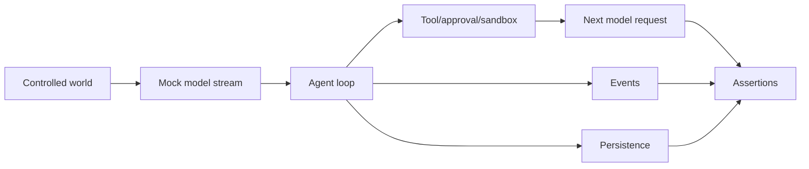

# 附录 H｜工程测试、Schema 与可观测性

> 源码基线：`upstream/main@283bc4cf011047314b4804c0f1ccd06e4f6a95c5`（2026-06-24）。

Agent 测试不能只断言最终回复。需要同时证明模型请求、工具副作用、用户事件、协议输出和恢复状态。

## 1. 风险对应测试

| 变化 | 首选证据 |
| --- | --- |
| Agent logic / context / tools | Core integration test |
| App Server wire shape | schema fixtures + protocol tests |
| TUI 文案/布局 | insta snapshots |
| sandbox / exec / patch |平台行为测试 |
| config shape | config schema |
| dependency | Cargo lock + Bazel lock |
| build-time file read | Cargo 与 BUILD.bazel data |

## 2. Responses mock

`core_test_support::responses` 构造确定 SSE：

```text
response.created
→ function/custom tool call
→ response.completed
```

`ResponseMock` 捕获 outbound `/responses` 请求，测试可断言：

- tools；
- input items；
- function call output；
- headers；
-多次采样请求顺序。

这比只检查 final answer 更能证明工具结果真的进入下一次模型上下文。

## 3. Integration evidence chain



改变 Agent logic 必须列出主要用户行为并加 integration coverage。纯函数才优先 unit test。

## 4. App Server Schema

Protocol 类型生成：

- TypeScript；
- JSON Schema；
- stable/experimental fixture。

测试重新生成并与仓库 fixture 对比，防止 Rust 类型变化未同步客户端。常用命令：

```bash
just write-app-server-schema
just write-app-server-schema --experimental
just test -p codex-app-server-protocol
```

## 5. TUI Snapshot

Snapshot 固定：

- terminal width/height；
-文字与 style；
- streaming/final cell；
- approval/diff/tool output；
- CJK、URL、长路径 wrapping。

应直接审阅 `.snap.new`，确认视觉变化符合意图，再 accept。不能把批量 accept 当测试修复。

## 6. 跨平台沙箱

策略 unit test 只能证明转换逻辑。真正安全保证还需：

- macOS Seatbelt 行为；
- Linux bwrap/user namespace/seccomp；
- Windows setup/token/ACL/WFP；
-容器/WSL 失败模式。

平台不具备测试前提时应明确 skip 原因，不能用“测试没跑”支持安全结论。

## 7. Cargo 与 Bazel

Codex 同时维护 Cargo 和 Bazel：

-依赖变化后更新 `MODULE.bazel.lock`；
- `include_str!` / migrations 等要加入 `compile_data` 或 test data；
-测试里找 binary/resource 使用 runfiles-aware helper；
-避免只在 Cargo 下通过。

## 8. Tracing

异步函数优先在定义上使用 `#[tracing::instrument]`。先检查被委托的 callee 是否已有 instrumentation，避免重复 span。

Trace 回答：

-某 turn 卡在哪；
-哪个 tool/transport retry；
-审批等待多久；
- compaction 和 resume 如何重建；
-远程环境在哪断开。

## 9. Metrics 与 Analytics

Metrics 聚合：

-成功/失败计数；
- latency histogram；
- retry/fallback；
- cache/sync transport；
-数据库与迁移；
- memory phases；
- sandbox/network decision。

Analytics 关注产品行为与来源，例如 client、Plugin、tool selection。二者都必须避免把源码、Prompt、secret 当普通 tag 上传。

## 10. Rollout 与 Debug

Rollout 是恢复证据，也可用于排障，但不等于专用 observability trace。调试时应区分：

-模型可见 item；
- UI event；
-持久化 item；
- trace payload；
- OTEL span/metric。

同一 action 在这些投影中的字段和保留周期不同。

## 11. 提交前顺序

Rust 变更通常：

1. 实现和 focused test；
2. `just test -p <crate>`；
3. 大改运行 `just fix -p <crate>`；
4. 最后 `just fmt`；
5. 按照仓库约定，fix/fmt 后不重跑测试；
6. shared core/protocol 的全量测试需先获得用户同意。

文档变更则运行 Mermaid、链接、路径与 diff check。

## 12. 源码阅读路线

```bash
rg -n "mount_sse_once|ResponseMock|single_request" codex-rs/core/tests
find codex-rs/app-server-protocol/schema -type f | sort | head
find codex-rs/tui -name '*.snap' | sort | head
find codex-rs -path '*tests*' -type f | sort
find codex-rs/otel codex-rs/analytics -type f | sort
rg -n "instrument\\(|counter\\(|histogram\\(" codex-rs/core codex-rs/app-server
```

核心结论：

> 生产级 Agent 的可信度来自一条可重复证据链：固定外部世界，断言中间状态，再用 schema、snapshot、平台测试与 telemetry 覆盖不同风险边界。
