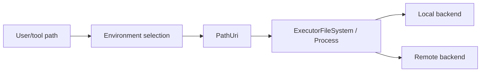

# 附录 I｜PathUri、环境注册与远程执行

> 源码基线：`upstream/main@283bc4cf011047314b4804c0f1ccd06e4f6a95c5`（2026-06-24）。

一旦 Codex 能连接本地、容器、远程 Linux 和 Windows 环境，“路径”就不能继续只是当前进程的 `PathBuf`。

## 1. Path 的三个问题

裸字符串无法表达：

-路径属于哪个 environment；
-采用 Unix 还是 Windows 语义；
-是否可由当前进程直接访问。

`PathUri` 将环境身份和路径编码在同一值中，API 边界再通过 `ApiPathString` 做稳定序列化。

## 2. 不要跨边界使用 `PathBuf`

`PathBuf` 只适合当前 OS 的本地路径。以下场景应使用 PathUri 或显式 path-bearing newtype：

- remote cwd；
- apply_patch target；
- ExecutorFileSystem；
- exec-server RPC；
- file stream；
- AGENTS/config 读取；
-多环境工具参数。



## 3. Environment Registry

`exec-server` 的 registry 管理 environment 定义和连接。Environment 可以来自：

- local default；
-配置文件中的 program；
-远程 URL；
-运行时注册；
- App Server turn 参数。

配置要求 URL 与 program 二选一，避免同一 ID 有两种冲突启动方式。

## 4. Environment selection

Core 根据 turn 与 tool request 选择：

- primary environment；
-显式 environment ID；
- filesystem；
- process runner；
- cwd；
- inherited subagent environments。

显式未知 ID 必须失败，不能静默退回 local。多环境线程中 apply_patch grammar 可包含 Environment ID，shell tool 参数也会携带环境。

## 5. `ExecutorFileSystem`

统一接口提供：

- canonicalize；
- read / stream；
- write；
- metadata；
- read directory；
- create/remove。

实现包括 local、unsandboxed/direct、sandboxed 和 remote filesystem。上层 apply_patch、AGENTS 和配置加载可以复用算法，而不关心文件在何处。

## 6. Process

Exec Server 同时抽象进程：

- spawn；
- stdout/stderr stream；
- stdin；
- wait/kill；
-环境变量；
- sandbox context。

Remote disconnect 必须有明确错误与 recovery；不能把远端不确定状态误报为命令未启动。

## 7. Transport 与 Noise relay

Remote 执行可通过 HTTP/WebSocket/RPC transport，并有 Noise channel/relay：

-绑定环境注册信息；
-保持消息 framing；
-按序传输 ciphertext；
-区分 relay 与 executor stream；
-连接恢复。

加密 transport 不替代权限判断。Server 仍需验证 session、path 和 process 请求。

## 8. Sandbox

Sandbox policy 在执行环境中落地，而不是只在 orchestrator 主机判断。Remote filesystem 也可包装为 `SandboxedFileSystem`，确保 patch/read/write 遵循相同 profile。

主机允许某路径字符串，不代表远端 canonical path 一定属于同一 writable root；校验必须由目标环境完成。

## 9. 子 Agent 和 MCP

子 Agent 可以继承父线程已注册 environments，但仍按自己的 turn context 选择。Executor stdio MCP Server 也可在目标 environment 启动，使其访问正确的工具链和文件系统。

继承是能力可见性，不是自动授权所有环境。

## 10. 失败模式

- duplicate environment ID；
- URL/program 配置冲突；
-远端 handshake 失败；
- cwd 不存在；
- PathUri environment 不匹配；
-本地路径被错误发送给 Windows remote；
- stream 中断；
- process 状态未知；
- sandbox path canonicalization 失败。

这些错误应保留 environment ID，方便用户知道失败发生在哪台执行端。

## 11. 类型设计原则

仓库新增 path-bearing API 时：

-本地内部路径用 `Path` / `PathBuf`；
-要求绝对路径时用 `AbsolutePathBuf`；
-跨环境用 `PathUri`；
- wire 边界用明确 string/newtype；
-不要用 bool 表示 local/remote；
-不要在 path string 中靠猜测 OS。

## 12. 源码阅读路线

```bash
find codex-rs/utils/path-uri -type f | sort
rg -n "struct EnvironmentRegistry|register|environment_id" codex-rs/exec-server/src
rg -n "trait ExecutorFileSystem|RemoteFileSystem|SandboxedFileSystem" codex-rs/exec-server/src
rg -n "EnvironmentSelection|primary_filesystem|environment_id" codex-rs/core/src
rg -n "Noise|relay|message_framing" codex-rs/exec-server/src
rg -n "Environment ID" codex-rs/apply-patch codex-rs/core/src/tools
```

核心结论：

> PathUri 是跨环境身份安全，Environment Registry 是能力发现，ExecutorFileSystem/Process 是执行抽象；三者一起防止“远程能力最终退化成带字符串路径的本地 shell”。
