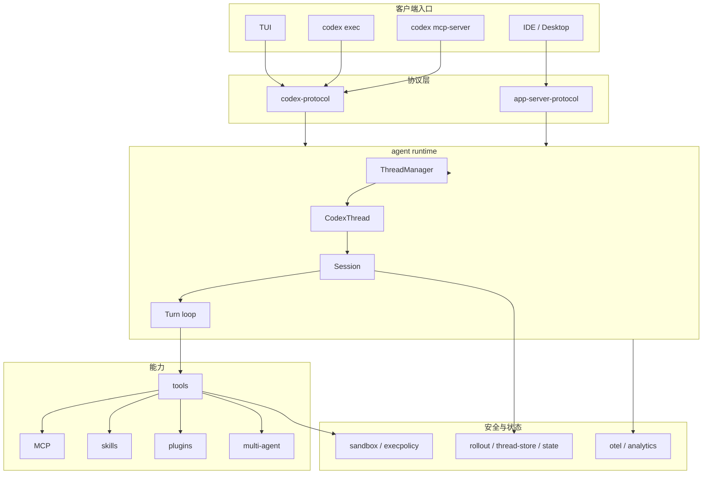
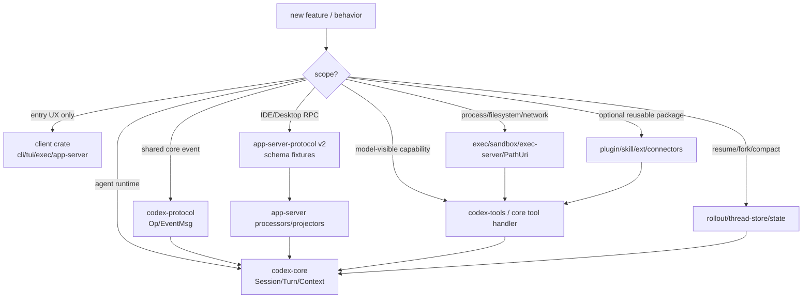

# 01 总体架构与演进

> 源码基线：`upstream/main@283bc4cf01`，复核日期：2026-06-24。

## 研究目标

本专题回答一个大问题：`codex-rs` 为什么会从一个 Rust CLI 演进成大型 agent runtime workspace？

深度研究时不要只看当前目录结构。更重要的是理解演进压力：

- 本地 CLI/TUI 需要共享同一个 agent loop。
- IDE、桌面端和测试客户端需要稳定协议。
- shell、patch、MCP、plugins、skills 都需要统一进工具系统。
- 安全执行需要审批、沙箱、网络策略和跨平台实现。
- 长任务需要 resume、fork、compact、thread store 和 state DB。
- 远程环境需要 PathUri、exec-server、environment registry。

## 源码地图

| 区域 | 入口 | 作用 |
| --- | --- | --- |
| Workspace | `codex-rs/Cargo.toml` | 看 crate 拆分和内部依赖。 |
| CLI | `codex-rs/cli/src/main.rs` | 所有产品入口的命令分发。 |
| Core | `codex-rs/core/src/lib.rs` | agent runtime 的公开边界。 |
| Protocol | `codex-rs/protocol/src/protocol.rs` | core 的操作与事件模型。 |
| App Server | `codex-rs/app-server/src/lib.rs` | 富客户端后端 runtime。 |
| App Protocol | `codex-rs/app-server-protocol/src/protocol/v2/` | IDE/桌面端协议。 |
| TUI | `codex-rs/tui/src/` | 终端产品体验。 |
| State | `codex-rs/rollout`、`codex-rs/thread-store`、`codex-rs/state` | 历史、metadata、状态库。 |

## 当前架构



## 核心数据结构与实现入口

| 层次 | 关键类型/模块 | 说明 |
| --- | --- | --- |
| 产品入口 | `cli`、`tui`、`app-server`、`mcp-server` | 用户进入 Codex 的不同界面；它们不应各自实现 agent 逻辑。 |
| core 协议 | `codex-protocol` 的 `Op`、`EventMsg` | core runtime 的操作/事件边界，TUI 和 exec 等入口围绕它通信。 |
| app 协议 | `app-server-protocol` v2 | 面向 IDE/桌面端的 JSON-RPC contract，强调 thread/turn/item。 |
| runtime | `ThreadManager`、`CodexThread`、`Session`、`SessionTask`、`run_turn` | agent 主循环与会话并发模型。 |
| 上下文 | `TurnContext`、`ContextManager`、`ContextualUserFragment`、`TurnContextItem` | 控制模型看到什么，以及 resume/compact 后如何恢复。 |
| 工具 | `ToolSpec`、`ToolRegistry`、`ToolRouter`、`ToolCallRuntime` | 把 shell、patch、MCP、dynamic tools、多 agent 等统一成模型工具。 |
| 安全 | `PermissionProfile`、`SandboxPolicy`、`ExecPolicy`、Guardian | 把“用户授权”和“OS 级资源约束”分开处理。 |
| 状态 | rollout、thread-store、state DB | 分别承担事件日志、thread 抽象、metadata/index。 |
| 扩展 | MCP、skills、plugins、connectors/apps | 把外部工具、prompt 能力包和平台连接器纳入 runtime。 |

从架构角度看，`codex-rs` 的核心不是某个二进制，而是一个可被多入口复用的 agent runtime。CLI/TUI/app-server 是不同 client；`codex-core` 是运行时中心；`codex-protocol` 和 `app-server-protocol` 是边界；tools/sandbox/state/extension crates 是能力层。

## 演进逻辑

### 第一阶段：本地 coding agent

早期重点是把 Rust CLI 跑起来：

- 模型调用。
- shell 执行。
- `apply_patch`。
- TUI。
- Linux sandbox。
- 基础配置。

这时 `core` 是最自然的中心。

### 第二阶段：协议化与长期会话

随着功能变多，系统需要稳定边界：

- `codex-protocol` 承接 core 与 UI 的事件/操作。
- rollout 保存历史，支持 resume/fork/archive。
- compaction 处理长上下文。
- MCP 让外部工具进入系统。

### 第三阶段：app-server

IDE 和桌面端不适合直接复用 TUI 逻辑，所以出现 app-server：

- 客户端通过 JSON-RPC 控制 thread/turn。
- core 事件翻译成 app-server notifications。
- 协议 v2 强调 `Thread -> Turn -> Item`。

### 第四阶段：平台化

近期演进集中在：

- plugins、skills、connectors。
- multi-agent。
- remote environments。
- PathUri。
- exec-server。
- context budget。
- telemetry。

这说明 `codex-rs` 已经从 CLI 产品演进成 agent platform。

## 技术原理：为什么会变成 workspace

一个简单 coding agent 可以写成“读输入 -> 调模型 -> 执行工具 -> 回答”的单体程序，但 Codex 不能停在这里，原因是生产约束会把单体拆开：

- 多客户端约束：TUI、`codex exec`、IDE、桌面端都要共享 agent 行为，但交互协议不同。
- 安全约束：审批、沙箱、网络、Guardian 必须在每种入口下语义一致。
- 长会话约束：resume、fork、compact 要求历史不是 UI 文本，而是可重建事件日志。
- 扩展约束：MCP、plugins、skills、connectors 来自不同信任域，必须统一暴露、过滤和执行。
- 执行环境约束：本地、远程、Windows、Linux、macOS 的路径和 sandbox 差异必须被抽象。
- 工程约束：协议 schema、snapshot、SSE mock、Bazel/Cargo、telemetry 都需要独立测试面。

因此 workspace 拆分不是为了“目录好看”，而是把不同变化速度和不同风险边界拆开。`codex-core` 仍然大，是因为 agent loop、context、tool、安全和状态的交汇点天然复杂；近期重构的方向也正是把协议、工具、插件、rollout、thread-store、exec-server 等能力从 core 中分离出去。

## 架构边界决策模型

读 `codex-rs/Cargo.toml` 会发现 workspace 已经不是“一个 core 加几个 binary”，而是一组围绕 agent runtime 的产品入口、协议、状态、执行、安全、扩展和测试 crate。理解它的关键是判断：一个新能力应该落在哪个边界，而不是直接塞进 `codex-core`。

### 分层不变量

| 层 | 典型 crate | 不变量 |
| --- | --- | --- |
| 产品入口层 | `cli`、`tui`、`exec`、`app-server-daemon`、`mcp-server` | 负责用户入口和进程形态，不重新实现 agent loop。 |
| 协议层 | `protocol`、`app-server-protocol`、`code-mode-protocol` | 定义 wire/API contract，不直接依赖具体 UI。 |
| runtime 层 | `core`、`core-api`、`thread-manager-sample` | 组织 thread/session/turn/model/tool 的运行。 |
| 工具与能力层 | `tools`、`apply-patch`、`shell-command`、`core-skills`、`core-plugins` | 把能力做成可注册、可过滤、可测试的单元。 |
| 执行与安全层 | `exec-server`、`sandboxing`、`linux-sandbox`、`execpolicy`、`network-proxy` | 处理外部世界副作用和 OS/backend 差异。 |
| 状态层 | `rollout`、`thread-store`、`state`、`rollout-trace` | 保存可恢复事实，不保存 UI 临时状态。 |
| 扩展层 | `ext/*`、`plugin`、`connectors`、`codex-mcp`、`rmcp-client` | 管理可安装、可发现、可授权的外部能力。 |
| 工程层 | `app-server-test-client`、`test-binary-support`、`otel`、`analytics` | 固定契约、提供观测和测试支撑。 |

这几个层次之间有一个隐含规则：越靠下，越应该稳定、可复用、少产品假设；越靠上，越可以承载具体体验和入口差异。

### 新能力落点算法

新增一个功能时，可以用下面的决策树判断落点：

```text
classify_feature(feature)
  if it changes user entrypoint behavior only:
    put in cli/tui/exec/app-server surface

  else if it changes core Op/Event semantics shared by TUI/exec:
    update codex-protocol first
    adapt core producer and clients

  else if it changes IDE/desktop JSON-RPC contract:
    update app-server-protocol v2
    regenerate schema fixtures
    adapt app-server processor/projector

  else if it is a model-visible tool or tool source:
    define ToolSpec/ToolRuntime behavior
    register through tools/spec_plan/router
    decide direct vs deferred exposure

  else if it mutates filesystem/process/network:
    route through exec/sandbox/permission abstractions
    avoid client-specific bypass

  else if it must survive resume/fork/compact:
    represent it as rollout/thread-store/context item
    define reconstruction behavior

  else if it is reusable optional capability:
    prefer plugin/skill/extension crate
    keep core integration minimal

  else:
    keep it private to the narrowest crate that owns the behavior
```

这个算法能解释很多历史演进：

- `apply-patch` 独立成 crate，因为 patch 语义既要服务 shell-like invocation，又要服务内部/远程 filesystem runtime。
- `app-server-protocol` 独立于 `protocol`，因为 IDE/桌面端需要 JSON-RPC thread/turn/item contract，而 TUI/core 的 `Op`/`EventMsg` 边界不等同于富客户端 API。
- `thread-store` 和 `rollout` 分开，是因为 thread 查询/metadata 与 append-only event log/reconstruction 是不同变化轴。
- `tools` 从 core 中分离，是因为模型可见 spec、tool search、plugin/connector discovery 的变化速度高于基础 turn loop。
- `exec-server`、`PathUri`、`file-system` 相关 crate 的出现，是因为“执行在哪里”和“路径属于哪个环境”不能继续由本机 `PathBuf` 假设解决。

### 三条主数据流

总体架构可以用三条数据流理解。

第一条是实时 turn 流：

```text
client entry
  -> Op / JSON-RPC
  -> ThreadManager / CodexThread
  -> Session / SessionTask
  -> run_turn
  -> model stream
  -> tool runtime
  -> EventMsg / app-server notification
```

第二条是状态恢复流：

```text
rollout item / thread metadata
  -> reconstruction
  -> ContextManager baseline
  -> live Session history
  -> model prompt
```

第三条是能力暴露流：

```text
built-in tool / MCP / plugin / connector / skill
  -> discovery and policy filtering
  -> ToolSpec or injected ContextualUserFragment
  -> model-visible prompt/tools
  -> tool output or context item
  -> history and telemetry
```

深度读源码时，每个文件都应该放进这三条流之一。如果一个模块同时出现在多条流里，它通常就是复杂度高发点，例如 `codex-core`、`app-server`、`tools/spec_plan`、`rollout_reconstruction`。

### 架构边界图



这个模型的意义是帮助你读历史：每当项目引入一个新 crate，往往是因为旧边界已经无法同时满足复用、测试、安全或兼容性。

## 关键实现路径

从一个用户请求看总体架构：

```text
Client(TUI/exec/app-server)
  -> protocol Op or JSON-RPC request
  -> ThreadManager / CodexThread
  -> SessionTask
  -> run_turn
  -> build context + tool specs
  -> model request
  -> tool calls through ToolRouter/ToolRegistry
  -> sandbox/exec/MCP/plugin runtime
  -> EventMsg / app-server notification
  -> rollout/state persistence
  -> UI/client rendering
```

从一次恢复看状态架构：

```text
thread id
  -> state DB metadata
  -> rollout JSONL
  -> rollout_reconstruction
  -> ContextManager + TurnContextItem baseline
  -> live CodexThread
  -> client subscribes to events
```

从一次扩展工具看平台架构：

```text
plugin/app/MCP config
  -> catalog and attribution
  -> tool discovery / tool search
  -> ToolSpec exposed to model
  -> ToolExecutor registered
  -> approval/auth/sandbox checks
  -> tool output returns to model
```

这三条路径分别对应：实时运行、长期状态、能力扩展。读源码时把每个模块放回这三条路径，就不会被 crate 数量淹没。

## 演进线索

可以用几个“引入新边界”的动作理解历史：

- 引入 `codex-protocol`：把 core runtime 与 UI/CLI 交互拆开。
- 引入 rollout/thread-store/state：把会话从内存聊天变成可恢复、可搜索、可分叉的 thread。
- 引入 app-server-protocol v2：把 agent runtime 暴露给富客户端，并稳定 wire contract。
- 引入 unified exec/exec-server/PathUri：把执行环境从本机 shell 扩展到远程和跨平台。
- 引入 MCP/tools registry/tool search：把工具从少量内置能力扩展到外部生态。
- 引入 plugins/skills/connectors：把 prompt、工具、app 连接器组合成可安装能力包。
- 引入 Guardian/multi-agent/goal：把单 agent 执行扩展到协作、审查和长任务管理。

这些演进历史当然属于深度研究的一部分，因为它解释了“为什么现在代码不是最简单方案”。没有纵向历史，只看当前横向结构，很容易把必要复杂度误判成偶然复杂度。

## 验证方法

做总体架构验证时，建议不要从单个 crate 开始，而是做三张事实表：

- 入口表：列出 `cli`、`tui`、`app-server`、`mcp-server` 各自如何进入 core。
- 边界表：列出 `codex-protocol`、`app-server-protocol`、`ToolSpec`、`PermissionProfile`、`RolloutItem` 的生产者和消费者。
- 演进表：用 `git log -- <path>` 对照重大目录，如 `core`、`app-server`、`tools`、`apply-patch`、`thread-store`、`exec-server`、`plugin`。

完成后应能回答：如果新增一种客户端、一个工具来源、一种 sandbox 后端或一种持久化查询能力，它应该落在哪一层，不能越过哪些边界。

## 深挖问题

1. 哪些 crate 是产品入口，哪些 crate 是 runtime 能力？
2. 为什么 `codex-core` 仍然大？哪些逻辑正在被拆走？
3. app-server 和 TUI 是平级客户端，还是一个依赖另一个？
4. `protocol` 和 `app-server-protocol` 为什么都存在？
5. `rollout`、`thread-store`、`state` 的职责如何分工？
6. 为什么 PathUri 会成为近期重要迁移？

## 实验建议

运行这些命令建立事实地图：

```bash
find codex-rs -maxdepth 2 -name Cargo.toml | sort
git log --oneline -- codex-rs/core | head
git log --oneline -- codex-rs/app-server | head
git log --oneline --grep 'Extract\\|Move\\|split\\|app-server\\|PathUri' -- codex-rs | head -80
```

写一张自己的 crate 分层表：入口层、协议层、runtime 层、工具层、安全层、状态层、扩展层。
