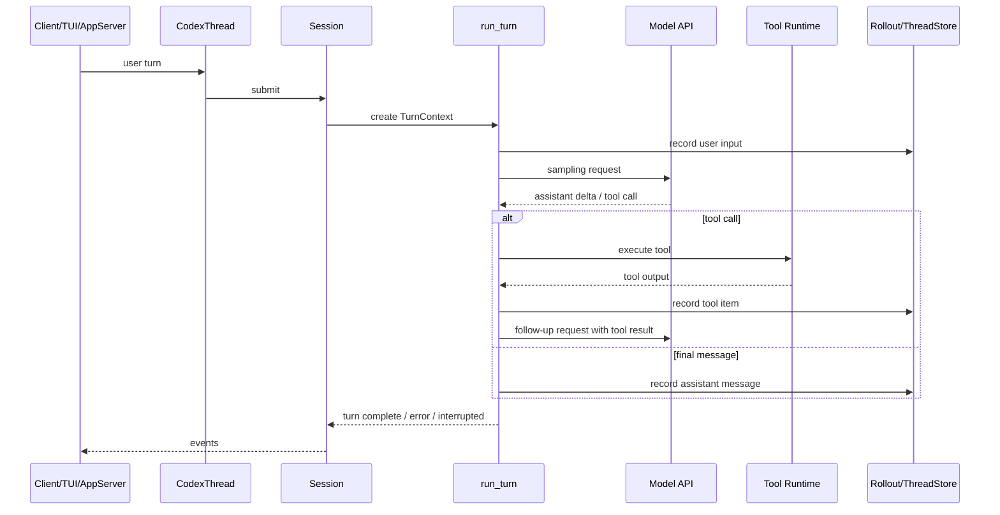
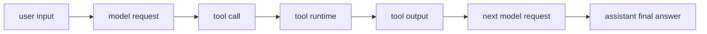
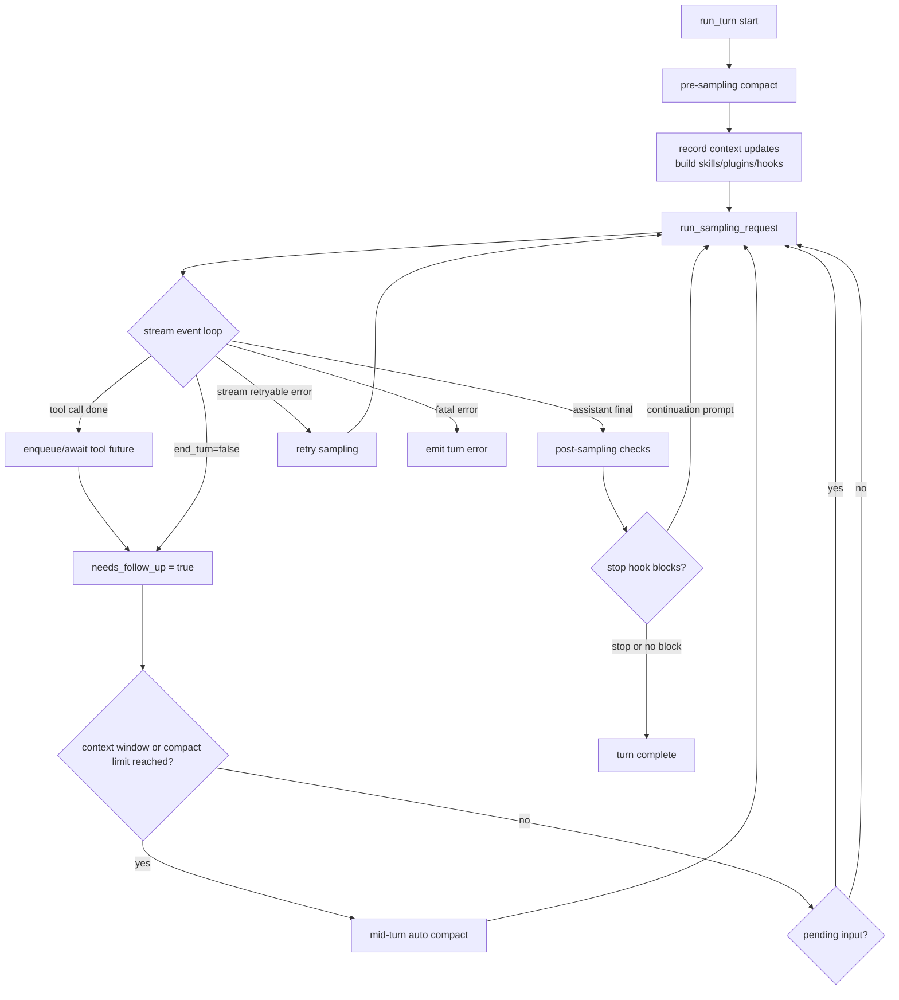

# 02 Agent 主循环

> 源码基线：`upstream/main@283bc4cf01`，复核日期：2026-06-24。

## 研究目标

Agent 主循环是 `codex-rs` 的心脏。深度研究要能回答：

- 用户输入如何变成一次模型请求？
- 模型为什么可能触发多次工具调用和多次模型采样？
- 工具结果如何回到模型上下文？
- turn 如何完成、失败、取消、压缩或被继续？

## 源码地图

| 文件 | 关注点 |
| --- | --- |
| `codex-rs/core/src/thread_manager.rs` | thread 创建、恢复、查找。 |
| `codex-rs/core/src/codex_thread.rs` | 对外 thread handle 和 turn 启动入口。 |
| `codex-rs/core/src/session/session.rs` | session runtime、事件通道、服务集合。 |
| `codex-rs/core/src/session/turn.rs` | 核心 turn loop。 |
| `codex-rs/core/src/session/turn_context.rs` | 单回合配置快照。 |
| `codex-rs/core/src/tasks/regular.rs` | 普通用户任务。 |
| `codex-rs/protocol/src/protocol.rs` | `Op`、`EventMsg`、turn/item 事件。 |

## 深度研究标准

这篇如果只说“用户输入 -> 模型 -> 工具 -> 模型”，还不算深度研究。需要继续回答：

- 哪个对象拥有运行时状态？
- 哪个对象代表用户可见的 thread？
- 哪个对象代表一次可取消、可记录、可恢复的 turn？
- 模型 stream 的每个 item 在哪里被解析、记录、发给 UI？
- 工具调用为什么不是直接执行，而要经过 router、registry、orchestrator、approval、sandbox？
- 哪些事件写入 rollout，哪些只是 UI 临时事件？

## 核心数据结构与职责

| 概念 | 代表源码 | 职责 | 容易误解的点 |
| --- | --- | --- | --- |
| `ThreadManager` | `core/src/thread_manager.rs` | 创建、恢复、查找 thread，管理 thread store。 | 它不是执行 turn 的地方。 |
| `CodexThread` | `core/src/codex_thread.rs` | 对外 thread handle，提供 `submit` 等入口。 | 它更像句柄，不是完整 runtime。 |
| `Session` | `core/src/session/session.rs`、`core/src/session/mod.rs` | 真正的进程内运行时，持有 model client、MCP、tools、rollout、event sender。 | 它不是用户看到的“会话标题”，而是 runtime。 |
| `SessionTask` | `core/src/tasks/mod.rs` | 把普通 turn、review、compact、user shell 等工作流统一成可运行任务。 | 不同 task 可以共享 turn 生命周期事件，也可能有特殊生命周期。 |
| `TurnContext` | `core/src/session/turn_context.rs` | 单 turn 配置快照，包含模型、权限、cwd、tools、skills、MCP 状态等。 | 它不是历史；它是本轮运行配置。 |
| `run_turn` | `core/src/session/turn.rs` | 核心模型采样和工具回传循环。 | 一个 `run_turn` 内可能有多次模型请求。 |
| `EventMsg` | `protocol/src/protocol.rs` | core 对 UI/app-server 发出的事件。 | 部分事件会持久化，部分是传输/展示事件。 |

源码里的 `run_turn` 注释已经给出主原理：模型每次采样可能返回 assistant message 或 function call；如果是 function call，就执行工具并把输出作为下一次采样输入；如果只有 assistant message，就记录历史并结束 turn。

## 主流程



## 关键实现路径：`run_turn` 内部做了什么

`core/src/session/turn.rs` 的 `run_turn` 不是一个简单循环。它在真正采样前已经做了大量准备：

```text
run_turn
  -> create or reuse ModelClientSession
  -> run_pre_sampling_compact
  -> record_context_updates_and_set_reference_context_item
  -> build_skills_and_plugins
  -> run_pending_session_start_hooks
  -> run_hooks_and_record_inputs
  -> merge connector selection
  -> record injection items
  -> track resolved config analytics
  -> initialize TurnDiffTracker
  -> loop:
       drain pending input when allowed
       build sampling request input
       run_sampling_request
       collect post sampling state
       execute tool calls or finalize assistant output
       maybe compact / stop / continue
```

这里有几个关键设计点。

### 1. `ModelClientSession` 是 turn-scoped

`run_turn` 会创建或复用 `ModelClientSession`。源码注释说明它是 turn-scoped，用于缓存 WebSocket 和 sticky routing 状态。这样同一个 turn 内的 retry 和后续采样能复用连接上下文，同时不把连接状态泄漏到无关 turn。

### 2. 先 compact，再采样

`run_pre_sampling_compact` 在采样前运行。原因是：如果历史已经接近上下文窗口，继续把新用户输入、context diff、tool specs 塞进去会让请求失败。预采样 compact 是为了在模型请求之前留出空间。

### 3. Context update 是模型可见状态的一部分

`record_context_updates_and_set_reference_context_item` 会把本轮 context 变化记录进历史参考点。这样模型不是每次都收到一整块重复上下文，而是能以受控方式看到变化。

### 4. Skills 和 plugins 不是静态 prompt

`build_skills_and_plugins` 会根据本轮 input、显式 mention、配置、插件状态决定注入什么。它还可能带来 injection items，这些 items 会先记录到会话历史，再进入后续模型请求。

### 5. Pending input 不是立刻混进当前采样

源码注释说明 pending input 可能是模型运行期间用户又提交的输入。系统会推迟 drain，避免新输入插队破坏当前模型/tool continuation。这个细节解释了为什么生产 agent 需要 input queue，而不是简单 append history。

### 6. TurnDiffTracker 生命周期跨越多个内部模型回合

从 core 看，一个 task 可能包含多次内部采样；但从用户看，这是一个 turn。`TurnDiffTracker` 用来把这个用户 turn 内的文件变化汇总成一致视图。

## 技术原理：为什么一个用户请求会产生多次模型请求

模型不能直接执行 shell 或读文件，它只能提出动作。Codex 的 ReAct 闭环是：



这也是为什么“turn”不能等同于“model request”。一个 turn 是用户可感知的一次工作；内部可以包含多个模型请求和多个工具调用。

## Turn 状态机详解

如果把 `run_turn` 当成一个状态机，关键状态不是“用户、模型、工具”三格，而是下面这些运行时变量：

| 状态变量 | 源码位置 | 含义 |
| --- | --- | --- |
| `client_session` | `run_turn` 开头 | turn-scoped 模型会话，复用 WebSocket/sticky routing/retry 状态。 |
| `can_drain_pending_input` | `run_turn` loop | 是否允许把模型运行期间新来的用户输入并入下一次采样。 |
| `needs_follow_up` | `run_turn` 和 `try_run_sampling_request` | 本轮采样后是否还需要继续请求模型。工具调用、`end_turn=false`、pending input 都会置 true。 |
| `token_limit_reached` | `context_window_token_status` | 是否必须 compact 后才能继续。 |
| `stop_hook_active` | `run_turn` | stop hook 已经要求继续时，避免普通 final answer 直接结束。 |
| `active_item` | `try_run_sampling_request` | 当前 streaming 中的 response item，用于把 delta 归属到正确 turn item。 |
| `in_flight` | `try_run_sampling_request` | 已启动但尚未收敛的工具 future 队列。 |
| `turn_diff_tracker` | `run_turn` | 聚合用户可见的本 turn 文件变化，而不是每个内部 model request 各算一份。 |

主循环可以写成更接近源码的伪代码：

```text
run_turn(input)
  client_session = prewarmed or new model session

  if pre_sampling_compact_fails:
    emit turn error
    return

  record context updates and reference context item
  injection_items, connectors = build_skills_and_plugins(input)
  run pending session-start hooks
  run input hooks and record initial input
  merge connector selection
  record previous turn settings(model, comp_hash, realtime)
  record injection items
  turn_diff_tracker = new tracker for display roots

  can_drain_pending_input = input.is_empty()
  stop_hook_active = false

  loop:
    pending_input =
      if can_drain_pending_input:
        input_queue.get_pending_input(active_turn)
      else:
        []

    if hooks block pending_input:
      break

    record rollout/time/token reminders
    sampling_input = history.for_prompt(model input modalities)
    result = run_sampling_request(sampling_input)

    if result is TurnAborted:
      break
    if result is retryable stream error:
      retry inside run_sampling_request
    if result is invalid image:
      sanitize last-turn images and retry if possible
    if result is other error:
      emit turn error and break

    has_pending_input = input_queue.has_pending_input(active_turn)
    token_status = context_window_token_status()
    needs_follow_up = result.model_needs_follow_up OR has_pending_input

    if maybe_start_new_context_window() and needs_follow_up:
      can_drain_pending_input = NOT result.model_needs_follow_up
      continue

    if token_status.limit_reached and needs_follow_up:
      run_auto_compact(BeforeLastUserMessage, ContextLimit, MidTurn)
      can_drain_pending_input = NOT result.model_needs_follow_up
      continue

    if NOT needs_follow_up:
      run stop hooks
      if stop hook provides continuation prompt:
        record hook prompt
        stop_hook_active = true
        continue
      run legacy after-agent hook
      break
```

这个算法有几个很容易被忽略的边界条件：

- 初始 `input` 会先进入采样；pending input 默认不会抢跑。只有一次采样完成后，`can_drain_pending_input` 才通常变成 true。
- 如果模型刚刚要求工具 continuation，compact 后会先恢复工具/模型 continuation，而不是把用户新输入插进去；所以 `can_drain_pending_input = !model_needs_follow_up`。
- `end_turn=false` 会让 `try_run_sampling_request` 把 `needs_follow_up` 置 true，即使这次没有普通工具调用。
- invalid image 是特殊错误路径：如果能把上一 turn 的图片替换成 `"Invalid image"`，会继续 loop，而不是直接终止整个会话。
- stop hook 可以把一个看似完成的 final answer 重新变成 continuation，它写入 hook prompt 后再次采样。

### Sampling 子状态机

`run_sampling_request` 和 `try_run_sampling_request` 负责一次模型 stream。它们内部又有一层状态机：

```text
run_sampling_request(input)
  router = built_tools()
  tool_runtime = ToolCallRuntime(router, session, turn_context, turn_diff_tracker)
  code_mode_worker = start_turn_worker(...)
  retry loop:
    prompt = build_prompt(history/input, router, base_instructions)
    try_run_sampling_request(prompt)
      -> on retryable stream error: reset/retry client session
      -> on ContextWindowExceeded/UsageLimitReached: return immediately
```

`try_run_sampling_request` 处理 stream event：

```text
stream = client_session.stream(prompt)
active_item = None
active_tool_argument_diff_consumer = None
needs_follow_up = false
last_agent_message = None

for event in stream:
  Created:
    ignore

  OutputItemAdded(item):
    maybe create tool argument diff consumer
    if non-tool item:
      convert to TurnItem
      maybe emit item started
      active_item = TurnItem

  OutputTextDelta(delta):
    require active_item
    parse assistant text / plan fragments
    emit AgentMessageContentDelta

  ToolCallInputDelta(delta):
    feed active tool argument diff consumer
    maybe emit argument diff event

  OutputItemDone(item):
    finish argument diff consumer
    flush streamed assistant text segments
    handle_output_item_done(...)
      -> record finalized response item
      -> maybe enqueue tool future into in_flight
      -> maybe set last_agent_message
      -> maybe set needs_follow_up

  Completed(token_usage, end_turn):
    flush all assistant text segments
    record token usage and rate limits
    if end_turn == false:
      needs_follow_up = true
    return SamplingRequestResult
```

`active_item` 是 streaming 正确性的关键。delta 事件本身不一定携带完整语义；只有 `OutputItemAdded` 建立当前 item 后，后续文本 delta、reasoning delta、plan delta 才能被归属到正确的 turn item。`OutputItemDone` 再把该 item 的最终形态写入历史或触发工具执行。

### Turn 状态图



这张图里 `Tool` 回到 `Sample` 的条件并不是“工具完成就继续”，而是工具输出已经被记录成模型可见的 function/tool output。也就是说，后续模型请求看到的是历史中的 observation，而不是 Rust future 的返回值本身。

## 事件与持久化

要深挖主循环，必须区分三类东西：

| 类型 | 示例 | 作用 |
| --- | --- | --- |
| 模型输入/输出 item | user message、assistant message、tool call output | 影响后续模型上下文。 |
| UI 事件 | text delta、tool started、warning | 给客户端展示实时状态。 |
| rollout/thread store 记录 | TurnStarted、TurnComplete、tool item、compact item | 支持 resume、fork、search、debug。 |

不是所有 UI delta 都应该成为长期历史；但影响模型状态的 item 必须可重建，否则 resume 后上下文会漂移。

## 核心概念

### Thread

用户可见的一条工作流。它有 ID、标题、cwd、历史、父子关系、归档状态等。

### Session

进程内运行时。它持有：

- 当前配置。
- 模型客户端。
- MCP manager。
- tool registry。
- thread state。
- event sender。
- rollout recorder。

### Turn

一次用户输入触发的运行周期。一个 turn 内可能发生：

- 多次模型请求。
- 多个工具调用。
- 审批等待。
- compaction。
- 用户 interrupt。
- final answer。

### Item

turn 内的持久化事件单元，例如用户消息、reasoning、assistant message、shell command、patch、MCP call。

## 读源码路线

1. 从 `ThreadManager::start_thread` 或 resume 入口开始。
2. 找到 `CodexThread` 如何把用户输入送入 session。
3. 进入 `Session` 的 submit/handler。
4. 跟到 `SessionTask`。
5. 进入 `turn.rs`，追踪模型流事件如何被处理。
6. 看 tool call 如何转换成 tool runtime 调用。
7. 看结果如何进入 history，然后触发下一次模型请求。

## 演进线索

Agent 主循环的复杂度是逐步长出来的：

| 阶段 | 变化 | 影响 |
| --- | --- | --- |
| 初始 Rust CLI | shell、patch、TUI 跑通 | `core` 成为主 runtime。 |
| streaming | exec/TUI 增量输出 | 需要 delta event 和 UI 状态更新。 |
| rollout/resume | 会话可恢复 | turn/item 必须可持久化和重建。 |
| compact | 长上下文治理 | turn loop 要在采样前后检查预算。 |
| app-server | 多客户端协议 | `EventMsg` 要能翻译为稳定 protocol notification。 |
| skills/plugins | 动态上下文和工具 | turn 开始前要根据输入和配置构建注入项。 |
| multi-agent/realtime/goal | 非普通任务 | `SessionTask` 抽象变重要，不能把所有任务写死在普通 turn。 |

这条演进解释了为什么 `run_turn` 看起来很厚：它不仅是 ReAct loop，还承担上下文治理、动态能力注入、持久化和事件编排。

## 深挖问题

1. 为什么一个用户请求不等于一次模型请求？
2. turn 的退出条件有哪些？
3. interrupt 和 error 的事件如何传回 UI？
4. approval 等待时，session 处于什么状态？
5. tool call output 如何保证进入后续模型上下文？
6. 如果模型返回多个 tool call，系统如何处理顺序和并发？
7. pre-sampling compact 和 post-sampling compact 分别解决什么问题？
8. pending input 为什么不能总是立即进入下一次模型请求？
9. `TurnStarted` / `TurnComplete` 对 app-server resume 有什么意义？

## 验证方法与实验建议

构造一个最小模型 mock：

1. 第一次返回 shell tool call。
2. 工具返回 stdout。
3. 第二次返回最终 assistant message。

然后在 core integration test 或自己的 mini-agent 里打印：

```text
UserTurn
TurnStarted
ModelRequest #1
ToolCall
ToolOutput
ModelRequest #2
AgentMessage
TurnComplete
```

这条日志如果能解释清楚，就理解了主循环。

进一步验证：

1. 找一个 core integration test，定位 mock SSE 事件如何触发 tool call。
2. 在 `turn.rs` 里沿着 `run_sampling_request`、`try_run_sampling_request`、`handle_output_item_done` 三个符号追一遍。
3. 画出某个工具调用的实际 history items，确认 tool output 确实会成为下一次模型请求输入。
