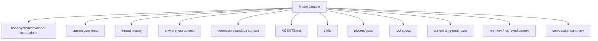
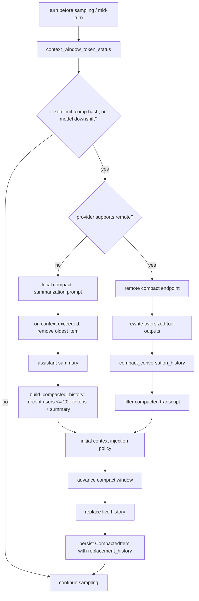
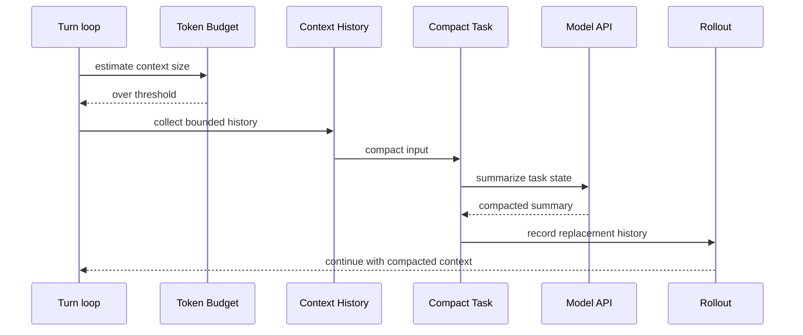

# 03 Context 构建与压缩

> 源码基线：`upstream/main@283bc4cf01`，复核日期：2026-06-24。

## 研究目标

生产级 agent 的难点不是“把用户消息发给模型”，而是准确控制模型看到什么。

本专题研究：

- context 由哪些片段组成？
- 历史、instructions、环境、权限、skills、plugins 如何注入？
- 什么时候触发 compact？
- compact 后如何保持任务连续性？
- 哪些内容必须有硬上限？

## 源码地图

| 文件/目录 | 关注点 |
| --- | --- |
| `codex-rs/core/src/context/` | 各类 context fragment。 |
| `codex-rs/core/src/context_manager/` | history、updates、normalization。 |
| `codex-rs/core/src/session/turn_context.rs` | 单 turn 的上下文配置。 |
| `codex-rs/core/src/compact.rs` | 本地 compact 逻辑。 |
| `codex-rs/core/src/compact_remote.rs` | remote compact。 |
| `codex-rs/core/src/session/token_budget.rs` | token budget。 |
| `codex-rs/core/src/session/rollout_budget.rs` | rollout budget。 |
| `codex-rs/core/src/session/context_window.rs` | context window 与 auto-compact scope 的统一计数。 |
| `codex-rs/core/src/agents_md.rs` | `AGENTS.md` 加载。 |
| `codex-rs/core/src/skills.rs` | skills 注入。 |

## Context 来源



## 核心数据结构与实现入口

| 概念 | 代码入口 | 作用 |
| --- | --- | --- |
| `ContextualUserFragment` | `codex-rs/core/src/context/mod.rs` 与 `codex-rs/core/src/context/*` | 把“环境、权限、skill、hook 附加上下文”等内部片段转换为模型可见的 user-role fragment。它是上下文注入的统一接口。 |
| `TurnContext` | `codex-rs/core/src/session/turn_context.rs` | 单个 turn 的配置快照，包含 model、provider、cwd、权限、tools、skills、插件、环境等。 |
| `TurnContextItem` | `codex-rs/core/src/session/turn_context.rs`、`codex-rs/protocol/src/protocol.rs` | 可持久化的 turn 上下文基线。resume、compact、rollout 重建都依赖它判断“本 turn 与上一 turn 哪些上下文变了”。 |
| `ContextManager` | `codex-rs/core/src/context_manager/` | 维护 conversation history，并负责记录、截断、规范化和替换历史。 |
| `record_context_updates_and_set_reference_context_item` | `codex-rs/core/src/session/mod.rs` | 在真实 user turn 开始时记录上下文增量或完整重注入，并设置新的 reference context。 |
| `run_pre_sampling_compact` / `run_auto_compact` | `codex-rs/core/src/session/turn.rs` | 在发模型请求前或中途发现 token 超限时触发压缩。 |
| `run_inline_auto_compact_task` | `codex-rs/core/src/compact.rs` | 本地模型压缩路径：构造 compact prompt、生成 summary、替换历史。 |
| `run_inline_remote_auto_compact_task` | `codex-rs/core/src/compact_remote.rs` | provider 支持 remote compaction 时走远端压缩端点。 |
| `rollout_reconstruction` | `codex-rs/core/src/session/rollout_reconstruction.rs` | 从 rollout 日志重建历史和 reference context，是 resume 能力的关键。 |

可以把上下文系统理解成三层：第一层是“当前 turn 的事实快照”`TurnContext`；第二层是“模型实际看到的历史”`ContextManager`；第三层是“可恢复的审计日志”rollout。深度研究要同时解释这三层，否则只能看到 prompt 拼接，看不到为什么 resume 和 compact 不会把任务状态弄丢。

## 上下文治理原则

### 1. 来源分层

不同来源不能混在一起：

- 系统/开发者规则是高优先级规则。
- 用户输入是任务目标。
- 文件、网页、MCP、插件输出是外部内容，必须当作不可信数据。
- tool result 是事实观察，但也可能包含外部不可信文本。

### 2. 大小有界

任何进入模型上下文的内容都应有硬上限：

- tool output 截断。
- skill metadata budget。
- feedback upload subtree cap。
- memory / RAG top-k。
- realtime startup context budget。

### 3. 增量更新

频繁重写历史会破坏缓存和推理连续性。近期历史演进强调：

- incremental thread history。
- response item IDs。
- compacted replacement history IDs。
- turn-scoped context contributions。

### 4. 压缩保真

compact 不是摘要文章，而是保留继续任务所需的状态：

- 用户目标。
- 已完成步骤。
- 文件改动。
- 未解决问题。
- 关键命令结果。
- 当前计划。

## 技术原理：为什么要做增量上下文

Codex 不把所有规则每次都无脑重新塞进模型请求，原因有三个。

第一，模型侧缓存依赖稳定前缀。上下文如果每 turn 大幅重排，provider 的 prompt cache 命中会变差，长线程成本和延迟都会上升。

第二，某些上下文是“状态”，不是“消息”。比如 cwd、sandbox、approval policy、AGENTS.md、skills、插件选择，它们在用户眼里是当前运行条件；如果只作为普通消息写进历史，resume 后很难判断哪些仍然有效、哪些已经过期。

第三，压缩会切断旧历史。压缩之后必须知道哪些基础上下文需要重新注入，哪些可以靠 `TurnContextItem` 的 reference baseline 恢复。`record_context_updates_and_set_reference_context_item` 的作用就是把“上下文 diff”变成持久化边界。

因此，context 不是一段 prompt，而是一个受版本、预算、权限和持久化约束管理的状态机。

## 压缩算法详解

Codex 的 compact 不是“把历史交给模型总结”这么简单。它更像一个五段式算法：

```text
detect pressure
  -> choose local / remote implementation
  -> prepare compact input
  -> produce compacted replacement history
  -> install replacement history and repair context baseline
```

### 1. 触发条件：token pressure 和模型切换

触发入口在 `run_pre_sampling_compact` 和 turn 中途的 `run_auto_compact`。当前核心判断收敛在 `context_window_token_status`，返回 `ContextWindowTokenStatus`。

```text
active_context_tokens = sess.get_total_token_usage()

if scope == Total:
    scope_tokens = active_context_tokens
    scope_limit = model_info.auto_compact_token_limit()
    full_context_window_limit = None

if scope == BodyAfterPrefix:
    window = sess.auto_compact_window_snapshot()
    baseline = window.prefill_input_tokens.unwrap_or(active_context_tokens)
    scope_tokens = active_context_tokens - baseline
    scope_limit = config.model_auto_compact_token_limit
                  or model_info.auto_compact_token_limit()
    full_context_window_limit = model_context_window

token_limit_reached =
    scope_tokens >= scope_limit
    or active_context_tokens >= full_context_window_limit
```

当前结构还显式保存 `tokens_until_compaction`、`auto_compact_window_prefill_tokens` 和 `full_context_window_limit_reached`。这使调用方能区分 body scope 剩余额度与完整模型窗口剩余额度，避免把局部 compact 阈值误报成整个 context window。

这里有两个重要取舍：

- `Total` 按完整上下文计数，简单直接，但每次 prefix 变动都会影响预算。
- `BodyAfterPrefix` 把稳定前缀当作 baseline，只计算 compact window 内新增 body，更适合长线程和 prompt cache。

除了 token pressure，`maybe_run_previous_model_inline_compact` 还会在两种模型切换场景触发 pre-turn compact：

- `comp_hash` 变化：说明新旧模型的压缩兼容性不同，需要先用旧模型上下文压缩。
- model downshift：切到更小 context window 的模型时，如果当前历史超过新窗口，就先用旧模型压缩到可承载状态。

### Session budget 与 context window

`session/rollout_budget.rs` 保留了历史文件名，但预算耗尽对外返回 `CodexErr::SessionBudgetExceeded`。它约束整段 agent session 的累计使用，不应再描述成单个 rollout 文件限制：

1. context window / auto-compact 阈值通常通过压缩继续运行；
2. session budget 耗尽会终止 session，并向客户端暴露 `SessionBudgetExceeded`。

### 2. 实现选择：remote 优先，本地兜底

`run_auto_compact` 根据 provider 能力选择实现：

```text
if provider.supports_remote_compaction():
    if Feature::RemoteCompactionV2:
        run remote_v2 compact
    else:
        run remote compact
else:
    run local compact through Responses API
```

这不是单纯性能优化。remote compact 的输出可以是一个由服务端 compaction endpoint 生成的 replacement transcript；local compact 则需要在客户端侧构造 summarization prompt，再把最后一条 assistant summary 转成 replacement history。

### 3. Local compact：Memento 策略

本地压缩的策略在 analytics 里记为 `CompactionStrategy::Memento`。它的行为可以用伪代码描述：

```text
input = SUMMARIZATION_PROMPT or config.compact_prompt
history = clone current history
history.append(input as synthetic user message)

loop:
    prompt = base_instructions + history.for_prompt(...)
    result = model.responses(prompt, kind=Compaction)

    if completed:
        break

    if ContextWindowExceeded and prompt has more than one item:
        history.remove_first_item()
        reset retries
        continue

    if retryable stream error and retries remain:
        backoff and retry with same ModelClientSession
        continue

    fail compact

summary_suffix = last assistant message from original session history
summary_text = SUMMARY_PREFIX + "\n" + summary_suffix
user_messages = collect_user_messages(original history, excluding old summaries)
new_history = build_compacted_history(user_messages, summary_text)
install new_history
```

几个细节值得注意：

- compact prompt 是 synthetic user input，不是普通用户消息，但会进入 compact request。
- 如果 compact request 自己超出上下文，算法删除最旧 history item，而不是删除最新消息。这样保留近期状态，也尽量保留 prefix cache。
- retry 使用同一个 `ModelClientSession`，保留 turn-scoped sticky routing / websocket incremental state。
- summary 最终被编码成 user-role message，且带 `SUMMARY_PREFIX`。这是为了让后续 history reconstruction 和 `collect_user_messages` 能识别“这是摘要，不是真实用户消息”。

### 4. Replacement history 构造算法

`build_compacted_history_with_limit` 决定压缩后到底保留哪些真实用户消息。

```text
selected = []
remaining = COMPACT_USER_MESSAGE_MAX_TOKENS  // 20_000

for message in user_messages reversed:       // 从最近用户消息往前扫
    if remaining == 0:
        break

    tokens = approx_token_count(message)
    if tokens <= remaining:
        selected.push(message)
        remaining -= tokens
    else:
        selected.push(truncate_text(message, remaining tokens))
        break

reverse(selected)
history = initial_context + selected_as_user_messages + summary_user_message
```

这个算法体现了两个原则：

- 最近真实用户意图优先。越靠近当前 turn 的用户消息越可能包含仍然有效的目标和约束。
- 摘要总是最后进入 replacement history。后续模型看到的是“保留的近期用户输入 + 压缩摘要”，而不是一个孤立摘要。

这里的 token 计数是近似值，来自 `approx_token_count`，不是精确 tokenizer。它足够用于预算保护，但不能当作严格计费数字。

### 5. Remote compact：先压输入，再过滤输出

remote compact 的关键差异是：服务端返回的是 compacted transcript，而不是单条 summary。客户端仍要做两件事。

第一，发送 remote compact 前先尽量让输入 fit context window：

```text
while estimated_tokens(base_instructions + history) > context_window:
    scan history from newest to oldest
    find a rewritable output item:
        FunctionCallOutput -> "Output exceeded..."
        CustomToolCallOutput -> "Output exceeded..."
        ToolSearchOutput -> empty tools
    replace it
    recompute estimate
```

这一步叫 `trim_function_call_history_to_fit_context_window`。它优先重写工具输出，而不是删除用户消息，因为工具输出经常很大，而且可以用“输出已截断”的事实占位。

第二，remote compact 返回后，客户端过滤不该保留的 item：

```text
drop developer messages
keep real user messages and hook prompts
keep assistant messages
keep compaction/context-compaction items
drop raw reasoning/tool call/tool output/search/image/web call items
inject canonical initial context if this is mid-turn compact
```

过滤的根本原因是 remote output 不能被完全信任为当前 canonical context。比如 developer messages 可能是旧的、重复的 instruction；tool output 和 raw reasoning 可能过大或不适合再次进入 live history。

### 6. Initial context 插入规则

compact 会替换历史，因此必须决定当前环境、权限、AGENTS.md、skills 等 initial context 如何回到模型上下文。`InitialContextInjection` 有两种模式：

| 模式 | 使用场景 | 行为 |
| --- | --- | --- |
| `DoNotInject` | pre-turn / manual compact | replacement history 不放 initial context，并清空 `reference_context_item`。下一次 regular turn 会完整重注入。 |
| `BeforeLastUserMessage` | mid-turn compact | 立刻把 initial context 插入 replacement history，且记录新的 `TurnContextItem` baseline。 |

mid-turn compact 的插入位置由 `insert_initial_context_before_last_real_user_or_summary` 决定：

```text
prefer insert before last real user message
else before last summary-like user message
else before last compaction item
else append to end
```

这条规则看起来绕，是为了同时满足两个约束：

- 模型训练期望 mid-turn compaction item / summary 保持在特定尾部语义。
- 压缩后继续采样时，模型仍必须看到当前 canonical initial context。

### 7. 安装与可恢复性

压缩结果不是只改内存。成功后会：

- `advance_auto_compact_window`，生成新的 window number / window id。
- `replace_compacted_history`，用 replacement history 替换当前 live history。
- 写入 `CompactedItem`，其中包含 `replacement_history`、`window_number`、`window_id`。
- `recompute_token_usage`，让后续 token pressure 基于新历史计算。
- remote compact 还会记录 rollout trace checkpoint，把 compact input history 和 installed replacement history 分开记录。

这就是为什么 compact 能和 resume 共存：恢复时不是重新猜测摘要，而是从 rollout 读取当时安装过的 replacement history。

### 压缩算法总图



## 关键实现路径

一次普通 user turn 中，上下文路径大致是：

```text
UserTurn
  -> build TurnContext
  -> run_pre_sampling_compact
  -> record_context_updates_and_set_reference_context_item
  -> build_skills_and_plugins
  -> build tool specs
  -> model request input = compacted/live history + current turn injections
  -> record model output/tool output
  -> maybe run_auto_compact mid-turn
```

压缩路径的关键点：

- `context_window_token_status` 同时看 full active context 和 configured auto-compact scope。
- local compact 通过 `build_compacted_history` 把旧 user messages 与 summary 组织成 replacement history。
- remote compact 会对 provider 返回的 compacted transcript 做过滤，只保留允许进入历史的 item。
- compact 成功后调用 `replace_compacted_history`，并写入 `RolloutItem::Compacted`，包括 replacement history、window number、window id。
- mid-turn compact 与 pre-turn compact 对 initial context 的插入位置不同：mid-turn 要让 compact item 保持模型训练期望的末尾语义。

## 演进线索

这条线的演进重点不是“更会总结”，而是“更可恢复、更少 cache miss、更少上下文污染”：

- 从完整重注入走向 `TurnContextItem` baseline + diff。
- 从本地摘要走向 remote compaction，并保留本地 fallback。
- 从只保存 summary 走向保存 replacement history，让 resume/replay 能还原压缩后的模型输入。
- 从简单 token 计数走向 auto-compact window，区分 full context 与 body-after-prefix 等作用域。
- 从隐式 prompt 拼接走向 `ContextualUserFragment`，让每类内部上下文都有边界和测试面。

## 验证方法

读这部分代码时，不要只看最终 request JSON。建议按下面几类测试验证：

- 上下文增量：看 `record_context_updates_and_set_reference_context_item_*` 测试，确认 steady state 不重复注入，baseline 缺失时会完整重注入。
- 压缩保真：看 `compact_tests.rs`、`compact_remote` 相关测试，确认 replacement history、summary、initial context 插入位置。
- resume/replay：看 `rollout_reconstruction_tests.rs`，确认 compact 之后仍能重建 live history。
- token budget：构造长输出和长线程，观察是否触发 pre-sampling 或 mid-turn compact。
- 外部内容边界：检查 tool output、MCP resource、AGENTS.md 是否以不可信内容处理，并且有截断策略。

## Compact 流程



## 深挖问题

1. 哪些 context fragment 是每 turn 都注入，哪些只在变化时注入？
2. `AGENTS.md` 的加载范围如何确定？
3. skills 和 plugins 的注入如何避免撑爆上下文？
4. compact 请求本身如何避免过大？
5. compact 后的 history 如何保持 item ID 和 resume 能力？
6. tool output 截断对模型继续执行有什么影响？

## 实验建议

做一个上下文审计表：

| 输入片段 | 来源 | 信任级别 | 上限 | 是否持久化 |
| --- | --- | --- | --- | --- |
| 用户消息 | UI | 用户数据 | 有 | 是 |
| `AGENTS.md` | 文件系统 | 项目规则 | 有 | 可重建 |
| tool output | shell/MCP | 外部观察 | 有 | 是 |
| skill metadata | skill catalog | 半可信 | 有 | 可重建 |
| compact summary | 模型 | 派生状态 | 有 | 是 |

然后选一次真实 turn，追踪最终模型请求中每一段来自哪里。
