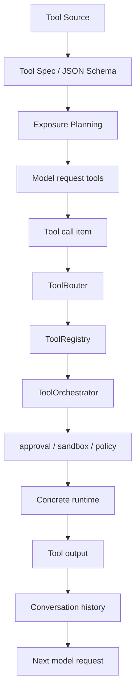
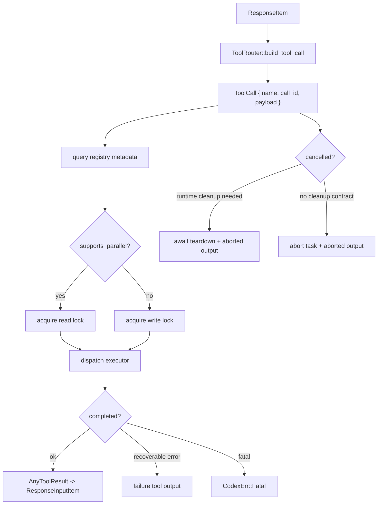

# 04 Tool System

> 源码基线：`upstream/main@283bc4cf01`，复核日期：2026-06-24。

## 研究目标

Codex 的工具系统要把很多来源统一成模型可调用能力：

- shell。
- apply_patch。
- MCP tools。
- dynamic tools。
- plugins。
- skills 依赖。
- multi-agent tools。
- image/web/search/current-time 等内置能力。

研究目标是理解工具从“声明”到“执行结果回到模型”的完整路径。

## 源码地图

| 文件/目录 | 关注点 |
| --- | --- |
| `codex-rs/core/src/tools/` | core 内部工具路由、注册、编排。 |
| `codex-rs/tools/src/` | tool spec、schema、dynamic tool、Responses API adapter。 |
| `codex-rs/core/src/function_tool.rs` | function/custom tool 处理。 |
| `codex-rs/core/src/mcp_tool_call.rs` | MCP tool call runtime。 |
| `codex-rs/core/src/mcp_tool_exposure.rs` | MCP tool 暴露策略。 |
| `codex-rs/core/src/apply_patch.rs` | patch 工具接入。 |
| `codex-rs/core/src/session/multi_agents.rs` | multi-agent tool。 |

## 工具生命周期



## 核心数据结构与实现入口

| 概念 | 代码入口 | 作用 |
| --- | --- | --- |
| `ToolSpec` | `codex-rs/tools/src/tool_spec.rs` | 模型可见的工具描述，覆盖 function、namespace、freeform、hosted tool、tool search 等形态。 |
| `LoadableToolSpec` | `codex-rs/tools/src/responses_api.rs` | 面向 Responses API 的工具加载结构，可合并 namespace。 |
| `ToolExecutor` | `codex-rs/tools/src/tool_executor.rs` 与 `codex-rs/core/src/tools/registry.rs` | 工具运行时抽象：同一个 spec 最终对应一个 executor。 |
| `ToolRegistry` | `codex-rs/core/src/tools/registry.rs` | 运行时注册表，根据 tool name/namespace 找到 executor，并记录并行能力、取消语义等。 |
| `ToolRouter` | `codex-rs/core/src/tools/router.rs` | 把模型输出的 `ResponseItem` 解析成内部 `ToolCall`，再分发给 registry。 |
| `ToolCallRuntime` | `codex-rs/core/src/tools/parallel.rs` | 负责串行/并行执行、取消、失败包装和 tool output 回写。 |
| `create_core_tool_plan` | `codex-rs/core/src/tools/spec_plan.rs` | 根据 turn context、features、MCP、plugins、dynamic tools 生成“模型可见工具列表 + registry”。 |
| `McpHandler` | `codex-rs/core/src/tools/handlers/mcp.rs` | MCP tool 的 spec 创建、审批、调用和结果转换。 |

工具系统最容易误解的一点是：模型看到的是 `ToolSpec`，但真正运行的是 `ToolExecutor`。二者不是一回事。spec 是“给模型的接口与提示”，executor 是“对系统资源的动作”。中间的 plan/router/registry 是隔离层。

## 工具来源

| 来源 | 特点 | 风险 |
| --- | --- | --- |
| Built-in | Codex 自带，schema 稳定 | 可能有副作用，如 shell/patch。 |
| MCP | 外部 server 提供 | schema 质量、OAuth、资源污染、超时。 |
| Dynamic tools | 会话中动态发现或延迟暴露 | namespace、缓存、上下文大小。 |
| Plugins | marketplace 或本地插件 | install trust、capability、auth filtering。 |
| Skills | prompt + refs + dependencies | 可能注入大量文本或触发依赖工具。 |
| Multi-agent | spawn/wait/close/followup | 成本、上下文隔离、结果汇总。 |

## 工具设计的关键约束

### 1. Schema 要适合模型

Schema 既是接口，也是 prompt。过于宽泛会让模型填错参数；过于复杂会浪费上下文。

### 2. Tool result 要双向可读

工具结果既要给用户看，也要给模型继续推理。生产系统常需要：

- raw output。
- summarized display。
- structured output。
- truncation marker。
- error category。

### 3. 副作用必须显式

读文件、查资料、执行 shell、写文件、发网络请求、安装插件的风险不同。工具系统必须知道哪些工具需要审批或沙箱。

### 4. 命名空间必须稳定

MCP、plugins、dynamic tools 都可能产生同名工具。近期演进强调 explicit namespace，是为了避免模型调用歧义。

## 技术原理：工具暴露是一个规划问题

工具不是全部暴露给模型就结束。Codex 要在每个 turn 做一次 tool planning：

- features 决定 shell、unified exec、apply_patch、web/search/image、多 agent 等是否可用。
- permission profile 决定是否暴露需要审批或需要沙箱的能力。
- MCP catalog 决定哪些 server 已连接、哪些 tool 可见、哪些 tool 需要 tool search 后延迟暴露。
- plugins/apps/connectors 决定额外 namespace、auth 过滤和 approval reviewer。
- model 能力决定工具形态，例如 namespace tool、freeform tool、hosted tool 是否支持。

因此 `spec_plan.rs` 的核心价值不是“拼列表”，而是把产品配置、模型能力、安全策略、外部工具目录折叠成一个一致的 tool surface。

### Code Mode host 握手

当前 Code Mode host 边界在 `codex-rs/code-mode-protocol/src/host/` 中定义了显式协议：

```text
client -> connection/hello
host   -> connection/ready | connection/rejected
client -> session/open
host   -> session/ready
client -> session/close
host   -> session/closed
```

`ClientHello` 声明协议版本、required capabilities 与 optional capabilities，并拒绝 required/optional 重叠。这样 host/client 会在工具或 session 语义不兼容时 fail fast，而不是带着错误假设继续执行。

## 工具调度算法

模型输出 tool call 以后，Codex 并不是直接同步调用函数。`ToolCallRuntime` 会把每次调用放进一个受并行策略、取消策略和错误语义约束的小调度器。

### 1. ToolCall 解析

`ToolRouter::build_tool_call` 将不同 `ResponseItem` 归一成内部 `ToolCall`：

```text
FunctionCall{name, namespace, arguments, call_id}
  -> ToolName(namespace, name)
  -> ToolPayload::Function(arguments)

ToolSearchCall{execution="client", arguments, call_id}
  -> ToolName("tool_search")
  -> ToolPayload::ToolSearch(parsed arguments)

CustomToolCall{name, input, call_id}
  -> ToolName(name)
  -> ToolPayload::Custom(input)

server-side ToolSearchCall or unrelated item
  -> ignored by client router
```

这一步的原则是：模型协议里的多种 call item 先变成统一的 `{tool_name, call_id, payload}`，后续 runtime 不再关心它来自 function、custom 还是 tool_search。

### 2. 并行控制

`ToolCallRuntime` 内部持有一个 `RwLock<()>`：

```text
supports_parallel = router.tool_supports_parallel(call)

spawn tool task:
    if supports_parallel:
        acquire read lock
    else:
        acquire write lock

    dispatch to registry
```

这个设计相当巧妙：

- 多个 read lock 可以同时存在，所以 read-only 或显式支持并行的工具可以并发执行。
- write lock 独占，所以有副作用或未声明可并行的工具会串行执行。
- 并行能力由 registry/executor 提供，模型自己不能决定“我这个工具可以并行”。

因此并行不是“模型说 parallel_tool_calls 就都并行”。模型能力只允许它发出并行调用；实际执行还要看每个工具 runtime 的并行声明。

### 3. 取消语义

工具取消分两类：

```text
if cancellation arrives:
    if terminal outcome already reached:
        await tool result
    else if tool_waits_for_runtime_cancellation:
        mark terminal outcome owned by abort path
        await runtime teardown
        return synthetic aborted output
    else:
        abort tokio task
        return synthetic aborted output
```

为什么有 `waits_for_runtime_cancellation`？因为 shell、PTY、远程执行这类工具需要清理进程树或远端状态。如果直接 abort future，底层进程可能还在跑。这个标志让 runtime 有机会完成 teardown，同时模型收到一个明确的 aborted tool output。

### 4. 错误转换

工具错误会被分成两类：

| 错误类型 | 处理方式 | 模型是否继续 |
| --- | --- | --- |
| `FunctionCallError::Fatal` | 转成 `CodexErr::Fatal` | 通常终止 turn。 |
| 其它 `FunctionCallError` | 转成 tool output，`success=false` | 模型继续看到失败原因。 |

转换成 tool output 时还会按 payload 类型选输出形态：

- `ToolSearch` 失败返回空 tools。
- `CustomToolCall` 失败返回 `CustomToolCallOutput`。
- 普通 function 失败返回 `FunctionCallOutput`。

这体现了一个 agent runtime 原则：可恢复错误应该回到模型上下文，让模型决定改参、换工具或解释失败；只有 runtime 无法继续的错误才升级为 fatal。

### 5. 调度总图



## 关键实现路径

一次工具调用的代码路径可以按两段读：

```text
构建阶段:
TurnContext
  -> create_core_tool_plan
  -> ToolSpec list sent to model
  -> ToolRegistry kept in runtime

执行阶段:
ResponseItem::FunctionCall / CustomToolCall / McpToolCall
  -> ToolRouter::build_tool_call
  -> ToolCallRuntime::handle_tool_call
  -> ToolRouter::handle_tool_call_with_source
  -> ToolExecutor::handle
  -> ResponseInputItem::*ToolCallOutput
  -> next model request
```

并行执行的规则在 `ToolCallRuntime`：支持并行的工具可以同时跑，不支持的工具会通过锁串行化。MCP 的并行能力还会参考 server opt-in 与 read-only hint。这个设计避免了两个写操作互相踩状态，同时允许纯读取工具减少等待。

工具失败也不是单一异常：解析参数失败、找不到工具、审批拒绝、沙箱拒绝、运行时超时、MCP server error 都会被转换成模型可继续理解的 tool output 或终止事件。

## 演进线索

工具系统的演进可以看成三个方向：

- 从少量内置 function tool，扩展到 namespace/freeform/hosted tool/dynamic tool 的多形态接口。
- 从 eager exposure 走向 tool search 和 deferred exposure，减少模型上下文里的工具 schema 膨胀。
- 从“调用即运行”走向 registry/router/runtime 分层，把审批、并行、取消、来源追踪、MCP 适配都收敛到统一路径。

## 验证方法

建议用四类实验覆盖工具系统：

- spec 实验：打印一次模型请求的 tools，确认哪些工具暴露、namespace 是否合并、schema 是否被 sanitization。
- 路由实验：构造 function/custom/MCP 三种 `ResponseItem`，看 `ToolRouter::build_tool_call` 如何解析。
- 并行实验：用一个 read-only MCP tool 和一个写工具，验证并行标记对执行顺序的影响。
- 错误实验：分别触发参数 JSON 错误、未知工具、审批拒绝、timeout，观察它们进入 history 的 tool output 是否不同。

## 深挖问题

1. 模型请求里的工具列表由谁构建？
2. 延迟工具和 direct model tools 有什么区别？
3. MCP tool schema 为什么需要 sanitization？
4. read-only 工具为什么可以并行？
5. tool search 如何减少上下文压力？
6. 工具失败时，系统如何区分可恢复错误和 fatal error？

## 实验建议

选一个具体工具追踪：

```text
模型输出 tool call
  -> 内部 ToolCall
  -> registry lookup
  -> approval/sandbox decision
  -> runtime execute
  -> tool output item
  -> next model input
```

建议从 shell 或 MCP tool 开始，因为它们同时涉及 schema、执行、审批、输出和错误处理。
