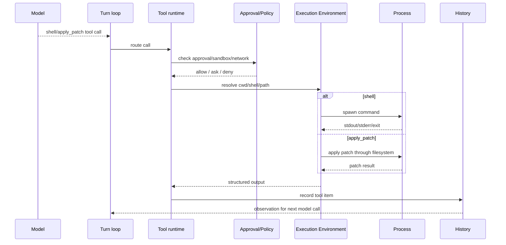
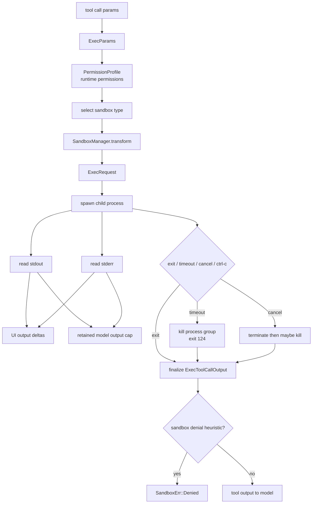
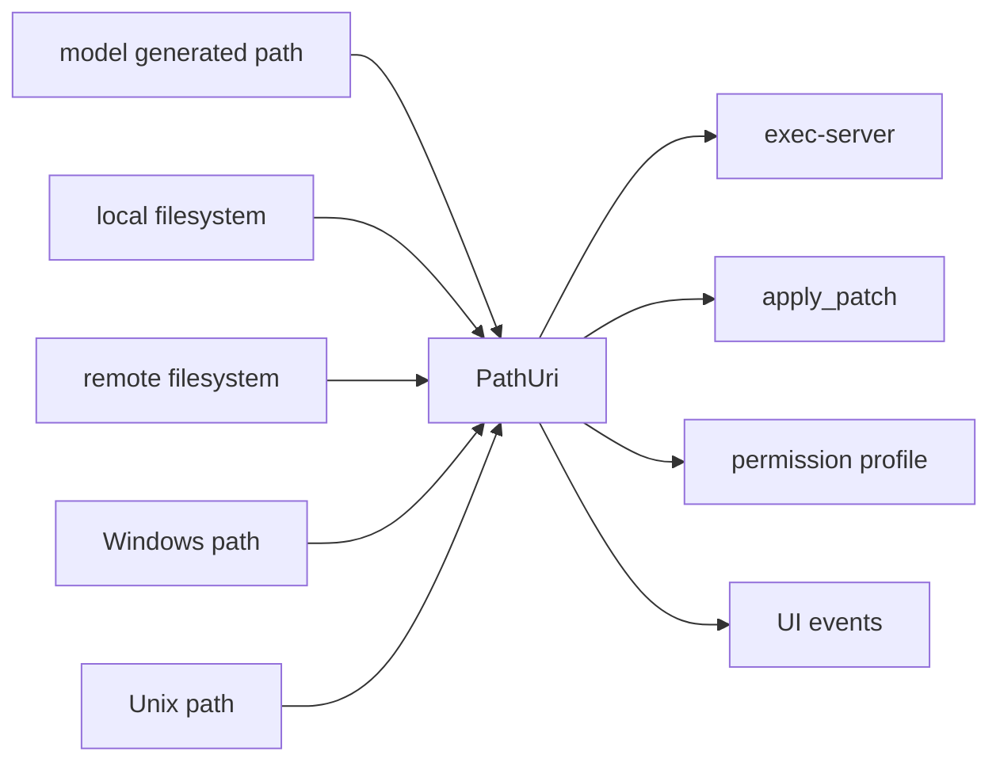

# 05 Shell、Patch 与执行环境

> 源码基线：`upstream/main@283bc4cf01`，复核日期：2026-06-24。

## 研究目标

Coding agent 和普通聊天 agent 最大的区别是：它会真实操作代码库。

本专题研究：

- shell 命令如何从模型 tool call 变成进程执行？
- `apply_patch` 为什么是特殊路径？
- stdout/stderr、exit code、timeout、stdin、PTY 如何处理？
- 本地执行和 remote exec-server 如何统一？
- PathUri 为什么重要？

## 源码地图

| 文件/目录 | 关注点 |
| --- | --- |
| `codex-rs/core/src/exec.rs` | core shell 执行入口。 |
| `codex-rs/core/src/shell.rs` | shell command 辅助逻辑。 |
| `codex-rs/core/src/unified_exec/` | unified exec runtime。 |
| `codex-rs/shell-command/` | shell command 数据结构。 |
| `codex-rs/apply-patch/` | patch parser/application。 |
| `codex-rs/core/src/apply_patch.rs` | patch tool 与 core 的连接。 |
| `codex-rs/exec-server/` | 独立/远程执行服务。 |
| `codex-rs/utils/path-uri/` | 跨环境 path 表达。 |

## 执行链路



## 核心数据结构与实现入口

| 概念 | 代码入口 | 作用 |
| --- | --- | --- |
| `ShellCommandToolCallParams` | `codex-rs/protocol/src/models.rs` | 模型 shell tool call 的参数形态。 |
| `ExecParams` / exec runtime | `codex-rs/core/src/exec.rs` | shell 执行入口，承接 cwd、env、timeout、sandbox、capture policy。 |
| `UnifiedExecProcessManager` | `codex-rs/core/src/unified_exec/`、`codex-rs/core/src/state/service.rs` | 管理 unified exec 会话和进程生命周期。 |
| `UnifiedExecFeatureMode` / `UnifiedExecShellMode` | `codex-rs/tools/src/tool_config.rs` | 决定使用 legacy shell、direct unified exec，还是 zsh fork 模式。 |
| `apply_patch` crate | `codex-rs/apply-patch/src/lib.rs` | patch 解析、路径解析、hunk 应用、stdout/stderr summary。 |
| `maybe_parse_apply_patch_verified` | `codex-rs/apply-patch/src/lib.rs` | 从 shell-like 调用中识别合法 apply_patch invocation。 |
| `PathUri` | `codex-rs/utils/path-uri/` | 表达本地/远程/跨平台路径，避免把字符串路径误用于错误环境。 |
| `exec-server` | `codex-rs/exec-server/` | 把文件系统和执行环境抽象成可远程调用的服务。 |

## Shell 的复杂点

### 命令不是字符串那么简单

系统需要理解：

- cwd。
- shell 类型。
- login shell。
- environment。
- timeout。
- stdin。
- output truncation。
- safe command detection。
- approval escalation。

### 输出必须被治理

无限 stdout 会撑爆上下文，所以需要：

- streaming 给 UI。
- bounded output 给模型。
- truncation warning。
- raw output 在特定模式保留。

### 进程生命周期要可控

要处理：

- interrupt。
- cancellation token。
- dropped process。
- stdin write recovery。
- Windows process tree。
- remote disconnect。

## 技术原理：执行环境是“能力边界”，不是 shell 包装

Codex 的 shell 工具真正要保证四件事：

- 可观察：stdout、stderr、exit status、timeout、stream chunk 都要能给 UI 和模型使用。
- 可限制：执行前必须知道 cwd、环境变量、文件系统权限、网络权限、审批结果。
- 可恢复或可失败：长命令、PTY、stdin、remote exec 断开时要有明确状态，而不是静默丢失。
- 可跨平台：Unix shell、PowerShell、Windows sandbox、remote filesystem 都不能靠同一套字符串假设。

所以实现上会把“模型生成的命令”尽早转换成结构化参数，再交给 policy、sandbox、exec runtime，而不是直接 `sh -c`。

## Exec 执行算法

legacy shell 执行的核心入口是 `codex-rs/core/src/exec.rs`。它的职责可以拆成三段：请求转换、进程消费、结果归一化。

### 1. 请求转换：portable exec 到 sandboxed request

`process_exec_tool_call` 先调用 `build_exec_request`，再进入统一 sandbox execution path：

```text
process_exec_tool_call(params, permission_profile, sandbox_cwd, ...)
  -> build_exec_request(...)
       -> permission_profile.to_runtime_permissions()
       -> select_process_exec_tool_sandbox_type(
            file_system_sandbox_policy,
            network_sandbox_policy,
            windows_sandbox_level,
            enforce_managed_network
          )
       -> apply network proxy env if present
       -> split command into program + args
       -> convert cwd and sandbox_cwd to PathUri
       -> SandboxManager.transform(SandboxTransformRequest)
       -> ExecRequest::from_sandbox_exec_request(...)
       -> resolve Windows sandbox filesystem overrides
  -> sandboxing::execute_env(exec_req, stdout_stream)
```

这里有两个重要设计：

- `ExecParams` 是模型/tool 层的执行意图，包含 command、cwd、env、timeout、capture policy、sandbox permissions、network proxy 等。
- `ExecRequest` 是已经过 permission profile 和 sandbox backend 选择后的实际执行请求。也就是说，sandbox 不是 spawn 后补救，而是在命令成形前就参与 argv/env/cwd 转换。

### 2. 进程消费：stdout/stderr 要同时服务 UI 和模型

真正 spawn 后，`consume_output` 会把 stdout 和 stderr 分别读出：

```text
exec(params)
  -> spawn_child_async(program, args, cwd, env, stdio=RedirectForShellTool)
  -> consume_output(child, expiration, capture_policy, stdout_stream)

consume_output(child)
  -> take stdout pipe and stderr pipe
  -> spawn read_output(stdout)
  -> spawn read_output(stderr)
  -> wait for one of:
       child exits
       timeout expires
       cancellation token fires
       ctrl-c
  -> on timeout:
       kill process group
       synthesize timeout exit status
  -> on cancellation:
       terminate process group
       wait short grace period
       escalate to kill if needed
  -> await stdout/stderr readers with IO_DRAIN_TIMEOUT_MS
  -> aggregate stdout/stderr under retained byte cap
```

`read_output` 有两个并行目标：

- 发送 `ExecCommandOutputDelta` 给 UI，让用户实时看到 stdout/stderr。
- 把输出保存进 `StreamOutput<Vec<u8>>`，供最终 tool output 给模型使用。

这两个目标不是同一个 buffer。UI delta 有 `MAX_EXEC_OUTPUT_DELTAS_PER_CALL` 上限；模型侧 retained output 有 `EXEC_OUTPUT_MAX_BYTES` 上限。这样大量输出不会把 event stream 或模型上下文撑爆。

### 3. 结果归一化：timeout、sandbox denial、exit code

`finalize_exec_result` 把 raw process result 转成 `ExecToolCallOutput`：

```text
finalize_exec_result(raw, sandbox_type, duration)
  -> if Unix signal == timeout signal:
       timed_out = true
  -> if other Unix signal:
       return SandboxErr::Signal
  -> exit_code = raw exit code or -1
  -> if timed_out:
       exit_code = 124
  -> decode stdout/stderr/aggregated_output as UTF-8 lossy
  -> build ExecToolCallOutput
  -> if timed_out:
       return SandboxErr::Timeout { output }
  -> if is_likely_sandbox_denied(sandbox_type, output):
       return SandboxErr::Denied { output }
  -> return output
```

`is_likely_sandbox_denied` 是启发式：如果没有 sandbox 或 exit code 为 0，就不是 sandbox denial；否则检查 stderr/stdout/aggregated output 是否包含常见 denial 关键词，并排除一些常见 shell 错误码。它不是完美判定，但能把“命令失败”和“被 sandbox 拦截”区分到足够可操作。

### Exec 状态图



## apply_patch 应用算法

`apply_patch` 的核心不在 shell，而在 `codex-rs/apply-patch/src/lib.rs` 和 `codex-rs/core/src/apply_patch.rs`。它把“文本 patch”变成“可审查、可 sandbox、可回滚分析的文件变更”。

### 1. 安全判定：auto approve / ask / reject

core 层先用 `assess_patch_safety` 判断 patch 是否允许：

```text
core apply_patch(turn_context, file_system_sandbox_policy, action)
  -> assess_patch_safety(
       action,
       approval_policy,
       permission_profile,
       file_system_sandbox_policy,
       action.cwd,
       windows_sandbox_level
     )
  -> AutoApprove:
       DelegateToRuntime(auto_approved=true/false, approval=Skip)
  -> AskUser:
       DelegateToRuntime(approval=NeedsApproval)
  -> Reject:
       return model-visible error "patch rejected: ..."
```

这解释了为什么 patch 不是普通 shell 命令：它可以在真正写文件前枚举目标文件变化，然后把这些变化交给审批和 sandbox policy。

### 2. Hunk 应用：按文件系统接口执行，而不是本地 path 假设

apply-patch crate 的执行路径：

```text
apply_patch(patch, cwd, stdout, stderr, fs, sandbox)
  -> parse_patch(patch)
     -> on parse error: write friendly stderr and return failure without delta
  -> apply_hunks(hunks, cwd, fs, sandbox)
     -> apply_hunks_to_files(...)
        -> for each hunk:
             resolve path against cwd as PathUri
             AddFile:
               read overwritten content if any
               write file, creating missing parent if needed
               push AppliedPatchChange::Add
             DeleteFile:
               ensure target is not directory
               read deleted content for delta
               remove file
               push AppliedPatchChange::Delete
             UpdateFile:
               read original contents
               derive new contents from chunks
               if move_path:
                 write destination
                 remove original
                 push AppliedPatchChange::Update(move_path=...)
               else:
                 write new contents
                 push AppliedPatchChange::Update
        -> print summary of added/modified/deleted paths
```

`fs: &dyn ExecutorFileSystem` 和 `sandbox: Option<&FileSystemSandboxContext>` 是关键。patch 可以落在本地、远程或 exec-server 暴露的文件系统上；同一个算法不依赖当前进程的本机 cwd。

### 3. Delta 精确性：失败也要知道写过什么

`AppliedPatchDelta` 记录已经提交的文本变更，`exact` 表示这份 delta 是否完全可信。源码里有一个细节：写失败可能已经截断目标文件再返回错误，所以 `try_write!` 遇到 write error 会把 `delta.exact = false`。删除失败也会检查失败是否无副作用。

因此 patch 失败不是一个简单的 `Err`：

```text
ApplyPatchFailure {
  error,
  delta: AppliedPatchDelta {
    changes: definitely committed changes,
    exact: whether the delta is complete
  }
}
```

这对生产级 agent 很重要：模型和 UI 需要知道“没有应用成功”和“部分文件可能已经被改过”是两种完全不同的恢复策略。

## 关键实现路径

shell 路径：

```text
Tool call params
  -> shell/apply_patch handler
  -> approval and exec policy
  -> resolve cwd/env/sandbox profile
  -> exec or unified_exec manager
  -> stream output to UI
  -> bounded output to model
  -> record ExecToolCallOutput
```

apply_patch 路径：

```text
Freeform patch or shell-like apply_patch
  -> verify invocation
  -> parse hunks
  -> resolve paths relative to PathUri cwd
  -> check sandbox filesystem access
  -> apply add/update/delete/move
  -> print changed-file summary
```

`apply_patch` 独立成 crate 的意义在于：它既可以作为 standalone executable 被 shell 调用，也可以作为内部工具在远程/沙箱文件系统里执行。这样同一份 patch 语义不依赖当前进程所在机器。

## apply_patch 为什么特殊

`apply_patch` 不是普通 shell：

- 它直接修改文件，风险高。
- patch 路径需要相对 cwd 解析。
- sandbox 和 permission 必须参与。
- 远程环境下不能假设本机 path。
- 结果要能清楚告诉模型哪些文件改了。

近期迁移把 apply_patch 走 executor/environment filesystem，本质是让 patch 能在远程和跨平台环境中保持同一语义。

## 演进线索

这条线可以按执行能力升级来看：

- 从普通 shell command，扩展到结构化 shell tool call。
- 从本地进程执行，扩展到 unified exec 与 remote exec-server。
- 从把 `apply_patch` 当 shell 命令，扩展到可验证、可沙箱、可远程文件系统执行的 patch runtime。
- 从字符串路径，迁移到 `PathUri`，让远程 cwd、Windows path、Unix path、模型 path 有统一边界。
- 从一次性 output，扩展到 streaming output + bounded model output。

## 验证方法

重点不是只看命令成功，而是看边界是否正确：

- 执行 `pwd` / `echo`，确认 cwd、shell mode、env policy。
- 执行大量输出命令，确认 UI 流式显示和模型输入截断不同步但一致可解释。
- 执行失败命令，确认 exit code/stderr 被结构化记录。
- 用 `apply_patch` 修改、删除、移动文件，确认 summary、sandbox access、路径解析。
- 在 Windows/Unix 路径样例上检查 `PathUri` 解析，确认不会把非本机 URI 当本机 path。

## PathUri 的作用



PathUri 解决的是“路径属于哪个环境”的问题。没有它，远程 cwd、Windows path、模型生成 path、本地 absolute path 很容易混成一团。

最新迁移进一步收紧了这个边界：

- legacy path 反序列化已被移除，不能再靠字符串形状猜成本机路径；
- selected plugin roots 保持 URI-native；
- executor skills 不再先转换成 host path；
- `view_image`、patch、shell 和 sandbox helper 必须绑定当前 step/world-state environment。

因此 `PathUri` 不是普通字符串包装，而是阻止 host path、executor path 与模型 path 串线的类型边界。

## 深挖问题

1. shell command 在模型请求中叫什么，在内部数据结构中叫什么？
2. approval 是在 spawn 前还是 spawn 后发生？
3. stdout/stderr 如何同时服务 UI 和模型？
4. apply_patch 的路径如何解析？
5. remote exec-server 断线时，进行中的命令如何恢复或失败？
6. PathUri 如何避免本地/远程 path 误用？

## 实验建议

做三条追踪：

1. `pwd`：最简单命令，观察 cwd 和输出。
2. `cat large-file`：观察输出截断。
3. `apply_patch` 修改一个文件：观察审批、sandbox、diff、history item。

把三条路径画成 sequence diagram，就能掌握执行环境主线。
