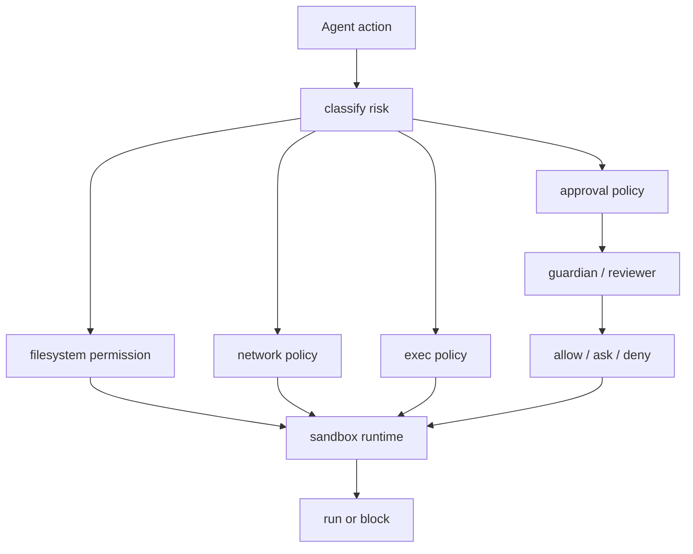
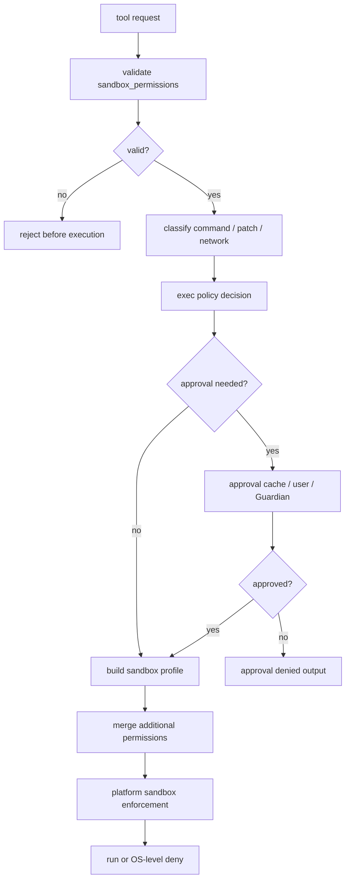

# 06 Sandbox、Permission 与安全策略

> 源码基线：`upstream/main@283bc4cf01`，复核日期：2026-06-24。

## 研究目标

Agent 能执行命令和改文件，就必须有安全边界。本专题研究 Codex 如何组合：

- approval policy。
- filesystem permission profile。
- sandbox。
- network policy。
- exec policy。
- Guardian / approval reviewer。
- Windows / Linux / macOS 差异。

## 源码地图

| 文件/目录 | 关注点 |
| --- | --- |
| `codex-rs/core/src/config/permissions.rs` | permission profile。 |
| `codex-rs/core/src/exec_policy.rs` | exec policy 检查。 |
| `codex-rs/core/src/network_policy_decision.rs` | 网络策略。 |
| `codex-rs/sandboxing/` | 通用 sandbox 抽象。 |
| `codex-rs/linux-sandbox/` | Linux Landlock/bwrap。 |
| `codex-rs/windows-sandbox-rs/` | Windows sandbox。 |
| `codex-rs/execpolicy/` | 命令策略实现。 |
| `codex-rs/core/src/guardian/` | Guardian review。 |

## 安全决策层次



## 核心数据结构与实现入口

| 概念 | 代码入口 | 作用 |
| --- | --- | --- |
| `PermissionProfile` | `codex-rs/protocol/src/models.rs`、`codex-rs/core/src/config/permissions.rs` | 文件系统、网络和 enforcement 的运行时权限画像。 |
| `SandboxPolicy` / `AskForApproval` | `codex-rs/protocol/src/protocol.rs` | 用户可理解的 sandbox/approval 配置层。 |
| `FileSystemSandboxPolicy` / `NetworkSandboxPolicy` | `codex-rs/protocol/src/permissions.rs` | 更低层的文件系统与网络策略表达。 |
| `ExecPolicy` | `codex-rs/core/src/exec_policy.rs`、`codex-rs/execpolicy/` | 判断某条命令是否安全、需要审批或禁止。 |
| `SandboxPermissions` | `codex-rs/core/src/sandboxing/mod.rs` | 单次工具调用对默认沙箱权限的覆盖请求。 |
| `policy_transforms` | `codex-rs/sandboxing/src/policy_transforms.rs` | 处理 additional permissions：把临时授权并入当前 permission profile。 |
| `GuardianApprovalRequest` | `codex-rs/core/src/guardian/`、`codex-rs/core/src/codex_delegate.rs` | 把危险审批路由给 reviewer/guardian。 |
| platform sandbox | `codex-rs/linux-sandbox/`、`codex-rs/windows-sandbox-rs/`、macOS seatbelt 调用点 | 把抽象策略落到操作系统约束。 |

## 关键概念

### Approval policy

决定是否需要问用户。它解决的是“是否授权这次动作”。

### Sandbox

限制进程实际能访问的资源。它解决的是“即使授权，也不能越界”。

### Exec policy

识别命令风险。它解决的是“这个命令看起来是否安全”。

### Network policy

限制网络目标和模式。它解决的是“进程能不能联网、能连哪里”。

### Guardian

让另一个 reviewer 审查危险审批请求。它解决的是“用户是否被迫理解复杂风险”的问题。

## 技术原理：审批和沙箱是两种不同控制

审批回答“这次动作是否被允许”，沙箱回答“即使动作被允许，进程最多能碰到什么”。二者必须同时存在：

- 只有审批没有沙箱：用户同意了 `npm test`，但测试脚本可能访问 workspace 外的文件或发网络请求。
- 只有沙箱没有审批：进程越不了界，但用户可能不知道 agent 正在删除 workspace 内的重要文件。
- 只有 exec policy 没有 sandbox：命令分类可能漏判 shell 内层命令、脚本副作用或平台差异。
- 只有 network policy 没有 proxy/enforcement：模型层知道不能联网，但进程层仍可能直连。

Codex 的设计是把“意图授权”和“资源强制约束”分开，再通过 tool runtime 在 spawn 前合并决策。

## 安全决策算法

一次命令或 patch 是否能执行，可以拆成三层算法：请求合法性、审批决策、沙箱执行。

### 1. 请求合法性校验

以 shell/unified exec 的 `sandbox_permissions` 为例，模型可以请求三种执行权限：

| 请求 | 含义 |
| --- | --- |
| `use_default` | 使用当前 turn 的默认 permission profile。 |
| `with_additional_permissions` | 在沙箱内申请额外文件系统或网络权限。 |
| `require_escalated` | 请求不使用默认沙箱的升级执行。 |

`with_additional_permissions` 不是只要模型写了参数就生效。`normalize_and_validate_additional_permissions` 的逻辑可以写成：

```text
uses_additional = sandbox_permissions == WithAdditionalPermissions

if not preapproved
   and additional_permissions feature disabled
   and (uses_additional or additional_permissions present):
    reject

if uses_additional:
    if not preapproved and approval_policy != OnRequest:
        reject

    if additional_permissions missing:
        reject

    normalized = normalize paths / network permissions
    if normalized empty:
        reject

    return normalized

if additional_permissions present but sandbox_permissions != WithAdditionalPermissions:
    reject

return None
```

这里的关键原则是：模型不能通过“多传一个字段”绕过 feature gate、approval policy 或参数一致性。

### 2. Approval cache

审批不是每次都重新问。`with_cached_approval` 维护 session 级 approval cache：

```text
if keys is empty:
    ask reviewer/user

if every key has ApprovedForSession:
    return ApprovedForSession

decision = ask reviewer/user

if decision == ApprovedForSession:
    cache every key individually

return decision
```

apply_patch 可能一次修改多个文件，所以 cache key 是一个集合。只有当本次所有 key 都已被 session 批准时，才跳过提示；如果用户选择 session 批准，则把每个 key 单独写入 cache，这样未来修改其中任意子集都能复用授权。

### 3. Exec policy 与 sandbox enforcement

安全决策不是一个 bool，而是多路合成：

```text
tool request
  -> validate sandbox_permissions / additional_permissions
  -> classify command or patch target
  -> check approval policy
  -> maybe consult approval cache
  -> maybe route to Guardian/reviewer
  -> merge approved additional permissions into PermissionProfile
  -> build SandboxCommand / platform sandbox context
  -> execute
```

其中 exec policy 负责判断“这条命令按规则是否危险”；sandbox enforcement 负责保证“即使命令实际行为比静态判断更危险，也不能越过资源边界”。例如 `npm test` 静态看起来是测试，但脚本内部仍可能写文件或联网，所以必须交给 sandbox/network policy 兜底。

### 4. Additional permissions 合并原则

`policy_transforms` 不会把 requested permissions 原样升级成全局权限，而是把它们并入当前 profile：

```text
base permission profile
  + approved additional file-system permissions
  + approved additional network permissions
  -> derived permission profile for this command
```

文件系统权限合并要处理：

- 原本不可读的 root 不能因为额外权限被误开放。
- glob/path 权限要规范化。
- bounded glob scan depth 要保留。
- unrestricted/external sandbox 与 restricted sandbox 的合并语义不同。

网络权限合并要处理：

- `Enabled` 与 `Restricted` 的优先级。
- 单次批准的 allow/deny rule。
- host/protocol/port 粒度的 amendment。

### 5. 安全决策总图



## 关键实现路径

一次 shell 或 patch 的安全路径可以这样读：

```text
Tool call
  -> classify command / file mutation / network need
  -> default_exec_approval_requirement or specific approval flow
  -> maybe route approval to user or Guardian
  -> merge additional permissions into PermissionProfile
  -> build platform sandbox context
  -> spawn/apply filesystem operation
  -> if denied, return structured sandbox or approval error
```

additional permissions 是一个重要演进点：模型可以请求临时扩大权限，但是否允许由 feature、approval policy、reviewer 和当前 sandbox 共同决定。`policy_transforms` 会把“请求的权限”和“实际批准的权限”做交集式合并，避免一次批准扩大成全局无界能力。

网络策略也分两层：配置里的 `NetworkSandboxPolicy` 表示是否可联网；运行时还会处理具体 host/protocol/port 的 approval/amendment，并把规则转成 execpolicy 或网络代理可执行的决策。

## 跨平台差异

| 平台 | 主要机制 | 难点 |
| --- | --- | --- |
| Linux | Landlock、bwrap、seccomp、proxy bridge | user namespace、mount、network routing。 |
| macOS | Seatbelt profile | sandbox-exec 规则、路径、网络例外。 |
| Windows | restricted token、ACL、elevated runner、private desktop | ACL 速度、world-writable、进程树、UAC。 |

## 演进线索

安全线的演进通常沿着“更细粒度、更可解释、更跨平台”推进：

- 从简单 approval mode，扩展到 permission profile，区分 read-only、workspace-write、danger-full-access。
- 从单次 approve/deny，扩展到 prefix approval、network rule、additional permissions。
- 从本地 shell 安全，扩展到 MCP、plugins、sub-agent、app-server 等多入口一致策略。
- 从平台分支代码，扩展到共享策略表达 + 各平台 enforcement。
- 从用户独自判断危险动作，扩展到 Guardian/approval reviewer 辅助审查。

## 验证方法

安全验证要覆盖“策略判断”和“OS enforcement”两层：

- 策略层：看 `exec_policy_*_tests.rs`、`tools/sandboxing_tests.rs`，确认不同 approval policy 与 permission profile 的组合结果。
- 文件系统层：在 read-only/workspace-write 下尝试写 cwd、写 workspace 外、写 `.git`，确认拦截位置。
- 网络层：尝试外网、loopback、代理端口，确认 network approval 或 deny。
- reviewer 层：构造需要审批的 exec/patch/MCP call，确认是否路由到 Guardian。
- 平台层：Linux Landlock/bwrap、Windows restricted/elevated、macOS Seatbelt 的测试要分开看，因为抽象相同但失败模式不同。

## 深挖问题

1. approval 和 sandbox 为什么不能互相替代？
2. workspace-write 模式下 `.git` 为什么要特殊保护？
3. 网络访问为什么需要 host/protocol/port 粒度？
4. Guardian 的上下文为什么要隔离 skills/memories？
5. 安全策略如何在 app-server、TUI、exec 三种入口保持一致？
6. 为什么某些测试会根据 sandbox 环境跳过？

## 实验建议

设计一个风险矩阵：

| 动作 | approval | filesystem | network | sandbox | 期望 |
| --- | --- | --- | --- | --- | --- |
| `ls` | auto | read cwd | none | allow | 可执行 |
| 写 workspace 文件 | ask/allow | writable root | none | allow | 可执行或询问 |
| 删除 `.git` | deny/ask | protected | none | block | 拦截 |
| curl 外网 | ask | read cwd | external | proxy/deny | 询问或拒绝 |
| MCP 写外部目录 | ask | outside root | maybe | block | 拒绝 |

再用源码检查每列由哪个模块负责。
