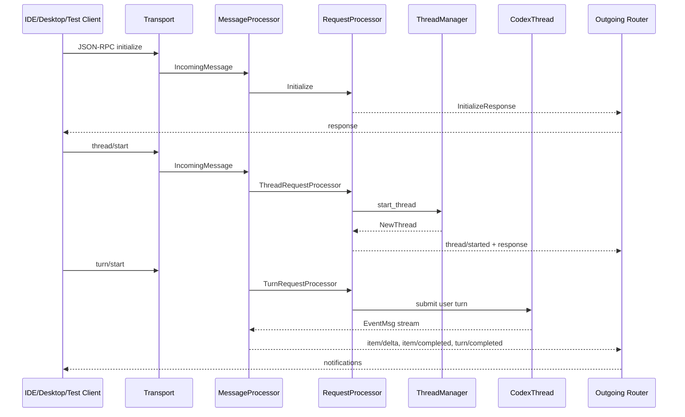
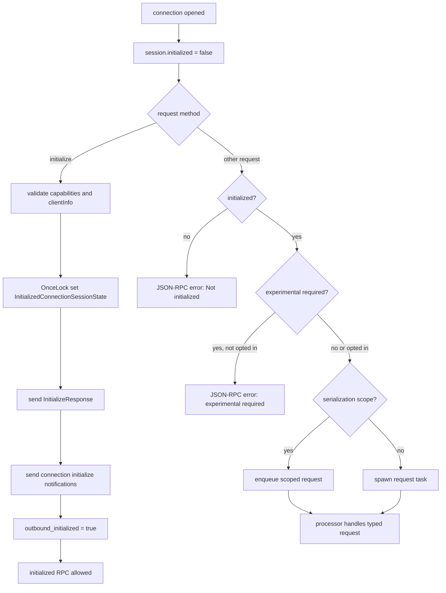
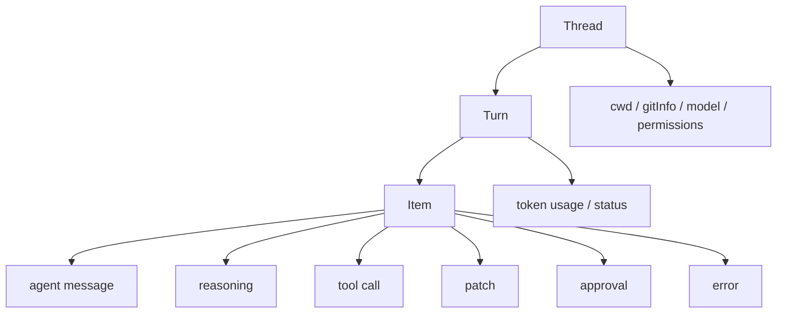

# 07 App Server 与协议

> 源码基线：`upstream/main@283bc4cf01`，复核日期：2026-06-24。

## 研究目标

app-server 是 Codex 支撑 IDE、桌面端和测试客户端的核心后端。本专题研究：

- app-server 如何启动？
- JSON-RPC 请求如何进入 processor？
- `thread/start`、`turn/start`、`thread/resume` 如何映射到 core？
- core event 如何翻译成 app-server notification？
- v2 protocol 为什么围绕 thread/turn/item？

## 源码地图

| 文件/目录 | 关注点 |
| --- | --- |
| `codex-rs/app-server/ARCHITECTURE.zh-CN.md` | 架构说明。 |
| `codex-rs/app-server/src/main.rs` | CLI 参数与启动入口。 |
| `codex-rs/app-server/src/lib.rs` | runtime 组装。 |
| `codex-rs/app-server/src/message_processor.rs` | JSON-RPC 分发。 |
| `codex-rs/app-server/src/request_processors.rs` | processor 聚合。 |
| `codex-rs/app-server/src/thread_state.rs` | thread 状态和订阅。 |
| `codex-rs/app-server/src/bespoke_event_handling.rs` | core event 到 notification 的翻译。 |
| `codex-rs/app-server-protocol/src/protocol/v2/` | v2 协议类型。 |

## 请求流



## 核心数据结构与实现入口

| 概念 | 代码入口 | 作用 |
| --- | --- | --- |
| `MessageProcessor` | `codex-rs/app-server/src/message_processor.rs` | app-server 的 JSON-RPC 总分发器，处理初始化状态、请求/通知路由和 outgoing message。 |
| `RequestProcessors` | `codex-rs/app-server/src/request_processors.rs` | 聚合 thread、turn、config、auth、MCP、plugin、fs 等 processor。 |
| `ThreadRequestProcessor` | `codex-rs/app-server/src/request_processors/thread_processor.rs` | `thread/start`、`thread/resume`、`thread/list` 等 thread 级 RPC。 |
| `TurnRequestProcessor` | `codex-rs/app-server/src/request_processors/turn_processor.rs` | `turn/start`、interrupt、approval response 等 turn 级 RPC。 |
| `ThreadState` | `codex-rs/app-server/src/thread_state.rs` | 维护 live/cold thread、订阅者、listener task、metadata。 |
| `bespoke_event_handling` | `codex-rs/app-server/src/bespoke_event_handling.rs` | 把 core `EventMsg` 翻译成 v2 notification。 |
| `protocol/v2/` | `codex-rs/app-server-protocol/src/protocol/v2/` | v2 wire contract，Rust 类型和 TypeScript schema 的来源。 |
| `ExperimentalApi` | `codex-rs/app-server-protocol/src/protocol/common.rs` | experimental method/field gating，保护客户端兼容性。 |

## app-server 的职责

app-server 不是“简单 HTTP wrapper”，而是一个 stateful runtime adapter：

- 管理连接初始化。
- 维护 per-connection capability。
- 管理 thread 订阅。
- 启动 thread listener。
- 按序发送 server-initiated requests。
- 把 core events 翻译成 app protocol。
- 处理 config、auth、MCP、plugin、fs、process、feedback、marketplace 等 RPC。

## 技术原理：app-server 是有状态协议适配器

app-server 的核心不是“把 core 包成 JSON-RPC”，而是把不稳定的 agent runtime 映射成稳定客户端协议。

它要解决四类状态：

- 连接状态：是否 initialize、客户端 capability、experimental opt-in。
- thread 状态：live thread、cold thread、订阅关系、listener 生命周期。
- turn 状态：一个 turn 内的 streaming item、审批请求、interrupt、completion。
- 协议状态：请求响应顺序、server-initiated notification、schema 兼容。

core 面向 agent runtime，事件更细、更贴近内部；app-server 面向 IDE/桌面客户端，必须把这些事件整理成 thread/turn/item 的稳定模型。

## 协议状态机

app-server 的请求处理可以看成一个 connection-scoped 状态机。核心状态保存在 `ConnectionSessionState`：

| 字段 | 语义 |
| --- | --- |
| `initialized: OnceLock<InitializedConnectionSessionState>` | 连接是否已经完成 initialize。`OnceLock` 保证只能初始化一次。 |
| `rpc_gate: ConnectionRpcGate` | 连接关闭时阻止后续 queued request 继续执行。 |
| `experimental_api_enabled` | 该连接是否 opt in experimental API。 |
| `opted_out_notification_methods` | 该连接不想接收的 notification 方法集合。 |
| `request_attestation` | 是否要求请求 attestation。 |
| `supports_openai_form_elicitation` | 客户端是否支持 OpenAI form elicitation。 |

请求状态机：

```text
Incoming JSON-RPC request
  -> deserialize_client_request
  -> if method == initialize:
       validate clientInfo.name
       read capabilities
       session.initialize(...)
       send InitializeResponse
       websocket path: lib.rs sends connection-scoped initialize notifications
       in-process path: mark outbound_initialized immediately
       notify ThreadRequestProcessor that connection initialized
       return

  -> if not initialized:
       reject "Not initialized"

  -> if request is experimental and connection did not opt in:
       reject experimental_required

  -> track initialized request
  -> compute serialization_scope
  -> enqueue or spawn request
```

这里有一个容易漏掉的细节：websocket JSON-RPC 的 initialize 不会在 `InitializeRequestProcessor::initialize` 里立刻把 outbound connection 标成 ready。原因是 `lib.rs` 需要先发送 connection-scoped initialize notifications，例如 config warnings、remote control status，然后再将 `outbound_initialized` 设为 true。这样可以避免 broadcast notification 早于 initialize 响应或初始化通知到达客户端。

### 请求序列化算法

initialized 之后，并不是所有请求都并行执行。每个 `ClientRequest` 可以声明 `serialization_scope`：

```text
if request.serialization_scope() is Some(scope):
    key, access = RequestSerializationQueueKey::from_scope(connection_id, scope)
    request_serialization_queues.enqueue(key, access, queued_request)
else:
    tokio::spawn(request.run())
```

这个队列解决的是“同一资源上的请求顺序”。例如同一 thread 上的 turn 操作、配置写入、某些会影响共享状态的 RPC，如果完全并行，会出现响应顺序和状态更新交错。serialization queue 把同 scope 的请求排队，但仍允许不同 scope 的独立请求并发。

### Outgoing readiness

出站消息还有一个 gate：

```text
OutboundControlEvent::Opened {
    initialized: Arc<AtomicBool>,
    experimental_api_enabled,
    opted_out_notification_methods
}

send outgoing message:
    if ToConnection:
        deliver to that connection if allowed
    if Broadcast:
        deliver only to initialized connections
        respect opted_out_notification_methods
        respect experimental gating
```

因此 app-server 的“初始化”其实有两层：

- inbound initialized：该连接可以发送 initialized-only RPC。
- outbound initialized：该连接可以接收正常 broadcast notifications。

这两层分开，是为了让 initialize response、初始化通知、后续 broadcast 的顺序可控。

### 协议状态图



## v2 协议模型



v2 强调 typed payload、camelCase wire format、schema fixtures、experimental gating。这些都是为了客户端稳定集成。

### 当前 item 分页契约

当前实验性方法是 `thread/items/list`。它接受 `threadId`、可选 `turnId`、`cursor` 和 `limit`：

- 省略 `turnId` 或传 `null`：跨整条 thread 分页；
- 指定 `turnId`：只返回该 turn 的持久化 items；
- active thread store 不支持 item pagination 时返回 method-not-found；
- thread/turn ID 在协议文档中明确为 UUIDv7。

旧的 `thread/turns/items/list` 不再是当前契约。实现和客户端应以 `app-server-protocol/src/protocol/common.rs`、v2 类型和生成 schema 为准。

## 关键实现路径

启动与初始化：

```text
codex app-server --stdio
  -> build runtime services
  -> MessageProcessor waits for initialize
  -> validate client capabilities / experimental flags
  -> install RequestProcessors
```

创建 turn：

```text
client turn/start
  -> TurnRequestProcessor
  -> ThreadState resolves live thread or starts listener
  -> CodexThread submit Op::UserTurn
  -> core emits EventMsg
  -> bespoke_event_handling maps EventMsg to v2 notifications
  -> outgoing router sends JSON-RPC notifications
```

resume 的关键是区分 cold/live：

- live thread 已经在内存里，主要是增加订阅并返回当前状态。
- cold thread 需要从 thread store / rollout / state DB 恢复，再启动 listener。
- 协议层不能让客户端感知内部恢复细节，只能表现为 thread metadata、历史 item 和后续 notification。

## 演进线索

app-server 的演进主线是从“给一个前端用的桥”变成“多客户端共享的稳定后端协议”：

- v1 到 v2：从粗粒度事件走向 typed thread/turn/item 模型。
- 从单连接交互走向 per-connection capability 与 experimental gate。
- 从只转发 core event，走向 event translation、schema fixture、TypeScript 导出。
- 从热会话操作，扩展到 cold resume、thread list/search/archive/fork。
- 从 CLI/TUI 内部需求，扩展到 IDE、桌面、测试客户端都能复用。

## 验证方法

app-server 的验证重点是协议稳定性：

- 写 stdio 最小客户端，按 initialize、thread/start、turn/start 发送 JSON-RPC，记录完整 response/notification。
- 对照 `EventMsg` 和 v2 notification，确认哪些事件被合并、重命名或拆成 item lifecycle。
- 修改 v2 payload 字段时运行 schema 生成/测试，确认 TypeScript fixture 同步。
- 构造未 initialize 请求、experimental 未 opt-in 请求、未知 thread 请求，确认错误码和错误 payload。
- 用 resume 测试区分 live thread 和 cold thread 的 notification 顺序。

## 深挖问题

1. 未 initialize 的连接能不能发其它请求？
2. experimental API 如何 opt in？
3. `thread/resume` 如何处理冷 thread 和热 thread？
4. app-server 如何避免多个请求互相打乱顺序？
5. core 的 `EventMsg` 如何变成 v2 notification？
6. server 如何向 client 发审批或用户输入请求？

## 实验建议

写一个最小 app-server 客户端：

1. 启动 `codex app-server --stdio`。
2. 发送 `initialize`。
3. 发送 `thread/start`。
4. 发送 `turn/start`。
5. 记录所有 response/notification。

把事件流和 core 的 `EventMsg` 对照起来，就能理解 app-server 的真实价值。
