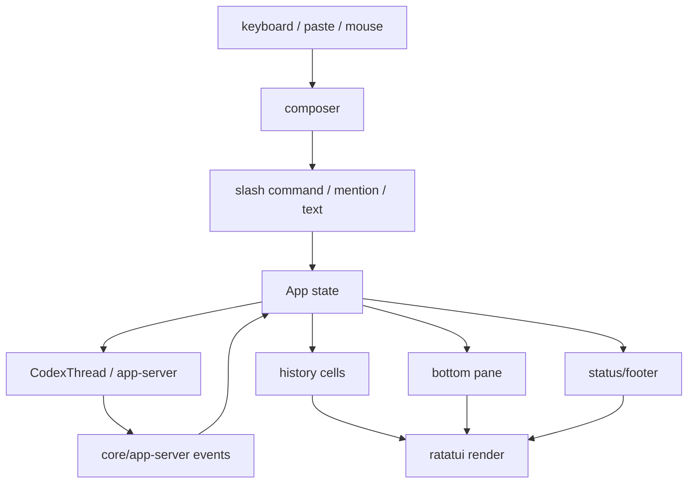
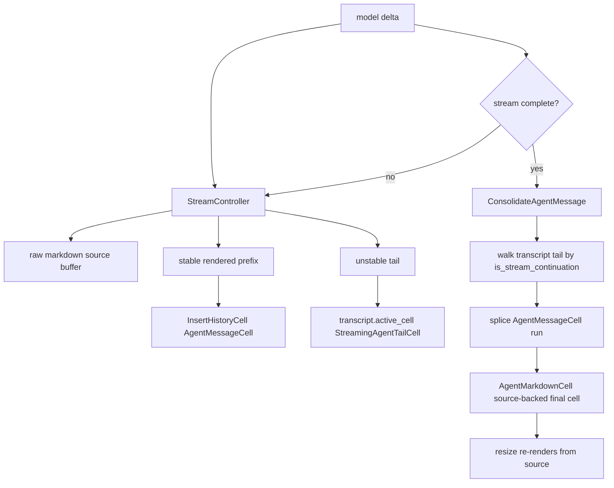

# 08 TUI 与用户交互

> 源码基线：`upstream/main@283bc4cf01`，复核日期：2026-06-24。

## 研究目标

TUI 是用户直接感知 Codex 的地方。它要把复杂 agent 状态变成人能理解、能操作、能信任的界面。

本专题研究：

- composer 如何处理输入、粘贴、slash command、mention？
- history cell 如何渲染消息、工具、diff、审批、错误？
- TUI 如何处理 streaming、interrupt、resume、fork？
- snapshot tests 如何保证 UI 不退化？

## 源码地图

| 文件/目录 | 关注点 |
| --- | --- |
| `codex-rs/tui/src/app.rs` | TUI app 主状态与事件编排。 |
| `codex-rs/tui/src/chatwidget.rs` | 聊天区域编排。 |
| `codex-rs/tui/src/bottom_pane/` | composer、footer、输入相关 UI。 |
| `codex-rs/tui/src/history_cell/mod.rs` | 历史项渲染入口。 |
| `codex-rs/tui/src/markdown.rs` | Markdown 渲染。 |
| `codex-rs/tui/src/wrapping.rs` | 文本换行。 |
| `codex-rs/tui/styles.md` | TUI 样式约定。 |
| `codex-rs/tui/tests/` | snapshot 和交互测试。 |

## TUI 事件循环



## 核心数据结构与实现入口

| 概念 | 代码入口 | 作用 |
| --- | --- | --- |
| `App` | `codex-rs/tui/src/app.rs` | TUI 顶层状态机，接收 terminal input 和 core/app-server events，驱动渲染。 |
| `ChatWidget` | `codex-rs/tui/src/chatwidget.rs` | 聊天主区域编排，管理 history、streaming update、滚动和布局。 |
| `bottom_pane` | `codex-rs/tui/src/bottom_pane/` | composer、footer、命令输入、状态提示。 |
| `HistoryCell` | `codex-rs/tui/src/history_cell/` | 把 agent message、reasoning、tool call、diff、approval、error 渲染成终端 cell。 |
| `wrapping` | `codex-rs/tui/src/wrapping.rs` | 对 ratatui `Line` 做宽度感知换行，避免终端窄屏错位。 |
| `styles.md` | `codex-rs/tui/styles.md` | 颜色、Span/Line 写法、ratatui 风格约定。 |
| snapshot tests | `codex-rs/tui/tests/`、`*.snap` | 固化用户实际看到的终端输出。 |

## TUI 难点

### 1. Streaming UI

模型输出、reasoning、tool output、patch diff 都可能流式到达。TUI 要能：

- 增量更新同一个 cell。
- 避免闪烁。
- 保持滚动位置。
- 支持 interrupt。

### 2. Approval UI

审批不是普通确认框。它要展示：

- 命令或 patch 内容。
- 风险和权限。
- allow once / allow session / deny。
- 与当前 turn 的绑定关系。

### 3. 输入体验

TUI 要支持：

- 多行输入。
- 粘贴长文本。
- slash command。
- `@` 文件/工具/skill mention。
- vim-like keybindings。
- terminal 差异。

### 4. UI 不能污染 core

近期 TUI 有“enforce core boundary”的演进。TUI 应负责展示和交互，不应把产品策略偷偷写进 core runtime。

## 技术原理：TUI 是事件投影，不是业务真相

TUI 的设计边界是：core 决定 agent 行为，TUI 决定人如何看见和操作这些行为。

这意味着：

- TUI 应消费事件，不应重写 agent 历史。
- streaming delta 要投影到已有 cell，而不是每个 delta 生成一个新块。
- approval UI 只负责展示选择和收集用户决策，最终决策仍要回到 core approval flow。
- slash command 可以是 UI 入口，但真正影响 agent runtime 的配置要走 core/app-server 协议。
- 渲染层必须宽度稳定，因为 terminal resize、CJK 宽度、ANSI style 都会影响布局。

如果把 TUI 当成“业务逻辑入口”，多客户端就会产生行为分叉；如果把它当成“事件投影层”，CLI、TUI、app-server 可以共享 core 语义。

## Streaming 渲染机制

TUI 的 streaming 不是每个 delta 都直接写成最终历史。它区分三种 cell：

| cell | 生命周期 | 作用 |
| --- | --- | --- |
| `AgentMessageCell` | streaming 期间逐段插入 transcript | 保存已经可提交的渲染行，带 `is_first_line` 标记。 |
| `StreamingAgentTailCell` | streaming 中的 active cell | 保存还不能提交到 scrollback 的 tail，例如未完成 table。 |
| `AgentMarkdownCell` | stream 完成后 consolidated cell | 保存 raw markdown source，resize 时重新渲染。 |

为什么需要 `AgentMarkdownCell`？因为 streaming 期间的 `AgentMessageCell` 存的是已按当时宽度渲染过的行。如果终端 resize，表格、代码块、链接、列表缩进都可能需要重排。stream 完成后，`ConsolidateAgentMessage` 会把连续的 streaming cells 替换成一个 source-backed cell。

### Streaming 状态机

```text
agent message delta arrives
  -> stream_controller accumulates raw source
  -> render stable prefix lines for current width
  -> emit AppEvent::InsertHistoryCell(AgentMessageCell)
  -> keep unstable tail in transcript.active_cell as StreamingAgentTailCell

more deltas arrive
  -> update active tail
  -> append newly stable lines as AgentMessageCell(is_stream_continuation = true)

stream completes
  -> flush active tail if needed
  -> emit AppEvent::ConsolidateAgentMessage {
         source: raw markdown,
         cwd,
         scrollback_reflow,
         deferred_history_cell
     }
  -> App walks transcript_cells backward
  -> find contiguous run where previous cells are stream continuations
  -> splice run into AgentMarkdownCell
```

`is_stream_continuation` 是 consolidation 的关键。第一段 assistant message 是 `is_first_line = true`，后续流式片段是 continuation。App 可以从 transcript 尾部往回找，直到遇到非 continuation cell，确定要替换的连续区间。

### Active cell 与 scrollback

`ChatWidget::flush_active_cell` 的职责是把当前 active cell 变成正式 history cell：

```text
if transcript.active_cell exists:
    transcript.needs_final_message_separator = true
    send AppEvent::InsertHistoryCell(active_cell)
    request pending usage output insertion
```

但 streaming table tail 不能太早 flush，因为未闭合表格在当前宽度下可能还会变化。于是 TUI 把稳定部分和不稳定尾部分开：稳定部分进 scrollback，不稳定部分留在 active cell。这样既能实时显示，又避免终端 scrollback 里留下错误表格边框。

### 宽度与 cwd 快照

`AgentMarkdownCell::new(markdown_source, cwd)` 会保存当时的 cwd。原因是本地 file link 的显示依赖 cwd；如果用户后面 `/cd` 或 resume 到另一个目录，旧消息的链接显示不应该改变含义。

resize 时：

```text
AgentMarkdownCell.display_hyperlink_lines(width):
    wrap_width = usable_content_width(width, reserved_cols = 2)
    lines = render_markdown_agent_with_links_and_cwd(source, wrap_width, saved_cwd)
    prefix lines with bullet/indent
```

这就是 snapshot tests 要覆盖不同宽度的原因：TUI 的最终显示不是纯字符串，而是 raw source + 当前 width + saved cwd + hyperlink rendering 的函数。

### Streaming 渲染图



## 关键实现路径

用户输入路径：

```text
terminal key/paste
  -> bottom_pane composer
  -> slash command / mention / plain text
  -> App updates local state or submits Op
  -> CodexThread/app-server
```

事件渲染路径：

```text
core/app-server event
  -> App event handler
  -> update history model
  -> create/update HistoryCell
  -> ChatWidget layout
  -> ratatui render
  -> snapshot-testable terminal buffer
```

审批路径：

```text
RequestApproval / RequestPermissions event
  -> App stores pending approval
  -> approval UI shows command/patch/permission
  -> user chooses allow/deny
  -> response sent to core
  -> turn continues or fails
```

## 演进线索

TUI 的演进主线是“从能展示聊天，到能可靠承载 coding workflow”：

- 从普通消息列表，扩展到 reasoning、tool call、patch diff、approval、errors 的结构化 cells。
- 从一次性输出，扩展到 streaming delta 与可 interrupt 的 turn。
- 从简单输入框，扩展到多行、粘贴、slash command、mention、resume/fork 选择器。
- 从手工检查 UI，扩展到 insta snapshot，防止小改动破坏终端布局。
- 从 TUI 内含策略，走向 core boundary，让 app-server/桌面端也能共享同一行为。

## 验证方法

TUI 验证要以“用户看到什么”为准：

- 对任何用户可见文案、颜色、布局、history cell 改动，运行 `just test -p codex-tui` 并检查 `.snap.new`。
- 用窄宽度 snapshot 验证 wrapping，尤其是长路径、长命令、CJK 文本和按钮文本。
- 构造 streaming delta，确认不会产生重复 cell 或滚动跳动。
- 构造 approval 请求，确认风险信息、选项和 turn 绑定清晰。
- 做 core boundary 检查：TUI 改动不应改变 core agent loop 或协议语义。

## 深挖问题

1. 一个 core event 如何变成一个 history cell？
2. streaming delta 如何更新已有 cell？
3. TUI 如何区分 user message、reasoning、tool call、patch、error？
4. slash command 是在 TUI 层处理，还是交给 core？
5. resume picker 的数据来自 rollout、thread-store 还是 app-server？
6. snapshot test 如何覆盖终端渲染？

## 实验建议

找一个 snapshot test，修改一个很小的 UI 文案或样式，运行：

```bash
cd codex-rs
just test -p codex-tui
cargo insta pending-snapshots -p codex-tui
```

观察 `.snap.new`，理解 TUI 测试如何把人眼看到的变化固定下来。
