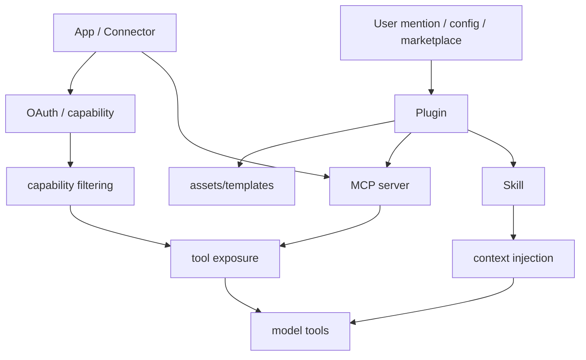
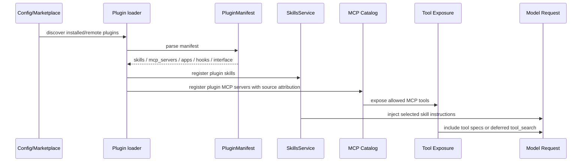
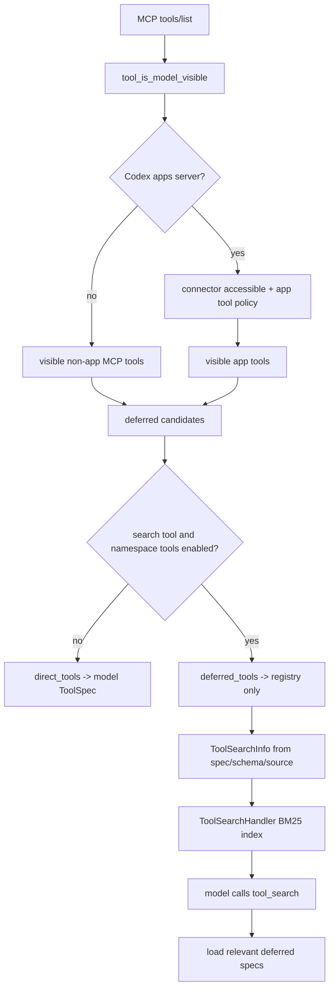

# 09 MCP、Skills、Plugins、Connectors

> 源码基线：`upstream/main@283bc4cf01`，复核日期：2026-06-24。

## 研究目标

Codex 的扩展体系包含多种概念，容易混淆：

- MCP：外部工具协议。
- Skills：说明、参考资料和工作流注入。
- Plugins：可安装、可分享、可携带 MCP/skills/assets 的能力包。
- Connectors/Apps：产品层集成入口。

本专题研究它们的边界和组合方式。

## 源码地图

| 文件/目录 | 关注点 |
| --- | --- |
| `codex-rs/codex-mcp/` | MCP client 和连接管理。 |
| `codex-rs/mcp-server/` | Codex 作为 MCP server。 |
| `codex-rs/core/src/mcp.rs` | core MCP manager 接入。 |
| `codex-rs/core/src/mcp_tool_call.rs` | MCP tool 调用。 |
| `codex-rs/core/src/skills.rs` | skills 发现、渲染、注入。 |
| `codex-rs/skills/` | skill 数据结构。 |
| `codex-rs/plugin/` | plugin manifest 和安装相关。 |
| `codex-rs/core-plugins/` | plugin loading / marketplace。 |
| `codex-rs/connectors/` | apps/connectors 逻辑。 |

## 深度研究标准

这篇如果只把 MCP、Skill、Plugin、Connector 定义一遍，还不算深度研究。需要回答：

- 能力是如何被发现的？
- 能力是如何被过滤的？
- 哪些内容进入模型上下文，哪些内容成为 tool spec？
- plugin manifest 如何映射成 skills、MCP servers、apps、hooks？
- MCP server 同名冲突如何处理？
- tool_search 为什么存在，解决的是工具太多还是上下文太大？

## 能力组合图



## 核心数据结构

### PluginManifest

`codex-rs/plugin/src/manifest.rs` 定义了插件的通用 manifest。关键字段是：

| 字段 | 含义 |
| --- | --- |
| `name`、`version`、`description`、`keywords` | 插件基础 metadata。 |
| `paths.skills` | 插件声明的 skill 资源。 |
| `paths.mcp_servers` | 插件声明的 MCP server，可以是 path 或 object。 |
| `paths.apps` | 插件声明的 app/connector 资源。 |
| `paths.hooks` | 插件声明的 hooks。 |
| `interface` | 面向模型和 UI 的 display name、description、capabilities、default prompt、icon、logo 等。 |

一个重要设计是 `PluginManifest<Resource>` 对 resource 做了泛型参数化。源码注释说明：host loading 使用 absolute paths；resolved packages 会把资源替换成 authority-bound locators。这就是插件能跨本地/远程/环境加载的基础。

### McpServerSource

`codex-rs/codex-mcp/src/catalog.rs` 里 `McpServerSource` 表示 MCP server 从哪里来：

| Source | 含义 |
| --- | --- |
| `Plugin` | 进程级 legacy plugin manager 发现的插件。 |
| `SelectedPlugin` | 当前 thread 通过 capability root 显式选择的插件。 |
| `Config` | 用户配置里的 MCP server。 |
| `Compatibility` | 兼容层注册。 |
| `Extension` | extension 贡献。 |

同名 MCP server 会发生冲突，所以 catalog 还定义了 precedence。源码里 `RegistrationPrecedence` 的 tier 顺序体现了一个原则：不同来源不是平级的；显式选择、配置、扩展贡献都需要确定优先级，否则工具列表会不稳定。

### ToolSearchInfo 和 DiscoverableTool

`codex-rs/tools/src/tool_search.rs` 和 `tool_discovery.rs` 负责把工具做成可搜索、可建议安装的条目。`TOOL_SEARCH_TOOL_NAME` 是 `tool_search`，它的目的不是执行业务动作，而是让模型在工具太多时先搜索，再按需启用或请求安装。

这背后的原理是上下文预算：不能把所有可用工具的完整 schema 永远塞进模型上下文。

## 概念边界

| 概念 | 解决什么问题 | 进入模型的方式 |
| --- | --- | --- |
| MCP | 标准化外部工具、资源、elicitation | tool specs、resource reads、tool outputs |
| Skill | 把专业工作流和参考资料按需注入 | context fragment、instructions |
| Plugin | 打包、安装、分享一组能力 | plugin metadata、skills、MCP、assets |
| Connector/App | 产品级外部服务入口 | app metadata、MCP tools、auth/capability |

## 关键实现路径：插件如何变成模型能力



这个路径里有两个“进入模型”的通道：

1. Skill/context 通道：把说明、工作流、参考资料注入 prompt。
2. Tool/spec 通道：把 MCP 或动态工具的 schema 暴露给模型。

混淆这两个通道会导致设计错误。例如，一个 skill 不一定提供工具；一个 MCP server 也不一定提供长文本指导。

## 技术原理：为什么要分 MCP、Skill、Plugin、Connector

### MCP 是协议，不是产品包

MCP 解决工具通信协议：tools/list、tools/call、resources/read、elicitation、OAuth 等。它不规定 Codex 如何安装、展示、推荐或组织这些工具。

### Skill 是模型行为指导，不是执行协议

Skill 的核心价值是让模型知道“遇到某类任务应该怎么做”。它可以引用资料，也可以声明依赖，但它首先是 context 注入机制。

### Plugin 是分发单位

Plugin 把 skills、MCP servers、apps、hooks、assets 和 UI metadata 打包。它解决安装、市场、分享、版本、品牌、capability 的问题。

### Connector/App 是产品集成面

Connector/App 更接近“用户选择的外部服务”。它通常需要 auth、capability gating、默认工具策略和 UI 呈现。

## MCP Tool Exposure 算法

MCP 工具进入模型前要先经过 exposure planning。核心入口是 `build_mcp_tool_exposure`。

### 1. 过滤可见 MCP tools

MCP tools 先分两类：

```text
non-Codex-apps MCP tools:
    keep if server_name != CODEX_APPS_MCP_SERVER_NAME
    and tool_is_model_visible(tool)

Codex apps MCP tools:
    keep if server_name == CODEX_APPS_MCP_SERVER_NAME
    and tool_is_model_visible(tool)
    and connector_id exists
    and connector_id is in accessible connectors
    and AppToolPolicyEvaluator says enabled
```

apps/connectors 多了一层 policy evaluation，因为这些工具通常代表产品集成，可能带 destructive/open-world hints。即使 MCP server 列出了工具，也不代表当前 thread、当前用户、当前配置允许暴露。

### 2. Direct vs Deferred

过滤后，Codex 决定直接暴露还是 deferred：

```text
deferred_candidates = visible_non_app_tools + visible_app_tools

if search_tool_enabled:
    direct_tools = []
    deferred_tools = deferred_candidates
else:
    direct_tools = deferred_candidates
    deferred_tools = None
```

截至当前基线，旧版“工具达到 100 个或开启 always-defer feature 才 deferred”的阈值逻辑已经移除。只要模型支持 search tool 且 provider 支持 namespace tools，`search_tool_enabled` 就为真，MCP tools 默认全部 deferred，通过 `tool_search` 按需加载。

这让工具暴露从“数量过多时的降级策略”变成默认规划策略：runtime 始终知道这些工具，但模型初始请求不必携带所有完整 schema。

### 3. ToolSpec 与 registry 分离

`spec_plan.rs` 把工具分成两条线：

```text
PlannedTools.runtimes:
    进入 ToolRegistry，运行时可调用

model_visible_specs:
    进入模型请求的 tools 列表
```

对于 deferred tool：

- runtime 仍注册进 registry，后续可被加载或通过 code mode 使用。
- spec 不直接进入模型请求。
- `append_tool_search_executor` 收集所有 `ToolExposure::Deferred` runtime 的 `search_info`，构造 `tool_search` handler。

伪代码：

```text
planned_tools = []
add_shell_tools()
add_mcp_resource_tools()
add_core_utility_tools()
add_collaboration_tools()
add_mcp_runtime_tools(direct + deferred)
add_extension_tools()
add_dynamic_tools()

for runtime in planned_tools:
    if runtime.exposure == Deferred:
        collect runtime.search_info()

if search_infos not empty:
    add ToolSearchHandler(search_infos)

for runtime in planned_tools:
    if runtime.exposure.is_direct():
        specs.push(runtime.spec())

registry = ToolRegistry::from_tools(planned_tools)
model_visible_specs = merge_into_namespaces(specs)
```

这解释了为什么“模型看不到 deferred tool schema”不等于“系统不知道这个工具”。它只是暂时不占模型上下文。

### 4. ToolSearch 索引构造

`ToolSearchInfo::from_spec` 会把 deferred tool 的 spec 转成 loadable spec：

```text
Function tool:
    defer_loading = true
    output_schema = None

Namespace tool:
    namespace description defaulted if empty
    every child function defer_loading = true
    every child output_schema = None

ToolSearch / hosted image / hosted web / freeform:
    not searchable through this path
```

搜索文本不是只用工具名。`default_tool_search_text` 会拼：

- function name。
- name 中下划线替换成空格后的文本。
- description。
- schema descriptions。
- schema property names。
- nested item/variant schema text。

MCP handler 还会加入 server name、callable name、tool title、namespace/source description 等。`ToolSearchHandler` 用这些文本构建 BM25-like search engine，默认 limit 是 8。

### 5. MCP 并行和 hook 名称

MCP handler 的并行规则：

```text
supports_parallel =
    tool_info.supports_parallel_tool_calls
    or tool.annotations.read_only_hint == true
```

这表示 read-only hint 可以让工具即使 server 没显式 opt-in，也作为并行安全的读取工具运行。

MCP hook/tool 名称还会规范化：

```text
namespace + "__" + name
ensure prefix "mcp__"
```

这是为了让 hooks、approval、telemetry 面向稳定名称，而不是受 MCP server 原始命名差异影响。

### Tool Exposure 总图



## 过滤与安全

扩展能力不能全部无条件暴露。过滤发生在多个层次：

| 层次 | 过滤依据 |
| --- | --- |
| Auth | 用户是否登录、OAuth 是否可用、workspace 是否允许。 |
| Capability | app/plugin 是否声明和满足能力。 |
| Thread | 当前 thread 是否选择了插件、skill、connector。 |
| Environment | 工具是否绑定当前 executor/environment。 |
| Approval | tool 是否有副作用，是否需要确认。 |
| Context budget | metadata 和 schema 是否过大，是否应 deferred。 |

## 演进线索

这条线的演进可以这样看：

| 阶段 | 能力 | 为什么需要下一步 |
| --- | --- | --- |
| MCP 初始接入 | 外部工具能被调用 | 工具来源和 schema 质量不可控。 |
| MCP auth/resources/elicitation | 工具协议更完整 | 工具数量和上下文压力上升。 |
| Skills | 按任务注入专业指导 | 需要打包、分发、依赖管理。 |
| Plugins | skills/MCP/assets/hooks 打包 | 需要 marketplace、remote plugin、capability 过滤。 |
| Connectors/Apps | 产品级服务入口 | 需要 auth、UI、默认工具策略。 |
| Tool search/deferred tools | 减少上下文压力 | 需要模型按需发现能力。 |

所以当前复杂度不是偶然堆叠，而是从“接一个外部工具”演进到“可安装、可发现、可授权、可过滤、可预算的能力生态”。

## 深挖问题

1. MCP server 如何启动、列工具、调用工具、处理超时？
2. MCP OAuth 凭据如何存储和刷新？
3. Skill 什么时候显式触发，什么时候隐式触发？
4. Skill metadata 如何被预算限制？
5. Plugin marketplace 如何发现、安装、缓存、过滤？
6. App/connector 的 auth capability 如何影响工具曝光？
7. tool_search 为什么要支持 deferred tools？
8. Plugin manifest 的 resource 泛型解决了什么跨环境问题？
9. SelectedPlugin 为什么要有高于普通 Plugin 的 catalog source？
10. Skill 注入和 MCP tool exposure 在模型请求里如何区分？

## 验证方法与实验建议

做四步走查：

1. 配置一个 MCP server，观察 tools/list。
2. 创建一个最小 `SKILL.md`，观察是否进入上下文。
3. 找一个 plugin manifest，理解它如何声明 skills/MCP/assets。
4. 比较显式 mention 和默认启用时，模型可见工具有什么不同。

输出一张“能力从哪里来、如何进入模型、如何执行”的表。

建议额外做一次源码验证：

1. 打开 `plugin/src/manifest.rs`，画出 `PluginManifest -> PluginManifestPaths -> PluginManifestInterface`。
2. 打开 `codex-mcp/src/catalog.rs`，列出 `McpServerSource` 和 precedence。
3. 打开 `tools/src/tool_discovery.rs`，看 `DiscoverableTool` 如何区分 connector 和 plugin。
4. 打开 `core/src/skills.rs`，确认 `build_available_skills`、`build_skill_injections`、`maybe_emit_implicit_skill_invocation` 的边界。
