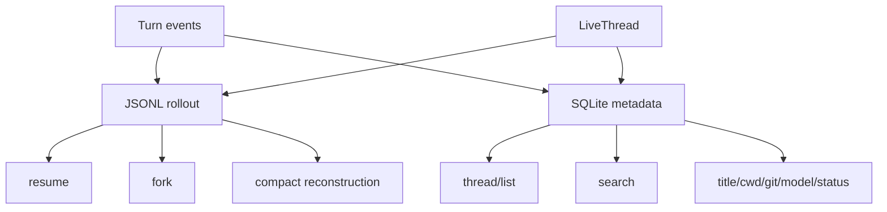
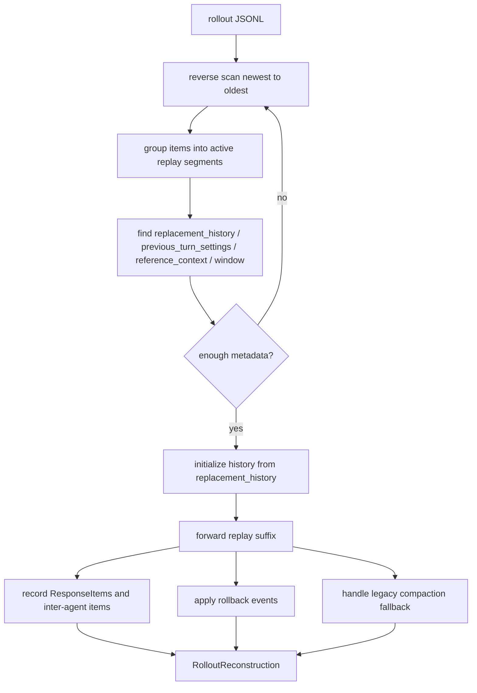

# 10 Thread Store、Rollout 与恢复

> 源码基线：`upstream/main@283bc4cf01`，复核日期：2026-06-24。

## 研究目标

Codex 的长期会话能力依赖 thread store 和 rollout。研究目标：

- 用户会话如何被持久化？
- resume/fork/archive/delete 如何工作？
- cold thread 和 live thread 有什么区别？
- compact 后如何重建历史？
- state DB 和 JSONL rollout 分别承担什么？

## 源码地图

| 文件/目录 | 关注点 |
| --- | --- |
| `codex-rs/core/src/rollout.rs` | rollout 读写和 session metadata。 |
| `codex-rs/rollout/` | rollout 相关 crate。 |
| `codex-rs/thread-store/` | thread store 抽象。 |
| `codex-rs/state/` | SQLite state DB。 |
| `codex-rs/core/src/session/rollout_reconstruction.rs` | 从 rollout 重建 session/history。 |
| `codex-rs/core/src/context_manager/history.rs` | history 管理。 |
| `codex-rs/app-server/src/thread_state.rs` | live thread 状态和订阅。 |

## 持久化模型



## 核心数据结构与实现入口

| 概念 | 代码入口 | 作用 |
| --- | --- | --- |
| `RolloutItem` | `codex-rs/core/src/rollout.rs`、`codex-rs/rollout/` | JSONL 里的事件单位，记录 user message、assistant output、tool output、turn context、compaction 等。 |
| `RolloutRecorder` | `codex-rs/core/src/rollout.rs` | turn 运行时写入 rollout 的组件。 |
| `SessionMeta` | `codex-rs/core/src/rollout.rs`、`codex-rs/state/` | thread id、created_at、cwd、model、title 等 metadata。 |
| `ThreadStore` | `codex-rs/thread-store/` | thread 列表、搜索、归档、删除等持久化抽象。 |
| `StateDb` | `codex-rs/state/` | SQLite metadata/index，服务 thread list/search 和快速查询。 |
| `reconstruct_history` | `codex-rs/core/src/session/rollout_reconstruction.rs` | 从 rollout 事件还原 `ContextManager`、reference context、compact window。 |
| `ThreadState` | `codex-rs/app-server/src/thread_state.rs` | app-server 内 live/cold thread 状态管理。 |

## 关键操作

### Resume

Resume 需要：

- 找到 thread metadata。
- 读取 rollout。
- 重建历史。
- 恢复 config snapshot。
- 处理 cwd 差异。
- 重新订阅事件。

### Fork

Fork 不是复制 UI 文本，而是从某个历史点创建新 thread：

- 保留必要历史。
- 记录 parent/fork metadata。
- 生成新 thread ID。
- 保证后续 turn 不污染原 thread。

### Compact

Compact 会把一段历史替换成摘要，但不能破坏 resume：

- replacement history 需要 item IDs。
- 需要保留 turn state。
- 需要记录 compact event。

## 技术原理：事件日志和索引数据库分工

rollout 和 state DB 不是重复存储：

- rollout 是行为审计和恢复来源，按时间记录“发生过什么”。
- state DB 是查询索引和 metadata 快照，服务 thread list、搜索、归档等用户操作。

这类似 event log + materialized view。恢复时更信任 rollout，因为它保留了 turn 内事件顺序；列表和搜索更依赖 state DB，因为逐个扫描 JSONL 成本高。

compact 让这个模型更复杂：旧历史被 replacement history 替换，但 rollout 仍要保留足够信息，让恢复后的 live history 与压缩后的模型输入一致。`RolloutItem::Compacted` 的 replacement history、window number、window id 就是为这个目的服务的。

## Rollout 重建算法

`reconstruct_history_from_rollout` 不是简单从头到尾 replay 全部 JSONL。它先从新到旧反向扫描，找到“恢复所需的最小旧状态”，再正向 replay 剩余尾部。

### 1. 反向扫描：找最近的 surviving 基线

反向扫描维护一个 `ActiveReplaySegment`，把同一个 turn 的事件聚合在一起。它要找四类信息：

| 信息 | 用途 |
| --- | --- |
| `base_replacement_history` | 最近一次仍然有效的 compact replacement history。找到后，更旧历史通常不再影响模型输入。 |
| `previous_turn_settings` | 恢复后判断模型切换、comp_hash、realtime 状态。 |
| `reference_context_item` | 恢复 context diff baseline；如果 compact 清除了 baseline，就必须记为 cleared。 |
| compact window | 恢复 auto-compact window number/id，避免后续 token accounting 混乱。 |

伪代码：

```text
base_replacement_history = None
previous_turn_settings = None
reference_context = NeverSet
window = None
pending_rollback_turns = 0
active_segment = None

for item in rollout_items reversed:
    if item is Compacted:
        active_segment.window ||= compacted.window
        active_segment.reference_context ||= Cleared
        if compacted.replacement_history exists:
            active_segment.base_replacement_history = replacement_history
            rollout_suffix = items after this compaction

    if item is ThreadRolledBack:
        pending_rollback_turns += rollback.num_turns

    if item is UserMessage or user-turn ResponseItem:
        active_segment.counts_as_user_turn = true

    if item is TurnContext:
        active_segment.previous_turn_settings = model/comp_hash/realtime
        active_segment.reference_context ||= Latest(ctx)

    if item is TurnStarted boundary:
        finalize active_segment

    if base_replacement_history
       and previous_turn_settings
       and reference_context known:
        break
```

`pending_rollback_turns` 的处理也在反向扫描阶段完成。因为 rollback 语义是“删除最新 N 个 user turns”，反向看就变成“接下来 finalize 的 N 个 user-turn segment 跳过”。

### 2. Segment finalize 规则

`finalize_active_segment` 负责把一个 turn segment 的信息写回全局恢复状态：

```text
if pending_rollback_turns > 0:
    if segment counts as user turn:
        pending_rollback_turns -= 1
    skip this segment

if base_replacement_history not set:
    take segment.base_replacement_history

if window not set:
    take segment.window

if previous_turn_settings not set and segment counts as user turn:
    take segment.previous_turn_settings

if reference_context is NeverSet
   and (segment counts as user turn or segment reference is Cleared):
    take segment.reference_context
```

这里最重要的是 `NeverSet` 和 `Cleared` 的区别：

- `NeverSet`：没有证据表明曾建立 baseline。
- `Cleared`：曾有 baseline，但后来的 compaction 明确使旧 baseline 失效。

这能避免 resume 时误用过期 `TurnContextItem` 做 diff，导致当前环境/权限/AGENTS.md 没有完整重注入。

### 3. 正向 replay suffix

反向扫描得到最近 replacement history 后，再从 `rollout_suffix` 正向 materialize：

```text
history = ContextManager::new()

if base_replacement_history exists:
    history.replace(base_replacement_history)

for item in rollout_suffix:
    if ResponseItem:
        history.record_items(item, truncation_policy)

    if InterAgentCommunication:
        history.record_items(communication.to_model_input_item())

    if Compacted with replacement_history:
        history.replace(replacement_history)

    if legacy Compacted without replacement_history:
        user_messages = collect_user_messages(history)
        rebuilt = build_compacted_history(user_messages, compacted.message)
        history.replace(rebuilt)
        reference_context_item = None

    if ThreadRolledBack:
        history.drop_last_n_user_turns(num_turns)
```

这解释了为什么新格式要把 `replacement_history` 写进 `CompactedItem`：否则 legacy compaction 只能用摘要和 surviving user messages 尽力重建，无法保证 prompt shape 完全一致。

### 4. 恢复算法总图



## 关键实现路径

普通持久化：

```text
turn emits items
  -> Session records conversation/tool/context items
  -> RolloutRecorder appends JSONL
  -> StateDb updates thread metadata/index
```

resume：

```text
thread id
  -> ThreadStore/StateDb finds metadata and rollout path
  -> read rollout items
  -> rollout_reconstruction rebuilds ContextManager
  -> restore reference TurnContextItem and compact window
  -> create live CodexThread
```

fork：

```text
source thread + cutoff
  -> select/rebuild history up to fork point
  -> create new thread id and metadata
  -> write new rollout baseline
  -> future turns append only to forked thread
```

## 深挖问题

1. rollout 是 canonical history 吗？
2. state DB 中哪些 metadata 可以从 rollout 重建，哪些不能？
3. live thread 没有订阅者时如何卸载？
4. resume 冷 thread 和热 thread 的路径有什么区别？
5. thread search 搜的是 rollout、state DB，还是两者结合？
6. archive 和 delete 的语义差异是什么？

## 演进线索

持久化线的演进从“保存聊天记录”走向“保存可执行 agent 状态”：

- 从消息文本历史，扩展到 typed rollout items。
- 从只支持 resume 最近会话，扩展到 thread list/search/archive/fork。
- 从 compact summary，扩展到 compact replacement history，保证恢复一致。
- 从单 UI 内存状态，扩展到 app-server 管理 live/cold thread。
- 从手工排查 JSONL，扩展到 rollout trace/reconstruction 测试。

## 验证方法

验证持久化时要做“运行中”和“重启后”对照：

- 创建包含 user message、tool call、patch、approval 的 thread，退出后 resume，确认 history cell 和模型可见 history 一致。
- 人为触发 compact，再 resume，确认 replacement history 生效且不会恢复旧长历史。
- fork 到中间 turn，确认新 thread 后续输出不污染原 thread。
- archive/delete 后检查 thread list/search 行为和底层文件保留语义。
- 用 rollout reconstruction 测试覆盖 legacy compact、缺失 reference context、多个 compact window。

## 实验建议

创建一个短会话：

1. 发一条普通消息。
2. 执行一个 shell tool。
3. 修改文件。
4. 退出。
5. resume。
6. fork。

然后检查：

```bash
find ~/.codex -name '*.jsonl' | head
```

对照 rollout 内容和 TUI/app-server 显示，理解哪些事件被持久化。
