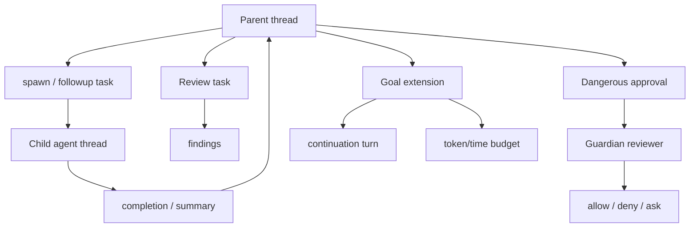
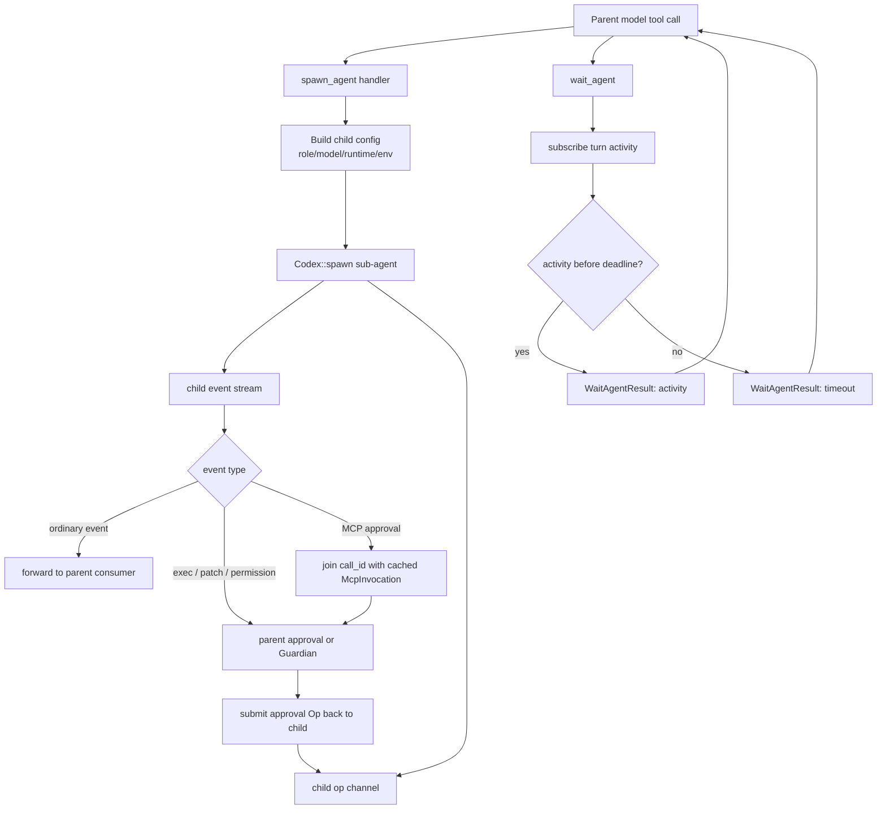

# 11 Multi-Agent、Review、Guardian、Goal

> 源码基线：`upstream/main@283bc4cf01`，复核日期：2026-06-24。

## 研究目标

这组能力代表 Codex 从单 agent 走向生产级协作 runtime：

- Multi-Agent：拆分任务、并行探索、子 agent 汇总。
- Review：让 Codex 做代码审查。
- Guardian：审查危险操作的审批请求。
- Goal：长目标持续推进和预算管理。

## 源码地图

| 文件/目录 | 关注点 |
| --- | --- |
| `codex-rs/core/src/agent/` | agent role、registry、status。 |
| `codex-rs/core/src/session/multi_agents.rs` | multi-agent session 集成。 |
| `codex-rs/core/src/spawn.rs` | spawn 子 agent。 |
| `codex-rs/core/src/tasks/review.rs` | review task。 |
| `codex-rs/core/src/guardian/` | Guardian review。 |
| `codex-rs/ext/goal/` | goal extension。 |
| `codex-rs/prompts/templates/goals/` | goal prompt 模板。 |

## 关系图



## 核心数据结构与实现入口

| 概念 | 代码入口 | 作用 |
| --- | --- | --- |
| multi-agent specs | `codex-rs/core/src/tools/handlers/multi_agents_spec.rs` | 向模型暴露 spawn、wait、list、send、close、interrupt 等工具。 |
| multi-agent handlers | `codex-rs/core/src/tools/handlers/multi_agents/`、`multi_agents_v2/` | 具体执行子 agent 生命周期操作。 |
| `codex_delegate` | `codex-rs/core/src/codex_delegate.rs` | 子 agent 事件转发、审批拦截、父子上下文桥接。 |
| `spawn` handler | `codex-rs/core/src/tools/handlers/multi_agents*/spawn.rs` | 创建子 agent thread，并设置 role、权限、上下文继承。 |
| `wait` handler | `codex-rs/core/src/tools/handlers/multi_agents*/wait.rs` | 等待子 agent 完成或超时，返回结构化结果。 |
| review task | `codex-rs/core/src/tasks/review.rs` | 代码审查任务入口，按 review 姿态组织输出。 |
| Guardian | `codex-rs/core/src/guardian/`、`codex-rs/core/src/codex_delegate.rs` | 对审批请求做隔离审查。 |
| goal extension | `codex-rs/ext/goal/` | 维护长目标状态、预算、继续/完成/阻塞判定。 |

## Multi-Agent 设计点

Multi-agent 不是“多个角色聊天”，而是多个有边界的执行单元：

- 子 agent 有自己的 thread。
- 可以继承部分上下文。
- 需要隔离工具、权限和历史。
- 父 agent 需要等待、汇总、取消或回收。
- 多 agent 成本和失败模式更复杂。

当前 v2 工具还多了一层 namespace 边界。`tools/spec_plan.rs` 会在 provider 支持 namespace tools 时，把协作工具放进 `features.multi_agent_v2.tool_namespace` 指定的 namespace。因此：

- 模型侧名称可能表现为 `namespace.tool`；
- runtime handler 仍使用稳定的内部 `ToolName`；
- Code Mode 可以按配置决定这些工具直接暴露还是仅在非 Code Mode 暴露；
- 文档和测试不应硬编码 multi-agent 工具必定位于顶层。

## 技术原理：子 agent 是隔离线程，不是函数调用

Multi-Agent 的关键不是并行本身，而是隔离边界：

- 每个子 agent 有自己的 conversation history，避免探索噪声污染主上下文。
- 父 agent 通过工具接口 spawn/wait/send/close，而不是直接共享内部状态。
- 子 agent 的审批请求可能需要转交父会话处理，避免子 agent 绕过用户授权。
- 子 agent 的结果必须被压缩成父 agent 可消费的 completion/summary，而不是把全部历史塞回父上下文。
- wait timeout、interrupt、close 都是资源治理，防止后台 agent 无界运行。

因此 multi-agent 更像“受控子任务 runtime”，不是 prompt 里的多个角色扮演。

## Multi-Agent 生命周期算法

从实现上看，multi-agent 的生命周期可以拆成四个闭环：spawn、delegate、approval bridge、wait。它们共同保证“子 agent 能独立工作，但不能绕过父会话的权限和资源治理”。

### 1. spawn：从 tool call 创建隔离线程

入口在 `codex-rs/core/src/tools/handlers/multi_agents_v2/spawn.rs`。`spawn_agent` 不是简单把一段 prompt 塞进当前上下文，而是创建一个新的 agent thread：

```text
handle_spawn_agent(invocation)
  -> parse SpawnAgentArgs
  -> validate fork_mode / role / model / reasoning_effort
  -> build_agent_spawn_config(parent_base_instructions, current_turn)
  -> apply requested model overrides unless full-history fork
  -> apply role, service tier, runtime overrides
  -> compute spawn_source and canonical AgentPath
  -> convert plain text input into InterAgentCommunication when possible
  -> agent_control.spawn_agent_with_metadata(
       config,
       initial_op,
       spawn_source,
       parent_thread_id,
       fork_mode,
       inherited environments
     )
  -> emit SubAgentActivityEvent::Started
  -> return task_name / nickname to the model
```

这里有两个关键边界：

- `fork_mode = FullHistory` 时会拒绝 role/model/reasoning 覆盖，避免“复制完整历史”同时悄悄改变 agent 身份。
- 普通文本任务会被转换成 `Op::InterAgentCommunication`，并把 `source_call_id` 写进 metadata，这样后续事件能追溯到是哪一次 `spawn_agent` 调用创建的子任务。

### 2. delegate：子 agent 是一个完整 Codex runtime

`codex-rs/core/src/codex_delegate.rs` 的 `run_codex_thread_interactive` 会真正启动子 agent：

```text
run_codex_thread_interactive(...)
  -> create bounded submission/event channels
  -> load parent user instructions
  -> Codex::spawn(
       session_source = SessionSource::SubAgent,
       thread_source = ThreadSource::Subagent,
       parent_thread_id,
       inherited environments,
       inherited exec policy,
       shared skills/plugins/MCP/extensions,
       inherited_multi_agent_version = Disabled
     )
  -> spawn forward_events task
  -> spawn forward_ops task
  -> return Codex handle with child tx/rx
```

这说明子 agent 不是父 agent 的函数调用栈，而是一个带独立 session、thread、history、event stream 的 Codex 实例。它继承的是运行所需的服务和策略，例如环境选择、执行策略、skills/plugins/MCP 管理器；但它的会话来源和历史链路被标记为 sub-agent。

`inherited_multi_agent_version = Disabled` 也很重要：子 agent 默认不能继续无限递归 spawn 下去，否则多 agent 很容易变成不可控的任务树。

### 3. approval bridge：危险动作回流父会话或 Guardian

子 agent 运行时会发事件。`forward_events` 不会把所有事件原样透传，而是拦截会改变外部世界或需要用户参与的事件：

```text
forward_events loop
  -> drop TokenCount / SessionConfigured
  -> intercept ExecApprovalRequest
       -> if Guardian enabled: spawn delegated Guardian review
       -> else parent_session.request_command_approval
       -> submit Op::ExecApproval back to child
  -> intercept ApplyPatchApprovalRequest
       -> Guardian or parent patch approval
       -> submit Op::PatchApproval back to child
  -> intercept RequestPermissions
       -> parent permission flow
  -> intercept RequestUserInput
       -> possible MCP Guardian auto-review
       -> else parent request_user_input
       -> submit Op::UserInputAnswer back to child
  -> cache McpToolCallBegin by call_id
  -> remove cache on McpToolCallEnd
  -> forward ordinary events to consumer
```

这个桥接层解决的是安全问题：即使子 agent 有自己的 runtime，它仍不能自行批准 shell、patch、权限提升、MCP approval 或用户输入请求。审批要么回到父 session，要么进入 Guardian 的隔离审查；审查结果再作为 `Op` 提交回子 agent。

MCP approval 还有一个细节：legacy `RequestUserInput` 事件只带 `call_id` 和问题元数据，所以 delegate 会在 `McpToolCallBegin` 时缓存完整 `McpInvocation`，等审批问题出现时再拼回 Guardian 所需的上下文。

### 4. wait：等待的是活动信号，不是阻塞整个 runtime

`codex-rs/core/src/tools/handlers/multi_agents_v2/wait.rs` 的 `wait_agent` 做的是 bounded waiting：

```text
handle_wait_agent(invocation)
  -> parse timeout_ms
  -> validate min_wait_timeout_ms <= timeout <= max_wait_timeout_ms
  -> subscribe input_queue activity for active turn/sub_id
  -> emit CollabWaitingBeginEvent
  -> wait_for_activity(activity_rx, pending_activity, deadline)
  -> convert outcome into WaitAgentResult
  -> emit CollabWaitingEndEvent
  -> return structured result to model
```

它没有把父 runtime 卡死，也不是简单 sleep。它订阅当前 turn 的 activity stream，等待子任务或协作输入产生新活动；同时用 deadline 兜底，避免模型发起无界等待。

### 生命周期图



这套机制的本质是：工作隔离、结果有界、审批集中、等待可超时。它牺牲了一些简单性，但换来的是可恢复、可审计、可取消的协作 runtime。

## Review 与 Guardian 的区别

| 能力 | 审查对象 | 输出 | 权限 |
| --- | --- | --- | --- |
| Review | 代码 diff / PR / 文件改动 | findings、严重级别、测试建议 | 受限工具 |
| Guardian | 审批请求，如 shell、patch、network | 是否建议允许 | 更隔离、更小上下文 |

Review 是代码质量审查；Guardian 是安全审批审查。

## 关键实现路径

multi-agent：

```text
model calls spawn_agent
  -> tool handler creates child thread/delegate
  -> child runs its own turns and emits events
  -> delegate filters/forwards completion and approvals
  -> model calls wait_agent
  -> parent receives bounded result
```

Guardian：

```text
dangerous approval request
  -> route check by reviewer config
  -> spawn isolated guardian review
  -> guardian sees bounded approval context
  -> returns recommendation/decision
  -> parent approval flow continues
```

Goal：

```text
create_goal
  -> store objective and optional budget
  -> continue turns while active and useful
  -> update_goal complete/blocked only when criteria met
  -> report accounting when budgeted goal completes
```

Review：

```text
review request
  -> inspect diff/files/tests
  -> prioritize bugs/regressions/missing tests
  -> findings first, summaries second
```

## Goal

Goal extension 处理长任务：

- 创建目标。
- 跟踪进度。
- 在预算允许时继续。
- 暂停、完成或阻塞。
- 记录 accounting 和 telemetry。

它解决的是“用户希望 agent 不只回答一轮，而是持续推进目标”的问题。

## 演进线索

这组能力体现了 Codex 从“单轮助手”到“协作 runtime”的演进：

- 从一个 agent 单线程执行，扩展到多 agent 并行探索与等待汇总。
- 从用户直接审批所有风险，扩展到 Guardian 辅助审查复杂审批。
- 从回答式 review，扩展到专门的 code review 姿态和输出格式。
- 从单 turn task，扩展到 goal extension 管理长期目标、预算和自动继续。
- 从共享上下文，走向子线程隔离、结果有界、审批回流父会话。

## 验证方法

验证这组能力时要关注隔离和边界：

- spawn 两个子 agent，确认它们的历史、工具输出和失败不会直接混入父历史。
- 让子 agent 触发需要审批的 shell/patch，确认审批回到父会话或 Guardian，而不是子 agent 自行放行。
- wait 超时、interrupt、close 三种路径都要检查资源是否释放。
- review 输出应以 findings 为先，并引用具体文件/行；不要只做总结。
- goal complete/blocked 必须满足状态条件，不能因为预算接近耗尽就标记完成或阻塞。

## 深挖问题

1. 子 agent 如何继承父 thread 的上下文？
2. 多 agent 消息如何避免污染主上下文？
3. wait/resume/close agent 的生命周期如何设计？
4. Review task 为什么要关闭某些能力？
5. Guardian 为什么不能直接使用普通 agent 上下文？
6. Goal continuation 什么时候应该停？

## 实验建议

设计一个三 agent 工作流：

```text
parent: 负责拆任务和汇总
agent A: 读代码找 bug
agent B: 读测试找覆盖缺口
reviewer: 汇总风险和建议
```

然后对照 Codex multi-agent 的能力，标出：

- 哪些上下文共享？
- 哪些工具隔离？
- 如何汇总？
- 如何取消？
- 如何限制成本？
