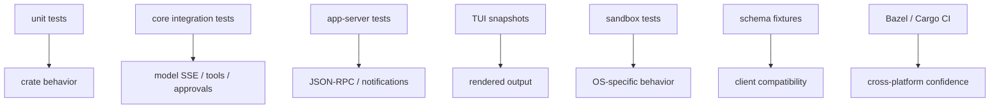
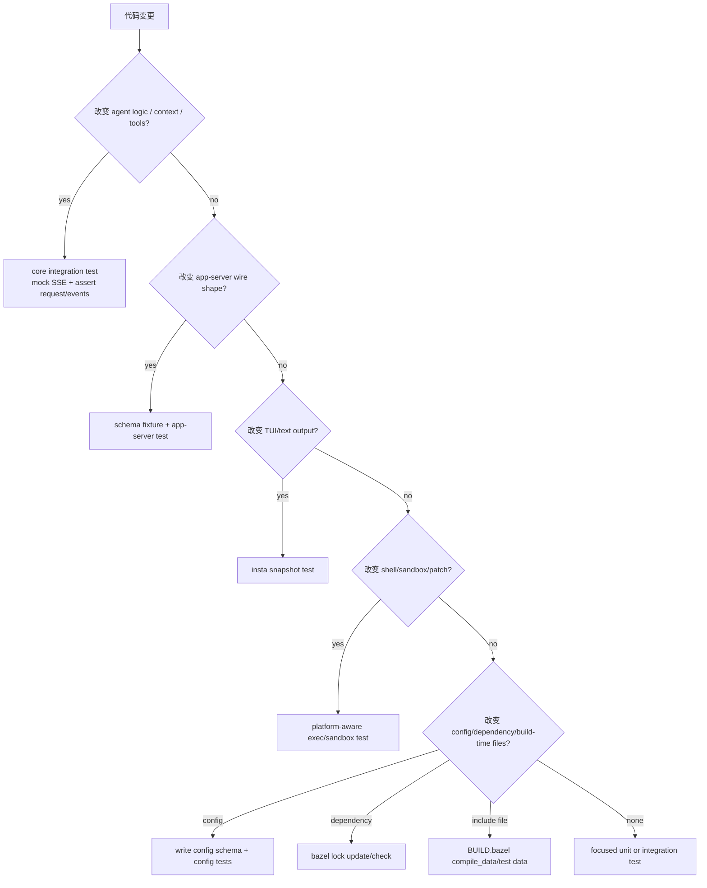
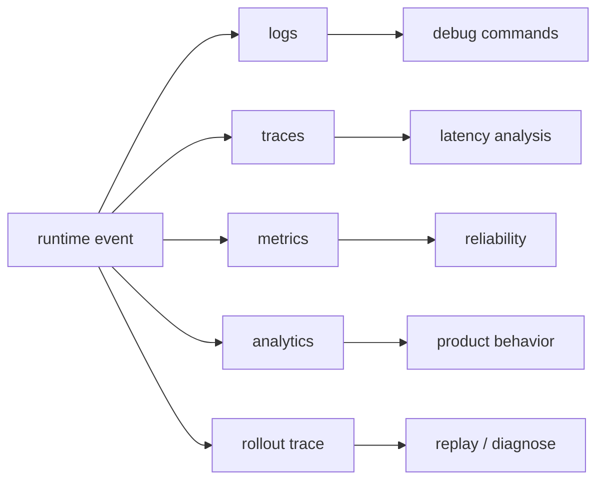

# 12 工程化、测试与可观测性

> 源码基线：`upstream/main@283bc4cf01`，复核日期：2026-06-24。

## 研究目标

生产级 agent 不能只靠手工试用。它需要：

- 稳定测试体系。
- schema 和 protocol 兼容性检查。
- snapshot UI 回归。
- sandbox 跨平台测试。
- tracing、metrics、analytics。
- debug 和 replay 工具。

## 源码地图

| 文件/目录 | 关注点 |
| --- | --- |
| `justfile` | 仓库根目录的常用开发命令。 |
| `codex-rs/BUILD.bazel`、各 crate `BUILD.bazel` | Bazel 构建。 |
| `codex-rs/core/tests/` | core integration tests。 |
| `codex-rs/app-server/tests/` | app-server integration tests。 |
| `codex-rs/tui/tests/` | TUI snapshot/interaction tests。 |
| `codex-rs/app-server-protocol/` | schema/TS fixture tests。 |
| `codex-rs/otel/` | tracing/logs/metrics。 |
| `codex-rs/analytics/` | product/runtime analytics。 |
| `codex-rs/rollout-trace/` | rollout replay/debug。 |
| `codex-rs/features/` | feature flags。 |

## 测试分层



## 核心数据结构与实现入口

| 领域 | 代码入口 | 作用 |
| --- | --- | --- |
| core integration helpers | `codex-rs/core/tests/`、`codex-rs/core/src/*_tests.rs` | 模拟 Responses API、工具调用、审批、compact、resume。 |
| SSE response mocks | `core_test_support::responses` | 构造 `ev_response_created`、`ev_function_call`、`ev_completed` 等模型流事件。 |
| app-server tests | `codex-rs/app-server/tests/` | 验证 JSON-RPC 请求、响应、notification 顺序。 |
| protocol schema | `codex-rs/app-server-protocol/` | Rust/TS schema fixture 和 experimental API 校验。 |
| TUI snapshots | `codex-rs/tui/tests/`、`cargo insta` | 固化终端渲染输出。 |
| sandbox suites | `codex-rs/linux-sandbox/tests/`、`windows-sandbox-rs` tests | 验证 OS enforcement，而不是只测策略函数。 |
| OTEL/analytics | `codex-rs/otel/`、`codex-rs/analytics/` | tracing、metrics、产品事件。 |
| rollout trace | `codex-rs/rollout-trace/` | 排查历史重建、压缩、事件序列。 |

## 为什么 agent 测试特殊

Agent 不是纯函数。一次行为可能涉及：

- 模型 streaming event。
- 工具调用。
- shell output。
- approval。
- sandbox。
- context compaction。
- retry。
- UI delta。
- persistence。

因此测试通常要 mock 模型 SSE，并断言：

- 发给模型的请求。
- 模型输出的解析。
- 工具调用参数。
- 工具结果回传。
- 事件顺序。
- 持久化结果。

## 技术原理：agent 测试要固定“外部世界”

Codex 的核心逻辑依赖模型、文件系统、进程、网络、时间、用户审批和终端宽度。测试如果直接调用真实外部世界，就会不稳定。

因此测试体系把外部世界拆成可控边界：

- 模型：用 SSE mock 固定 response item 序列。
- 工具：用 test server、fixture、tempdir、fake MCP server 固定返回。
- 文件系统：用 tempdir 和 sandbox profile 固定可访问范围。
- UI：用固定 terminal width 和 snapshot 固定渲染。
- 协议：用 schema fixture 固定 wire contract。
- 持久化：用临时 rollout/state DB 固定 resume 输入。

深度研究测试时，要问的不是“有没有测”，而是“这个测试固定了哪个边界，仍然放开了哪个真实行为”。

## Agent 测试证据链

生产级 agent 的测试不是只断言最终字符串，而是构造一条可审计证据链：

```text
given controlled external world
  -> model emits deterministic stream
  -> runtime converts stream into events/items/tool calls
  -> tools/approvals/sandbox produce bounded observations
  -> next model request contains expected history
  -> final event/persistence/protocol output matches contract
```

如果测试只看 final answer，它很容易漏掉中间状态错误。例如工具 output 没进入下一次 model input，最终回答也可能因为 mock 太简单而“看起来通过”。所以 core integration tests 经常同时断言 outbound request、EventMsg、tool output 和 rollout/history。

### 1. Responses SSE mock：固定模型世界

`codex-rs/core/tests/common/responses.rs` 的 `ResponseMock` 和 helpers 负责替代真实 Responses API：

```text
mount_sse_once(server, sse(events))
  -> register wiremock response for /responses
  -> capture every outbound request as ResponsesRequest
  -> stream deterministic response events to Codex
```

`ResponsesRequest` 提供结构化断言方法：

```text
single_request()
requests()
body_json()
input()
function_call_output(call_id)
custom_tool_call_output(call_id)
tool_search_output(call_id)
message_input_texts(role)
tool_by_name(namespace, tool_name)
```

这意味着测试可以验证“模型第二次请求是否看到了 tool output”，而不是手写 JSON path 到处翻。典型路径：

```text
first mock:
  response.created
  function_call(call_id, "shell_command", args)
  response.completed

runtime:
  executes shell tool
  records function_call_output

second mock:
  captures request
  test asserts request.function_call_output(call_id)
```

### 2. Event waiters：固定异步可见行为

`codex-rs/core/tests/common/lib.rs` 的 `wait_for_event` / `wait_for_event_match` / `wait_for_event_with_timeout` 负责把异步 event stream 变成测试断言点：

```text
submit Op::UserTurn
  -> wait_for_event(EventMsg::TurnStarted)
  -> wait_for_event(EventMsg::ExecCommandBegin)
  -> wait_for_event(EventMsg::ExecCommandEnd)
  -> wait_for_event(EventMsg::TurnComplete)
```

它验证的是“用户或客户端能看到什么”。这和 request assertion 互补：

- request assertion 验证模型上下文和 tool observation。
- event assertion 验证 UI/app-server 能感知的运行状态。
- history/rollout assertion 验证 resume/fork/compact 后能重建。

### 3. Schema fixture：协议兼容性算法

app-server protocol 的 schema fixture test 不是普通 snapshot。它每次测试都会重新生成 schema，再和 vendored fixture tree 对比：

```text
typescript_schema_fixtures_match_generated
  -> schema_root()
  -> read schema/typescript fixture tree
  -> generate_typescript_schema_fixture_subtree_for_tests()
  -> compare file set
  -> compare each file content
  -> on diff: tell developer to run just write-app-server-schema

json_schema_fixtures_match_generated
  -> generate_json_with_experimental(experimental_api=false)
  -> compare schema/json fixture tree
```

这条链证明的是 wire contract 没有静默变化。它还能在 Bazel runfiles 下工作，因为 `schema_root()` 先解析一个已知 fixture 文件，再向上推导 schema 目录，而不是假设当前工作目录。

### 4. Snapshot：固定终端渲染

TUI snapshot 的价值不是“看起来一样”，而是固定几个容易被回归破坏的变量：

- terminal width/height。
- ratatui buffer 内容。
- streaming cell 和 finalized cell 的布局。
- ANSI/style 语义。
- approval、diff、tool output、plan 等复杂 UI 状态。

所以 UI/text output 变更要先跑测试生成 `.snap.new`，再人工审阅差异。snapshot 是视觉契约，不是机械接受的金色文件。

### 5. 可观测性：测试之外的运行证据

运行时可观测性分三类：

| 证据 | 主要入口 | 回答的问题 |
| --- | --- | --- |
| tracing/log | `#[tracing::instrument]`、`trace_span!` | 卡在哪个 async 阶段？哪个请求失败？ |
| metrics/session telemetry | `SessionTelemetry::counter/histogram/record_duration` | 哪类事件发生了多少、耗时多少、是否成功？ |
| analytics | `AnalyticsEventsClient`、app-server outgoing/incoming tracking | 产品/协议层发生了什么？客户端是谁？ |
| rollout trace | `rollout_thread_trace`、inference trace context | 某次 turn 的模型请求、compact、history 重建如何串起来？ |

例如 WebSocket responses stream 的 telemetry 会解析每个服务端 message：成功事件计数、失败事件、parse error、duration 都会进入 metrics。这样线上排障不需要只靠用户截图。

### 测试选择算法

给一个变更选择测试，可以按这个决策树：



这棵树的重点是：测试类型跟风险边界匹配。agent loop 变更优先 integration test；纯函数才适合 unit test；协议 shape 必须让 schema fixture 参与；UI 变更必须让 snapshot 参与。

## 可观测性



可观测性要回答：

- 这次 turn 卡在哪里？
- 模型请求花了多久？
- tool call 为什么失败？
- approval 是谁触发的？
- context 是否超限？
- remote exec 是否断线？
- 哪个 feature flag 改变了行为？

## 关键实现路径

core integration test 常见路径：

```text
mount_sse_once(server, sse(events))
  -> start Codex session
  -> submit Op::UserTurn
  -> wait_for_event
  -> assert outbound ResponsesRequest
  -> assert EventMsg/tool output/history
```

app-server test 常见路径：

```text
spawn app-server test harness
  -> send initialize/thread/start/turn/start
  -> collect JSON-RPC responses and notifications
  -> assert ordering and payload shape
```

TUI snapshot 常见路径：

```text
construct app/chat state
  -> render to fixed buffer
  -> compare insta snapshot
  -> inspect .snap.new before accept
```

observability 路径：

```text
turn/tool/runtime event
  -> tracing span/log
  -> metrics/analytics event
  -> rollout item or rollout trace checkpoint
  -> debug/replay analysis
```

## 演进线索

工程化演进主线是“把隐式行为变成可测试契约”：

- agent loop 从手测模型输出，走向 Responses SSE mock 和结构化 request assertions。
- UI 从肉眼验收，走向 snapshot diff。
- app-server 从临时 RPC，走向 schema fixture、TS 导出、experimental gate。
- sandbox 从策略判断，走向跨平台 enforcement suite。
- context/compact/resume 从经验逻辑，走向 rollout reconstruction 测试。
- telemetry 从日志，走向 tracing、metrics、analytics、rollout trace 多视角。

## 验证方法

给每类变更选择最小但有效的验证：

- agent logic：优先 core integration test，断言模型请求与事件序列。
- protocol/API：更新 schema fixture，跑 app-server-protocol 测试，并检查 README/API 示例。
- TUI/text output：跑 `just test -p codex-tui`，审阅并接受 snapshot。
- sandbox/exec：跑对应平台 crate 的 test，必要时补 OS-specific case。
- config：改 `ConfigToml` 后运行 schema 生成。
- dependency：改 Cargo 依赖后更新 Bazel lock 并检查 drift。
- large refactor：用 rollout reconstruction、resume、compact 测试防止历史语义变化。

## 深挖问题

1. core integration test 如何 mock Responses API SSE？
2. app-server test 如何断言 notification 顺序？
3. TUI snapshot 如何处理动态宽度和颜色？
4. 哪些测试必须按平台跳过？
5. schema fixtures 如何保护客户端兼容性？
6. OTEL span 如何贯穿 turn、tool、exec、MCP？
7. `just fmt`、`just test -p`、`just fix -p` 在本仓库如何使用？

## 实验建议

做四个小实验：

1. 找一个 core integration test，画出 mock SSE 到 EventMsg 的路径。
2. 找一个 app-server test，列出请求、响应、notification。
3. 找一个 TUI snapshot，解释它覆盖了哪个 UI 状态。
4. 找一个 schema fixture，说明如果协议字段改名会如何失败。

最后写一张排障表：

| 现象 | 先看哪里 | 常见原因 |
| --- | --- | --- |
| turn 卡住 | traces/logs | 等待 approval、MCP startup、model stream |
| tool 失败 | tool output + logs | 参数错误、sandbox、timeout |
| resume 错乱 | rollout/state DB | history reconstruction |
| UI 显示异常 | snapshot/new file | wrapping、cell update |
| app-server 客户端报错 | JSON-RPC response | experimental gate、schema mismatch |
