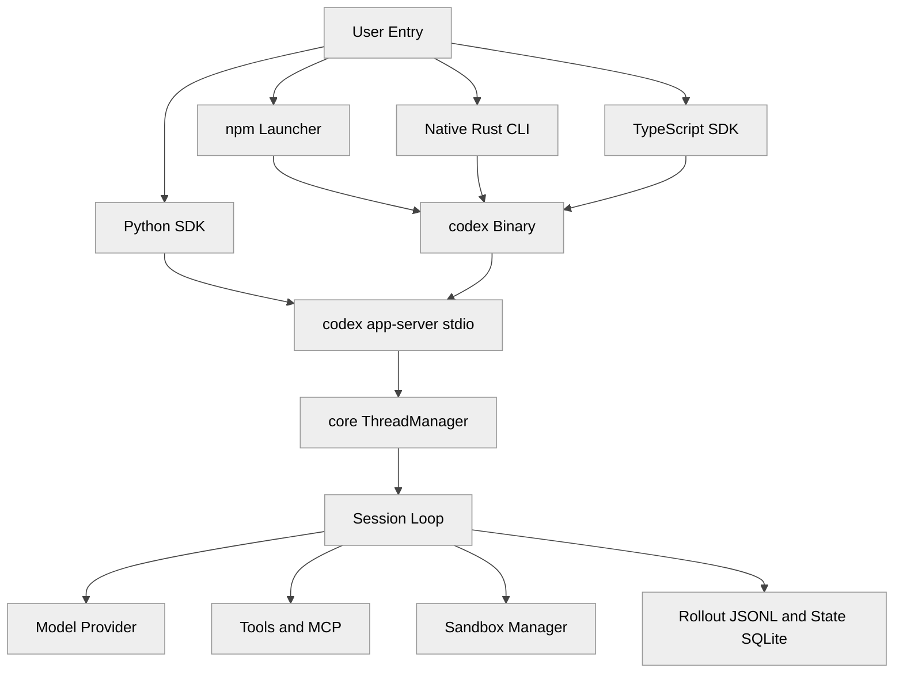
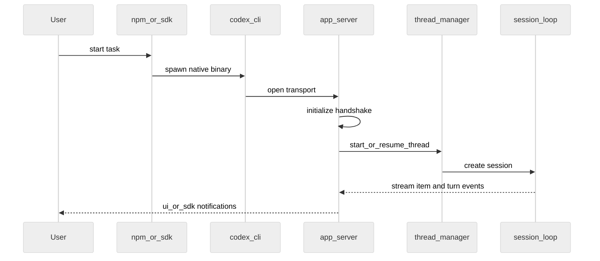
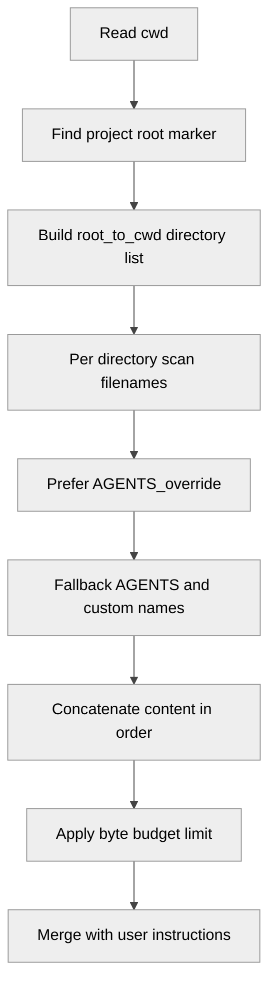
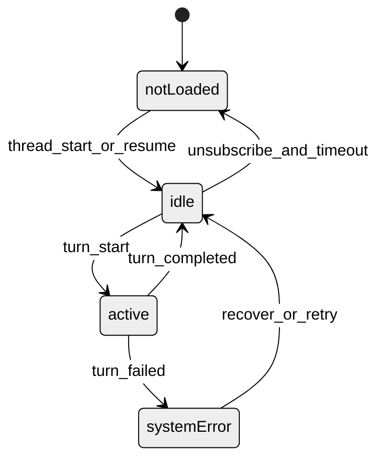
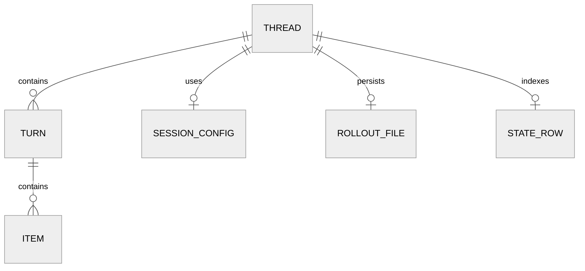

# 第 01 章 项目全景与设计哲学

## 引言

如果把 Codex 只看成一个“会写补丁的命令行工具”，容易陷入两个理解偏差：一是把它当作模型能力的直接外化；二是把它当作单进程、单入口、单协议的 CLI 程序。源码呈现的事实更接近另一种描述：Codex 看上去更像一个“长期运行的工程执行系统”——模型是其中可替换的一个组件，协议层与会话持久化才是相对稳定的边界。本章用源码证据来支持这种解读，但也保留它只是“当前实现层面的合理解释”这一前提，不把它当作官方设计意图的断言。  

这一章不追求覆盖所有子系统细节，而是回答四个底层问题：Codex 到底是什么、它在解决什么现实问题、它为什么要这样分层、以及它相对于同类工具的设计取舍。后续章节会逐个下沉到 `core`、`sandbox`、`app-server`、`MCP`、`state` 等模块；本章负责先给出一张可以复用到全书的“认知地图”。

---

## 全网调研补充

### 1) 调研样本与时间窗口

本章按照“近 12 个月中英文材料 + 官方一手优先 + 社区体验补充”的规则，检索并交叉验证了以下来源：

- 官方：OpenAI 博客（`Introducing Codex`、`Unrolling the Codex agent loop`、`Unlocking the Codex harness`）、OpenAI Developers 文档（CLI、Config、MCP、AGENTS.md）。
- 英文社区：Simon Willison、Hacker News 讨论串、Latent Space 播客/访谈、第三方工程博客（安全与架构拆解）。
- 中文社区：知乎、少数派、CSDN、掘金、博客园等（以安装实操、排障经验、工具选型对比为主）。

这一轮调研的最大价值不是“谁说得更对”，而是把社区讨论分成三类：**稳定共识**、**高频争议**、**系统盲区**。

### 2) 社区共识（收敛区）

过去一年里，关于 Codex 的共识比想象中更稳定，主要集中在六点：

1. Codex CLI 是“本地运行 + 代理循环 + 工具执行”的系统，不是传统补全器。
2. Rust 重写不是表面迁移，而是运行时统一和分发策略重构。
3. App Server 是关键中枢：CLI、IDE、桌面端、SDK 最终在这里汇合。
4. AGENTS.md 不是装饰性文档，而是可版本化的团队协作接口。
5. MCP 与插件能力已经从“加分项”变成“基础项”。
6. 上下文压缩（compaction）是必须品，但也是最容易暴露工程稳定性的问题点。

这几条共识与源码证据是同向的：入口、协议、执行、持久化都在仓库内有直接实现，而不是停留在文档层愿景。

### 3) 主要争议与常见误解（分歧区）

本章调研里，争议最大的是三组对立叙事：

- **“Codex 更像执行代理” vs “Codex 也在平台化”**  
  一部分社区把 Codex 看成“命令行执行器”，另一部分把它看成“协议化中台”。源码层面，`app-server`、`app-server-protocol`、`app-server-daemon` 同时存在，说明平台化不是社区想象，而是已落地结构。
- **“OS 沙箱更安全” vs “OS 沙箱更摩擦”**  
  前者强调边界可信，后者强调日常开发卡顿与权限疲劳。两个结论都成立，因为它们优化的是不同目标函数：前者最小化越权风险，后者最小化交互中断。
- **“AGENTS.md 是提示词文件” vs “AGENTS.md 是工程约束文件”**  
  误解通常来自把 AGENTS.md 当单文件注释。实际实现是“按目录层级拼接 + 字节预算 + override 优先级”，本质更接近可组合配置，而不是一次性 prompt。

高频误解还有两条：

- 误以为 npm 包承担主要逻辑；实际上 npm 层只负责平台识别与 native 二进制拉起。
- 误以为 SDK 是直接 API 封装；实际上 TS/Python SDK 大量复用本地 CLI 或 app-server 协议，强调运行语义一致而不是新造一套客户端语义。

### 4) 盲区（本章重点补位）

调研后最明显的盲区，不在“模型效果”而在“系统工程边界”：

- 很少有文章系统讨论“多入口一致性如何维持”。
- 很少有文章把 `Thread / Turn / Item` 当作状态机对象去分析。
- 很少有文章解释 AGENTS 分层算法与 `project_doc_max_bytes` 的真实影响。
- 对 Windows/Linux/macOS 沙箱实现差异的公开分析，远少于对命令参数的介绍。

本章后续七维分析，重点就放在这些盲区。

---

## 七维分析

## 一、本质是什么：Codex 的系统定位

如果只用一句话描述当前源码呈现的 Codex 形态，它更接近“一个多入口、单核心、事件驱动的工程代理运行时”，而不是一个传统单一职责的 CLI。这种描述不是官方原话，而是基于入口层、核心层、协议层三处证据汇总出来的工程归纳。

先看入口层，根 README 对 Codex 的定义是“本地运行的 coding agent”，同时明确区分了 IDE、桌面端、云端 agent 三个面：

```markdown
# README.md:1
<p align="center"><strong>Codex CLI</strong> is a coding agent from OpenAI that runs locally on your computer.
...
</br>If you are looking for the <em>cloud-based agent</em> from OpenAI, <strong>Codex Web</strong>, go to ...
```

再看 Rust 核心 README，官方先把 Rust 实现定位成“维护主线”：

```markdown
# codex-rs/README.md:23
The Rust implementation is now the maintained Codex CLI and serves as the default experience.
```

随后在「Code Organization」小节里把 `core / exec / tui / cli` 列为同一 Cargo workspace 的关键 crate：

```markdown
# codex-rs/README.md:94
- core/ contains the business logic for Codex. ...
- exec/ "headless" CLI for use in automation.
- tui/ CLI that launches a fullscreen TUI built with Ratatui.
- cli/ CLI multitool that provides the aforementioned CLIs via subcommands.
```

最后看协议层，`app-server` 文档明确是双向 JSON-RPC，且是多传输（stdio/ws/unix/off）：

```markdown
# codex-rs/app-server/README.md:22
Similar to MCP, `codex app-server` supports bidirectional communication using JSON-RPC 2.0 messages ...
- stdio (`--listen stdio://`, default)
- websocket (`--listen ws://IP:PORT`)
- unix socket ...
```

基于这三层证据，可以给出一个相对收敛的工程定义：**Codex ≈ 单一 Rust 执行核心 + 多 surface 入口 + 协议化线程运行时 + 平台差异化沙箱后端**。这只是按当前源码结构归纳的描述，而非官方对外的标准定义；后续章节如果发现实际语义偏离这个框架，应回到源码修正描述，而不是反向维护此结论。

### 架构图：从入口到执行域

<div style="background:#ffffff !important; background-color:#ffffff !important; padding:16px; border-radius:8px; margin:16px 0;" bgcolor="#ffffff">



</div>

---

## 二、核心问题和痛点：Codex 想解决什么

从源码和文档同时看，Codex 针对的是传统 AI 编码工作流的五个结构性痛点。

### 痛点 1：入口碎片化导致行为漂移

用户可能通过 npm、二进制、TUI、exec、SDK、IDE 等路径进入系统。入口越多，行为漂移概率越高。  
Codex 的做法是把 npm 层降到“分发与启动”，核心逻辑集中在 Rust 二进制：

```javascript
// codex-cli/bin/codex.js:184
const child = spawn(binaryPath, process.argv.slice(2), {
  stdio: "inherit",
  env,
});
```

这意味着：npm 层不参与业务语义，只负责把控制权交给统一运行时。

### 痛点 2：长任务需要可恢复状态，而不是一次性回复

App Server 把会话拆成 `Thread / Turn / Item` 三层对象，不再把交互建模为单轮问答：

```markdown
# codex-rs/app-server/README.md:68
- Thread: A conversation ...
- Turn: One turn of the conversation ...
- Item: ... user message, agent reasoning, agent message, shell command, file edit ...
```

对应到核心实现，`Session` 明确“同一时刻最多一个运行任务，但可被用户输入打断”：

```rust
// codex-rs/core/src/session/session.rs:18
/// A session has at most 1 running task at a time, and can be interrupted by user input.
pub(crate) struct Session { ... }
```

### 痛点 3：协作约束难以版本化

AGENTS.md 的设计不是“读一个文件”，而是按路径层级收集，并做预算截断，这是一套可组合规则系统：

```rust
// codex-rs/core/src/agents_md.rs:13
//! 2. Collect every `AGENTS.md` found from the project root down to the
//!    current working directory (inclusive) and concatenate ...
...
if self.config.project_doc_max_bytes == 0 { return Ok(Vec::new()); }
```

### 痛点 4：跨平台安全边界不一致

`--sandbox` 并不是一个“同构后端开关”，而是按平台映射到不同机制：

```markdown
# codex-rs/README.md:61
# Seatbelt on macOS, the Linux sandbox on Linux, and Windows restricted token on Windows.
```

### 痛点 5：协议兼容与演进冲突

仓库内给出明确治理约束：新 API 开发聚焦 v2，避免继续扩 v1：

```markdown
# AGENTS.md:186
All active API development should happen in app-server v2. Do not add new API surface area to v1.
```

这条规则直接来自仓库自身的 `AGENTS.md` 治理文本，可视作团队约束，而非源码可以单点证明的“设计哲学”。但从结构上看，**把兼容当作显式成本、把演进方向写进可执行规则**，是当前仓库可观察到的治理取向。

---

## 三、解决思路与方案：分层、状态机、协议化

这一维度回答“为什么是这种结构，而不是另一种结构”。

### 方案 1：Cargo workspace 把系统拆成可组合能力块

`codex-rs/Cargo.toml` 的成员列表覆盖了 CLI、TUI、App Server、Sandbox、MCP、State、Plugin、Cloud 等能力域：

```toml
# codex-rs/Cargo.toml:1
[workspace]
members = [
    "aws-auth",
    "analytics",
    ...
    "cli",
    ...
    "core",
    ...
    "linux-sandbox",
    ...
    "tui",
    ...
]
```

同时统一 edition 与 license：

```toml
# codex-rs/Cargo.toml:119
[workspace.package]
version = "0.0.0"
edition = "2024"
license = "Apache-2.0"
```

这意味着它不是“把全部逻辑塞进 core”，而是 workspace 级功能分治。

### 方案 2：CLI 多子命令，但运行时语义集中

`Subcommand` 枚举在一个入口里把核心能力分发出去（exec/review/mcp/app-server/cloud/sandbox 等）：

```rust
// codex-rs/cli/src/main.rs:117
enum Subcommand {
    Exec(ExecCli),
    Review(ReviewCommand),
    Mcp(McpCli),
    AppServer(AppServerCommand),
    Sandbox(HostSandboxArgs),
    Cloud(CloudTasksCli),
    ...
}
```

本地统计（2026-05-26）显示该枚举包含 23 个跨平台子命令，加上仅在 macOS/Windows 启用的 `App` 子命令，共 24 项分发面。无论按 23 还是 24 计，单二进制对外暴露的执行面已经远多于传统单一用途 CLI；这至少说明 Codex 把 CLI 当作“多执行面入口”而不仅是“一组命令”。

### 方案 3：ThreadManager 统一线程生命周期

线程创建、恢复、分叉都收敛到 `ThreadManager`，避免每个入口重复实现生命周期逻辑：

```rust
// codex-rs/core/src/thread_manager.rs:546
pub async fn start_thread(&self, config: Config) -> CodexResult<NewThread> { ... }
...
pub async fn resume_thread_with_history(...) -> CodexResult<NewThread> { ... }
...
pub async fn fork_thread<S>(...) -> CodexResult<NewThread> { ... }
```

### 方案 4：App Server 协议握手先行

App Server 要求连接先 `initialize` 再 `initialized`，否则拒绝后续请求：

```markdown
# codex-rs/app-server/README.md:76
Initialize once per connection ... Any other request ... before this handshake gets rejected.
```

Python SDK 也严格按该语义启动：

```python
# sdk/python/src/openai_codex/client.py:265
result = self.request("initialize", {...}, response_model=InitializeResponse)
self.notify("initialized", None)
```

### 方案 5：SDK 不另造协议，而是复用 CLI/app-server 语义

TS SDK 明确走 CLI 子进程并消费 JSONL 事件：

```typescript
// sdk/typescript/src/exec.ts:86
async *run(args: CodexExecArgs): AsyncGenerator<string> {
  const commandArgs: string[] = ["exec", "--experimental-json"];
  ...
  for await (const line of rl) {
    yield line as string;
  }
}
```

Python SDK 明确走 `codex app-server --listen stdio://`：

```python
# sdk/python/src/openai_codex/client.py:224
args.extend(["app-server", "--listen", "stdio://"])
```

从两段 SDK 实现可以归纳出一个共同的取向：**入口可以多样，语义尽量收敛于 CLI/app-server 主路径**。这是一个对当前实现的描述性归纳，不一定是 OpenAI 公开宣称的设计原则。

### 启动流程图：多入口收敛到同一线程循环

<div style="background:#ffffff !important; background-color:#ffffff !important; padding:16px; border-radius:8px; margin:16px 0;" bgcolor="#ffffff">



</div>

---

## 四、实现细节关键点：关键路径、关键函数、关键数据流

### 关键点 A：AGENTS 分层装载不是文档约定，而是可执行算法

AGENTS 装载的关键步骤写在 `agents_md.rs`：

```rust
// codex-rs/core/src/agents_md.rs:243
async fn agents_md_paths(...) -> io::Result<Vec<AbsolutePathBuf>> {
    ...
    let search_dirs = if let Some(root) = project_root { ... };
    ...
    for d in search_dirs {
        for name in &candidate_filenames {
            let candidate = d.join(name);
            ...
        }
    }
}
```

候选文件优先级也写死在实现里：`AGENTS.override.md` > `AGENTS.md` > fallback：

```rust
// codex-rs/core/src/agents_md.rs:335
fn candidate_filenames(&self) -> Vec<&str> {
    names.push(LOCAL_AGENTS_MD_FILENAME);
    names.push(DEFAULT_AGENTS_MD_FILENAME);
    ...
}
```

这解释了为什么 `docs/agents_md.md` 虽然很短，但行为并不简单；复杂度在代码，不在文档篇幅。

### 关键点 B：SessionConfiguration 是“线程运行时配置快照”

`SessionConfiguration` 拥有 28 个字段（本地脚本统计），涵盖模型、审批、权限、工作目录、插件、环境、遥测等，说明它是运行时控制面，不只是“模型参数集合”：

```rust
// codex-rs/core/src/session/session.rs:43
pub(crate) struct SessionConfiguration {
    pub(super) provider: ModelProviderInfo,
    pub(super) collaboration_mode: CollaborationMode,
    pub(super) approval_policy: Constrained<AskForApproval>,
    pub(super) permission_profile_state: PermissionProfileState,
    pub(super) cwd: AbsolutePathBuf,
    pub(super) environments: Vec<TurnEnvironmentSelection>,
    ...
}
```

### 关键点 C：Thread 对外 API 刻意保持窄接口

`CodexThread` 作为对外线程句柄，核心暴露是 `submit/next_event/steer_input` 等窄接口，避免上层任意改动 Session 内部状态：

```rust
// codex-rs/core/src/codex_thread.rs:131
pub async fn submit(&self, op: Op) -> CodexResult<String> {
    self.codex.submit(op).await
}
...
pub async fn steer_input(...) -> Result<String, SteerInputError> { ... }
```

这种“窄接口 + 内部状态收敛”的写法可能是出于减少能力泄漏、约束外部对 Session 内部状态读写的考量；但仓库注释并未直接说明动机，所以更稳妥的表述是：从接口形态看，线程句柄被刻意做窄，可变状态被集中在 session loop 内部。

### 关键点 D：App Server 入口把 transport 与 runtime option 解耦

`app-server` 主入口先解析 `--listen`，再组合 runtime options：

```rust
// codex-rs/app-server/src/main.rs:22
/// Transport endpoint URL. Supported values: `stdio://` (default),
/// `unix://`, `unix://PATH`, `ws://IP:PORT`, `off`.
...
run_main_with_transport_options(..., transport, session_source, auth, runtime_options).await?;
```

这为后续 daemon 化、远程控制、WebSocket 扩展预留了稳定注入点。

### 关键点 E：SDK 事件路由显式处理“早到通知”

Python SDK 的 `MessageRouter` 专门维护 pending 队列，解决 turn 启动后事件先于消费方注册的问题：

```python
# sdk/python/src/openai_codex/_message_router.py:94
# A turn can emit events immediately after turn/start ...
pending = self._pending_turn_notifications.pop(turn_id, deque())
```

这个细节比较关键：如果没有 pending 缓冲，流式事件可能在“turn 已开始、消费者尚未注册”的窗口里被丢弃，且无重放路径。这是源码层面可直接观察到的行为，不是文档里的承诺。

### AGENTS 发现流程图

<div style="background:#ffffff !important; background-color:#ffffff !important; padding:16px; border-radius:8px; margin:16px 0;" bgcolor="#ffffff">



</div>

---

## 五、易错点和注意事项：边界、陷阱、隐式依赖

### 陷阱 1：把 `docs/` 当完整规范来源

仓库 `docs/` 下多个文档是跳转型入口，而不是完整规范。比如：

```markdown
# docs/config.md:3
For basic configuration instructions, see this documentation ...
```

再加上 `docs/contributing.md` 明确“外部代码贡献 invitation-only”：

```markdown
# docs/contributing.md:3
**External contributions are by invitation only**
```

所以做源码分析时，不能只读 `docs/`；必须回到实现与协议定义。

### 陷阱 2：误把 AGENTS 看成单文件

当前基线仓库实测只有 2 个 AGENTS 文件（根目录 + `codex-rs/tui/src/bottom_pane/AGENTS.md`），但 `agents_md.rs` 中 `agents_md_paths` 的实现支持从项目根到 cwd 的逐目录扫描与拼接。也就是说，在第三方大仓库里，AGENTS 实际生效内容会随 cwd 变化。  
如果你在错误目录启动，会得到不同的指导上下文，这属于“隐式依赖”。

### 陷阱 3：把 `sandbox` 视作单维开关

源码显示 `sandbox` 与 `approval_policy`、`permission_profile`、`network policy` 是联动关系，而不是独立按钮。  
在调试失败时只改一个开关，通常无法定位根因。

### 陷阱 4：忽略握手顺序导致协议误判

`initialize -> initialized` 的时序是硬约束；任何绕过顺序的客户端都可能被判定为“Not initialized”。  
很多第三方“偶发无响应”的问题，本质上是协议前置条件没满足。

### 陷阱 5：事件流消费方没做背压与缓存

TS/Python SDK 都把事件解析和缓冲当核心逻辑；如果自己写客户端直接逐行读 stdout 且不做路由，你会丢 turn 级别事件，后果是状态错乱、重复执行、甚至错误补偿。

---

## 六、竞品对比：Claude Code / Opencode / Aider / Goose / Continue

这一节只给“工程结构维度”的比较，不做模型分数比较。模型会迭代，结构通常慢变量。

### 对比矩阵（结构视角）

| 维度 | Codex | Claude Code | Opencode | Aider | Goose / Continue |
|---|---|---|---|---|---|
| 主执行语言 | Rust 主体 + npm 启动器 | 以 TS 生态为中心 | 多语言混合 | Python 工具链 | 多为 TS/Go/混合 |
| 核心运行时边界 | `core` + `ThreadManager` + `Session` | 更强调交互工作流与 hooks 治理 | 偏“开发体验整合” | 偏“repo 协作与补丁流” | 偏“扩展生态与 IDE 集成” |
| 协议化程度 | 显式 `app-server-protocol` | 有接口能力但公开协议边界相对弱 | 公开资料更偏产品层 | 较轻协议层 | 依赖扩展协议与插件通道 |
| 沙箱叙事 | OS 后端分治较强 | 以审批/策略可编程见长 | 实用优先 | 风险控制依赖用户流程 | 依赖宿主配置与扩展隔离 |
| 持久化模型 | Thread/Turn/Item + JSONL + SQLite | 会话连续性强，但实现细节公开程度不同 | 多面向产品交互层 | git + 对话协作 | 侧重连接器与上下文层 |

### 结构性差异结论

1. Codex 的强项不是“多一个命令”，而是“把协议与运行时做成可复用内核”。
2. Claude Code 的强项在治理可编程性（hooks 生态），Codex 的强项在跨入口执行一致性与系统级隔离。
3. Opencode/Aider/Goose/Continue 各有优势，但很多实现仍以“交互层创新”为主，未必都走到 Codex 这种“协议层产品化”深度。
4. 团队选型不应问“谁更强”，而应问“你的主痛点是执行边界、治理策略、还是交互效率”。

---

## 七、仍存在的问题和缺陷：局限与改进空间

即使在架构上已经很完整，Codex 仍有明显改进空间。

### 问题 1：复杂度持续上升，核心认知门槛很高

本地统计显示：

- `codex-rs/Cargo.toml` 共 528 行；
- workspace members 113；
- 仓库中 `codex-rs/**/Cargo.toml` 共 120 个；
- `core/src/session/session.rs`（1,235 行）、`core/src/thread_manager.rs`（1,542 行）、`cli/src/main.rs`（3,439 行）、`app-server/README.md`（1,954 行）均属千行级以上关键文件。

这意味着“功能增加”与“认知负担增加”几乎同步，维护成本会长期存在。

### 问题 2：文档策略偏“入口化”，学习路径依赖源码

很多 `docs/*.md` 是指向外部文档的跳转页，利于保持单一真相，但对离线分析和长期归档不友好。  
工程读者想做系统理解，最终仍要依赖仓库源码和 issue 时间线。

### 问题 3：跨平台安全策略带来调试复杂度

平台差异化是必要设计，但也使“同一个用户意图”在不同 OS 上可能出现不同失败模式。  
这会推高团队支持成本，尤其是 Windows 企业环境。

### 问题 4：协议演进与兼容并存带来的治理压力

v2 是主线方向，但 v1 兼容负担仍在。只要兼容窗口继续存在，测试矩阵和语义稳定性压力就不会消失。

### 问题 5：生态扩展与稳定性之间仍需平衡

MCP / plugin / marketplace 扩展越快，系统边界越容易出现“配置可达但运行不稳”的灰区。  
后续章节会重点分析“能力存在”与“能力可用”的差距。

### 线程生命周期状态图

<div style="background:#ffffff !important; background-color:#ffffff !important; padding:16px; border-radius:8px; margin:16px 0;" bgcolor="#ffffff">



</div>

### 数据结构关系图

<div style="background:#ffffff !important; background-color:#ffffff !important; padding:16px; border-radius:8px; margin:16px 0;" bgcolor="#ffffff">



</div>

---

## 定量速览（本章口径）

> 统计时间：2026-05-26；口径：本地脚本 + `wc -l` + `Cargo.toml` 枚举。

| 指标 | 数值 | 说明 |
|---|---:|---|
| `codex-rs` workspace members | 113 | 来自 `codex-rs/Cargo.toml` 成员枚举 |
| `codex-rs/**/Cargo.toml` 数量 | 120 | 含测试与子目录 crate manifest，`find codex-rs -name Cargo.toml` 实测 |
| Rust 源文件数 | 2,008 | `codex-rs/**/*.rs` 统计 |
| Rust 源码行数 | 912,851 | 同口径逐文件计行 |
| SDK TypeScript 文件 | 23 | `sdk/**/*.ts` |
| SDK Python 文件 | 69 | `sdk/**/*.py` |
| CLI 主入口行数 | 3,439 | `codex-rs/cli/src/main.rs` |
| App Server README 行数 | 1,954 | `codex-rs/app-server/README.md` |
| AGENTS 指令文件数 | 2 | 根目录 + `tui/src/bottom_pane` |
| `SessionConfiguration` 字段数 | 28 | `core/src/session/session.rs` 结构体字段统计 |

这组数字的意义不是“越大越好”，而是解释为什么本书后续章节必须按“系统分层”写，而不是按“命令功能”写：规模已经是平台级，不是工具级。

---

## 七维扩展版补充论证

这一节是本章的“长文补丁”。如果说前文给的是可扫描的系统地图，这一节给的是可推演的工程逻辑：当你在一个真实团队里引入 Codex，为什么会遇到那些问题，为什么有些问题只能在架构层解决，为什么“换个更强模型”并不总能解决你看到的失败。

### 1) 本质再定义：Codex 是“受约束的自治执行系统”

很多团队第一次上手 Codex 时，会下意识沿用“对话助手”的心智模型：提问、等待、复制答案、人工执行。这个模型在简单任务上勉强可用，但在中型仓库会迅速失效，原因不是提示词不够好，而是系统边界被误解了。  
Codex 的设计前提是“执行优先而非回复优先”。从入口到运行时都在强化这一点：npm 启动器只负责把平台流量导向 native，Rust CLI 用统一子命令树绑定执行面，App Server 把交互拆到线程生命周期，核心 Session 把用户输入、审批、工具调用、状态落盘都当作同一状态机里的事件。  
这种设计的关键收益是：系统可以在用户暂时离开时继续稳定推进，或者在用户回来的时候恢复上下文，而不是每次都靠模型“再理解一次现场”。

```javascript
// codex-cli/bin/codex.js:129
// Use an asynchronous spawn instead of spawnSync ...
// ... both processes exit in a predictable manner.
```

上面的注释很能说明问题：连进程生命周期都在强调“可预期退出语义”，这不是聊天工具会优先考虑的点，而是执行系统才会优先考虑的点。  
同样，`CodexThread` 暴露的不是“回答接口”，而是提交事件、流式取事件、中断、转向、快照读取这类控制接口。也就是说，API 设计本身已经把“系统控制面”摆在“文本输出”之前。

### 2) 核心问题再拆分：不是一个痛点，而是一组互相耦合的痛点

如果把 Codex 的问题拆得过细，你会得到一堆局部优化建议；如果拆得过粗，你又会得到“模型不够强”这种空结论。更合理的拆分方式，是按耦合关系分四组。

第一组是**入口一致性问题**。当同一系统有 CLI、SDK、IDE、daemon 时，最常见的失败不是单点 bug，而是语义漂移：同一个参数在不同入口含义略有偏差，或者默认值不同导致结果不同。Codex 的方案是尽可能把入口压扁，让多数入口最终走 `codex` 或 `codex app-server`，减少重复实现。

第二组是**会话连续性问题**。在真实工程任务里，用户输入不是严格串行的，常见模式是“中断 -> 改目标 -> 继续执行 -> 回滚部分历史 -> 再继续”。这要求系统支持线程分叉、恢复、回放、中断标记，而不是把每次请求当无状态调用。`ThreadManager` 大量代码都在处理这个问题，尤其是 fork/resume 时如何处理 mid-turn 状态。

第三组是**安全边界问题**。如果代理能执行命令，就必须回答“在哪里执行、能访问什么、失败如何退化”。Codex 不是通过一层抽象权限文本解决，而是把 OS 机制、审批策略、权限 profile 叠在一起。这带来的副作用是复杂，但收益是边界更可解释。

第四组是**团队协作可复用问题**。个人 prompt 可用一次，团队约束要可审查、可演化、可继承。AGENTS 分层机制正是在解决这一组问题。它把“经验”变成“路径相关的规则资产”。

这四组问题互相影响：你放宽 sandbox，会改变审批体验；你缩短上下文预算，会影响 AGENTS 与线程恢复效果；你新增入口，不处理协议约束就会引入新的漂移点。  
所以 Codex 的设计哲学本质上是“先承认耦合，再在耦合中做边界设计”。

### 3) 解决方案的工程权衡：为什么不是更简单的架构

读代码时最容易问的问题是“为什么不更简单”。这个问题很对，但要补一句：简单是对谁简单。  
对初学者简单的系统，不一定对长期维护简单；对单人脚本简单的系统，不一定对团队协作简单。

#### 权衡 A：单体核心 vs 模块化 workspace

`codex-rs` 选择了大 workspace，而不是“一个超大 crate + 几个 util”。这使得模块边界更清晰，但依赖治理更难。  
不过从维护视角看，这是更可持续的方向：`app-server`、`mcp`、`sandbox`、`plugin`、`state` 可以独立演进，不必每次改动都触碰同一核心文件。

#### 权衡 B：协议先行 vs 产品先行

许多工具先把产品做出来，再补协议；Codex 更像“边做产品边固化协议”。`app-server/README.md` 虽然很长，但它的价值是把行为契约写清楚，降低接入方猜测成本。  
代价是显而易见的：协议文档与实现必须长期同步，任何字段变更都会放大测试成本。

#### 权衡 C：系统级隔离 vs 交互流畅

审批和 sandbox 的存在会打断流程，这是事实；但没有它们，代理系统就难以进入企业环境。  
Codex 的折中方式不是取消隔离，而是提供不同策略组合，并把策略变更纳入配置层。这也是为什么 `SessionConfiguration` 字段会这么多——它本质是“策略快照”。

#### 权衡 D：文档入口化 vs 仓库内百科化

Codex 选择把很多文档主内容放在 developers 站点，仓库 docs 只留入口。  
这样做的好处是官方文档统一更新快，坏处是源码研究者需要双栈阅读（仓库 + 外部文档）。对于写书来说，这会增加证据收集成本，但也逼迫我们更多依赖代码实证。

### 4) 实现细节再下沉：从函数到数据流

前文已经列出关键路径，这里进一步把“函数职责”和“数据流转”对应起来，避免只看名字不看语义。

#### 路径 1：`main.rs` 子命令分发不是 if-else，而是“策略编排层”

`match subcommand` 看似只是分发，但它在每个分支里做了三件事：根配置前置、远程模式约束检查、特定子系统参数继承。  
这意味着 CLI 主入口既是路由器，也是策略注入器。比如 `review` 并不是独立实现，而是改写成 `exec review` 语义执行，这减少了重复路径。

```rust
// codex-rs/cli/src/main.rs:890
let mut exec_cli = ExecCli::try_parse_from(["codex", "exec"])?;
exec_cli.command = Some(ExecCommand::Review(review_args));
codex_exec::run_main(exec_cli, arg0_paths.clone()).await?;
```

#### 路径 2：`ThreadManager` 负责生命周期，而不是业务执行

`start_thread`、`resume_thread_with_history`、`fork_thread` 都在 `ThreadManager`，但它不直接执行业务逻辑，而是构造初始历史、环境选择和会话来源，再交给 spawn 路径。  
这种分层的意义是：生命周期策略和业务执行解耦，便于后续引入子代理、外部会话迁移、云端任务分发。

```rust
// codex-rs/core/src/thread_manager.rs:591
Box::pin(self.state.spawn_thread_with_source(
    options.config,
    options.initial_history,
    ...
))
```

#### 路径 3：`Session` 把策略态和运行态绑定

`SessionConfiguration` 不是静态配置副本，它会在会话中被读取、预览、更新，并直接影响工具连接、MCP 运行上下文、审批逻辑。  
比如 MCP 连接初始化会拿审批策略、权限 profile、运行 cwd 一起构造，这说明策略不是外围参数，而是连接行为的一部分。

```rust
// codex-rs/core/src/session/session.rs:1147
let (mcp_connection_manager, cancel_token) = McpConnectionManager::new(
    &mcp_servers,
    ...
    &session_configuration.approval_policy,
    ...
    session_configuration.permission_profile(),
    mcp_runtime_context,
    ...
)
```

#### 路径 4：SDK 用“消息路由器”稳定单流 stdio

Python SDK 的 `MessageRouter` 不是可选组件，它解决的是 stdio 单流消费冲突：一个 reader 线程读取，多个调用方按 request/turn/login 维度分流。  
如果没有这个路由器，任何并发调用都会出现响应串线。

```python
# sdk/python/src/openai_codex/_message_router.py:19
# The app-server stdio transport is a single ordered stream ...
# ... giving each in-flight JSON-RPC request and active turn stream its own queue.
```

这也是一个很容易被忽略的设计哲学：**当底层传输是单流时，稳定性来自路由层，而不是调用方自觉**。

### 5) 易错点再展开：从“症状”回到“结构原因”

前文列了五个陷阱，这里再补充三个“看起来像 bug，其实是结构选择”的常见误区。

#### 误区 A：为什么文档短，代码却很复杂

`docs/agents_md.md` 只有 7 行，很多人会以为 AGENTS 机制很轻。  
实际上，复杂度被下沉到了 `core/src/agents_md.rs`：项目根查找、候选文件优先级、UTF-8 容错、字节预算截断、特性开关拼接都在这里。  
也就是说，“文档短”是信息组织策略，不是功能复杂度低。

#### 误区 B：为什么同一参数在不同入口行为不同

根因通常不是参数本身，而是入口默认策略不同。比如 app-server 默认 analytics 关闭、某些子命令拒绝远程模式、某些子命令继承 root config。  
如果你只盯参数，不看入口分支前置逻辑，就会误判为随机行为。

#### 误区 C：为什么有时候事件先到了，句柄还没创建

这不是 race bug，而是流式系统正常现象：`turn/start` 成功后，事件可能立刻开始流动。  
SDK 的 pending 队列机制正是为这个现实设计的。  
如果你自写客户端没做这层缓存，就会出现“丢第一批 delta”。

#### 误区 D：为什么“可以配置”不等于“稳定可用”

在扩展生态里，配置成功只代表解析成功，不代表运行链路稳定。MCP server、plugin marketplace、远程 transport 都会引入额外外部依赖。  
因此调试时要分三层看：配置层通过、连接层通过、运行层通过。三层缺一不可。

### 6) 竞品对比再细化：按工作负载而不是品牌对比

把 Codex 与 Claude Code、Opencode、Aider、Goose、Continue 比较时，最常见错误是按“品牌优劣”结论。更有效的方法是按工作负载类型拆分：

1. **高约束执行任务**（需要明确审批边界、受限目录、可追溯日志）  
   Codex 的结构优势更明显，尤其在协议和状态持久化层。
2. **高交互探索任务**（需求模糊、频繁改方向、强调即时讨论）  
   一些强调交互治理和 hooks 的工具会更顺手。
3. **生态拼装任务**（大量第三方工具接入、流程自动化）  
   MCP/plugin 能力和生态成熟度决定上限，单次模型能力反而是次要矛盾。
4. **多人协作与审计任务**（回放、复盘、责任边界）  
   Thread/Turn/Item + 持久化模型会带来明显组织收益。

这也是本书后续对比章节的方法论：**先定义任务，再谈工具；先定义边界，再谈体验**。  
如果缺少这一步，就很容易把“某次体验很好/很差”误当成架构结论。

### 7) 缺陷与改进再推演：未来一年最关键的四个方向

基于当前源码结构，可以合理推演出四条高概率演进方向。

#### 方向 1：协议治理进一步收敛到 v2

v1 与 v2 并存是过渡态，不是终态。后续高价值能力（更细粒度权限、更稳定的分页与流式通知、远程控制扩展）大概率继续在 v2 首发。  
这要求生态方尽早迁移，不要在 v1 上继续积累技术债。

#### 方向 2：配置层会继续“强约束化”

`requirements.toml`、managed hooks、feature pinning 这类能力说明配置层正在从“用户偏好”向“组织策略”演进。  
未来很可能看到更多“可写但不可覆写”的策略键，用于企业治理一致性。

#### 方向 3：线程与子代理关系会更显式

`ThreadManager` 已有 subtree 与 spawn 相关路径，说明多代理编排不是外围实验，而是核心路径延展。  
这会让“单线程线性任务”逐步变成“线程树形任务”，也会抬高可视化和调试需求。

#### 方向 4：扩展生态将进入“稳定性竞赛”阶段

当 MCP 和 plugin 从“有没有”进入“用得久不久”，核心竞争点会从接入速度转向运行稳定性：断线重连、权限一致性、缓存刷新一致性、故障可恢复性。  
换句话说，真正的门槛会从“支持多少协议”转成“能否在复杂现场维持可预期行为”。

### 补充流程图：约束策略决策链

<div style="background:#ffffff !important; background-color:#ffffff !important; padding:16px; border-radius:8px; margin:16px 0;" bgcolor="#ffffff">


</div>

这条链路解释了一个核心事实：Codex 的行为不是单点决策，而是多层约束共同产物。  
因此，任何“看起来随机”的结果，最终都能在这条链路里定位到结构原因：配置合并、权限映射、审批策略、后端差异、事件消费或持久化语义。

---

## 工程案例推演

为了避免“架构概念听起来正确，但落地时不知从哪里下手”，这一节给出三个完整推演。它们不是虚构故事，而是把前文七维分析映射到真实团队会遇到的工作流。你会看到同一套源码结构，在不同阶段分别起什么作用，哪里会成为瓶颈，哪里又是 Codex 与传统助手最大差异。

### 案例一：一个中型仓库从零引入 Codex 的第一周

假设团队接手一个中型 monorepo，历史包袱重、测试速度慢、上下文切换频繁。第一天通常会先做安装和登录，第二天会尝试让 Codex 帮忙修几个问题，第三天开始尝试把它接到 CI 或内部工具。  
如果这时团队还把 Codex 当“聊天助手”，就会出现一个典型现象：每个人都能在本机跑出“看起来不错”的结果，但跨成员复现失败，大家会误以为“模型随机”。事实上，问题往往出在三件事：启动目录不一致、AGENTS 上下文不一致、审批策略不一致。  
所以，第一周最重要的动作不是“写更复杂的 prompt”，而是先建立运行基线：统一启动目录、统一默认 profile、统一 AGENTS 文档结构、统一审批模式。  
这个动作一旦完成，团队会马上发现一个变化：讨论内容从“它怎么又不一样”转成“我们该不该允许这类命令在这个目录执行”。前者是运气问题，后者是治理问题。Codex 的价值正是在这里显现：它把原本不可讨论的“隐性执行行为”变成可讨论、可审查、可版本化的工程对象。

第一周后半段通常会进入“复用阶段”。有人希望在脚本里调用，有人希望在 IDE 插件里调用，有人希望在流水线里调用。传统工具在这里常见的问题是行为断裂：命令行能做的，SDK 版本做不了；IDE 里能做的，脚本里语义不同。  
Codex 借助 App Server 与统一线程模型缓解了这个问题：入口不同，但线程语义和事件语义尽量对齐。对团队而言，这意味着你可以把经验迁移，而不必每个入口重学一套心智模型。  
当然，这不代表“完全无差异”。差异仍然存在，例如 transport 选择、默认配置、交互节奏不同；但这些差异已经被限制在“可枚举边界”里，而不是漫无边际的黑箱差异。

### 案例二：一次“看似随机失败”的完整复盘

场景：同一任务在开发者甲机器上可以完成，在开发者乙机器上失败。失败表现是某个工具调用被拒绝、turn 中断、后续重复读仓。  
典型错误复盘方式是直接比较 prompt 内容；更有效的方式是按“约束决策链”逐层排查。

第一步先看配置层：两台机器是否用了相同 profile，项目是否都被标记为 trusted，是否有本地 override。很多“神秘差异”到这里就结束了。  
第二步看 AGENTS 层：两人是否在同一 cwd 启动，是否读到了相同层级 AGENTS，是否触发了 fallback 文件名。  
第三步看策略层：审批策略是否一致，权限 profile 是否一致，sandbox 是否同级别。  
第四步看执行层：是否同一平台后端，是否触发了平台特定限制。  
第五步看事件层：失败前后的 turn/item 事件是否完整，是否有 early event 丢失。

如果按这五步排查，你会发现所谓“随机失败”几乎总能落到结构原因。  
这也是本书强调“定量优先于定性”的原因：一旦把失败点绑定到具体路径和具体事件，你就能复现、修复、验证；如果只停留在“模型今天不稳定”，你会得到无法行动的结论。  
更重要的是，这种复盘方式能形成团队资产：下一次相似问题出现时，大家不再从零猜测，而是复用既有排查模板。长期看，这比任何一次单点提效都更有价值。

### 案例三：从个人提效到团队治理的迁移路径

很多组织引入 Codex 时都会经历三阶段：个人试用、团队推广、组织治理。  
个人试用阶段的目标是“能跑通”；团队推广阶段目标变成“可复现”；组织治理阶段目标是“可审计、可控风险、可持续迭代”。  
这三阶段如果仍沿用同一套方法，通常会卡住：个人阶段强调速度，组织阶段强调边界，两者天然冲突。

Codex 的设计给出了一条相对平滑的迁移路径：  
在个人阶段，你可以用更激进策略追求效率；  
在团队阶段，你可以把 AGENTS、profile、审批策略收敛为项目规范；  
在组织阶段，你可以通过 requirements 和受控配置实现“可写不可越权”的治理。  
关键在于，三阶段不是三套系统，而是同一系统不同配置层次。这个连续性会显著降低迁移成本。

这条路径也解释了一个常见误会：有人认为“治理越强，效率越低”。  
短期看，确实会出现额外操作；但中长期看，治理减少的是“不可预期返工”。在工程组织里，返工成本远高于一次审批成本。  
Codex 的价值不在于让每一步都更快，而在于让系统整体更稳：少出大错、可回放、可追责、可迭代。

---

## 团队落地实践清单

这一节给出可直接执行的落地清单。它不是规范文本，而是从源码结构反推出来的实践优先级。按顺序执行，收益通常会明显高于“先追求高级功能”。

第一，先统一入口，再统一提示。  
如果入口行为不一致，提示词质量再高也会被执行边界差异抵消。团队应先统一 `codex` 启动方式、默认 profile、默认 sandbox 与审批模式，再讨论提示模板库。  

第二，先建立 AGENTS 最小骨架，再逐步分层。  
不要一开始就写超长 AGENTS 总文档。先写项目级最小规则，跑稳定后再按子目录拆分。这样可以避免上下文预算被一次性耗尽，也更容易定位规则冲突。  

第三，把“可运行命令”写成显式资产。  
无论在 AGENTS 还是团队手册，都应写明可以直接执行的命令，而不是抽象描述。可执行命令是代理系统的最小契约单位。  

第四，建立失败复盘模板并强制执行。  
建议模板至少包含：入口信息、cwd、配置层、权限层、事件层、持久化层。复盘不完整，问题就无法沉淀为组织能力。  

第五，明确哪些任务适合代理自动执行。  
不是所有任务都适合一键自动。涉及高风险迁移、生产配置、密钥策略的改动应当保持更高审批级别。  

第六，把“能力存在”与“能力可用”分开验收。  
例如插件市场可见并不代表可安装可运行；MCP server 可连接并不代表工具输出稳定。验收应覆盖完整执行链，而不是只看列表展示。  

第七，建立跨入口一致性回归。  
同一任务至少在 CLI 与一个 SDK 入口跑通，确认线程行为、事件行为、审批行为一致，再宣布“团队可用”。  

第八，给线程与会话资产建立命名规则。  
线程命名、归档、恢复、分叉如果没有统一规则，历史会很快失控，后续无法做有效复盘。  

第九，设定上下文治理策略。  
长会话不是越长越好，应该有明确的 compact 触发、重开线程、分叉线程准则，避免把所有任务堆在一个线程里。  

第十，把安全边界当作产品功能，而不是合规负担。  
很多团队直到出事故才重视审批与沙箱。更好的做法是从第一天就把边界设计当作体验设计的一部分：边界清晰，本身就是效率。

这十条实践背后的共同原则只有一句：**先让系统可预测，再追求局部最快**。  
代理系统最怕的是“看起来偶尔很快，但整体不可预测”。Codex 的工程哲学恰恰是把可预测性放在第一位。

---

## 研究方法反思：为什么本章必须“源码实证 + 社区校准”

很多源码分析文章容易走两个极端：要么只讲源码、忽略真实使用反馈；要么只讲社区体感、忽略实现边界。本章刻意采用双证据路径，是因为 Codex 这类系统的价值来自“实现与实践的耦合”。

只看源码会漏掉什么？  
你会低估平台差异带来的现实摩擦，低估扩展生态中的运行不稳定，低估团队治理与个人提效之间的冲突。  
只看社区会漏掉什么？  
你会把很多可定位的问题误判为“玄学随机”，会把入口差异误判为模型差异，会把架构演进误判为功能堆砌。  

因此，本章的方法是：

1. 先用源码锚点确定“系统能做什么、如何做”；
2. 再用社区材料校准“系统在现实里哪里会掉链子”；
3. 最后把二者合并成可行动结论，而不是观点口号。

这种方法的收益，是后续章节可以持续复用同一评价框架。  
比如分析 sandbox 章节时，不会只停在“有哪些模式”，而会进一步问“模式如何与审批和 profile 联动”；分析 app-server 章节时，不会只停在“有哪些接口”，而会问“握手、通知、分页、回放在失败场景下如何表现”。  
换句话说，本章的意义不仅是讲清楚 Codex，更是给全书建立统一的推理方式。

如果用一句话总结本章的写作方法，那就是：  
**把抽象观点还原成可验证路径，把局部现象放回系统结构里解释。**

---

## 设计哲学十二条（可执行版本）

为了让本章结论在后续章节里可复用，这里把“设计哲学”压缩成十二条可执行原则。每条都对应一个工程动作，而不是抽象价值判断。

**第一条：入口可以多，执行语义必须一。**  
工程动作：任何新入口上线前，先确认是否复用现有 `codex` 或 `app-server` 主路径，避免平行实现。  
解释：入口多样是产品需要，语义一致是工程底线。没有这条底线，多入口会变成多系统。

**第二条：先定义生命周期，再定义功能接口。**  
工程动作：新能力优先挂在线程生命周期中，明确 start、resume、fork、interrupt、archive 行为，再扩展表层命令。  
解释：生命周期不清，接口越多越混乱；生命周期清楚，接口再多也可治理。

**第三条：把“状态”当一等公民。**  
工程动作：涉及跨回合行为的功能必须明确持久化语义，说明写入点、恢复点、回放点。  
解释：代理系统的难点不在生成文本，而在状态一致性。忽略状态就是把复杂度推迟到故障时爆发。

**第四条：规则应当路径化，而不是会话化。**  
工程动作：团队规范优先写入 AGENTS 分层文档，不依赖会话临时提示。  
解释：会话提示会消失，路径规则会沉淀；可沉淀才能形成组织能力。

**第五条：审批不是阻力，而是系统接口。**  
工程动作：把审批结果纳入流程设计与复盘，不把审批仅当“人工点同意”。  
解释：审批记录本身就是风险控制与行为解释的一部分，忽略它会损失可审计性。

**第六条：安全边界应当可组合。**  
工程动作：权限 profile、sandbox、network policy 必须能联动配置，并能解释最终生效结果。  
解释：单一开关无法覆盖真实场景，组合边界才是企业环境可落地方案。

**第七条：协议是产品资产，不是内部细节。**  
工程动作：新增行为优先走协议层契约，保持版本演进和兼容策略可见。  
解释：只在内部代码埋逻辑，短期快，长期会阻塞生态接入和多端一致性。

**第八条：事件流消费方要默认“不可靠现场”。**  
工程动作：所有客户端都应有缓冲、路由、失败唤醒、重试策略。  
解释：流式系统中“先到后注册”是常态，不是异常。没有防护就会出现隐性丢事件。

**第九条：文档分层要与代码分层对齐。**  
工程动作：入口文档负责导航，关键语义必须在代码内可追踪，并保留协议或注释锚点。  
解释：如果文档和实现分层不一致，团队会在错误层次做决策，导致认知错位。

**第十条：扩展生态先追求稳定，再追求规模。**  
工程动作：插件和 MCP 先建立可观测与故障恢复，再追求接入数量。  
解释：生态规模没有稳定性托底，只会放大故障半径和运维负担。

**第十一条：度量必须服务决策，不服务展示。**  
工程动作：优先统计能指导行动的指标，例如线程恢复成功率、审批拒绝后修正率、事件丢失率，而不是只看调用量。  
解释：指标如果不能帮助决策，就是噪音。平台工程最怕“看起来很热闹，实际不可改进”。

**第十二条：把失败路径写进主路径。**  
工程动作：每个关键流程都要定义失败后的标准动作，例如回退、重试、分叉、重放、降级。  
解释：代理系统在复杂现场一定会失败；优秀系统不是“不失败”，而是“失败后可控可恢复”。

这十二条并不只属于 Codex。它们实际上构成了现代编码代理系统的通用工程范式：  
先统一语义，再扩展入口；先保证可恢复，再追求高自治；先保证边界可解释，再追求局部速度。  
当我们在后续章节分析 `sandbox`、`execpolicy`、`app-server`、`state`、`plugin` 时，这十二条会反复出现。它们不是额外补充，而是本书用于判断“设计是否健康”的主标尺。

---

## 本章术语表与边界声明

为了避免后续章节出现术语漂移，这里补充一个“工程语义术语表”。这些术语在不同社区文章里经常被混用，本章给出统一口径。

**术语一：入口**  
入口指用户接触 Codex 的表面形式，例如 npm 命令、原生二进制、TUI、SDK、IDE 扩展。入口是体验层概念，不等于核心执行逻辑。后续章节中凡提到“入口差异”，默认指启动方式和交互方式差异，不指核心算法差异。

**术语二：核心运行时**  
核心运行时指 `codex-rs` 里承担线程管理、会话循环、工具执行编排、配置合并、持久化写入的那一组 crate。它是“行为定义层”，决定系统最终做什么、怎么做、失败时怎么办。

**术语三：协议层**  
协议层指 `app-server` 与 `app-server-protocol` 暴露的请求响应与通知契约。协议层并不关心 UI 细节，它关心的是“客户端与服务器如何达成一致行为”。本书后续凡提“协议稳定性”，都以这层为判定对象。

**术语四：线程**  
线程是长生命周期会话容器，不是操作系统线程。它承载历史、配置快照、事件流与持久化索引。线程概念的引入，目的是解决长任务连续性，而不是提供新的命名方式。

**术语五：回合**  
回合是线程中的一次交互执行周期，通常由用户输入触发，以完成、失败或中断结束。回合概念的价值在于定义边界：哪些事件属于同一次执行，哪些属于下一次执行。

**术语六：条目**  
条目是回合中的最小上下文单元，包括用户输入、代理消息、工具调用、命令输出、文件修改等。条目不是展示对象，而是可追踪对象。后续章节会把“条目完整性”当作调试关键指标。

**术语七：约束层**  
约束层是审批策略、权限 profile、sandbox 后端、network policy 的组合结果。它回答“允许做什么”和“在什么边界内做”。约束层既影响安全，也影响效率，因此必须与业务目标一起设计。

**术语八：扩展层**  
扩展层是 MCP、插件、市场、技能等可插拔能力。扩展层不应直接改写核心语义，而应通过协议和工具接口接入。凡是绕开协议直接侵入核心状态的扩展，长期都会变成维护风险点。

**术语九：持久化层**  
持久化层包含 rollout 与 state 两条主线。rollout 更偏执行轨迹，state 更偏结构化索引与运行状态。二者缺一不可：只有 rollout 难做快速查询，只有 state 难做细粒度回放。

**术语十：可用性与能力**  
本书严格区分“能力存在”和“能力可用”。能力存在指文档或接口层面支持；能力可用指在给定环境中稳定完成任务。任何评估若不区分两者，都可能把功能清单误当成工程结论。

在术语表之外，本章再给出三个边界声明，作为后续分析的统一前提：

第一，本书讨论的是开源仓库可见实现，不对未公开服务端实现做断言。  
第二，凡涉及社区体验结论，默认视为“样本证据”，必须与源码证据并置。  
第三，凡涉及动机推断，统一用审慎措辞，不把推断写成事实。

这三个边界声明看似保守，但对技术研究非常关键：它能防止我们把“叙事偏好”当成“结构事实”。  
只有先守住边界，后续章节的深挖才不会失焦。

---

## 本章结论到后续章节的映射

本章不是孤立章节，而是后续二十四章的“坐标轴”。为避免阅读过程中出现理解断层，这里给出一个明确映射。

首先，关于“入口多样、核心单一”的结论，会直接进入第 02 章的启动链路分析。第 02 章不会重复讨论价值判断，而是把启动路径逐跳拆开，验证每一跳如何保持语义一致。  
其次，关于“线程与回合是系统边界”的结论，会在第 06 章和第 19 章形成前后呼应：第 06 章讲运行时状态机，第 19 章讲状态如何落盘与恢复。  
再次，关于“协议层是产品资产”的结论，会在第 21 章展开成完整协议视图，重点讨论 v2 演进、通知语义、分页与兼容窗口。  
另外，关于“安全边界是组合结果”的结论，会分别落到第 12、13、14、15、25 章，形成从平台后端到策略层再到横向对比的完整链路。  
最后，关于“能力存在不等于能力可用”的结论，会成为第 17、18、23、24 章的统一评估标准，避免仅凭功能清单下结论。

从写作方法上，这个映射还有一个重要作用：它要求每章都回到同一问题模板——它在系统里处于哪一层、影响哪些边界、与前后章节如何耦合。  
只有这样，整本书才不会变成松散的二十五篇文章合集，而会形成一条可持续推演的技术主线。

在本章收尾前，还需要补一句方法论提醒：任何“宏观判断”都应当允许被后续章节修正。  
例如，我们在本章把 App Server 定义为协议中枢，这是基于当前源码结构的最优解释；但如果后续章节发现某些关键执行语义其实绕过了协议层，那这个结论就应当被收紧，而不是被强行维护。  
同样，我们把 AGENTS 视为团队协作接口，也是基于当前实现与社区实践的并证；如果后续章节在具体子系统里发现 AGENTS 指导难以覆盖某类任务，也应该诚实记录边界，而不是继续扩大叙事。  
这也是技术写作与产品宣传的根本差异：技术写作的目标不是形成“绝对正确”的一句话，而是形成一套可被不断校验、不断修订、不断增强的分析框架。
只有允许修正，分析结论才具备长期生命力与工程可信度。

---

## 小结

第 01 章最重要的结论有三条。

第一，Codex 的设计哲学是“入口多样化、核心单一化、协议产品化”。npm、CLI、SDK、IDE 只是不同门面，真正的稳定边界是 `ThreadManager + Session + app-server protocol`。  

第二，Codex 把 AI 编码问题从“模型问答”重构为“可恢复执行系统”：线程可分叉、事件可流式、状态可持久、约束可版本化。AGENTS、sandbox、approval、rollout、state 都是这个系统的必要构件。  

第三，Codex 的优势与代价是同一枚硬币：强一致、强边界、强协议，换来的是高复杂度与高学习成本。这也解释了为什么社区讨论总在“很强”和“很重”之间来回摆动。  

从全书主线看，这一章建立的是“看山方式”。下一章将沿着启动链路继续下沉，专门分析 `npm -> native binary -> arg0 dispatch -> cli routing` 的多入口一致性问题。

