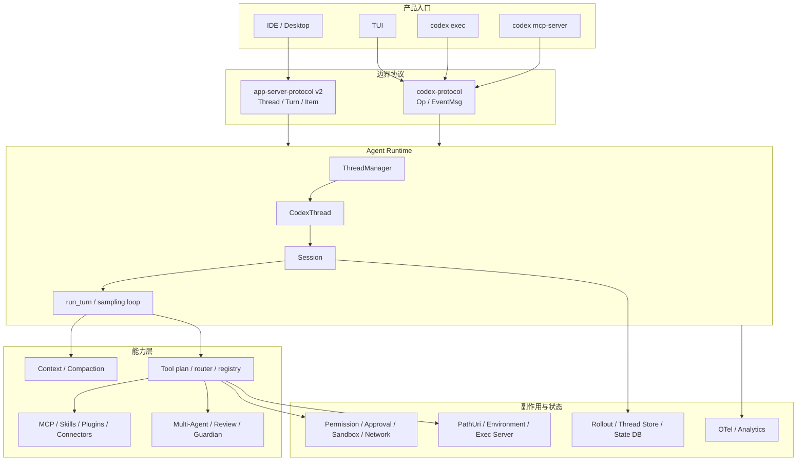

# 第 01 章：项目全景与设计哲学

> 源码基线：`upstream/main@283bc4cf011047314b4804c0f1ccd06e4f6a95c5`，复核日期：2026-06-24。

## 1. 本章回答什么

Codex 已经不能准确地用“一个会调用 shell 的 CLI”概括。当前源码呈现的是一个可被多种客户端复用的 coding-agent runtime：

- TUI、`codex exec`、IDE、桌面端和 MCP server 使用不同入口。
- `codex-core` 统一组织 thread、session、turn、模型采样和工具执行。
- `codex-protocol` 与 `app-server-protocol` 分别承担 core 事件边界和富客户端 API。
- shell、patch、MCP、plugins、skills、connectors 和 multi-agent 汇入统一工具与上下文体系。
- approval、permission、sandbox、execpolicy、network policy 和 Guardian 共同约束副作用。
- rollout、thread-store 与 state DB 让会话可恢复、可查询、可分叉和回滚。
- PathUri、environment selection 与 exec-server 正在消除“所有路径和进程都属于本机”的旧假设。

本章不把这些实现事实包装成 OpenAI 官方宣言。所谓“设计哲学”，是从当前边界、类型、测试和 Git 演进中归纳出的工程取向。

## 2. 可复核的规模快照

基线提交中的 `codex-rs`：

| 指标 | 数值 | 复核命令 |
| --- | ---: | --- |
| Cargo manifest | 129 | `find codex-rs -name Cargo.toml -not -path '*/target/*' \| wc -l` |
| Rust 文件 | 2,363 | `find codex-rs -name '*.rs' -not -path '*/target/*' \| wc -l` |
| Rust 总行数 | 1,062,602 | `find codex-rs -name '*.rs' -not -path '*/target/*' -print0 \| xargs -0 wc -l` |

这些数字只用于说明系统量级，不是稳定 API。后续更新应重新运行命令，不能把旧规模数据永久保留为“项目事实”。

## 3. 源码地图

| 层次 | 关键路径 | 责任 |
| --- | --- | --- |
| 产品入口 | `codex-rs/cli/`、`tui/`、`exec/`、`app-server/`、`mcp-server/` | 命令、界面和进程形态。 |
| core 协议 | `codex-rs/protocol/src/protocol.rs` | `Submission`、`Op`、`EventMsg` 等运行时操作与事件。 |
| 富客户端协议 | `codex-rs/app-server-protocol/src/protocol/` | JSON-RPC v2 的 thread/turn/item contract。 |
| runtime | `codex-rs/core/src/thread_manager.rs`、`codex_thread.rs`、`session/` | thread 生命周期、session 状态和 turn 主循环。 |
| 模型与上下文 | `core/src/client.rs`、`context_manager/`、`session/context_window.rs` | 请求、历史、token budget、compaction。 |
| 工具 | `codex-rs/tools/`、`core/src/tools/` | 工具规格、规划、路由、并行执行与按需发现。 |
| 执行与安全 | `exec-server/`、`sandboxing/`、`execpolicy/`、`network-proxy/` | 文件、进程和网络副作用。 |
| 状态 | `rollout/`、`thread-store/`、`state/` | 事件日志、thread 抽象和查询索引。 |
| 扩展 | `codex-mcp/`、`core-skills/`、`core-plugins/`、`connectors/`、`ext/` | 外部工具、能力包和连接器。 |
| 工程支撑 | `app-server-test-client/`、`otel/`、`analytics/` | 契约测试、观测和产品分析。 |

## 4. 当前总体架构



关键结论是：入口不是 runtime，协议不是 UI，工具也不是直接执行函数。系统通过多层边界把“模型希望做什么”逐步转译为“在哪个环境、以什么权限、产生哪些可恢复事件”。

## 5. 四组核心边界

### 5.1 `codex-protocol` 与 `app-server-protocol` 不是重复设计

`codex-protocol` 定义 core runtime 的操作与事件：

- `Submission` 位于 `codex-rs/protocol/src/protocol.rs:158`。
- `Op` 位于同文件 `:515`。
- `EventMsg` 位于同文件 `:1237`。

TUI、exec 等入口围绕这组类型驱动 core。

`app-server-protocol` 面向 IDE、桌面端和 SDK，提供版本化 JSON-RPC contract。它需要：

- `initialize` 能力协商。
- `Thread -> Turn -> Item` 的稳定外部投影。
- server→client approval、elicitation 等反向请求。
- experimental API gating。
- 按 thread、process、config 等资源划分的 serialization scope。
- Rust、TypeScript 和 JSON schema 的同步生成。

因此两套协议解决的是不同问题：前者是 runtime 内部边界，后者是跨进程、跨语言、面向产品客户端的兼容边界。

### 5.2 `ThreadManager -> CodexThread -> Session -> run_turn`

当前主链可以这样理解：

```text
ThreadManager
  管理 start / resume / fork / shutdown 和 thread 注册表
    -> CodexThread
       对外暴露 submit / event subscription 等 thread 能力
         -> Session
            保存配置、历史、服务和 active turn 状态
              -> SessionTask / run_turn
                 驱动采样、工具、compaction、hook 与最终回复
```

源码锚点：

- `ThreadManager`：`codex-rs/core/src/thread_manager.rs:178`
- `Session`：`codex-rs/core/src/session/session.rs:26`
- `run_turn`：`codex-rs/core/src/session/turn.rs:142`

这组分层避免了把“thread 身份”“运行中任务”“一次 turn 的局部状态”和“模型流事件”混进同一个大对象。

### 5.3 Tool spec、exposure、router 与 runtime 分离

模型看到的工具不是所有已安装能力的简单全集。当前工具系统至少要回答：

1. 这个 turn 有哪些候选工具？
2. 哪些工具直接出现在请求中，哪些通过 `tool_search` 延迟发现？
3. provider/model 是否支持对应 wire shape？
4. 某个调用是否允许并行？
5. 调用应在哪个执行环境运行？
6. 是否需要审批、sandbox 或网络授权？
7. 输出如何进入 model-visible history？

因此 `codex-rs/tools` 与 `core/src/tools` 分别承载可复用工具定义和 runtime 集成。把新工具直接塞进 `run_turn` 会破坏这组边界。

### 5.4 Rollout、thread-store 与 state DB 分工

三者不能都叫“会话数据库”：

- rollout 是追加式事件事实，服务恢复和重建。
- thread-store 提供 thread 层抽象与持久化查询能力。
- state DB 保存 metadata、索引和运行状态。

恢复不是“把 UI 文本重新显示出来”，而是从持久化项重建 model-visible history、turn context 和外部投影。rollback、fork、compaction 会改写有效历史语义，因此必须有明确 reconstruction 规则。

## 6. 三条主数据流

### 6.1 实时 turn 流

```text
client input
  -> Op 或 JSON-RPC request
  -> ThreadManager / CodexThread
  -> SessionTask
  -> run_turn
  -> context + tool plan
  -> model stream
  -> tool execution
  -> EventMsg / app-server notification
  -> UI render + persistence
```

### 6.2 状态恢复流

```text
thread id
  -> state/thread-store metadata
  -> rollout items
  -> rollout reconstruction
  -> ContextManager baseline
  -> live Session
  -> client subscription
```

### 6.3 能力暴露流

```text
built-in / MCP / plugin / connector / skill
  -> discovery
  -> policy and capability filtering
  -> direct ToolSpec / deferred tool_search / context fragment
  -> model selection
  -> approval and execution
  -> output, history and telemetry
```

复杂模块往往同时横跨多条流。`codex-core`、`tools/spec_plan`、app-server request processor 和 rollout reconstruction 都属于这种交汇点。

## 7. 从 Git 历史观察到的演进

当前结构不是一次性设计出来的。仓库历史提供了几条清晰线索：

- 2025-08-15，`d262244725` 引入独立 `codex-protocol` crate。
- 2025-09-04，`f2036572b6` 开始在 resume 时从持久化项重放事件。
- 2025-09-10，`c09ed74a16` 引入 unified execution。
- 2025-09-10，`162e1235a8` 让 fork 从 rollout 文件读取历史。
- 2025-09-12，`ea225df22e` 引入 context compaction。
- 2026-06 的近期提交继续拆分 context-window token 状态、rollout budget、environment-owned world state 和 tool exposure。

这些变化共同说明演进压力来自四个方向：

- 从单入口走向多客户端。
- 从内存对话走向可恢复 thread。
- 从本机命令走向多环境执行。
- 从少量内建工具走向可搜索、可安装、可授权的扩展生态。

“平台化”不是指多了几个命令，而是运行时边界开始服务更多客户端、执行环境和能力来源。

## 8. 可归纳的设计取向

### 8.1 单一 runtime，多种产品 surface

TUI、exec、app-server 和 MCP server 可以有不同交互模型，但不应各自复制 agent loop。否则 approval、compaction、tool exposure 和恢复语义会迅速漂移。

### 8.2 协议先于富客户端实现

富客户端能力先落到 app-server v2 contract，再由 processor 和 projector 映射到 core。仓库明确要求 active API development 不再扩展 v1。

### 8.3 用户授权与 OS enforcement 分层

approval 表示用户是否同意，permission profile 表示声明性能力边界，sandbox/network enforcement 负责实际限制，Guardian 可以参与高风险判断。它们互补而非同义。

### 8.4 模型上下文必须有硬边界

AGENTS、skills、plugins、工具定义、图片、工具输出和历史都可能进入模型上下文。当前仓库反复引入预算、截断、deferred exposure 和 compaction，说明“无界注入”被视为架构风险。

### 8.5 环境与路径逐步成为一等类型

本机 `PathBuf` 无法表达远程 executor、Windows 路径和不同 turn environment。PathUri、environment selection 与 executor filesystem 的出现，是多环境执行的基础迁移，而非单纯类型美化。

### 8.6 高风险边界需要可生成、可回放、可观测

协议 schema、TUI snapshot、rollout reconstruction tests、SSE mocks、OTel span 和 analytics facts 都在把隐式行为变成可验证契约。

## 9. 新能力应放在哪里

```text
classify(feature):
  if 只改变某个入口的 UX:
    放入 cli / tui / exec / app-server 客户端层

  else if 改变 TUI/exec 共用的 core 操作或事件:
    先修改 codex-protocol，再适配生产者和消费者

  else if 改变 IDE/桌面端 JSON-RPC:
    修改 app-server-protocol v2
    生成 schema
    更新 processor/projector 和行为测试

  else if 是模型可见工具或工具来源:
    进入 ToolSpec / ToolExecutor / spec_plan / router
    明确 direct 或 deferred exposure

  else if 产生文件、进程或网络副作用:
    经过 permission / approval / sandbox / executor 抽象

  else if 必须跨 resume/fork/compact 保留:
    定义 rollout/context/thread-store reconstruction 语义

  else if 是可选、可复用能力包:
    优先 plugin / skill / connector / ext crate

  else:
    保持在拥有该行为的最窄私有模块
```

这也是仓库“抵制继续膨胀 codex-core”规则的实际含义：不是机械地把文件移出去，而是识别变化轴和契约边界。

## 10. 常见误读

### 10.1 “npm 包就是 Codex 主体”

npm 层主要负责平台分发和启动 native binary。核心运行语义在 Rust workspace。

### 10.2 “App Server 是 MCP Server 的新名字”

MCP server 暴露工具能力；App Server 面向富客户端，承载长期 thread、双向请求、通知和版本化 API。二者不能互换。

### 10.3 “所有状态都在 SQLite”

rollout、thread-store 和 state DB 的职责不同。只查看数据库行无法完整证明会话可恢复。

### 10.4 “安装了工具就会全部塞给模型”

当前存在 direct/deferred exposure、`tool_search`、provider capability、policy filtering 和 connector/plugin 选择。安装、发现、模型可见和允许运行是四个不同阶段。

### 10.5 “sandbox 等于 approval”

approval 是交互决策，sandbox 是 enforcement。允许一次命令不代表解除 OS 资源限制。

## 11. 当前架构的代价

- `codex-core` 仍是多个数据流的交汇点，理解和编译成本高。
- core protocol 与 app-server protocol 双轨存在映射成本。
- 本地与远程、三种 OS、多个客户端使测试矩阵迅速扩张。
- plugins、skills、MCP、connectors 的用户概念边界仍容易混淆。
- 绝对路径、旧 rollout 和历史 API 会长期形成兼容负担。
- 很多行为是 feature-gated 或 experimental，不能只凭类型存在就断言产品默认启用。

这些并不自动意味着设计错误。它们是系统选择多入口、长期状态、跨平台 enforcement 和扩展生态后的显式成本。

## 12. 验证方法

```bash
# workspace 与规模
find codex-rs -name Cargo.toml -not -path '*/target/*' | sort
find codex-rs -name '*.rs' -not -path '*/target/*' | wc -l

# runtime 核心类型
rg -n "pub struct Submission|pub enum Op|pub enum EventMsg" \
  codex-rs/protocol/src/protocol.rs
rg -n "pub struct ThreadManager|struct Session|async fn run_turn" \
  codex-rs/core/src

# app-server v2 与并发边界
rg -n "ClientRequestSerializationScope|ThreadItemsList|experimental" \
  codex-rs/app-server-protocol/src/protocol/common.rs

# 观察边界演进
git log --reverse --oneline -- \
  codex-rs/protocol codex-rs/app-server codex-rs/tools \
  codex-rs/thread-store codex-rs/exec-server
```

完成本章后，读者应能回答：

1. 为什么 `protocol` 与 `app-server-protocol` 同时存在？
2. thread、session、turn 分别拥有什么生命周期？
3. 新工具为何不能直接写进 agent loop？
4. rollout、thread-store、state DB 如何分工？
5. 为什么 PathUri 和 environment selection 是平台化的重要信号？

## 小结

当前 Codex 的核心产品不是某一个终端界面，而是一个受协议、工具、安全和状态边界约束的 agent runtime。它的架构主线可以概括为：

```text
多入口
  -> 双协议边界
  -> thread/session/turn runtime
  -> context 与工具规划
  -> permission/sandbox/environment 执行
  -> rollout/thread-store/state 恢复
```

后续章节会沿这条主线分别下钻。任何旧描述若与基线提交冲突，都应直接改写原章节，而不是在旁边保留两套互相竞争的“当前事实”。
