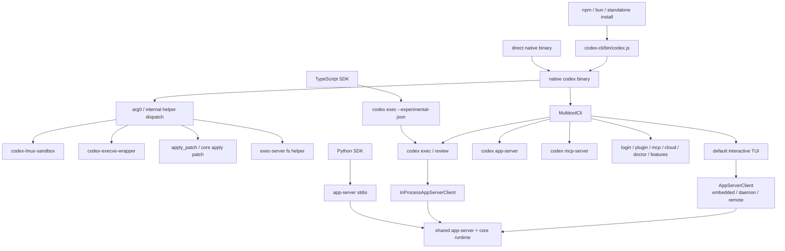

# 第 02 章：多入口与启动分发

> 源码基线：`upstream/main@283bc4cf011047314b4804c0f1ccd06e4f6a95c5`，复核日期：2026-06-24。

## 1. 结论先行

用户看到的是一个 `codex` 命令，源码里却存在四层分发：

1. npm 包按 OS/架构定位 native binary。
2. Rust `codex` multicall CLI 按子命令选择产品入口。
3. `arg0`/内部参数把单一 binary 复用成 sandbox、patch、filesystem helper 等辅助程序。
4. TUI、exec、Python SDK、IDE 等入口最终通过 embedded/remote app-server 或 core protocol 共享运行语义。

最新代码里最值得修正的旧认知是：**TUI 和 `codex exec` 已不再适合描述为两套分别直接驱动 core 的独立前端。它们大量复用 app-server client/protocol，其中 TUI 可连接 embedded、local daemon 或 remote app-server，exec 使用 in-process app-server client。**

因此“多入口一致性”的中心已从“大家都调用 core”进一步演进为：

```text
统一 native binary
  + 统一配置/运行路径
  + app-server protocol/runtime 复用
  + 入口特有的交互和输出策略
```

## 2. 当前入口地图



## 3. 第一层：npm 只负责找到并托管 native binary

入口是 `codex-cli/bin/codex.js`。它做的核心工作包括：

- 根据 `process.platform` 和 `process.arch` 选择六种 target triple。
- 优先从对应平台可选依赖包的 `vendor/` 找 binary。
- 在开发或打包布局下回退到本包 `vendor/`。
- 设置 `CODEX_MANAGED_BY_NPM` 或 `CODEX_MANAGED_BY_BUN`。
- 设置 `CODEX_MANAGED_PACKAGE_ROOT`。
- 用异步 `spawn` 启动 native binary。
- 转发 `SIGINT`、`SIGTERM`、`SIGHUP`。
- 镜像 child 的 exit code 或 termination signal。

当前 target 映射：

| 平台 | x64 | arm64 |
| --- | --- | --- |
| Linux/Android | `x86_64-unknown-linux-musl` | `aarch64-unknown-linux-musl` |
| macOS | `x86_64-apple-darwin` | `aarch64-apple-darwin` |
| Windows | `x86_64-pc-windows-msvc` | `aarch64-pc-windows-msvc` |

这里有两个重要边界。

第一，Node 不参与 agent loop、配置合并、认证或工具执行。第二，包装器不能简单 `spawnSync` 后退出，因为父进程需要正确处理信号并把 child 的退出语义返回给 shell。

所以 npm 层的正确定位是“跨平台安装和进程托管桥”，不是 Codex 业务主体。

## 4. 第二层：Rust multicall CLI

`codex-rs/cli/src/main.rs` 的 `MultitoolCli` 同时承载：

- 全局配置覆盖。
- feature toggles。
- interactive/remote 选项。
- 默认 TUI 参数。
- 产品与管理子命令。

当前主要子命令包括：

| 类别 | 子命令 |
| --- | --- |
| 交互/自动化 | 默认 TUI、`exec`、`review`、`resume`、`fork` |
| 会话管理 | `archive`、`delete`、`unarchive` |
| 身份与扩展 | `login`、`logout`、`mcp`、`plugin` |
| 服务端 | `mcp-server`、`app-server`、`remote-control`、`exec-server` |
| 安全与调试 | `sandbox`、`doctor`、`debug`、隐藏的 `execpolicy` |
| 其它产品面 | `cloud`、`app`、`features`、`completion`、`update` |
| 内部桥接 | `responses-api-proxy`、`stdio-to-uds` |

不带子命令时，参数转给 interactive TUI。`bin_name = "codex"` 保证即使实际可执行文件带平台 triple，帮助文本仍展示用户熟悉的命令名。

CLI 层不是简单 `match` 表。它还必须统一：

- 配置和 profile 的加载方式。
- auth 初始化。
- arg0 helper 路径。
- state DB 恢复。
- remote workspace / app-server target。
- feature gating。
- 不同入口的 telemetry origin。

## 5. 第三层：arg0 与内部 helper 分发

单 binary 分发不代表运行时只需要一个程序身份。sandbox、execve wrapper 和 patch helper 有时必须通过“像独立可执行文件一样”的路径被子进程调用。

`codex-rs/arg0/src/lib.rs` 支持两类分发。

### 5.1 按 `argv[0]` 分发

- `codex-linux-sandbox`
- `codex-execve-wrapper`
- `apply_patch`
- 兼容拼写 `applypatch`

Unix 下会在临时目录创建 alias，并把目录加入 `PATH`。这样部署仍只有一个主 binary，但子进程可按 helper 名称重新执行它。

### 5.2 按内部第一个参数分发

- exec-server filesystem helper。
- Windows sandbox wrapper。
- core apply-patch helper。

这种方式适合不依赖 Unix symlink/argv0 语义的内部调用。

### 5.3 `Arg0PathEntryGuard` 为什么必须活到 async main 结束

helper alias 位于临时目录。若 `arg0_dispatch()` 返回后立刻销毁 guard：

1. 临时目录被删除。
2. `Arg0DispatchPaths` 仍可能指向其中的 alias。
3. 后续 sandbox 或 exec re-exec 才出现延迟故障。

因此 `arg0_dispatch_or_else`：

- 在创建 Tokio runtime 前完成 `.env` 和 `PATH` 修改。
- 用 16 MiB stack 的 `codex-main` 线程运行顶层 future。
- 把稳定的 self/sandbox/execve-wrapper 路径传给入口。
- 等异步入口结束后才 drop guard。

这不是“argv0 小技巧”，而是 runtime path 生命周期管理。

### 5.4 `.env` 的安全边界

arg0 初始化会读取 `$CODEX_HOME/.env`，但拒绝其中所有 `CODEX_` 前缀变量。原因是这类变量可能控制内部行为，不能允许普通 dotenv 覆盖内部安全或运行时开关。

## 6. 第四层：产品入口如何进入共享 runtime

### 6.1 TUI：embedded、daemon 或 remote app-server

`codex-rs/tui/src/lib.rs` 当前直接依赖：

- `AppServerClient`
- `InProcessAppServerClient`
- `RemoteAppServerClient`
- `AppServerSession`

启动路径会选择 `AppServerTarget`：

- Embedded：进程内启动 app-server。
- Local daemon/control socket：复用本地长期服务。
- Remote endpoint：连接远程 app-server/工作区。

这会影响：

- cwd 是否能按本机路径 canonicalize。
- 是否加载本机配置环境。
- state DB 在本地还是由远端管理。
- resume/fork picker 的 thread 查询来源。
- exec-server runtime paths。

所以 TUI 已经不仅是 `codex-core` 的直接 UI。它也是 app-server 的客户端，并且能够切换本地与远程 workspace。

### 6.2 Exec：headless 产品，但复用 in-process app-server

`codex-rs/exec/src/lib.rs` 当前大量使用 app-server protocol 类型，并创建 `InProcessAppServerClient`。

它通过 app-server RPC 处理：

- thread start/resume/list/read。
- turn start/interrupt。
- review。
- notifications 和 server requests。
- approval response。

exec 仍有入口特有语义：

- 输出人类文本或 JSONL events。
- 非交互审批策略。
- stdin prompt 输入。
- output schema。
- 在无法交互时自动取消 MCP elicitation。

因此它不是“TUI 去掉渲染”，而是“使用同一服务语义的 headless client”。

### 6.3 TypeScript SDK：spawn `codex exec`

`sdk/typescript/src/exec.ts` 构造：

```text
codex exec --experimental-json ...
```

SDK：

- 将 options 转成 CLI/config 参数。
- 通过 stdin 写入用户输入。
- 按行读取 JSONL。
- 支持 `AbortSignal`。
- 设置 SDK originator。
- resume 时追加 `resume <thread_id>`。

这意味着 TypeScript SDK 的外部契约受 `codex exec` 参数和 JSON event shape 影响。CLI 或 exec JSONL 的 breaking change 会直接影响 SDK。

### 6.4 Python SDK：spawn `codex app-server --listen stdio://`

`sdk/python/src/openai_codex/client.py` 是 typed JSON-RPC client：

- 启动 app-server stdio 子进程。
- 运行 reader/stderr drain threads。
- 通过 message router 匹配 response、notification 和 server request。
- 默认开启 experimental API。
- 使用生成的 v2 类型。
- 支持 approval handler。

因此 TS 与 Python SDK 当前并非同一种 transport：

| SDK | 主要入口 | 协议 |
| --- | --- | --- |
| TypeScript | `codex exec --experimental-json` | exec JSONL event stream |
| Python | `codex app-server --listen stdio://` | typed JSON-RPC v2 |

描述“SDK 都只是 app-server wrapper”或“SDK 都只是 CLI wrapper”都不准确。

## 7. 多入口一致性由什么保证

### 7.1 统一 binary 和 config

所有入口最终使用同一 Rust workspace、配置类型和认证实现，避免语言层重复实现业务逻辑。

### 7.2 app-server 成为重要复用层

TUI、exec 和 Python SDK 对 app-server 的复用，让 thread/turn、approval 和通知语义更集中。

### 7.3 入口仍保留明确差异

一致性不等于行为完全相同：

| 入口 | 主要差异 |
| --- | --- |
| TUI | 可交互、可展示审批/elicitation、可连接 remote workspace。 |
| Exec | headless、结构化输出、交互能力受限。 |
| App Server | 只提供协议，不决定最终 UX。 |
| MCP Server | 把 Codex 暴露为 MCP 工具，不是富客户端后端。 |
| TS SDK | 跟随 exec JSONL。 |
| Python SDK | 跟随 app-server v2。 |

正确设计不是抹平差异，而是把差异限制在 client policy 和 presentation 层。

### 7.4 origin/source 必须可追踪

不同入口会设置 session source 或 originator。它影响 telemetry、thread 筛选和行为诊断。若新入口复用 runtime 却不标记来源，后续很难判断问题来自模型、协议还是客户端策略。

## 8. 启动失败与退出语义

### npm 层

- 不支持的平台直接失败。
- 平台可选依赖缺失时给出 npm/bun 重装命令。
- child spawn 失败时退出非零。
- child 被 signal 终止时，父 Node 进程重新发送同一 signal 给自己。

### arg0 层

- alias 创建失败可警告并继续，但相应 helper 能力可能降级。
- 专用 helper 分支通常直接退出，不回到普通 CLI。
- `.env` 读取失败不会阻断启动。

### CLI/产品层

- clap 负责参数契约。
- 配置、认证、state DB 和 remote endpoint 错误由具体入口报告。
- app-server/exec 的协议错误与 TUI 的交互错误呈现方式不同。

这里的工程原则是：安装层错误、helper 路径错误、配置错误和 runtime 错误应尽量在最接近根因的层报告。

## 9. 常见误读

### 9.1 “npm 包含 Codex 的主要实现”

错误。npm wrapper 当前约 204 行，负责平台 binary 和进程语义。

### 9.2 “不带子命令和 `codex exec` 只是 UI 开关不同”

错误。二者有不同 client policy、输入输出和交互能力，虽然正在复用 app-server runtime。

### 9.3 “TUI 永远运行本地 core”

错误。TUI 可使用 embedded、local daemon 或 remote app-server，remote workspace 下 cwd/config/state 的归属也会改变。

### 9.4 “arg0 只为 Linux sandbox 服务”

不完整。它还覆盖 execve wrapper、apply_patch、filesystem helper 和稳定 self executable path。

### 9.5 “TypeScript 与 Python SDK 走同一协议”

错误。当前 TS 主要消费 exec JSONL，Python 使用 app-server JSON-RPC v2。

## 10. 当前风险与改进空间

- `cli/src/main.rs` 已超过 4,000 行，产品分发和管理命令仍高度集中。
- TUI 同时支持 embedded、daemon 和 remote target，使启动状态机复杂。
- TS/Python SDK transport 不同，能力和 breaking-change 面可能漂移。
- arg0 alias、内部参数和平台专用 wrapper 增加打包测试矩阵。
- exec 的“非交互默认策略”必须持续与 app-server/core 新 server requests 对齐。
- app-server 逐渐成为公共底座后，任何协议改动都会影响更多入口。

## 11. 验证命令

```bash
# npm 到 native binary
sed -n '1,240p' codex-cli/bin/codex.js

# Rust 子命令与实际分发
rg -n "enum Subcommand|match cli.subcommand|Subcommand::" \
  codex-rs/cli/src/main.rs

# helper 分发与生命周期
rg -n "arg0_dispatch|Arg0PathEntryGuard|CODEX_CORE_APPLY_PATCH_ARG1|CODEX_FS_HELPER_ARG1" \
  codex-rs/arg0/src/lib.rs

# TUI 的 app-server target
rg -n "AppServerTarget|InProcessAppServerClient|RemoteAppServerClient|start_app_server" \
  codex-rs/tui/src/lib.rs

# exec 的 in-process app-server
rg -n "InProcessAppServerClient|ThreadStartParams|TurnStartParams|ServerRequest" \
  codex-rs/exec/src/lib.rs

# SDK transport 差异
rg -n 'commandArgs.*exec|--experimental-json|spawn' sdk/typescript/src/exec.ts
rg -n 'app-server|stdio://|subprocess.Popen' sdk/python/src/openai_codex/client.py
```

## 小结

Codex 的启动链已经从“npm 找 Rust binary”演进成一个多客户端运行系统：

```text
package launcher
  -> native multicall CLI
  -> helper/runtime path bootstrap
  -> TUI / exec / app-server / MCP / management surface
  -> embedded or remote shared runtime
```

其中 npm 解决分发，CLI 解决产品路由，arg0 解决单 binary 的 helper 身份与路径生命周期，app-server 则越来越多地承担入口间运行语义复用。理解这四层，是后续分析配置、Agent loop、协议和远程执行的前提。
