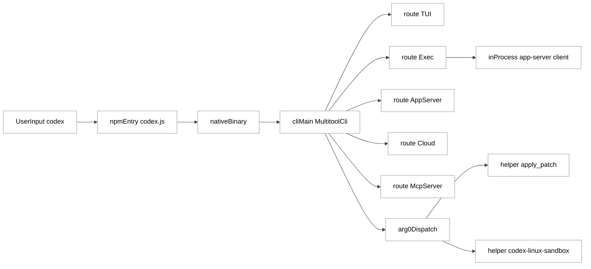
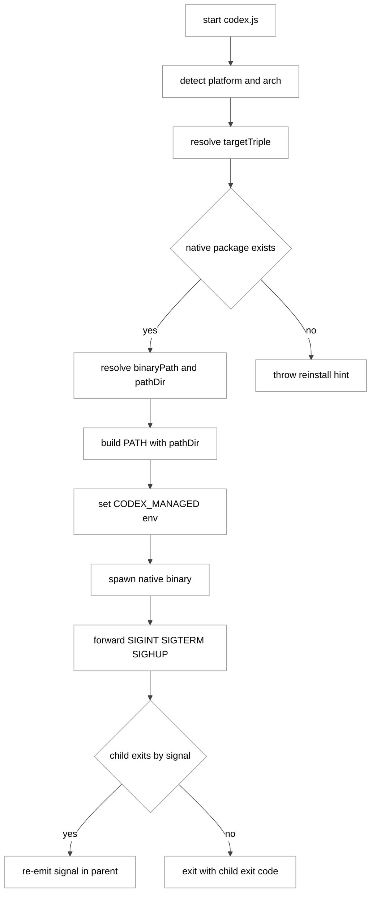
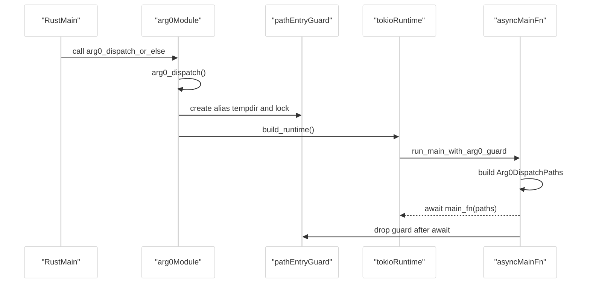
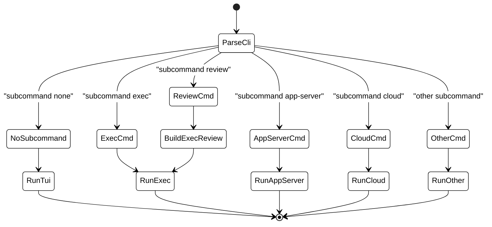
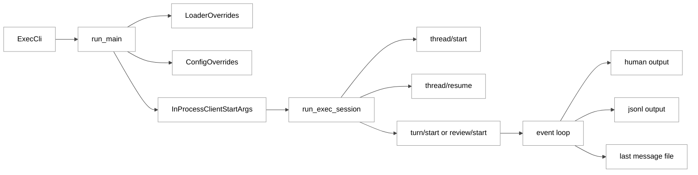
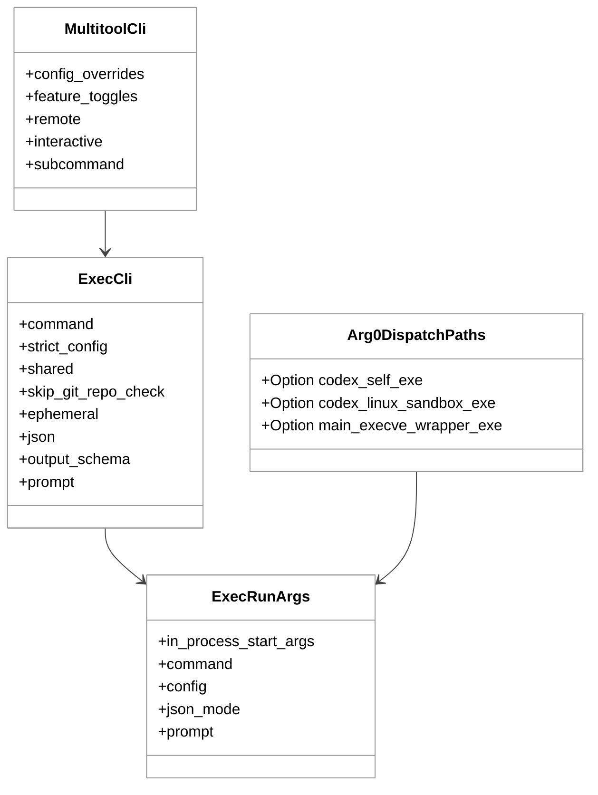

# 第 02 章：多入口与启动分发

## 引言

"`codex` 是一个命令"，这是用户视角；从工程视角看，`codex` 更像是一条跨语言、跨二进制形态、跨运行模式的启动分发链。  
本章不讨论模型能力，也不讨论工具调用本身的优劣，而是聚焦一个更底层的问题：**同一个入口词 `codex`，在 npm 包装器、Rust 主程序、arg0 别名分发、headless `exec` 运行时之间，是如何尽量保持行为一致、路径可追踪、错误可恢复的**。

如果把 Codex 看成一个"终端 AI 工具"，你只能解释它为什么能跑；如果把它看成"多入口启动系统"，可能就更容易解释它为什么能在 TUI、CI、Cloud、MCP、App-Server 这些不同执行面上，呈现相对一致的控制语义。

---

## 全网调研补充（近 12 个月）

> 本节基于本章专属关键词检索：`Codex CLI multi entry`、`codex npm wrapper Rust binary`、`codex arg0 dispatch`、`Codex 启动流程`，并追加了若干主流平台的定向检索。下面只提炼"可用于源码分析的认知增量"，不复述教程型内容。

### 1) 权威来源覆盖情况

- **OpenAI 工程与文档（高权重）**
  - OpenAI Developers 的 CLI / Features / App-Server 文档反复强调：`codex` 是多执行面入口，`exec`、`app-server`、`mcp-server`、`cloud` 并存。
  - OpenAI 工程博文（如 App Server / Harness 相关）给出了"客户端拉起长期进程 + 协议握手 + 线程/回合生命周期"的官方叙事框架。
- **Simon Willison（高权重第三方）**
  - 过去 12 个月连续跟踪 Codex CLI 与 Codex App 演进，尤其关注"Rust 化后 npm 仍可安装但最终运行 native 二进制"的链路事实。
- **Latent Space（中高权重访谈与行业观察）**
  - 更强调 agent harness 与产品 surface 的关系：模型能力之外，入口/调度/信任机制本身也可能成为产品竞争力的一部分。
- **Hacker News（高密度一线反馈）**
  - 争议主要集中在"Rust 重写收益到底是性能、安全、还是分发体验"，以及"CLI 名称和历史 Codex 模型命名冲突造成认知噪音"。
- **中文平台（知乎 / 少数派 / CSDN / 掘金 / 机器之心等）**
  - 近一年主流内容仍以安装、接入、报错排障为主；对 `arg0` 生命周期、PATH 注入、`exec` 输入语义的系统拆解相对较少。

### 2) 社区分歧与常见误解

**分歧 A：npm 安装是否意味着 Node 运行时是主执行面？**  
共识是"安装入口在 npm"，分歧在于"运行入口在哪里"。不少内容把 npm 包装器误当主程序；源码显示它是分发桥接层，最终 `spawn` 的是 native 二进制（后文给出证据）。

**分歧 B：arg0 dispatch 是"黑魔法"还是"工程复用"？**  
外部文章常把 arg0 归类成"小技巧"，但从代码看它至少承担了 helper 可执行路径稳定性、guard 生命周期、PATH 前缀管理、跨子系统路径传递等多个职责，并非单纯的别名 trick。

**分歧 C：`exec` 是"简化版 TUI"还是"独立运行模式"？**  
很多教程把 `exec` 当"无 UI 的同款命令"；源码显示 `exec` 默认审批策略、输入解码、JSONL 输出契约、线程恢复逻辑都做了独立设计，不是简单阉割。

### 3) 仍未被系统讨论的盲区

- **盲区 1：arg0 临时目录守护与 async main 生命周期耦合**  
  社区常讨论 alias 名称，不讨论"alias 目录何时失效"。源码注释（`codex-rs/arg0/src/lib.rs:217-218`）明确指出 guard 需要保留到 async 入口结束，以避免 helper path 提前失效。
- **盲区 2：`exec` 的 stdin 三态语义**  
  `RequiredIfPiped` / `Forced` / `OptionalAppend` 是一个很实用但鲜少被讲清的设计，直接决定 CI 管道下提示词拼接是否符合预期。
- **盲区 3：headless 模式默认审批策略与仓库检查策略的组合边界**  
  社区经常只谈 `--yolo`，而不谈"默认 `AskForApproval::Never` + git repo check + bypass flag"的组合行为。

---

## 七维分析

## 1. 本质是什么：它在 Codex 架构中的定位

"多入口与启动分发"在 Codex 中不是边缘层，而是承担**执行语义一致性入口控制**的一层。它做的不是"把命令跑起来"，而是把以下三件事绑定在一起：

1. **统一命令名**（用户只记 `codex`）；  
2. **多执行面路由**（TUI / Exec / AppServer / MCP / Cloud）；  
3. **helper 路径与安全上下文继承**（arg0 + PATH + runtime path）。

从代码规模看，这一层已经不再是薄壳：

- `codex-cli/bin/codex.js`：**238 行**（npm 桥接）
- `codex-cli/package.json`：**22 行**（分发声明）
- `codex-rs/cli/src/main.rs`：**3439 行**（多工具总入口）
- `codex-rs/arg0/src/lib.rs`：**585 行**（别名分发与 helper 路径管理）
- `codex-rs/exec/src/lib.rs`：**1877 行**（headless 执行主循环）
- `codex-rs/exec/src/cli.rs`：**311 行**（exec 参数模型）

这 6 个核心文件合计 **6472 行**（`wc -l` 实测）。只看体量就能感觉到：启动分发在 Codex 里更接近一个"子系统"，而不是"启动脚本"。

### 1.1 从入口声明看：npm 主要负责"把你带到 Rust"

```json
// codex-cli/package.json:2
{
  "name": "@openai/codex",
  "version": "0.0.0-dev",
  "bin": {
    "codex": "bin/codex.js"
  }
}
```

这个 `bin` 声明把 shell 命令映射到 JS 包装器，而不是直接映射到 Node 内部逻辑。真正的运行体由 `codex.js` 继续分发。

### 1.2 从子命令总线看：`cli` 是"多工具分发器"

`MultitoolCli` 下的 `Subcommand` 不是几个命令，而是一个覆盖交互、自动化、协议、远程、调试的多面路由表。源码中该枚举当前包含 **24 个变体**（其中 `App` 仅在 macOS / Windows 平台编译进来），意味着"入口层"本身已经是产品面。

```rust
// codex-rs/cli/src/main.rs:99
struct MultitoolCli {
    #[clap(flatten)]
    pub config_overrides: CliConfigOverrides,
    #[clap(flatten)]
    pub feature_toggles: FeatureToggles,
    #[clap(flatten)]
    remote: InteractiveRemoteOptions,
    #[clap(flatten)]
    interactive: TuiCli,
    #[clap(subcommand)]
    subcommand: Option<Subcommand>,
}
```

```rust
// codex-rs/cli/src/main.rs:116
enum Subcommand {
    Exec(ExecCli),
    Review(ReviewCommand),
    Login(LoginCommand),
    Logout(LogoutCommand),
    Mcp(McpCli),
    Plugin(PluginCli),
    McpServer(McpServerCommand),
    AppServer(AppServerCommand),
    RemoteControl(RemoteControlCommand),
    #[cfg(any(target_os = "macos", target_os = "windows"))]
    App(app_cmd::AppCommand),
    Completion(CompletionCommand),
    Update,
    Doctor(DoctorCommand),
    Sandbox(HostSandboxArgs),
    Debug(DebugCommand),
    Execpolicy(ExecpolicyCommand),
    Apply(ApplyCommand),
    Resume(ResumeCommand),
    Fork(ForkCommand),
    Cloud(CloudTasksCli),
    ResponsesApiProxy(ResponsesApiProxyArgs),
    StdioToUds(StdioToUdsCommand),
    ExecServer(ExecServerCommand),
    Features(FeaturesCli),
}
```

### 1.3 从 workspace 维度看：它服务的是一个 113-crate 系统

`codex-rs/Cargo.toml` 的 `workspace.members` 当前为 **113**（脚本统计）。多入口启动分发并不是"一个单体 CLI 的门面"，而是要给百级 crate 的运行面提供一致的入口与路径语义。这也是为什么本章值得独立分析。

---

## 2. 核心问题和痛点：它到底在解决什么难题

### 2.1 难题一：同一个 `codex` 入口如何跨平台稳定落到正确二进制

`codex.js` 里维护了目标三元组到平台包的映射，当前包含 **6 个目标**。这一步主要解决"安装层可用性"与"运行层确定性"。

```javascript
// codex-cli/bin/codex.js:15
const PLATFORM_PACKAGE_BY_TARGET = {
  "x86_64-unknown-linux-musl": "@openai/codex-linux-x64",
  "aarch64-unknown-linux-musl": "@openai/codex-linux-arm64",
  "x86_64-apple-darwin": "@openai/codex-darwin-x64",
  "aarch64-apple-darwin": "@openai/codex-darwin-arm64",
  "x86_64-pc-windows-msvc": "@openai/codex-win32-x64",
  "aarch64-pc-windows-msvc": "@openai/codex-win32-arm64",
};
```

```javascript
// codex-cli/bin/codex.js:24
const { platform, arch } = process;
let targetTriple = null;
switch (platform) {
  case "linux":
  case "android":
    // ...
  case "darwin":
    // ...
  case "win32":
    // ...
}
```

痛点在于：这不是"写一次 if/else"就完了。它还要处理本地 vendor 路径、历史目录兼容、缺依赖报错引导、PATH 注入、退出码镜像等多个边界。

### 2.2 难题二：一个二进制如何"模拟多个可执行工具"

Codex 希望尽量减少用户单独安装 `apply_patch` / `codex-linux-sandbox` / `codex-execve-wrapper` 等 helper 的负担，但运行时又需要这些"按名字驱动行为"的可执行。  
`arg0` 子系统通过别名与 `argv[0]` 分发，提供了一种"单二进制部署 + 多工具行为"的中间路径。

```rust
// codex-rs/arg0/src/lib.rs:54
pub fn arg0_dispatch() -> Option<Arg0PathEntryGuard> {
    let mut args = std::env::args_os();
    let argv0 = args.next().unwrap_or_default();
    let exe_name = Path::new(&argv0)
        .file_name()
        .and_then(|s| s.to_str())
        .unwrap_or("");

    // ... 省略 unix 下的 execve-wrapper 分支 ...

    if exe_name == CODEX_LINUX_SANDBOX_ARG0 {
        codex_linux_sandbox::run_main();
    } else if exe_name == APPLY_PATCH_ARG0 || exe_name == MISSPELLED_APPLY_PATCH_ARG0 {
        codex_apply_patch::main();
    }
    // ...
}
```

### 2.3 难题三：headless 自动化不是 TUI 的减法，而是单独工程

`exec` 模式需要同时满足：

- 人类可读输出与 JSONL 机器输出双通道；
- stdin 提示词三种行为；
- review / resume / new turn 三种初始操作；
- 输出 schema 约束；
- 与 app-server 的 thread / turn 生命周期对齐。

这或许也是 `exec/src/lib.rs` 单文件能达到 **1877 行** 的一个原因。

### 2.4 难题四：多入口下如何保持配置与安全策略一致

`run_main` 会把 CLI 覆盖、harness 覆盖、loader 覆盖整合，再注入 `Arg0DispatchPaths`、sandbox 策略与审批策略。入口分发如果做不好，这里就会出现"同一命令在不同入口下行为漂移"的问题。

```rust
// codex-rs/exec/src/lib.rs:403
let overrides = ConfigOverrides {
    model,
    review_model: None,
    // Default to never ask for approvals in headless mode.
    approval_policy: Some(AskForApproval::Never),
    approvals_reviewer: None,
    sandbox_mode,
    // ...
    codex_self_exe: arg0_paths.codex_self_exe.clone(),
    codex_linux_sandbox_exe: arg0_paths.codex_linux_sandbox_exe.clone(),
    main_execve_wrapper_exe: arg0_paths.main_execve_wrapper_exe.clone(),
    ephemeral: ephemeral.then_some(true),
    bypass_hook_trust: bypass_hook_trust.then_some(true),
    additional_writable_roots: add_dir,
    // ... 共 24 个 override key
};
```

---

## 3. 解决思路与方案（含架构图）

Codex 当前的方案不是"一个入口接一个大 switch"，而是**四级分发链**：

1. npm 包装层（JS）决定目标二进制；
2. Rust CLI（clap）决定产品子命令；
3. arg0 层决定 helper 别名行为；
4. exec / tui / app-server 各自进入独立运行时。

### 3.1 图一：多入口总体架构

<div style="background:#ffffff !important; background-color:#ffffff !important; padding:16px; border-radius:8px; margin:16px 0;" bgcolor="#ffffff">



</div>

### 3.2 图二：npm 包装层启动流程

<div style="background:#ffffff !important; background-color:#ffffff !important; padding:16px; border-radius:8px; margin:16px 0;" bgcolor="#ffffff">



</div>

### 3.3 图三：arg0 生命周期时序

<div style="background:#ffffff !important; background-color:#ffffff !important; padding:16px; border-radius:8px; margin:16px 0;" bgcolor="#ffffff">



</div>

### 3.4 关键设计决策

**决策 A：npm wrapper 只做"确定性桥接"，不做业务逻辑。**

```javascript
// codex-cli/bin/codex.js:106
let nativePackage;
try {
  const packageJsonPath = require.resolve(`${platformPackage}/package.json`);
  nativePackage = resolveNativePackage(
    path.join(path.dirname(packageJsonPath), "vendor"),
  );
} catch {
  nativePackage = resolveNativePackage(localVendorRoot);
}

if (!nativePackage) {
  // ...
  throw new Error(
    `Missing optional dependency ${platformPackage}. Reinstall Codex: ${updateCommand}`,
  );
}
```

这里的报错策略很明确：缺平台包时不做隐式回退，而是直接失败并给出重装指令，避免用户在错误架构上"带病运行"。可以视为一种"显式失败优先"的偏好。

**决策 B：父进程不"抢退出码"，而是镜像子进程退出语义。**

```javascript
// codex-cli/bin/codex.js:184
const child = spawn(binaryPath, process.argv.slice(2), {
  stdio: "inherit",
  env,
});
// ...
const childResult = await new Promise((resolve) => {
  child.on("exit", (code, signal) => {
    if (signal) {
      resolve({ type: "signal", signal });
    } else {
      resolve({ type: "code", exitCode: code ?? 1 });
    }
  });
});
```

这直接影响 CI 可观测性：脚本看到的不是 wrapper 的"自定义成功"，而是 native 执行面的真实状态。

**决策 C：`main()` 首行即接入 arg0 分发。**

```rust
// codex-rs/cli/src/main.rs:823
fn main() -> anyhow::Result<()> {
    arg0_dispatch_or_else(|arg0_paths: Arg0DispatchPaths| async move {
        cli_main(arg0_paths).await?;
        Ok(())
    })
}
```

这意味着任何从 `cli` 进入的路径，默认都处在 arg0 语义保护之下。

**决策 D：保持 alias 目录到 async 主流程结束。**

```rust
// codex-rs/arg0/src/lib.rs:195
async fn run_main_with_arg0_guard<F, Fut>(
    path_entry_guard: Option<Arg0PathEntryGuard>,
    current_exe: Option<PathBuf>,
    main_fn: F,
) -> anyhow::Result<()>
{
    let paths = Arg0DispatchPaths { /* ... */ };
    let result = main_fn(paths).await;
    // Keep the arg0 tempdir guard alive until the async entry point finishes;
    // runtime paths above can point at aliases inside that directory.
    drop(path_entry_guard);
    result
}
```

这段看似简单，但对应社区里典型的"helper 路径 ENOENT"故障面。guard 过早释放会导致 alias 目录被清理，后续 re-exec 失效。

---

## 4. 实现细节关键点：代码路径、关键函数、关键数据流

这一节从"可执行链路"角度拆解，避免空泛描述。

### 4.1 入口层：`codex-cli/bin/codex.js`

#### 4.1.1 平台判定与目标三元组映射

- 输入：`process.platform + process.arch`
- 输出：`targetTriple`
- 失败：不支持的平台立即抛错

```javascript
// codex-cli/bin/codex.js:69
if (!targetTriple) {
  throw new Error(`Unsupported platform: ${platform} (${arch})`);
}
const platformPackage = PLATFORM_PACKAGE_BY_TARGET[targetTriple];
if (!platformPackage) {
  throw new Error(`Unsupported target triple: ${targetTriple}`);
}
```

#### 4.1.2 PATH 拼接与管理器标记

```javascript
// codex-cli/bin/codex.js:170
const additionalDirs = [];
if (existsSync(pathDir)) {
  additionalDirs.push(pathDir);
}
const updatedPath = getUpdatedPath(additionalDirs);
const env = { ...process.env, PATH: updatedPath };
const packageManagerEnvVar =
  detectPackageManager() === "bun"
    ? "CODEX_MANAGED_BY_BUN"
    : "CODEX_MANAGED_BY_NPM";
env[packageManagerEnvVar] = "1";
env.CODEX_MANAGED_PACKAGE_ROOT = realpathSync(path.join(__dirname, ".."));
```

这不是"可有可无"的细节：当用户报告 PATH 或 helper 行为异常时，这些环境位是较直接的诊断入口。

### 4.2 CLI 分发层：`codex-rs/cli/src/main.rs`

`cli_main` 的关键模式是：

- 先 fold root-level toggles / config；
- 再按 subcommand 分发；
- 每条分支都显式做 remote / strict-config 等兼容性检查；
- 再把 root overrides 前置到子命令。

```rust
// codex-rs/cli/src/main.rs:850
match subcommand {
    None => {
        prepend_config_flags(
            &mut interactive.config_overrides,
            root_config_overrides.clone(),
        );
        let exit_info = run_interactive_tui(
            interactive,
            root_remote.clone(),
            root_remote_auth_token_env.clone(),
            arg0_paths.clone(),
        )
        .await?;
        handle_app_exit(exit_info)?;
    }
    Some(Subcommand::Exec(mut exec_cli)) => {
        reject_remote_mode_for_subcommand(
            root_remote.as_deref(),
            root_remote_auth_token_env.as_deref(),
            "exec",
        )?;
        exec_cli.strict_config |= root_strict_config;
        prepend_config_flags(
            &mut exec_cli.config_overrides,
            root_config_overrides.clone(),
        );
        codex_exec::run_main(exec_cli, arg0_paths.clone()).await?;
    }
    // ...
}
```

`cloud` 分支同样继承 root 覆盖并显式传入 Linux sandbox helper 路径：

```rust
// codex-rs/cli/src/main.rs:1230
Some(Subcommand::Cloud(mut cloud_cli)) => {
    reject_remote_mode_for_subcommand(
        root_remote.as_deref(),
        root_remote_auth_token_env.as_deref(),
        "cloud",
    )?;
    prepend_config_flags(
        &mut cloud_cli.config_overrides,
        root_config_overrides.clone(),
    );
    codex_cloud_tasks::run_main(cloud_cli, arg0_paths.codex_linux_sandbox_exe.clone())
        .await?;
}
```

### 4.3 arg0 层：`codex-rs/arg0/src/lib.rs`

#### 4.3.1 `Arg0DispatchPaths` 是路径契约对象

该结构 3 个字段都与"子进程再执行路径稳定性"有关，而不是普通配置字段。

```rust
// codex-rs/arg0/src/lib.rs:22
pub struct Arg0DispatchPaths {
    pub codex_self_exe: Option<PathBuf>,
    pub codex_linux_sandbox_exe: Option<PathBuf>,
    pub main_execve_wrapper_exe: Option<PathBuf>,
}
```

#### 4.3.2 helper alias 目录构建

`prepend_path_entry_for_codex_aliases()`（L284 起，函数体长度约 126 行）会：

1. 在 `CODEX_HOME/tmp/arg0` 下建 session 临时目录，并设 0o700 权限；
2. 加锁 `.lock`，避免并发冲突；
3. 为 `apply_patch` / `applypatch` / `codex-linux-sandbox` / `codex-execve-wrapper` 创建 alias（unix 用 symlink，windows 用 `.bat`）；
4. 把该目录前置到 PATH；
5. 返回 guard，延长目录生存期。

入口段：

```rust
// codex-rs/arg0/src/lib.rs:302
let temp_root = codex_home.join("tmp").join("arg0");
std::fs::create_dir_all(&temp_root)?;
```

alias 创建段：

```rust
// codex-rs/arg0/src/lib.rs:331
for filename in &[
    APPLY_PATCH_ARG0,
    MISSPELLED_APPLY_PATCH_ARG0,
    #[cfg(target_os = "linux")]
    CODEX_LINUX_SANDBOX_ARG0,
    #[cfg(unix)]
    EXECVE_WRAPPER_ARG0,
] {
    let exe = std::env::current_exe()?;
    #[cfg(unix)]
    {
        let link = path.join(filename);
        symlink(&exe, &link)?;
    }
    // ... windows: 写入 .bat ...
}
```

### 4.4 exec 入口：`codex-rs/exec/src/cli.rs` + `exec/src/lib.rs`

#### 4.4.1 参数模型（`Cli` 14 字段）

`exec` 入口不是一个"prompt 字符串 + 一个 flag"，而是一个包含 strict、ephemeral、schema、json、stdin、rules 的参数对象。

```rust
// codex-rs/exec/src/cli.rs:14
pub struct Cli {
    pub command: Option<Command>,
    pub strict_config: bool,
    pub shared: ExecSharedCliOptions,
    pub skip_git_repo_check: bool,
    pub ephemeral: bool,
    pub ignore_user_config: bool,
    pub ignore_rules: bool,
    pub removed_full_auto: bool,
    pub output_schema: Option<PathBuf>,
    pub config_overrides: CliConfigOverrides,
    pub color: Color,
    pub json: bool,
    pub last_message_file: Option<PathBuf>,
    pub prompt: Option<String>,
}
```

#### 4.4.2 `run_main`（约 332 行）做"配置装配 + 运行时注入"

`run_main` 起始于 L232，结束于 `run_exec_session` 前（L564），整体约 332 行。它的职责不是直接发请求，而是把覆盖层组装完整后再交给 `run_exec_session`。

```rust
// codex-rs/exec/src/lib.rs:323
let loader_overrides = LoaderOverrides {
    user_config_path,
    user_config_profile: config_profile_v2,
    ignore_user_config,
    ignore_user_and_project_exec_policy_rules: ignore_rules,
    ..Default::default()
};
```

```rust
// codex-rs/exec/src/lib.rs:523
let in_process_start_args = InProcessClientStartArgs {
    arg0_paths,
    config: std::sync::Arc::new(config.clone()),
    // ...
    session_source: SessionSource::Exec,
    enable_codex_api_key_env: true,
    client_name: "codex_exec".to_string(),
    // ...
};
```

#### 4.4.3 `run_exec_session`（约 382 行）做"初始操作路由 + 事件循环"

`run_exec_session` 起始于 L564。三路初始操作：

- `ExecCommand::Review` -> `InitialOperation::Review`
- `ExecCommand::Resume` -> 先 `ThreadResume`，找不到回退 `ThreadStart`
- 无子命令 -> `ThreadStart + UserTurn`

```rust
// codex-rs/exec/src/lib.rs:612
let (initial_operation, prompt_summary) = match (command.as_ref(), prompt, images) {
    (Some(ExecCommand::Review(review_cli)), _, _) => {
        let review_request = build_review_request(review_cli)?;
        (InitialOperation::Review { review_request }, summary)
    }
    (Some(ExecCommand::Resume(args)), root_prompt, imgs) => {
        // ...
        InitialOperation::UserTurn { items, output_schema }
    }
    (None, root_prompt, imgs) => {
        // ...
        InitialOperation::UserTurn { items, output_schema }
    }
};
```

git 仓库安全边界默认开启（除非显式跳过或 bypass）：

```rust
// codex-rs/exec/src/lib.rs:674
if !skip_git_repo_check
    && !dangerously_bypass_approvals_and_sandbox
    && get_git_repo_root(&default_cwd).is_none()
{
    eprintln!("Not inside a trusted directory and --skip-git-repo-check was not specified.");
    std::process::exit(1);
}
```

resume 路径优先走 `thread/resume`，否则回退 `thread/start`：

```rust
// codex-rs/exec/src/lib.rs:691
let (primary_thread_id, fallback_session_configured) = if let Some(ExecCommand::Resume(args)) =
    command.as_ref()
{
    if let Some(thread_id) =
        resolve_resume_thread_id(&client, &config, state_db.as_ref(), args).await?
    {
        // ClientRequest::ThreadResume { ... }
    } else {
        // ClientRequest::ThreadStart { ... }
    }
} else {
    // ClientRequest::ThreadStart { ... }
};
```

#### 4.4.4 stdin 三态语义（很容易被忽略）

```rust
// codex-rs/exec/src/lib.rs:169
enum StdinPromptBehavior {
    /// Read stdin only when there is no positional prompt.
    RequiredIfPiped,
    /// Always treat stdin as the prompt (e.g. explicit `codex exec -`).
    Forced,
    /// If stdin is piped alongside a positional prompt, append it as a
    /// `<stdin>` block instead of replacing the primary prompt.
    OptionalAppend,
}
```

```rust
// codex-rs/exec/src/lib.rs:1832
fn resolve_root_prompt(prompt_arg: Option<String>) -> String {
    match prompt_arg {
        Some(prompt) if prompt != "-" => {
            if let Some(stdin_text) = read_prompt_from_stdin(StdinPromptBehavior::OptionalAppend) {
                prompt_with_stdin_context(&prompt, &stdin_text)
            } else {
                prompt
            }
        }
        maybe_dash => resolve_prompt(maybe_dash),
    }
}
```

这意味着：

- `codex exec -`：stdin 是主提示；
- `echo x | codex exec`：stdin 是主提示；
- `echo x | codex exec "do y"`：stdin 变成 `<stdin>...</stdin>` 附加上下文。

### 4.5 图四：`cli_main` 分发状态图

<div style="background:#ffffff !important; background-color:#ffffff !important; padding:16px; border-radius:8px; margin:16px 0;" bgcolor="#ffffff">



</div>

### 4.6 图五：`exec` 数据流图

<div style="background:#ffffff !important; background-color:#ffffff !important; padding:16px; border-radius:8px; margin:16px 0;" bgcolor="#ffffff">



</div>

### 4.7 图六：核心结构关系图

<div style="background:#ffffff !important; background-color:#ffffff !important; padding:16px; border-radius:8px; margin:16px 0;" bgcolor="#ffffff">



</div>

---

## 5. 易错点和注意事项（陷阱、边界、隐式依赖）

### 5.1 误区：`codex` npm 包就是主要运行时

现实：npm 层负责分发桥接，真正执行的是 native binary。若把问题定位停在 Node 层，很多错误（sandbox / helper / path 类）可能会被误诊。

### 5.2 误区：arg0 只是别名语法糖

现实：它还承担 alias 临时目录创建、PATH 前置、helper 路径传递、guard 生命周期控制。  
源码注释已明确说明 guard 作用：

```rust
// codex-rs/arg0/src/lib.rs:217
// Keep the arg0 tempdir guard alive until the async entry point finishes;
// runtime paths above can point at aliases inside that directory.
drop(path_entry_guard);
```

### 5.3 误区：`codex exec` 的 stdin 语义只有一种

现实：有三种行为（required / forced / append），并且带 UTF BOM 解码处理。  
在 CI 中把 `echo data | codex exec "prompt"` 当作覆盖输入，常常会得到"主提示 + `<stdin>` 附加块"的结果，可能导致提示词意图偏移。

### 5.4 隐式边界：headless 默认审批策略

`exec` 覆盖里默认 `AskForApproval::Never`（见 `exec/src/lib.rs:407`）。这能减少自动化阻塞，但也要求外层环境策略（仓库隔离、网络策略、沙箱策略）配置到位，否则"自动化便利"可能变成"权限扩大"。

### 5.5 边界条件：`--yolo` 与 git 检查

源码明确：`dangerously_bypass_approvals_and_sandbox` 会和 git repo 检查逻辑联动（见 `exec/src/lib.rs:672-680`）。  
这不是 bug，而是一种"外部沙箱假设"；如果团队没有外部隔离，这个假设可能就失效。

### 5.6 边界条件：平台覆盖范围是有限集合

当前平台映射是 6 组目标三元组，不在集合内会直接报错。对于非主流架构，这意味着"无降级路径"而是"显式失败路径"。

---

## 6. 竞品对比：Claude Code / Opencode / Aider / Goose / Continue

> 说明：本节只比较"入口分发与启动架构"这一维，不比较模型质量。Codex 侧结论以本章源码为准；其他工具依据公开文档与社区实践总结，可能不反映其最新状态。

| 维度 | Codex | Claude Code | Opencode | Aider | Goose | Continue |
|---|---|---|---|---|---|---|
| 主入口形态 | npm 命令 + native binary + Rust 多工具 CLI | 命令行与多客户端并行 | CLI + 桌面 / 扩展生态 | Python CLI | CLI + 桌面 + extension | IDE extension first |
| 启动分发层次 | 明确四级链路（npm -> cli -> arg0 -> runtime） | 偏"单入口 + 内部路由"对外暴露 | 更强调 agent / worktree 组织 | 以单命令工作流为主 | 以扩展接入与会话层为主 | IDE 宿主决定启动与上下文 |
| helper 别名分发 | 有（arg0 + PATH alias） | 文档层未强调此机制 | 少见类似公开机制 | 无此类默认机制 | 不以 arg0 为主叙事 | 不适用（插件形态） |
| headless 独立实现 | 较强（`exec` 独立约 1800+ 行） | 有自动化能力 | 有批处理能力 | 有脚本化能力 | 有自动化能力 | 主要依赖 IDE 任务流 |
| 风险点 | 复杂度高，入口行为理解门槛偏高 | 多面统一策略复杂 | 生态碎片化风险 | 对大型组织策略层较薄 | 扩展治理复杂 | IDE 绑定强，终端独立性弱 |

### 6.1 对比观察（聚焦启动分发）

1. **Codex 的差异点更偏"入口工程化深度"**：不仅是命令多，而是把"分发、别名、helper、生存期、headless 契约"都做成显式代码结构。  
2. **代价是复杂度**：`cli/main.rs + exec/lib.rs + arg0/lib.rs` 三文件就接近 5900 行，这会带来可维护性压力。  
3. **适用性上，Codex 偏"平台级 CLI"**：如果团队需要统一 TUI / CI / Cloud / MCP 入口语义，Codex 的架构会更对口；如果只要轻量问答式改代码，复杂链路未必必要。

---

## 7. 仍存在的问题和缺陷：设计局限与改进空间

### 7.1 `cli/main.rs` 的多职责膨胀

- 单文件 **3439 行**，承担 parse、校验、分发、部分策略判断与大量子命令 glue。
- 这类"中心总线文件"在长期演进中容易成为冲突热点，也不利于新贡献者建立心智模型。

### 7.2 npm 桥接层与"零依赖叙事"的认知落差

- 运行时确实是 native，但 npm 安装入口仍存在 Node 环境语义（包要求 `engines.node`）。
- 对用户来说，"零依赖"常被理解为"完全不用 Node"，文档叙事与安装路径之间存在一定的感知差异。

### 7.3 arg0 机制对运维环境有隐含前提

- 依赖 `CODEX_HOME/tmp/arg0` 可写、可锁、可创建 alias；
- PATH 修改失败时会 warning 后继续，意味着"启动成功但能力降级"是一种可能状态。

```rust
// codex-rs/arg0/src/lib.rs:141
match prepend_path_entry_for_codex_aliases() {
    Ok(path_entry) => Some(path_entry),
    Err(err) => {
        // It is possible that Codex will proceed successfully even if
        // updating the PATH fails, so warn the user and move on.
        eprintln!("WARNING: proceeding, even though we could not update PATH: {err}");
        None
    }
}
```

### 7.4 `exec` 默认策略的可解释性还不够直观

- headless 默认 `AskForApproval::Never` 对自动化是友好设计；
- 但很多用户是"从交互迁移到 CI"，并不天然意识到默认策略已经变化，容易产生预期偏差。

### 7.5 平台目标集扩展成本

- 目前平台映射是显式枚举，新增目标需要发布对应平台包与映射更新；
- 对于非主流 CPU / OS 组合，这条链路依然有发布与验证成本。

---

## 七维扩展深挖（定量与工程实践）

前面的七维分析已经给出了"结构骨架"。这一节继续做工程化展开：把"为什么这么设计"翻译成"如果你要维护这条链路，具体该怎么思考"。

### A. 本质维度扩展：启动分发其实是"运行时契约管理"

从工程语言看，启动分发层并不直接生产业务价值，它生产的是**契约稳定性**。契约稳定性的关键不是"功能最多"，而是以下四个边界同时稳定：

1. **命令边界**：用户输 `codex`，系统应稳定落到同一语义域；  
2. **路径边界**：helper 可执行路径在整个进程生命周期内有效；  
3. **策略边界**：审批、沙箱、配置覆盖在不同入口尽量不漂移；  
4. **退出边界**：父子进程退出码和信号语义可预测。

在 Codex 里，这四个边界不只是文档约定，而是有对应的代码对象：

- 命令边界：`MultitoolCli` + `Subcommand`；
- 路径边界：`Arg0DispatchPaths` + `Arg0PathEntryGuard`；
- 策略边界：`ConfigOverrides` + `LoaderOverrides`；
- 退出边界：`codex.js` 对 child exit / signal 的镜像处理。

这也是为什么本章的核心不是"CLI 怎么 parse 参数"，而是"**入口如何尽量保证上下游契约不被破坏**"。一旦这个契约层失稳，任何上层能力（review、cloud、mcp）都可能被入口噪音放大。

### B. 核心问题维度扩展：约束冲突矩阵

多入口分发面对的是一组典型冲突，不只是单一性能问题。下面这个矩阵更贴近真实工程权衡：

| 冲突 | 如果偏左会怎样 | 如果偏右会怎样 | Codex 当前取向 |
|---|---|---|---|
| 安装便利 vs 运行稳定 | 全靠 JS 逻辑，运行一致性弱 | 全靠 native，安装门槛高 | npm 负责安装入口，native 负责运行 |
| 单二进制部署 vs 多工具语义 | 用户需装一堆 helper | 单体过重、别名复杂 | arg0 + alias 解决 |
| 自动化无阻塞 vs 审批安全 | CI 卡在人审 | 自动化误执行风险上升 | exec 默认 never + 外部策略补位 |
| 默认成功 vs 显式失败 | 带病运行，后续难排障 | 首次体验更"硬" | 平台不支持 / 缺包直接 fail fast |
| 入口统一 vs 子命令自治 | 代码过散，策略漂移 | 入口文件膨胀 | 统一入口，分支内再细化 |

这个矩阵可以帮助解释，为什么 Codex 会出现"对新手略硬、对工程团队更稳"的感受差异：系统优先级偏向契约稳定，而不是新手最低摩擦。

### C. 解决方案维度扩展：三条工程原则

#### 原则 1：把"猜测行为"变成"显式失败"

`codex.js` 在找不到 native 包时并不尝试未知回退，而是抛出明确重装提示。这种策略短期会增加报错感知，但长期有助于降低"错平台、错路径、错权限"下的隐性故障率。

#### 原则 2：把"临时路径"升级为"生命周期资源"

很多项目会把 alias 临时目录当作启动时一次性副产物；Codex 则明确把它做成带 guard 的生命周期资源，并在 async main 结束后才释放。  
这类设计通常是踩过线上故障后才会出现的——相关源码注释也直接点明了这条意图。

#### 原则 3：把"交互逻辑"和"自动化逻辑"显式分叉

`exec` 在参数模型、输入语义、输出契约上都独立建模，而不是把 TUI 逻辑套一层 "no UI" 开关。  
这使得 CI 与本地会话不是彼此污染的关系，而是共享协议但独立行为。

### D. 实现细节维度扩展：关键函数逐段拆账

下面按"从输入到执行"的真实顺序给出逐段拆账。这个视角在排障时比较实用。

#### D.1 第 0 跳：命令入口声明

`package.json` 的 `bin` 让 shell 能找到 `codex.js`。这一步虽小，但如果打包文件列表缺失会直接导致命令不可达。

#### D.2 第 1 跳：平台探测与包解析

`codex.js` 用 `platform + arch` 推导目标包，并先尝试 `require.resolve(platformPackage)`，失败再查本地 vendor。这是"发布态优先、开发态兜底"的典型设计。

#### D.3 第 2 跳：包管理器探测与环境打点

```javascript
// codex-cli/bin/codex.js:149
function detectPackageManager() {
  const userAgent = process.env.npm_config_user_agent || "";
  if (/\bbun\//.test(userAgent)) {
    return "bun";
  }
  const execPath = process.env.npm_execpath || "";
  if (execPath.includes("bun")) {
    return "bun";
  }
  if (
    __dirname.includes(".bun/install/global") ||
    __dirname.includes(".bun\\install\\global")
  ) {
    return "bun";
  }
  return userAgent ? "npm" : null;
}
```

这个函数不是"多余细节"。它决定了错误提示是 npm 还是 bun，也决定了环境打点位（`CODEX_MANAGED_BY_*`）是否可用于支持团队定位问题。

#### D.4 第 3 跳：父子进程语义镜像

`spawn` 后保持 `stdio: inherit`，并转发 `SIGINT/SIGTERM/SIGHUP`，再按 signal / code 决定父进程退出语义。  
这一跳直接影响脚本编排系统（CI、任务调度器、守护进程）看到的终态是否可信。

#### D.5 第 4 跳：Rust 入口接入 arg0

`main()` 首行即 `arg0_dispatch_or_else`，意味着后续所有子命令路径都共享 arg0 上下文。这样做的收益是"路径契约集中处理"，避免在每个子命令重复传递 helper path。

#### D.6 第 5 跳：arg0 快速分发

`arg0_dispatch()` 先看 `argv0`，再看 `argv1`。前者处理"可执行名触发"，后者处理"隐藏子命令触发"（如 FS helper、core apply patch）。  
这让同一个二进制既可以通过别名触发，也可以通过参数触发，兼顾了操作系统差异和部署便利。

#### D.7 第 6 跳：dotenv 与安全过滤

```rust
// codex-rs/arg0/src/lib.rs:242
const ILLEGAL_ENV_VAR_PREFIX: &str = "CODEX_";

fn load_dotenv() {
    if let Ok(codex_home) = find_codex_home()
        && let Ok(iter) = dotenvy::from_path_iter(codex_home.join(".env"))
    {
        set_filtered(iter);
    }
}

fn set_filtered<I>(iter: I)
where
    I: IntoIterator<Item = Result<(String, String), dotenvy::Error>>,
{
    for (key, value) in iter.into_iter().flatten() {
        if !key.to_ascii_uppercase().starts_with(ILLEGAL_ENV_VAR_PREFIX) {
            unsafe { std::env::set_var(&key, &value) };
        }
    }
}
```

这是一个容易被忽略的安全点：允许 `.env` 注入普通变量，但禁止覆盖 `CODEX_` 前缀配置，避免本地环境文件意外污染核心运行参数。

#### D.8 第 7 跳：临时 alias 目录建立与 PATH 前置

这一跳决定 `apply_patch` 等 helper 是否"按名可调用"。`prepend_path_entry_for_codex_aliases` 的实现把并发锁、目录权限、清理策略、跨平台差异（unix symlink vs windows .bat）一次处理。

#### D.9 第 8 跳：CLI 分支路由

`cli_main` 对每个分支都做显式校验。例如 `review` 分支并不是独立执行器，而是构造 `ExecCli` 再进入 `codex_exec::run_main`，确保审查模式和 exec 主循环共享同一底座。

```rust
// codex-rs/cli/src/main.rs:890
let mut exec_cli = ExecCli::try_parse_from(["codex", "exec"])?;
exec_cli.command = Some(ExecCommand::Review(review_args));
exec_cli.strict_config = strict_config || root_strict_config;
codex_exec::run_main(exec_cli, arg0_paths.clone()).await?;
```

#### D.10 第 9 跳：exec 参数与配置构建

`run_main` 把 CLI 字段拆成多个配置层，并构造 `InProcessClientStartArgs`。  
关键点是 `session_source: SessionSource::Exec`：同一 app-server 协议下，不同入口有明确来源标签，便于观测与差异化处理。

#### D.11 第 10 跳：初始操作选择

`run_exec_session` 把 Review / Resume / New Turn 三路统一抽象成 `InitialOperation`。这使事件循环只关心"我要执行哪类首操作"，而不是被入口分支细节污染。

#### D.12 第 11 跳：输入解码与拼接

stdin 输入先做 BOM / UTF-16 检测，再决定是主提示还是附加上下文；这一步解决了自动化脚本里较常见的"编码与拼接语义"问题。

#### D.13 第 12 跳：输出 schema 校验

```rust
// codex-rs/exec/src/lib.rs:1660
fn load_output_schema(path: Option<PathBuf>) -> Option<Value> {
    let path = path?;
    let schema_str = match std::fs::read_to_string(&path) {
        Ok(contents) => contents,
        Err(err) => {
            eprintln!("Failed to read output schema file {}: {err}", path.display());
            std::process::exit(1);
        }
    };
    match serde_json::from_str::<Value>(&schema_str) {
        Ok(value) => Some(value),
        Err(err) => {
            eprintln!("Output schema file {} is not valid JSON: {err}", path.display());
            std::process::exit(1);
        }
    }
}
```

这让 `exec` 在"结构化输出"场景下可以 fail-fast，而不是把 schema 错误拖到结果消费端。

### E. 易错点维度扩展：10 条一线排障清单

1. **先确认入口层**：`codex` 是否实际调用了 `codex.js`，再确认是否成功 `spawn` native。  
2. **确认目标三元组**：平台识别错误会在最早阶段失败，避免后面浪费时间。  
3. **确认 alias 目录存在性**：检查 `CODEX_HOME/tmp/arg0` 是否可写、是否被外部清理。  
4. **确认 PATH 注入结果**：不要只看 shell PATH，子进程 PATH 才是关键。  
5. **确认审批默认值**：交互与 `exec` 默认值不一致时，优先看 `ConfigOverrides`。  
6. **确认 stdin 模式**：`-`、管道、位置参数组合不同，提示词语义不同。  
7. **确认 resume 语义**：`--last` 与位置参数有特殊重解释，易误判为 session_id。  
8. **确认 remote 参数限制**：某些子命令显式拒绝 remote 模式。  
9. **确认 schema 文件合法性**：`--output-schema` 一旦 JSON 非法会直接退出。  
10. **确认退出码来源**：CI 要看最终 native child 退出码，不要只看 wrapper stdout。

`resume --last` 的参数重解释在源码里是明确实现，不是"文档约定"：

```rust
// codex-rs/exec/src/cli.rs:225
impl From<ResumeArgsRaw> for ResumeArgs {
    fn from(raw: ResumeArgsRaw) -> Self {
        // When --last is used without an explicit prompt, treat the positional as the prompt
        // (clap can't express this conditional positional meaning cleanly).
        let (session_id, prompt) = if raw.last && raw.prompt.is_none() {
            (None, raw.session_id)
        } else {
            (raw.session_id, raw.prompt)
        };
        Self { session_id, last: raw.last, all: raw.all, images: raw.images, prompt }
    }
}
```

### F. 竞品维度扩展：场景化而非口号化比较

要避免"谁更强"的空结论，可以按场景拆：

#### 场景 1：个人开发者，单仓库、短会话

- 关键指标：安装快、命令简单、交互流畅。
- Codex 的相对优势是入口统一和后续扩展空间；相对劣势是概念层稍重（subcommand / 策略较多）。

#### 场景 2：团队自动化，CI 与批处理

- 关键指标：退出码可信、JSON 输出稳定、输入语义明确、可恢复。
- Codex 的 `exec` 独立运行时设计在这里有比较明显的可用性，尤其是 `--json`、schema、resume、thread 生命周期接入。

#### 场景 3：平台化组织，多入口统一治理

- 关键指标：CLI、桌面、远程、协议面是否能共享底座。
- Codex 通过 `cli + app-server + exec + arg0` 的组合，结构上比较接近平台型 CLI；代价是维护复杂度和新成员学习成本。

因此，竞品对比的真正结论不是"绝对优劣"，而是"你处于哪个工程阶段"。多入口分发的价值主要在多执行面并存时才会完全释放。

### G. 缺陷维度扩展：可执行改进路线

基于当前源码状态，可以提出三层改进路线：

#### G.1 短期（不改架构）

- 给 `codex.js` 增加更细粒度诊断输出开关（例如打印目标 triple、resolved binaryPath、pathDir 是否存在）；
- 给 arg0 增加"降级模式可视化"提示（PATH 注入失败时不仅 warning，还给建议排障命令）；
- 给 `exec` 增加一个 `--explain-input-resolution` 调试开关，打印 stdin 解析结果和最终 prompt 组装方式。

#### G.2 中期（模块重构）

- 逐步把 `cli/src/main.rs` 中部分分支逻辑下沉到独立模块，保留主文件只做 parse + route；
- 将"remote 模式兼容性检查"抽成统一策略层，减少分支重复；
- 为 `ConfigOverrides` 构建更严格的分组结构，缓解 24 key 扁平写法的认知负担。

#### G.3 长期（平台演进）

- 建立统一"入口一致性测试矩阵"：同一任务在 `codex`、`codex exec`、`codex app-server` 下的策略与输出是否等价；
- 建立 helper 生命周期回归测试（尤其是异步长任务与 alias 目录持久性）；
- 提升跨平台目标扩展自动化，降低新增 target triple 的发布摩擦。

这些建议并不意味着现有设计存在严重缺陷。相反，正因为当前启动分发已经进入"平台级复杂度"，才可能值得用平台级治理方法继续演进。

### H. 本章给工程团队的落地建议

如果你准备把 Codex 接入团队研发流程，可以考虑按以下顺序落地：

1. **先定入口策略**：开发机默认 `codex`，流水线默认 `codex exec`，不要混用同一脚本。  
2. **再定权限策略**：把审批与沙箱写进团队模板，不靠个人默认值。  
3. **再定输出契约**：自动化场景统一 `--json`，需要结构化消费时统一 `--output-schema`。  
4. **最后做异常演练**：模拟缺平台包、PATH 注入失败、stdin 编码异常、resume 无会话等典型故障，确保团队知道如何恢复。

这套顺序看似保守，但在多入口系统里比较关键：入口不稳，后面"智能化能力"很容易被启动噪音吞噬。

---

## 小结

"多入口与启动分发"在 Codex 中更像是一道把产品复杂度压进工程结构的入口关口，而不是外围脚手架。  
它通过 npm 桥接、Rust 多工具路由、arg0 helper 机制、headless 独立运行时，把"一个命令"扩展成"同语义的多执行面系统"。这套设计大致带来三种可观察的收益：

1. 入口一致（用户体验相对稳定）；  
2. 运行可追踪（路径与退出语义清晰）；  
3. 扩展可演进（TUI / Exec / AppServer / Cloud 共存）。

同时它也暴露了平台型 CLI 的典型代价：中心路由文件膨胀、策略默认值认知门槛上升、跨平台 helper 生命周期管理复杂。  
后续章节会继续沿这条主线展开：第 03 章进入配置系统，验证这些入口选择如何被配置层和企业策略层进一步约束。

---

## 附录 A：24 个子命令的启动语义分层（工程视角）

`Subcommand` 的 24 个变体看起来像"命令列表"，但在运行时可以拆成 5 个启动语义层。这个分层对团队治理比较重要，因为它决定了你该在哪一层做权限、审计、回归测试和发布验收。

### A.1 交互层（以 TUI 会话为中心）

- `None`（无子命令，直接进入交互）
- `resume`
- `fork`
- `app`（桌面入口，仅 macOS / Windows 平台编译）

这一层的核心目标是"会话连续性 + 人机交互稳定性"，通常不追求全自动，重点在状态恢复、审批可见、上下文承接。

### A.2 自动化层（以 headless 执行为中心）

- `exec`
- `review`（实际复用 `exec` 主循环）
- `cloud`
- `apply`
- `sandbox`
- `exec-server`

这一层最关心的是退出码、日志、输出契约、可重复性。  
从组织治理看，自动化层应优先建立"失败可恢复"而非"一次成功"指标。

### A.3 协议层（以跨进程 / 跨客户端协作为中心）

- `app-server`
- `mcp-server`
- `mcp`
- `remote-control`
- `stdio-to-uds`

这一层是 Codex 从"本地命令行工具"走向"可嵌入平台能力"的关键。对于平台团队来说，协议层稳定性通常比模型升级更影响接入体验。

### A.4 系统维护层（以环境与配置治理为中心）

- `login`
- `logout`
- `doctor`
- `completion`
- `update`
- `features`
- `plugin`

这层的核心不是"直接产出代码"，而是保证运行环境处于可控状态。  
不少团队会忽略维护层测试，结果是业务能力看似正常，但登录、配置、插件、版本漂移可能引发隐性事故。

### A.5 内部调试层（以工程自检为中心）

- `debug`
- `responses-api-proxy`
- `execpolicy`

该层不应被误当作"边缘命令"。对于大规模部署或二次封装团队，内部调试层可能直接决定问题定位成本上限。没有这层，团队就只能在黑箱里猜测行为。

### A.6 子命令分层的团队落地建议

1. **研发默认层级**：交互层为开发者日常，自动化层为 CI/CD 主入口。  
2. **平台默认层级**：协议层先做灰度，不要一次全量切换。  
3. **运维默认层级**：维护层命令纳入日常巡检，尤其是 `doctor` 与配置校验。  
4. **安全默认层级**：调试层命令在生产环境需要显式准入，不应默认开放。

如果不做这层分级，团队容易出现一个常见问题：把所有 `codex` 行为都当"同一类命令"，结果导致策略混乱——交互命令被硬塞进自动化、自动化命令又被拿去人工调试，最终形成不可复现的问题链条。

---

## 附录 B：从用户输入到首个 Turn 的 22 个关键事件

这一段给出"可逐步复现"的启动时间线。它不是伪流程图，而是可以用于排障和审计的事件检查单。

1. 用户在 shell 输入 `codex ...`。  
2. shell 通过 npm `bin` 映射定位到 `codex-cli/bin/codex.js`。  
3. JS 包装器读取 `process.platform` 与 `process.arch`。  
4. 包装器根据映射表解析 `targetTriple`。  
5. 如果平台不支持，立即抛错并终止，不进入 Rust。  
6. 包装器尝试 `require.resolve(platformPackage)` 找发布态 vendor。  
7. 若失败，回退本地 vendor 路径（开发态兜底）。  
8. 找到 `binaryPath` 与 `pathDir` 后，构建更新后的 PATH。  
9. 注入 `CODEX_MANAGED_BY_NPM/BUN` 与 `CODEX_MANAGED_PACKAGE_ROOT`。  
10. `spawn(binaryPath, argv)` 拉起 native 子进程。  
11. JS 父进程进入信号转发与退出镜像等待状态。  
12. Rust `main()` 进入 `arg0_dispatch_or_else`。  
13. `arg0_dispatch()` 检查 `argv0` 是否命中 helper 别名。  
14. 如命中 helper，直接执行对应 helper main 并退出主链。  
15. 如未命中，加载 `.env`（过滤 `CODEX_` 前缀变量）。  
16. 构建 `CODEX_HOME/tmp/arg0` 临时目录，创建 alias，前置 PATH。  
17. 构建 Tokio multi-thread runtime，进入 async `cli_main`。  
18. `MultitoolCli::parse()` 完成 root options 与 subcommand 解析。  
19. 把 root-level feature toggle 与 config override 合并。  
20. 根据 subcommand 路由到 TUI / Exec / AppServer / Cloud / 其他分支。  
21. 若进入 `exec`，组装 ConfigBuilder 与 InProcessAppServerClient 参数。  
22. 发送 `thread/start` 或 `thread/resume`，随后发送首个 `turn/start` 或 `review/start`。

这 22 步的价值在于：你可以在任何一步截断、注入、观察，从而把"启动失败"从模糊概念变成可定位的故障点。

### B.1 为什么要强调"首个 turn"而不是"命令启动成功"

不少团队把"看到欢迎输出"当作成功标准，这通常是不够的。  
更完整的启动成功应该至少满足：

- 子命令路由正确；
- 配置覆盖生效；
- helper 路径可用；
- 与 in-process app-server 的 thread / turn 生命周期握手成功；
- 首个 turn 能稳定进入事件流并可被中断 / 恢复。

换句话说，**启动成功更应被理解为协议层事件成功，而不是终端上打印一行成功**。

### B.2 时间线中的四个高风险断点

1. **断点一：平台包解析失败**  
   现象是"命令存在但执行即失败"。通常发生在平台包缺失、安装不完整、vendor 路径损坏。  
2. **断点二：arg0 alias 生命周期异常**  
   现象是启动时看似正常，后续 helper 调用突然 ENOENT。  
3. **断点三：配置覆盖冲突**  
   现象是命令参数已传递但行为与预期不一致，尤其在 strict / remote / profile 组合下。  
4. **断点四：headless 首次线程初始化失败**  
   现象是 CLI 退出码非零，stderr 指向 thread/start 或 resume 失败。

把这四个断点纳入团队值班手册，通常可以覆盖大部分启动类故障。

---

## 附录 C：故障注入与恢复剧本（建议每季度演练）

下面不是理论建议，而是可执行的"演练剧本模板"。建议团队把这些场景写进内部 runbook，并在版本升级后做回归。

### C.1 场景一：平台包缺失

**注入方式**：移除对应平台 vendor 包或改坏路径。  
**预期现象**：`Missing optional dependency ... Reinstall Codex`。  
**恢复动作**：按提示重装；若公司镜像源缓存滞后，需验证镜像同步状态。  
**经验点**：不建议手工复制二进制到未知路径绕过安装，后续升级会更难维护。

### C.2 场景二：PATH 注入失败

**注入方式**：将 `CODEX_HOME` 指向无写权限目录。  
**预期现象**：启动 warning，但主程序继续执行。  
**恢复动作**：修复目录权限，确认 `tmp/arg0` 可写并可加锁。  
**经验点**：这是"部分降级运行"，风险有时比硬失败更高，因为容易误判为"系统没问题"。

### C.3 场景三：alias 生命周期提前失效

**注入方式**：人为清理 `CODEX_HOME/tmp/arg0` 会话目录。  
**预期现象**：长运行任务中后段 helper 调用失败。  
**恢复动作**：重启会话并验证 guard 生命周期；必要时加文件监控避免误删。  
**经验点**：清理策略要区分"可回收目录"和"当前会话目录"。

### C.4 场景四：stdin 编码异常

**注入方式**：向 `codex exec` 管道输入 UTF-16 文本。  
**预期现象**：出现输入解码错误或转换提示。  
**恢复动作**：统一在流水线预处理编码，约束为 UTF-8。  
**经验点**：编码问题往往只在跨平台脚本里出现，平时本地演示难复现。

### C.5 场景五：`--last` 语义误用

**注入方式**：`codex exec resume --last some-text`。  
**预期现象**：位置参数被当作 prompt，而非 session id。  
**恢复动作**：明确脚本参数模板；需要 session id 时显式传 `--session-id` 语义。  
**经验点**：这是"兼容性友好"设计，但在自动化里可能造成静默偏差。

### C.6 场景六：非 Git 目录执行

**注入方式**：在临时目录跑 `codex exec`。  
**预期现象**：报 trusted directory 检查失败。  
**恢复动作**：切到受信仓库，或显式加 `--skip-git-repo-check`。  
**经验点**：默认检查是保护机制，不建议在团队脚本里无脑全局关闭。

### C.7 场景七：schema 文件非法

**注入方式**：传递损坏 JSON 给 `--output-schema`。  
**预期现象**：启动即报 JSON 解析错误并退出。  
**恢复动作**：先做 schema lint，再启动任务。  
**经验点**：把 schema 校验前置到 CI，可以减少运行时失败。

### C.8 场景八：remote 参数错配

**注入方式**：对子命令错误传入 remote 相关参数。  
**预期现象**：被 `reject_remote_mode_for_subcommand` 拒绝。  
**恢复动作**：按子命令能力矩阵拆分脚本，不要统一拼装所有参数。  
**经验点**：入口统一不等于参数统一，子命令能力边界需要显式管理。

### C.9 场景九：审批策略认知偏差

**注入方式**：将交互脚本直接迁移到 `exec`，不审视默认审批值。  
**预期现象**：执行行为比预期更自动。  
**恢复动作**：在团队模板中显式声明审批策略，不依赖默认值。  
**经验点**：默认值是框架开发者的选择，不等同于组织策略。

### C.10 场景十：包管理器误识别

**注入方式**：在混合 npm / bun 环境运行并清空相关环境变量。  
**预期现象**：重装提示可能不符合团队实际工具链。  
**恢复动作**：规范安装入口并固定环境变量。  
**经验点**：提示文案不是策略本身，策略要在团队文档中固化。

### C.11 场景十一：会话恢复回退路径

**注入方式**：resume 目标会话不存在。  
**预期现象**：代码路径回退到 `thread/start` 创建新线程。  
**恢复动作**：在调用端记录并核对 thread id；必要时显式阻止回退。  
**经验点**：某些业务场景"必须恢复旧会话"，自动回退可能违背审计要求。

### C.12 场景十二：信号处理与退出码观测

**注入方式**：运行中发送 SIGINT。  
**预期现象**：父进程转发信号并镜像 child 终态。  
**恢复动作**：验证调度系统是否按信号退出码处理重试策略。  
**经验点**：如果调度器只看 stdout，不看退出码，就可能导致错误的重试逻辑。

---

## 附录 D：章节结论回溯（面向复盘）

为了避免"写完就忘"，这里把本章相对关键的复盘结论压缩成 8 条可执行判断：

1. `codex` 不是单点入口，而是跨 npm / Rust / arg0 / runtime 的四级链路。  
2. 启动分发层的第一职责更接近契约稳定，而不是功能堆叠。  
3. `arg0` 机制的价值不只是别名技巧，还在生命周期守护。  
4. `exec` 运行时是独立工程，不是 TUI 的"无界面版"。  
5. 默认策略需要显式化，尤其在 headless 自动化场景。  
6. 排障建议按事件链逐跳定位，不要只看终端表象。  
7. 团队落地最好做入口分级治理，否则策略容易混乱。  
8. 启动层不稳时，上层模型与工具能力再强，也容易被噪音抵消。

当你把这 8 条作为评估清单去审视任意"AI coding CLI"时，可能会发现一个规律：真正影响长期可维护性的，往往不是模型榜单，而是启动分发层是否被当作一等工程对象对待。

---

## 附录 E：源码片段深度注解（逐段解释"为什么这样写"）

这一附录不再追求结构完整性，而是挑选最容易被误读的源码片段做"逐段意图解释"。对于做二次开发、企业封装、或长期维护的人来说，这部分通常比功能清单更有价值。

### E.1 `PLATFORM_PACKAGE_BY_TARGET` 不只是平台表，而是发布契约

不少读者把这段映射表看成"常规平台 if/else"。更准确的看法是：它定义了 **npm 安装层和 native 发行层之间的契约命名空间**。  
一旦这个映射变化，影响的不只是启动脚本，还包括安装器、缓存、镜像、文档、故障提示甚至用户支持话术。  
因此这张表虽然只有 6 行核心映射，但在工程上更接近"发布协议"，而不是"实现细节"。

### E.2 `resolveNativePackage` 的双路径兼容体现迁移策略

`packageBinaryPath` 与 `legacyBinaryPath` 双路径逻辑，反映了一个常见工程考虑：**升级路径需要对历史布局保留一定可读兼容**。  
如果只保留新路径，历史安装可能瞬间全部失败；如果长期保留太多历史路径，代码会膨胀。Codex 当前做法是保留一个明确 legacy 分支，并在缺失时直接失败提示重装，这属于"短期兼容 + 中期收敛"的折中策略。

### E.3 父进程信号镜像是脚本生态兼容的核心

不少 CLI 包装器只把子进程 stdout 透传，却不处理信号镜像。那样在 Ctrl-C、SIGTERM 场景下，调度系统看到的退出语义可能不一致。  
Codex 在 `codex.js` 里主动转发信号，并在子进程因信号退出时重发同信号终结父进程。  
这对人类用户影响不明显，但对 CI、守护进程、重试系统影响较大：能否正确重试、是否误报成功、是否正确做失败聚类，常常依赖这种语义一致性。

### E.4 `MultitoolCli` 的设计思路是"统一入口 + 分支自治"

`MultitoolCli` 把 root 级参数（config / feature / remote / profile）集中管理，然后在每个子命令分支中做"显式拒绝"和"显式继承"。  
这不是啰嗦，而是为了避免隐式传播。比如 remote 参数不是所有分支都能接受，如果没有 `reject_remote_mode_for_subcommand` 这类守门逻辑，就可能在运行期出现难以解释的行为漂移。  
因此这层看起来代码量较多，实质上是在把"隐式魔法"改成"显式规则"。

### E.5 `review` 复用 `exec` 路径是架构一致性选择

`review` 分支并没有再造一套"评审专用执行器"，而是构造 `ExecCli` 后进入 `codex_exec::run_main`。  
这意味着：review 与 exec 共享配置加载、路径注入、事件循环、退出处理。  
从工程角度看，这样做可以降低维护面，代价是 `exec` 入口需要足够稳定且具备扩展语义。  
换句话说，Codex 把 exec 当作 headless 主底座，而不是单个子命令实现。

### E.6 `.env` 过滤 `CODEX_` 前缀是配置边界防线

`load_dotenv` 允许从 `~/.codex/.env` 读变量，但 `set_filtered` 明确禁止 `.env` 覆盖 `CODEX_` 前缀变量。  
这个设计比较实用：  
- 一方面保留了本地开发便利（普通环境变量仍可注入）；  
- 另一方面避免了"某个本地 `.env` 不小心重写核心系统配置"这种较高风险的事故。  
很多工具在这里要么全放开、要么全禁止，Codex 的做法更细粒度，也更适合企业和个人共存场景。

### E.7 alias 目录锁与 janitor 清理说明它是"活系统"

`prepend_path_entry_for_codex_aliases` 里对 lock 文件、目录权限、stale 清理的处理，说明这套机制不只是一次性脚本，而是长期运行系统的一部分。  
尤其是 janitor 清理"尽量清、清不了也继续"，是较典型的生产级策略：不让清理失败阻塞主流程，同时通过 warning 暴露风险。  
这类代码经常被误判为"过度工程"，但只要系统在多会话、多终端、多并发场景跑过一段时间，就比较容易理解这些保护为什么有价值。

### E.8 `ConfigOverrides` 扁平字段多不是偶然，而是入口层需求

在 `run_main` 里，`ConfigOverrides` 当前组装了 24 个 key。看起来臃肿，但这是入口层必须承接的现实：  
命令行覆盖、模型覆盖、安全覆盖、工作目录覆盖、helper 路径覆盖都要在同一处显式对齐。  
拆得太散，排障会变成"到处找谁覆盖了谁"；集中太多，又会变成单点复杂。  
Codex 当前选择"集中组装 + 明确字段"，更偏向可维护优先而非代码短小优先。

### E.9 `thread/resume` 与 `thread/start` 的回退逻辑体现容错倾向

`run_exec_session` 在 resume 分支下先尝试解析旧线程，找不到时回退新线程启动。  
这是一种"不中断用户工作流"的容错策略。  
但它也提示我们：不同组织场景对容错要求不一样。某些合规流程会要求"恢复失败就必须失败，不允许自动新建线程"。  
因此二次封装时应根据组织策略决定是否保留这种自动回退，不宜机械照搬默认行为。

### E.10 stdin 解析链条体现"自动化优先"的细致程度

`decode_prompt_bytes` 先剥 BOM，再处理 UTF-16，再处理 UTF-8；`resolve_root_prompt` 再决定是否把管道输入附加为 `<stdin>` 块。  
这些细节单看不起眼，但在真实脚本里可能决定大量"怎么突然变笨了"的问题：  
很多时候模型没变、参数没变，只是输入拼接语义悄悄变了。  
Codex 把这条链显式写出来，意味着它把自动化输入当作一等公民，而不是交互模式的次要补丁。

### E.11 注解小结：读懂启动层，才能读懂上层能力

只看功能表，你会觉得"Codex 有很多命令"；  
读懂这些片段，可能就会看到另一件事：它在把"命令工具"演进成"可长期维护的执行平台"。  
这也是本章的核心判断之一：  
**启动分发层是系统的地基，地基相对稳定，上层智能能力才不容易在工程噪音里失真。**

---

## 附录 F：企业落地检查表（按阶段执行）

这一附录给出一个可以直接抄到团队 wiki 的检查表。它不是"最佳实践口号"，而是对应本章源码机制的落地顺序。  
建议按照"先可控、再提效、最后规模化"的顺序推进，避免一上来就全自动导致风险暴露。

### F.1 阶段一：最小可控上线（1~2 周）

目标：让团队在不大幅改变现有研发习惯的情况下稳定使用。

检查项：

1. **统一安装入口**：明确团队是 npm 还是 bun 安装，避免混杂导致排障困难。  
2. **锁定基础版本**：先固定一个可用版本窗口，不要每天随主线漂移。  
3. **明确默认命令**：人类交互默认 `codex`，自动化默认 `codex exec`。  
4. **建立目录策略**：规定哪些目录允许 `workspace-write`，哪些目录只读。  
5. **输出基线**：自动化任务统一记录 stdout / stderr 与退出码，不以"看起来跑完了"作为成功标准。

交付标准：

- 至少 3 个真实任务可重复执行；
- 至少 2 个失败场景可稳定复现并定位；
- 团队成员知道如何区分"入口错误"与"模型错误"。

### F.2 阶段二：可审计提效（2~4 周）

目标：把"能用"升级到"可审计、可复盘、可协作"。

检查项：

1. **启用结构化输出**：对关键流水线逐步启用 `--json` 与 `--output-schema`。  
2. **回放能力建设**：对失败任务保留最小复盘证据（参数、输出、退出码、工作目录）。  
3. **策略显式化**：把审批模式、沙箱模式、repo 检查策略写进团队脚本，不依赖默认值。  
4. **输入规范化**：统一 UTF-8，明确 stdin 拼接策略，避免脚本在不同 shell 下行为不一致。  
5. **故障分层响应**：安装失败、路径失败、配置失败、协议失败要有不同处理手册。

交付标准：

- 关键流水线具备结构化结果消费；
- 团队能在 30 分钟内定位"启动层故障"；
- 新成员能在文档指导下独立完成一次故障恢复。

### F.3 阶段三：规模化与平台化（1~2 个月）

目标：从"工具接入"升级到"平台能力管理"。

检查项：

1. **入口一致性测试**：同一任务在交互、exec、远程入口是否语义一致。  
2. **版本治理策略**：制定升级窗口、灰度策略、回滚机制。  
3. **插件与 MCP 治理**：建立白名单、认证流程、变更评审机制。  
4. **组织级安全审查**：明确哪些命令允许 bypass，哪些必须审计留痕。  
5. **观测指标体系**：统计启动成功率、首 turn 成功率、恢复成功率、故障定位时长。

交付标准：

- 平均故障定位时间持续下降；
- 升级引发的入口回归问题可在灰度阶段拦截；
- 核心团队之外的业务团队也能按模板稳定接入。

### F.4 常见反模式（建议避免）

1. **把所有问题都归因于模型**：实际上很多问题是启动层或配置层导致。  
2. **只做 happy path 验收**：不做失败演练，线上就会第一次见到真实故障。  
3. **脚本里硬编码个人偏好参数**：团队迁移时会造成隐性行为分叉。  
4. **跳过版本治理直接追新**：入口层回归问题常在版本切换时集中爆发。  
5. **缺少退出码治理**：只看文本输出可能导致调度器重试策略错误。

### F.5 附录总结

企业落地 Codex 时，真正难的不一定是"模型会不会写代码"，而是"入口系统能不能被组织稳定治理"。  
本章给出的多入口与启动分发分析，本质上对应一套治理框架：  
**把命令执行从个人体验问题，升级为组织工程能力问题。**  
当团队按阶段完成这套检查表后，Codex 才更有机会从"好用工具"变成"可托管生产能力"。

---

## 附录 G：给读者的"复现实验"建议

为了让本章不只停留在阅读层面，建议你在本地做三组最小实验。每组实验都能直接验证本章一个关键结论。

### G.1 实验一：验证 npm 入口与 native 执行分离

实验目标：确认 `codex.js` 更接近桥接层，而不是主要执行层。  
建议做法：在可控环境中观察 `codex` 启动时的父子进程关系与退出码表现。  
你应该会看到：包装器负责平台选择、环境整理、信号转发；真正任务执行逻辑在 native 进程中完成。  
这组实验有助于纠正"npm 命令 = Node 运行时主逻辑"这种常见误解。

### G.2 实验二：验证 arg0 alias 生命周期

实验目标：确认 helper 路径依赖 guard 生命周期，而不是静态路径。  
建议做法：启动长任务后观察 `CODEX_HOME/tmp/arg0` 下会话目录存在性，理解为何源码要把 guard 保留到 async 主流程结束。  
如果你在任务中途粗暴清理该目录，会更直观地看到 ENOENT 类故障是如何产生的。  
这组实验对平台工程师和运维同学比较有用，会直接影响清理策略制定。

### G.3 实验三：验证 `exec` 输入语义三态

实验目标：确认 `RequiredIfPiped`、`Forced`、`OptionalAppend` 三种行为的差异。  
建议做法：分别执行 `codex exec -`、`echo x | codex exec`、`echo x | codex exec "y"`，对比最终提示词构造。  
你应该会发现第三种不是覆盖，而是 `<stdin>` 附加上下文。  
这组实验对 CI 维护者价值较高，因为许多"模型突然不按预期执行"的问题，根因可能不是模型，而是输入拼接语义变化。

### G.4 为什么一定要做复现实验

在 agent 工具链中，文档理解和运行事实经常存在微小偏差；这些偏差在单次交互里看不出来，但在自动化、并发、长会话场景容易被放大。  
复现实验的意义在于把"隐性理解"变成"显性证据"，把"口头经验"变成"可复盘流程"。  
当团队成员都经历过这三组实验后，协作质量通常会有所提升：定位更快、争论更少、升级更稳。

### G.5 复现实验后的建议动作

完成三组实验后，建议不要停在"我知道了"，而是马上做三件事：  
第一，把实验步骤沉淀成团队脚本和 README，避免知识只停留在个别人脑中；  
第二，把关键观测点（目标平台识别、alias 目录、stdin 拼接结果、退出码）接入现有的日志或告警体系；  
第三，在每次版本升级前后都跑一遍最小实验，形成"升级前基线—升级后对比"的固定流程。  
这样做的好处是，启动分发层会从"偶发排障对象"变成"持续可验证资产"。一旦这层相对稳定，上层关于模型能力、工具能力、协作效率的优化才更可能有真实落点。

再强调一次：多入口系统比较怕"凭感觉改配置"。任何一次参数调整、路径改写、策略切换，最好都能对应一个可复现的验证动作和一个可追溯的变更记录。只有这样，团队才能在快速迭代中保持启动层语义稳定，而不是把问题推迟到线上爆发时再被动修复。  
当这套纪律形成后，启动分发层会从"隐性风险区"逐步转变为"可经营基础设施"，这也是平台化团队比较重要的长期收益之一。
