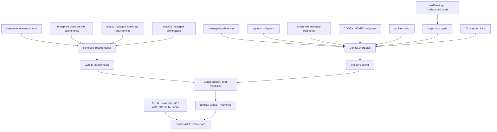

# 第 03 章：配置系统与企业要求

> 源码基线：`upstream/main@283bc4cf011047314b4804c0f1ccd06e4f6a95c5`，复核日期：2026-06-24。

## 1. 配置不是一个文件

Codex 的有效配置由三类控制面共同产生：

1. **Config layers**：回答“各来源配置了什么”，按优先级合并。
2. **Requirements layers**：回答“组织允许什么”，组合为不可被普通配置绕过的约束。
3. **Model-visible instructions**：AGENTS、skills 等控制模型如何工作，但不等同于权限 enforcement。

把它们都叫“配置”会产生危险误解：

- 项目 `.codex/config.toml` 可以表达偏好，但不能决定凭据发送目标。
- `requirements.toml` 可以限制 approval、permission、features、MCP、hooks 和网络策略。
- AGENTS.md 可以要求“不要运行某命令”，但真正阻止命令的是 approval/permission/sandbox/execpolicy。

## 2. 当前加载架构



## 3. Config layer 的优先级

`codex-rs/config/src/loader/mod.rs` 给出的当前顺序是：

| 从低到高 | 来源 |
| ---: | --- |
| 1 | macOS managed preferences |
| 2 | system `config.toml` |
| 3 | enterprise cloud config fragments |
| 4 | `$CODEX_HOME/config.toml` |
| 5 | `$CODEX_HOME/<profile>.config.toml` |
| 6 | cwd、父目录树、Git root 下的 `.codex/config.toml` |
| 7 | runtime/session flags，例如 `--config` 和 UI model selector |

`ConfigLayerSource::precedence()` 使层顺序成为显式 contract，而不是依赖目录遍历的偶然结果。

### 3.1 Project 层不是天然可信

项目配置来自仓库内容，是潜在供应链输入。加载器会：

- 识别 active project。
- 读取项目 trust level。
- 即使读取到项目层，也可在 `ConfigLayerEntry.disabled_reason` 中标记禁用。
- 对不可信项目联动限制 project config、hooks 和 execpolicy rules。

这比“找不到文件就不加载”更可观测：app-server/config API 能展示某层存在但被禁用的原因。

### 3.2 Project denylist

项目层不能设置以下高风险类别：

- `openai_base_url`、`chatgpt_base_url`
- `model_provider`、`model_providers`
- `profile`、`profiles`
- `notify`
- realtime base URLs
- `otel`
- apps MCP product SKU

原因很直接：仓库内容不应决定凭据发往哪里、加载哪个 provider 或执行哪个本机通知命令。

### 3.3 Profile v2

选择 profile 时，基础 `$CODEX_HOME/config.toml` 仍然加载，profile 文件作为第二个 user layer 叠加。profile 不需要复制完整配置。

旧式在基础 TOML 内嵌 profile 与独立 profile 文件并存时，需要区分兼容语义；更新文档时应以 `ProfileV2Name` 和 loader 的实际层构造为准。

## 4. Requirements 的组合语义

当前 requirements 来源按以下顺序收集：

1. system `requirements.toml`
2. enterprise cloud bundle requirements
3. legacy `managed_config.toml` 重解释层
4. macOS managed preferences requirements

后来的高优先级来源覆盖或参与字段专用组合。它不是对普通 config 做一次 TOML merge：

- hooks 有追加和 managed-directory 冲突规则。
- exec policy rules 有专用组合。
- deny-read permission 需要集合语义。
- remote sandbox config 需要按 hostname 选择。
- managed permission profiles 需要 catalog 合并和引用验证。

因此真正入口是 `requirements_layers::compose_requirements`，而不是直接把几个 TOML table 拼起来。

### 4.1 Fail-closed 的地方

以下情况不能静默忽略：

- requirements TOML 解析失败。
- managed hook directory 的高低层定义冲突。
- required permission profile 不存在或不合法。
- cloud bundle 在要求强制加载时超时、重试耗尽或无有效缓存。
- strict config 下 cloud/config fragment 出现未知或忽略字段。

普通用户配置可以产生 warning 或 fallback；组织治理输入的冲突则更倾向失败关闭。

### 4.2 Permission profile 已成为主要治理单位

旧文常只讨论 `sandbox_mode` 和 `approval_policy`。当前代码还需要关注：

- `permissions` catalog。
- `allowed_permission_profiles`。
- `default_permissions`。
- managed profiles。
- permission profile 对 filesystem/network/sandbox 的组合表达。

企业要求可以强制用户从指定 profile 中选择，而不是只限制一个 sandbox enum。

## 5. Cloud config bundle

云配置已经从旧的单一 cloud-requirements 路径演进为 `codex-rs/cloud-config`：

- bundle 同时携带 `config_toml.enterprise_managed` 和 `requirements_toml.enterprise_managed`。
- backend client 获取当前 workspace 的 bundle。
- `CloudConfigBundleService` 负责初始化、重试、auth recovery 和后台刷新。
- `CloudConfigBundleCache` 提供签名磁盘缓存。
- loader 把 bundle 转成带 `EnterpriseManaged { id, name }` 来源的层。

### 5.1 缓存为什么不只是 JSON 文件

缓存读取会验证：

- cache version。
- auth identity 是否完整。
- cached identity 是否与当前身份一致。
- signature。
- bundle 是否仍能通过结构和配置验证。

这样才能同时避免：

- 离线时完全不可启动。
- 用户切换账号后误用旧组织策略。
- 本地篡改企业 policy。
- 旧 binary 误读新缓存格式。

### 5.2 启动与后台刷新

服务可先使用有效缓存，再异步刷新；但首次没有可用 bundle 且企业策略要求加载时，超时或请求失败会 fail closed。后台刷新失败可以保留已经验证过的缓存。

“有缓存”与“缓存可被当前身份信任”是两回事。

## 6. Strict config

`--strict-config` 把本来可能被忽略的配置问题升级为错误，覆盖：

- 未知字段。
- 已被忽略的字段。
- 未知 feature。
- CLI overrides。
- cloud fragments。

但它不是所有子命令的无条件 root flag。某些管理命令会明确拒绝 root strict-config，避免用户误以为该命令执行了完整 runtime 配置校验。

应用 strict mode 时应问两个问题：

1. 当前入口是否支持？
2. 它验证的是哪一组 layers，而不是笼统的“所有配置”？

## 7. AGENTS.md 层级

AGENTS 发现当前支持：

- 用户级指令。
- 从 project root 到 cwd 的层级文件。
- `AGENTS.override.md` 优先于同目录 `AGENTS.md`。
- host/user instructions 与 project instructions 的分隔。
- 多 environment 下分别发现 workspace instructions。
- 总字节预算 `project_doc_max_bytes`，默认 32 KiB。

### 7.1 预算是总量，不是每文件配额

发现器维护剩余预算，按层级读取并截断。深层 AGENTS 不一定能完整进入上下文；若上层文件耗尽预算，后续文件可能完全不注入。

### 7.2 AGENTS 与 config 是两棵树

- config project layers 决定 runtime 设置。
- AGENTS hierarchy 生成模型可见 instructions。

它们都受 project root/cwd/trust 影响，但覆盖规则和安全作用不同，不能互相替代。

## 8. 配置解析到运行时的关键阶段

```text
bootstrap load
  -> 读取 auth store/base URL 等足够信息
  -> 创建 cloud bundle loader
  -> load_config_layers_state
  -> compose requirements
  -> ConfigLayerStack
  -> ConfigBuilder 应用 harness/CLI overrides
  -> resolve permission/auth/provider/network
  -> enforce login restrictions
  -> 启动 app-server/core runtime
```

之所以存在 bootstrap 与完整加载两步，是因为拉取 cloud bundle 本身可能需要认证和 base URL，而这些信息又来自配置。

## 9. 易错点

1. 将项目配置视为最高优先级；runtime flags 更高，requirements 还能限制最终值。
2. 在项目层配置 provider/base URL，实际会被 denylist。
3. 把 user config 中的 `allow_managed_hooks_only` 当作组织要求；普通 config 不能自封为 requirements。
4. 认为 untrusted 只影响 `.codex/config.toml`；hooks 和 project rules 也会受影响。
5. 把 warning 当作配置未加载；有些字段已回退到约束允许值。
6. 将 remote sandbox hostname 规则套到本机 hostname 之外的错误环境。
7. 更新 `ConfigToml` 后忘记运行 `just write-config-schema`。
8. 只测试 Cargo，不验证 Bazel 所需 compile data。

## 10. 企业落地建议

- 把组织不可协商的安全边界放 requirements，不放 AGENTS。
- 用 named permission profiles 表达角色，而不是要求成员记多个 bool/enum。
- 明确项目 trust 的授予流程，不要让用户为了消除提示直接全局信任。
- 监控 cloud bundle 加载来源：remote、cache、none、error。
- 对 strict config 做版本升级演练；新旧客户端会识别不同字段集合。
- 通过 config API 展示 layer source、version 和 disabled reason，避免只发最终合并 TOML。
- 将 AGENTS 总预算和截断纳入项目文档治理。

## 11. 验证命令

```bash
# 层级和 denylist
sed -n '50,430p' codex-rs/config/src/loader/mod.rs
rg -n "PROJECT_LOCAL_CONFIG_DENYLIST|ConfigLayerSource|disabled_reason" \
  codex-rs/config codex-rs/app-server-protocol/src/protocol/v2/config.rs

# requirements 专用组合
rg -n "compose_requirements|RequirementsCompositionError" \
  codex-rs/config/src/requirements_layers

# cloud bundle/cache/fail-closed
rg -n "CloudConfigBundleService|CloudConfigBundleCache|fail closed|timed out" \
  codex-rs/cloud-config/src

# AGENTS 层级与预算
rg -n "AGENTS.override.md|project_doc_max_bytes|remaining|Workspace instructions" \
  codex-rs/core/src/agents_md.rs codex-rs/config/src/config_toml.rs

# 行为测试
just test -p codex-config
just test -p codex-core
```

## 小结

Codex 的配置治理不是一条优先级链，而是三层模型：

```text
config layers：用户想怎么运行
requirements：组织允许怎么运行
instructions：模型应该怎么工作
```

成熟使用这套系统的关键，不是记住更多 TOML 键，而是始终追踪来源、优先级、trust、约束和最终 runtime 值。
