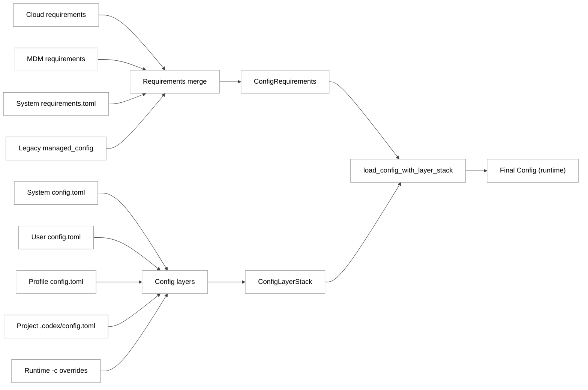
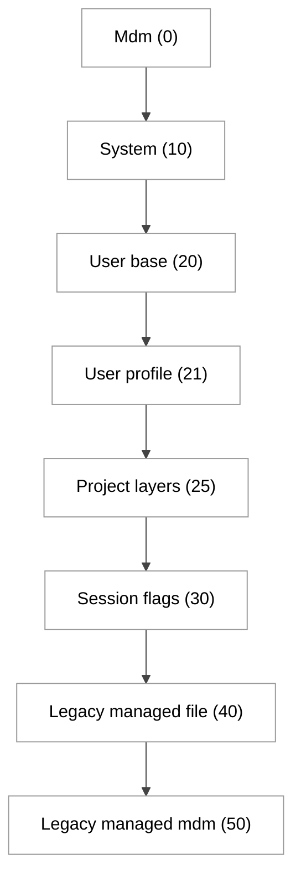
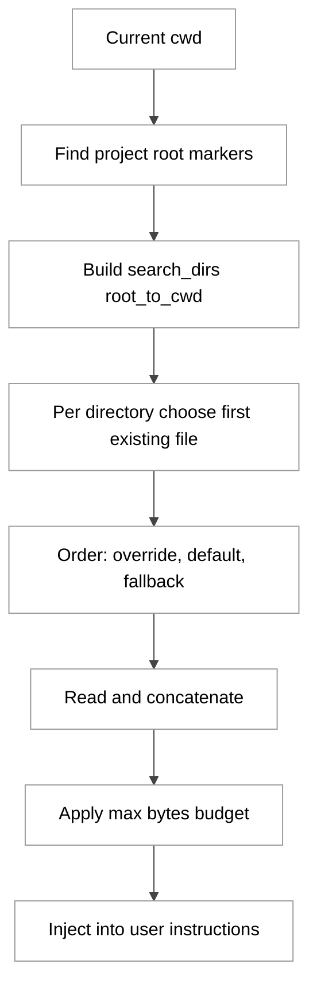
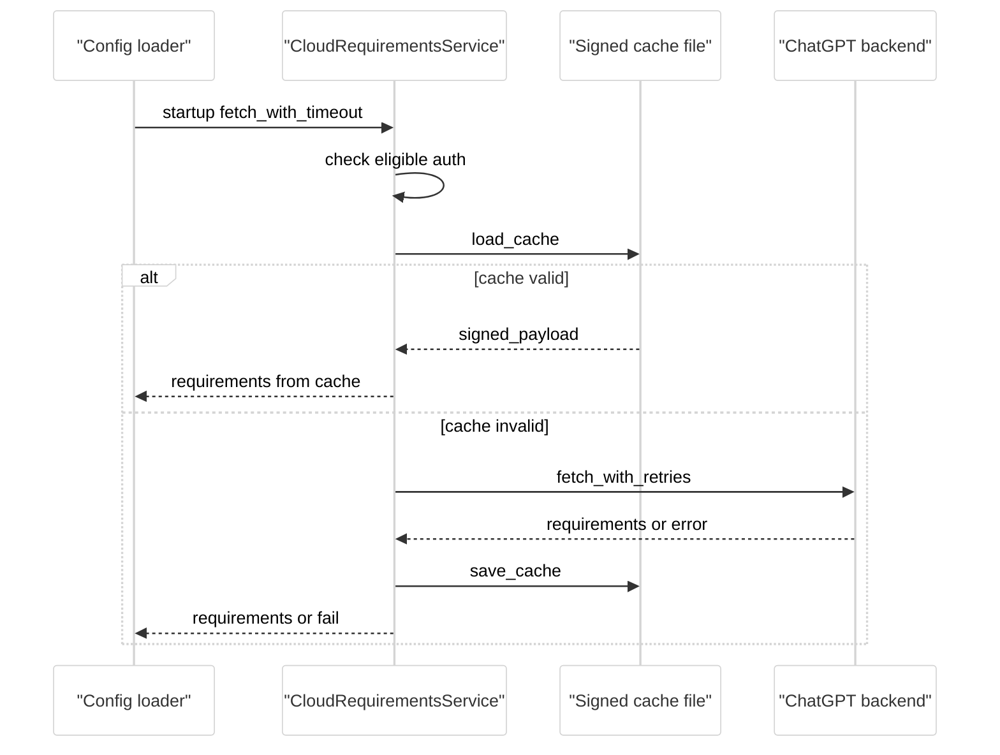
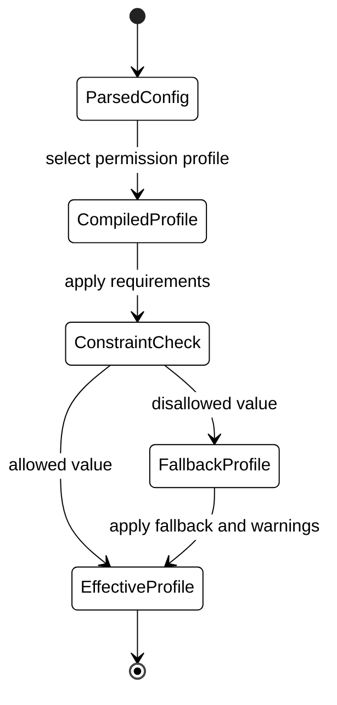

# 第 03 章 配置系统与企业要求

## 引言

如果说 Codex 的模型能力决定了“上限”，那么配置系统决定的是“可控性下限”。在同一个 agent 内核里，本地开发者希望灵活覆盖、团队希望共享约定、企业安全又要求强约束且可审计，这三股力量天然冲突。Codex 的做法不是把它们揉成一个文件，而是拆成两条并行控制面：**配置层（config layers）**与**要求层（requirements constraints）**。本章基于源码基线 `4f7d6b4ef7`（2026-05-26 本地复核）展开，重点回答：Codex 如何在“可用性”和“治理性”之间实现工程化平衡，以及这套设计在企业场景里到底可靠到什么程度。

---

## 全网调研补充（Step 0）

### 1) 近 12 个月信息源覆盖

按关键词 `Codex config.toml`、`Codex cloud-requirements enterprise`、`Codex AGENTS.md hierarchy` 做中英文检索后，可归纳为四层信息源：

- 一手权威：OpenAI Developers（`config-basic` / `config-advanced` / `config-reference` / `enterprise/managed-configuration` / `guides/agents-md`）、OpenAI 工程博客（产品与 harness 文章）。
- 英文深度二手：Simon Willison、Hacker News 长讨论串、部分工程博客（偏迁移与落地经验）。
- 中文社区二手：知乎/CSDN/掘金/博客园以“配置速查、安装接入、参数抄作业”为主，机制拆解较少。
- 指定平台缺口：机器之心、少数派在过去 12 个月里对 **config 层级 + requirements 执行语义** 的系统分析基本缺席，更多是产品介绍或使用体验。

按你要求的渠道做对照后，可定位到的代表来源如下（仅列和本章主题直接相关者）：

| 渠道 | 代表来源 | 与本章相关性 |
|---|---|---|
| OpenAI 工程团队 | [Configuration Reference](https://developers.openai.com/codex/config-reference)、[Managed configuration](https://developers.openai.com/codex/enterprise/managed-configuration)、[AGENTS.md guide](https://developers.openai.com/codex/guides/agents-md) | 一手定义配置键、要求层优先级、AGENTS 层级语义 |
| Simon Willison | [OpenAI Codex CLI 初评](https://simonwillison.net/2025/Apr/16/openai-codex/) | 对社区认知框架影响大，但对 requirements 细节覆盖有限 |
| Latent Space | [GPT5 Codex Max 训练与代理讨论](https://www.latent.space/p/gpt5-codex-max-training-agents-with) | 偏产品与代理范式，较少进入 config/requirements 实现层 |
| Hacker News | [Codex CLI 讨论串](https://news.ycombinator.com/item?id=43708025) | 高频讨论“默认安全边界 vs 可用性”张力 |
| 知乎 | [Codex 断连/配置排障类文章](https://zhuanlan.zhihu.com/p/2038317397019505265) | 偏故障处理，少有源码机制拆解 |
| 少数派 | [移动端 SSH + CLI 体验文](https://sspai.com/post/105621) | 偏使用体验，不深入要求层语义 |
| CSDN | [配置速查/安装文](https://blog.csdn.net/sugerforu/article/details/160934017) | 参数抄写类内容多，机制分析弱 |
| 掘金 | [AGENTS 与配置对比文](https://juejin.cn/post/7631411950350467087) | 对文件分工有帮助，但源码证据深度不足 |
| 机器之心 | 近 12 个月未检索到聚焦 `config.toml + requirements + AGENTS hierarchy` 的系统文章 | 属于明显盲区 |

### 2) 主题共识（与源码一致）

社区的稳定共识有三条，而且都能被源码直接印证：

1. `config.toml` 是分层合并，不是单文件真值；`--config`/运行时覆盖并非唯一最高层。  
2. `requirements.toml` 是“约束层”而非“建议层”，会对不合规值进行回退或拒绝。  
3. `AGENTS.md` 是路径分层拼接，不是只读根目录单文件。

这三点分别对应加载器注释、约束应用逻辑与 AGENTS 发现器：

```rust
// codex-rs/config/src/loader/mod.rs:78
/// To build up the set of admin-enforced constraints, we build up from multiple
/// configuration layers in the following order, but a constraint defined in an
/// earlier layer cannot be overridden by a later layer:
///
/// - cloud:    managed cloud requirements
/// - admin:    managed preferences (*)
/// - system    `/etc/codex/requirements.toml` (Unix) or
///   `%ProgramData%\OpenAI\Codex\requirements.toml` (Windows)
```

```rust
// codex-rs/core/src/config/mod.rs:1685
if let Err(err) = constrained_value.set(configured_value) {
    let fallback_value = constrained_value.get().clone();
    ...
    startup_warnings.push(message);
    constrained_value.set(fallback_value)...
}
```

```rust
// codex-rs/core/src/agents_md.rs:13
//! 2.  Collect every `AGENTS.md` found from the project root down to the
//!     current working directory (inclusive) and concatenate their contents in
//!     that order.
```

### 3) 社区分歧与常见误解

- 误解 A：项目内 `.codex/config.toml` 可以覆盖任意键。  
  实际上有 10 个键被显式 denylist（例如 `openai_base_url`、`model_provider`、`profile`、`otel`），仅允许在用户/系统层设置：

```rust
// codex-rs/config/src/loader/mod.rs:61
const PROJECT_LOCAL_CONFIG_DENYLIST: &[&str] = &[
    "openai_base_url",
    "chatgpt_base_url",
    ...
    "otel",
];
```

- 误解 B：AGENTS 限制是“每个文件 32KiB”。  
  源码实现是**合并预算**（`remaining` 逐文件扣减），社区讨论里对“per-file vs combined”长期混淆。

- 误解 C：云端 requirements 失败时企业账号也会默认放行。  
  `cloud-requirements` crate 顶部注释已写明：对符合条件的 Business/Enterprise 账号，拉取失败按 fail-closed 处理。

### 4) 讨论盲区（本章将补位）

社区极少系统讨论以下细节，但它们在企业落地里最关键：

- `ConfigRequirementsWithSources::merge_unset_fields` 的“先到先占位”语义，会影响多来源策略叠加。
- `remote_sandbox_config` 的 hostname 匹配如何在加载期改写 `allowed_sandbox_modes`。
- 云策略缓存为何要做 **身份绑定 + HMAC 签名 + TTL + 防篡改** 四件套。
- “不可信项目”不仅禁用项目配置，还会联动禁用 hooks 与 exec policies。

---

## 一、本质是什么（模块定位）

### 1.1 配置系统不是单模块，而是一个控制平面集群

从代码规模看，这一章对应的不是 `mod.rs` 一份文件，而是一组协同子系统：

- `core/src/config/mod.rs`：3859 行（运行期有效配置装配）。
- `config/src/loader/mod.rs`：1512 行（层级加载、信任判断、来源治理）。
- `config/src/config_requirements.rs`：3235 行（约束 schema 与归一化）。
- `cloud-requirements/src/lib.rs`：2466 行（云端要求拉取、缓存、恢复）。
- `core/src/agents_md.rs`：369 行（目录层级指令链）。

按结构统计（用 `awk` 截取结构体定义体并统计 `pub ` 字段行数得到，方法见本节末注脚）：

- `Config` 结构体字段约 115 个（运行态大总线）。
- `ConfigToml` 字段约 96 个（声明态输入）。
- `ConfigRequirementsToml` 字段 19 个（治理态约束输入，可逐字段对照源码 L747-L769）。
- `ConfigLayerSource` 枚举 7 个来源层级（`Mdm / System / User base / User profile / Project / SessionFlags / Legacy*2`）。

> 计数说明：脚本以 `awk '/^pub struct X \{/,/^\}/' | grep -c "pub "` 近似统计，可能略多于实际字段数（嵌套类型的 `pub` 也会被算到），但用作量级参考已经足够。

从“字段数级别”就能看出，这一章对应的不是“几个开关项”，更像一个“运行治理子系统”；至于它是否已经稳定到“治理内核”级别，留到后面缺陷一节再判断。

### 1.2 双轨模型：配置层负责表达，要求层负责边界

`ConfigLayerStack` 负责把不同来源 TOML 合并成“有效配置视图”，但**不直接执行企业边界**：

```rust
// codex-rs/config/src/state.rs:451
/// Returns the merged config-layer view.
///
/// This only merges ordinary config layers and does not apply requirements
/// such as cloud requirements.
pub fn effective_config(&self) -> TomlValue { ... }
```

随后 `core::config` 再把 `ConfigRequirements` 应用到各关键字段（审批、权限档、web_search、MCP、network/filesystem）。

可以把这套分工理解成：

- **ConfigLayerStack**：解决“谁说了什么”——来源合并 + 覆盖顺序。
- **ConfigRequirements**：解决“什么可以被执行”——约束、回退、拒绝。

这种切分在源码注释里被反复呼应（如 `effective_config` 注释明确写 “does not apply requirements”），并不只是后来文档总结出来的。

### 1.3 AGENTS.md 属于“模型行为配置层”，不是文档附属品

Codex 把 AGENTS 读取纳入配置系统，而不是让模型运行时自行文件检索。`AgentsMdManager` 在会话前把指令链拼接到模型可见消息中；`project_doc_max_bytes` 则控制预算上限（默认 32KiB）。

```rust
// codex-rs/core/src/config/mod.rs:183
/// Maximum number of bytes of the documentation that will be embedded. Larger
/// files are *silently truncated* to this size so we do not take up too much of
/// the context window.
pub(crate) const AGENTS_MD_MAX_BYTES: usize = DEFAULT_PROJECT_DOC_MAX_BYTES; // 32 KiB
```

---

## 二、核心问题和痛点（要解决什么）

### 2.1 同一套运行时要同时服务“个人灵活性”和“企业强治理”

核心冲突在于：

- 开发者希望 `-c`、profile、项目局部配置立即生效。
- 企业希望安全相关字段不可被本地绕过。

Codex 通过“配置层 + 约束层”拆解了这个冲突，但也带来认知成本：用户看到值“设置成功”，实际运行时可能被约束回退，并只在 `startup_warnings` 里提示。

### 2.2 项目信任边界必须阻断供应链侧风险

项目内 `.codex/config.toml` 来自仓库内容，本质上是供应链输入。加载器对不可信项目直接给出禁用理由，并把 gating 扩展到 config/hooks/execpolicy 三类能力：

```rust
// codex-rs/config/src/loader/mod.rs:833
fn disabled_reason_for_decision(&self, decision: &ProjectTrustDecision) -> Option<String> {
    ...
    let gated_features = "project-local config, hooks, and exec policies";
    ...
}
```

### 2.3 云策略必须“可缓存、可恢复、可验证、不串租户”

企业云策略如果每次启动都依赖网络，稳定性会崩；但如果盲信本地缓存，安全又会崩。`cloud-requirements` 采用四重保护：

1. 账号资格判断（仅 Business/Enterprise + codex backend）。  
2. HMAC 签名校验（防篡改）。  
3. user_id + account_id 绑定（防跨账号污染）。  
4. TTL 过期失效与后台刷新。

```rust
// codex-rs/cloud-requirements/src/lib.rs:186
fn cloud_requirements_eligible_auth(auth: &CodexAuth) -> bool {
    ...
    auth.uses_codex_backend()
        && (plan_type.is_business_like() || matches!(plan_type, PlanType::Enterprise))
}
```

### 2.4 文档迁移导致“社区知识漂移”

仓库内 `docs/config.md` 与 `docs/example-config.md` 已变为外链跳转，`codex-rs/config.md` 也仅保留“文档迁移”说明。这降低了仓库内自解释性，社区更容易传播过期键名和旧行为。

```markdown
<!-- docs/config.md:3 -->
For basic configuration instructions, see [this documentation](https://developers.openai.com/codex/config-basic).
```

---

## 三、解决思路与方案（架构、数据结构、关键算法）

### 3.1 总体方案：分层加载 + 约束归一 + 运行期回退

Codex 的主方案可概括为 5 步：

1. 先聚合 requirements 来源（cloud/admin/system/legacy）。
2. 再组装 config layers（system/user/profile/project/runtime）。
3. 生成 `ConfigLayerStack` 与 `ConfigRequirementsToml`。
4. 进入 `load_config_with_layer_stack` 做字段级约束应用。
5. 生成最终 `Config`（含 `startup_warnings`）。

```rust
// codex-rs/config/src/loader/mod.rs:131
if !ignore_managed_requirements {
    if let Some(requirements) = cloud_requirements.get().await.map_err(io::Error::other)? {
        merge_requirements_with_remote_sandbox_config(...);
    }
    ...
    load_requirements_toml(...).await?;
}
```

```rust
// codex-rs/core/src/config/mod.rs:1147
let config_layer_stack = load_config_layers_state(
    LOCAL_FS.as_ref(),
    &codex_home,
    Some(cwd),
    &cli_overrides,
    ConfigLoadOptions { ... },
    cloud_requirements,
    thread_config_loader...,
).await?;
```

### 3.2 架构图：配置与要求双轨

<div style="background:#ffffff !important; background-color:#ffffff !important; padding:16px; border-radius:8px; margin:16px 0;" bgcolor="#ffffff">



</div>

### 3.3 优先级与覆盖图：谁能覆盖谁

`ConfigLayerSource::precedence()` 明确了层级数值：`Mdm=0`、`System=10`、`User=20/21`、`Project=25`、`SessionFlags=30`，以及遗留 managed_config 更高值（40/50）。

```rust
// codex-rs/app-server-protocol/src/protocol/v2/config.rs:88
pub fn precedence(&self) -> i16 {
    match self {
        ConfigLayerSource::Mdm { .. } => 0,
        ConfigLayerSource::System { .. } => 10,
        ConfigLayerSource::User { profile, .. } => {
            if profile.is_some() { 21 } else { 20 }
        }
        ConfigLayerSource::Project { .. } => 25,
        ConfigLayerSource::SessionFlags => 30,
        ConfigLayerSource::LegacyManagedConfigTomlFromFile { .. } => 40,
        ConfigLayerSource::LegacyManagedConfigTomlFromMdm => 50,
    }
}
```

<div style="background:#ffffff !important; background-color:#ffffff !important; padding:16px; border-radius:8px; margin:16px 0;" bgcolor="#ffffff">



</div>

### 3.4 关键数据结构：来源带标签、约束可回退

`ConfigRequirementsWithSources` 将每个字段包成 `Sourced<T>`，并在 merge 时坚持“仅填充未设置字段”的语义：

```rust
// codex-rs/config/src/config_requirements.rs:822
pub fn merge_unset_fields(&mut self, source: RequirementSource, other: ConfigRequirementsToml) {
    // ... if base.field is None, take from other.field ...
    if $base.$field.is_none() && let Some(value) = $other.$field.take() {
        $base.$field = Some(Sourced::new(value, $source.clone()));
    }
}
```

从行为上看，企业策略合并不是“后写覆盖前写”，而是“按来源顺序抢占空位”。这与 loader 顶部注释里那句 `a constraint defined in an earlier layer cannot be overridden by a later layer` 是一致的；至于 OpenAI 是否完全出于“稳定与可解释”这个动机，源码没有直接说明，这里只能算一种合理推测，不排除还有性能或迁移兼容方面的考量。

---

## 四、实现细节关键点（代码路径、函数、数据流）

### 4.1 入口总装配：`load_config_with_layer_stack`

该函数是本章最关键实现（顶层跨度约 1158 行，L2425-L3582），承担了从声明态配置到运行态配置的全部编排，包含：

- model provider 校验。
- requirements 解包与 Constrained 容器绑定。
- override 冲突检查。
- features 与 web_search 解析。
- permission profile 编译与降级。
- network/filesystem 约束施加。
- MCP allowlist 过滤。

```rust
// codex-rs/core/src/config/mod.rs:2425
pub(crate) async fn load_config_with_layer_stack(
    fs: &dyn ExecutorFileSystem,
    cfg: ConfigToml,
    overrides: ConfigOverrides,
    codex_home: AbsolutePathBuf,
    config_layer_stack: ConfigLayerStack,
) -> std::io::Result<Self> {
    ...
}
```

### 4.2 覆盖冲突与硬错误路径

Codex 对高风险组合不是“最佳努力”，而是直接拒绝。例如 CLI 不能同时指定 `sandbox_mode` 与 `permission_profile/default_permissions`：

```rust
// codex-rs/core/src/config/mod.rs:2512
if sandbox_mode.is_some() && permission_profile.is_some() {
    return Err(std::io::Error::new(
        std::io::ErrorKind::InvalidInput,
        "`sandbox_mode` and `permission_profile` overrides cannot both be set",
    ));
}
```

另一个高价值保护是：当 requirements 不允许 `danger-full-access`，且回退后变成 `read_only`，则阻止 `approval_policy = "never"`，防止“无审批 + 只读”导致可用性死锁：

```rust
// codex-rs/core/src/config/mod.rs:3277
if permission_profile_was_constrained
    && ... == SandboxModeRequirement::DangerFullAccess
    && constrained_permission_profile.get() == &PermissionProfile::read_only()
    && constrained_approval_policy.value() == AskForApproval::Never
{
    return Err(std::io::Error::new(
        std::io::ErrorKind::InvalidInput,
        "`approval_policy = \"never\"` cannot be used ...",
    ));
}
```

### 4.3 AGENTS 分层发现与预算截断

AGENTS 发现算法有三个关键点：

1. 根定位：按 `project_root_markers`（默认 `.git`）向上找根。
2. 目录遍历：从根到 cwd 逐层取“每层最多一个文件”。
3. 候选顺序：`AGENTS.override.md` > `AGENTS.md` > fallback filenames。

```rust
// codex-rs/core/src/agents_md.rs:266
let project_root_markers = match project_root_markers_from_config(&merged) {
    Ok(Some(markers)) => markers,
    Ok(None) => default_project_root_markers(),
    ...
};
...
for d in search_dirs {
    for name in &candidate_filenames {
        let candidate = d.join(name);
        ...
    }
}
```

```rust
// codex-rs/core/src/agents_md.rs:335
fn candidate_filenames(&self) -> Vec<&str> {
    names.push(LOCAL_AGENTS_MD_FILENAME);
    names.push(DEFAULT_AGENTS_MD_FILENAME);
    for candidate in &self.config.project_doc_fallback_filenames { ... }
}
```

读取阶段按 `remaining` 扣减，触发截断：

```rust
// codex-rs/core/src/agents_md.rs:189
let mut remaining: u64 = max_total as u64;
...
if size > remaining {
    data.truncate(remaining as usize);
}
```

<div style="background:#ffffff !important; background-color:#ffffff !important; padding:16px; border-radius:8px; margin:16px 0;" bgcolor="#ffffff">



</div>

### 4.4 云端 requirements：重试、鉴权恢复、签名缓存

`cloud-requirements` 的核心函数是 `fetch_with_retries`（约 173 行），把请求失败分成三类：可重试失败、401 未授权（可恢复）、不可恢复错误。

```rust
// codex-rs/cloud-requirements/src/lib.rs:370
async fn fetch_with_retries(
    &self,
    mut auth: CodexAuth,
    trigger: &'static str,
) -> Result<Option<ConfigRequirementsToml>, CloudRequirementsLoadError> {
    let mut attempt = 1;
    ...
}
```

缓存读取必须同时满足：签名正确、身份匹配、未过期：

```rust
// codex-rs/cloud-requirements/src/lib.rs:614
if !verify_cache_signature(&payload_bytes, &cache_file.signature) {
    return Err(CacheLoadStatus::CacheSignatureInvalid);
}
...
if cached_chatgpt_user_id != chatgpt_user_id || cached_account_id != account_id {
    return Err(CacheLoadStatus::CacheIdentityMismatch);
}
if cache_file.signed_payload.expires_at <= Utc::now() {
    return Err(CacheLoadStatus::CacheExpired);
}
```

并发模型上，启动时前台拉取 + 后台 refresh 任务并行存在：

```rust
// codex-rs/cloud-requirements/src/lib.rs:709
let task = tokio::spawn(async move { service.fetch_with_timeout().await });
let refresh_task =
    tokio::spawn(async move { refresh_service.refresh_cache_in_background().await });
```

<div style="background:#ffffff !important; background-color:#ffffff !important; padding:16px; border-radius:8px; margin:16px 0;" bgcolor="#ffffff">



</div>

### 4.5 测试如何定义“企业语义”

云要求模块（`cloud-requirements/src/lib.rs`，2466 行）目前可数到 34 个 `#[tokio::test]`，其中相当一部分断言直接定义了治理行为边界，而不只是验证"正常路径能跑通"。例如：

- timeout 必须 fail-closed：

```rust
// codex-rs/cloud-requirements/src/lib.rs:1548
let err = result.expect_err("cloud requirements timeout should fail closed");
```

- 缓存篡改必须失效并回源：

```rust
// codex-rs/cloud-requirements/src/lib.rs:2145
async fn fetch_cloud_requirements_ignores_tampered_cache() { ... }
```

- 解析错误不重试，直接 fail-closed：

```rust
// codex-rs/cloud-requirements/src/lib.rs:1894
.expect_err("parse error should fail closed");
```

这类测试不是“质量补丁”，而是企业策略语义的可执行规范。

### 4.6 权限状态机：从声明权限到有效权限

<div style="background:#ffffff !important; background-color:#ffffff !important; padding:16px; border-radius:8px; margin:16px 0;" bgcolor="#ffffff">



</div>

---

## 五、易错点和注意事项（陷阱、边界条件、隐式依赖）

### 5.1 `project_root_markers = []` 会关闭父级查找

这不是“使用默认 .git”，而是直接把 cwd 当根。很多人误以为空数组等同“未设置”，实际语义完全相反。

```rust
// codex-rs/config/src/project_root_markers.rs:29
if entries.is_empty() {
    return Ok(Some(Vec::new()));
}
```

### 5.2 项目层被忽略键不会报错退出，只给 warning

对团队来说，这容易形成“以为生效”的错觉，尤其是 `model_provider`/`profiles`/`otel`。

```rust
// codex-rs/config/src/loader/mod.rs:897
fn project_ignored_config_keys_warning(...) -> String {
    "Ignored unsupported project-local config keys ..."
}
```

### 5.3 老式 `profile = "x"` 已不支持

必须改 `--profile x` + `x.config.toml`。这在迁移脚本中非常常见踩坑。

```rust
// codex-rs/core/src/config/mod.rs:2530
if let Some(profile) = cfg.profile.as_deref() {
    return Err(... "legacy `profile = ...` is no longer supported ...");
}
```

### 5.4 AGENTS 截断是预算机制，不是语法错误

当 instruction 链过长，Codex 会截断并继续运行；如果团队没做 budget 管理，会出现“上层规则偶发失效”。

### 5.5 `requirements` 合并是“先来源占位”而非“后来源覆盖”

企业管理员常以为“后发策略覆盖前发策略”；源码并非如此。若要覆盖，通常需要在更高优先来源确保前者未填值，或重排来源策略。

### 5.6 云策略资格判定依赖 auth 类型与 plan

使用 API key 或非 business-like plan 时，云要求路径可能返回 `None`，这不是 bug，而是资格过滤。

### 5.7 文档源头转移导致“仓库内 docs 不全”

当前仓库内 `docs/config.md`/`docs/example-config.md` 仅保留跳转，工程团队做内网镜像时需要额外同步 Developers 文档，否则知识断层。

---

## 六、竞品对比（Claude Code / Opencode / Aider / Goose / Continue）

> 对比口径：以 2026-05 前后公开文档与社区实践为准，重点比“配置与治理机制”，不比模型效果分。

| 维度 | Codex | Claude Code | Opencode | Aider | Goose / Continue |
|---|---|---|---|---|---|
| 指令层级 | 支持全局 + 项目树分层 `AGENTS.md`，目录就近覆盖 | 以 `CLAUDE.md` 为主，层级灵活度较低 | 普遍支持项目指令文件，但层级标准化弱于 Codex | 主要依赖会话 prompt + 配置文件 | 以 IDE 配置/提示模板为主，目录治理能力偏弱 |
| 运行配置 | `config.toml` 分层 + profile + 运行时覆盖 | settings + 会话参数 | 通常为单层配置或工作区设置 | `.aider.conf.yml` + CLI flags | IDE 插件配置为主 |
| 企业强约束 | `requirements.toml` + cloud requirements + MDM/system | 以平台策略和组织设置为主，缺少同构 `requirements.toml` 模式 | 公开资料中企业约束机制较分散 | 企业治理能力弱，偏个人工具 | 依赖 IDE/平台治理，非统一约束内核 |
| 策略执行语义 | 字段级 Constrained + fallback + fail-closed（企业云要求） | 更多在会话/平台层控制 | 多数实现偏“允许式”，回退语义不统一 | 以用户决定为主 | 与宿主 IDE 权限模型强耦合 |
| 指令预算治理 | `project_doc_max_bytes` 显式预算控制 | 通常无统一预算键 | 取决于实现 | 缺少标准预算机制 | 依赖宿主上下文窗口策略 |

本节对比口径不是“谁更好”，仅就“可观察到的治理面”做横向描述。基于公开资料，Codex 把“策略文件”的加载、缓存、回退路径较完整地工程化为可测试代码（仅 `cloud-requirements` 一个 crate 就携带 34 个 `#[tokio::test]`）。**云策略缓存签名 + 身份绑定 + fail-closed 测试化** 这三件套，在当前几家主流 agent CLI 的公开实现里相对少见；其他工具是否在内部已具备等价能力，对外文档无法证实，因此这里只是“横向不常见”的判断，不是“独家”。

---

## 七、仍存在的问题和缺陷（设计局限、改进空间、风险）

### 7.1 核心装配函数过大，维护成本高

`load_config_with_layer_stack` 单函数跨度约 1158 行，已接近“子系统编排器”规模。可测试不等于可维护，后续更适合按“权限/模型/MCP/搜索/持久化”拆成阶段函数。

### 7.2 文档与源码的“本地可读性”不足

仓库文档已迁移到 Developers 站点，本地离线阅读体验弱，团队 fork 或内网镜像时容易错过最新键变更。

### 7.3 仍有历史兼容层拖拽复杂度

`legacy managed_config.toml` 仍在加载路径中（含高 precedence），虽有迁移注释，但会持续增加认知负担与优先级歧义。

### 7.4 `merge_unset_fields` 语义对运维不够直觉

“只填空不覆盖”非常稳健，但不直觉。对于多组织策略联动（cloud + system + mdm）需要更强可视化诊断，否则管理员很难解释“为什么某字段没按预期覆盖”。

### 7.5 AGENTS 截断可见性仍不足

虽然代码有 warning 记录，但在多数用户路径下不够显眼。社区 issue 已多次反馈“截断无感知”，对规则工程是高风险点。

### 7.6 企业 fail-closed 语义在跨入口注释上仍有历史残留

例如 `exec` 入口仍有“未来再做 blocking”的 TODO 注释，和当前 `cloud-requirements` crate 的 fail-closed 定义存在语义时间差，容易造成维护者误读。

```rust
// codex-rs/exec/src/lib.rs:364
// TODO(gt): Make cloud requirements failures blocking once we can fail-closed.
```

---

## 七维分析补充（深度展开）

> 下文是对前面七维框架的“长文版扩展”。写作目标不是重复结论，而是把结论背后的工程理由讲透，尤其是企业场景最关心的“为什么会这样、失败后会怎样、我们该怎么配置才能稳”。

### A. 本质：Codex 配置系统是一套“可演算的治理语言”

把 `ConfigRequirementsToml`、`Sourced<T>`、`apply_requirement_constrained_value` 三者放在一起看，它的形态比“一组参数”更像一门小型 DSL：来源有层级、字段有约束、冲突有回退、失败有错误码、审计有来源标签。这种结构是否真的属于“治理语言”，社区还没有统一说法；这里只是借这个比喻方便描述——更稳妥的说法是：Codex 把“组织规则”的一部分从外部流程下沉到了运行时决策。

从类型系统就能看出这种倾向。`ConfigRequirementsToml` 并不只包含 approval/sandbox 这类显性安全字段，还覆盖了 hooks、MCP、plugins、rules、network、permissions、guardian policy 等多个治理向字段：

```rust
// codex-rs/config/src/config_requirements.rs:747
pub struct ConfigRequirementsToml {
    pub allowed_approval_policies: Option<Vec<AskForApproval>>,
    pub allowed_approvals_reviewers: Option<Vec<ApprovalsReviewer>>,
    pub allowed_sandbox_modes: Option<Vec<SandboxModeRequirement>>,
    pub allowed_permissions: Option<Vec<String>>,
    pub remote_sandbox_config: Option<Vec<RemoteSandboxConfigToml>>,
    pub allowed_web_search_modes: Option<Vec<WebSearchModeRequirement>>,
    pub allow_managed_hooks_only: Option<bool>,
    ...
    pub network: Option<NetworkRequirementsToml>,
    pub permissions: Option<PermissionsRequirementsToml>,
    pub guardian_policy_config: Option<String>,
}
```

如果暂时借用“企业策略 DSL（domain-specific language）”这个类比，下面几个设计取向都能找到对应的源码痕迹（不代表这是唯一合理解释）：

1. 不优先支持“用户越权灵活覆盖”——`PROJECT_LOCAL_CONFIG_DENYLIST` 与 `merge_unset_fields` 都站在约束侧；  
2. 字段都带 `RequirementSource`——审计/追责需要这一信息；  
3. 引入 `Sourced<T>` / `ConstrainedWithSource<T>`——运行期需要知道“是谁在约束我”，不只是“我被约束了”。

类似的“偏重约束”的设计，在个人玩具型工具里可能显得过重；在中大型组织里至少有人会觉得这是“最低可用重量”——这是一种经验性判断，不同组织的实际取舍可能不同。

### B. 痛点：三组冲突叠加，才是配置复杂度根源

前文提到“个人灵活 vs 企业治理”，但实际还要再加一层：**仓库供应链可信度**。所以真实冲突是三元组：

- 个人开发者（速度、局部最优）。
- 团队仓库（共享默认、可复现）。
- 企业安全（全局边界、不可绕过）。

Codex 选择在加载阶段就处理这三元冲突，而不是把它推给模型推理阶段。`project_trust_context` 先判信任，再决定项目层能否生效，这使“安全判断”前置到了“配置合并之前”：

```rust
// codex-rs/config/src/loader/mod.rs:914
async fn project_trust_context(
    fs: &dyn ExecutorFileSystem,
    merged_config: &TomlValue,
    cwd: &AbsolutePathBuf,
    project_root_markers: &[String],
    ...
) -> io::Result<ProjectTrustContext> { ... }
```

这个设计在社区里常被低估的一点是：**它把“模型与仓库内容合谋”的路径堵在了配置加载阶段**。如果项目不可信，项目配置、hooks、execpolicy 会一起降级（见 `disabled_reason_for_decision` 注释中的 `gated_features = "project-local config, hooks, and exec policies"`），模型即使在 prompt 里“看到”某些仓库内策略文本，也无法自动把它们带入执行通道。

同时，Codex 没有采用“全禁用项目层键”的极端做法，而是设置了 10 个 denylist 键，把“能影响凭据路由、模型路由、遥测路由”的危险键从项目层剥离。换句话说，它不是不信任项目，而是精准不信任“可外传/可远控”字段。这比“一刀切禁用项目配置”更工程化，也更符合真实团队协作。

### C. 方案：要求层的合并语义是“先占位”，不是“后覆盖”

这一点决定了运维策略设计方式。`merge_unset_fields` 的行为是：如果目标字段已有值，后续来源不会覆盖；如果目标为空，后续来源才填充。也就是“先来的来源占位，后来来源补缺口”。

```rust
// codex-rs/config/src/config_requirements.rs:822
pub fn merge_unset_fields(&mut self, source: RequirementSource, other: ConfigRequirementsToml) {
    ...
    if $base.$field.is_none() && let Some(value) = $other.$field.take() {
        $base.$field = Some(Sourced::new(value, $source.clone()));
    }
}
```

这会带来一个非常关键的运维含义：

- 如果你期待“云端策略永远覆盖系统策略”，那就必须保证云端来源在 merge 序列里先写入该字段。  
- 如果字段在前置来源已经填了，后置来源将失去覆盖机会。  

从源码注释看（`loader/mod.rs:78-88`），要求层顺序是 cloud → admin → system → legacy，且 `earlier layer cannot be overridden`。这条注释与 `merge_unset_fields` 行为是一致的，看起来是有意为之的强一致设计，而不是偶然实现细节。

对企业治理而言，这种确定性通常比灵活性更重要。因为一旦“后来源可随意覆盖前来源”，就容易引入审计不稳定：同一用户同一仓库在不同环境变量、不同启动参数下出现不同边界，最终策略容易黑盒化。当然，这种取舍也有副作用——“想临时强覆盖”就必须走更高层来源，对一线运维并不友好，5.5 节会再讨论。

### D. 实现：关键路径中的四个“防事故阀门”

#### D.1 阀门一：配置语法冲突即时报错

`sandbox_mode` 与 `permission_profile`、`default_permissions` 的冲突不会静默处理，而是即时错误。这样做会让新用户觉得“严格”，但能避免更隐蔽的权限漂移。

#### D.2 阀门二：不合规值自动回退并记录来源

`apply_requirement_constrained_value` 的策略是：

1. 尝试设置用户值。  
2. 若违反约束，取约束值作为 fallback。  
3. 记录启动警告并继续。  

它避免了“全局 hard fail”带来的可用性雪崩，同时保留了可观测痕迹。对企业来说，这是典型“安全优先、不中断优先”折中。

#### D.3 阀门三：极端组合转 hard error

不是所有回退都可接受。例如 `approval_policy=never` 与降级只读权限组合会导致“不会请求审批 + 无法执行写操作”，用户体验会陷入假死。Codex 选择在这一特例上直接 hard error，属于高价值防误配设计。

#### D.4 阀门四：云策略缓存的完整性验证

云要求缓存被篡改是高风险场景。Codex 在读取缓存时做签名校验、身份匹配、过期校验三连；任一不满足即回源：

```rust
// codex-rs/cloud-requirements/src/lib.rs:614
if !verify_cache_signature(&payload_bytes, &cache_file.signature) {
    return Err(CacheLoadStatus::CacheSignatureInvalid);
}
...
if cache_file.signed_payload.expires_at <= Utc::now() {
    return Err(CacheLoadStatus::CacheExpired);
}
```

从测试断言看（`fetch_cloud_requirements_ignores_tampered_cache`），“本地可写文件”不会天然成为策略后门。但需要明确：这不是绝对防护——签名密钥仍打包在客户端二进制里，对有能力做反编译/逆向的本地对手意义有限；它主要提高的是“低门槛手工改 JSON”这类攻击的成本。是否充分，取决于组织的威胁模型。

### E. 细节：AGENTS 与 config 层级是两套并行树，不应混为一谈

工程实践里最常见的误配是把 AGENTS 层级当成 config 层级。两者都“按目录向上/向下查找”，但职责不同：

- config 层决定运行参数与权限边界。  
- AGENTS 层决定模型行为指令与工程约定。  

AGENTS 还有自己的预算机制（`project_doc_max_bytes`），并且预算扣减是全链路累计。这意味着你把规则拆到多层目录并不能无限扩容，总预算仍会截断。社区里“分目录就不会截断”的经验经常失效，原因就在这里。

另一方面，AGENTS 候选文件顺序（override > default > fallback）允许“本地临时覆盖”，这在团队调试中很实用；但如果组织没有清晰规则，会出现“谁的 override 生效”争议。建议在团队规范里明确：

1. 哪些目录允许放 `AGENTS.override.md`。  
2. fallback 文件名是否启用、启用哪些。  
3. 大项目如何按目录预算拆分 instruction。

### F. 易错点：企业落地时最容易踩的 12 个坑

1. 把 `project_root_markers=[]` 当成“使用默认 `.git`”。  
2. 在项目层设置 `model_provider`/`profiles` 以为能生效。  
3. 在 requirements 里配置了空列表，结果触发“无可选项”错误。  
4. 忽略 `startup_warnings`，错过关键回退提示。  
5. 只看 `config.toml`，不看 requirements 生效后结果。  
6. 把 AGENTS 当成无限上下文知识库，导致被截断。  
7. 误把云要求缓存当“可信永久源”，不关注 TTL。  
8. 企业账号切换后复用旧缓存，触发 identity mismatch。  
9. 在 `exec`/自动化环境中沿用交互式审批预期。  
10. 依赖仓库内 docs，而非 Developers 站点最新配置文档。  
11. 同时启用 legacy `profile` 与新 profile v2，触发迁移错误。  
12. 误以为“设置成功就代表运行成功”，忽略约束回退。

这些坑里，最危险的是第 2 和第 4：前者造成“错觉上的治理”，后者造成“治理存在但组织看不见”。

### G. 竞品：为什么 Codex 在“企业配置工程化”维度更像平台而非工具

为了避免空泛比较，这里按五个具体维度拆开：

#### G.1 可审计性

Codex 的 `RequirementSource`/`Sourced<T>` 让每个约束字段都能回溯来源。很多竞品虽然有组织设置，但未在本地运行态暴露统一来源标签。对安全审计团队而言，这差别很大：前者可自动化核查，后者需要人工解释。

#### G.2 可恢复性

Codex 对云策略使用“签名缓存 + 后台刷新 + 重试回退”，并通过测试固化 fail-closed 语义。大量工具在企业代理、鉴权漂移、短时网络抖动下的行为更像“尽力而为”，边界语义不稳定。

#### G.3 可迁移性

Codex 的 CLI、TUI、app-server 都能接同一 cloud requirements loader（不同入口共享约束主线），这降低了“入口切换导致策略失真”的风险。很多工具的 CLI 与 IDE 插件策略体系是分裂的。

#### G.4 可分层治理

Codex 同时提供：

- 用户偏好层（user/profile/runtime）。
- 项目共享层（project `.codex` + AGENTS）。
- 企业边界层（requirements + managed sources）。

这三层职责边界清晰，符合中大型组织“中央规则 + 团队自治 + 个人偏好”结构。竞品里常见的是“中央策略强但本地灵活弱”或“本地灵活强但中央策略弱”二选一。

#### G.5 可验证测试面

仅 `cloud-requirements` 一个文件就有 34 个 tokio 测试，且大量断言是治理语义（fail-closed、缓存篡改失效、401 恢复）。这不是“写得多”，而是“写在正确位置”：把策略语义放到可执行测试里。

### H. 缺陷：为什么说它成熟但还没到“治理终态”

#### H.1 复杂度债务真实存在

`core/src/config/mod.rs` 3859 行，`config/src/config_requirements.rs` 3235 行，再加 `loader/mod.rs` 1512 行，配置子系统本身已经接近一个中型服务。后续迭代如果继续叠加字段，很容易把“可解释治理”拖向“专家系统式复杂”。

#### H.2 兼容层长期共存风险

遗留 `managed_config.toml` 仍在路径上，且 precedence 高于 runtime layer 的旧模式仍可见。这在迁移期有必要，但长期会让“真实生效路径”越来越难直觉判断。

#### H.3 客户端持有缓存签名密钥的边界

当前签名机制能防低门槛篡改，但密钥在客户端代码中，无法提供服务端签名那样的强信任保证。若未来威胁模型升级（例如高能力本地对手），建议演进到服务端签名与可轮换密钥策略。

#### H.4 运行时可视化仍弱

虽然有 `startup_warnings` 和 metrics，上层 UI 仍缺少“策略解释器”视图（例如：当前字段最终值、被哪条 requirements 回退、来源文件/来源层级、原始配置值与回退值对比）。这会导致企业管理员只能靠日志和猜测排障。

#### H.5 文档体系分离的副作用

仓库文档轻量化对官方维护有利，但对源码研究和内网环境不友好。对于“要求源码自解释”的团队，建议在 CI 中自动同步关键文档快照，以避免知识断层。

### I. 工程建议：把这套系统用“组织化方式”落地

基于源码语义，给企业团队的实践建议如下：

1. **先定三层边界**：把 user/profile、project、requirements 的职责写入团队规范，不混写。  
2. **把 denylist 当设计约束**：不要试图在项目层绕过，直接放用户层或系统层。  
3. **启用启动告警收集**：在 CI 或 wrapper 脚本里收集 `startup_warnings`，否则回退不可见。  
4. **给 AGENTS 做预算治理**：约束每层文件大小，定期检查截断风险。  
5. **云策略做“离线演练”**：模拟 timeout/401/cache tamper，验证 fail-closed 对业务流程影响。  
6. **建立配置快照对比**：保存“输入配置 vs 最终生效配置”以便审计和回归。  
7. **迁移旧 profile 语法**：尽快消除 `profile =` 遗留配置，避免后续版本升级风险。  

这些建议的核心思路只有一句话：**把配置当代码，把策略当测试，把回退当一等路径。**

---

## 企业落地场景推演（补充）

### 场景 1：从个人环境迁移到团队仓库，为什么“同一命令行为变了”

这是最常见、也是最容易误判成“模型波动”的场景。开发者在个人目录里运行 `codex`，通常只受 user/profile/runtime 层影响；一旦进入团队仓库，`project` 层和 AGENTS 层开始参与，若仓库还定义了 trust 规则、hooks、exec policy，行为会出现显著变化。很多团队第一次遇到这个问题时，会把它理解为“某次版本升级变差了”，但从源码看它更接近“配置上下文切换”。

触发路径可以拆成三步：

1. loader 先按当前 `cwd` 找项目根（默认 `.git`，可被 `project_root_markers` 改写）。  
2. 再按从根到 cwd 的顺序加载 `.codex/config.toml` 层；层可以被 trust 决策禁用。  
3. 会话构建阶段再拼接 AGENTS 指令链，并受 `project_doc_max_bytes` 预算截断。

如果三步里任一环节与个人环境不同，最终行为就会不同。这解释了为什么“同一个问题，在两个目录里问，得到的动作序列不一致”。它不是随机，而是 deterministic 的配置差异。

工程建议是把这类差异显式化：在团队 shell 启动器里打印当前有效层级摘要（system/user/profile/project/runtime 是否命中，project 是否 trusted，AGENTS 是否被截断），把“行为差异”从模型层还原回配置层。很多组织在做了这件事后，配置争议会大幅减少，因为讨论对象变成可见的层与字段，而不是不可见的“感觉”。

### 场景 2：安全团队把仓库标记为 untrusted 后，为什么 hooks 也不跑了

从管理角度看，把项目标记为 untrusted 似乎只应影响“项目配置”；但在 Codex 中，trust 决策是一个组合开关，会一起影响 project-local config、hooks、exec policies。也就是说，如果团队依赖项目 hooks 执行某些校验，untrusted 会让这些机制同步失效。这不是 bug，而是设计上的“同源风险同级阻断”。

这类设计背后的安全逻辑是：项目仓库中的 `.codex` 内容本身来自不可信供应链输入，既然不信任这份输入，就不能只禁用其中一部分执行路径而放过另一部分（例如 hooks 脚本仍可执行）。从攻击面角度，这是合理的；从研发体验角度，这会导致“规则突然没生效”的体感断层。

因此团队治理上需要配套两条流程：

- 流程 A：谁有权把项目标记 trusted/untrusted，是否需要审批。  
- 流程 B：当项目变为 untrusted 时，哪些自动化能力会降级，是否有替代执行链（例如在 CI 端补跑）。  

如果缺少流程 B，开发者只会看到“本地不再执行某些检查”，却不知道这是策略结果还是工具故障。长期看，这会削弱团队对治理系统的信任。

### 场景 3：企业账号登录后遇到云策略超时，系统为什么直接失败

在不少工具里，远端策略不可达通常会“先放行再说”；Codex 在符合资格的 Business/Enterprise 场景下把它定义为 fail-closed。对开发者来说，这意味着启动可能直接失败；对企业安全来说，这意味着边界不会被短时网络故障绕开。

这是一种明确的取舍：把可用性成本前置给启动阶段，换取运行期边界确定性。现实落地里，它要求企业网络与身份系统达到更高稳定性，否则开发者会觉得“工具经常拒绝启动”。因此，组织层必须把云策略依赖纳入 SLO，不要只监控代码仓库与 CI 可用性。

Codex 并非没有做可用性缓冲：它引入了带 TTL 的签名缓存、后台刷新和重试机制。也就是说，fail-closed 并不是“每次都必须联网成功”，而是“必须有可信策略来源（新鲜缓存或成功拉取）”。这个 distinction 很重要——它把系统从“强依赖在线”转成“强依赖可信状态”。

从运维实践看，最有效的办法是做两类演练：

1. 网络抖动演练：验证在短时失败下，缓存是否足够支撑业务连续性。  
2. 身份漂移演练：验证账号切换、token 过期、401 恢复路径是否按预期进入错误码分支。  

如果这两类演练未做，等真实故障发生时，团队通常会把问题归因到“模型服务不可用”，而忽视真正的根因在策略获取链。

### 场景 4：为什么“缓存存在”不等于“缓存可用”

很多开发者会在排障时直接检查 `cloud-requirements-cache.json` 是否存在，存在就认为“云策略应该命中”。但源码定义的可用条件更严格：签名有效、identity 匹配、未过期。三者任何一项不满足，缓存都会被忽略，然后重新拉取。

这套机制的工程意义是防止“跨账号串策略”与“本地文件手改策略”两类风险。尤其在共享机器、远程开发盒子、多账号轮换环境里，identity 绑定非常关键。否则会出现 A 账号的策略影响 B 账号会话，造成难以解释的权限漂移。

但它也带来一个操作层副作用：开发者手工删除或替换缓存文件可能触发连锁重试，表现为启动变慢或失败。正确做法不是“随便改缓存”，而是通过登录流程或管理员策略链修复源头。团队文档里应明确这一点，避免把缓存文件当普通可编辑配置。

另外值得注意的是，缓存签名采用客户端内置密钥的 HMAC 方案。它能防止低门槛篡改，但对高能力本地攻击者不构成绝对屏障。企业若有更高威胁模型，应结合终端加固、最小权限账户和集中策略审计共同防护，而不是把单一签名机制当作终极方案。

### 场景 5：AGENTS 指令链“看起来都在，实际上没全生效”

这个问题在大型仓库尤其常见：根目录 AGENTS 很长，子目录还有多个 AGENTS/override，最终合并后超过预算，尾部规则被截断。由于许多团队没有把截断信息纳入显性提示，开发者会误以为“规则被忽略”或“模型不遵守约定”。

解决这个问题不能靠“写得更严格”，而要靠“写得更可组合”：

- 根目录只放全局原则和关键禁令，不放细粒度执行步骤。  
- 子目录放模块专属规则，避免在根层重复。  
- 把大段流程迁移到可引用文档，再在 AGENTS 中保留短索引和入口。  

同时，团队最好建立预算守卫：例如在 CI 中统计 AGENTS 汇总字节数，接近阈值时告警。这样可以把“会话时才暴露的问题”提前到 PR 阶段发现。若不这样做，AGENTS 会从“协作资产”退化为“偶然生效的文本噪声”。

### 场景 6：Windows 环境下的权限默认为何更保守

`ConfigToml::derive_permission_profile()` 在 Windows 无原生沙箱支持时，会把 `workspace-write` 向 `read-only` 保守降级。这是一种“平台能力不足时宁可降权限”的策略。它对安全是正向的，对跨平台体验则会产生明显差异：同一配置在 macOS/Linux 可写，在某些 Windows 组合下却只读。

这类差异如果不被团队显式记录，会引发两类误解：

1. 误解为“Windows 端模型更差”。  
2. 误解为“某版本突然不能写文件”。  

实际根因是平台安全实现能力差异触发的配置回退。企业在 Windows 占比高的环境里，应尽量统一沙箱能力或至少统一预期（例如在模板里明确哪些机器类型默认只读、需要怎样的管理员配置才能提升模式）。

另外，Windows 场景还涉及 ACL/owner 语义、路径规范化与工具链兼容，不应把它当成“只是一个 sandbox_mode 值”。从治理角度，Windows 更接近“独立策略域”，需要专项验证矩阵，而不是复制 Linux 经验。

### 场景 7：组织想要“强约束”，但又怕开发效率下降，如何平衡

这是策略设计中最现实的问题。源码给出的答案不是单点开关，而是“分层渐进”：

第一阶段（可见化）：先不追求最严，先确保所有回退与警告被看见。  
第二阶段（收敛化）：把高风险字段（approval/sandbox/network/MCP）纳入 requirements。  
第三阶段（固化化）：把稳定策略固化到 cloud/system，并对例外走审批流。  

这样做的好处是，团队不会在第一天就陷入“全员卡住”，而是在可见数据基础上迭代约束。尤其对多团队组织，这比一次性推严格策略更可持续。

从源码机制看，Codex 已提供支持这条路线的能力：

- 可通过 requirements 强制关键边界。  
- 可通过 config 层保留个人偏好灵活性。  
- 可通过 warnings 与测试语义观察回退影响。  

缺口主要在组织流程，而不是工具能力。换句话说，Codex 把“技术阀门”给齐了，能否平衡效率与安全，取决于团队是否建立了相应的治理流程和反馈回路。

### 场景 8：治理系统上线后的持续运营指标应该看什么

很多团队上线后只看“用户满意度”或“命令成功率”，但这不足以评估配置治理质量。更有价值的指标是：

1. **回退率**：有多少配置值被 requirements 回退。  
2. **硬错误率**：有多少会话因冲突配置直接失败。  
3. **缓存命中率**：云策略读取是命中缓存还是频繁回源。  
4. **身份错配率**：缓存 identity mismatch 的发生频次。  
5. **AGENTS 截断率**：规则预算是否长期超限。  

这些指标并非都在现成 UI 中直接可见，但可通过日志、启动告警和封装脚本采集。它们的价值在于：能把“治理是否健康”从主观体验转成客观趋势。只有做到这一点，企业才能持续优化策略，而不是在故障发生后临时回滚到“全开权限”。

---

## 源码精读附记（补充 II）

### 1) `load_config_layers_state` 的“先约束后配置”为什么反直觉但必要

很多人第一次读 loader 会困惑：为什么不是先把 config 全部合并，再统一读取 requirements？Codex 的实现恰好相反：先尝试收集 requirements 来源，再加载 config 层。这种顺序看起来复杂，但有两个直接收益。

第一，要求层可以尽早参与后续阶段的解析决策。例如某些字段是否允许、某些 profile 是否可选，不必等到最后才发现冲突。第二，legacy managed_config 的兼容路径可以在“要求层语义”中被统一处理，避免它像普通 config 一样无差别覆盖。

更重要的是，这个顺序让“政策”与“偏好”从时间维度上分离：政策先到位，再接受偏好输入。对企业环境，这比“先让偏好跑起来再回头纠正”更安全，因为后者在窗口期可能出现越权执行。

这也是为什么 loader 注释强调“earlier requirement source cannot be overridden by later source”。它并不是语法细节，而是治理顺序约束。治理系统最怕的不是“策略不够强”，而是“策略顺序不稳定”；一旦顺序不稳定，审计结论也会不稳定。

### 2) `ConfigRequirementsToml` 字段设计透露的组织治理模型

把 `ConfigRequirementsToml`（源码 L747-L769）按组织职责做一次主观分组，会发现它的字段恰好可以对应到一类常见的企业分工：

- 平台安全团队：`allowed_approval_policies`、`allowed_sandbox_modes`、`network`、`permissions`。  
- 开发平台团队：`mcp_servers`、`plugins`、`rules`。  
- AI 治理团队：`feature_requirements`、`guardian_policy_config`、`computer_use`。  
- 组织运维团队：`enforce_residency`、`allow_managed_hooks_only`。  

这并不代表 OpenAI 是按这些角色显式设计的——源码注释里没有这种说法，这里只是从字段语义反推出的一种解释方式。即便如此，这种"反推得通"本身也有实用价值：组织如果没有这些角色分工，单一 requirements 文件很容易塞进互相冲突的意图，配置会逐渐失控。

因此，落地时建议把 requirements 文件拆成逻辑片段，再通过来源顺序合并，而不是单文件大杂烩。即便最终要合并成一份 TOML，也应在生成管道里保留责任归属信息，以便追踪是谁改了什么、为什么改。

### 3) Cloud requirements 的故障树：从“请求失败”到“用户报障”之间发生了什么

企业现场报障常见描述是“Codex 今天打不开了”。如果不理解故障树，很容易走错排查方向。按源码行为，至少有以下分支：

1. **资格分支**：账号不满足 business-like / enterprise，直接 `Ok(None)`，不会触发策略错误。  
2. **缓存分支**：有缓存但签名失败、身份不匹配、TTL 过期，缓存被拒绝。  
3. **请求分支**：后端错误可重试；401 走 auth recovery；恢复失败转 Auth 错误。  
4. **解析分支**：内容 TOML 解析失败，直接 Parse 错误并 fail-closed。  
5. **超时分支**：`fetch_with_timeout` 超时，返回 Timeout 错误并 fail-closed。  

这棵树意味着，企业支持团队必须同时具备三种排查能力：

- 身份排查（auth/session/token）。  
- 网络排查（超时/代理/后端可达）。  
- 策略排查（requirements 内容合法性）。  

只做其中一个会导致“误修复”。例如你反复刷新 token，却忽略了策略 TOML 本身有枚举拼写错误；或者你修了策略内容，却没发现缓存 identity 已经失配。源码测试里对这几条路径都有明确断言，本质上是在告诉运维团队：不要把云策略失败当成单一错误类型。

### 4) AGENTS 与 requirements 的关系：一个管“怎么做”，一个管“能做什么”

在团队实践中，AGENTS 常被拿来写大量“安全规则”，比如禁止某些命令、限制目录写入、约束网络访问。这样做短期看有效，但长期有两个问题：

- AGENTS 是提示指令，不是硬约束；模型遵循度受上下文与会话状态影响。  
- AGENTS 受预算截断影响，关键规则可能被挤掉。  

相比之下，requirements 是运行时硬边界，适合承载“必须执行”的组织规则。正确分工应是：

- AGENTS：编码风格、目录约定、测试流程、评审口径。  
- requirements：审批模式、沙箱模式、网络边界、MCP 允许集。  

把“硬边界”错放 AGENTS 的后果并不是立刻失效，而是“偶发失效”：某些上下文里还有效，某些上下文里不再可靠。这种不稳定最难排查，也最容易损害团队对 agent 的信任。

### 5) 为什么 Codex 在配置层特别强调测试，而不是只靠文档

文档描述的是意图，测试描述的是实际语义。配置系统越复杂，文档与实现偏差就越难避免。Codex 在 cloud-requirements、config-requirements 等核心文件中大量使用测试，价值有三层：

1. 把失败路径固定下来（例如 fail-closed、parse error 不重试）。  
2. 把边界行为固定下来（例如缓存篡改拒绝、identity mismatch 拒绝）。  
3. 把迁移行为固定下来（legacy 兼容何时保留、何时报错）。  

从工程管理角度看，这意味着“配置语义也有回归保护”，不是只保护业务逻辑。对企业而言，这是必要条件：策略行为每次升级都可验证，否则组织无法建立稳定信任。

### 6) 未来演进方向：从“可配置”走向“可证明”

如果把当前实现简单地分一个"成熟度水位"——这里不严格定义，仅作类比，下一阶段值得投入的方向更像是"证明能力"，而不是再加几十个配置键：

- **证明一：解释性**  
  给出机器可读的“字段生效解释”，包含来源、约束、回退链条。  
- **证明二：一致性**  
  同一策略在 CLI/TUI/app-server 多入口输出同构诊断。  
- **证明三：可迁移性**  
  提供策略 schema 版本迁移工具，避免人工改 TOML。  
- **证明四：可回滚性**  
  支持策略版本化与快速回滚，减少误配置事故恢复时间。  

这些能力都能在现有架构上演进：`Sourced<T>` 提供了来源锚点，`ConfigLayerStack` 提供了层序锚点，`startup_warnings` 提供了最小可观测通道。换句话说，基础已经在了，关键在于产品层是否把这些内部信息暴露成可运维界面。

---

## 常见误解纠偏（FAQ）

### Q1：`--config` 不是最高优先级吗？为什么还会被改回去？

`--config` 只是在“配置层”里优先级高，不代表可以突破“要求层”。当某字段被 requirements 约束后，运行期仍可能被回退到合规值。这不是覆盖失败，而是治理生效。

### Q2：我在项目里写了 `model_provider`，为什么无效？

因为项目层有 denylist，`model_provider`、`model_providers` 等键会被移除并给 warning。设计目的不是限制灵活性，而是防止仓库内容影响凭据与模型路由，降低供应链风险。

### Q3：`AGENTS.md` 放越多越好，模型越懂项目，对吗？

不对。AGENTS 有预算上限，超出会截断。过长文本不仅会丢规则，还会稀释高价值约束。正确做法是分层短规则 + 外部文档索引，而不是把知识库整段塞进去。

### Q4：Cloud requirements 缓存命中就一定安全可靠吗？

也不对。缓存必须同时满足签名、身份、过期三条件；任何一项不满足都会失效并回源。存在文件只是“候选”，不是“可信”。

### Q5：为什么要做 fail-closed？这不是牺牲可用性吗？

是牺牲了部分启动可用性，但换来了边界确定性。对企业来说，最怕的是“策略短时失效却继续放行”。Codex 的折中是引入签名缓存与后台刷新，把在线依赖降到“可信状态依赖”。

### Q6：`sandbox_mode` 和 `permission_profile` 为什么不能同时传？

两者表达的是同一权限维度的两套语法：一个是旧式模式值，一个是档案化权限模型。混用会导致语义冲突，源码选择直接报错，避免隐式覆盖造成误判。

### Q7：为什么团队感觉“规则有时生效、有时不生效”？

常见原因有三类：项目 trust 状态变化、AGENTS 截断、requirements 回退未被看见。只看最终行为不看启动告警，几乎一定会把配置问题误判为模型问题。

### Q8：我们能不能把所有治理都写在 AGENTS，requirements 不用配？

不建议。AGENTS 更适合“行为建议与流程约定”，不适合承载“不可绕过边界”。边界应放 requirements；否则你会得到“看起来严格、实际上偶发失效”的脆弱治理。

### Q9：为什么仓库 docs 里很多配置说明很短？

当前仓库文档把大量细节迁到了 Developers 站点。对阅读体验不友好，但从官方维护角度更易统一更新。企业内网使用时，建议同步外部文档快照，避免认知滞后。

### Q10：如何判断我们配置体系是不是健康运行？

看四个信号最有效：回退率、硬错误率、缓存命中率、AGENTS 截断率。如果这些指标长期不可见，说明你的治理系统还停留在“配置存在”，没进入“配置可运营”阶段。

---

## 术语对照与评审模板（实务附录）

为了避免团队内部“同词异义”，这里给出一份可直接用于评审会的术语对照。它不是概念复述，而是把术语绑定到源码语义，避免讨论跑偏。

### 术语对照

1. **配置层（Config Layers）**：仅描述“值从哪里来、谁覆盖谁”，不保证安全边界。  
2. **要求层（Requirements）**：描述“哪些值可被接受”，可触发回退或拒绝。  
3. **生效配置（Final Config）**：配置层与要求层共同作用后的运行态结果。  
4. **回退（Fallback）**：用户值不合规时替换为约束允许值，并记录 warning。  
5. **硬错误（Hard Error）**：冲突无法安全回退时直接终止加载。  
6. **项目信任（Project Trust）**：决定 project-local config/hooks/execpolicy 是否可启用。  
7. **策略来源（Requirement Source）**：云、MDM、系统、遗留来源的可追踪标签。  
8. **指令预算（Project Doc Budget）**：AGENTS 指令链的总字节预算，而非单文件预算。  
9. **云策略缓存（Cloud Requirements Cache）**：带签名、身份、TTL 的策略副本。  
10. **资格账号（Eligible Auth）**：满足 codex backend + business/enterprise plan 的账号。

### 配置评审模板（建议每次变更都走）

可以把以下 12 条作为团队变更单模板：

1. 这次变更属于偏好层还是策略层？  
2. 若属于策略层，来源优先级是否符合组织预期？  
3. 是否触及 denylist 键并误放到项目层？  
4. 是否新增了会导致回退的字段组合？  
5. 是否验证了 `startup_warnings` 的可见路径？  
6. 是否验证了 untrusted 项目下的降级行为？  
7. 是否验证了云策略超时与 401 的故障路径？  
8. 是否验证了缓存失效（过期/篡改/身份不匹配）后的行为？  
9. AGENTS 变更是否做了预算检查？  
10. 多入口（CLI/TUI/app-server）行为是否一致？  
11. 是否更新了团队文档中的术语与示例？  
12. 是否准备了可回滚方案（策略回退版本）？

这份模板的价值在于：把“配置变更”从个人试错变成团队工程流程。配置系统一旦进入组织级使用，流程质量往往比字段本身更决定系统稳定性。

---

## 可执行检查清单（交付前）

为了让本章不仅能“读懂”，还能“用起来”，这里给出一份最小可执行检查清单。建议团队把它做成脚本化检查，而不是人工记忆。

### 检查 1：层级可见性

- 能否列出当前命中的 system/user/profile/project/runtime 层。  
- 能否定位每个关键字段的最终来源。  
- 是否能看到被忽略的 project-local denylist 键告警。

### 检查 2：约束可见性

- 对 `approval_policy`、`sandbox_mode`、`web_search_mode`、`mcp_servers` 做一轮故意越界输入，验证是否按预期回退或报错。  
- 检查 `startup_warnings` 是否被终端、日志或平台 UI 稳定收集。  
- 验证组织要求中“必须强制”的字段确实无法被 `-c` 绕过。

### 检查 3：云策略可恢复性

- 人为制造短时网络失败，验证缓存路径是否顶住。  
- 人为制造缓存过期/身份错配，验证是否正确回源。  
- 人为制造策略语法错误，验证是否 fail-closed 且错误信息可读。

### 检查 4：AGENTS 可持续性

- 统计指令链总字节，确认未超预算。  
- 检查关键规则是否放在高优先目录且未被截断。  
- 核对 fallback 文件名配置是否与团队约定一致，避免多标准并存。

### 检查 5：跨入口一致性

- 同一仓库、同一账号，在 CLI/TUI/app-server 三入口验证关键字段一致。  
- 若不一致，记录差异是来自入口参数还是加载时机。  
- 对差异形成文档化解释，避免后续被误报为“模型不稳定”。

这份检查清单的核心目的，是把配置治理从“会配置的人才懂”变成“团队可重复执行”。只有进入可重复执行阶段，企业要求才算真正落地。

补充一点实践经验：配置系统上线初期，团队最容易犯的错误不是“配错字段”，而是“没人负责字段生命周期”。建议明确一个配置 owner 角色，负责三件事：定期清理废弃键、维护迁移公告、主持跨团队变更评审。没有 owner 的配置体系会快速积累历史包袱，最终演变成“谁都能改、谁都不敢改”的状态。Codex 源码里保留了大量兼容逻辑，已经证明这类包袱并非理论风险，而是高频现实。

再补一条组织层面的建议：把“配置回退事件”纳入周报，而不只统计功能完成量。因为回退事件本质上是“策略与使用场景不匹配”的早期信号。越早看到它，越能在不放松安全边界的前提下优化开发体验；越晚看到它，团队越容易走向“为了赶进度临时放开权限”，最后反而增加整体风险。

从长期演进看，配置系统的价值不在于“今天多了几个键”，而在于“组织是否形成了稳定的策略发布、验证、回滚与复盘闭环”。这正是企业级 Codex 使用与个人玩具式使用之间最本质的分界线。

如果只能记住一句话，那就是：把配置当成产品能力的一部分去运营，而不是把它当成一次性安装步骤。

只有这样，配置系统才会持续增值，而不会持续增债。

这是组织级落地的关键分水岭。

---

## 小结

从源码呈现出的形态看，Codex 的配置系统并不只是“把 `config.toml` 做厚”，而是把配置问题拆成了三层工程能力：**来源分层（谁能写）**、**约束归一（谁能改）**、**运行回退（改不了时怎么办）**。这套拆分在企业场景里通常比“参数更多”更有用。源码层面已经能看到较完整的治理骨架：多来源 requirements、可验证缓存（HMAC 签名 + identity 绑定 + TTL）、路径信任门控、字段级约束与启动告警；与此同时也明显背了一些技术债：超大的 `load_config_with_layer_stack` 单函数、文档迁移导致的离线断层、`legacy managed_config` 的兼容层，以及"为什么这个值被回退了"在用户侧的可观测性仍偏弱。

对团队落地而言，本章可以收敛成一句操作建议：把 `config.toml` 当"偏好层"，把 `requirements.toml` 当"策略层"，把 `AGENTS.md` 当"行为层"，三者分工明确，才比较容易避免把模型问题误诊为配置问题。至于这套设计在更大规模、更长时间维度下是否还稳得住，目前公开信息还不足以下定论，需要继续观察。

