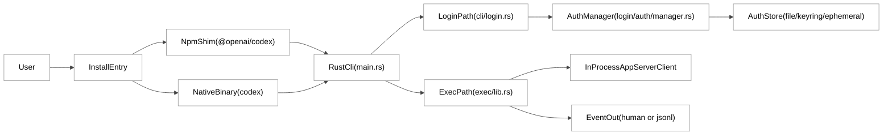
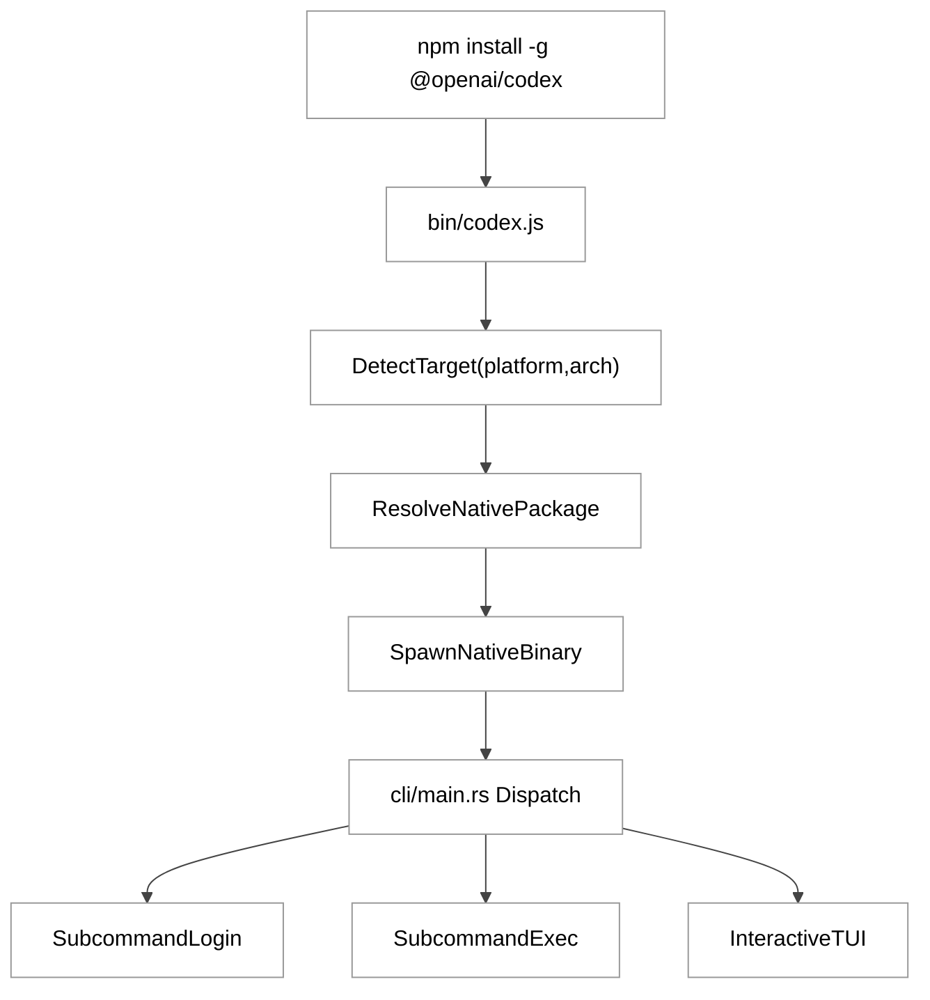
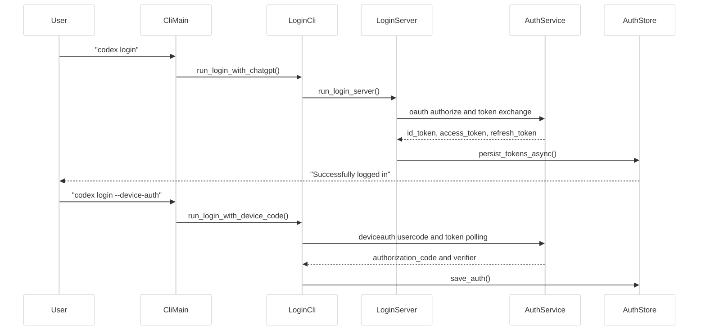
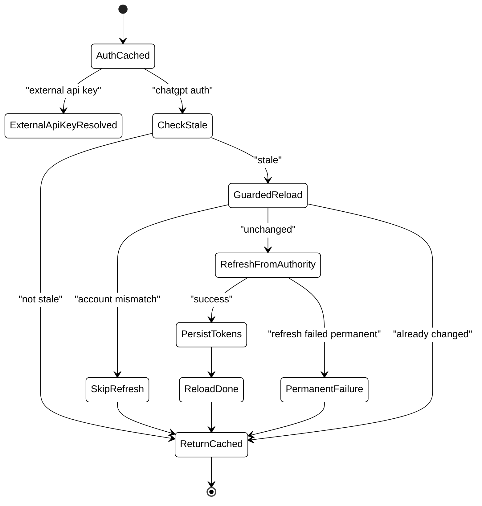
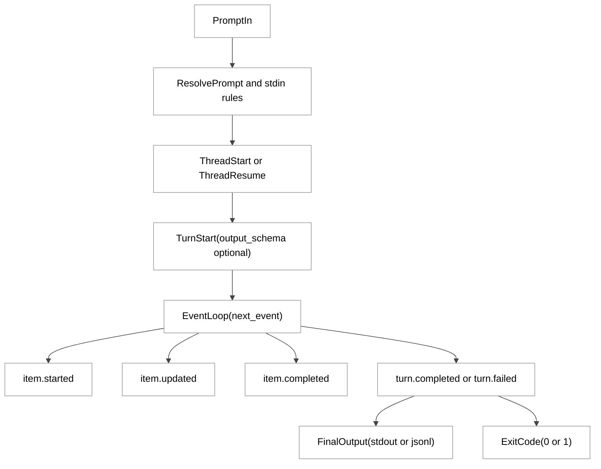

# 第 04 章：初级使用方法

## 引言

初级使用并不只是「装完就问模型」。从源码看，它实际上是一条工程链路：**安装分发 -> 登录落盘 -> 运行模式选择 -> 权限与沙箱 -> 事件输出**。本章按这条主线展开，先给出可在仓库里直接找到的源码引用，再做解读，最后才下结论。

源码基线：`/Users/hexiaonan/workspace/formless/refer/codex`（下文路径均以仓库根为参照，省略前缀）。

---

## 全网调研补充（近 12 个月）

### 1) 讨论主体分布：谁在认真讨论「初级使用」

按关键词 `Codex login getting started`、`Codex CLI install`、`Codex exec headless` 检索，近 12 个月的信息源大致可以分成四层：

- **官方一手**：OpenAI Developers 站点上的 CLI / Auth / Non-interactive 三组页面，以及仓库自带的 `docs/getting-started.md`、`docs/authentication.md`、`docs/exec.md` 三个「导流页」。
- **独立技术作者**：以 Simon Willison（术语澄清、产品边界）、Latent Space（工作流与组织实践）为代表，偏向澄清式写作而非教程。
- **社区讨论面**：Hacker News、GitHub Issues、Reddit，主要议题是默认安全策略、远程登录可用性、`exec` 与 TUI 行为差异。
- **中文内容面**：知乎、少数派、CSDN、掘金以「安装教程 / 排障」居多；从源码切入做机制级解读的比较少，机器之心层级的系统化拆解相对稀缺。

需要注意的是，社区里有相当一部分中文教程仍停留在更早版本的 CLI 语义上，与当前 Rust 实现存在偏差，下面 5.1 节会专门列出。

### 2) 社区共识

跨中英文信息源，初级使用层面相对稳定的共识有三点：

- `codex` 本质是「本地 agent」，模型在远端、执行在本机；
- 登录需要区分 ChatGPT 账户、API key、device code 三类入口，环境（图形 / 远程 / CI）会决定推荐哪一条；
- `codex exec` 的核心价值在自动化与流水线消费，而不是替代 TUI 的交互体验。

### 3) 主要争议与误解

**误解 A：`--full-auto` 仍是主流推荐参数。**  
许多旧教程沿用该参数。在当前 Rust 实现里它仍可被解析，但被显式标注为「兼容陷阱」并提示迁移到 `--sandbox workspace-write`（详见 3.3、5.1）。

**误解 B：`--approval-mode` 能完整表达非交互策略。**  
在 `exec` 路径里，运行时默认会把审批策略压成 `AskForApproval::Never`，同时由 sandbox 策略与 git 仓库检查补齐安全边界，单一参数并不能完整描述这套约束。

**误解 C：登录只是「拿 token」，与工作区无关。**  
源码里存在 workspace 相关的强制约束（`forced_login_method`、`forced_chatgpt_workspace_id`），不满足策略时可能触发自动登出与凭据清理。

**误解 D：输出 schema 一定只约束最终消息。**  
社区 issue 显示在工具 / MCP 联动场景中，schema 的作用边界不一定与「最终消息」完全重合，工程上更稳妥的态度是把它视作强约束请求，而不是 100% 终局保证。

---

## 七维分析

## 1. 本质是什么：初级使用不是教程页，而是一条可验证的执行链

在当前仓库里，`docs/getting-started.md`、`docs/authentication.md`、`docs/exec.md` 三个文件都极短，只是把读者导向 developers 站点的文档。这并不一定是「文档缺失」，更接近一个有意为之的取舍：**仓库内沉淀实现，外部站点沉淀使用说明**。

```md
// docs/getting-started.md:1
# Getting started with Codex CLI

For an overview of Codex CLI features, see [this documentation](https://developers.openai.com/codex/cli/features#running-in-interactive-mode).
```

```md
// docs/authentication.md:1
# Authentication

For information about Codex CLI authentication, see [this documentation](https://developers.openai.com/codex/auth).
```

```md
// docs/exec.md:1
# Non-interactive mode

For information about non-interactive mode, see [this documentation](https://developers.openai.com/codex/noninteractive).
```

可以观察到这三个 markdown 文件都只有 3 行有效内容（详见上方引用），真正落实「初级使用」的是三块代码实现：

1. **安装分发层**（`README.md` + `codex-cli/bin/codex.js`）
2. **登录认证层**（`codex-rs/cli/src/login.rs` + `codex-rs/login` crate）
3. **执行层**（`codex-rs/exec/src/cli.rs` + `codex-rs/exec/src/lib.rs`）

这三层在叙事上正好对应「装上 -> 登进去 -> 跑起来」三步，每一步都有失败路径与降级策略，下文分别展开。

### 定量快照（本章口径）

下列数字均通过 `wc -l` / `find` 在源码基线上现场核对：

- `codex-rs/**/Cargo.toml` 共可见 **120** 个 manifest（包含测试与示例 crate）。
- `codex-rs/Cargo.toml` 顶层 `[workspace]` 在 **第 2–116 行**列出主工作区成员清单（`members`）。
- 本章核心实现文件的实际行数：`cli/src/main.rs` **3439** 行、`cli/src/login.rs` **467** 行、`login/src/server.rs` **1530** 行、`login/src/auth/manager.rs` **1910** 行、`exec/src/lib.rs` **1877** 行、`exec/src/cli.rs` **311** 行。

可以从这些数字得到一个朴素判断：「初级使用」相关代码量并不少，且分布相对集中，意味着排障时不需要在整个仓库里漫无目的地搜索。

## 2. 核心问题和痛点：初学者真正会卡在哪

从源码分支与 issue 共识看，初级使用要解决的不是「会不会输命令」，而是五个工程痛点：

1. **跨平台安装一致性**：用户从 npm / Homebrew / shell 脚本进入，最终执行的二进制必须行为一致。
2. **登录方式碎片化**：浏览器 OAuth、device code、API key、access token 并存，且受环境限制（图形 / 远程 / CI 差异巨大）。
3. **无头环境可用性**：SSH 会话和 CI 容器都不能依赖 localhost 回调。
4. **安全默认值**：非交互运行如何避免误改仓库或执行越权命令。
5. **自动化可消费输出**：脚本如何稳定解析运行过程与最终结果，避免对人类可读文本做正则。

这些痛点在源码里不是抽象描述，而是直接写进了 CLI 参数、默认策略和错误分支：

```rust
// codex-rs/exec/src/cli.rs:52
/// Path to a JSON Schema file describing the model's final response shape.
#[arg(long = "output-schema", value_name = "FILE", global = true)]
pub output_schema: Option<PathBuf>,

/// Print events to stdout as JSONL.
#[arg(long = "json", alias = "experimental-json", default_value_t = false, global = true)]
pub json: bool,
```

```rust
// codex-rs/exec/src/lib.rs:406
// Default to never ask for approvals in headless mode. Feature flags can override.
approval_policy: Some(AskForApproval::Never),
```

```rust
// codex-rs/exec/src/lib.rs:674
if !skip_git_repo_check
    && !dangerously_bypass_approvals_and_sandbox
    && get_git_repo_root(&default_cwd).is_none()
{
    eprintln!("Not inside a trusted directory and --skip-git-repo-check was not specified.");
    std::process::exit(1);
}
```

可以看到，对应五个痛点的回应分别落在「显式 schema 参数 / JSONL 事件输出 / 默认 Never 审批 / repo 信任检查」上。换句话说，初级使用阶段的「安全感」很大程度上来自这些默认值，而不是来自用户写对了多少命令行参数。

---

## 3. 解决思路与方案：分层入口 + 明确默认值 + 显式降级

Codex 在「初级使用」上的工程策略，从源码看大致可以概括为三句话：

- **入口统一**：无论从 npm 还是从可执行文件进入，最终都进入同一个 Rust 主程序；
- **认证多路**：浏览器流、设备码流、密钥流并行，按环境与策略选择；
- **执行保守**：`exec` 默认无审批 + sandbox 约束 + repo 检查 + 可结构化输出。

下面的图 4-1 把三层关系画在一起。

### 图 4-1 初级使用总架构（入口到运行）

<div style="background:#ffffff !important; background-color:#ffffff !important; padding:16px; border-radius:8px; margin:16px 0;" bgcolor="#ffffff">



</div>

### 3.1 安装层：npm 只是启动器，不是核心运行时

仓库根 `README.md` 同时给出 shell、npm、brew 三种安装路径（详见 `README.md:23` 起的 Install 段落）。其中 npm 命令大致长这样：

```md
// README.md:30
```shell
# Install using npm
npm install -g @openai/codex
```
```

但 npm 包本身只暴露一个 JS 启动器：

```json
// codex-cli/package.json:1
{
  "name": "@openai/codex",
  "bin": { "codex": "bin/codex.js" },
  "engines": { "node": ">=16" }
}
```

`codex.js` 会先做平台三元组解析，再把请求映射到对应的原生包，最后 `spawn` 真正的二进制。当前映射表覆盖 6 组目标平台：

```javascript
// codex-cli/bin/codex.js:15
const PLATFORM_PACKAGE_BY_TARGET = {
  "x86_64-unknown-linux-musl": "@openai/codex-linux-x64",
  "aarch64-unknown-linux-musl": "@openai/codex-linux-arm64",
  "x86_64-apple-darwin":       "@openai/codex-darwin-x64",
  "aarch64-apple-darwin":      "@openai/codex-darwin-arm64",
  "x86_64-pc-windows-msvc":    "@openai/codex-win32-x64",
  "aarch64-pc-windows-msvc":   "@openai/codex-win32-arm64",
};
```

启动器还会同时考虑包内 `vendor/` 与本地 `vendor/` 两个二进制位置（见 `codex-cli/bin/codex.js:85` 起的 `resolveNativePackage`），并在缺失时给出指向 `@openai/codex@latest` 的更新提示。这段实现直接落实了一个对初学者很关键的事实：**用户看到的是 npm 命令，真正在跑的是 Rust binary**。也因此，排查行为问题时，应首先确认实际执行的是哪个二进制，而不是只看 `npm ls`。

### 图 4-2 安装与分发流程

<div style="background:#ffffff !important; background-color:#ffffff !important; padding:16px; border-radius:8px; margin:16px 0;" bgcolor="#ffffff">



</div>

### 3.2 登录层：一个命令，四条分支，三种存储

`cli/src/main.rs` 里 `Login` 子命令的参数定义比较克制：`--with-api-key`、`--with-access-token`、`--device-auth`，以及一个被标 `hide = true` 的兼容遗留项 `--api-key`，后者只剩「提示用户改用 `--with-api-key`」的作用。

```rust
// codex-rs/cli/src/main.rs:386
#[arg(long = "with-api-key", help = "Read the API key from stdin ...")]
with_api_key: bool,
#[arg(long = "with-access-token", help = "Read the access token from stdin ...")]
with_access_token: bool,
#[arg(long = "api-key", num_args = 0..=1, default_missing_value = "",
      help = "(deprecated) ...", hide = true)]
api_key: Option<String>,
#[arg(long = "device-auth")]
use_device_code: bool,
```

浏览器登录会启动本地回调服务，并在启动提示里**显式建议无头环境改走 device code**：

```rust
// codex-rs/cli/src/login.rs:110
fn print_login_server_start(actual_port: u16, auth_url: &str) {
    eprintln!(
        "Starting local login server on http://localhost:{actual_port}.\n\
         If your browser did not open, navigate to this URL to authenticate:\n\n{auth_url}\n\n\
         On a remote or headless machine? Use `codex login --device-auth` instead."
    );
}
```

device code 流则被拆成「申请设备码 -> 打印验证 URL 与 user code -> 完成轮询与持久化」三个步骤：

```rust
// codex-rs/login/src/device_code_auth.rs:224
pub async fn run_device_code_login(opts: ServerOptions) -> std::io::Result<()> {
    let device_code = request_device_code(&opts).await?;
    print_device_code_prompt(&device_code.verification_url, &device_code.user_code);
    complete_device_code_login(opts, device_code).await
}
```

再看登录服务器本体：默认端口 1455，不可用时回退 1457，并且在端口被占时会先尝试取消旧会话再退让。

```rust
// codex-rs/login/src/server.rs:54
const DEFAULT_ISSUER: &str = "https://auth.openai.com";
const DEFAULT_PORT: u16 = 1455;
// Keep in sync with the Codex CLI Hydra redirect URI allow-list.
const FALLBACK_PORT: u16 = 1457;
```

```rust
// codex-rs/login/src/server.rs:544
fn bind_server(port: u16) -> io::Result<Server> {
    // ... 占用时先尝试 send_cancel_request(port)，
    // 重试若干次后再切换到 FALLBACK_PORT，最大 MAX_ATTEMPTS = 10 ...
}
```

凭据存储则是四模式：

```rust
// codex-rs/login/src/auth/storage.rs:349
match mode {
    AuthCredentialsStoreMode::File => Arc::new(FileAuthStorage::new(codex_home)),
    AuthCredentialsStoreMode::Keyring => {
        Arc::new(KeyringAuthStorage::new(codex_home, keyring_store))
    }
    AuthCredentialsStoreMode::Auto => Arc::new(AutoAuthStorage::new(codex_home, keyring_store)),
    AuthCredentialsStoreMode::Ephemeral => Arc::new(EphemeralAuthStorage::new(codex_home)),
}
```

从这段实现可以读出一个偏保守的设计倾向：**默认存储模式不是单一文件**，而是给出 keyring、ephemeral 等多档可选，便于在 CI、共享主机等场景里规避明文落盘。

### 图 4-3 登录时序图（浏览器流 + 设备码流）

<div style="background:#ffffff !important; background-color:#ffffff !important; padding:16px; border-radius:8px; margin:16px 0;" bgcolor="#ffffff">



</div>

### 3.3 执行层：`exec` 的设计目标是「可脚本化 + 可恢复 + 可解析」

`exec` 子命令的参数在 `exec/src/cli.rs` 里非常聚焦：`--json`、`--output-schema`、`-o`/`--output-last-message`，以及 `resume` 子命令。同时保留了 `--full-auto` 的入参，但用 `hide = true` 与 `conflicts_with` 把它包成兼容陷阱：

```rust
// codex-rs/exec/src/cli.rs:42
/// Legacy compatibility trap for the removed `--full-auto` flag.
#[arg(
    long = "full-auto",
    hide = true,
    global = true,
    default_value_t = false,
    conflicts_with = "dangerously_bypass_approvals_and_sandbox"
)]
pub removed_full_auto: bool,
```

```rust
// codex-rs/exec/src/cli.rs:103
pub fn removed_full_auto_warning(&self) -> Option<&'static str> {
    if self.removed_full_auto {
        return Some(
            "warning: `--full-auto` is deprecated; use `--sandbox workspace-write` instead.",
        );
    }
    None
}
```

在运行时，输出 schema 会被加载并直接放入 `turn/start` 请求参数里：

```rust
// codex-rs/exec/src/lib.rs:1660
fn load_output_schema(path: Option<PathBuf>) -> Option<Value> {
    let path = path?;
    let schema_str = match std::fs::read_to_string(&path) { /* ... 出错即 exit(1) ... */ };
    match serde_json::from_str::<Value>(&schema_str) {
        Ok(value) => Some(value),
        Err(err) => { /* ... 给出文件路径与解析错误后 exit(1) ... */ }
    }
}
```

```rust
// codex-rs/exec/src/lib.rs:771
InitialOperation::UserTurn { items, output_schema } => {
    let response: TurnStartResponse = send_request_with_response(
        &client,
        ClientRequest::TurnStart {
            request_id: request_ids.next(),
            params: TurnStartParams {
                // ...
                output_schema,
                // ...
            },
        },
    ).await?;
}
```

集成测试也验证了 schema 的确进入了请求体的 `text.format` 字段：

```rust
// codex-rs/exec/tests/suite/output_schema.rs:45
let request = response_mock.single_request();
let payload: Value = request.body_json();
let text = payload.get("text").expect("request missing text field");
let format = text.get("format").expect("request missing text.format field");
assert_eq!(
    format,
    &serde_json::json!({
        "name": "codex_output_schema",
        "type": "json_schema",
        "strict": true,
        "schema": expected_schema,
    })
);
```

可以由此判断：当 `--output-schema` 被传入时，请求确实带上了 `strict: true` 的 schema 约束，但这只能证明「请求层做了强约束」，并不能直接证明「模型输出 100% 满足 schema」。后者属于模型行为范畴，工程上仍应做二次校验。

---

## 4. 实现细节关键点：关键代码路径 / 函数 / 数据流

本节按「新手第一次跑通链路」给出最短源码路径。

### 4.1 入口分发：从 `codex` 到 `Subcommand::Exec/Login`

```rust
// codex-rs/cli/src/main.rs:117
enum Subcommand {
    /// Run Codex non-interactively.
    #[clap(visible_alias = "e")]
    Exec(ExecCli),
    /// Run a code review non-interactively.
    Review(ReviewCommand),
    /// Manage login.
    Login(LoginCommand),
    /// Remove stored authentication credentials.
    Logout(LogoutCommand),
    /// Manage external MCP servers for Codex.
    Mcp(McpCli),
    // ...
}
```

```rust
// codex-rs/cli/src/main.rs:865
Some(Subcommand::Exec(mut exec_cli)) => {
    reject_remote_mode_for_subcommand(
        root_remote.as_deref(),
        root_remote_auth_token_env.as_deref(),
        "exec",
    )?;
    exec_cli.shared.inherit_exec_root_options(&interactive.shared);
    // ...
    codex_exec::run_main(exec_cli, arg0_paths.clone()).await?;
}
```

值得注意的是，分发前还会做 `reject_remote_mode_for_subcommand` 检查，意味着 `codex exec`、`codex review` 等子命令对「远程模式」是显式不兼容的，相关错误信息会直接来自这条路径，而不是更下游的运行时。

### 4.2 登录配置加载与日志落盘

`run_login_with_*` 系列先 `load_config_or_exit`，再初始化 `codex-login.log`，再执行对应认证分支。这段实现解释了一个常见现象：**登录失败时的可观测性主要来自这个独立日志文件**，而不是终端截图。

```rust
// codex-rs/cli/src/login.rs:49
fn init_login_file_logging(config: &Config) -> Option<WorkerGuard> {
    // ... 解析 log_dir，0o600 权限创建 codex-login.log，
    //     注册一个独立的 file_layer 用于 codex_cli / codex_core / codex_login ...
    let log_path = log_dir.join("codex-login.log");
    // ...
}
```

注释中也写明：CLI 登录路径**不复用 TUI 的完整 telemetry/feedback 初始化**，只复用一层窄的 file_layer。这是一种主动的解耦选择，避免让一次性命令背负交互式会话的全部日志栈。

### 4.3 AuthManager：认证优先级与刷新策略

`load_auth()` 的优先级直接决定「为什么我明明改了 auth.json，结果还走了别的凭据」：

1. `CODEX_API_KEY`（若启用）优先；
2. Ephemeral store（外部 ChatGPT auth 注入的内存凭据）；
3. `CODEX_ACCESS_TOKEN`（agent identity JWT）；
4. 配置存储（file / keyring / auto）。

```rust
// codex-rs/login/src/auth/manager.rs:732
async fn load_auth(
    codex_home: &Path,
    enable_codex_api_key_env: bool,
    auth_credentials_store_mode: AuthCredentialsStoreMode,
    chatgpt_base_url: Option<&str>,
) -> std::io::Result<Option<CodexAuth>> {
    if enable_codex_api_key_env && let Some(api_key) = read_codex_api_key_from_env() {
        return Ok(Some(CodexAuth::from_api_key(api_key.as_str())));
    }
    // 然后尝试 ephemeral_storage.load()
    // 然后尝试 read_codex_access_token_from_env()
    // 最后才落到 file/keyring/auto 持久化存储
}
```

刷新策略带账号一致性保护，而不是「盲刷」：

```rust
// codex-rs/login/src/auth/manager.rs:1682
pub async fn refresh_token(&self) -> Result<(), RefreshTokenError> {
    // ...
    match self.reload_if_account_id_matches(expected_account_id.as_deref()).await {
        ReloadOutcome::ReloadedChanged   => Ok(()), // 别人已经刷过
        ReloadOutcome::ReloadedNoChange  => self.refresh_token_from_authority_impl().await,
        ReloadOutcome::Skipped           => Err(/* REFRESH_TOKEN_ACCOUNT_MISMATCH_MESSAGE */),
    }
}
```

可以这样理解：当多个进程（CLI、TUI、app-server）共用同一个 `auth.json` 时，这个守卫减少了重复刷新和账号串号的概率，但它**只解决账号一致性问题**，并不能解决「凭据本身被破坏」的情况——后者仍然会落到上游错误分支。

### 图 4-4 AuthManager 刷新状态机

<div style="background:#ffffff !important; background-color:#ffffff !important; padding:16px; border-radius:8px; margin:16px 0;" bgcolor="#ffffff">



</div>

### 4.4 `exec` 输入处理：prompt 参数与 stdin 的组合规则

`exec` 对 stdin 的处理比较细：

- 只有 stdin：读取 stdin 作为 prompt；
- prompt + stdin：把 stdin 包成 `<stdin>` 附加块拼到 prompt 之后；
- `-`：强制 stdin 模式。

```rust
// codex-rs/exec/src/lib.rs:1832
fn resolve_root_prompt(prompt_arg: Option<String>) -> String {
    match prompt_arg {
        Some(prompt) if prompt != "-" => {
            if let Some(stdin_text) = read_prompt_from_stdin(StdinPromptBehavior::OptionalAppend) {
                prompt_with_stdin_context(&prompt, &stdin_text)
            } else {
                prompt
            }
        }
        maybe_dash => resolve_prompt(maybe_dash),
    }
}
```

这一规则对 CI 管道很关键，例如 `cat context.txt | codex exec "请总结上下文"` 时，上下文会作为附加块出现，而不会把 prompt 整个吞掉。这也意味着：脚本里要避免出现「同时通过 prompt 参数和 stdin 注入主指令」的写法，否则两段语义会被合并成一个 prompt，可能与预期不一致。

### 4.5 事件输出模型：为什么 `--json` 易于脚本消费

`exec_events.rs` 定义了一组稳定的事件枚举：`thread.started`、`turn.started`、`turn.completed`、`turn.failed`、`item.started`、`item.updated`、`item.completed`、`error`。

```rust
// codex-rs/exec/src/exec_events.rs:8
/// Top-level JSONL events emitted by codex exec
#[derive(Debug, Clone, Serialize, Deserialize, PartialEq, TS)]
#[serde(tag = "type")]
pub enum ThreadEvent {
    #[serde(rename = "thread.started")]   ThreadStarted(ThreadStartedEvent),
    #[serde(rename = "turn.started")]     TurnStarted(TurnStartedEvent),
    #[serde(rename = "turn.completed")]   TurnCompleted(TurnCompletedEvent),
    #[serde(rename = "turn.failed")]      TurnFailed(TurnFailedEvent),
    #[serde(rename = "item.started")]     ItemStarted(ItemStartedEvent),
    #[serde(rename = "item.updated")]     ItemUpdated(ItemUpdatedEvent),
    #[serde(rename = "item.completed")]   ItemCompleted(ItemCompletedEvent),
    #[serde(rename = "error")]            Error(ThreadErrorEvent),
}
```

这种「`#[serde(tag = "type")]` + 显式 rename」的写法把事件类型固化为字符串契约，自动化脚本就不必依赖易变的人类可读文本。配合 `--output-last-message` 把最终消息单独落到一个文件，可以进一步把「过程流」与「结果」分离：JSONL 喂给监控，最终消息喂给后续步骤。

### 图 4-5 `codex exec` 非交互事件流

<div style="background:#ffffff !important; background-color:#ffffff !important; padding:16px; border-radius:8px; margin:16px 0;" bgcolor="#ffffff">



</div>

补充一点：登录后的落盘结构由 `AuthDotJson` 与 `TokenData` 组成（见 `codex-rs/login/src/auth/storage.rs:31` 起的 `AuthDotJson` 与 `codex-rs/login/src/token_data.rs:10` 起的 `TokenData`），其中前者承载 `auth_mode`、`OPENAI_API_KEY`、`tokens`、`last_refresh`、`agent_identity` 五个字段，后者承载 `id_token` / `access_token` / `refresh_token` / `account_id`。后续 `refresh_token`、workspace 限制判断都依赖这两个结构。

---

## 5. 易错点和注意事项：从「能跑」到「稳定跑」

### 5.1 三类最常见上手坑

**1) 把旧参数当新语义。**  
旧教程里大量出现 `--full-auto` 与 `--approval-mode` 组合，但在当前 Rust CLI 中 `--full-auto` 已被处理为兼容告警（`exec/src/cli.rs:42` 起），同时与 `--dangerously-bypass-approvals-and-sandbox` 互斥。如果只复制粘贴旧命令，行为可能与教程描述不一致，建议改为 `--sandbox workspace-write` 与显式审批策略。

**2) 把登录当一次性动作。**  
登录不仅是「拿 token」，还受 `forced_login_method`、`forced_chatgpt_workspace_id`、`cli_auth_credentials_store_mode` 与若干环境变量优先级影响。当组织策略变更时，可能出现「上次能登，这次却被自动登出」的现象，原因往往在 `manager.rs` 里的 workspace 校验分支，而不是密码错误。

**3) 把 `exec` 当「简化 TUI」。**  
`exec` 是另一套输出契约：默认只保证最终输出与 JSONL 事件流，不保证你在终端看到与 TUI 完全一致的交互（如颜色、动画、审批弹窗）。把 `exec` 当 TUI 的「无窗口模式」使用，可能在审批策略、错误展示等细节上踩坑。

### 5.2 容易被忽视的环境变量与配置项

下面这些不属于「常用」但**经常解释疑难现象**：

- `CODEX_API_KEY`：若启用，会在 `load_auth` 第一步直接覆盖一切持久化凭据（`auth/manager.rs:739` 起）。
- `CODEX_ACCESS_TOKEN`：作为 agent identity JWT 注入，优先级位于 ephemeral 之后、persistent 之前。
- `RUST_LOG`：`docs/install.md:50` 起明确说 `codex exec` 默认 `RUST_LOG=error` 并内联打印，所以 `exec` 模式不需要去 `tail` 一个单独日志文件。
- `--ephemeral`：在 `exec/src/cli.rs:30` 起定义，会让一次运行不在磁盘上落 session，CI 场景建议默认开启。
- `--ignore-user-config` / `--ignore-rules`：分别在 `exec/src/cli.rs:34` 与 `:38` 起定义，常被忽视，但对「跨用户复现 bug」很有用。

### 5.3 可直接落地的「初级使用守则」

- 在本地首次上手，先跑 `codex login status` 验证当前 auth mode；
- 无头环境直接走 `codex login --device-auth`，不要先赌浏览器回调；
- 进入 CI 前固定三件套：`--json` + `--output-schema` + `-o/--output-last-message`；
- 非受信环境不要开 `dangerously-bypass-approvals-and-sandbox`（别名 `--yolo`），它会把 git repo check 一并跳过（见 `exec/src/lib.rs:672` 起的注释）；
- 流程依赖工作区策略时，先确认 `forced_chatgpt_workspace_id` 与登录账号 claim 一致，否则 `refresh_token` 路径可能返回 `ACCOUNT_MISMATCH`。

---

## 6. 竞品对比：初级使用层面 Codex 的位置

### 6.1 与 Claude Code / Opencode / Aider / Goose / Continue 的对齐点

需要先说明一个口径：这里讨论的是「初级使用层面的机制差异」，不涉及模型能力本身。基于源码可以直接观察到 Codex 的几个差异点：

1. **多入口收敛到一个 Rust 主运行时**：npm shim 最终 `spawn` native（见 3.1），减少了「不同安装方式行为不一致」的可能性。
2. **登录路径工程化较深**：device code、browser fallback、workspace 校验、四档存储模式同时存在（见 3.2 与 4.3）。
3. **`exec` 事件模型显式化**：JSONL 事件有稳定枚举类型（见 4.5），自动化脚本不必去解析人类可读文本。
4. **运行时默认值偏保守**：默认 `Never` 审批、强制 repo 检查、`--full-auto` 已转为兼容告警（见 2、3.3）。

对初学者的实际影响是：Codex 在「第一次成功跑通」的速度上未必最快，特别是当你不在 git 仓库里、又没注意默认安全策略时，它可能直接报错退出；但「跑通之后迁移到自动化」的路径相对清晰，因为事件模型与存储模式都被显式建模。

### 6.2 初级使用能力矩阵（只看机制，不看模型）

| 维度 | Codex（源码证据） | 社区替代方案（公开观察） |
|---|---|---|
| 安装分发 | npm shim + native binary，6 个目标平台映射（`codex-cli/bin/codex.js:15`） | 多数为单一 npm 包或单可执行文件 |
| 登录形态 | ChatGPT OAuth + API key + device code + agent identity JWT 并存 | 多为 API key 或 OAuth 单路径 |
| 凭据存储 | file / keyring / auto / ephemeral 四档（`auth/storage.rs:349`） | 多为单一 `~/.config/<tool>/config` |
| 非交互输出 | `--json` JSONL + `--output-schema` + `-o` 三件套 | 多为最终文本输出，schema 支持参差 |
| 安全默认值 | 默认 `Never` 审批 + sandbox 策略 + git repo check | 策略命名与默认值差异较大 |
| 远程 / 无头 | device code 流 + 启动提示显式推荐（`cli/login.rs:110`） | 多数依赖手动设置 API key |

需要说明的是，「社区替代方案」一列是基于公开文档与社区帖子的归纳，未必覆盖各自最新版本，仅作为机制层面的对照。

### 6.3 何时不应该选 Codex

也有几种场景，Codex 的「保守默认值」反而成本较高：

- 完全离线 / 自托管模型场景：浏览器登录与官方 OAuth 入口与之并不契合，往往需要切到 `CODEX_API_KEY` 或第三方 provider；
- 需要在非 git 目录跑一次性脚本：repo check 默认会拒绝，需显式 `--skip-git-repo-check`，对一次性玩具脚本是额外摩擦；
- 期望 CLI 完全无状态：四档存储和登录日志意味着仓库会在 `$CODEX_HOME` 下保留 auth 与日志文件，洁癖型场景需要显式 `--ephemeral`。

---

## 7. 仍存在的问题和缺陷：初级使用为什么仍会「看起来简单，实则脆弱」

### 7.1 文档层与实现层之间存在「信息折叠」

`docs/getting-started.md` / `docs/authentication.md` / `docs/exec.md` 都只有寥寥数行，真正的细节在外部 developers 站点和源码里。这种取舍降低了仓库内文档的维护成本，但客观上会放大「旧教程误导」的风险——读者经常在仓库里找不到对当前 CLI 行为的权威说明，转而引用过期博客。

### 7.2 参数兼容与社区教程存在时间差

`--full-auto` 已被废弃但仍可解析；`approval-mode` 的语义在不同子命令下不完全一致；旧 `--api-key`（直接传值）也保留为 `hide = true` 的兼容项（`cli/src/main.rs:398` 起）。这类「参数还在、语义已变」的兼容策略对老用户友好，但对新用户并不友好——他们看到一个旧命令能跑、就会以为这就是推荐用法。

### 7.3 结构化输出在真实流水线里仍需二次防御

尽管 `--output-schema` 已经有参数支持与测试覆盖（见 3.3），社区 issue 也反映：在工具 / MCP 联动较多的复杂上下文中，schema 的边界与最终消息并不总是严格重合。工程上更稳妥的做法是把 schema 视为**「强约束请求」而非「100% 终局保证」**，并在脚本侧再做一次 JSON Schema 校验或简单的字段断言。

### 7.4 多进程共享凭据时的隐性耦合

`AuthManager` 的 guarded reload + account-id match 策略（见 4.3）解决了「多进程同时刷新 token」时的相互覆盖问题，但它默认假设各进程共用同一 `$CODEX_HOME`。当用户同时在 IDE 插件、TUI、`exec` 三种场景里跑 Codex，且配置了不同的 `CODEX_HOME` 或不同的存储模式时，可能出现「某个入口看似登录成功，另一个入口仍报未登录」的现象，需要把 `codex login status` 和 `auth.json` 同时看才能定位。

### 7.5 安装路径分支较多，排障门槛不低

`codex-cli/bin/codex.js` 同时考虑包内 vendor、本地 vendor、不同包管理器（npm / bun）和不同二进制路径布局（`bin/` vs 旧版直接放包根）。这意味着「为什么我的 codex 跑的是另一个版本」往往不是用户疏忽，而是路径解析多分支的副作用，需要从 `which codex`、`realpath`、`npm root -g` 三处交叉验证。

---

## 小结

初级使用方法的本质不是「记住 5 条命令」，而是理解 Codex 在初级路径上的工程化取舍：**安装统一到 native 运行时、登录做成多路径状态机、`exec` 做成可脚本消费事件流，并用默认策略守住仓库安全**。

如果只从源码读这一章，可以带走三个偏稳健的判断：

- 「装上 -> 登进去 -> 跑起来」三步在仓库里都有明确入口与降级路径，遇到问题时优先沿源码定位，而不是套用旧教程；
- 默认值（`Never` 审批、repo check、JSONL 事件）是 Codex 在初级使用层面最值得复用的工程资产；
- 兼容层（`--full-auto`、`--api-key`）是双刃剑：它让历史脚本能跑，也让新用户更容易踩到「能跑但不推荐」的坑。
