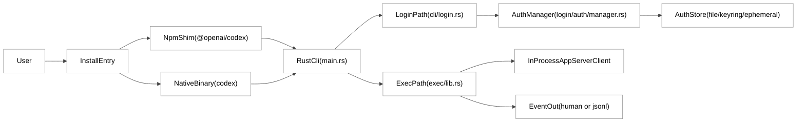
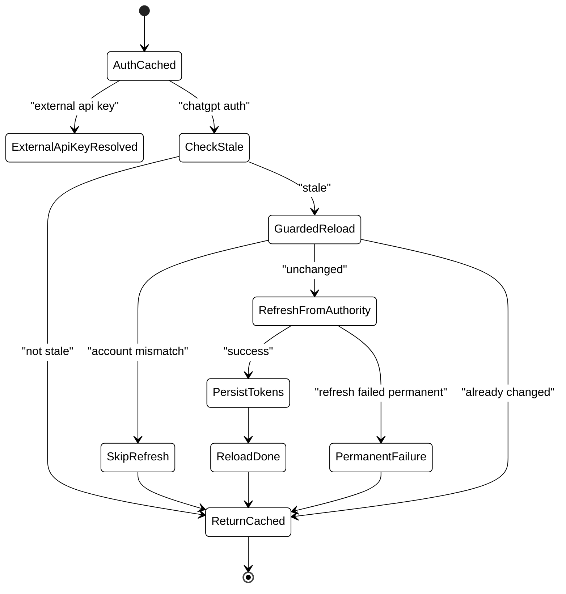
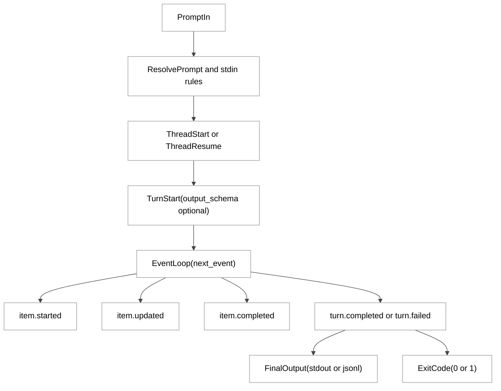

# 第 04 章：初级使用方法

## 引言

初级使用不是“装完就问模型”，而是一条工程链路：**安装分发 -> 登录落盘 -> 运行模式选择 -> 权限与沙箱 -> 事件输出**。

---

## 全网调研补充（近 12 个月）

### 1) 讨论主体分布：谁在认真讨论“初级使用”

按关键词 `Codex login getting started`、`Codex CLI install`、`Codex exec headless` 检索，近 12 个月信息源可以分成四层：

- **官方一手**：OpenAI Developers 文档（CLI/Auth/Non-interactive）、OpenAI Engineering（agent loop / app-server）。
- **高质量独立技术作者**：Simon Willison（术语澄清、产品边界）、Latent Space（工作流与组织实践）。
- **社区讨论面**：Hacker News（默认安全策略、可用性痛点、远程登录问题）。
- **中文内容面**：知乎、少数派、CSDN、掘金以“安装教程/排障”居多，深度机制少；机器之心在该主题上的系统化源码拆解相对稀缺。

### 2) 社区共识

跨中英文来源，初级使用层面的共识主要是三点：`codex` 本质是本地 agent；登录需要区分 ChatGPT/API key/device code；`codex exec` 的核心价值在自动化而非交互体验。

### 3) 主要争议与误解

**误解 A：`--full-auto` 仍是主流推荐参数。**  
很多教程沿用旧参数，但 Rust 实现里该参数已被标记为兼容陷阱并提示迁移到 `--sandbox workspace-write`。

**误解 B：`--approval-mode` 能完整表达非交互策略。**  
在 `exec` 路径里，运行时默认已经将审批策略压成 `AskForApproval::Never`，同时由沙箱策略与 git 仓库检查补充安全边界。

**误解 C：登录只是“拿 token”，与工作区无关。**  
源码中有显式 workspace 限制校验，不满足策略会强制登出并清理存储。

**误解 D：输出 schema 一定只约束最终消息。**  
社区 issue 显示在部分场景中存在约束外溢和工具联动差异，这在自动化流水线中会影响稳定性。

## 七维分析

## 1. 本质是什么：初级使用不是教程页，而是一条可验证的执行链

在当前仓库里，`docs/getting-started.md`、`docs/authentication.md`、`docs/exec.md` 都是“导流页”，把读者引到 developers 站点；这意味着“文档入口薄、运行实现厚”是一个明确架构选择，而不是缺失。

```md
// docs/getting-started.md:1
# Getting started with Codex CLI

For an overview of Codex CLI features, see [this documentation](https://developers.openai.com/codex/cli/features#running-in-interactive-mode).
```

`docs/authentication.md` 与 `docs/exec.md` 同样采用相同导流模式（分别指向 `developers.openai.com/codex/auth` 与 `developers.openai.com/codex/noninteractive`）。

而真正的初级使用主线，落在三块实现：

1. **安装分发层**（`README.md` + `codex-cli/bin/codex.js`）  
2. **登录认证层**（`cli/src/login.rs` + `codex-rs/login` crate）  
3. **执行层**（`exec/src/cli.rs` + `exec/src/lib.rs`）

这三层对应“装上 -> 登进去 -> 跑起来”三步，每一步都有失败路径和降级策略。

### 定量快照（本章口径）

- `codex-rs/**/Cargo.toml` 实际可见 **120** 个 manifest（包含测试与样例 crate）。
- `codex-rs/Cargo.toml` 的 workspace `members` 明确列出主工作区成员（`L2-L116`）。
- 本章核心实现文件行数：`main.rs` 3439、`cli/login.rs` 467、`server.rs` 1530、`manager.rs` 1910、`exec/lib.rs` 1877。

## 2. 核心问题和痛点：初学者真正会卡在哪

从源码和 issue 共识看，初级使用要解决的不是“会不会输命令”，而是五个工程痛点：

1. **跨平台安装一致性**：用户从 npm/Homebrew/shell 脚本进入，最终行为必须一致。
2. **登录方式碎片化**：浏览器 OAuth、device code、API key、access token 并存，且受环境限制。
3. **无头环境可用性**：SSH/CI 不能依赖 localhost 回调。
4. **安全默认值**：非交互运行如何避免误改仓库或越权命令。
5. **自动化可消费输出**：脚本如何稳定解析运行过程与最终结果。

这些痛点在源码里不是抽象概念，而是直接写进 CLI 参数、默认策略和错误分支。

```rust
// codex-rs/exec/src/cli.rs:52
/// Path to a JSON Schema file describing the model's final response shape.
#[arg(long = "output-schema", value_name = "FILE", global = true)]
pub output_schema: Option<PathBuf>,

/// Print events to stdout as JSONL.
#[arg(long = "json", alias = "experimental-json", default_value_t = false, global = true)]
pub json: bool,
```

```rust
// codex-rs/exec/src/lib.rs:406
// Default to never ask for approvals in headless mode.
approval_policy: Some(AskForApproval::Never),
```

```rust
// codex-rs/exec/src/lib.rs:674
if !skip_git_repo_check
    && !dangerously_bypass_approvals_and_sandbox
    && get_git_repo_root(&default_cwd).is_none()
{
    eprintln!("Not inside a trusted directory and --skip-git-repo-check was not specified.");
    std::process::exit(1);
}
```

---

## 3. 解决思路与方案：分层入口 + 明确默认值 + 显式降级

Codex 在“初级使用”上的工程策略可以概括为三句话：

- **入口统一**：无论从 npm 还是可执行文件，最终都进同一 Rust 主程序；
- **认证多路**：浏览器流、设备码流、密钥流并行，按环境选择；
- **执行保守**：`exec` 默认无审批 + 沙箱约束 + repo 检查 + 可结构化输出。

### 图 4-1 初级使用总架构（入口到运行）

<div style="background:#ffffff !important; background-color:#ffffff !important; padding:16px; border-radius:8px; margin:16px 0;" bgcolor="#ffffff">



</div>

### 3.1 安装层：npm 只是启动器，不是核心运行时

根 README 同时给出 shell、npm、brew 三种安装路径：

```md
// README.md:31
npm install -g @openai/codex
```

但 npm 包本身只暴露一个 JS 启动器：

```json
// codex-cli/package.json:2
{
  "name": "@openai/codex",
  "bin": {
    "codex": "bin/codex.js"
  },
  "engines": {
    "node": ">=16"
  }
}
```

`codex.js` 会先解析平台三元组，再映射到原生包并 `spawn` 二进制。当前映射覆盖 6 组目标平台：

`codex-cli/bin/codex.js` 中 `PLATFORM_PACKAGE_BY_TARGET` 映射了 6 组平台三元组（`codex-cli/bin/codex.js:15` 到 `:22`）。

这段实现直接决定了一个初级使用结论：**用户看到的是 npm 命令，真正跑起来的是 Rust binary。**

### 图 4-2 安装与分发流程

<div style="background:#ffffff !important; background-color:#ffffff !important; padding:16px; border-radius:8px; margin:16px 0;" bgcolor="#ffffff">


</div>

### 3.2 登录层：一个命令，四条分支，三种存储

`cli/src/main.rs` 里 `Login` 子命令参数非常明确：`--with-api-key`、`--with-access-token`、`--device-auth`、`status`。并且已经拒绝旧式 `--api-key` 直接传值。

```rust
// codex-rs/cli/src/main.rs:386
#[arg(long = "with-api-key")]
with_api_key: bool,
#[arg(long = "with-access-token")]
with_access_token: bool,
#[arg(long = "device-auth")]
use_device_code: bool,
```

在 `cli/src/login.rs` 中，浏览器登录会启动本地回调服务，并显式给出无头环境建议：

```rust
// codex-rs/cli/src/login.rs:110
fn print_login_server_start(actual_port: u16, auth_url: &str) {
    eprintln!(
        "... On a remote or headless machine? Use `codex login --device-auth` instead."
    );
}
```

而 device code 流在 `device_code_auth.rs` 里分为“申请设备码 -> 轮询 token -> code exchange -> workspace 校验 -> 持久化”：

```rust
// codex-rs/login/src/device_code_auth.rs:224
pub async fn run_device_code_login(opts: ServerOptions) -> std::io::Result<()> {
    let device_code = request_device_code(&opts).await?;
    print_device_code_prompt(&device_code.verification_url, &device_code.user_code);
    complete_device_code_login(opts, device_code).await
}
```

再看登录服务器本体：默认端口 1455，不可用时回退 1457，并且会先尝试取消旧会话。

```rust
// codex-rs/login/src/server.rs:55
const DEFAULT_PORT: u16 = 1455;
const FALLBACK_PORT: u16 = 1457;
```

```rust
// codex-rs/login/src/server.rs:544
fn bind_server(port: u16) -> io::Result<Server> {
    ...
    if attempts >= MAX_ATTEMPTS {
        if port == DEFAULT_PORT && !using_fallback_port {
            bind_address = fallback_bind_address.clone();
            ...
        }
    }
}
```

最后，凭据存储不是单实现，而是四模式：

```rust
// codex-rs/login/src/auth/storage.rs:349
match mode {
    AuthCredentialsStoreMode::File => Arc::new(FileAuthStorage::new(codex_home)),
    AuthCredentialsStoreMode::Keyring => Arc::new(KeyringAuthStorage::new(codex_home, keyring_store)),
    AuthCredentialsStoreMode::Auto => Arc::new(AutoAuthStorage::new(codex_home, keyring_store)),
    AuthCredentialsStoreMode::Ephemeral => Arc::new(EphemeralAuthStorage::new(codex_home)),
}
```

### 图 4-3 登录时序图（浏览器流 + 设备码流）

<div style="background:#ffffff !important; background-color:#ffffff !important; padding:16px; border-radius:8px; margin:16px 0;" bgcolor="#ffffff">


</div>

### 3.3 执行层：`exec` 的设计目标是“可脚本化 + 可恢复 + 可解析”

`exec` 子命令参数在 `exec/src/cli.rs` 里很聚焦：`--json`、`--output-schema`、`-o`、`resume`。同时保留 `--full-auto` 但明确废弃提示。

```rust
// codex-rs/exec/src/cli.rs:42
/// Legacy compatibility trap for the removed `--full-auto` flag.
#[arg(long = "full-auto", hide = true, ...)]
pub removed_full_auto: bool,
```

```rust
// codex-rs/exec/src/cli.rs:103
pub fn removed_full_auto_warning(&self) -> Option<&'static str> {
    if self.removed_full_auto {
        return Some("warning: `--full-auto` is deprecated; use `--sandbox workspace-write` instead.");
    }
}
```

在运行时，输出 schema 会被加载并直接放入 `turn/start` 请求参数：

```rust
// codex-rs/exec/src/lib.rs:1660
fn load_output_schema(path: Option<PathBuf>) -> Option<Value> {
    let path = path?;
    let schema_str = std::fs::read_to_string(&path) ...;
    match serde_json::from_str::<Value>(&schema_str) {
        Ok(value) => Some(value),
        Err(err) => { ... std::process::exit(1); }
    }
}
```

```rust
// codex-rs/exec/src/lib.rs:771
InitialOperation::UserTurn { items, output_schema } => {
    ClientRequest::TurnStart {
        ...
        params: TurnStartParams {
            ...
            output_schema,
            ...
        }
    }
}
```

测试也验证了 schema 会进入请求体（`codex-rs/exec/tests/suite/output_schema.rs:37` 到 `:58`）。

---

## 4. 实现细节关键点：关键代码路径 / 函数 / 数据流

本节按“新手第一次跑通链路”给出最短源码路径。

### 4.1 入口分发：从 `codex` 到 `Subcommand::Exec/Login`

```rust
// codex-rs/cli/src/main.rs:117
enum Subcommand {
    Exec(ExecCli),
    Review(ReviewCommand),
    Login(LoginCommand),
    Logout(LogoutCommand),
    ...
}
```

```rust
// codex-rs/cli/src/main.rs:865
Some(Subcommand::Exec(mut exec_cli)) => {
    ...
    codex_exec::run_main(exec_cli, arg0_paths.clone()).await?;
}
...
Some(Subcommand::Login(mut login_cli)) => {
    ...
    run_login_with_chatgpt(login_cli.config_overrides).await;
}
```

### 4.2 登录配置加载与日志落盘

`run_login_with_*` 系列都先 `load_config_or_exit`，再初始化 `codex-login.log`，再执行对应认证分支。  
这就是为什么登录失败排查可以要求用户上传专门日志，而不是只看终端截图。

```rust
// codex-rs/cli/src/login.rs:49
fn init_login_file_logging(config: &Config) -> Option<WorkerGuard> {
    ...
    let log_path = log_dir.join("codex-login.log");
    ...
}
```

### 4.3 AuthManager：认证优先级与刷新策略

`load_auth()` 的优先级非常关键，直接决定“为什么我明明改了 auth.json 结果还走了别的凭据”：

1. `CODEX_API_KEY`（若启用）优先；  
2. Ephemeral store；  
3. `CODEX_ACCESS_TOKEN`；  
4. 配置存储（file/keyring/auto）。

```rust
// codex-rs/login/src/auth/manager.rs:732
async fn load_auth(...) -> std::io::Result<Option<CodexAuth>> {
    if enable_codex_api_key_env && let Some(api_key) = read_codex_api_key_from_env() {
        return Ok(Some(CodexAuth::from_api_key(api_key.as_str())));
    }
    ...
    if let Some(agent_identity) = read_codex_access_token_from_env() {
        return CodexAuth::from_agent_identity_jwt(&agent_identity, chatgpt_base_url).await.map(Some);
    }
    ...
}
```

刷新策略也不是“盲刷”，而是带账号一致性保护：

```rust
// codex-rs/login/src/auth/manager.rs:1677
pub async fn refresh_token(&self) -> Result<(), RefreshTokenError> {
    ...
    match self.reload_if_account_id_matches(expected_account_id.as_deref()).await {
        ReloadOutcome::ReloadedChanged => Ok(()),
        ReloadOutcome::ReloadedNoChange => self.refresh_token_from_authority_impl().await,
        ReloadOutcome::Skipped => Err(...REFRESH_TOKEN_ACCOUNT_MISMATCH_MESSAGE...)
    }
}
```

### 图 4-4 AuthManager 刷新状态机

<div style="background:#ffffff !important; background-color:#ffffff !important; padding:16px; border-radius:8px; margin:16px 0;" bgcolor="#ffffff">



</div>

### 4.4 `exec` 输入处理：prompt 参数与 stdin 的组合规则

`exec` 对 stdin 处理很细：  
- 只有 stdin：读取 stdin 作为 prompt；  
- prompt + stdin：把 stdin 包成 `<stdin>` 附加块；  
- `-`：强制 stdin 模式。  
这对 CI 管道很关键（避免把上下文错当主 prompt）。

```rust
// codex-rs/exec/src/lib.rs:1832
fn resolve_root_prompt(prompt_arg: Option<String>) -> String {
    match prompt_arg {
        Some(prompt) if prompt != "-" => {
            if let Some(stdin_text) = read_prompt_from_stdin(StdinPromptBehavior::OptionalAppend) {
                prompt_with_stdin_context(&prompt, &stdin_text)
            } else {
                prompt
            }
        }
        maybe_dash => resolve_prompt(maybe_dash),
    }
}
```

### 4.5 事件输出模型：为何 `--json` 易于脚本消费

`exec_events.rs` 定义了稳定的事件枚举：`thread.started`、`turn.started`、`item.*`、`error`。  
这使自动化脚本不必依赖易变的人类可读文本。

```rust
// codex-rs/exec/src/exec_events.rs:8
#[serde(tag = "type")]
pub enum ThreadEvent {
    #[serde(rename = "thread.started")]
    ThreadStarted(ThreadStartedEvent),
    #[serde(rename = "turn.started")]
    TurnStarted(TurnStartedEvent),
    #[serde(rename = "turn.completed")]
    TurnCompleted(TurnCompletedEvent),
    ...
}
```

### 图 4-5 `codex exec` 非交互事件流

<div style="background:#ffffff !important; background-color:#ffffff !important; padding:16px; border-radius:8px; margin:16px 0;" bgcolor="#ffffff">



</div>

补充一点：登录后的落盘结构由 `AuthDotJson` 和 `TokenData` 组成（`codex-rs/login/src/auth/storage.rs:31`，`codex-rs/login/src/token_data.rs:10`），后续 `refresh`、`workspace` 限制判断都依赖这两个结构。

---

## 5. 易错点和注意事项：从“能跑”到“稳定跑”

### 5.1 三类最常见上手坑

1. **把旧参数当新语义**  
旧文大量出现 `--full-auto` 与 `--approval-mode` 组合，但在当前 Rust CLI 中，`--full-auto` 已是兼容告警项，真实推荐迁移到 `--sandbox workspace-write` 与明确审批策略。

2. **把登录当一次性动作**  
登录不仅是拿 token，还受 `forced_login_method`、`forced_chatgpt_workspace_id`、存储模式和环境变量优先级影响；策略变更后可能触发自动登出。

3. **把 `exec` 当“简化 TUI”**  
`exec` 是另一套输出契约：默认只保证最终输出和事件流，不保证你在终端看到与 TUI 相同的交互体验。

### 5.2 可直接落地的“初级使用守则”

- 在本地首次上手，先跑 `codex login status` 验证当前 auth mode。  
- 无头环境直接走 `codex login --device-auth`，不要先赌浏览器回调。  
- 进入 CI 前固定三件套：`--json` + `--output-schema` + `-o`。  
- 非受信环境不要开 `dangerously-bypass-approvals-and-sandbox`（别名 `--yolo`）。  
- 若流程依赖工作区策略，先确认 workspace/account claim 与限制一致。

---

## 6. 竞品对比：初级使用层面 Codex 的位置

### 6.1 与 Claude Code / Opencode / Aider / Goose / Continue 的对齐点

Codex 在初级使用层面的差异点（由源码可证）：

1. **多入口统一到一个 Rust 主运行时**（npm shim 最终 `spawn` native）。
2. **登录路径工程化较深**（device code、browser fallback、workspace 校验、存储模式）。
3. **`exec` 事件模型明确**（JSONL 事件有稳定类型定义）。
4. **配置与策略约束更强**（repo check、forced login policy、workspace restriction）。

对新手的实际影响是：Codex“第一次成功”不一定最快，但“成功后迁移到自动化”路径更清晰。

### 6.2 初级使用能力矩阵（只看机制，不看模型）

| 维度 | Codex（源码证据） | 社区替代方案（观察） |
|---|---|---|
| 安装分发 | npm shim + native binary | npm 或单二进制 |
| 登录形态 | ChatGPT / API key / device code | 多为 API key + OAuth |
| 非交互输出 | `--json` + `--output-schema` | 仅最终文本的情况更多 |
| 安全默认值 | 默认审批收敛 + sandbox + repo check | 策略命名与默认值分散 |

---

## 7. 仍存在的问题和缺陷：初级使用为何仍会“看起来简单，实则脆弱”

### 7.1 文档层与实现层有“信息折叠”

`docs/getting-started.md` / `docs/authentication.md` / `docs/exec.md` 都非常短，真正细节在外部文档和源码里。  
这降低了仓库文档维护成本，但也放大了“旧教程误导”风险。

### 7.2 参数兼容与社区教程存在时间差

`--full-auto` 已废弃但仍被大量教程引用；`approval-mode` 的语义在不同子命令下并不完全一致。  
这类“参数还在、语义已变”的兼容策略，对新用户并不友好。

### 7.3 结构化输出在真实流水线仍需二次防御

尽管 `--output-schema` 已有测试与参数支持，社区 issue 仍显示在复杂上下文（尤其工具/MCP 参与）下存在行为边界。  
工程上应把 schema 视作“强约束请求”，而不是“100% 终局保证”。

---

## 小结

初级使用方法的本质不是“记住 5 条命令”，而是理解 Codex 对初级路径的工程化取舍：  
**安装统一到 native 运行时、登录做成多路径状态机、exec 做成可脚本消费事件流，并用默认策略保护仓库安全**。  

