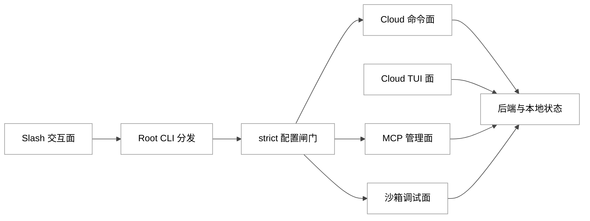
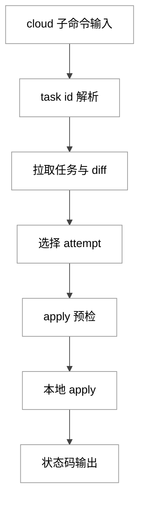
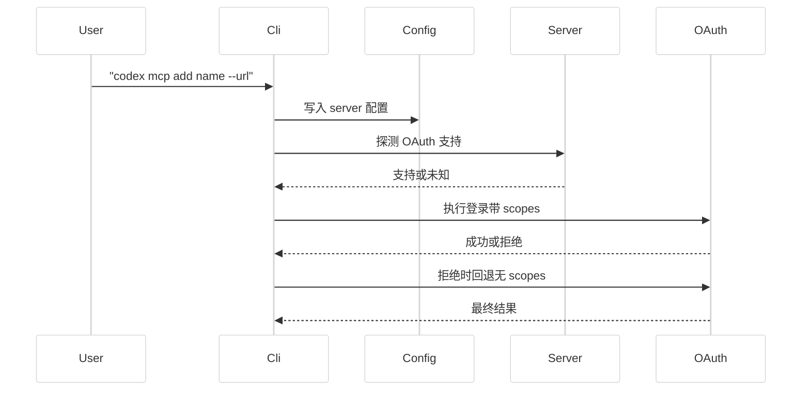
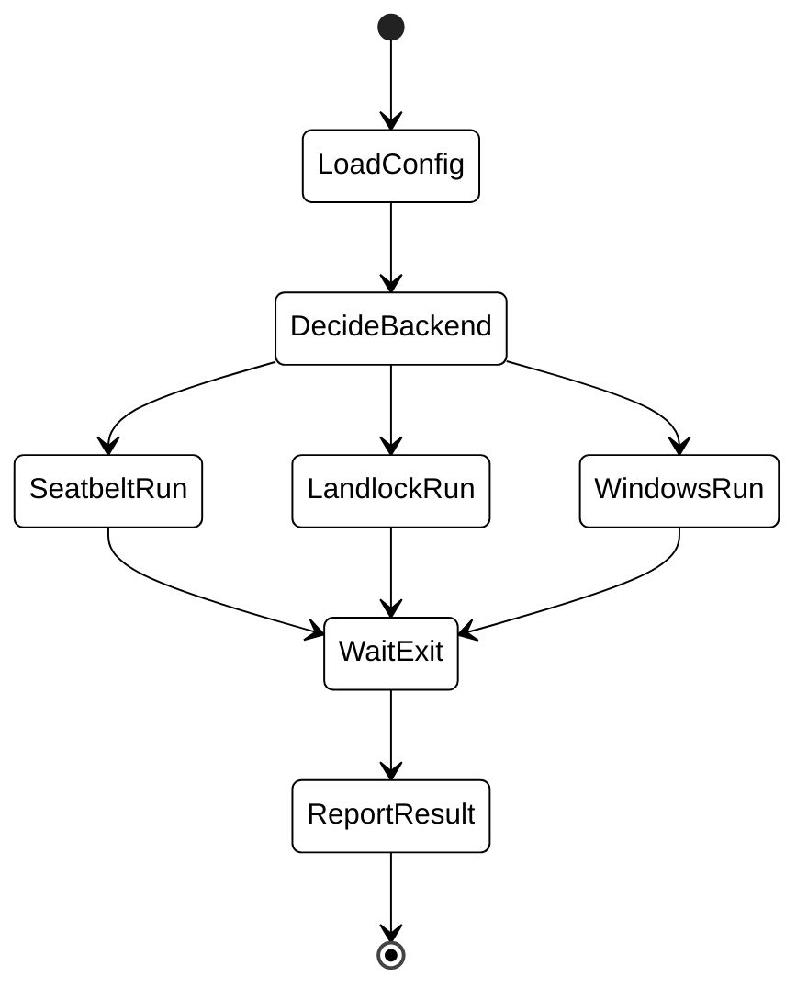
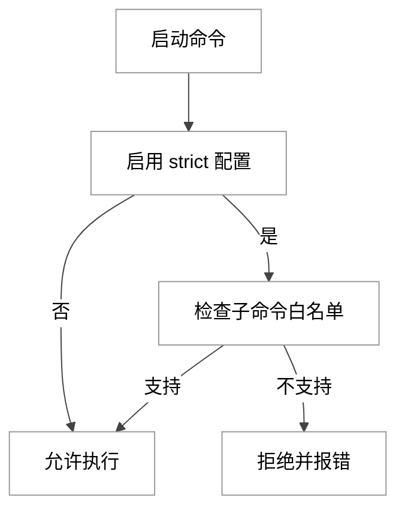
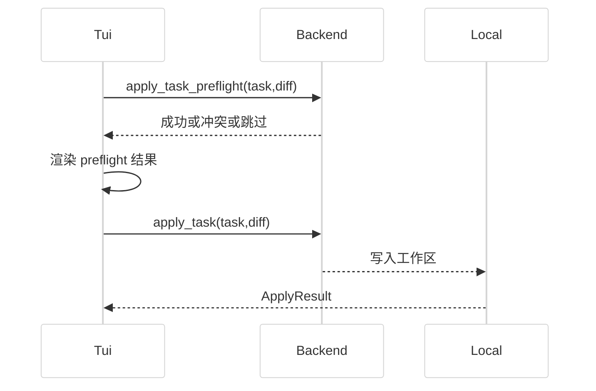

# 第 05 章 高级使用方法

## 引言

如果把第 04 章定义为"能把 Codex 跑起来"，那第 05 章要回答的是"如何把 Codex 用成工程系统"。  
在当前源码基线中，"高级使用"并不是几个零散命令，而是四条可以组合的能力链：**多入口分发**（`codex-rs/cli/src/main.rs`）、**云端任务编排**（`codex-rs/cloud-tasks/src/lib.rs`）、**MCP 扩展接入**（`codex-rs/cli/src/mcp_cmd.rs`）、**沙箱可调试与跨平台验证**（`codex-rs/cli/src/debug_sandbox.rs`）。  
这四条链路再加上 slash command 的交互入口（`docs/slash_commands.md`），构成了"高级使用方法"的可见边界。是否还存在隐藏入口（例如 `Hide = true` 的内部命令），我们会在 4.1 节单独标注。

先给一个可复核的本章定量快照（核对方法：`wc -l` + 直接读取 `codex-rs/Cargo.toml`）：

| 指标 | 数值 | 证据 |
|---|---:|---|
| `codex-rs` workspace members | 113 | `codex-rs/Cargo.toml:2`–`codex-rs/Cargo.toml:116`（数组内 113 项） |
| `codex-rs` 下 `Cargo.toml` 清单数 | 120 | `find codex-rs -name Cargo.toml \| wc -l` |
| `main.rs` 行数 | 3439 | `codex-rs/cli/src/main.rs` |
| `cloud-tasks/src/lib.rs` 行数 | 2399 | `codex-rs/cloud-tasks/src/lib.rs` |
| `mcp_cmd.rs` 行数 | 989 | `codex-rs/cli/src/mcp_cmd.rs` |
| `debug_sandbox.rs` 行数 | 1158 | `codex-rs/cli/src/debug_sandbox.rs` |
| `docs/slash_commands.md` 行数 | 3 | `docs/slash_commands.md`（仅外链） |
| 核心文件合计规模 | 7988 行 | 上述 5 文件求和 |

从这个量级可以看到一个事实判断：所谓"高级使用"，在 Codex 仓内并不只是 UI 菜单项，更接近一个小型运行时的操作学。不过这并不等于它"远超同类"——它只是把不同执行面的状态机显式化了，第 6 节会与竞品做更克制的比较。

---

## 全网调研补充（近 12 个月）

> 说明：本小节是"外部认知基线"，用于识别社区共识、争议与盲区；后续结论仍以源码为主证据。

### 1) 权威来源分布：谁在定义叙事

过去 12 个月，关于本章主题（cloud tasks / plugin marketplace / MCP / sandbox debug / voice realtime）的信息密度，主要集中在以下层级：

- OpenAI 官方：`Introducing Codex`、`Unlocking the Codex harness`、CLI 文档与 MCP 文档。
- 一线观察者：Simon Willison（尤其是 Codex 与 MCP 的上下文成本讨论）。
- 开发者社区：Hacker News（并行任务、稳定性、审批策略的实战争论）。
- 行业播客：Latent Space（把焦点放在 harness 与 workflow，而非"只看模型分数"）。
- 中文社区：知乎/少数派/CSDN/掘金在"安装与排障"上内容较多，深度机制拆解相对偏少。

代表入口：

- [Introducing Codex](https://openai.com/index/introducing-codex/)
- [Unlocking the Codex harness](https://openai.com/index/unlocking-the-codex-harness/)
- [Codex CLI Slash Commands](https://developers.openai.com/codex/cli/slash-commands)
- [MCP Servers 文档](https://developers.openai.com/codex/cli/mcp/)
- [Simon Willison 2025 年度总结](https://simonwillison.net/2025/Dec/31/the-year-in-llms/)
- [Hacker News: A Research Preview of Codex](https://news.ycombinator.com/item?id=44006345)

### 2) 社区共识

围绕本章主题，跨来源重复出现的共识有四条：

1. **Cloud Tasks 的核心价值是并行与隔离**：把"长任务耗时"从本地会话中解耦。
2. **MCP 已经成为 coding agent 的基础能力**：不是锦上添花，而是生态接入底座。
3. **插件化正在从"工具清单"走向"工作流打包"**：技能 + 连接器 + MCP 组合是主流方向。
4. **高级使用的主成本在治理，不在命令记忆**：权限、审批、配置漂移、环境一致性才是真问题。

### 3) 主要争议与常见误解

- 误解 A："Codex Cloud 一直是全程断网"。  
  现实：官方文档已明确 setup 阶段可联网，agent 阶段默认关闭但可配置为有限/开放访问。
- 误解 B："MCP = 插件"。  
  现实：插件可以打包 MCP，但两者不是同层概念，MCP 更偏协议面，插件更偏分发与能力组合面。
- 误解 C："开了 sandbox 就等于生产安全"。  
  现实：安全是 sandbox + approval + execpolicy + network policy 的组合，而非单一开关。
- 误解 D："voice_transcription 与 realtime_conversation 是同一功能"。  
  现实：社区代码演进表明旧转写路径与 realtime 对话路径不是同一条链路，组合关系仍在调整中。

### 4) 盲区：社区还没系统讲透什么

从本章主题看，至少有三块尚未被系统讨论：

- **Cloud 任务的 attempt 语义与本地 apply 冲突边界**（尤其是 sibling attempts）。
- **`--strict-config` 与高级子命令的兼容矩阵**（很多团队在这里踩"命令可用性"坑）。
- **debug sandbox 的"默认回退逻辑"**（legacy 配置默认 read-only 的历史兼容分支）。

这些盲区，恰好对应源码中最"工程化"也最不显眼的几段实现。

---

## 七维分析

## 1. 本质是什么

高级使用方法的本质，可以从源码事实出发先做一次描述，再做一次判断：

**事实**：`codex-rs/cli/src/main.rs:116` 起始的 `Subcommand` 枚举定义了一个统一外壳；同一外壳之下，`Cloud`、`Mcp`、`Sandbox`、`Debug`、`McpServer` 等子命令分别对应不同的执行面（本地会话、云任务、协议扩展、沙箱调试、协议服务）。

**判断**：所谓"高级使用方法"，可以理解为 **在同一 CLI 外壳下，选择并编排不同执行面的能力**——而不是简单地"多记几个命令"。

证据从 `Subcommand` 枚举可以直接看到（含 macOS/Windows 专属变体时共 24 个分支，其他平台 23 个）：

```rust
// codex-rs/cli/src/main.rs:116
#[derive(Debug, clap::Subcommand)]
enum Subcommand {
    Exec(ExecCli),
    Review(ReviewCommand),
    Login(LoginCommand),
    Logout(LogoutCommand),
    Mcp(McpCli),
    Plugin(PluginCli),
    McpServer(McpServerCommand),
    AppServer(AppServerCommand),
    RemoteControl(RemoteControlCommand),
    #[cfg(any(target_os = "macos", target_os = "windows"))]
    App(app_cmd::AppCommand),
    Completion(CompletionCommand),
    Update,
    Doctor(DoctorCommand),
    Sandbox(HostSandboxArgs),
    Debug(DebugCommand),
    Execpolicy(ExecpolicyCommand),
    Apply(ApplyCommand),
    Resume(ResumeCommand),
    Fork(ForkCommand),
    #[clap(name = "cloud", alias = "cloud-tasks")]
    Cloud(CloudTasksCli),
    ResponsesApiProxy(ResponsesApiProxyArgs),
    StdioToUds(StdioToUdsCommand),
    ExecServer(ExecServerCommand),
    Features(FeaturesCli),
}
```

值得注意的是，其中若干分支带 `#[clap(hide = true)]`（如 `Execpolicy`、`ResponsesApiProxy`、`StdioToUds`），它们对最终用户隐藏但确实存在。从"读源码理解能力边界"的角度，把它们与 `Cloud/Mcp/Sandbox/Debug` 并列归类，比仅看 `--help` 输出更准确。

同时，`docs/slash_commands.md` 在仓内只剩三行外链：

```markdown
// docs/slash_commands.md:1
# Slash commands

For an overview of Codex CLI slash commands, see [this documentation](https://developers.openai.com/codex/cli/slash-commands).
```

这意味着高级使用的文档策略本身也在改变：**仓内只保留入口索引，详细命令说明转向开发者站点的实时文档**。对读者来说，这是一个不一定理想的设计——它降低了仓内的离线可读性，但也避免了文档与在线产品的版本漂移；功过取决于团队是否能稳定访问外网。无论判断如何，结果是阅读高级使用相关内容时必须接受"源码 + 在线文档"协作的现实。

把上面拼起来，本章对"本质"的回答可以收束为一句：高级使用是**多执行面 + 统一外壳 + 在线文档**的组合形态，理解了这层结构，命令本身只是表层。

---

## 2. 核心问题和痛点

高级使用要解决的，不是"功能有没有"，而是以下四个工程痛点：

1. **入口多导致行为漂移风险**：同一个 root flag（如 `--strict-config`）在不同子命令支持度并不一致。
2. **云端任务与本地状态衔接困难**：task id、attempt、diff、apply 都需要可恢复且可验证。
3. **MCP 接入"启动成功"不等于"可持续可运维"**：OAuth、认证、配置持久化、server 命名都是可能失败点。
4. **沙箱调试跨平台复杂**：macOS/Linux/Windows 的底层机制差异很大，但 CLI 体验要保持一致。

这些痛点在源码里都有显式分支，不只是"文档警告"。例如 root `--strict-config` 的拒绝路径是硬编码的，而不是软提示：

```rust
// codex-rs/cli/src/main.rs:1808
fn reject_root_strict_config_for_subcommand(
    strict_config: bool,
    subcommand: &Option<Subcommand>,
) -> anyhow::Result<()> {
    if !strict_config {
        return Ok(());
    }

    match unsupported_subcommand_name_for_strict_config(subcommand) {
        Some(subcommand_name) => {
            reject_strict_config_for_unsupported_subcommand(strict_config, subcommand_name)
        }
        None => Ok(()),
    }
}
```

`cloud` 与 `mcp` 都被列入"不支持 root strict config 透传"的集合：

```rust
// codex-rs/cli/src/main.rs:1853
Some(Subcommand::Mcp(_)) => Some("mcp"),
Some(Subcommand::Plugin(_)) => Some("plugin"),
// ...
Some(Subcommand::Cloud(_)) => Some("cloud"),
Some(Subcommand::Sandbox(_)) => Some("sandbox"),
Some(Subcommand::Debug(_)) => Some("debug"),
```

这类实现说明：高级使用的第一原则不是"记命令"，而是**理解命令边界**。需要补充一点：把 strict-config 做成"硬拒绝"而非"友好降级"，或许是为了避免在多入口情景下把一个被误以为"全局生效"的 flag 静默忽略，从而导致行为预期与实际不一致；但这是对源码意图的推测性解释，不是源码直接断言的"目的"。

第二个痛点——云端任务的本地衔接，则集中体现在 `parse_task_id`、`collect_attempt_diffs`、`select_attempt` 这三处可读的小函数里，它们共同决定了"复制 URL 也能跑"与"sibling attempt 仍能命中"两个体验细节。第 4 节会展开。

第三个痛点的代码证据在 `mcp_cmd.rs` 的多个 `bail!` 上：transport 互斥、OAuth 仅 `streamable_http`、server name 字符集校验，每一条都是一个可触发的失败点（详见第 5 节"易错点"汇总）。

第四个痛点则反映在 `debug_sandbox.rs:154` 的 `enum SandboxType`：同一入口下被翻译成三种实现路径（Seatbelt / Landlock / Windows）。

---

## 3. 解决思路与方案

Codex 在高级能力上的总体方案，可以概括为五步：

1. root CLI 做统一分发与策略闸门；
2. cloud 子系统同时支持"批处理命令"和"交互 TUI"；
3. MCP 子系统以配置持久化 + OAuth 流程为核心；
4. sandbox debug 通过平台后端隔离，保持统一命令入口；
5. slash command 作为交互层快捷控制，不改变底层运行模型。

这五步并不是"理想架构"，而是从源码反推出的实际形态。下面用 5 张图把它们落地。

### 3.1 总体架构图（高级使用视角）

<div style="background:#ffffff !important; background-color:#ffffff !important; padding:16px; border-radius:8px; margin:16px 0;" bgcolor="#ffffff">



</div>

### 3.2 Cloud 任务数据流

`codex cloud` 不是单命令，而是 `exec/status/list/diff/apply` 五段流水 + TUI 主循环。`run_main` 从 `codex-rs/cloud-tasks/src/lib.rs:731` 起，到 `2021` 行下一函数为止，长度约 1290 行——这一规模本身在第 7 节会被列为可改进项：

```rust
// codex-rs/cloud-tasks/src/lib.rs:731
pub async fn run_main(cli: Cli, _codex_linux_sandbox_exe: Option<PathBuf>) -> anyhow::Result<()> {
    if let Some(command) = cli.command {
        return match command {
            crate::cli::Command::Exec(args) => run_exec_command(args).await,
            crate::cli::Command::Status(args) => run_status_command(args).await,
            crate::cli::Command::List(args) => run_list_command(args).await,
            crate::cli::Command::Apply(args) => run_apply_command(args).await,
            crate::cli::Command::Diff(args) => run_diff_command(args).await,
        };
    }
    // ... 否则启动 TUI
}
```

<div style="background:#ffffff !important; background-color:#ffffff !important; padding:16px; border-radius:8px; margin:16px 0;" bgcolor="#ffffff">



</div>

### 3.3 MCP 登录与配置持久化流程

MCP 管理命令设计为 6 个子命令：`list/get/add/remove/login/logout`。

```rust
// codex-rs/cli/src/mcp_cmd.rs:51
pub enum McpSubcommand {
    List(ListArgs),
    Get(GetArgs),
    Add(AddArgs),
    Remove(RemoveArgs),
    Login(LoginArgs),
    Logout(LogoutArgs),
}
```

OAuth 登录带有"失败降级重试（无 scopes）"逻辑——注释明确说这是为了兼容仍要求 legacy 空 scope 请求的 provider：

```rust
// codex-rs/cli/src/mcp_cmd.rs:206
/// Preserve compatibility with servers that still expect the legacy empty-scope
/// OAuth request. If a discovered-scope request is rejected by the provider,
/// retry the login flow once without scopes.
async fn perform_oauth_login_retry_without_scopes(
    // ...
) -> Result<()> {
    match perform_oauth_login(/* ... */).await {
        Ok(()) => Ok(()),
        Err(err) if should_retry_without_scopes(resolved_scopes, &err) => {
            println!("OAuth provider rejected discovered scopes. Retrying without scopes…");
            perform_oauth_login(/* ... scopes = [] ... */).await
        }
        Err(err) => Err(err),
    }
}
```

这种"先严后宽"的回退策略，可能是为了让 Codex 在面对不同成熟度的 OAuth provider 时保持鲁棒性；但源码本身没有写这层动机，我们只能说"行为上呈现为兼容性兜底"。

<div style="background:#ffffff !important; background-color:#ffffff !important; padding:16px; border-radius:8px; margin:16px 0;" bgcolor="#ffffff">



</div>

### 3.4 沙箱调试状态机

`debug_sandbox.rs` 的思路不是"一套统一后端"，而是"统一入口 + 平台分支"：

```rust
// codex-rs/cli/src/debug_sandbox.rs:154
enum SandboxType {
    #[cfg(target_os = "macos")]
    Seatbelt,
    Landlock,
    Windows,
}
```

<div style="background:#ffffff !important; background-color:#ffffff !important; padding:16px; border-radius:8px; margin:16px 0;" bgcolor="#ffffff">



</div>

### 3.5 strict-config 子命令闸门

<div style="background:#ffffff !important; background-color:#ffffff !important; padding:16px; border-radius:8px; margin:16px 0;" bgcolor="#ffffff">



</div>

### 3.6 Cloud 任务 apply 前的 preflight 时序

Cloud TUI 在执行 `apply` 前会先做 `preflight`（`spawn_preflight` 在 `codex-rs/cloud-tasks/src/lib.rs:614`），这是社区讨论中相对少被提到的一段：

<div style="background:#ffffff !important; background-color:#ffffff !important; padding:16px; border-radius:8px; margin:16px 0;" bgcolor="#ffffff">



</div>

---

## 4. 实现细节关键点（关键路径 / 关键函数 / 关键数据流）

### 4.1 CLI 分发层：root flags 合并 + 子命令透传

`cli_main` 的前半段先把 feature toggles 折叠进 root overrides，再根据子命令分发。注意 `root_strict_config` 的拒绝路径**在分发之前**就被执行——这是治理闸门提前生效的关键：

```rust
// codex-rs/cli/src/main.rs:830
async fn cli_main(arg0_paths: Arg0DispatchPaths) -> anyhow::Result<()> {
    let MultitoolCli {
        config_overrides: mut root_config_overrides,
        feature_toggles,
        remote,
        mut interactive,
        subcommand,
    } = MultitoolCli::parse();

    let toggle_overrides = feature_toggles.to_overrides()?;
    root_config_overrides.raw_overrides.extend(toggle_overrides);
    let root_remote = remote.remote;
    let root_remote_auth_token_env = remote.remote_auth_token_env;
    let root_strict_config = interactive.strict_config;
    reject_root_strict_config_for_subcommand(root_strict_config, &subcommand)?;
    // ...
}
```

`Cloud/Mcp/Sandbox/Debug` 都在同一处分发，每个分支都先经过 remote 模式校验，再把 root 级 overrides "前置注入"到子命令的 overrides 中：

```rust
// codex-rs/cli/src/main.rs:1230
Some(Subcommand::Cloud(mut cloud_cli)) => {
    reject_remote_mode_for_subcommand(
        root_remote.as_deref(),
        root_remote_auth_token_env.as_deref(),
        "cloud",
    )?;
    prepend_config_flags(
        &mut cloud_cli.config_overrides,
        root_config_overrides.clone(),
    );
    codex_cloud_tasks::run_main(cloud_cli, arg0_paths.codex_linux_sandbox_exe.clone())
        .await?;
}
```

`prepend_config_flags` 的"前置"语义本身是个易被忽视的细节：root 级 overrides 排在前，子命令同名 overrides 排在后，从而保证子命令显式参数优先于 root 透传。这种"由后覆盖前"的合并顺序是 Codex 多入口治理的常见模式。

### 4.2 Cloud Tasks：命令面与交互面共享一个后端初始化

初始化后端时，会基于 base_url 选择路径风格、加载登录态，并在未登录时直接退出：

```rust
// codex-rs/cloud-tasks/src/lib.rs:43
async fn init_backend(user_agent_suffix: &str) -> anyhow::Result<BackendContext> {
    // ...
    let base_url = std::env::var("CODEX_CLOUD_TASKS_BASE_URL")
        .unwrap_or_else(|_| "https://chatgpt.com/backend-api".to_string());
    // ...
    let auth = match auth {
        Some(auth) => auth,
        None => {
            eprintln!(
                "Not signed in. Please run 'codex login' to sign in with ChatGPT, then re-run 'codex cloud'."
            );
            std::process::exit(1);
        }
    };
    // ...
}
```

`exec` 命令链路是：query 解析 → environment 解析 → git ref 决策 → create_task：

```rust
// codex-rs/cloud-tasks/src/lib.rs:157
async fn run_exec_command(args: crate::cli::ExecCommand) -> anyhow::Result<()> {
    let crate::cli::ExecCommand {
        query,
        environment,
        branch,
        attempts,
    } = args;
    let ctx = init_backend("codex_cloud_tasks_exec").await?;
    let prompt = resolve_query_input(query)?;
    let env_id = resolve_environment_id(&ctx, &environment).await?;
    let git_ref = resolve_git_ref(branch.as_ref()).await;
    let created = codex_cloud_tasks_client::CloudBackend::create_task(
        &*ctx.backend,
        &env_id,
        &prompt,
        &git_ref,
        /*qa_mode*/ false,
        attempts,
    )
    .await?;
    // ...
}
```

`task_id` 既支持裸 ID，也支持 URL 直接粘贴。这个细节看起来很小，但对从 Web 控制台跳转回 CLI 的用户来说降低了认知成本：

```rust
// codex-rs/cloud-tasks/src/lib.rs:254
fn parse_task_id(raw: &str) -> anyhow::Result<codex_cloud_tasks_client::TaskId> {
    let trimmed = raw.trim();
    if trimmed.is_empty() {
        anyhow::bail!("task id must not be empty");
    }
    let without_fragment = trimmed.split('#').next().unwrap_or(trimmed);
    let without_query = without_fragment
        .split('?')
        .next()
        .unwrap_or(without_fragment);
    let id = without_query
        .rsplit('/')
        .next()
        .unwrap_or(without_query)
        .trim();
    if id.is_empty() {
        anyhow::bail!("task id must not be empty");
    }
    Ok(codex_cloud_tasks_client::TaskId(id.to_string()))
}
```

attempt 选择支持 sibling attempt 汇总与排序，这是 best-of-N 体验的基础：

```rust
// codex-rs/cloud-tasks/src/lib.rs:296
async fn collect_attempt_diffs(
    backend: &dyn codex_cloud_tasks_client::CloudBackend,
    task_id: &codex_cloud_tasks_client::TaskId,
) -> anyhow::Result<Vec<AttemptDiffData>> {
    let text =
        codex_cloud_tasks_client::CloudBackend::get_task_text(backend, task_id.clone()).await?;
    let mut attempts = Vec::new();
    if let Some(diff) =
        codex_cloud_tasks_client::CloudBackend::get_task_diff(backend, task_id.clone()).await?
    {
        attempts.push(AttemptDiffData {
            placement: text.attempt_placement,
            created_at: None,
            diff,
        });
    }
    if let Some(turn_id) = text.turn_id {
        let siblings = codex_cloud_tasks_client::CloudBackend::list_sibling_attempts(
            backend, task_id.clone(), turn_id
        ).await?;
        // ...
    }
    attempts.sort_by(cmp_attempt);
    if attempts.is_empty() {
        anyhow::bail!(
            "No diff available for task {}; it may still be running.",
            task_id.0
        );
    }
    Ok(attempts)
}
```

命令式 `status/list/diff/apply` 的退出码语义非常明确：非 ready 或 apply 非 success 会 `exit(1)`。这一行为对 CI 集成非常关键：

```rust
// codex-rs/cloud-tasks/src/lib.rs:493
async fn run_status_command(args: crate::cli::StatusCommand) -> anyhow::Result<()> {
    // ...
    if !matches!(summary.status, TaskStatus::Ready) {
        std::process::exit(1);
    }
    Ok(())
}
```

```rust
// codex-rs/cloud-tasks/src/lib.rs:585
async fn run_apply_command(args: crate::cli::ApplyCommand) -> anyhow::Result<()> {
    // ...
    if !matches!(
        outcome.status,
        codex_cloud_tasks_client::ApplyStatus::Success
    ) {
        std::process::exit(1);
    }
    Ok(())
}
```

TUI 路径上则有更复杂的 `spawn_preflight`/`spawn_apply` 两步逻辑（`codex-rs/cloud-tasks/src/lib.rs:614` 与 `:676`），它们用 `apply_inflight` / `apply_preflight_inflight` 两个布尔互斥位阻止"同时发起两次 apply"——这是 TUI 视角下用户最容易触发的并发坑。

### 4.3 MCP 命令层：配置编辑、登录、展示分离

`run_add` 同时处理 transport、配置写入、OAuth 探测和可选登录启动，是 MCP 子系统的核心函数之一（`273` 到 `405`，长度约 133 行）：

```rust
// codex-rs/cli/src/mcp_cmd.rs:273
async fn run_add(config_overrides: &CliConfigOverrides, add_args: AddArgs) -> Result<()> {
    // ...
    let (transport, oauth_client_id, oauth_resource) = match transport_args {
        AddMcpTransportArgs {
            stdio: Some(stdio), ..
        } => { /* stdio transport */ }
        AddMcpTransportArgs {
            streamable_http:
                Some(AddMcpStreamableHttpArgs {
                    url,
                    bearer_token_env_var,
                    oauth_client_id,
                    oauth_resource,
                }),
            ..
        } => (
            McpServerTransportConfig::StreamableHttp {
                url,
                bearer_token_env_var,
                http_headers: None,
                env_http_headers: None,
            },
            oauth_client_id,
            oauth_resource,
        ),
        AddMcpTransportArgs { .. } => bail!("exactly one of --command or --url must be provided"),
    };
    // ...
}
```

`run_login` 明确规定只有 `streamable_http` 支持 OAuth：

```rust
// codex-rs/cli/src/mcp_cmd.rs:458
let (url, http_headers, env_http_headers) = match &server.transport {
    McpServerTransportConfig::StreamableHttp {
        url,
        http_headers,
        env_http_headers,
        ..
    } => (url.clone(), http_headers.clone(), env_http_headers.clone()),
    _ => bail!("OAuth login is only supported for streamable HTTP servers."),
};
```

`run_list` 在 text/json 两种输出下都把 auth status 合并进展示层，避免出现"配置已写入但登录状态未知"的观察盲区：

```rust
// codex-rs/cli/src/mcp_cmd.rs:526
async fn run_list(config_overrides: &CliConfigOverrides, list_args: ListArgs) -> Result<()> {
    // ...
    let auth_statuses = compute_auth_statuses(
        effective_mcp_servers.iter(),
        config.mcp_oauth_credentials_store_mode,
        /*auth*/ None,
    )
    .await;
    // ...
}
```

另一个容易被忽视但很关键的细节：server name 在写配置前就严格校验，避免后续状态污染：

```rust
// codex-rs/cli/src/mcp_cmd.rs:968
fn validate_server_name(name: &str) -> Result<()> {
    let is_valid = !name.is_empty()
        && name
            .chars()
            .all(|c| c.is_ascii_alphanumeric() || c == '-' || c == '_');

    if is_valid {
        Ok(())
    } else {
        bail!("invalid server name '{name}' (use letters, numbers, '-', '_')");
    }
}
```

### 4.4 沙箱调试层：统一调用入口 + 平台特化执行

对调用方来说，入口是统一的 `run_command_under_*`：

```rust
// codex-rs/cli/src/debug_sandbox.rs:86
pub async fn run_command_under_landlock(
    command: LandlockCommand,
    codex_linux_sandbox_exe: Option<PathBuf>,
    loader_overrides: LoaderOverrides,
) -> anyhow::Result<()> {
    // ...
    run_command_under_sandbox(
        DebugSandboxConfigOptions {
            permissions_profile,
            cwd,
            managed_requirements_mode,
            loader_overrides,
        },
        command,
        config_overrides,
        codex_linux_sandbox_exe,
        SandboxType::Landlock,
        /*log_denials*/ false,
        &[],
    )
    .await
}
```

但真正执行路径会在共享函数中分出 Seatbelt / Landlock / Windows 分支：

```rust
// codex-rs/cli/src/debug_sandbox.rs:188
async fn run_command_under_sandbox(
    config_options: DebugSandboxConfigOptions,
    command: Vec<String>,
    config_overrides: CliConfigOverrides,
    codex_linux_sandbox_exe: Option<PathBuf>,
    sandbox_type: SandboxType,
    log_denials: bool,
    allow_unix_sockets: &[AbsolutePathBuf],
) -> anyhow::Result<()> {
    let config = load_debug_sandbox_config(/* ... */).await?;
    // ... 按 sandbox_type 分支启动子进程 ...
    let status = child.wait().await?;
    handle_exit_status(status);
}
```

子进程在启动前会 `env_clear`（清空环境变量），然后再用受控集合显式注入——这一行为对依赖外部环境变量的命令有显著影响：

```rust
// codex-rs/cli/src/debug_sandbox.rs:498
cmd.env_clear();
cmd.envs(env);
```

最容易踩坑的"默认回退"逻辑在 `load_debug_sandbox_config_with_codex_home`：若配置未使用 permission profile、且没有传入 legacy `sandbox_mode` 覆盖，`codex sandbox` 会主动**重新构建**一个 read-only 的配置：

```rust
// codex-rs/cli/src/debug_sandbox.rs:685
// For legacy configs, `codex sandbox` historically defaulted to read-only
// instead of inheriting ambient `sandbox_mode` settings from user/system
// config. Keep that behavior unless this invocation explicitly passes a
// legacy `sandbox_mode` CLI override for compatibility with older callers.
let uses_legacy_sandbox_mode_override = cli_overrides_use_legacy_sandbox_mode(&cli_overrides);
let config = build_debug_sandbox_config_with_loader_overrides(/* ... */).await?;

if config_uses_permission_profiles(&config) || uses_legacy_sandbox_mode_override {
    return Ok(config);
}

build_debug_sandbox_config_with_loader_overrides(
    cli_overrides,
    ConfigOverrides {
        sandbox_mode: Some(SandboxMode::ReadOnly),
        cwd,
        codex_linux_sandbox_exe,
        ..Default::default()
    },
    // ...
)
```

注释里"historically defaulted to read-only"这句话直接说明：这是历史兼容行为，而不是"安全默认"的设计宣言。对于不知道这段历史的用户，最容易出现的误解是"为什么我配置里写的是 workspace-write，sandbox 仍然只读"。

### 4.5 参数边界：Cloud 子命令的硬限制

Cloud CLI 对 `attempts` 和 `list limit` 都有硬范围（注意这两个解析器位于 `cloud-tasks/src/cli.rs`，不是 `lib.rs`）：

```rust
// codex-rs/cloud-tasks/src/cli.rs:52
fn parse_attempts(input: &str) -> Result<usize, String> {
    let value: usize = input
        .parse()
        .map_err(|_| "attempts must be an integer between 1 and 4".to_string())?;
    if (1..=4).contains(&value) {
        Ok(value)
    } else {
        Err("attempts must be between 1 and 4".to_string())
    }
}
```

```rust
// codex-rs/cloud-tasks/src/cli.rs:63
fn parse_limit(input: &str) -> Result<i64, String> {
    let value: i64 = input
        .parse()
        .map_err(|_| "limit must be an integer between 1 and 20".to_string())?;
    if (1..=20).contains(&value) {
        Ok(value)
    } else {
        Err("limit must be between 1 and 20".to_string())
    }
}
```

这两个范围（1-4、1-20）很可能与后端配额/UI 分页一致，但源码并未在注释中点出"为何是 4"。我们只能保守地说：这是当前发布版本的固定上限，跨版本时需重新核对。

---

## 5. 易错点和注意事项

下面这些坑，几乎都来自"命令能运行，但行为不是你预期"：

1. **`codex cloud status` 非 ready 会返回 exit code 1**，CI 里要按状态分流（`codex-rs/cloud-tasks/src/lib.rs:503`）。
2. **`codex cloud apply` 只有 success 才算成功**，partial 也会失败退出（`codex-rs/cloud-tasks/src/lib.rs:597`）。
3. **task id 允许 URL，但空字符串会直接报错**（`codex-rs/cloud-tasks/src/lib.rs:254`）。
4. **attempt 默认是 1（1-based）**，不是 0-based（`codex-rs/cloud-tasks/src/lib.rs:346`）。
5. **`attempts` 参数上限是 4**，不是任意 best-of-N（`codex-rs/cloud-tasks/src/cli.rs:52`）。
6. **`list limit` 上限是 20**，超出会被 clap 拒绝（`codex-rs/cloud-tasks/src/cli.rs:63`）。
7. **MCP server 名称只能字母数字下划线短横线**（`codex-rs/cli/src/mcp_cmd.rs:968`）。
8. **OAuth 登录只支持 `streamable_http` transport**（`codex-rs/cli/src/mcp_cmd.rs:458`）。
9. **`mcp add` 必须二选一 transport**，多给或漏给都报错（`codex-rs/cli/src/mcp_cmd.rs:340`）。
10. **`--strict-config` 不是所有高级子命令都支持**，`cloud/mcp/plugin/sandbox/debug` 等会被拒（`codex-rs/cli/src/main.rs:1836`）。
11. **`codex sandbox` 在 legacy 配置下默认 read-only 回退**，很多人误以为继承了 workspace-write（`codex-rs/cli/src/debug_sandbox.rs:685`）。
12. **沙箱子进程执行时会 `env_clear`**，依赖外部环境变量时要显式注入（`codex-rs/cli/src/debug_sandbox.rs:498`）。
13. **TUI 中 `apply` 与 `preflight` 通过互斥位阻止重入**，并发触发会被拒并提示等待（`codex-rs/cloud-tasks/src/lib.rs:614`、`:676`）。
14. **仓内 slash command 文档已退化为入口索引**，完整命令请看在线文档（`docs/slash_commands.md:3`）。

从"高级使用"角度，这 14 条比"会不会用某个参数"更重要——它们覆盖了从 CLI 治理、Cloud apply、MCP 配置到沙箱执行的常见错觉，且每一条都有直接源码可查。

---

## 6. 竞品对比（Claude Code / Opencode / Aider / Goose / Continue）

> 证据边界：Codex 侧使用源码实证；其余产品以公开文档与仓库 README 为准。Claude Code 这类闭源核心运行时无法做同粒度源码行号对齐，因此对比仅在"命令面 / 数据流 / 治理形态"三个维度做合理判断，不做"谁更先进"的绝对结论。

| 维度 | Codex（源码证据） | 竞品公开实现/文档快照 |
|---|---|---|
| 多执行面统一分发 | `main.rs` 单入口分发 `Cloud/Mcp/Sandbox/Debug` 等 23–24 个子命令（`codex-rs/cli/src/main.rs:116`, `:830`, `:1230`） | Claude Code 文档强调"多 surface 同引擎"；OpenCode 暴露 `tui/run/serve/web` 多模式；Goose 同时提供 CLI/Desktop/API |
| 云任务与本地 apply 闭环 | `cloud-tasks` 内建 `exec/list/status/diff/apply` + preflight（`codex-rs/cloud-tasks/src/lib.rs:731`） | Claude Code web/desktop 偏远程协作；Aider/Continue 更偏 IDE/终端本地工作流 |
| MCP 管理命令深度 | `list/get/add/remove/login/logout` + OAuth 降级重试（`codex-rs/cli/src/mcp_cmd.rs:51`, `:206`） | Claude Code/OpenCode/Goose 都支持 MCP，但命令粒度、持久化语义与登录态展示方式各有差异 |
| 跨平台沙箱调试能力 | `Seatbelt/Landlock/Windows` 三后端统一入口（`codex-rs/cli/src/debug_sandbox.rs:154`, `:188`） | 多数竞品文档强调权限策略，较少暴露同等粒度的"跨 OS sandbox 调试入口" |
| strict-config 治理 | root flag + 子命令白名单拒绝机制（`codex-rs/cli/src/main.rs:1808`） | 竞品多以"配置优先级文档化"为主，较少出现"对子命令直接硬拒"这一形式 |

从可观察形态看，Codex 的高级使用相对优势更多落在**命令背后的状态机和治理闸门**：preflight、退出码语义、strict-config 硬拒、env_clear、sibling attempts 等都是"被代码强制约束"的行为。这是否绝对"领先"取决于使用场景；但可以说，与某些"单交互面 agent"相比，Codex 的工程边界更显式。

---

## 7. 仍存在的问题和缺陷

### 7.1 结构性局限

1. **文档分层断裂风险**：`docs/slash_commands.md` 仅保留外链，离线阅读体验与版本对齐成本上升。  
2. **`cloud-tasks::run_main` 过重**：`731` 到 `2021` 行附近共约 1290 行，包含命令分发、TUI 主循环、事件分支等多职责，维护与回归成本较高。  
3. **`mcp_cmd.rs` 没有内嵌单元测试**：搜索 `#[test]`/`#[tokio::test]` 在 `codex-rs/cli/src/mcp_cmd.rs` 中匹配数为 0；相比之下 `debug_sandbox.rs` 至少有约 10 个测试函数。  
4. **`std::process::exit` 在库级函数中出现较多**：有利于 CLI 一致退出码，但不利于把这部分逻辑当作库重用（例如其他二进制想直接调用 `run_status_command`）。  
5. **strict-config 覆盖不均**：高级子命令中存在"用户期望支持但实际拒绝"的体验断层，文档侧若不显式展开，容易引发误用。

### 7.2 生态依赖风险

1. 插件市场与 MCP 生态在快速演进，配置兼容与审批语义变化频繁，OAuth 兼容性"先严后宽"的回退路径未来可能需要调整。  
2. Voice realtime 仍处实验强化期，社区反馈集中在成本与回声循环问题。  
3. Cloud 与 Local 行为一致性需要持续靠测试与文档双重保障，单端优化容易引入跨端漂移。

### 7.3 可行改进方向（基于现有源码形态）

- **Cloud 模块拆分**：将 `run_main` 的事件循环、渲染、任务动作进一步解耦成子模块或多个文件。
- **MCP 命令补测试**：至少覆盖 `validate_server_name`、transport 互斥、OAuth 回退分支。
- **strict-config 能力矩阵可视化**：在 `--help` 或 `/status` 中显式展示当前命令是否支持 root strict-config。
- **离线文档镜像策略**：给 `docs/slash_commands.md` 增加"最后同步版本与时间戳"，降低离线落差。

这些方向是从现有源码可以推导出的，但是否值得投入资源、是否符合团队优先级，不在本章可判断范围内；这里只做"可能改进点"清单。

---

## 小结

本章的核心结论可以压缩为一句话：  
**Codex 的高级使用，更接近"多执行面编排 + 强边界治理"的工程能力，而不是"命令记忆量"的熟练度。**

从源码看，这套能力已具备清晰骨架：

- 在 `main.rs` 做统一分发与 strict-config 闸门；
- 在 `cloud-tasks` 做命令面与交互面的双轨闭环（含 preflight）；
- 在 `mcp_cmd` 做可持久化、可认证、可观测的扩展接入；
- 在 `debug_sandbox` 做跨平台调试入口与兼容回退。

它的短板同样明确：某些子系统函数过重、测试覆盖不均、文档在线化带来的离线落差。  
这也正是"高级使用方法"对团队最有价值的地方：你不只是知道"怎么用"，还能解释"为什么这么用、哪里会坏、坏了如何定位"——但任何"必然性"判断都应回到源码再核对一次，而不是凭文风去断言。
