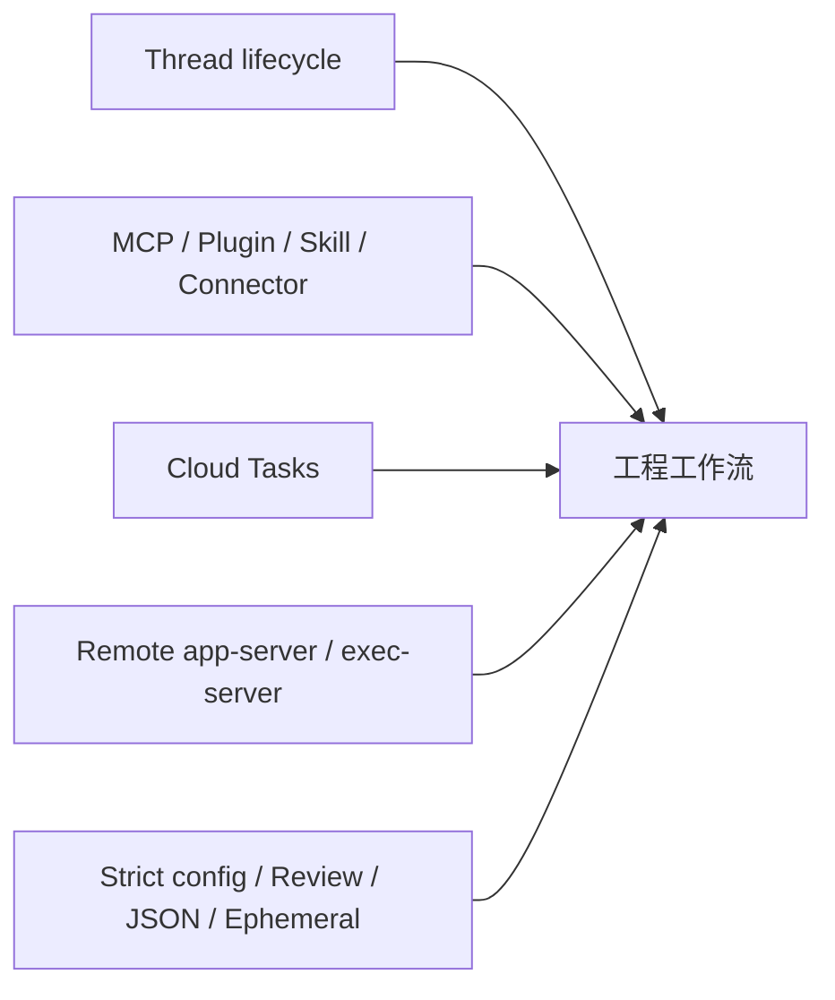

# 第 05 章：高级使用方法

> 源码基线：`upstream/main@283bc4cf011047314b4804c0f1ccd06e4f6a95c5`，复核日期：2026-06-24。

## 1. 高级使用的五条能力链

当前 Codex 的高级工作流主要不是“更多 prompt 技巧”，而是：

1. thread 的 resume、fork、archive 与自动化。
2. MCP、plugins、skills、connectors 的能力扩展。
3. Cloud Tasks 的异步执行、attempt 对比和本地 apply。
4. remote app-server 与 exec-server environment。
5. strict config、ephemeral、review 和可观测输出组成的工程控制。



## 2. 长会话：resume、fork、archive

### Resume

```bash
codex resume
codex resume --last
codex resume <THREAD_ID_OR_NAME>
codex exec resume --last "继续处理"
```

交互 resume picker 默认按 cwd 筛选；`--all` 解除 cwd filter。非交互 session 是否出现在交互列表中由入口选项控制。

resume 不只是加载文本，而是读取 thread metadata、rollout 和 compact replacement history，再恢复 live session。

### Fork

```bash
codex fork
codex fork --last
codex fork <THREAD_ID_OR_NAME>
```

fork 在历史基础上创建新 thread，后续事件不会写回原 thread。适合：

- 从同一分析分出两种实现。
- 保留稳定分支，尝试高风险修改。
- 在 compact 后继续不同方向。

### Archive/Delete/Unarchive

- archive：从默认活动列表隐藏，保留恢复数据。
- unarchive：恢复可见性。
- delete：永久删除语义，不能当作 archive 的别名。

在自动化中应先 archive，只有满足数据保留策略时才 delete。

## 3. MCP 管理

当前 `codex mcp` 提供：

```text
list / get / add / remove / login / logout
```

### 添加 stdio server

```bash
codex mcp add my-server -- my-command --arg
```

### 添加 Streamable HTTP server

```bash
codex mcp add my-server --url https://example.test/mcp
```

添加时会：

- 校验 server name。
- 写入用户配置。
- 检测 HTTP server 是否支持 OAuth。
- 必要时启动 OAuth flow。

OAuth login 只支持 Streamable HTTP transport。provider 拒绝自动发现 scopes 时，CLI 会重试一次不带 scopes 的登录。

### MCP 不等于 Plugin

MCP 是运行协议；Plugin 是分发包。Plugin 可以携带 MCP server、skills、apps、hooks 和 assets。直接配置 MCP 适合单个服务；需要共享、品牌、市场和多资源组合时更适合 plugin。

## 4. Plugin 管理

主要命令：

```bash
codex plugin add <PLUGIN>@<MARKETPLACE>
codex plugin list
codex plugin list --available --json
codex plugin remove <PLUGIN>@<MARKETPLACE>
```

高级使用时要区分：

- marketplace 已配置。
- plugin 可发现。
- plugin 已安装。
- plugin 在当前 config 下 active。
- 当前 thread 显式选择 selected plugin。
- plugin 内 MCP/skill/app 是否最终对模型可见。

这些状态不是同一个 bool。Plugin 安装后仍会经过 capability、auth、policy、environment 和 tool exposure 过滤。

## 5. Cloud Tasks

`codex cloud` 不带子命令时启动任务列表 TUI；也提供：

```text
status / list / diff / apply
```

### 5.1 Attempts

创建任务支持 1–4 个 attempts。diff/apply 的 `--attempt` 是 1-based；未指定时默认第一个排序后的 attempt。

实现会收集 base task diff 和 sibling attempts，再按 placement 排序。不能假设 task ID 只对应一个 diff。

### 5.2 List 与 status

- list limit 限制在 1–20。
- list 支持 cursor pagination。
- status 非 Ready 时会返回失败状态，方便 CI 分流。

### 5.3 Apply 的 preflight

Cloud TUI 在真正 apply 前运行 preflight：

- 检查 skipped/conflict paths。
- 防止已有 preflight/apply 重入。
- 用户确认后才执行 apply。
- 成功后刷新 task 列表。

CLI `apply` 直接调用 backend apply，应由调用方在干净工作区执行并检查返回状态。

### 5.4 Race guard

任务列表、environment detection 和详情 diff 都是并发加载。事件处理会检查当前 filter/generation/id，避免旧请求结果覆盖新 UI 状态。

## 6. Remote TUI

交互入口支持：

```bash
codex --remote <ADDR>
codex --remote <ADDR> --remote-auth-token-env TOKEN_ENV
```

auth token 只允许：

- `wss://`
- loopback `ws://`

远程模式只适用于 interactive TUI 命令；login、MCP、plugin、cloud、sandbox 等本地管理子命令会明确拒绝 root `--remote`。

remote app-server 模式下：

- cwd 属于远端 workspace。
- 本地路径不应被直接 canonicalize 成远端路径。
- thread list/resume 来自远端。
- state/config/environment 的归属与 embedded 模式不同。

## 7. Exec Server 与远程 Environment

`codex exec-server` 可本地监听，也可注册为远程 environment：

```bash
codex exec-server --remote <BASE_URL> \
  --environment-id <ID> \
  --name <DISPLAY_NAME>
```

注册时需要支持的认证：

- ChatGPT auth。
- API key auth，但远程 host 被限制为 HTTPS 的 OpenAI 域或 loopback。
- Agent Identity auth 必须显式 `--use-agent-identity-auth`。

environment registry 使工具的 filesystem/process 不再默认指向本机。高级工作流应始终传递 environment identity 和 PathUri，不能把远端路径强转成本地 `PathBuf`。

## 8. Strict config 与可重复运行

推荐自动化显式设置：

```bash
codex exec \
  --strict-config \
  --json \
  --model <MODEL> \
  --sandbox workspace-write \
  --config key=value \
  "..."
```

同时注意：

- root `--strict-config` 并不适用于所有管理子命令。
- `--ignore-user-config` 不影响 auth 仍使用 `CODEX_HOME`。
- `--ignore-rules` 只跳过 user/project execpolicy rules，不代表关闭 managed requirements。
- `--ephemeral` 禁止常规 session 持久化。

## 9. Review 工作流

`codex review` 和 `codex exec review` 复用 headless runtime，但输入目标和输出 contract 面向代码审查。

高级团队可把 review 分成：

1. 生成 diff。
2. 独立 review thread 检查 correctness、安全和 breaking change。
3. 根据 findings 修复。
4. 再运行测试，而不是把“review 无输出”当作测试通过。

Review 是模型/agent 判断层，不替代编译器、测试和 schema generation。

## 10. 扩展能力进入模型的真实路径

```text
安装或配置
  -> catalog/discovery
  -> active/selected/auth/capability filtering
  -> skill context injection 或 ToolSpec
  -> direct exposure 或 deferred tool_search
  -> approval/policy/environment
  -> execution
```

高级用户常犯的错误是把“已安装”当作“模型本 turn 已看到”。排障应逐层确认，而不是只看配置文件。

## 11. 安全建议

- Cloud diff apply 前保持工作区干净，并先查看目标 attempt。
- OAuth 凭据使用 keyring/auto，避免把 token 写入仓库。
- Remote auth token 从环境变量读，不放命令行明文。
- API key 远程 environment 注册只允许受限 host。
- 不用 bypass flags 修复配置或 sandbox 问题。
- Plugin/marketplace 属于供应链输入，审查 manifest、MCP command、hooks 和 skills。
- 对 deferred tools 仍执行同样 approval/policy；延迟可见不等于低风险。

## 12. 验证命令

```bash
# thread 生命周期
rg -n "ResumeCommand|ForkCommand|Archive|Delete|Unarchive" \
  codex-rs/cli/src/main.rs

# MCP 与 plugin
rg -n "McpSubcommand|perform_oauth_login|run_add|run_remove" \
  codex-rs/cli/src/mcp_cmd.rs
rg -n "PluginSubcommand|run_plugin_add|run_plugin_list|run_plugin_remove" \
  codex-rs/cli/src/plugin_cmd.rs

# Cloud attempts/preflight
rg -n "parse_attempts|collect_attempt_diffs|select_attempt|spawn_preflight|spawn_apply" \
  codex-rs/cloud-tasks/src

# Remote TUI 与 environment
rg -n "InteractiveRemoteOptions|resolve_remote_endpoint|run_remote_environment" \
  codex-rs/cli/src/main.rs codex-rs/exec-server/src
```

## 小结

高级使用的关键是把 Codex 当作一个有 thread、有能力目录、有执行环境、有安全策略的 runtime：

```text
thread lifecycle
  + extension lifecycle
  + cloud attempts
  + remote environment
  + reproducible policy
```

命令只是入口；真正决定可维护性的，是状态、来源、权限和恢复边界是否明确。
