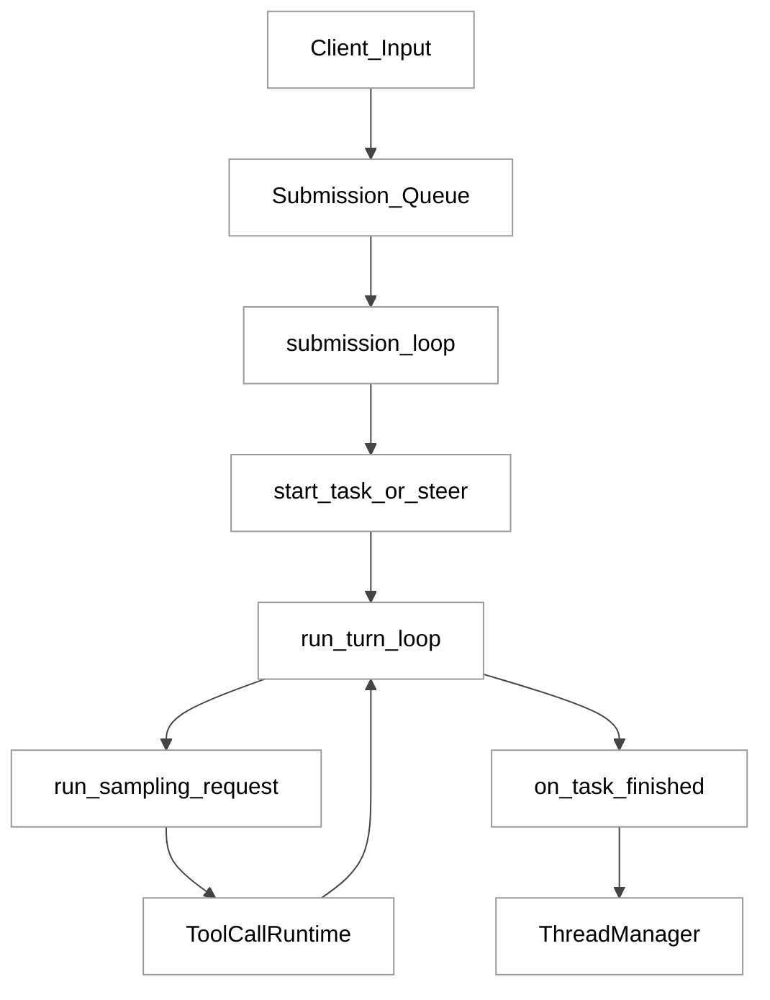
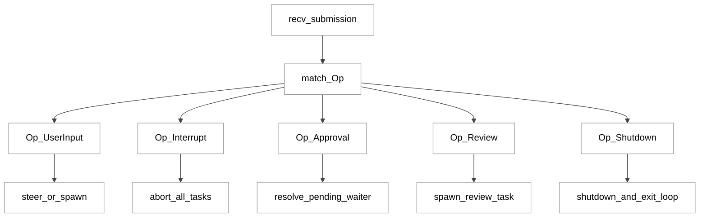
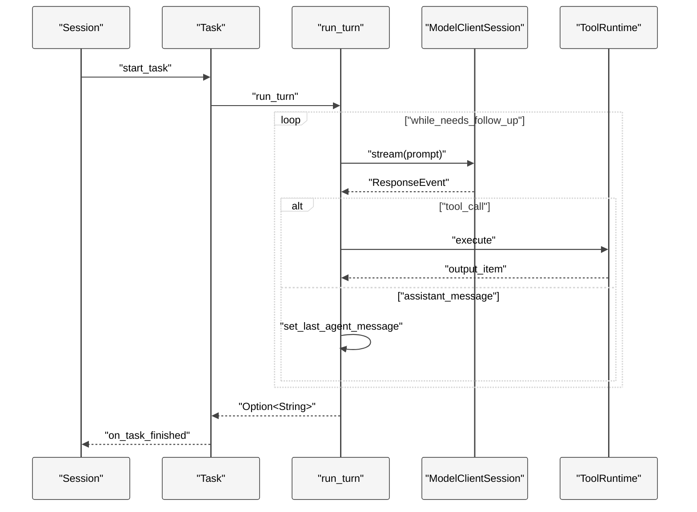
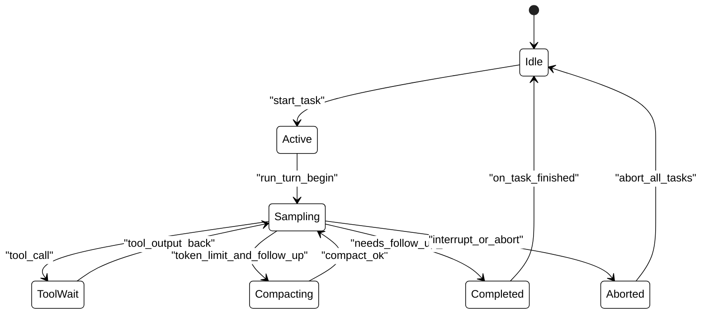
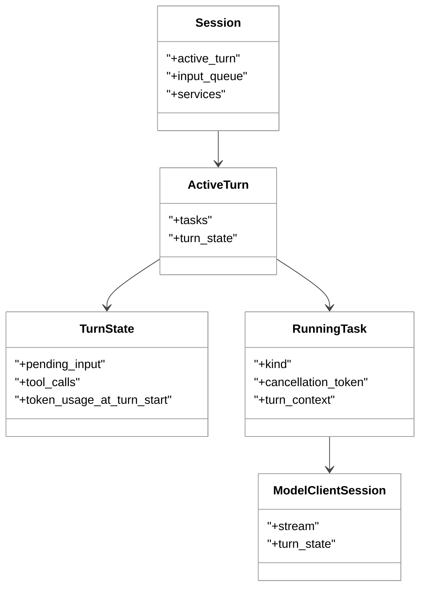

# 第 06 章 Agent 核心循环

## 引言

Codex 的“Agent 核心循环”不是一个 `while`，而是一组分层循环：

- 会话层：`submission_loop` 串行分发 `Op`
- 任务层：`spawn_task / abort_all_tasks / on_task_finished`
- 回合层：`run_turn` 驱动模型-工具迭代
- 线程层：`ThreadManager` 负责 `start/resume/fork/shutdown`

本章目标是把这四层如何协作讲清楚，并回答一个核心问题：**为什么 Codex 能在长会话、并发输入、工具调用和线程分叉下仍维持可恢复的执行语义**。

先给本章可复核定量快照（基线：`/Users/hexiaonan/workspace/formless/refer/codex`）：

| 指标 | 数值 | 证据 |
|---|---:|---|
| `codex-rs` `Cargo.toml` 总数 | 120 | `codex-rs/**/Cargo.toml` 全量检索 |
| `session/mod.rs` 行数 | 3339 | `codex-rs/core/src/session/mod.rs` |
| `session/turn.rs` 行数 | 2180 | `codex-rs/core/src/session/turn.rs` |
| `session/session.rs` 行数 | 1235 | `codex-rs/core/src/session/session.rs` |
| `client.rs` 行数 | 2245 | `codex-rs/core/src/client.rs` |
| `thread_manager.rs` 行数 | 1542 | `codex-rs/core/src/thread_manager.rs` |
| 核心 5 文件合计 | 10541 | 上述求和 |
| `run_turn` 长度 | 270 行 | `turn.rs:131-400` |
| `run_sampling_request` 长度 | 132 行 | `turn.rs:892-1023` |
| `try_run_sampling_request` 长度 | 479 行 | `turn.rs:1689-2167` |
| `submission_loop` 长度 | 149 行 | `session/handlers.rs:708-856` |
| `Session` 字段数 | 16 | `session/session.rs:19-40` |
| `TurnState` 字段数 | 13 | `state/turn.rs:112-125` |

---

## 全网调研补充（近 12 个月）

> 检索关键词：`Codex session loop Rust`、`Codex turn driver`、`Codex thread manager fork`。

### 1) 谁在讨论这个主题

- **OpenAI 工程团队**：  
  [Unrolling the Codex agent loop](https://openai.com/so-DJ/index/unrolling-the-codex-agent-loop/)；  
  [Unlocking the Codex harness](https://openai.com/so-DJ/index/unlocking-the-codex-harness/)；  
  [App Server 文档](https://developers.openai.com/codex/app-server)
- **Simon Willison**：  
  [openai/codex 首发观察](https://simonwillison.net/2025/Apr/16/openai-codex/)；  
  [Codex CLI `/goal` 机制](https://simonwillison.net/2026/Apr/30/codex-goals/)
- **Hacker News + GitHub issue**：围绕 turn race、stream fallback、fork 语义、compaction 可靠性有持续争论
- **中文平台（知乎/少数派/CSDN/掘金）**：以使用经验为主，`run_turn`/`submission_loop` 源码级拆解较少
- **Latent Space**：更侧重“harness 与产品化”而非逐函数路径
- **机器之心**：近 12 个月在该子主题上以产品新闻为主，缺少深入工程解剖

### 2) 社区共识、争议、盲区

**共识**（跨来源重复）：

1. Codex 不是“一次调用模型”，而是长期运行 harness。
2. turn 是用户视角单轮、系统视角多次推理-工具循环。
3. fork 的价值在于“并行探索 + 原线程可回溯”。

**争议/误解**：

- “turn complete == 所有副作用完成”是误解；异步工具与消息注入有竞态窗口。
- “/fork 只是 UI 功能”是误解；底层是 history snapshot + truncation 语义。
- “WS fallback 只影响一次请求”是误解；源码里是 session 级开关。

**盲区**（社区讨论不系统）：

- pending input 与 mailbox 在 turn 尾部如何安全交接；
- mid-turn compaction 的可靠退出边界；
- fork 时 active turn 中断标记如何影响后续推理语义。

---

## 七维分析

## 1. 本质是什么

本质上，Agent 核心循环是一个“分层状态机”：

1. `Codex::spawn` 启动 `Session` 并拉起后台 `submission_loop`
2. `submission_loop` 接收 `Submission`，按 `Op` 分发
3. 任务层根据输入状态决定 `steer` 还是 `spawn task`
4. `run_turn` 在一个 turn 内反复执行模型采样和工具调用
5. `ThreadManager` 把单线程执行扩展到 start/resume/fork 生命周期

关键证据：

```rust
// codex-rs/core/src/session/mod.rs:660
// This task will run until Op::Shutdown is received.
let session_loop_handle = tokio::spawn(async move {
    submission_loop(session_for_loop, config, rx_sub)
        .instrument(info_span!("session_loop", thread_id = %thread_id))
        .await;
});
```

```rust
// codex-rs/core/src/session/handlers.rs:708
pub(super) async fn submission_loop(
    sess: Arc<Session>,
    config: Arc<Config>,
    rx_sub: Receiver<Submission>,
) {
    while let Ok(sub) = rx_sub.recv().await {
        match sub.op.clone() {
            Op::UserInput { .. } => user_input_or_turn(&sess, sub.id.clone(), sub.op).await,
            Op::Interrupt => interrupt(&sess).await,
            Op::Shutdown => { /* ... */ }
            _ => {}
        }
    }
}
```

### 图 1：核心循环分层

<div style="background:#ffffff !important; background-color:#ffffff !important; padding:16px; border-radius:8px; margin:16px 0;" bgcolor="#ffffff">



</div>

---

## 2. 核心问题和痛点

### 痛点 A：并发输入与单任务执行冲突

`Session` 明确“同一时刻最多 1 个 active turn”，但审批回包、用户 steer、子代理消息是异步进入的。  
Codex 用 `active_turn + TurnState.pending_* + input_queue` 协调这件事。

```rust
// codex-rs/core/src/session/session.rs:19
pub(crate) struct Session {
    pub(crate) active_turn: Mutex<Option<ActiveTurn>>,
    pub(crate) input_queue: InputQueue,
    // ...
}
```

```rust
// codex-rs/core/src/state/turn.rs:112
pub(crate) struct TurnState {
    pending_approvals: HashMap<String, oneshot::Sender<ReviewDecision>>,
    pending_request_permissions: HashMap<String, PendingRequestPermissions>,
    pending_user_input: HashMap<String, oneshot::Sender<RequestUserInputResponse>>,
    pending_elicitations: HashMap<(String, RequestId), oneshot::Sender<ElicitationResponse>>,
    pending_dynamic_tools: HashMap<String, oneshot::Sender<DynamicToolResponse>>,
    pub(crate) pending_input: TurnInputQueue,
    // ...
}
```

### 痛点 B：上下文增长导致 token 压力

`run_turn` 每轮都从历史重建 prompt，follow-up 多时会触发 context limit。  
方案是 pre-turn + mid-turn compaction。

```rust
// codex-rs/core/src/session/turn.rs:282
if token_limit_reached && needs_follow_up {
    run_auto_compact(
        &sess,
        &turn_context,
        &mut client_session,
        InitialContextInjection::BeforeLastUserMessage,
        CompactionReason::ContextLimit,
        CompactionPhase::MidTurn,
    )
    .await?;
    continue;
}
```

### 痛点 C：流传输不稳定与会话连续性

`ModelClientSession::stream` 默认优先 WebSocket，但失败会触发 HTTP fallback；而 fallback 是 session 级状态。

```rust
// codex-rs/core/src/client.rs:778
pub fn responses_websocket_enabled(&self) -> bool {
    if !self.state.provider.info().supports_websockets
        || self.state.disable_websockets.load(Ordering::Relaxed)
    {
        return false;
    }
    true
}
```

### 痛点 D：fork 不是文本复制，而是状态复制

fork 需要在正确 snapshot 边界上裁剪 history，再交给统一的 `spawn_thread` 路径。

```rust
// codex-rs/core/src/thread_manager.rs:870
async fn fork_thread_with_initial_history(
    &self,
    snapshot: ForkSnapshot,
    config: Config,
    history: InitialHistory,
    // ...
) -> CodexResult<NewThread> {
    let interrupted_marker = InterruptedTurnHistoryMarker::from_config(&config);
    let history = fork_history_from_snapshot(snapshot, history, interrupted_marker);
    Box::pin(self.state.spawn_thread(/* ... */)).await
}
```

---

## 3. 解决思路与方案

Codex 的方案可以归纳成三条：

1. **会话串行化**：所有 `Op` 先过 `submission_loop`
2. **任务可替换**：新任务先 `abort_all_tasks(Replaced)` 再 `start_task`
3. **回合可续跑**：turn 内由 `needs_follow_up` 驱动循环，辅以 input queue 和 compaction

```rust
// codex-rs/core/src/tasks/mod.rs:301
pub async fn spawn_task<T: SessionTask>(
    self: &Arc<Self>,
    turn_context: Arc<TurnContext>,
    input: Vec<UserInput>,
    task: T,
) {
    self.abort_all_tasks(TurnAbortReason::Replaced).await;
    self.clear_connector_selection().await;
    self.start_task(turn_context, input, task).await;
}
```

### 图 2：`submission_loop` 分发流

<div style="background:#ffffff !important; background-color:#ffffff !important; padding:16px; border-radius:8px; margin:16px 0;" bgcolor="#ffffff">



</div>

### 图 3：turn 内时序

<div style="background:#ffffff !important; background-color:#ffffff !important; padding:16px; border-radius:8px; margin:16px 0;" bgcolor="#ffffff">



</div>

### 图 4：turn 状态机

<div style="background:#ffffff !important; background-color:#ffffff !important; padding:16px; border-radius:8px; margin:16px 0;" bgcolor="#ffffff">



</div>

### 图 5：关键数据结构关系

<div style="background:#ffffff !important; background-color:#ffffff !important; padding:16px; border-radius:8px; margin:16px 0;" bgcolor="#ffffff">



</div>

---

## 4. 实现细节关键点

### 4.1 `run_turn` 的结束条件不是“模型停止流”

`run_turn` 的真实结束条件是 `needs_follow_up == false`，而不是某一次 `ResponseEvent::Completed`。  
因此它会在模型完成后继续检查 pending input 和 token 状态。

```rust
// codex-rs/core/src/session/turn.rs:249
let SamplingRequestResult {
    needs_follow_up: model_needs_follow_up,
    last_agent_message: sampling_request_last_agent_message,
} = sampling_request_output;
let has_pending_input = sess.input_queue.has_pending_input(&sess.active_turn).await;
let needs_follow_up = model_needs_follow_up || has_pending_input;
```

### 4.2 `run_sampling_request` 负责“请求级”韧性

这个函数关注的是“同一次采样”重试与降级，不处理 session 级业务逻辑：

```rust
// codex-rs/core/src/session/turn.rs:972
let max_retries = turn_context.provider.info().stream_max_retries();
if retries >= max_retries
    && client_session.try_switch_fallback_transport(
        &turn_context.session_telemetry,
        &turn_context.model_info,
    )
{
    retries = 0;
    continue;
}
```

### 4.3 `try_run_sampling_request` 负责“事件级”状态推进

它逐条消费 `ResponseEvent`，维护 `needs_follow_up`、`last_agent_message`、in-flight tool futures，再统一 drain 与发事件。

```rust
// codex-rs/core/src/session/turn.rs:1729
let mut needs_follow_up = false;
let mut last_agent_message: Option<String> = None;
let mut in_flight: FuturesOrdered<BoxFuture<'static, CodexResult<ResponseInputItem>>> =
    FuturesOrdered::new();
```

```rust
// codex-rs/core/src/session/turn.rs:2141
drain_in_flight(&mut in_flight, sess.clone(), turn_context.clone()).await?;
if should_emit_token_count {
    sess.send_token_count_event(&turn_context).await;
}
```

### 4.4 `start_task` 和 `on_task_finished` 的握手机制

- `start_task` 负责设置 turn 起点状态和 `RunningTask`
- `on_task_finished` 负责回收、统计、事件发送、清理 active turn

```rust
// codex-rs/core/src/tasks/mod.rs:443
let running_task = RunningTask {
    done,
    handle: AbortOnDropHandle::new(handle),
    kind: task_kind,
    task,
    cancellation_token,
    turn_context: Arc::clone(&turn_context),
    turn_extension_data,
    _timer: timer,
};
turn.add_task(running_task);
```

```rust
// codex-rs/core/src/tasks/mod.rs:807
if should_clear_active_turn {
    let cleared_active_turn = {
        let mut active = self.active_turn.lock().await;
        if let Some(active_turn) = active.as_ref()
            && active_turn.tasks.is_empty()
        {
            *active = None;
            true
        } else {
            false
        }
    };
}
```

### 4.5 `ThreadManager` 的统一 spawn 入口

无论 start/resume/fork，最终都收敛到 `spawn_thread_with_source`，保证线程生命周期一致。

```rust
// codex-rs/core/src/thread_manager.rs:1220
let CodexSpawnOk {
    codex, thread_id, ..
} = Codex::spawn(CodexSpawnArgs {
    config,
    installation_id: self.installation_id.clone(),
    // ...
})
.await?;
```

这让入口层不需要感知 session 内部实现差异。

---

## 5. 易错点和注意事项

结合源码与 issue 轨迹，最重要的注意事项如下：

1. **turn 尾部竞态窗口真实存在**：pending input 与 `needs_follow_up` 判定必须原子一致。  
2. **中途 compact 可能影响连续性**：不要把 compact 当作“必然成功的透明步骤”。  
3. **审批等待映射必须在 abort 路径清理**：否则会出现 call_id 悬挂。  
4. **WS fallback 是 session 级决策**：性能和行为变化会跨 turn 传递。  
5. **fork 要考虑 active turn 截断语义**：避免把 in-progress 后缀带入新线程。  
6. **显式 shutdown 不是唯一退出路径**：channel 关闭也要 teardown。  

对应源码锚点：

```rust
// codex-rs/core/src/session/handlers.rs:849
if !shutdown_received {
    shutdown_session_runtime(&sess).await;
    emit_thread_stop_lifecycle(sess.as_ref()).await;
}
```

```rust
// codex-rs/core/src/tasks/mod.rs:531
// Let interrupted tasks observe cancellation before dropping pending approvals...
self.input_queue.clear_pending(&active_turn).await;
```

---

## 6. 竞品对比（Claude Code / Opencode / Aider / Goose / Continue）

从“核心循环工程形态”看，Codex 的差异不在理念，而在实现颗粒度：

| 对比维度 | Codex 现状 | 同类常见形态 |
|---|---|---|
| 循环分层 | session/task/turn/thread 四层显式 | 多数只公开对话循环层 |
| 并发输入治理 | `active_turn + pending maps + input_queue` | 常见以会话锁或队列抽象描述 |
| 传输降级 | WS 优先 + session 级 fallback | 多为请求级重试，不总是会话级持久状态 |
| fork 语义 | 快照裁剪 + 统一 spawn 路径 | 常见强调 UX 分叉，不总公开历史裁剪细节 |
| 收尾语义 | 显式+隐式退出都 teardown | 常见主要覆盖显式关闭路径 |

因此，Codex 的核心竞争点更像“循环治理能力”，不是“工具调用次数”。

---

## 7. 仍存在的问题和缺陷

从代码注释与已知问题看，至少还有四类局限：

1. **pre-turn compaction 仍有已知 TODO**（输入估算与触发时机）  
2. **mid-turn compaction 的稳定性依赖摘要质量**  
3. **`Session::new` 职责仍偏重，维护成本高**  
4. **跨线程异步事件与主 turn 的交界面仍是高风险区域**

源码证据：

```rust
// codex-rs/core/src/session/turn.rs:141
// TODO(ccunningham): Pre-turn compaction runs before context updates and the
// new user message are recorded.
```

```rust
// codex-rs/core/src/session/turn.rs:281
// as long as compaction works well ... we shouldn't worry about being in an infinite loop.
```

这类注释说明：系统设计已经进入“边界稳态优化”阶段，而非“能力缺失”阶段。

---

## 小结

本章结论：

1. Codex 的 Agent 核心循环是一个分层状态机，不是单函数 ReAct。
2. 关键工程价值是可中断、可审批、可分叉、可恢复，而不仅是“会调工具”。
3. 真正难点在边界条件：turn 尾部竞态、compaction 连续性、thread fork 语义一致性。

如果把 Codex 看成“一个会写代码的 CLI”，会低估它；  
如果把它看成“线程化、可持久化、可治理的代理运行时”，就能解释为何核心循环占据了这么大的实现体量，也能理解后续章节（持久化、线程管理、协议层）为什么必须连在一起读。

