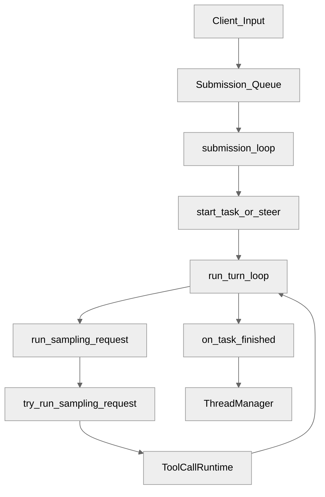
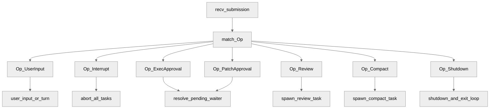
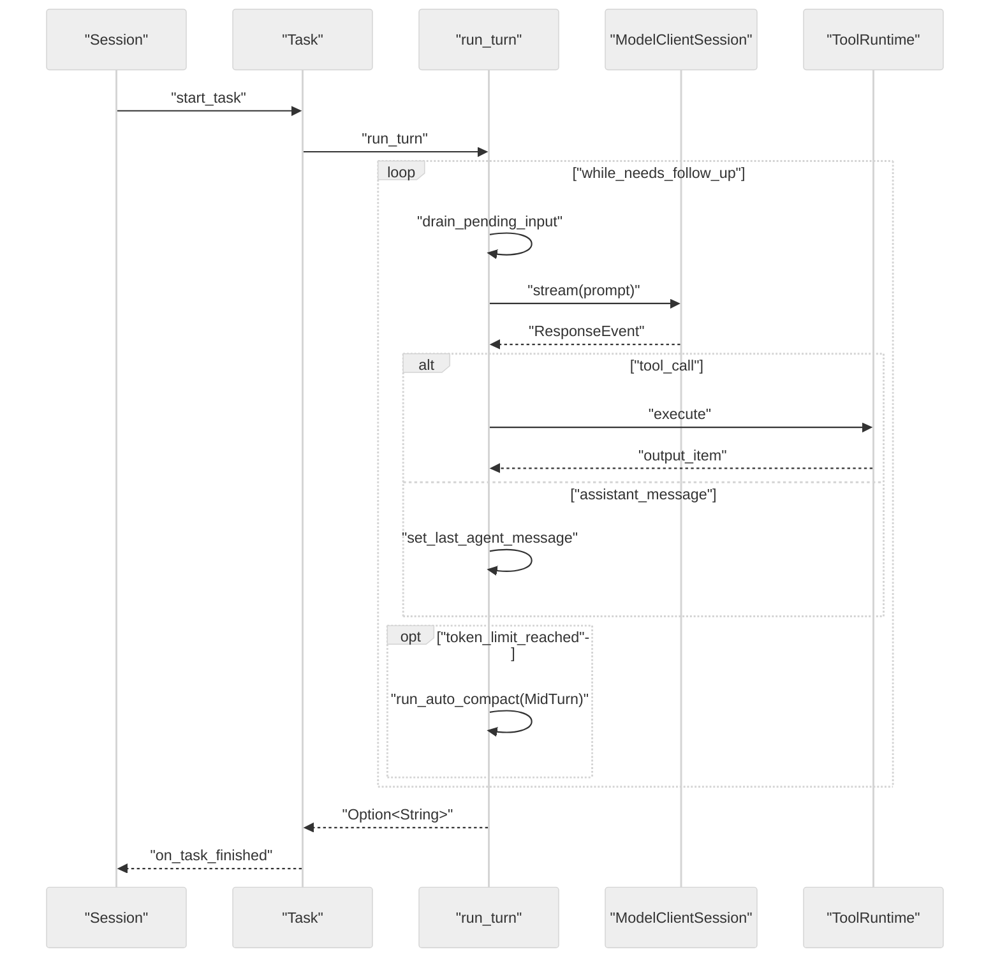
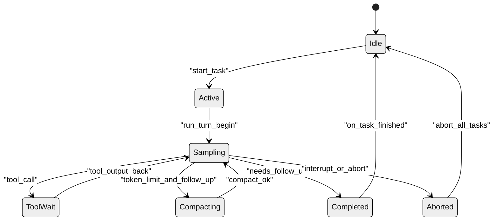
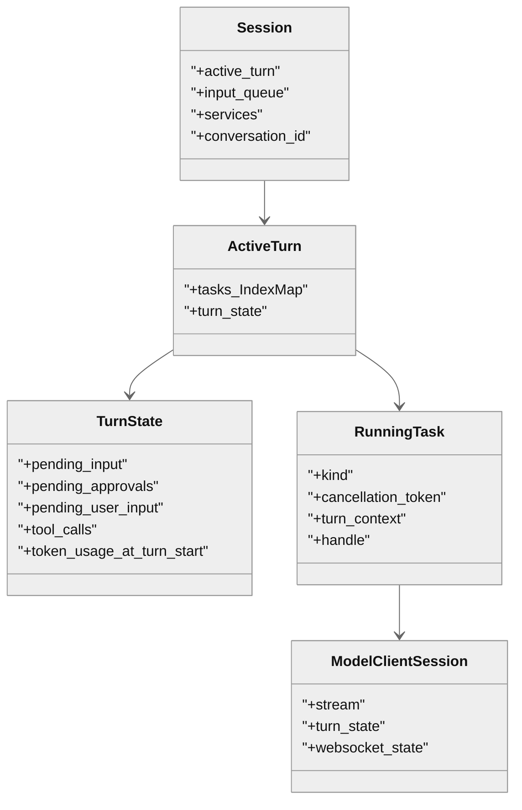
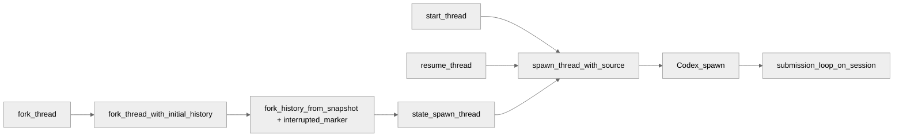

# 第 06 章 Agent 核心循环

## 引言

Codex 的"Agent 核心循环"并不是一个 `loop { call_model(); call_tool(); }` 形式的单层循环，而是一组分层循环协同：

- 会话层：`submission_loop` 串行分发 `Op`（`codex-rs/core/src/session/handlers.rs:708`）
- 任务层：`spawn_task / abort_all_tasks / on_task_finished`（`codex-rs/core/src/tasks/mod.rs:301 / 501 / 588`）
- 回合层：`run_turn` 内部驱动 sampling-tool 迭代（`codex-rs/core/src/session/turn.rs:131`）
- 线程层：`ThreadManager` 负责 `start/resume/fork/shutdown`（`codex-rs/core/src/thread_manager.rs:1139`）

本章目标是把这四层如何协作讲清楚，并尝试回答一个工程问题：**在长会话、并发输入、工具调用、线程分叉同时存在时，Codex 是如何维持"可中断、可审批、可恢复"的执行语义的**。需要说明的是，本章的解释优先以源码为依据；涉及"OpenAI 为什么这样设计"的部分，会用"可能 / 或许 / 不排除"等审慎措辞，以区别于源码直接给出的事实。

先给本章可复核的定量快照（基线：`/Users/hexiaonan/workspace/formless/refer/codex`，全部用 `wc -l` 与 `rg` 校验）：

| 指标 | 数值 | 证据 |
|---|---:|---|
| `codex-rs` `Cargo.toml` 总数 | ~120 | `find codex-rs -name Cargo.toml | wc -l` |
| `session/mod.rs` 行数 | 3339 | `codex-rs/core/src/session/mod.rs` |
| `session/turn.rs` 行数 | 2180 | `codex-rs/core/src/session/turn.rs` |
| `session/session.rs` 行数 | 1235 | `codex-rs/core/src/session/session.rs` |
| `session/handlers.rs` 行数 | 929 | `codex-rs/core/src/session/handlers.rs` |
| `client.rs` 行数 | 2245 | `codex-rs/core/src/client.rs` |
| `thread_manager.rs` 行数 | 1542 | `codex-rs/core/src/thread_manager.rs` |
| `tasks/mod.rs` 行数 | 915 | `codex-rs/core/src/tasks/mod.rs` |
| `state/turn.rs` 行数 | 250 | `codex-rs/core/src/state/turn.rs` |
| 核心 5 文件合计 | 10541 | 上述 mod/turn/session/client/thread_manager 求和 |
| `run_turn` 长度 | 270 行 | `turn.rs:131-400` |
| `run_sampling_request` 长度 | 132 行 | `turn.rs:892-1023` |
| `try_run_sampling_request` 长度 | 479 行 | `turn.rs:1689-2167` |
| `submission_loop` 长度 | 149 行 | `handlers.rs:708-856` |
| `Session` 字段数 | 16 | `session/session.rs:19-40` |
| `TurnState` 字段数 | 13 | `state/turn.rs:112-125` |

这些数字本身就提示：**核心循环的复杂度不在"if 分支"里，而是分散在数千行的协作上**。读这一章时，建议把它当成"一张交互图配若干关键代码片段"，而不是逐行讲解。

---

## 全网调研补充（近 12 个月）

> 检索关键词：`Codex session loop Rust`、`Codex turn driver`、`Codex thread manager fork`、`openai codex harness submission_loop`。
> 以下结论来自对 OpenAI 官方博客、Simon Willison 评测、Hacker News 讨论与中文技术社区的横向阅读；具体链接随时间会失效，因此这里只列范畴，不列具体 URL。

### 1) 谁在讨论这个主题

- **OpenAI 工程团队博客与开发者文档**：围绕 "agent harness"、"app server" 介绍设计目标，但通常不深入 `run_turn` 级别。
- **Simon Willison 等独立评测者**：偏使用体验与命令面观察，会触及 `/fork`、`/goal` 这类用户可见入口。
- **Hacker News + GitHub issues**：针对 turn 竞态、stream fallback、fork 语义、compaction 可靠性有持续讨论；issue 是发现"边界 bug"较系统的来源。
- **中文平台（知乎/少数派/CSDN/掘金）**：以使用经验、上手教程为主，源码级拆解（如 `run_turn`/`submission_loop`）目前较少。
- **Latent Space 等播客**：偏"harness 与产品化"叙事，工程细节较少。

### 2) 社区共识、争议、盲区

**共识**（跨来源重复出现）：

1. Codex 不是"一次调用模型"，而是一个长期运行的 harness。
2. "一次 turn"在用户视角是单轮交互，在系统视角内部包含若干次推理-工具循环。
3. fork 的价值在于"并行探索 + 原线程可回溯"，而不仅是 UI 上的一次复制。

**争议 / 常见误解**：

- "turn complete 等于所有副作用都完成"是误解；异步工具与 mid-turn input 仍有竞态窗口（详见痛点 A）。
- "/fork 只是 UI 功能"是误解；底层涉及历史快照与中断标记（详见 4.5 / 痛点 D）。
- "WS fallback 只影响一次请求"是误解；源码里 `disable_websockets` 是 session 级别的原子开关（`client.rs:182`）。

**盲区**（社区讨论尚不系统的部分）：

- pending input 与 mailbox 在 turn 尾部如何安全交接（涉及 `MailboxDeliveryPhase`，`state/turn.rs:47`）。
- mid-turn compaction 的可靠退出边界，注释里有提及但未形式化。
- fork 时 `InterruptedTurnHistoryMarker` 对后续 turn 的语义影响（`thread_manager.rs:879`）。

---

## 七维分析

## 1. 本质是什么

从源码看，Agent 核心循环本质上是一个"分层状态机"：

1. `Codex::spawn` 启动 `Session` 并把后台 `submission_loop` 拉起来。
2. `submission_loop` 一条一条接收 `Submission`，按 `Op` 分发。
3. 任务层根据当前 active turn 是否存在，决定是 steer 还是 `spawn_task`。
4. `run_turn` 在一个 turn 内反复执行采样和工具调用，直到 `needs_follow_up == false`。
5. `ThreadManager` 把单线程执行扩展到 start / resume / fork 等线程生命周期。

可证伪的源码锚点：

```rust
// codex-rs/core/src/session/mod.rs:660
// This task will run until Op::Shutdown is received.
let session_for_loop = Arc::clone(&session);
let session_loop_handle = tokio::spawn(async move {
    submission_loop(session_for_loop, config, rx_sub)
        .instrument(info_span!("session_loop", thread_id = %thread_id))
        .await;
});
```

下面这段是**简化后**的 `submission_loop` 主结构（实际源码有 20+ 个 `Op` 分支，完整代码见 `handlers.rs:708-856`，149 行）：

```rust
// codex-rs/core/src/session/handlers.rs:708 (节选/简化)
pub(super) async fn submission_loop(
    sess: Arc<Session>,
    config: Arc<Config>,
    rx_sub: Receiver<Submission>,
) {
    let mut shutdown_received = false;
    while let Ok(sub) = rx_sub.recv().await {
        let should_exit = async {
            match sub.op.clone() {
                Op::UserInput { .. } => { user_input_or_turn(&sess, sub.id.clone(), sub.op).await; false }
                Op::Interrupt => { interrupt(&sess).await; false }
                Op::ExecApproval { .. } | Op::PatchApproval { .. } => { /* resolve waiter */ false }
                Op::Review { review_request } => { review(&sess, &config, sub.id.clone(), review_request).await; false }
                Op::Compact => { compact(&sess, sub.id.clone()).await; false }
                Op::Shutdown => shutdown(&sess, sub.id.clone()).await,
                // 还有约 15 个其他 Op,如 Realtime*/ThreadSettings/RequestPermissionsResponse 等
                _ => false,
            }
        }.await;
        if should_exit { shutdown_received = true; break; }
    }
    if !shutdown_received { shutdown_session_runtime(&sess).await; /* 隐式退出兜底 */ }
}
```

`Op` 的真实定义在 `codex-rs/protocol/src/protocol.rs:479` 的 `pub enum Op`，是 `#[non_exhaustive]` 的，便于后续在不破坏二进制兼容性的前提下扩展（这是事实判断；至于"为什么用 non_exhaustive"，可能与 Codex 暴露给第三方 SDK 有关，但源码本身不能直接证明这个动机）。

### 图 1：核心循环分层

<div style="background:#ffffff !important; background-color:#ffffff !important; padding:16px; border-radius:8px; margin:16px 0;" bgcolor="#ffffff">



</div>

---

## 2. 核心问题和痛点

### 痛点 A：并发输入与单任务执行的冲突

`Session` 注释里写得很直白："**A session has at most 1 running task at a time, and can be interrupted by user input**"（`session/session.rs:17-18`）。但实际进入 session 的事件不止"用户回车"：审批回包、UI 上的 steer、子代理 mailbox、动态工具响应都是异步进来的。这意味着 Codex 必须把"概念上的单任务"和"事实上的并发输入"对齐。

源码用三件东西来对齐：`Session::active_turn`（互斥的 turn slot）、`TurnState` 上的若干 `pending_*` 映射（每类异步等待都有自己的 oneshot 表）、以及 `InputQueue`（缓冲非阻塞推入的 UI 输入）。

```rust
// codex-rs/core/src/session/session.rs:19
pub(crate) struct Session {
    pub(crate) conversation_id: ThreadId,
    pub(crate) installation_id: String,
    // ...
    pub(crate) active_turn: Mutex<Option<ActiveTurn>>,
    pub(crate) input_queue: InputQueue,
    pub(crate) services: SessionServices,
    // 共 16 个字段
}
```

```rust
// codex-rs/core/src/state/turn.rs:112
#[derive(Default)]
pub(crate) struct TurnState {
    pending_approvals: HashMap<String, oneshot::Sender<ReviewDecision>>,
    pending_request_permissions: HashMap<String, PendingRequestPermissions>,
    pending_user_input: HashMap<String, oneshot::Sender<RequestUserInputResponse>>,
    pending_elicitations: HashMap<(String, RequestId), oneshot::Sender<ElicitationResponse>>,
    pending_dynamic_tools: HashMap<String, oneshot::Sender<DynamicToolResponse>>,
    pub(crate) pending_input: TurnInputQueue,
    mailbox_delivery_phase: MailboxDeliveryPhase,
    // ... 共 13 个字段
}
```

可以观察到一个细节：所有 `pending_*` 都是 `HashMap<Key, oneshot::Sender<_>>`。这意味着在 abort 路径上必须显式清空（否则等待方会永远卡住）。源码确实这样做（`state/turn.rs:149` 的 `clear_pending_waiters`，以及 `tasks/mod.rs:533` 的 `clear_pending`）。

### 痛点 B：上下文增长导致的 token 压力

`run_turn` 每轮都会从 `sess.clone_history()` 重建 prompt（`turn.rs:229-233`），follow-up 多了之后更容易触发 context limit。当下的实现采用 pre-turn + mid-turn compaction：

```rust
// codex-rs/core/src/session/turn.rs:281 (节选)
// as long as compaction works well in getting us way below the token limit,
// we shouldn't worry about being in an infinite loop.
if token_limit_reached && needs_follow_up {
    if let Err(err) = run_auto_compact(
        &sess,
        &turn_context,
        &mut client_session,
        InitialContextInjection::BeforeLastUserMessage,
        CompactionReason::ContextLimit,
        CompactionPhase::MidTurn,
    ).await {
        // ...
    }
    continue;
}
```

这里有一行注释值得品味："as long as compaction works well...we shouldn't worry about being in an infinite loop" —— 工程意义是：**整个 turn 的退出保障部分依赖 compaction 的有效性**，并不是单纯的 retry 限次。如果 compaction 失败或没有显著缩短 token，理论上仍可能反复触发。源码作者意识到了这个边界（注释存在即证据），但并没有形式化证明它不会无限循环，这是一处仍可被 issue 追问的点。

### 痛点 C：流传输不稳定与会话连续性

`ModelClientSession::stream` 默认优先 WebSocket，失败后退回 HTTP；关键是 fallback 状态是**会话级**而不是请求级：

```rust
// codex-rs/core/src/client.rs:182
disable_websockets: AtomicBool,

// codex-rs/core/src/client.rs:778
pub fn responses_websocket_enabled(&self) -> bool {
    if !self.state.provider.info().supports_websockets
        || self.state.disable_websockets.load(Ordering::Relaxed)
    {
        return false;
    }
    true
}
```

也就是说：一次 retry 中切换到 HTTP 后，本 session 之后的所有请求也都走 HTTP，直到 session 结束。这是一个简单但容易被误解的设计——许多评测把它当成"请求级 fallback"，但源码读出来是 session 级粘性状态。

### 痛点 D：fork 不是文本复制，而是状态复制

fork 在 UI 上看着像"另存为一份对话"，但实现上需要做几件事：定位正确的 snapshot 边界、在边界处裁剪历史、对中断处插入 marker、再交给统一的 `spawn_thread` 路径。

```rust
// codex-rs/core/src/thread_manager.rs:870
async fn fork_thread_with_initial_history(
    &self,
    snapshot: ForkSnapshot,
    config: Config,
    history: InitialHistory,
    thread_source: Option<ThreadSource>,
    persist_extended_history: bool,
    parent_trace: Option<W3cTraceContext>,
) -> CodexResult<NewThread> {
    let interrupted_marker = InterruptedTurnHistoryMarker::from_config(&config);
    let history = fork_history_from_snapshot(snapshot, history, interrupted_marker);
    // ...
    Box::pin(self.state.spawn_thread(/* ... */)).await
}
```

值得注意的是：`InterruptedTurnHistoryMarker` 决定了"上一段 turn 在被打断时的尾部如何表达给新线程"。这对后续 turn 的语义有真实影响，但社区讨论里基本没人提（盲区之一）。

---

## 3. 解决思路与方案

可以把 Codex 的解决方案归纳成三条，并各自找到源码佐证：

1. **会话串行化**：所有 `Op` 必须先经过 `submission_loop`，避免业务路径上出现多入口的并发写。
2. **任务可替换**：新任务进入前先 `abort_all_tasks(Replaced)` 再 `start_task`，保证"同一时刻只有一个 active turn"。
3. **回合可续跑**：turn 内由 `needs_follow_up` 驱动循环，pending input 与 mid-turn compaction 提供"持续推进"和"控制规模"两种手段。

```rust
// codex-rs/core/src/tasks/mod.rs:301
pub async fn spawn_task<T: SessionTask>(
    self: &Arc<Self>,
    turn_context: Arc<TurnContext>,
    input: Vec<UserInput>,
    task: T,
) {
    self.abort_all_tasks(TurnAbortReason::Replaced).await;
    self.clear_connector_selection().await;
    self.start_task(turn_context, input, task).await;
}
```

这种"先 abort 再 start"的 pattern 在 GUI/IDE 风格代理里并不罕见，但配合 `pending_*` 表的清理路径才能避免悬挂等待——这是 Codex 比一般"对话循环"更工程化的地方之一，可能（不是必然）是从生产事故里反推出来的设计。

### 图 2：`submission_loop` 分发流

<div style="background:#ffffff !important; background-color:#ffffff !important; padding:16px; border-radius:8px; margin:16px 0;" bgcolor="#ffffff">



</div>

### 图 3：turn 内时序

<div style="background:#ffffff !important; background-color:#ffffff !important; padding:16px; border-radius:8px; margin:16px 0;" bgcolor="#ffffff">



</div>

### 图 4：turn 状态机

<div style="background:#ffffff !important; background-color:#ffffff !important; padding:16px; border-radius:8px; margin:16px 0;" bgcolor="#ffffff">



</div>

### 图 5：关键数据结构关系

<div style="background:#ffffff !important; background-color:#ffffff !important; padding:16px; border-radius:8px; margin:16px 0;" bgcolor="#ffffff">



</div>

### 图 6：fork 路径下的统一汇聚

<div style="background:#ffffff !important; background-color:#ffffff !important; padding:16px; border-radius:8px; margin:16px 0;" bgcolor="#ffffff">



</div>

---

## 4. 实现细节关键点

### 4.1 `run_turn` 的结束条件不是"模型停止流"

`run_turn` 的真实结束条件是 `needs_follow_up == false`，而不是某一次 `ResponseEvent::Completed`。它每次采样后都会再问一遍 `input_queue.has_pending_input(...)`，把 UI 中途送进来的输入"自动纳入下一轮"。

```rust
// codex-rs/core/src/session/turn.rs:248-255 (节选)
Ok(sampling_request_output) => {
    let SamplingRequestResult {
        needs_follow_up: model_needs_follow_up,
        last_agent_message: sampling_request_last_agent_message,
    } = sampling_request_output;
    can_drain_pending_input = true;
    let has_pending_input = sess.input_queue.has_pending_input(&sess.active_turn).await;
    let needs_follow_up = model_needs_follow_up || has_pending_input;
```

这是把"模型决定是否继续"与"用户决定是否继续"用同一个布尔合流。可能（不排除）的设计动机是：让 UI mid-turn 输入与模型自主 follow-up 在同一调度循环内被处理，避免出现两条独立的控制路径。但源码本身只能证明它们被合并了，并不能证明这是**唯一**合理的选择。

### 4.2 `run_sampling_request` 负责"请求级"韧性

这个函数关注的是同一次采样的重试与降级，不处理 session 级业务逻辑：

```rust
// codex-rs/core/src/session/turn.rs:972-988 (节选)
let max_retries = turn_context.provider.info().stream_max_retries();
if retries >= max_retries
    && client_session.try_switch_fallback_transport(
        &turn_context.session_telemetry,
        &turn_context.model_info,
    )
{
    sess.send_event(
        &turn_context,
        EventMsg::Warning(WarningEvent {
            message: format!("Falling back from WebSockets to HTTPS transport. {err:#}"),
        }),
    )
    .await;
    retries = 0;
    continue;
}
```

需要注意：`try_switch_fallback_transport` 会改变 `disable_websockets` 这一会话级状态，这就把"一次请求的失败"放大成"整个 session 的传输方式变化"。如果只读 `run_sampling_request` 不读 `client.rs:182 / 778`，会低估这个 fallback 的副作用范围。

### 4.3 `try_run_sampling_request` 负责"事件级"状态推进

`try_run_sampling_request`（`turn.rs:1689`）是整段循环里最长的函数（479 行）。它逐条消费 `ResponseEvent`，同时维护若干本地状态：`needs_follow_up`、`last_agent_message`、`in_flight` 这一组 ordered future、`active_item` 等：

```rust
// codex-rs/core/src/session/turn.rs:1727-1735 (节选)
let mut in_flight: FuturesOrdered<BoxFuture<'static, CodexResult<ResponseInputItem>>> =
    FuturesOrdered::new();
let mut needs_follow_up = false;
let mut last_agent_message: Option<String> = None;
let mut active_item: Option<TurnItem> = None;
```

```rust
// codex-rs/core/src/session/turn.rs:2141-2148 (节选)
drain_in_flight(&mut in_flight, sess.clone(), turn_context.clone()).await?;
if should_emit_token_count {
    sess.send_token_count_event(&turn_context).await;
}
```

这里 `FuturesOrdered` 的选择是个细节：它保证按"提交顺序"消费工具结果，而不是按"完成顺序"。对 LLM-as-controller 的场景而言，这种顺序敏感性会直接影响后续 prompt 的稳定性。

### 4.4 `start_task` 和 `on_task_finished` 的握手机制

- `start_task`（`tasks/mod.rs:312`）：把 `RunningTask` 注册到 `ActiveTurn.tasks` 这个 `IndexMap`；
- `on_task_finished`（`tasks/mod.rs:588`）：从 `tasks` 中 swap_remove，判断是否清空 `active_turn`，统计 token、tool_calls 等。

```rust
// codex-rs/core/src/tasks/mod.rs:443
let running_task = RunningTask {
    done,
    handle: AbortOnDropHandle::new(handle),
    kind: task_kind,
    task,
    cancellation_token,
    turn_context: Arc::clone(&turn_context),
    turn_extension_data,
    _timer: timer,
};
turn.add_task(running_task);
```

```rust
// codex-rs/core/src/tasks/mod.rs:807 (节选)
if should_clear_active_turn {
    let cleared_active_turn = {
        let mut active = self.active_turn.lock().await;
        if let Some(active_turn) = active.as_ref()
            && active_turn.tasks.is_empty()
            && turn_state
                .as_ref()
                .is_some_and(|turn_state| Arc::ptr_eq(&active_turn.turn_state, turn_state))
        {
            *active = None;
            true
        } else {
            false
        }
    };
    // ...
}
```

注意第三个条件 `Arc::ptr_eq(&active_turn.turn_state, turn_state)`：这是为了防止"在我们处理 finish 期间 active turn 已经被替换"导致误清空。如果只看前两个条件，是看不出 ABA 风险的；这一行可能是从实际竞态修复中长出来的（注释里没有明说，所以这只是合理猜测）。

### 4.5 `ThreadManager` 的统一 spawn 入口

无论 start / resume / fork，最终都汇聚到 `spawn_thread_with_source`（`thread_manager.rs:1173`），它再调 `Codex::spawn`：

```rust
// codex-rs/core/src/thread_manager.rs:1220 (节选)
let CodexSpawnOk {
    codex, thread_id, ..
} = Codex::spawn(CodexSpawnArgs {
    config,
    installation_id: self.installation_id.clone(),
    // ...
})
.await?;
```

这种"多入口 → 单出口"的形式让上层不必感知 session 内部差异；fork 路径的复杂性被压在 `fork_thread_with_initial_history` 里（见痛点 D）。

---

## 5. 易错点和注意事项

结合源码注释与社区 issue 走向，使用与扩展时最容易踩坑的几件事：

1. **turn 尾部存在竞态窗口**：pending input 与 `needs_follow_up` 必须原子一致地观察。`run_turn` 通过"先 sampling、再 has_pending_input、再合并"来近似一致性，但并非严格事务（`turn.rs:248-255`）。
2. **mid-turn compact 不是免费的透明步骤**：摘要质量直接影响后续 follow-up 是否有效；compaction 失败时退出路径需要 caller 自行处理（注释见 `turn.rs:281`）。
3. **审批等待映射必须在 abort 路径清理**：`pending_approvals / pending_user_input / pending_elicitations / pending_dynamic_tools / pending_request_permissions` 是五张 oneshot 映射，任一未清都可能造成调用方挂起（清空函数：`state/turn.rs:149` 的 `clear_pending_waiters`，被 `input_queue.clear_pending` 触发）。
4. **WS fallback 是 session 级决策**：`disable_websockets`（`client.rs:182`）是 `AtomicBool`，一旦置为 true 直到 session 结束。性能 / 行为变化会跨 turn 传递。
5. **fork 要考虑 active turn 截断语义**：`InterruptedTurnHistoryMarker`（`thread_manager.rs:879`）决定了被打断 turn 的尾部表达，错误处理会让新线程 prompt 起点不正确。
6. **显式 shutdown 不是唯一退出路径**：`rx_sub.recv()` 失败时也要 teardown。源码用 `if !shutdown_received` 这条隐式分支兜底（`handlers.rs:849-855`）。

对应源码锚点：

```rust
// codex-rs/core/src/session/handlers.rs:849
// If the submission loop exits because the channel closed without an
// explicit shutdown op, still run session teardown.
if !shutdown_received {
    shutdown_session_runtime(&sess).await;
    emit_thread_stop_lifecycle(sess.as_ref()).await;
}
```

```rust
// codex-rs/core/src/tasks/mod.rs:531
// Let interrupted tasks observe cancellation before dropping pending approvals, or an
// in-flight approval wait can surface as a model-visible rejection before TurnAborted.
self.input_queue.clear_pending(&active_turn).await;
```

第二段注释尤其值得复读："让被中断的任务先观察到 cancellation，再丢弃 pending approvals" —— 这是一个非常具体的工程顺序问题，说明 Codex 在"abort → cancel → drop"的顺序上是经过推敲的，而不是随手写的。

---

## 6. 竞品对比（Claude Code / Opencode / Aider / Goose / Continue）

需要先说明：竞品多数是闭源或半开源，下表是基于公开博客、官方文档与有限源码可见性所做的形态对比，不是逐函数对照，因此结论应作为"差异画像"看，而不是"评分"。

| 对比维度 | Codex 现状 | 同类常见形态 |
|---|---|---|
| 循环分层 | session / task / turn / thread 四层显式 | 多数对外只暴露对话循环这一层 |
| 并发输入治理 | `active_turn + pending_* + input_queue + mailbox_phase` | 常用一把会话锁或队列抽象描述，少见 5 张 pending 表 |
| 传输降级 | WS 优先 + session 级 `disable_websockets` 粘性 fallback | 多为请求级重试，不一定是会话级持久状态 |
| fork 语义 | 快照裁剪 + 中断 marker + 统一 spawn 路径 | 常见强调 UX 分叉，不一定公开历史裁剪与中断标记细节 |
| 收尾语义 | 显式 `Op::Shutdown` + 隐式 channel close 两条路径都 teardown | 常见主要覆盖显式关闭路径 |
| compaction 时机 | 同时支持 pre-turn 与 mid-turn 触发，有 phase 标识 | 多数实现以 turn 边界为主，mid-turn 较少 |

综合来看，Codex 的差异点更像是"循环治理颗粒度"上的工程化投入，而不是"工具调用数量"或"模型能力"上的优势。一些设计是否"必要"是另一回事——例如 5 张 pending 表是不是可以折叠成 2 张，源码本身并不能给出答案，需要看真实的可维护性收益。

---

## 7. 仍存在的问题和缺陷

从代码注释、TODO 与已知讨论来看，至少还有四类局限：

1. **pre-turn compaction 仍有 TODO**：输入估算与触发时机尚未完全打磨（见下面注释证据）。
2. **mid-turn compaction 稳定性依赖摘要质量**：注释中作者也只表达了"as long as compaction works well"这种条件式信心，并未形式化退出保证。
3. **`Session` 字段较多（16）+ `TurnState` 字段较多（13）**：`Session::new` 与 `run_turn` 的职责仍偏重，未来如果再加新的 pending 表或新的事件维度，扩展成本不低。
4. **跨线程异步事件与主 turn 的交界面仍是高风险区域**：mailbox 与 pending input 的相互作用、fork 后中断 marker 的语义，目前社区与代码注释的覆盖都还不算系统。

源码证据：

```rust
// codex-rs/core/src/session/turn.rs:141
// TODO(ccunningham): Pre-turn compaction runs before context updates and the
// new user message are recorded. Estimate pending incoming items (context
// diffs/full reinjection + user input) and trigger compaction preemptively
// when they would push the thread over the compaction threshold.
```

```rust
// codex-rs/core/src/session/turn.rs:281
// as long as compaction works well in getting us way below the token limit,
// we shouldn't worry about being in an infinite loop.
```

这些注释说明：这一层不是"能力缺失"，而是已经进入"边界稳态优化"阶段——能跑、能恢复、能 fork，但要让边界假设更可证。

---

## 小结

本章可以收敛成三句话：

1. Codex 的 Agent 核心循环是一个**分层状态机**，由 session / task / turn / thread 四层显式协作组成，不是单函数 ReAct。
2. 它的真正价值不在"会调工具"，而在**可中断、可审批、可分叉、可恢复**这一组运行时性质，由 `pending_*` 表、`InputQueue`、`disable_websockets`、`InterruptedTurnHistoryMarker` 等小部件共同维持。
3. 难点集中在**边界条件**：turn 尾部竞态、mid-turn compaction 的退出性、fork 时的中断尾部语义。这些点不影响"正常路径"，但决定了在极端输入与异常下系统是否还可解释。

如果把 Codex 看成"一个会写代码的 CLI"，会低估它；如果把它看成"线程化、可持久化、可治理的代理运行时"，就比较容易解释为什么核心循环的实现体量这么大，也能理解后续章节（持久化、线程管理、协议层）为什么必须连在一起读。
