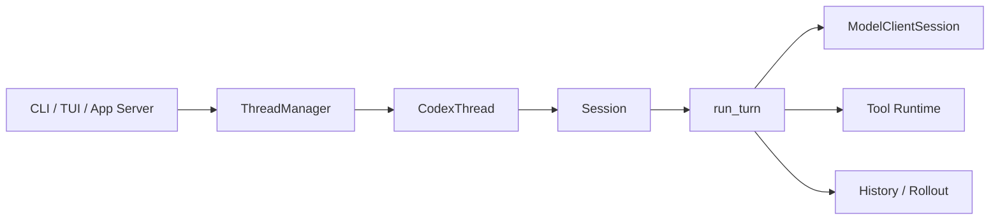
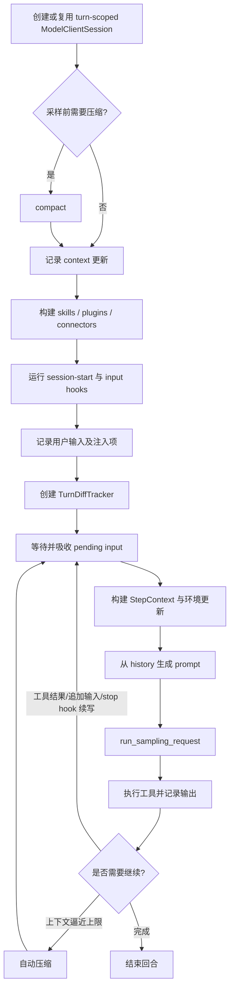

# 06｜Agent 核心循环：从一次提交到多次采样

> 源码基线：`upstream/main@283bc4cf011047314b4804c0f1ccd06e4f6a95c5`（2026-06-24）。

Codex 的一次用户操作并不等于一次模型请求。更准确的结构是：

```text
Thread
└── Submission
    └── Task
        └── Turn
            ├── sampling request 1
            ├── tool calls
            ├── sampling request 2
            ├── pending input / hooks / compaction
            └── final response
```

这一层次区分解释了许多表面上“不直观”的行为：模型为什么会在一次回答中被调用多次、工具结果为什么会回送模型、用户为什么能在执行中补充输入，以及自动压缩为什么不会简单地重启整个会话。

## 1. 三个核心对象

当前会话主线集中在：

- `codex-rs/core/src/thread_manager.rs`：创建、恢复、派生和管理线程。
- `codex-rs/core/src/codex_thread.rs`：对外暴露线程级控制接口。
- `codex-rs/core/src/session/session.rs`：持有会话状态并处理提交。
- `codex-rs/core/src/session/turn.rs`：执行单轮 Agent 循环。

`ThreadManager` 管理多个线程；`CodexThread` 是调用方操纵某个线程的句柄；`Session` 是线程内部的长生命周期状态；`run_turn` 则执行一次具体的用户回合。



不要把 `Session` 理解成“聊天消息数组”。它还负责配置快照、认证与模型客户端、工具管理、线程状态、事件发送、轨迹持久化和上下文窗口状态。

## 2. 提交、任务与回合

调用方把操作作为 `Op` 提交给线程。会话侧读取操作并分派，例如用户输入、审批响应、中断、压缩或审阅请求。需要持续执行的操作会形成任务，再进入具体回合。

这带来两个重要边界：

1. **控制面不等于模型上下文。** 审批、中断和队列管理首先是运行时事件，不会天然成为发送给模型的文本。
2. **一个 Turn 可以有多个 Step。** 每次采样以及随后的一组工具调用，可以看作回合中的一个推进步骤。

## 3. `run_turn` 的当前执行顺序

`run_turn` 位于 `codex-rs/core/src/session/turn.rs`。其主流程可以概括为：



开始采样前，运行时会：

- 创建或复用本回合的 `ModelClientSession`；
- 检查是否需要预压缩；
- 记录配置或环境变化形成的上下文差异；
- 解析显式提及的 Skill、Plugin 和 Connector；
- 执行待运行的 session-start hook 与 input hook；
- 将用户输入、扩展注入和必要的元数据写入历史；
- 启动回合级 diff 跟踪。

随后进入可重复的采样循环。每轮会先处理待加入的用户输入和提醒，再捕获当前 `StepContext`、更新时间与执行环境，最后从历史构造本次请求。

## 4. 为什么一次回合会多次请求模型

典型工具调用链如下：

```text
用户输入
  → 模型请求
  → 模型返回 tool call
  → Codex 执行工具
  → 工具输出进入历史
  → 再次请求模型
  → 模型继续推理或给出最终回答
```

所以，“一轮”是面向用户的语义单位，“一次采样”才是面向模型 API 的请求单位。只要模型继续发出工具调用、用户追加输入、hook 请求续写，或者压缩后仍需继续，当前回合就可能再次采样。

## 5. `run_sampling_request`

每次采样并不是复用一个静态请求。`run_sampling_request` 会按当前 Step 重新准备：

- 当前可见的工具规格；
- base instructions；
- `ToolCallRuntime`；
- Code Mode worker；
- 输出 schema 与严格模式；
- 模型流式请求及重试状态。

最终 Prompt 由四类内容构成：

```text
Prompt =
  base instructions
  + history.for_prompt()
  + model-visible tool specifications
  + response/output constraints
```

工具规格与文本历史是两条不同通道。某工具出现在 API 的 `tools` 字段中，并不意味着它的完整定义也作为普通用户文本重复注入。

## 6. 工具调用的有序并发

模型可能连续发出多个工具调用。运行时可以并行推进允许并行的调用，但回送模型的结果必须维持可解释的顺序。相关状态会跟踪活动 item 与正在执行的工具 future，避免完成时间不同导致上下文顺序随机漂移。

这也是工具系统必须明确区分以下概念的原因：

- 工具是否允许并行；
- 调用是否正在执行；
- 输出是否已经可持久化；
- 输出是否已经按序回送模型；
- 调用是否因取消、审批或策略失败而结束。

工具路由与执行细节将在第 09–11 章展开。

## 7. 执行中的追加输入

Codex 支持在当前回合尚未结束时接收新输入。`run_turn` 通过 pending-input gate 控制何时可以安全吸收它们。

追加输入不会粗暴地开启一个完全独立的新会话，而是在合适的采样边界加入当前历史。这样既能让用户纠正方向，也不会在工具执行中途破坏状态一致性。

运行时会显式维护“当前是否可以 drain pending input”。这说明交互式纠偏是 Agent 循环的一等能力，不是 UI 层拼出来的技巧。

## 8. Hook 如何影响循环

Hook 不只负责旁观。当前回合中的关键接入点包括：

- session-start hook；
- input hook；
- 工具调用前后 hook；
- stop hook。

尤其是 stop hook，它可以在模型看似已经完成时：

- 接受停止，结束回合；
- 提供续写提示，使循环再次采样。

因此最终停止条件不是单纯的“模型发出 final 文本”，而是模型、工具状态、pending input、上下文预算和 hook 共同决定。

## 9. 自动压缩不是重开会话

回合开始前和采样循环中都可能触发压缩。压缩的目标是：

1. 保留可继续工作的语义状态；
2. 将过长历史变成有界上下文；
3. 继续当前线程，而不是丢弃线程身份；
4. 尽量维持 reference context，减少无谓的缓存失效。

压缩后还会继续进入采样循环。关于 context fragment、reference context 和 token budget，见第 07 章及后续补充专题。

## 10. 三种输出不要混为一谈

一次流式响应会同时服务三个消费者：

| 消费者 | 关心的内容 |
| --- | --- |
| UI / App Server | delta、item 生命周期、审批与状态事件 |
| 下一次模型请求 | 规范化后的模型可见历史 |
| rollout / thread store | 可恢复、可审计的持久化事件 |

UI 看见的增量事件不应原样塞回模型；持久化记录也可能包含模型不可见的控制信息。Codex 在这里选择“同源事件、不同投影”，而不是用一份消息数组包打天下。

## 11. 异常与恢复路径

主循环还处理若干容易被忽略的恢复场景：

- 模型流中断后的有限重试；
- WebSocket 失败后在本回合降级到 HTTP/SSE；
- 无效图片输入的清理与重试；
- 工具被取消或审批拒绝；
- 上下文超限前的自动压缩；
- hook 失败或请求续写；
- 用户中断与任务清理。

这些路径共同保证“可恢复执行”。Agent 的可靠性主要来自状态机和边界设计，而不只是模型能力。

## 12. 源码阅读路线

这一节不要从 `turn.rs` 第一行开始硬读。更好的方式是先建立“外部提交 → 内部任务 → 采样循环 → 事件/持久化输出”的主线，再回头补细节。下面路线可以直接照着执行。

### 第 0 步：先用 sample 建立外部视角

先看 `codex-rs/thread-manager-sample/src/main.rs`，只抓三件事：

1. `ThreadManager::start_thread(config)` 如何拿到 `CodexThread`；
2. `CodexThread::submit(Op::UserInput { ... })` 如何提交一次用户输入；
3. `CodexThread::next_event()` 如何持续读 `EventMsg`。

这一步的目标不是理解 core 内部，而是记住外部调用方眼中的最小协议：

```text
start_thread -> submit(Op) -> next_event loop -> shutdown
```

后面所有源码都可以问一句：这段代码是在响应 `submit`，还是在生产 `next_event` 能读到的事件？

### 第 1 步：读 Thread / Session 的骨架

按下面顺序打开文件，不要深入每个字段：

```text
codex-rs/core/src/thread_manager.rs
  看：ThreadManager::start_thread
  看：ThreadManagerState::spawn_thread_with_source

codex-rs/core/src/codex_thread.rs
  看：CodexThread::submit
  看：CodexThread::next_event
  看：CodexThread::shutdown_and_wait

codex-rs/core/src/session/mod.rs
  看：Codex::spawn
  看：Codex::submit / submit_with_id
  看：Codex::next_event
```

这一层要形成的调用链是：

```text
ThreadManager::start_thread
  -> ThreadManagerState::spawn_thread_with_source
  -> Codex::spawn
  -> Session::new
  -> tokio::spawn(submission_loop)
  -> CodexThread::new
```

以及提交链：

```text
CodexThread::submit
  -> Codex::submit
  -> Codex::submit_with_id
  -> tx_sub.send(Submission)
```

读到这里就可以停。暂时不用弄清所有配置、MCP、extension、rollout 初始化。

### 第 2 步：找到 Submission 如何变成 Task

接着读 `codex-rs/core/src/session/handlers.rs` 和 `codex-rs/core/src/tasks/regular.rs`。

重点搜索：

```bash
rg -n "submission_loop|handle_submission|submission_dispatch_span|Op::UserInput|user_input_or_turn_inner" \
  codex-rs/core/src/session
rg -n "impl SessionTask for RegularTask|TurnStarted|run_turn" \
  codex-rs/core/src/tasks/regular.rs
```

这一步要回答：

1. `Submission` 是从哪个 channel 被取出来的？
2. `Op::UserInput` 被分派到哪里？
3. 普通用户输入为什么会进入 `RegularTask`？
4. `TurnStarted` 是在哪里发出来的？

读完后的主链路应该是：

```text
rx_sub.recv()
  -> dispatch Op::UserInput
  -> 创建/复用 active turn
  -> RegularTask::run
  -> emit EventMsg::TurnStarted
  -> session::turn::run_turn
```

### 第 3 步：第一次读 `turn.rs`，只读主干

现在再打开 `codex-rs/core/src/session/turn.rs`。第一次不要追函数实现，只看 `run_turn` 主体的大块结构。

重点搜索：

```bash
rg -n "pub\\(crate\\) async fn run_turn|loop \\{|run_sampling_request|run_auto_compact|run_turn_stop_hooks|TurnDiffTracker" \
  codex-rs/core/src/session/turn.rs
```

阅读顺序：

1. 函数签名：看 `Session`、`TurnContext`、`input`、`ModelClientSession`、`CancellationToken` 分别是什么角色。
2. 循环前准备：看预压缩、context updates、skills/plugins、hooks、record inputs。
3. `loop` 主体：看 pending input、StepContext、prompt、sampling、tool outputs、继续/停止判断。
4. 退出条件：看模型完成、stop hook、压缩续跑、pending input 续跑。

这一轮只需要得到这张图：

```text
run_turn
  -> turn 前准备
  -> loop
      -> 吸收 pending input
      -> 构建 StepContext
      -> build_prompt
      -> run_sampling_request
      -> 处理模型输出和工具调用
      -> 判断继续、压缩或结束
```

### 第 4 步：第二次读 `turn.rs`，专看一次采样

然后只看三处：

```bash
rg -n "fn build_prompt|async fn run_sampling_request|ToolCallRuntime|ResponseEvent|handle_output_item_done" \
  codex-rs/core/src/session/turn.rs codex-rs/core/src/stream_events_utils.rs
```

这一步要回答：

1. Prompt 由哪些部分组成？
2. 工具规格是怎么进入请求的？
3. 模型流式返回的 `ResponseEvent` 如何变成 `EventMsg`？
4. tool call 的输出如何回到下一次 sampling？

关键判断是：**UI 看到的 delta，不等于下一次模型请求的 history。** 模型下一次看到的是被规范化记录后的 conversation items。

### 第 5 步：专看“为什么会继续循环”

现在回到 `run_turn` 的 loop，专门找继续条件：

```bash
rg -n "pending_input|model_needs_follow_up|needs_follow_up|auto_compact_needed|stop_hook|can_drain_pending_input" \
  codex-rs/core/src/session/turn.rs
```

把继续原因分成四类：

| 继续原因 | 直观含义 |
| --- | --- |
| tool result | 模型调用了工具，工具结果需要送回模型。 |
| pending input | 用户在当前 turn 执行中追加了输入。 |
| auto compact | 上下文逼近限制，需要先压缩再继续。 |
| stop hook | 模型看似结束，但 hook 要求续写。 |

读到这里，应该能解释“为什么一次用户 turn 可能多次请求模型”。

### 第 6 步：用可观测性反推代码

不要只静态读。用事件和 span 反向验证理解：

```bash
rg -n "TurnStarted|TurnComplete|TurnAborted|send_event|send_event_raw" codex-rs/core/src
rg -n "info_span!|trace_span!|instrument\\(" codex-rs/core/src/session codex-rs/core/src/tasks
rg -n "TURN_E2E_DURATION_METRIC|TURN_TOKEN_USAGE_METRIC|TURN_TOOL_CALL_METRIC" codex-rs/core/src codex-rs/otel/src
```

把一次运行按四种投影复盘：

| 投影 | 看什么 |
| --- | --- |
| `EventMsg` | UI / app-server 能看到的实时状态。 |
| `tracing` span | 一次 `Submission`、`Task`、`Turn` 的调用链。 |
| metrics | turn 耗时、token、工具调用次数。 |
| rollout | 可恢复、可审计的持久化历史。 |

这个角度尤其适合学习 Agent 系统：先看到“运行中发生了什么”，再回源码找“为什么这样发生”。

### 第 7 步：最后再补专题

主链路走通后，再按兴趣补专题，不要在第一次阅读时展开：

```text
工具执行：codex-rs/core/src/tools/
MCP：codex-rs/core/src/mcp*.rs 和 tools/handlers/mcp*.rs
权限与 sandbox：config/permissions.rs、exec_policy.rs、sandboxing/
压缩：compact.rs、compact_remote.rs、compact_token_budget.rs
上下文 fragment：context/、context_manager/
持久化与恢复：rollout.rs、thread_manager.rs 的 resume/fork 路径
```

### 检查理解的四个问题

每读完一段代码，都用下面四个问题校验：

1. 这段代码属于线程级、turn 级、单次 sampling 级，还是输出投影级？
2. 它修改的是 runtime 状态、模型可见 history，还是只发给 UI 的事件？
3. 如果这段代码失败，用户会看到 `Error`、`TurnAborted`，还是只是 warning/metric？
4. 它会不会导致再次 sampling？

> 当前代码是在修改线程级状态、回合级状态、单次采样状态，还是仅修改某个输出投影？

只要把这四层分开，Codex 的 Agent 循环就不再神秘：它是一个可中断、可追加输入、可压缩、可恢复，并由工具结果持续驱动的多次采样状态机。
