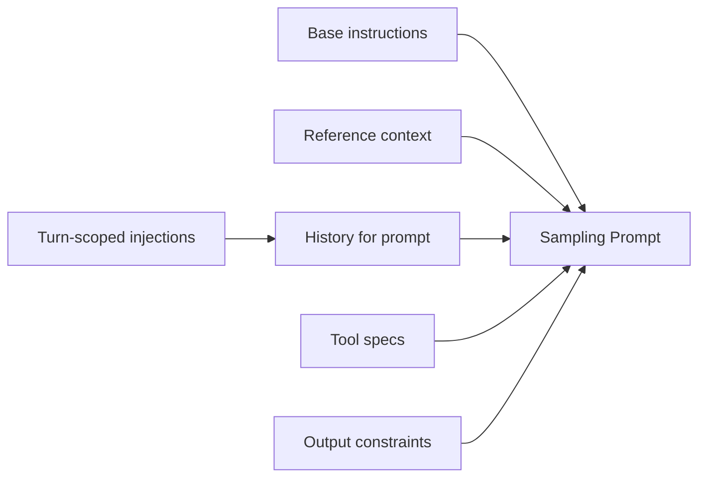
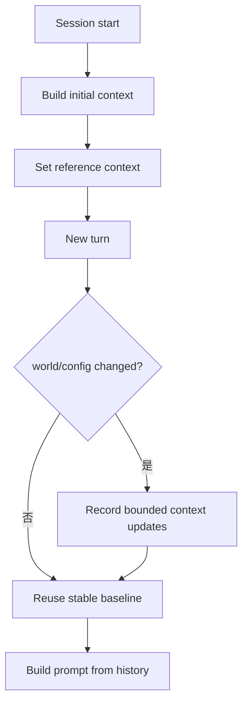
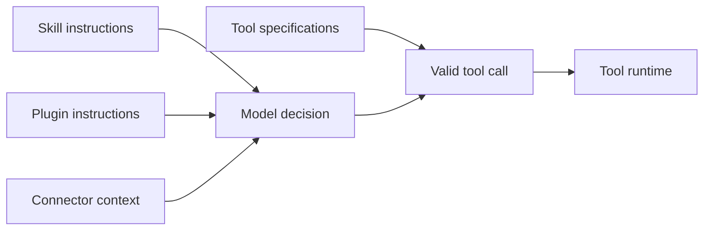

# 07｜Prompt 组装与 Skill 注入：上下文不是一段字符串

> 源码基线：`upstream/main@283bc4cf011047314b4804c0f1ccd06e4f6a95c5`（2026-06-24）。

Codex 不会把系统提示词、历史、Skill、Plugin 和工具说明粗暴拼成一个巨型字符串。当前实现更接近一套有类型、有预算、可增量更新的上下文系统。

## 1. 五条彼此独立的输入通道

一次模型请求中的信息主要来自：

1. **Base instructions**：模型、配置与会话决定的基础指令。
2. **Initial/reference context**：工作目录、环境、AGENTS、可用扩展等稳定上下文。
3. **Conversation history**：用户输入、模型输出、工具调用与工具结果。
4. **Turn-scoped injections**：本回合显式触发的 Skill、Plugin、Connector 内容。
5. **Tool specifications**：通过 Responses API 的工具字段暴露，而非普通文本历史。



这个设计避免了两个常见问题：每回合重复大段稳定文本造成缓存失效，以及把控制信息误当成普通用户消息。

## 2. `ContextualUserFragment`

模型可见的上下文片段通过 `ContextualUserFragment` 建模。它由独立的 context-fragments crate 定义，并在 `codex-core` 的 context 模块中使用。

不同类型的 fragment 可以表达不同语义，例如：

- 可用 Skill 列表及使用规则；
- 某个 Skill 的完整指令；
- 可用 Plugin 或推荐 Plugin；
- Plugin 注入内容；
- 环境与工作区变化；
- token / rollout budget；
- realtime、multi-agent 等运行模式提示。

关键不是“最后都能渲染成文本”，而是进入渲染前仍保有类型和边界。这样才能对每类内容分别限长、去重、重建和审计。

## 3. 初始上下文与 reference context

会话启动时，`build_initial_context_with_world_state` 构建初始上下文。它包含较稳定的工作世界描述，例如：

- 工作目录和执行环境；
- 用户或项目指令；
- 当前模型与运行模式需要的说明；
- 可用 Skill 元数据；
- 可用 Plugin 等扩展目录。

后续回合不会每次盲目重发一套全新上下文。`record_context_updates_and_set_reference_context_item` 会比较当前状态与参考基线，把真正变化的部分记录为更新，并维护 reference context item。



这与“禁止重写历史”的原则一致：历史按事件增量累积，变化通过新 fragment 表达，而不是回头篡改旧消息。

## 4. 可用 Skill 目录不等于 Skill 全文

会话初始上下文会通过 `build_available_skills` 生成可用 Skill 元数据。默认预算由 `default_skill_metadata_budget` 计算，当前策略与模型上下文窗口相关，并设置回退值和硬边界。

目录通常只提供：

- Skill 名称；
- 简短描述；
- 来源或定位信息；
- 使用规则。

只有当用户显式提及某个 Skill，或运行时按规则选择它时，才会进一步加载完整 `SKILL.md` 并生成 `SkillInstructions` fragment。

```text
available skill catalog
  ≠ all SKILL.md contents

explicitly selected skill
  → load instructions
  → bounded injection
  → record in model-visible history
```

这保证扩展数量增长时，上下文不会线性膨胀。

## 5. Skill 的显式解析与冲突消解

`build_skill_injections` 会处理用户输入中的 Skill 提及。当前实现需要面对：

- 同名 Skill 来自不同路径；
- Skill 已禁用；
- 显式路径与名称引用并存；
- Skill 名与 Connector slug 冲突；
- 宿主已经注入过相同 Skill。

名称唯一时可以直接解析；发生冲突时，显式路径提供更强的定位能力。运行时还会避免重复注入宿主扩展已经提供的 Skill Prompt。

这说明 Skill 不是简单的“看到 `$name` 就读文件”。它是一套带来源、状态、优先级和去重规则的解析过程。

## 6. Plugin 注入链

本回合的扩展构建由 `build_skills_and_plugins` 协调。其主要顺序是：

1. 只从原始用户输入收集显式 Plugin 提及；
2. 加载当前配置可用的 Plugin；
3. 必要时列出 MCP 工具与 Connector；
4. 合并 Plugin 声明的 Connector 和用户可访问的 MCP Connector；
5. 统计 Skill 名与 Connector slug，处理歧义；
6. 检查并提示安装缺失的 MCP 依赖；
7. 构建 Skill injections；
8. 收集 Skill 或用户提及的 Connector；
9. 构建 Plugin injections；
10. 合并最终 Connector selection，并记录分析事件。

特别要注意第一步：运行时不会把自己生成的 Plugin Prompt 再解释为新的用户提及，否则容易形成递归注入。

Plugin 资源使用 `plugin://` 前缀标识。Plugin、Skill 与 Connector 彼此相关，但不是同一个概念：

| 概念 | 主要职责 |
| --- | --- |
| Skill | 为 Agent 提供任务方法和领域指令 |
| Plugin | 打包 Skill、Connector 或其他扩展能力 |
| Connector | 连接外部服务或数据源 |
| MCP Tool | 通过 MCP 协议暴露的可调用工具 |

## 7. 文本注入与工具暴露必须分开

一个 MCP Server 可以提供工具；Plugin 可以声明 Connector；Skill 可以教模型何时使用某类能力。但模型最终能否调用工具，仍由本次请求的工具规格决定。



只有文字说明而没有工具规格，模型无法发出合法工具调用；只有工具规格而没有恰当的使用说明，模型也可能不知道何时使用。两条通道需要协同，但不能混为一谈。

## 8. 预算与硬上限

上下文系统遵守以下约束：

- 所有注入项必须有界；
- 单个大项需要被识别和审查；
- Skill 目录有独立预算；
- 历史逼近窗口时触发压缩；
- 工具输出在进入模型历史前需要截断或摘要；
- reference context 尽量稳定，减少缓存失效。

当 Skill 描述总量超过预算时，渲染器会缩短内容并产生警告，而不是无限扩张 Prompt。这是“扩展生态可规模化”的必要条件。

## 9. Compaction 后如何继续

压缩不是把所有 context fragment 打平后丢失语义。运行时需要同时考虑：

- 哪些稳定指令可以从 reference context 恢复；
- 哪些近期用户目标必须保留；
- 哪些工具结果已经失去细节价值；
- 哪些状态只能从 rollout 重建；
- 哪些扩展需要在后续回合重新解析。

因此 Prompt 构建与会话持久化互相依赖：前者决定模型“现在看到什么”，后者保证线程恢复后还能重建这个视图。

## 10. 常见误解

### 误解一：系统提示词在某个固定 Markdown 文件中

当前指令来自模型配置、运行模式、项目指令和类型化 fragment 等多个来源，不能用寻找一个“总 Prompt 文件”的方式理解。

### 误解二：安装 Skill 后全文永久进入上下文

默认进入的是有预算的目录信息；完整指令通常按回合选择和注入。

### 误解三：Plugin 就是 MCP Server

Plugin 是分发和组织扩展的单元，MCP 是外部工具与资源协议。Plugin 可以依赖 MCP，但二者层级不同。

### 误解四：UI 看到的所有事件都发给模型

UI、rollout 和模型历史是不同投影。只有规范化后的模型可见 item 会进入 `history.for_prompt()`。

## 11. 源码阅读路线

```bash
rg -n "ContextualUserFragment|AvailableSkillsInstructions|SkillInstructions" \
  codex-rs/core codex-rs/core-skills codex-rs/context-fragments

rg -n "build_initial_context_with_world_state|record_context_updates" \
  codex-rs/core/src/session

rg -n "build_skills_and_plugins|build_skill_injections|build_plugin_injections" \
  codex-rs/core/src/session

rg -n "default_skill_metadata_budget|build_available_skills" \
  codex-rs/core-skills codex-rs/core

rg -n "plugin://" codex-rs
```

理解这一章的核心判断是：

> 某项信息属于稳定参考上下文、增量历史、回合注入，还是 API 工具规格？

把这四类边界分清，才能正确分析 token 成本、缓存命中、扩展注入和压缩恢复。
