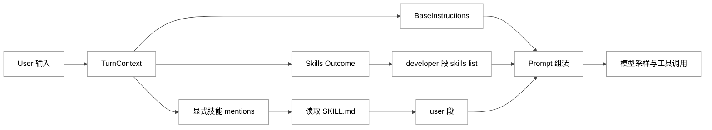
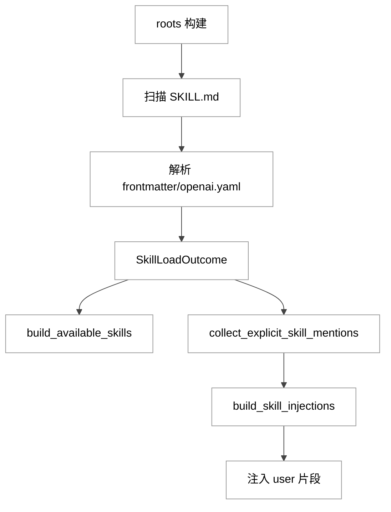
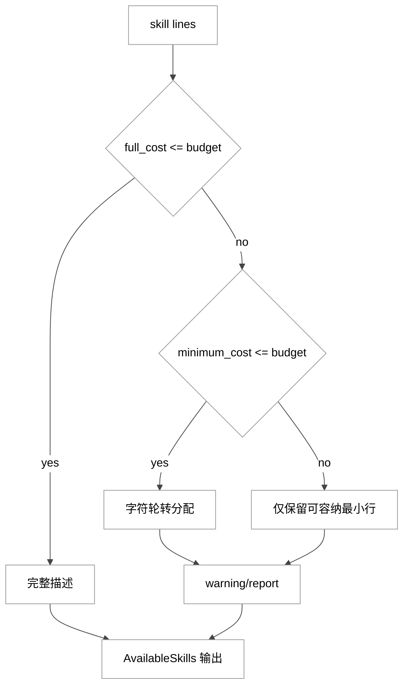
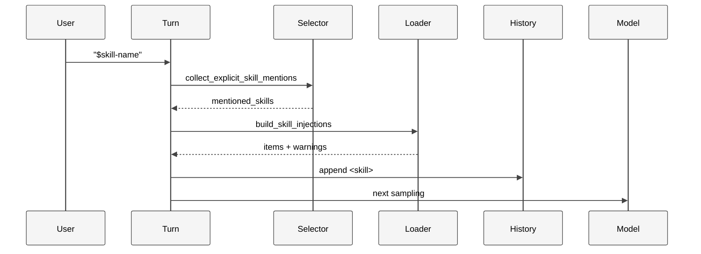
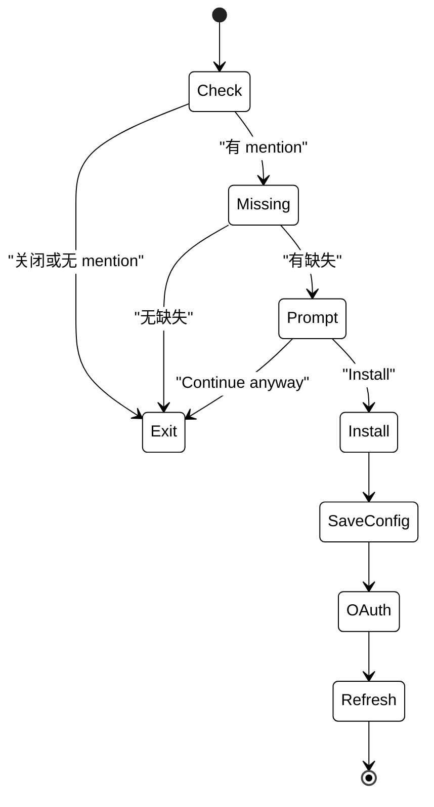

# 第 07 章：Prompt 组装与 Skill 注入

## 引言

在 Codex 体系里，Prompt 不是“一段固定系统提示词”，而是一次 turn 内动态拼装出来的复合消息结构；Skill 也不是“可复制粘贴的模板”，而是一个包含发现、筛选、预算治理、注入与依赖接线的运行时能力层。  
这一章要回答的问题是：**Codex 如何把模型能力转译成“可持续执行的工程流程能力”**，并且在上下文预算、误触发风险、生态扩展压力之间保持平衡。

你给出的核心路径是：

- `codex-rs/core/gpt_5_codex_prompt.md`
- `codex-rs/core/gpt-5.1-codex-max_prompt.md`
- `codex-rs/core/gpt-5.2-codex_prompt.md`
- `codex-rs/core-skills/src/loader.rs`
- `codex-rs/core-skills/src/render.rs`
- `codex-rs/core-skills/src/injection.rs`
- `codex-rs/skills/src/lib.rs`
- `docs/skills.md`

本章会以这些文件为主线，必要时补充调用链周边路径（`session/mod.rs`、`session/turn.rs`、`mcp_skill_dependencies.rs` 等）做闭环。

---

## 全网调研补充（近 12 个月）

> 本节用于建立社区语义背景，工程结论仍以源码实证为准。

### 1) 信息源分布与“谁在定义叙事”

过去 12 个月，围绕本章主题（system prompt / skills / skill injection）的高密度信息主要来自 4 类来源：

- **官方一手**：OpenAI 发布与开发者文档（能力定义、边界、推荐实践）
- **工程观察者**：Simon Willison 对 prompt 与 skills 的长期跟踪
- **社区争议场**：Hacker News（成本、注入风险、可用性体验）
- **中文社区**：教程和落地经验增长明显，但机制层系统讨论仍偏少

代表性链接：

- [Introducing upgrades to Codex](https://openai.com/index/introducing-upgrades-to-codex/)
- [Introducing GPT-5.3-Codex](https://openai.com/index/introducing-gpt-5-3-codex/)
- [Agent Skills (Codex Docs)](https://developers.openai.com/codex/skills/)
- [Customization (Codex Docs)](https://developers.openai.com/codex/concepts/customization)
- [GPT-5-Codex and upgrades to Codex (Simon)](https://simonwillison.net/2025/Sep/15/gpt-5-codex/)
- [OpenAI are quietly adopting skills (Simon)](https://simonwillison.net/2025/Dec/12/openai-skills/)
- [HN: Skills officially comes to Codex](https://news.ycombinator.com/item?id=46334424)
- [Issue #18770: `$skill` 注入后二次读文件歧义](https://github.com/openai/codex/issues/18770)

### 2) 社区共识

跨来源交叉后，三点共识最稳：

- **渐进式加载是必须的**：skills 元数据常驻、正文按需读取，才能控制上下文成本；
- **触发机制必须“显式优先 + 隐式兜底”**：否则要么太笨，要么误触发；
- **skills 的本质是流程工程资产化**：它们承载的是“如何做事”的团队记忆，而不是“说什么话”的 prompt 花活。

### 3) 分歧与误解

最典型的三类误读：

- **误读 A：skill 注入=把所有 SKILL.md 全文塞进系统提示**  
  实际是先注入列表，再按命中注入正文；
- **误读 B：`$name` 命中只看字符串包含**  
  实际还要过路径匹配、重名消歧、connector 冲突和禁用规则；
- **误读 C：MCP 依赖只是“文档建议”**  
  实际有依赖检测、提示安装、配置落盘、OAuth 登录与刷新流程。

### 4) 盲区

社区仍少系统讨论的点：

- prompt 快照文件与运行时 `models.json` 的关系；
- developer 段技能目录与 user 段 `<skill>` 正文的边界；
- budget 算法不是一刀切，而是字符轮转分配；
- implicit skill invocation 目前主要用于遥测，不等于自动正文注入。

---

## 七维分析

## 1. 本质是什么

### 1.1 架构定位

`Prompt 组装与 Skill 注入` 是 Codex 里的“上下文编排层”：

- 向上连接模型基座（base instructions / personality / context window）；
- 向内连接技能系统（discover / render / inject）；
- 向下连接工具执行（shell / unified exec / mcp）；
- 向侧边输出遥测（explicit/implicit invocation）。

这层的本质不是“写提示词”，而是“**约束、分配、注入、观测**”。

```rust
// codex-rs/core/src/session/mod.rs:534
// Resolve base instructions for the session. Priority order:
// 1. config.base_instructions override
// 2. conversation history => session_meta.base_instructions
// 3. base_instructions for current model
let base_instructions = config
    .base_instructions
    .clone()
    .or_else(|| conversation_history.get_base_instructions().map(|s| s.text))
    .unwrap_or_else(|| model_info.get_model_instructions(config.personality));
```

```rust
// codex-rs/core/src/session/mod.rs:2775
if turn_context.config.include_skill_instructions {
    let available_skills = build_available_skills(
        &turn_context.turn_skills.outcome,
        default_skill_metadata_budget(turn_context.model_info.context_window),
        SkillRenderSideEffects::ThreadStart {
            session_telemetry: &self.services.session_telemetry,
        },
    );
    if let Some(available_skills) = available_skills {
        let skills_instructions = AvailableSkillsInstructions::from(available_skills);
        developer_sections.push(skills_instructions.render());
    }
}
```

```rust
// codex-rs/core/src/context/skill_instructions.rs:22
impl ContextualUserFragment for SkillInstructions {
    fn role() -> &'static str {
        "user"
    }
    fn type_markers() -> (&'static str, &'static str) {
        ("<skill>", "</skill>")
    }
}
```

### 图 1：Prompt 与 Skill 双通道装配

<div style="background:#ffffff !important; background-color:#ffffff !important; padding:16px; border-radius:8px; margin:16px 0;" bgcolor="#ffffff">



</div>

---

## 2. 核心问题和痛点

从源码可见，这个模块在同时解决 5 组冲突：

- **预算冲突**：技能越多，模型可见目录越贵；
- **触发冲突**：过宽会误触发，过严会漏触发；
- **路径冲突**：资产与依赖路径必须可用且不可越界；
- **来源冲突**：repo/user/system/admin/plugin roots 要统一治理；
- **扩展冲突**：技能声明外部依赖时，用户不能每次手工接线。

```rust
// codex-rs/core-skills/src/loader.rs:112
const MAX_NAME_LEN: usize = 64;
const MAX_DESCRIPTION_LEN: usize = 1024;
const MAX_SCAN_DEPTH: usize = 6;
const MAX_SKILLS_DIRS_PER_ROOT: usize = 2000;
```

```rust
// codex-rs/core-skills/src/render.rs:17
const DEFAULT_SKILL_METADATA_CHAR_BUDGET: usize = 8_000;
const SKILL_METADATA_CONTEXT_WINDOW_PERCENT: usize = 2;
```

```rust
// codex-rs/core-skills/src/injection.rs:112
/// Complexity: `O(T + (N_s + N_t) * S)` time, `O(S + M)` space
pub fn collect_explicit_skill_mentions(...) -> Vec<SkillMetadata> {
```

### 定量快照（本地核验，2026-05-26）

- `codex-rs` crate 数：`87`（按 `codex-rs/*/Cargo.toml`）
- `core-skills/src`：`15` 个文件、`7,256` 行
- 核心 8 路径总计：`3,483` 行
  - `loader.rs`：`1,059`
  - `render.rs`：`1,512`
  - `injection.rs`：`512`
- 函数计数：
  - `loader.rs`：`27`
  - `render.rs`：`31`
  - `injection.rs`：`14`

这组量化结果说明：skills 不是“小插件功能”，而是 Codex 核心子系统之一。

---

## 3. 解决思路与方案

### 3.1 方案摘要

Codex 的核心方案可以概括为：

- **先注入可用目录**（developer 可见）
- **再注入已选正文**（user 可见）
- **最后在执行链路观测隐式调用并补依赖**

```rust
// codex-rs/core/src/context/available_skills_instructions.rs:36
fn body(&self) -> String {
    render_available_skills_body(&self.skill_root_lines, &self.skill_lines)
}
```

```rust
// codex-rs/core/src/session/turn.rs:529
let skill_items: Vec<ResponseItem> = skill_injections
    .iter()
    .map(|skill| ContextualUserFragment::into(crate::context::SkillInstructions::from(skill)))
    .collect();
```

### 图 2：Skill 发现与注入主流程

<div style="background:#ffffff !important; background-color:#ffffff !important; padding:16px; border-radius:8px; margin:16px 0;" bgcolor="#ffffff">



</div>

### 3.2 预算算法是“分层退化”

`render.rs` 在预算压力下采用三层退化策略：

1. 能放下全部描述：全保留；
2. 放不下全量但放得下最小行：描述字符轮转分配；
3. 最小行都放不下：只保留部分最小行并输出 warning/report。

```rust
// codex-rs/core-skills/src/render.rs:324
fn render_skill_lines_from_lines(...) -> (Vec<String>, SkillRenderReport) {
    let full_cost = ...
    if full_cost <= budget.limit() { ... }
    let minimum_cost = ...
    if minimum_cost <= budget.limit() { ... }
    render_minimum_skill_lines_until_budget(budget, skill_lines, total_count)
}
```

```rust
// codex-rs/core-skills/src/render.rs:596
// Distribute description space one character at a time across skills.
loop {
    // 字符轮转分配，优先保证“每个 skill 至少可见”
}
```

### 图 3：预算裁剪逻辑

<div style="background:#ffffff !important; background-color:#ffffff !important; padding:16px; border-radius:8px; margin:16px 0;" bgcolor="#ffffff">



</div>

---

## 4. 实现细节关键点

### 4.1 Prompt 源头：快照文件 vs 运行 catalog

你指定的三份 prompt 文件都存在，且 `gpt-5.1` 与 `gpt-5.2` 当前一致，`gpt_5` 少了 frontend 段。

```md
// codex-rs/core/gpt-5.1-codex-max_prompt.md:33
## Frontend tasks
When doing frontend design tasks, avoid collapsing into "AI slop" ...
```

运行时模型 catalog 由 `models-manager` 内嵌的 `models.json` 提供，且在 release workflow 里定时更新：

```rust
// codex-rs/models-manager/src/lib.rs:12
pub fn bundled_models_response()
-> std::result::Result<codex_protocol::openai_models::ModelsResponse, serde_json::Error> {
    serde_json::from_str(include_str!("../models.json"))
}
```

```yaml
# .github/workflows/rust-release-prepare.yml:30
- name: Update models.json
  run: |
    url="${base_url%/}/models?client_version=${client_version}"
    curl --http1.1 --fail --show-error --location "${headers[@]}" "${url}" | jq '.' > codex-rs/models-manager/models.json
```

结论：仓内 prompt 快照更偏“可读资产”，`models.json` 更接近“运行事实”。

### 4.2 roots 构建与扫描边界

```rust
// codex-rs/core-skills/src/loader.rs:251
async fn skill_roots_with_home_dir(...) -> Vec<SkillRoot> {
    let mut roots = skill_roots_from_layer_stack_inner(...);
    roots.extend(plugin_skill_roots.into_iter().map(...));
    roots.extend(repo_agents_skill_roots(...).await);
    dedupe_skill_roots_by_path(&mut roots);
    roots
}
```

```rust
// codex-rs/core-skills/src/loader.rs:494
if depth > MAX_SCAN_DEPTH { return; }
if visited_dirs.len() >= MAX_SKILLS_DIRS_PER_ROOT {
    *truncated_by_dir_limit = true;
    return;
}
```

这两段定义了“可发现性上限”和“性能安全阀”。

### 4.3 解析策略：前门严格，旁路宽容

```rust
// codex-rs/core-skills/src/loader.rs:623
let frontmatter = extract_frontmatter(&contents).ok_or(SkillParseError::MissingFrontmatter)?;
let parsed: SkillFrontmatter =
    serde_yaml::from_str(&frontmatter).map_err(SkillParseError::InvalidYaml)?;
```

```rust
// codex-rs/core-skills/src/loader.rs:705
// Fail open: optional metadata should not block loading SKILL.md.
let Some(skill_dir) = skill_path.parent() else {
    return LoadedSkillMetadata::default();
};
```

即：`SKILL.md` 必须靠谱，`openai.yaml` 可以降级。

### 4.4 developer 与 user 的注入边界

```rust
// codex-rs/core/src/context/available_skills_instructions.rs:24
fn role() -> &'static str { "developer" }
```

```rust
// codex-rs/core/src/context/skill_instructions.rs:23
fn role() -> &'static str { "user" }
```

```rust
// codex-rs/core/src/context/skill_instructions.rs:35
fn body(&self) -> String {
    format!(
        "\n<name>{}</name>\n<path>{}</path>\n{}\n",
        self.name, self.path, self.contents
    )
}
```

边界意义：目录是策略、正文是执行上下文。

### 4.5 显式命中优先级与消歧

```rust
// codex-rs/core-skills/src/injection.rs:145
if let Some(skill) = selection_context
    .skills
    .iter()
    .find(|skill| skill.path_to_skills_md == path)
{
    selected.push(skill.clone());
}
```

```rust
// codex-rs/core-skills/src/injection.rs:388
if skill_count != 1 || connector_count != 0 {
    continue;
}
```

路径精确命中优先于名称模糊命中，是避免误注入的核心。

### 4.6 implicit invocation：更像观测信号

```rust
// codex-rs/core/src/tools/handlers/shell/shell_command.rs:169
maybe_emit_implicit_skill_invocation(...).await;
```

```rust
// codex-rs/core-skills/src/invocation_utils.rs:37
if let Some(candidate) = detect_skill_script_run(...) {
    return Some(candidate);
}
detect_skill_doc_read(...)
```

```rust
// codex-rs/core/src/skills.rs:89
turn_context.session_telemetry.counter(
    "codex.skill.injected",
    1,
    &[("status", "ok"), ("skill", skill_name.as_str()), ("invoke_type", "implicit")],
);
```

这条链路目前重点是 telemetry/analytics，不是“自动注入 skill 正文”。

### 4.7 MCP 依赖安装闭环

```rust
// codex-rs/core/src/mcp_skill_dependencies.rs:34
pub(crate) async fn maybe_prompt_and_install_mcp_dependencies(...) {
```

```rust
// codex-rs/core/src/mcp_skill_dependencies.rs:226
let question = RequestUserInputQuestion {
    id: SKILL_MCP_DEPENDENCY_PROMPT_ID.to_string(),
    header: "Install MCP servers?".to_string(),
    question: format!(
        "The following MCP servers are required by the selected skills but are not installed yet: {server_list}. Install them now?"
    ),
    // Install / Continue anyway
};
```

```rust
// codex-rs/core/src/mcp_skill_dependencies.rs:430
for tool in &dependencies.tools {
    if !tool.r#type.eq_ignore_ascii_case("mcp") {
        continue;
    }
    // 收集缺失并转成 server config
}
```

这使 skills 从“文本流程包”升级为“可执行能力包”。

### 图 4：显式 Skill 注入时序

<div style="background:#ffffff !important; background-color:#ffffff !important; padding:16px; border-radius:8px; margin:16px 0;" bgcolor="#ffffff">



</div>

### 图 5：MCP 依赖安装状态机

<div style="background:#ffffff !important; background-color:#ffffff !important; padding:16px; border-radius:8px; margin:16px 0;" bgcolor="#ffffff">



</div>

---

## 5. 易错点和注意事项

### 5.1 为什么不触发

常见根因是配置与冲突，而非模型能力不足：

- `skills.config` 把该 skill 禁用了；
- 名称冲突或 connector slug 冲突；
- path 没对上真实 `path_to_skills_md`。

```rust
// codex-rs/core-skills/src/config_rules.rs:71
pub fn resolve_disabled_skill_paths(
    skills: &[SkillMetadata],
    rules: &SkillConfigRules,
) -> HashSet<AbsolutePathBuf> {
```

### 5.2 描述被截断不等于看不见 skill

```rust
// codex-rs/core-skills/src/render.rs:21
pub const SKILL_DESCRIPTION_TRUNCATED_WARNING: &str =
"Skill descriptions were shortened to fit the skills context budget. Codex can still see every skill, but some descriptions are shorter. ...";
```

### 5.3 路径越界会被拒绝

```rust
// codex-rs/core-skills/src/loader.rs:912
tracing::warn!("ignoring {field}: icon path must be under assets/");
```

### 5.4 docs 外置导致离线理解成本上升

```md
// docs/skills.md:1
# Skills
For information about skills, refer to [this documentation](https://developers.openai.com/codex/skills).
```

---

## 6. 竞品对比（Claude Code / Opencode / Aider / Goose / Continue）

> 这里做“机制对位”，不做主观排名。

### 6.1 比较维度

- 是否有“目录可见 + 正文按需”的二段注入；
- 是否具备冲突消解与预算治理；
- 是否支持从 skill 依赖声明到工具配置接线。

### 6.2 对位结论

- **Codex**：最突出的是双通道注入和预算算法体系化，且把 MCP 依赖安装打进主流程；
- **Claude Code（公开资料）**：同样重视 skills 与项目指令，但开源代码可审计颗粒度与 Codex 有差异；
- **Opencode（公开资料）**：强调组合式 agent 工作流，灵活性高，稳定语义仍在快速演进；
- **Aider / Goose / Continue**：普遍更偏扩展接线与工作流驱动，不以“技能目录预算化渲染”作为主架构。

工程意义：Codex 更像“可治理能力平台”，而不只是“会写代码的聊天壳”。

---

## 7. 仍存在的问题和缺陷

### 7.1 多源提示词的一致性风险

`gpt_5*.md`、template、`models.json`、远端 `/models` 多源并存，存在认知与运行偏差风险。

### 7.2 规模化后的可解释性压力

当 skill 数量继续增长，“为什么触发/为什么没触发”的排障复杂度会明显上升。

### 7.3 安全治理仍需组织补位

路径校验、预算裁剪、依赖确认都在做减伤，但 skill 来源信任与供应链审计仍是组织问题。

### 7.4 implicit 语义对用户不够直观

当前 implicit 更偏遥测事件，不是自动正文注入。UI 若不明确提示，容易造成心智误差。

---

## 小结

这一章的核心结论有三条：

1. **Prompt 组装是运行时编排，不是静态文本拼接。**  
   `base_instructions`、skills list、skill 正文与工具历史在 turn 内动态合成。

2. **Skill 注入是系统工程，不是提示词技巧。**  
   它覆盖发现、预算、注入、消歧、依赖接线、观测六个环节。

3. **真正挑战在规模化治理。**  
   预算上限、冲突规则、路径安全、依赖自动化与文档一致性，决定了 Codex 在企业与长期会话场景的可持续性。

对《Codex 源码深度研究》全书而言，本章处在“模型能力”与“组织流程能力”之间的关键转换带：看起来不是最花哨，却决定了系统能不能长期稳定地把能力落到工程现实。

