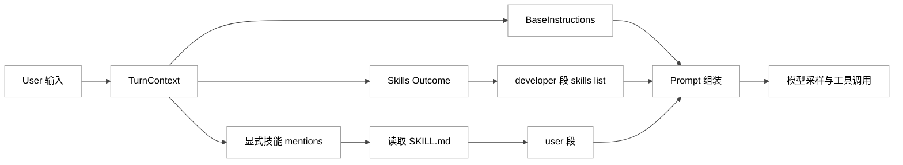
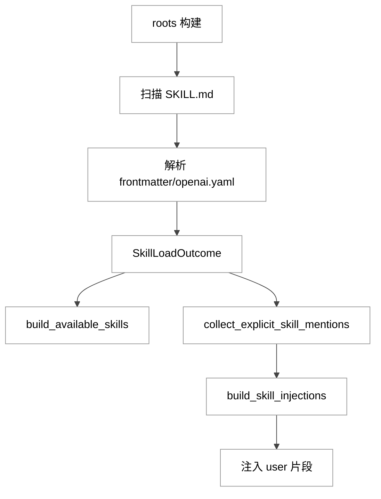
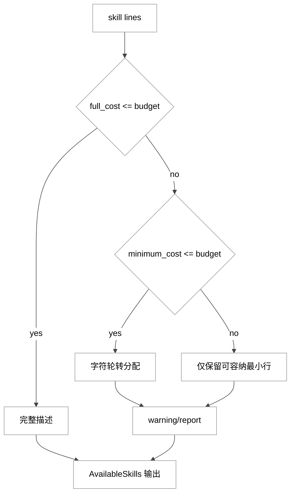
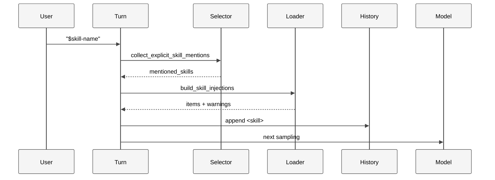
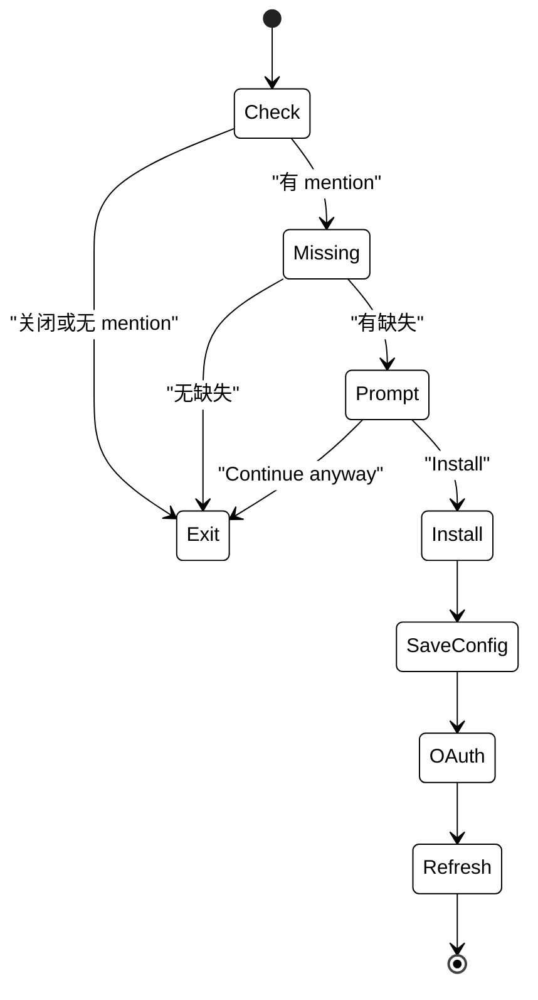

# 第 07 章：Prompt 组装与 Skill 注入

## 引言

在 Codex 体系里，Prompt 并不是“一段固定的系统提示词”，而是一次 turn 内动态拼装出来的复合消息结构；Skill 也不是“可复制粘贴的模板”，而是一个包含发现、筛选、预算治理、注入与依赖接线的运行时能力层。
这一章想回答的问题是：**Codex 如何把模型能力转译成“可持续执行的工程流程能力”**，又是怎样在上下文预算、误触发风险与生态扩展压力之间寻找平衡。

本章的源码主线如下（均以 `/Users/hexiaonan/workspace/formless/refer/codex/` 为根路径）：

- `codex-rs/core/gpt_5_codex_prompt.md`
- `codex-rs/core/gpt-5.1-codex-max_prompt.md`
- `codex-rs/core/gpt-5.2-codex_prompt.md`
- `codex-rs/core-skills/src/loader.rs`
- `codex-rs/core-skills/src/render.rs`
- `codex-rs/core-skills/src/injection.rs`
- `codex-rs/skills/src/lib.rs`
- `docs/skills.md`

讨论时必要会引入周边调用链路径（`session/mod.rs`、`session/turn.rs`、`mcp_skill_dependencies.rs`、`context/skill_instructions.rs` 等）做闭环。

---

## 全网调研补充（近 12 个月）

> 本节用于建立社区语义背景，工程结论仍以源码实证为准。

### 1) 信息源分布与“谁在定义叙事”

过去 12 个月，围绕本章主题（system prompt / skills / skill injection）的高密度信息主要来自 4 类来源：

- **官方一手**：OpenAI 发布与开发者文档（能力定义、边界、推荐实践）
- **工程观察者**：Simon Willison 对 prompt 与 skills 的长期跟踪
- **社区争议场**：Hacker News（成本、注入风险、可用性体验）
- **中文社区**：教程和落地经验增长明显，但机制层系统讨论仍偏少

代表性链接：

- [Introducing upgrades to Codex](https://openai.com/index/introducing-upgrades-to-codex/)
- [Introducing GPT-5.3-Codex](https://openai.com/index/introducing-gpt-5-3-codex/)
- [Agent Skills (Codex Docs)](https://developers.openai.com/codex/skills/)
- [Customization (Codex Docs)](https://developers.openai.com/codex/concepts/customization)
- [GPT-5-Codex and upgrades to Codex (Simon)](https://simonwillison.net/2025/Sep/15/gpt-5-codex/)
- [OpenAI are quietly adopting skills (Simon)](https://simonwillison.net/2025/Dec/12/openai-skills/)
- [HN: Skills officially comes to Codex](https://news.ycombinator.com/item?id=46334424)
- [Issue #18770: `$skill` 注入后二次读文件歧义](https://github.com/openai/codex/issues/18770)

### 2) 社区共识

跨来源交叉后，三点共识比较稳定：

- **渐进式加载是必要的**：skills 元数据常驻、正文按需读取，才能控制上下文成本；
- **触发机制宜“显式优先 + 隐式兜底”**：否则要么太笨，要么误触发；
- **skills 的本质更接近“流程工程资产化”**：它们承载的是“如何做事”的团队记忆，而不是“说什么话”的 prompt 花活。

### 3) 分歧与误解

最典型的三类误读：

- **误读 A：skill 注入＝把所有 `SKILL.md` 全文塞进系统提示**
  实际是先注入列表（developer 段），再按命中注入正文（user 段）。
- **误读 B：`$name` 命中只看字符串包含**
  实际还要过路径匹配、重名消歧、connector 冲突以及禁用规则。
- **误读 C：MCP 依赖只是“文档建议”**
  实际有依赖检测、提示安装、配置落盘、OAuth 登录与刷新流程。

### 4) 盲区

社区目前比较少系统讨论的点：

- 仓内 prompt 快照文件与运行时 `models.json` 的关系；
- developer 段技能目录与 user 段 `<skill>` 正文的边界；
- budget 算法不是一刀切，而是字符轮转分配；
- implicit skill invocation 当前主要用于遥测，并不等同于自动正文注入。

---

## 七维分析

## 1. 本质是什么

### 1.1 架构定位

`Prompt 组装与 Skill 注入` 可以理解为 Codex 中的“上下文编排层”：

- 向上对接模型基座（base instructions / personality / context window）；
- 向内对接技能系统（discover / render / inject）；
- 向下对接工具执行（shell / unified exec / mcp）；
- 向侧输出遥测（explicit / implicit invocation）。

这层做的事情，更准确地说是“**约束、分配、注入、观测**”，而不是“写提示词”。

```rust
// codex-rs/core/src/session/mod.rs:534
// Resolve base instructions for the session. Priority order:
// 1. config.base_instructions override
// 2. conversation history => session_meta.base_instructions
// 3. base_instructions for current model
let base_instructions = config
    .base_instructions
    .clone()
    .or_else(|| conversation_history.get_base_instructions().map(|s| s.text))
    .unwrap_or_else(|| model_info.get_model_instructions(config.personality));
```

```rust
// codex-rs/core/src/session/mod.rs:2775
if turn_context.config.include_skill_instructions {
    let available_skills = build_available_skills(
        &turn_context.turn_skills.outcome,
        default_skill_metadata_budget(turn_context.model_info.context_window),
        SkillRenderSideEffects::ThreadStart {
            session_telemetry: &self.services.session_telemetry,
        },
    );
    if let Some(available_skills) = available_skills {
        let skills_instructions = AvailableSkillsInstructions::from(available_skills);
        developer_sections.push(skills_instructions.render());
    }
}
```

```rust
// codex-rs/core/src/context/skill_instructions.rs:22
impl ContextualUserFragment for SkillInstructions {
    fn role() -> &'static str {
        "user"
    }
    // ...
    fn type_markers() -> (&'static str, &'static str) {
        ("<skill>", "</skill>")
    }
    // ...
}
```

从这三段可见：base instructions 走的是“覆盖优先 + 历史回放 + 模型兜底”的三级选择；skills 列表通过 `developer` 角色注入，skills 正文则以 `<skill>` 标签包裹、走 `user` 角色注入。一个 turn 内同时存在多种来源、多种角色的片段，由 `Prompt 组装与 Skill 注入` 这层负责把它们拼成一份对模型可见的“当前上下文”。

### 图 1：Prompt 与 Skill 双通道装配

<div style="background:#ffffff !important; background-color:#ffffff !important; padding:16px; border-radius:8px; margin:16px 0;" bgcolor="#ffffff">



</div>

---

## 2. 核心问题和痛点

从源码看，这一模块在同时缓解 5 组相互牵扯的冲突：

- **预算冲突**：可见的 skill 越多，模型每轮可见目录的成本越高；
- **触发冲突**：判定过宽会误触发，判定过严会漏触发；
- **路径冲突**：资产与依赖路径既要可用、又不能越界；
- **来源冲突**：repo/user/system/admin/plugin roots 必须统一治理；
- **扩展冲突**：技能声明外部依赖时，用户不应每次手工接线。

```rust
// codex-rs/core-skills/src/loader.rs:112
const MAX_NAME_LEN: usize = 64;
const MAX_DESCRIPTION_LEN: usize = 1024;
// ...
const MAX_SCAN_DEPTH: usize = 6;
const MAX_SKILLS_DIRS_PER_ROOT: usize = 2000;
```

```rust
// codex-rs/core-skills/src/render.rs:17
const DEFAULT_SKILL_METADATA_CHAR_BUDGET: usize = 8_000;
const SKILL_METADATA_CONTEXT_WINDOW_PERCENT: usize = 2;
```

```rust
// codex-rs/core-skills/src/injection.rs:115
pub fn collect_explicit_skill_mentions(
    inputs: &[UserInput],
    skills: &[SkillMetadata],
    disabled_paths: &HashSet<AbsolutePathBuf>,
    connector_slug_counts: &HashMap<String, usize>,
) -> Vec<SkillMetadata> {
```

这三组常量与签名其实就是上述五组冲突的“制动器”：长度和深度兜上限、字符预算兜增长、命中函数本身需要同时考虑 `disabled_paths` 与 `connector_slug_counts`，否则就会出现误触发或越权读盘。

更直白地说，痛点的本质是“无限增长的能力声明 vs 有限的上下文与有限的用户耐心”。一旦没有这些上限，常见后果有两种：要么 prompt 中塞入大量重复或低信号的 skill 描述，挤掉真正与本轮任务相关的内容；要么模型把含 `$` 字符的随手注释误识别为技能调用，产生不应该出现的副作用。预算治理、命名消歧、依赖确认这三件事，本质上都是把“能力扩展性”和“运行稳定性”的张力显式拉到代码里讨论。

### 定量快照（本地核验，2026-05-26）

- `codex-rs` 子 crate 数：约 `87`（按 `find codex-rs -maxdepth 2 -name Cargo.toml` 去掉 workspace 自身后得到）。
- `core-skills/src` 总计：`15` 个文件、`7,256` 行。
- 章节主线 8 个文件合计：`3,483` 行
  - `gpt_5_codex_prompt.md`：`68`
  - `gpt-5.1-codex-max_prompt.md`：`80`
  - `gpt-5.2-codex_prompt.md`：`80`
  - `core-skills/src/loader.rs`：`1,059`
  - `core-skills/src/render.rs`：`1,512`
  - `core-skills/src/injection.rs`：`512`
  - `skills/src/lib.rs`：`169`
  - `docs/skills.md`：`3`
- 顶层 `fn` 计数（不含嵌套闭包，`^(pub|pub\(crate\))?\s*(async\s+)?fn` 粗筛）：
  - `loader.rs`：约 `29`
  - `render.rs`：约 `31`
  - `injection.rs`：约 `15`

这组量化结果至少能说明一点：在 Codex 仓库里，skills 不是“可有可无的插件”，而是一个被以独立 crate 形式拆分、并由两位数量级文件支撑的核心子系统。

---

## 3. 解决思路与方案

### 3.1 方案摘要

Codex 的整体方案可以概括为三步：

- **先注入可用目录**（developer 可见，描述 + 路径）
- **再按命中注入正文**（user 可见，`<skill>` 包裹）
- **最后在执行链路观测隐式调用并补依赖**

```rust
// codex-rs/core/src/context/available_skills_instructions.rs:36
fn body(&self) -> String {
    render_available_skills_body(&self.skill_root_lines, &self.skill_lines)
}
```

```rust
// codex-rs/core/src/session/turn.rs:529
let skill_items: Vec<ResponseItem> = skill_injections
    .iter()
    .map(|skill| ContextualUserFragment::into(crate::context::SkillInstructions::from(skill)))
    .collect();
```

也就是说，目录的渲染由 `render_available_skills_body` 收口，正文的注入由 `SkillInstructions::from(skill)` 这条路径收口。两条路径互不相干、但共享一份 `SkillLoadOutcome`，这让“能不能看到”与“是否真的注入正文”可以分别治理。

### 图 2：Skill 发现与注入主流程

<div style="background:#ffffff !important; background-color:#ffffff !important; padding:16px; border-radius:8px; margin:16px 0;" bgcolor="#ffffff">



</div>

### 3.2 预算算法是“分层退化”

`render.rs` 在预算压力下采用三层退化策略：

1. 全量描述能放下：全保留；
2. 全量放不下但“最小行”能放下：在最小行之上按字符轮转分配描述空间；
3. 连最小行都放不下：只保留部分最小行并输出 warning/report。

```rust
// codex-rs/core-skills/src/render.rs:324
fn render_skill_lines_from_lines(
    skill_lines: Vec<SkillLine<'_>>,
    total_count: usize,
    budget: SkillMetadataBudget,
) -> (Vec<String>, SkillRenderReport) {
    let full_cost = skill_lines.iter().fold(0usize, |used, line| {
        used.saturating_add(line.full_cost(budget))
    });
    if full_cost <= budget.limit() {
        // 返回全量描述
    }
    let minimum_cost = ...;
    if minimum_cost <= budget.limit() {
        // 字符轮转分配
    }
    // 仅保留可容纳的最小行
}
```

```rust
// codex-rs/core-skills/src/render.rs:596
// Distribute description space one character at a time across skills.
// Short descriptions naturally drop out, so their unused share can go to
// longer descriptions instead of being stranded in a fixed per-skill quota.
loop {
    // 字符轮转分配，优先保证“每个 skill 至少可见”
}
```

这种“逐字符让步”的写法看起来繁琐，但好处是：短描述自然先停止增长，省下的额度自动让给长描述，不会出现“每个 skill 都拿到一样多的字符然后一起被砍”这种均贫不公的情况。从结果上看，模型仍然能感知到“有哪些 skill 存在”，只是某些 skill 的描述被缩短——这与 `5.2` 节中“描述被截断不等于看不见 skill”的警告语义完全吻合。

### 图 3：预算裁剪逻辑

<div style="background:#ffffff !important; background-color:#ffffff !important; padding:16px; border-radius:8px; margin:16px 0;" bgcolor="#ffffff">



</div>

---

## 4. 实现细节关键点

### 4.1 Prompt 源头：快照文件 vs 运行 catalog

仓里指定的三份 prompt 文件都存在：`gpt-5.1-codex-max_prompt.md` 与 `gpt-5.2-codex_prompt.md` 当前都为 `80` 行，且就 frontend 段落而言两者一致；`gpt_5_codex_prompt.md` 为 `68` 行，少了相应段落。这种“多版本快照共存”更可能是为了让不同模型分支各自留有可读的基线，而不是一份在线下发的最终事实。

```md
// codex-rs/core/gpt-5.1-codex-max_prompt.md:33
## Frontend tasks
When doing frontend design tasks, avoid collapsing into "AI slop" ...
```

运行时模型 catalog 由 `models-manager` 内嵌的 `models.json` 提供，并在 release workflow 中定时刷新：

```rust
// codex-rs/models-manager/src/lib.rs:13
pub fn bundled_models_response()
-> std::result::Result<codex_protocol::openai_models::ModelsResponse, serde_json::Error> {
    serde_json::from_str(include_str!("../models.json"))
}
```

```yaml
# .github/workflows/rust-release-prepare.yml:30
- name: Update models.json
  run: |
    # ... 省略环境变量与 header 构造 ...
    url="${base_url%/}/models?client_version=${client_version}"
    curl --http1.1 --fail --show-error --location "${headers[@]}" "${url}" \
      | jq '.' > codex-rs/models-manager/models.json
```

可以这样理解：仓内 prompt 快照更偏“可读资产”，`models.json` 更接近“运行事实”。两者并存为协作和调试提供了便利，代价是“同时维护多份描述”的一致性压力。

### 4.2 roots 构建与扫描边界

```rust
// codex-rs/core-skills/src/loader.rs:251
async fn skill_roots_with_home_dir(
    fs: Option<Arc<dyn ExecutorFileSystem>>,
    config_layer_stack: &ConfigLayerStack,
    cwd: &AbsolutePathBuf,
    home_dir: Option<&AbsolutePathBuf>,
    plugin_skill_roots: Vec<PluginSkillRoot>,
) -> Vec<SkillRoot> {
    let mut roots = skill_roots_from_layer_stack_inner(...);
    roots.extend(plugin_skill_roots.into_iter().map(...));
    roots.extend(repo_agents_skill_roots(fs, config_layer_stack, cwd).await);
    dedupe_skill_roots_by_path(&mut roots);
    roots
}
```

```rust
// codex-rs/core-skills/src/loader.rs:494
if depth > MAX_SCAN_DEPTH {
    return;
}
if visited_dirs.len() >= MAX_SKILLS_DIRS_PER_ROOT {
    *truncated_by_dir_limit = true;
    return;
}
```

这两段一起定义了“可发现性的上限”和“扫描的性能安全阀”：来源被显式枚举并去重，避免不同层叠的 root 互相覆盖；扫描深度与目录数被硬性截断，避免在大型 monorepo 中陷入“全盘扫一遍 SKILL.md”的退化场景。

### 4.3 解析策略：前门严格，旁路宽容

```rust
// codex-rs/core-skills/src/loader.rs:623
let frontmatter = extract_frontmatter(&contents).ok_or(SkillParseError::MissingFrontmatter)?;
let parsed: SkillFrontmatter =
    serde_yaml::from_str(&frontmatter).map_err(SkillParseError::InvalidYaml)?;
```

```rust
// codex-rs/core-skills/src/loader.rs:705
// Fail open: optional metadata should not block loading SKILL.md.
let Some(skill_dir) = skill_path.parent() else {
    return LoadedSkillMetadata::default();
};
```

也就是说：`SKILL.md` 的 frontmatter 必须靠谱（缺失或非法 YAML 直接报错），但 `agents/openai.yaml` 这类“可选元数据”允许降级返回默认值。这种“前门严格、旁路宽容”的取舍，让生态扩展不会被旁路文件细节卡住，同时保留了对主入口的严格校验。

### 4.4 developer 与 user 的注入边界

```rust
// codex-rs/core/src/context/available_skills_instructions.rs:24
fn role() -> &'static str {
    "developer"
}
```

```rust
// codex-rs/core/src/context/skill_instructions.rs:23
fn role() -> &'static str {
    "user"
}
```

```rust
// codex-rs/core/src/context/skill_instructions.rs:35
fn body(&self) -> String {
    format!(
        "\n<name>{}</name>\n<path>{}</path>\n{}\n",
        self.name, self.path, self.contents
    )
}
```

边界意义并不抽象：`developer` 段承载“策略与可见目录”，`user` 段承载“被显式选中的执行上下文”。把两类信息放在不同 role，可以让模型在采样时区分“我可以使用什么”和“这次任务里我应该使用什么”，也方便后续审计——例如在 trace 中只回看 user 段就能知道某次 turn 真正激活了哪些 skill。

### 4.5 显式命中优先级与消歧

```rust
// codex-rs/core-skills/src/injection.rs:145
if let Some(skill) = selection_context
    .skills
    .iter()
    .find(|skill| skill.path_to_skills_md == path)
{
    selected.push(skill.clone());
}
```

```rust
// codex-rs/core-skills/src/injection.rs:388
if skill_count != 1 || connector_count != 0 {
    continue;
}
```

可以读出两层语义：当用户以结构化 `UserInput::Skill { path }` 命中时，**路径精确匹配**优先级最高；当用户只是在文本里写 `$some-name` 时，必须同时满足“该名字在 skills 列表中唯一” 且 “未与任何 connector slug 冲突”，否则不注入。这套规则比较保守，目的是把“误注入”的概率压到尽量低。

### 4.6 implicit invocation：更像观测信号

```rust
// codex-rs/core/src/tools/handlers/shell/shell_command.rs:169
maybe_emit_implicit_skill_invocation(
    session.as_ref(),
    turn.as_ref(),
    &params.command,
    &workdir,
)
.await;
```

```rust
// codex-rs/core-skills/src/invocation_utils.rs:37
if let Some(candidate) = detect_skill_script_run(outcome, tokens.as_slice(), &workdir) {
    return Some(candidate);
}
detect_skill_doc_read(outcome, tokens.as_slice(), &workdir)
```

```rust
// codex-rs/core/src/skills.rs:89
turn_context.session_telemetry.counter(
    "codex.skill.injected",
    /*inc*/ 1,
    &[
        ("status", "ok"),
        ("skill", skill_name.as_str()),
        ("invoke_type", "implicit"),
    ],
);
```

从这三段可以看到：implicit 链路的主要作用是发现“模型在 shell 里跑了某个 skill 的脚本 / 读了某个 skill 的 `SKILL.md`”这件事，并通过 telemetry 与 analytics 上报。它**没有**反向把 skill 正文注入回当前 turn 的上下文。这一点在 UI 与产品文案里若不明确，容易和 explicit 注入混为一谈。

### 4.7 MCP 依赖安装闭环

```rust
// codex-rs/core/src/mcp_skill_dependencies.rs:34
pub(crate) async fn maybe_prompt_and_install_mcp_dependencies(
    sess: &Session,
    turn_context: &TurnContext,
    cancellation_token: &CancellationToken,
    mentioned_skills: &[SkillMetadata],
    elicitation_reviewer: Option<ElicitationReviewerHandle>,
) {
```

```rust
// codex-rs/core/src/mcp_skill_dependencies.rs:227
let question = RequestUserInputQuestion {
    id: SKILL_MCP_DEPENDENCY_PROMPT_ID.to_string(),
    header: "Install MCP servers?".to_string(),
    question: format!(
        "The following MCP servers are required by the selected skills but are not installed yet: {server_list}. Install them now?"
    ),
    // Install / Continue anyway
};
```

```rust
// codex-rs/core/src/mcp_skill_dependencies.rs:430
for tool in &dependencies.tools {
    if !tool.r#type.eq_ignore_ascii_case("mcp") {
        continue;
    }
    // 收集缺失依赖并转成 server config
}
```

这一段把 skills 从“文本流程包”升级为“可执行能力包”：当显式注入的 skill 声明了 MCP 依赖、而本地尚未安装相应 server 时，会通过 `RequestUserInputQuestion` 弹出确认；用户确认后由后续步骤负责写入配置、触发 OAuth 流程。换言之，“skill 的执行环境”被纳入了主流程治理，而不是放任用户在文档里自己拼。

### 图 4：显式 Skill 注入时序

<div style="background:#ffffff !important; background-color:#ffffff !important; padding:16px; border-radius:8px; margin:16px 0;" bgcolor="#ffffff">



</div>

### 图 5：MCP 依赖安装状态机

<div style="background:#ffffff !important; background-color:#ffffff !important; padding:16px; border-radius:8px; margin:16px 0;" bgcolor="#ffffff">



</div>

---

## 5. 易错点和注意事项

### 5.1 为什么不触发

常见根因往往是配置或冲突，而不是模型能力不足。三类比较典型：

- `skills.config` 把该 skill 显式禁用了；
- 名称冲突或 connector slug 冲突（命中函数会主动跳过这类情况）；
- 用户在 `UserInput::Skill { path }` 里给出的 path 与磁盘上的 `path_to_skills_md` 没有精确匹配（例如 symlink 与真实路径之差）。

```rust
// codex-rs/core-skills/src/config_rules.rs:71
pub fn resolve_disabled_skill_paths(
    skills: &[SkillMetadata],
    rules: &SkillConfigRules,
) -> HashSet<AbsolutePathBuf> {
```

定位思路通常是：先打开 telemetry / logs，看 `collect_explicit_skill_mentions` 的输出是否为空；如果空，再检查 `disabled_paths` 与 `connector_slug_counts`；如果非空但模型没用，再核对 `SkillInjection` 是否真的被 `build_skill_injections` 渲染进 user 段。

### 5.2 描述被截断不等于看不见 skill

```rust
// codex-rs/core-skills/src/render.rs:21
pub const SKILL_DESCRIPTION_TRUNCATED_WARNING: &str =
    "Skill descriptions were shortened to fit the skills context budget. Codex can still see every skill, but some descriptions are shorter. ...";
```

这段警告很容易被误读为“某些 skill 被丢掉了”。实际情况是：在“最小行能放下”的退化路径里，**所有 skill 都仍然出现在目录中**，只是部分描述被压缩到接近最短形态。只有当连最小行都放不下时，才会出现“真正丢 skill”的情况，并以另一种警告形式呈现。

### 5.3 路径越界会被拒绝

```rust
// codex-rs/core-skills/src/loader.rs:912
tracing::warn!("ignoring {field}: icon path must be under assets/");
```

资产（如 icon）必须落在 `assets/` 目录之下，使用 `..` 越界会被忽略并打出 warning。这条规则覆盖的范围有限，但传达的态度是明确的：skill 的产物对真实文件系统的影响要被显式约束。

### 5.4 docs 外置导致离线理解成本上升

```md
// docs/skills.md:1
# Skills

For information about skills, refer to [this documentation](https://developers.openai.com/codex/skills).
```

仓内的 `docs/skills.md` 只有一句指向官网的链接。这意味着完全离线阅读时，关于 skill 的概念性介绍只能依靠源码与本章这样的二次分析。对希望在企业内网或离线环境做调研的同学，需要额外做一次“把官网文档归档下来”的工作。

---

## 6. 竞品对比（Claude Code / Opencode / Aider / Goose / Continue）

> 这里做“机制对位”，不做主观排名。下文中关于其他项目的描述基于其公开资料与历史发布说明，截至 2026-05 时点仍在演进，需要以各自最新仓库为准。

### 6.1 比较维度

- 是否提供“目录可见 + 正文按需”这种二段注入；
- 是否具备冲突消解（重名、连接器冲突、禁用）与预算治理；
- 是否支持从 skill 依赖声明到工具配置的接线闭环。

### 6.2 对位结论（基于公开信息）

- **Codex**：双通道注入与按字符轮转的预算算法在源码层面比较体系化，且把 MCP 依赖安装显式打进主流程；
- **Claude Code（基于公开文档）**：同样重视 skills 与项目指令，但其底层实现并非完全开源，机制层细节相对较难第一手核对；
- **Opencode（基于公开仓库）**：强调组合式 agent 工作流，灵活性较高，相关稳定语义仍在持续演进；
- **Aider / Goose / Continue**：更偏“扩展接线 + 工作流驱动”，目前似乎并不以“技能目录预算化渲染”作为主架构。

工程意义上的一个粗结论是：Codex 在 skills 这条线上更接近“可治理能力平台”的形态，而不只是“会写代码的聊天壳”。是否要为此付出额外的复杂度，则取决于团队的规模与跨项目复用诉求。

---

## 7. 仍存在的问题和缺陷

### 7.1 多源提示词的一致性风险

仓内 `gpt_5*.md` 快照、模板拼装结果、`models-manager` 中的 `models.json`、以及在线 `/models` 接口共四源并存。这给运营和调试带来了便利，但也带来了潜在的认知与运行偏差——例如某次 release workflow 没有跑、或某个分支的快照没及时同步，都可能让“仓里读到的 prompt”和“运行时真实下发的 instructions”出现差异。可能的改进方向是引入一条对账机制（例如启动时把 `model_info.get_model_instructions(...)` 和快照文件 hash 一同打进 trace），但目前还没有看到这样的实现。

### 7.2 规模化后的可解释性压力

当 skill 数量持续增长，“为什么这次 turn 触发了 / 没触发某个 skill”的排障复杂度会显著上升。当前依赖的主要是 telemetry counter（如 `codex.skill.injected`）与日志中的 warning，缺少一份“本轮 skills 选择决策的结构化解释”。在用户视角，这容易表现为“它怎么没用我加的那个 skill / 它怎么用了我以为禁用了的 skill”。

### 7.3 安全治理仍需组织补位

路径校验（如 4.2 中的扫描深度和 5.3 中的 assets 约束）、预算裁剪、依赖确认共同构成了减伤层。但 skill 来源的信任、供应链审计（谁写的、谁审过、是否动过）这些更上层的问题，目前仍主要交由组织流程解决，代码侧未提供完整的签名 / 校验方案。对企业部署而言，这意味着需要额外的内部治理 SOP。

### 7.4 implicit 语义对用户不够直观

如 4.6 所述，implicit invocation 目前更接近“事件感知”而不是“自动正文注入”。如果用户预期是“我跑了一次 skill 脚本，对话上下文就会自动补齐 skill 正文”，则容易产生心智落差。比较稳妥的做法是：在 UI 层用不同视觉区分 explicit 与 implicit，文案上明确告知“implicit 只用于统计与下次建议”。

---

## 小结

这一章的核心结论可以收敛为三条：

1. **Prompt 组装是运行时编排，不是静态文本拼接。**
   `base_instructions`、skills 列表、skill 正文与工具历史在 turn 内动态合成；快照文件仅是其中一段“可读资产”。

2. **Skill 注入是系统工程，不是 prompt 技巧。**
   它涵盖发现、预算、注入、消歧、依赖接线、观测六个环节，每个环节都有自己的失败模式和兜底策略。

3. **真正的挑战在规模化治理。**
   预算上限、冲突规则、路径安全、依赖自动化与文档一致性，共同决定了这套机制在企业与长期会话场景中的可持续性。

放回《Codex 源码深度研究》整本书来看，本章处在“模型能力”与“组织流程能力”之间的转换带：它未必是最显眼的一层，但很大程度上决定了系统能否长期、稳定地把模型能力落到工程现实。
