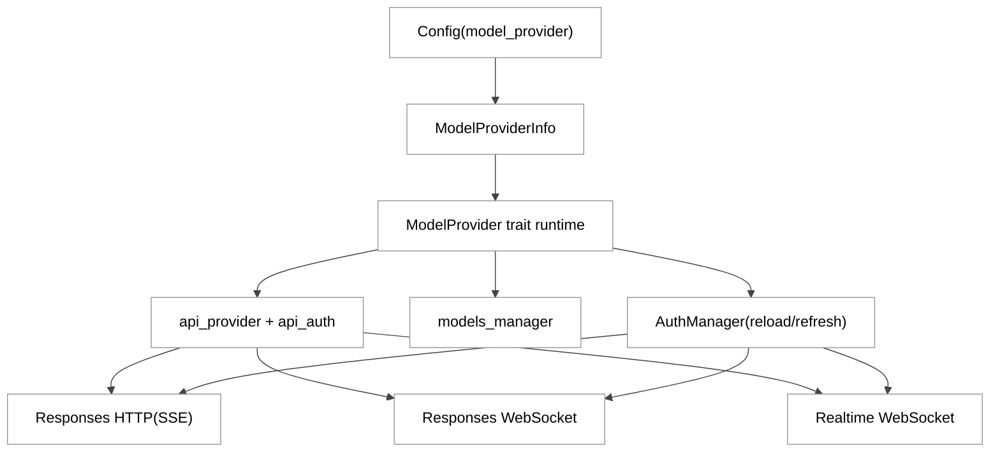
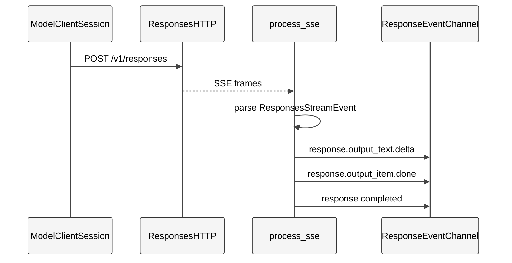
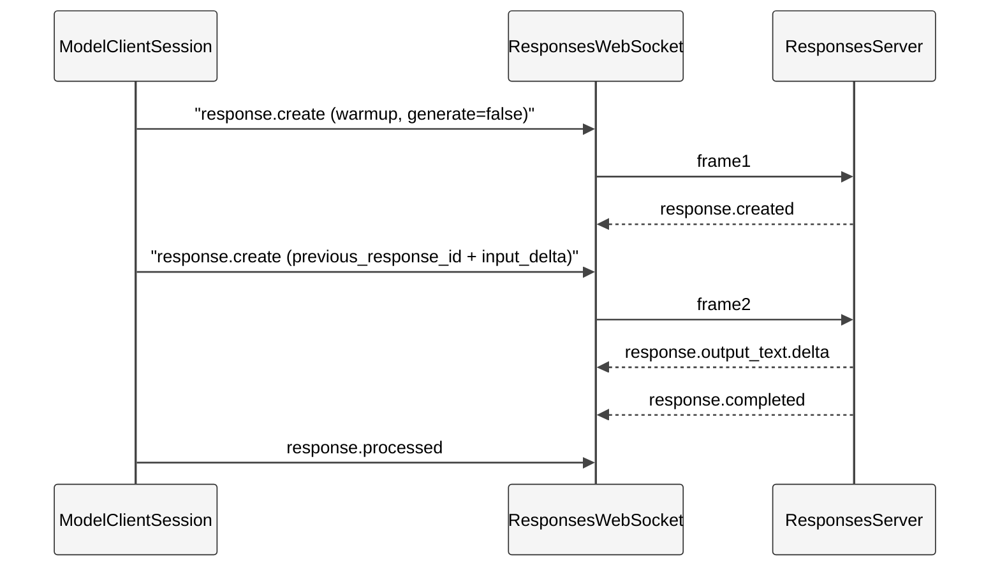
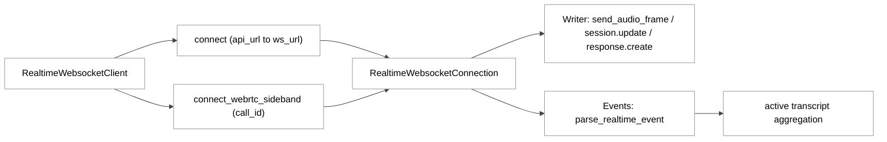
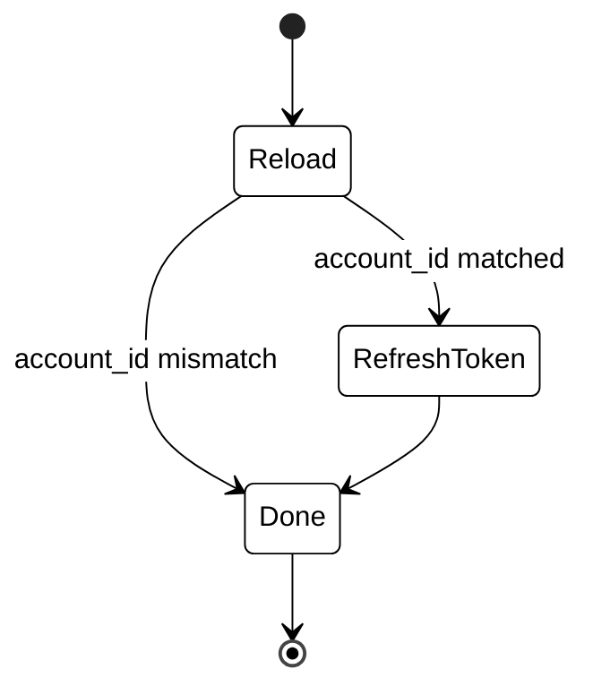
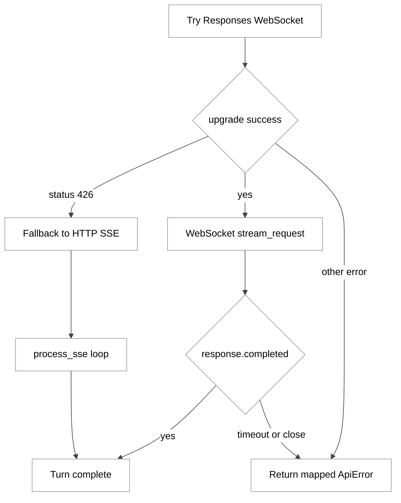

# 第 08 章：Provider 与 Responses/Realtime API

## 引言

在 Codex 的执行链路里，`Provider` 不是“配个 `base_url` 就完事”的薄配置层，而是连接 **模型后端差异**、**认证生命周期**、**协议传输形态**（HTTP SSE / Responses WebSocket / Realtime WebSocket + WebRTC）和 **会话连续性策略** 的中枢抽象。  
如果第 06 章是 Agent 核心循环，第 07 章是 Prompt/Skill 注入，那么第 08 章讨论的是：**这套循环和注入，最终如何穿过 provider 边界，落到真实 API 协议上，并在失败时可恢复**。

本章聚焦路径（含必要补充）：

- `codex-rs/model-provider/src/provider.rs`
- `codex-rs/model-provider-info/src/lib.rs`
- `codex-rs/codex-api/src/sse/responses.rs`
- `codex-rs/codex-api/src/endpoint/responses_websocket.rs`
- `codex-rs/codex-api/src/endpoint/realtime_websocket/methods.rs`
- `codex-rs/codex-client/src/default_client.rs`
- `codex-rs/login/src/auth/manager.rs`
- `codex-rs/responses-api-proxy/src/lib.rs`
- `codex-rs/realtime-webrtc/src/lib.rs`
- 补充调用链：`codex-rs/core/src/client.rs`、`codex-rs/codex-api/src/common.rs`

---

## 全网调研补充（近 12 个月）

> 本节用于建立社区认知坐标；工程结论以下文源码实证为准。

### 1) 谁在讨论这个主题

过去 12 个月，“Provider + Responses/Realtime API”这个组合话题主要由三类信息源定义：

- **OpenAI 一手工程信息**：`Speeding up agentic workflows with WebSockets in the Responses API`（2026-04）、`WebSocket mode` 文档、`Realtime with WebRTC` 文档；
- **工程观察者**：Simon Willison（Responses vs Chat Completions 的迁移语义）、Latent Space（Responses 与 Realtime 的产品分层）；
- **社区实战层**：HN 讨论串 + 中文技术平台（掘金/CSDN/36kr 等）对“Responses WebSocket 为何快、和 Realtime 的边界”进行二次解释。

代表链接（近 12 个月优先）：

- [OpenAI: Speeding up agentic workflows with WebSockets in the Responses API](https://openai.com/index/speeding-up-agentic-workflows-with-websockets/)
- [OpenAI Docs: WebSocket mode](https://developers.openai.com/api/docs/guides/websocket-mode)
- [OpenAI Docs: Realtime API with WebRTC](https://developers.openai.com/api/docs/guides/realtime-webrtc)
- [OpenAI Docs: Migrate to the Responses API](https://developers.openai.com/api/docs/guides/migrate-to-responses)
- [Simon Willison: OpenAI API - Responses vs. Chat Completions](https://simonwillison.net/2025/Mar/11/responses-vs-chat-completions/)
- [Latent Space: The new OpenAI Agents Platform](https://www.latent.space/p/openai-agents-platform)
- [HN: New tools and features in the Responses API 讨论](https://news.ycombinator.com/item?id=44053763)

### 2) 社区共识（高一致）

跨来源交叉后，四条共识最稳定：

- **Responses 已是新能力主通道**：Chat Completions 仍支持，但新 agentic 能力优先在 Responses；
- **WebSocket mode 的价值在 continuation，不只在“流式更丝滑”**：长链路工具调用（20+ tool calls）可显著降低固定开销；
- **Realtime 与 Responses 是两条 API 原语，而非替代关系**：前者偏低延迟双向音视频流，后者偏工具回路与多轮任务；
- **`previous_response_id` 是理解性能收益与语义正确性的关键参数**。

### 3) 主要分歧 / 常见误解

- **误解 A：Responses WebSocket = 把 SSE 换成 WS**  
  实际上 Codex 代码里还有 `response.processed`、增量输入裁剪、warmup `generate=false` 等额外状态语义，不是纯传输替换。
- **误解 B：Realtime WebRTC 与 Responses WebSocket 是一回事**  
  两者事件协议、连接对象、失败恢复路径都不同；Codex 甚至单独有 realtime 事件解析器与 transcript 聚合器。
- **误解 C：Provider 只是配置层**  
  源码显示 Provider 直接决定 auth manager、capabilities、remote compaction 可用性、WebSocket 是否启用。

### 4) 社区盲区（本章重点补位）

- `response.processed` 的闭环语义在社区文章里几乎不提，但在 Codex 特性开关中已显式定义；
- `AuthManager` 的 401 恢复并非“无脑 refresh”，而是带账号一致性校验的状态机；
- Responses WebSocket 握手返回头（`x-codex-turn-state`、`x-models-etag`、`openai-model`）如何回灌到上层，社区讨论很少；
- Realtime WebRTC 在仓内实现当前是 **macOS 特化**，这点在“全平台支持”讨论里常被忽略。

---

## 七维分析

## 1. 本质是什么

### 1.1 架构定位：Provider 是“后端能力契约”

`ModelProvider` trait 暴露的不仅是 `info()`，还包括：

- capabilities 上限；
- provider-scoped auth manager；
- account state；
- API provider 映射；
- runtime base URL；
- models manager 构建。

这意味着 provider 抽象的职责是：**把“配置 + 认证 + 能力 + 模型目录 + 传输前参数”收束为统一运行时契约**。

```rust
// codex-rs/model-provider/src/provider.rs:83
#[async_trait::async_trait]
pub trait ModelProvider: fmt::Debug + Send + Sync {
    fn info(&self) -> &ModelProviderInfo;
    fn capabilities(&self) -> ProviderCapabilities { ... }
    fn auth_manager(&self) -> Option<Arc<AuthManager>>;
    async fn auth(&self) -> Option<CodexAuth>;
    fn account_state(&self) -> ProviderAccountResult;
    async fn api_provider(&self) -> codex_protocol::error::Result<Provider> { ... }
    async fn runtime_base_url(&self) -> codex_protocol::error::Result<Option<String>> { ... }
    async fn api_auth(&self) -> codex_protocol::error::Result<SharedAuthProvider> { ... }
    fn models_manager(&self, codex_home: PathBuf, config_model_catalog: Option<ModelsResponse>) -> SharedModelsManager;
}
```

### 1.2 协议定位：WireApi 已收敛到 Responses

`WireApi` 当前只保留 `Responses`，并显式拒绝 `chat`。

```rust
// codex-rs/model-provider-info/src/lib.rs:52
pub enum WireApi {
    #[default]
    Responses,
}

impl<'de> Deserialize<'de> for WireApi {
    fn deserialize<D>(deserializer: D) -> Result<Self, D::Error> {
        let value = String::deserialize(deserializer)?;
        match value.as_str() {
            "responses" => Ok(Self::Responses),
            "chat" => Err(serde::de::Error::custom(CHAT_WIRE_API_REMOVED_ERROR)),
            _ => Err(serde::de::Error::unknown_variant(&value, &["responses"])),
        }
    }
}
```

这和社区“Codex 默认走 Responses 路径”的观察一致，但源码证据更强：这是 **反序列化层的硬约束**，不是文档建议。

### 图 1：Provider 到 API 运行时分层

<div style="background:#ffffff !important; background-color:#ffffff !important; padding:16px; border-radius:8px; margin:16px 0;" bgcolor="#ffffff">



</div>

---

## 2. 核心问题和痛点

### 2.1 Provider 异构冲突：认证模式与传输能力如何组合

`ModelProviderInfo` 字段多达 17 个（认证、重试、Header、WS 能力、OpenAI 登录要求等），并通过 `validate()` 做互斥检查：AWS 认证不能与 `supports_websockets` 并存，也不能再叠加 `env_key`/`auth` 等。

```rust
// codex-rs/model-provider-info/src/lib.rs:84
pub struct ModelProviderInfo {
    pub name: String,
    pub base_url: Option<String>,
    pub env_key: Option<String>,
    pub env_key_instructions: Option<String>,
    pub experimental_bearer_token: Option<String>,
    pub auth: Option<ModelProviderAuthInfo>,
    pub aws: Option<ModelProviderAwsAuthInfo>,
    pub wire_api: WireApi,
    pub query_params: Option<HashMap<String, String>>,
    pub http_headers: Option<HashMap<String, String>>,
    pub env_http_headers: Option<HashMap<String, String>>,
    pub request_max_retries: Option<u64>,
    pub stream_max_retries: Option<u64>,
    pub stream_idle_timeout_ms: Option<u64>,
    pub websocket_connect_timeout_ms: Option<u64>,
    pub requires_openai_auth: bool,
    pub supports_websockets: bool,
}
```

```rust
// codex-rs/model-provider-info/src/lib.rs:149
pub fn validate(&self) -> std::result::Result<(), String> {
    if self.aws.is_some() {
        if self.supports_websockets {
            return Err("provider aws cannot be combined with supports_websockets".to_string());
        }
        ...
    }
    ...
}
```

### 2.2 连续会话痛点：多轮工具回路不应每轮重发全量上下文

Codex 的 WS 路径把 `previous_response_id` 和增量 `input` 组合成 `response.create`，这是性能与正确性的核心折中点。

```rust
// codex-rs/codex-api/src/common.rs:216
pub struct ResponseCreateWsRequest {
    pub model: String,
    #[serde(skip_serializing_if = "String::is_empty")]
    pub instructions: String,
    #[serde(skip_serializing_if = "Option::is_none")]
    pub previous_response_id: Option<String>,
    pub input: Vec<ResponseItem>,
    ...
}
```

```rust
// codex-rs/core/src/client.rs:1069
ResponsesWsRequest::ResponseCreate(ResponseCreateWsRequest {
    previous_response_id: Some(last_response.response_id),
    input: incremental_items,
    ..payload
})
```

### 2.3 可恢复痛点：401 恢复不能破坏“同账号一致性”

`AuthManager` 不直接盲刷 token，而是：

1) guarded reload（仅当 account_id 匹配）；  
2) token authority refresh；  
3) 外部 auth 分支单独处理。

```rust
// codex-rs/login/src/auth/manager.rs:1058
// UnauthorizedRecovery is a state machine that handles an attempt to refresh the authentication when requests
// to API fail with 401 status code.
// For ChatGPT based authentication, we:
// 1. Attempt to reload the auth data from disk. We only reload if the account id matches ...
// 2. Attempt to refresh the token using OAuth token refresh flow.
```

```rust
// codex-rs/login/src/auth/manager.rs:1682
pub async fn refresh_token(&self) -> Result<(), RefreshTokenError> {
    let _refresh_guard = self.refresh_lock.acquire().await.map_err(|_| ...)?;
    let auth_before_reload = self.auth_cached();
    ...
    match self.reload_if_account_id_matches(expected_account_id.as_deref()).await {
        ReloadOutcome::ReloadedChanged => Ok(()),
        ReloadOutcome::ReloadedNoChange => self.refresh_token_from_authority_impl().await,
        ReloadOutcome::Skipped => Err(...),
    }
}
```

### 2.4 定量快照（本地核验，2026-05-26）

- `codex-rs` workspace members：`113`（`codex-rs/Cargo.toml` 解析）
- `codex-rs` 下 `Cargo.toml` 数：`120`（含 tests/common 等子目录）
- 本章 9 个主路径总计：`8,289` 行（`wc -l` 口径）
- 其中最大三文件：
  - `realtime_websocket/methods.rs`：`2,348` 行
  - `login/src/auth/manager.rs`：`1,910` 行
  - `sse/responses.rs`：`1,344` 行
- 补充传输链路：
  - `core/src/client.rs`：`2,245` 行
  - `codex-api/src/common.rs`：`311` 行
- 正则口径函数数（`fn`）：
  - `provider.rs`：`37`
  - `model-provider-info/lib.rs`：`20`
  - `responses.rs`：`54`
  - `responses_websocket.rs`：`32`
  - `realtime_websocket/methods.rs`：`79`
  - `auth/manager.rs`：`113`

这组数字说明的事实是：本章覆盖的并非 “API 调用示例层”，而是 Codex 工程量较重的基础设施区域之一。是不是 “最重” 取决于对比口径，本章不做绝对化判断。

---

## 3. 解决思路与方案

### 3.1 总体方案：同一 ProviderInfo，分三条执行面

- Responses HTTP（SSE）用于广泛兼容；
- Responses WebSocket 用于工具密集长链 continuation；
- Realtime WebSocket/WebRTC 用于低延迟语音对话与 sideband 控制。

### 3.2 Responses HTTP / SSE：事件流归一为 `ResponseEvent`

```rust
// codex-rs/codex-api/src/sse/responses.rs:263
pub fn process_responses_event(
    event: ResponsesStreamEvent,
) -> std::result::Result<Option<ResponseEvent>, ResponsesEventError> {
    match event.kind.as_str() {
        "response.output_item.done" => { ... }
        "response.output_text.delta" => { ... }
        "response.custom_tool_call_input.delta" => { ... }
        "response.reasoning_summary_text.delta" => { ... }
        "response.reasoning_text.delta" => { ... }
        "response.created" => { ... }
        "response.failed" => { ... }
        "response.incomplete" => { ... }
        "response.completed" => { ... }
        ...
    }
}
```

### 3.3 Responses WebSocket：在同 socket 上做续跑与压缩

```rust
// codex-rs/core/src/client.rs:1376
let mut ws_payload = ResponseCreateWsRequest {
    client_metadata: response_create_client_metadata(...),
    ..ResponseCreateWsRequest::from(&request)
};
if warmup {
    ws_payload.generate = Some(false);
}
...
let (mut ws_request, previous_response_id_from_untraced_warmup) =
    self.prepare_websocket_request(ws_payload, &request);
```

此外，Codex 支持在 turn 记录后主动发送 `response.processed`（特性开关控制）：

```rust
// codex-rs/features/src/lib.rs:195
/// Send `response.processed` over Responses API websockets after a turn response is recorded.
ResponsesWebsocketResponseProcessed,
```

```rust
// codex-rs/core/src/client.rs:950
pub(crate) async fn send_response_processed(&self, response_id: &str) {
    let Some(connection) = self.websocket_session.connection.as_ref() else {
        return;
    };
    if let Err(err) = connection.send_response_processed(response_id.to_string()).await {
        debug!("failed to send response.processed websocket request: {err}");
    }
}
```

### 3.4 Realtime：独立 writer/events + transcript 聚合 + sideband join

Realtime 连接对象明确拆分 `writer` 与 `events`，并在事件侧维护 active transcript 状态。

```rust
// codex-rs/codex-api/src/endpoint/realtime_websocket/methods.rs:197
pub struct RealtimeWebsocketConnection {
    writer: RealtimeWebsocketWriter,
    events: RealtimeWebsocketEvents,
}
```

```rust
// codex-rs/codex-api/src/endpoint/realtime_websocket/methods.rs:420
async fn update_active_transcript(&self, event: &mut RealtimeEvent) {
    let mut active_transcript = self.active_transcript.lock().await;
    match event {
        RealtimeEvent::InputTranscriptDelta(...) => { ... }
        RealtimeEvent::OutputTranscriptDelta(...) => { ... }
        RealtimeEvent::HandoffRequested(handoff) => { ... }
        ...
    }
}
```

同时支持基于已有 WebRTC call 的 sideband websocket 加入：

```rust
// codex-rs/codex-api/src/endpoint/realtime_websocket/methods.rs:577
pub async fn connect_webrtc_sideband(
    &self,
    config: RealtimeSessionConfig,
    call_id: &str,
    extra_headers: HeaderMap,
    default_headers: HeaderMap,
) -> Result<RealtimeWebsocketConnection, ApiError> {
    ...
}
```

### 图 2：Responses HTTP (SSE) 流程

<div style="background:#ffffff !important; background-color:#ffffff !important; padding:16px; border-radius:8px; margin:16px 0;" bgcolor="#ffffff">



</div>

### 图 3：Responses WebSocket continuation 流程

<div style="background:#ffffff !important; background-color:#ffffff !important; padding:16px; border-radius:8px; margin:16px 0;" bgcolor="#ffffff">



</div>

### 图 4：Realtime WebSocket 与 WebRTC sideband 关系

<div style="background:#ffffff !important; background-color:#ffffff !important; padding:16px; border-radius:8px; margin:16px 0;" bgcolor="#ffffff">



</div>

---

## 4. 实现细节关键点

### 4.1 Provider 实例化：默认 OpenAI-compatible，Bedrock 分支特化

```rust
// codex-rs/model-provider/src/provider.rs:148
pub fn create_model_provider(
    provider_info: ModelProviderInfo,
    auth_manager: Option<Arc<AuthManager>>,
) -> SharedModelProvider {
    if provider_info.is_amazon_bedrock() {
        Arc::new(AmazonBedrockModelProvider::new(provider_info))
    } else {
        Arc::new(ConfiguredModelProvider::new(provider_info, auth_manager))
    }
}
```

这使 provider 扩展具备“同接口、不同后端”的空间，但也意味着 Bedrock 等特化路径要承担额外实现成本。

### 4.2 Built-in provider 集合：4 个默认条目

```rust
// codex-rs/model-provider-info/src/lib.rs:409
pub fn built_in_model_providers(
    openai_base_url: Option<String>,
) -> HashMap<String, ModelProviderInfo> {
    [
        (OPENAI_PROVIDER_ID, openai_provider),
        (AMAZON_BEDROCK_PROVIDER_ID, amazon_bedrock_provider),
        (OLLAMA_OSS_PROVIDER_ID, create_oss_provider(DEFAULT_OLLAMA_PORT, WireApi::Responses)),
        (LMSTUDIO_OSS_PROVIDER_ID, create_oss_provider(DEFAULT_LMSTUDIO_PORT, WireApi::Responses)),
    ]
    .into_iter()
    .map(|(k, v)| (k.to_string(), v))
    .collect()
}
```

### 4.3 OpenAI provider 默认启用 WS，但 Bedrock 明确关闭

```rust
// codex-rs/model-provider-info/src/lib.rs:318
pub fn create_openai_provider(base_url: Option<String>) -> ModelProviderInfo {
    ModelProviderInfo {
        ...
        requires_openai_auth: true,
        supports_websockets: true,
    }
}
```

```rust
// codex-rs/model-provider-info/src/lib.rs:355
pub fn create_amazon_bedrock_provider(
    aws: Option<ModelProviderAwsAuthInfo>,
) -> ModelProviderInfo {
    ModelProviderInfo {
        ...
        requires_openai_auth: false,
        supports_websockets: false,
    }
}
```

### 4.4 远程压缩能力是 provider 级判定

```rust
// codex-rs/model-provider-info/src/lib.rs:393
pub fn supports_remote_compaction(&self) -> bool {
    self.is_openai() || is_azure_responses_provider(&self.name, self.base_url.as_deref())
}
```

### 4.5 SSE 解析：`response.completed` 是流结束判据

```rust
// codex-rs/codex-api/src/sse/responses.rs:399
pub async fn process_sse(
    stream: ByteStream,
    tx_event: mpsc::Sender<Result<ResponseEvent, ApiError>>,
    idle_timeout: Duration,
    telemetry: Option<Arc<dyn SseTelemetry>>,
) {
    ...
    let sse = match response {
        Ok(None) => {
            let error = response_error.unwrap_or(ApiError::Stream(
                "stream closed before response.completed".into(),
            ));
            let _ = tx_event.send(Err(error)).await;
            return;
        }
        Err(_) => {
            let _ = tx_event
                .send(Err(ApiError::Stream("idle timeout waiting for SSE".into())))
                .await;
            return;
        }
        ...
    };
}
```

### 4.6 SSE 错误映射：不仅是 generic stream error

```rust
// codex-rs/codex-api/src/sse/responses.rs:313
if let Some(resp_val) = event.response {
    let mut response_error = ApiError::Stream("response.failed event received".into());
    if let Some(error) = resp_val.get("error")
        && let Ok(error) = serde_json::from_value::<Error>(error.clone())
    {
        if is_context_window_error(&error) {
            response_error = ApiError::ContextWindowExceeded;
        } else if is_quota_exceeded_error(&error) {
            response_error = ApiError::QuotaExceeded;
        } ...
    }
    return Err(ResponsesEventError::Api(response_error));
}
```

### 4.7 Responses WebSocket 握手：回灌 server header 到连接状态

```rust
// codex-rs/codex-api/src/endpoint/responses_websocket.rs:471
async fn connect_websocket(
    url: Url,
    headers: HeaderMap,
    turn_state: Option<Arc<OnceLock<String>>>,
) -> Result<(WsStream, StatusCode, bool, Option<String>, Option<String>), ApiError> {
    ...
    let reasoning_included = response.headers().contains_key(X_REASONING_INCLUDED_HEADER);
    let models_etag = response.headers().get(X_MODELS_ETAG_HEADER).and_then(|v| v.to_str().ok()).map(ToString::to_string);
    let server_model = response.headers().get(OPENAI_MODEL_HEADER).and_then(|v| v.to_str().ok()).map(ToString::to_string);
    if let Some(turn_state) = turn_state
        && let Some(header_value) = response.headers().get(X_CODEX_TURN_STATE_HEADER).and_then(|v| v.to_str().ok())
    {
        let _ = turn_state.set(header_value.to_string());
    }
    ...
}
```

### 4.8 Responses WebSocket 运行时：包裹错误事件与 rate limit 事件

```rust
// codex-rs/codex-api/src/endpoint/responses_websocket.rs:601
fn map_wrapped_websocket_error_event(
    event: WrappedWebsocketErrorEvent,
    original_payload: String,
) -> Option<ApiError> {
    ...
    if let Some(error) = error.as_ref()
        && let Some(code) = error.code.as_deref()
        && code == WEBSOCKET_CONNECTION_LIMIT_REACHED_CODE
    {
        return Some(ApiError::Retryable {
            message: error.message.clone().unwrap_or_else(|| WEBSOCKET_CONNECTION_LIMIT_REACHED_MESSAGE.to_string()),
            delay: None,
        });
    }
    ...
}
```

```rust
// codex-rs/codex-api/src/endpoint/responses_websocket.rs:721
if event.kind() == "codex.rate_limits" {
    if let Some(snapshot) = parse_rate_limit_event(&text) {
        let _ = tx_event.send(Ok(ResponseEvent::RateLimits(snapshot))).await;
    }
    continue;
}
```

### 4.9 60 分钟连接上限在客户端常量中显式编码

```rust
// codex-rs/codex-api/src/endpoint/responses_websocket.rs:160
const WEBSOCKET_CONNECTION_LIMIT_REACHED_CODE: &str = "websocket_connection_limit_reached";
const WEBSOCKET_CONNECTION_LIMIT_REACHED_MESSAGE: &str = "Responses websocket connection limit reached (60 minutes). Create a new websocket connection to continue.";
```

### 4.10 Realtime Writer：发送语义与 session.update 自动首发

```rust
// codex-rs/codex-api/src/endpoint/realtime_websocket/methods.rs:283
impl RealtimeWebsocketWriter {
    pub async fn send_audio_frame(&self, frame: RealtimeAudioFrame) -> Result<(), ApiError> {
        self.send_json(&RealtimeOutboundMessage::InputAudioBufferAppend { audio: frame.data }).await
    }
    pub async fn send_response_create(&self) -> Result<(), ApiError> {
        self.send_json(&RealtimeOutboundMessage::ResponseCreate).await
    }
    pub async fn send_session_update(&self, instructions: String, session_mode: RealtimeSessionMode, output_modality: RealtimeOutputModality, voice: RealtimeVoice) -> Result<(), ApiError> {
        ...
    }
}
```

```rust
// codex-rs/codex-api/src/endpoint/realtime_websocket/methods.rs:683
connection
    .writer
    .send_session_update(
        config.instructions,
        config.session_mode,
        config.output_modality,
        config.voice,
    )
    .await?;
```

### 4.11 Realtime URL 归一化：自动补全 `/v1/realtime`

```rust
// codex-rs/codex-api/src/endpoint/realtime_websocket/methods.rs:801
fn normalize_realtime_path(url: &mut Url) {
    let path = url.path().to_string();
    if path.is_empty() || path == "/" {
        url.set_path("/v1/realtime");
        return;
    }

    if path.ends_with("/realtime") {
        return;
    }

    if path.ends_with("/realtime/") {
        url.set_path(path.trim_end_matches('/'));
        return;
    }

    if path.ends_with("/v1") {
        url.set_path(&format!("{path}/realtime"));
        return;
    }

    if path.ends_with("/v1/") {
        url.set_path(&format!("{path}realtime"));
    }
}
```

可以看到归一化策略覆盖五种路径形态：空路径、已带 `/realtime`、带 `/realtime/` 尾斜杠、以 `/v1` 结尾、以 `/v1/` 结尾。这是源码事实，背后的意图（社区常配错路径、跨环境差异）属于本章对设计动机的推测，未必是 OpenAI 内部决策原文。

### 4.12 HTTP 客户端层：默认注入 OpenTelemetry trace headers

```rust
// codex-rs/codex-client/src/default_client.rs:113
pub async fn send(self) -> Result<Response, reqwest::Error> {
    let headers = trace_headers();
    match self.builder.headers(headers).send().await {
        Ok(response) => { ... }
        Err(error) => { ... }
    }
}
```

### 4.13 认证层：`auth()` 会做 proactive refresh 判定

```rust
// codex-rs/login/src/auth/manager.rs:1426
pub async fn auth(&self) -> Option<CodexAuth> {
    if let Some(auth) = self.resolve_external_api_key_auth().await {
        return Some(auth);
    }
    let auth = self.auth_cached()?;
    if Self::is_stale_for_proactive_refresh(&auth)
        && let Err(err) = self.refresh_token().await
    {
        tracing::error!("Failed to refresh token: {}", err);
        return Some(auth);
    }
    self.auth_cached()
}
```

### 4.14 兼容层：`responses-api-proxy` 严格只转发 `/v1/responses`

```rust
// codex-rs/responses-api-proxy/src/lib.rs:170
// Only allow POST /v1/responses exactly, no query string.
let method = req.method().clone();
let url_path = req.url().to_string();
let allow = method == Method::Post && url_path == "/v1/responses";
if !allow {
    let resp = Response::new_empty(StatusCode(403));
    let _ = req.respond(resp);
    return Ok(());
}
```

### 4.15 WebRTC 实现现状：仓内 crate 当前仅 macOS 启用

```rust
// codex-rs/realtime-webrtc/src/lib.rs:71
impl RealtimeWebrtcSession {
    pub fn start() -> Result<StartedRealtimeWebrtcSession> {
        #[cfg(target_os = "macos")]
        {
            let started = native::start()?;
            ...
        }
        #[cfg(not(target_os = "macos"))]
        {
            Err(RealtimeWebrtcError::UnsupportedPlatform)
        }
    }
}
```

该 crate 总体仅约 90 行，对外暴露的就是 `RealtimeWebrtcSession::start()`、`apply_answer_sdp()`、`close()` 等少量方法。非 macOS 平台下，所有路径都会落到 `UnsupportedPlatform` 错误。需要注意的是：这只意味着 *仓内 native WebRTC 能力* 仅在 macOS 启用，并不等于 Realtime API 在其他平台不可用——Realtime WebSocket 路径仍可独立工作。

---

## 5. 易错点和注意事项

### 5.1 Provider 组合陷阱

- **AWS + WebSocket 互斥**：配置层直接报错；
- **`wire_api = "chat"` 已移除**：不是兼容警告，而是反序列化失败；
- **`requires_openai_auth` 与 `auth/env_key` 混用** 容易触发冲突校验。

### 5.2 Responses 流处理陷阱

- 以 `response.completed` 作为会话成功结束条件；连接先断会报 `stream closed before response.completed`；
- `response.failed` 会被映射到不同错误类型（quota/context_window/cyber_policy 等），不能仅按 HTTP status 判断；
- WebSocket 场景还存在包裹式 `error` payload，需要单独反序列化再映射。

### 5.3 WebSocket 生命周期陷阱

- 60 分钟上限是协议现实，必须可重连；
- 单连接串行执行 response（无多路复用），并发要多连接；
- `response.processed` 若发送失败，当前实现是 debug 记录并继续，不会中断主流程。

### 5.4 Realtime 路径陷阱

- URL 归一化依赖路径规则，`/v1`、`/v1/`、空路径处理不同；
- 事件解析分 parser 版本（V1 / RealtimeV2），边界事件（handoff/noop）在不同 parser 下行为不同；
- transcript 聚合是运行时状态，不是 server 直接返回的“最终拼接文本”。

### 5.5 Auth 恢复陷阱

- 401 恢复依赖 account_id 一致性；账号漂移时会直接 `Skipped` 并终止恢复；
- refresh 有单 permit `Semaphore` 锁，避免并发刷新踩踏；
- 对永久刷新失败会按 auth 快照缓存，后续同快照快速失败。

### 图 5：401 恢复状态机

<div style="background:#ffffff !important; background-color:#ffffff !important; padding:16px; border-radius:8px; margin:16px 0;" bgcolor="#ffffff">



</div>

### 图 6：Responses 双传输降级路径

<div style="background:#ffffff !important; background-color:#ffffff !important; padding:16px; border-radius:8px; margin:16px 0;" bgcolor="#ffffff">



</div>

---

## 6. 竞品对比（Claude Code / Opencode / Aider / Goose / Continue）

> 本节坚持“公开资料可证”的对位，不做黑箱推断。

### 6.1 对位维度

- provider/runtime 抽象是否内建且可扩展；
- 是否存在 Responses WS 这类“续跑语义”通道；
- Realtime（语音/双向流）是否有独立事件层；
- 认证失败恢复是“重试”还是“状态机”；
- 是否有协议桥接层（proxy/adapter）来兼容异构上游。

### 6.2 结论（面向工程落地）

> 下列表述仅基于公开仓库可见源码，并不涉及对各项目内部路线图的判断。

- **Codex 在本章范围内的可见特点**：provider 与 transport 在 Rust 主仓内呈现为 “强类型 + 较细的错误分类 + 一定可观测性” 的组合。`previous_response_id` 增量续跑、`response.processed`、UnauthorizedRecovery 状态机都是源码中能直接读出的工程细节，而不仅仅是文档说明。
- **Claude Code / Opencode**：从公开实现看，二者在用户体验与生态接入层各有积累；本章不就整体优劣下结论，仅指出在 “provider → transport → auth → event 分层在源码中的展开程度” 上，Codex 当前能读到的层次相对更完整。
- **Aider / Goose / Continue**：这些项目在公开实现里更突出工作流接线与多模型兼容；若按 “协议细粒度控制” 这一维度比较，Codex 当前的公开实现更接近 “平台内核型” 取向。这不是绝对评价，只是源码角度的观察，且取向本身并无优劣之分。

### 6.3 一个值得关注的差异点：Codex 在源码中体现的 “降级可解释性”

从 `core/src/client.rs` 与 `responses_websocket.rs` 可见，Codex 在 WebSocket 失败时存在明确的 fallback 或错误映射分支（`UPGRADE_REQUIRED → FallbackToHttp`、`UNAUTHORIZED → handle_unauthorized`、`websocket_connection_limit_reached → Retryable` 等），而不是统一抽象为 “网络错误重试一下”。  
对企业环境排障，这种结构上的可定位性通常有帮助：可以区分 `upgrade required`、`401`、`429`、`connection_limit`、`idle timeout` 等场景。但 “是否解释得清楚” 还取决于上层是否真正把这些枚举状态展示到运维面板，这部分本仓未给出端到端示例，不宜把它说成绝对优势。

---

## 7. 仍存在的问题和缺陷

### 7.1 协议演进约束：WireApi 单一化的收益与代价

`WireApi` 收敛到 `responses` 简化了系统复杂度，但也把兼容责任推给 adapter/proxy 层（如 `responses-api-proxy`）。  
这会在“第三方仅支持 chat/completions”场景增加迁移成本。

### 7.2 AWS + WebSocket 暂不兼容

`ModelProviderInfo::validate()` 明确拒绝 `aws + supports_websockets`。在“统一 provider 接口”层面，这是当前明显能力缺口。

### 7.3 Realtime WebRTC 跨平台尚不完整

仓内 `realtime-webrtc` crate 目前以 macOS 实现为主，非 macOS 返回 `UnsupportedPlatform`。如果要做一致的桌面体验，还需要跨平台 native 层补齐。

### 7.4 连接模型的并发能力仍受限于 socket 语义

Responses WebSocket 单连接单 in-flight response；并行需要多连接。对高并发 agent orchestration 来说，连接池与调度策略仍是上层负担。

### 7.5 路径分散带来的维护成本

Responses HTTP/SSE、Responses WebSocket、Realtime WebSocket 各自维护解析和错误映射逻辑，长期看可能需要更强的共享协议层，避免分支漂移。

---

## 补充：四条端到端路径推演（源码映射）

> 这一节不新增“抽象概念”，只做工程落地视角的逐步推演。目的有两个：  
> 第一，把前文分散在不同 crate 的实现点拼成可执行路径；  
> 第二，给后续排障和优化提供可复现的思考模板。

### 路径 A：OpenAI Provider + Responses WebSocket（标准编码任务主路径）

这是当前 Codex 在工具密集型编码任务上的典型路径。它的核心不是“首包快”，而是“第二轮、第三轮、第四轮请求越来越轻”。

**第 1 步：Provider 装配与能力宣告**

在启动阶段，`ModelProviderInfo::create_openai_provider()` 已经把 `supports_websockets` 打开，同时保留 OpenAI 组织与项目 Header 的环境变量映射。这个设计让“企业侧 metadata 注入”与“连接侧性能优化”并存，不必二选一。  
从工程角度看，很多系统一旦引入性能优化路径，会绕过原有 header 与鉴权策略，导致观测与审计信息丢失。Codex 的做法是把这些能力留在 provider 配置层统一管理，连接层只消费，而不重新定义。

**第 2 步：会话预连接（可选）**

`ModelClientSession::preconnect_websocket()` 的目标很清晰：先把连接和认证路径打通，但不提前发送 prompt。  
这一步的价值在于把“网络/TLS/升级失败”从真正推理请求里剥离出去，降低首个真实任务的长尾失败概率。  
在用户体验上，这会表现为“第一次敲命令后更快看到模型开始工作”；在工程体验上，这会表现为“握手失败可以更早暴露，不会和 prompt 构建失败混在一起”。

**第 3 步：构造 `response.create` 请求体**

`ResponseCreateWsRequest` 与 HTTP 版 `ResponsesApiRequest` 基本同形，但多了两个关键控制位：`previous_response_id` 与 `generate`。  
`generate=false` 用在 warmup 阶段，本质是“建立可复用上下文锚点而不消耗一次完整生成”；  
`previous_response_id` 用在续跑阶段，本质是“告诉服务端：请从这个响应状态继续，而不是重新拼历史”。

这里有一个非常容易被忽略的工程细节：Codex 并不盲信自己能做增量，而是会做 `baseline` 比对。只有当 `request.input` 以既有项为前缀，且满足增量条件，才会切到增量输入；否则自动退回全量请求。  
这意味着增量不是语义层“幻想优化”，而是有显式一致性校验的“机会式优化”。

**第 4 步：处理服务端事件流**

连接建立后，`run_websocket_response_stream()` 会循环读 text frame，按三层顺序处理：

1. 先尝试解析包裹错误事件（`type=error`）；
2. 再解析普通 `ResponsesStreamEvent`；
3. 再映射到统一 `ResponseEvent` 发给上层。

为什么需要第 1 层？因为 WebSocket 的错误形态既可能是普通关闭，也可能是应用层事件包裹在正常 text frame 内。  
如果只靠 `Message::Close` 或 IO error，会漏掉大量“逻辑失败但连接仍活着”的情况，例如配额、策略、升级后拒绝等。

**第 5 步：`response.completed` 后发送 `response.processed`**

前文已经提过这个机制，但这里强调它的工程意义：  
`response.processed` 不是“多余确认包”，而是把“客户端已经记录并处理本次响应”这个事实反馈给服务端。  
在长链路、可中断、可回放场景里，这类 ACK 语义非常关键，它决定了服务端是否可以安全清理某些中间状态，或者在下一次续跑时采用更激进的缓存策略。

**第 6 步：本路径的收益与代价**

收益：

- 多轮工具调用下固定开销下降；
- 连接内状态可复用，减少重复初始化；
- 事件语义统一到 `ResponseEvent`，上层逻辑不用区分 SSE 与 WS。

代价：

- 需要额外维护连接生命周期；
- 需要处理 60 分钟连接上限与重连；
- 需要维护 `previous_response_id` 与增量输入的一致性。

总结这一路径：它不是“更快的 HTTP”，而是“把请求-续跑-确认变成一个状态化协议循环”。

---

### 路径 B：自定义 Provider（无 WebSocket）+ Responses HTTP/SSE（兼容优先路径）

很多团队在接入 Codex 时，第一阶段并不会直连 OpenAI 官方端点，而是通过内部网关、代理层或第三方兼容接口。此时 `supports_websockets` 常常关闭，系统自然落到 HTTP/SSE 路径。

**第 1 步：Provider 配置收敛**

`ModelProviderInfo` 提供了 `base_url`、`query_params`、`http_headers`、`env_http_headers`、`request_max_retries`、`stream_idle_timeout_ms` 等参数。  
这套参数的价值在于：你可以在不改业务代码的前提下，对接不同上游网关，并把 header 注入、重试策略、超时策略前置到配置层。

一个典型用法是企业环境中“同一套业务逻辑，多个 region 网关切换”。  
通过 provider 配置实现切换，避免在代码中写死 endpoint 与 header 规则，可以显著降低发布风险。

**第 2 步：HTTP 客户端发送与 trace 透传**

`CodexRequestBuilder::send()` 会自动注入 `trace_headers()`。这意味着即使没有 WebSocket，HTTP 路径也保留了观测上下文。  
如果一个系统只有“功能正确”而没有“链路可追踪”，线上问题会非常难定位。Codex 在这点上是有明确工程投入的。

**第 3 步：SSE 事件解析**

`process_sse()` 读取 eventsource 流，按照 idle timeout 做超时控制；解析失败的单条事件会被跳过，不会导致整个流立刻终止。  
这种处理策略兼顾了鲁棒性和可用性：偶发脏包不至于拖垮整轮任务，但如果流整体失联（超时或提前关闭），仍然给出明确失败。

**第 4 步：语义事件归一**

`process_responses_event()` 把大量 `type` 映射成统一事件：

- 输出增量：`response.output_text.delta`
- 工具参数增量：`response.custom_tool_call_input.delta`
- 推理摘要增量：`response.reasoning_summary_text.delta`
- 完成事件：`response.completed`
- 失败事件：`response.failed` / `response.incomplete`

这一步是“API 协议语义”到“业务状态语义”的翻译层。  
如果没有这个翻译层，上层 UI、rollout、工具调度都得直接面对原始 event type，复杂度会成倍上升。

**第 5 步：失败分类**

`response.failed` 并不会都变成一个字符串错误，而是尝试分类到上下文超限、配额不足、策略拒绝、服务器过载、可重试错误等。  
这对自动化恢复策略非常关键：  
如果你把所有错误都当成“重试一次”，可能会在配额耗尽或策略拒绝时做无意义重放；  
如果你把所有错误都当成“直接失败”，又会错过瞬时抖动可恢复场景。

**第 6 步：本路径的收益与代价**

收益：

- 兼容范围广，接入门槛低；
- 与传统 HTTP 基础设施契合（网关、日志、审计工具成熟）；
- 故障模型相对团队熟悉。

代价：

- continuation 固定成本高于 WS 路径；
- 每轮请求重建开销更大；
- 长链路工具循环中，端到端延迟更容易被网络往返放大。

工程上推荐的现实策略通常是：  
先用 SSE 路径把能力跑通，再在关键链路上逐步引入 WS continuation 优化，而不是一上来就全量切换。

---

### 路径 C：Realtime 会话（语音）+ WebRTC sideband

这一条路径常被社区简化成“开个实时语音接口”，但仓内实现显示它至少包含三层：

1. Realtime WebSocket 连接与事件解析；
2. 会话级 `session.update` 与输出模态配置；
3. 与 WebRTC call 的 sideband 控制联动。

**第 1 步：URL 归一化与协议转换**

`websocket_url_from_api_url()` 会把 `http/https` 转成 `ws/wss`，并自动规整路径到 `/v1/realtime`。  
这看似细节，实际上非常关键：在多环境部署中，base URL 形态经常不一致（带不带 `/v1`、尾斜杠、代理前缀），如果没有归一化，联调成本会非常高。

**第 2 步：连接后立即 `session.update`**

Realtime 连接建立后，Codex 会马上发送 `session.update`，而不是等待业务层补发。  
这让会话从一开始就带着明确的 instructions、session_mode、output_modality、voice，避免“先裸连、再补配置”期间产生不一致行为。

**第 3 步：writer / events 分离**

`RealtimeWebsocketConnection` 把发送和接收拆为两个对象：

- writer 负责 `send_audio_frame`、`send_response_create`、`send_session_update`；
- events 负责 `next_event()`、解析 text frame、维护 active transcript。

这种分离使得上层可以把“输入驱动”和“输出消费”放在不同任务/线程里，降低耦合。

**第 4 步：active transcript 的本地聚合**

Realtime 事件是增量的，Codex 在客户端维护 transcript 聚合状态，处理：

- input/output delta 追加；
- done 事件覆盖；
- handoff 时只截取新片段；
- 去重输入片段。

这个设计的现实价值是：  
当你做“实时 UI 字幕”或“handoff 到下一个模型/代理”时，不需要每次从服务端重拉完整会话历史，客户端可以拿到稳定的局部增量视图。

**第 5 步：WebRTC sideband join**

`connect_webrtc_sideband(call_id)` 支持加入已有 WebRTC 会话的控制通道。  
这让“媒体通道”和“控制通道”可以解耦：音频走 WebRTC，控制与工具事件走 sideband websocket。  
在生产系统里，这种解耦能显著提升可运维性：媒体问题和控制问题可以分开定位，不会互相污染指标。

**第 6 步：仓内 WebRTC native 实现边界**

`realtime-webrtc` crate 当前在非 macOS 下返回 `UnsupportedPlatform`，意味着它不是“一套完全跨平台的统一实现”。  
这并不妨碍 Realtime 能力存在（因为 websocket 路径仍可用），但会影响“本地原生 WebRTC 能力是否一致”。

**第 7 步：本路径收益与代价**

收益：

- 低延迟双向交互能力；
- 更适合语音/实时协作类场景；
- sideband 模式增强了系统可控性。

代价：

- 事件模型更复杂；
- 会话状态本地聚合逻辑重；
- 跨平台一致性仍需持续建设。

---

### 路径 D：401 与凭据漂移场景（AuthManager 恢复链路）

这一条路径对“企业多端并行使用”非常关键。  
用户可能同时在 CLI、IDE、Desktop 中操作，某个端刷新 token 后，另一个端拿旧 token 继续请求，就会触发 401。  
如果恢复策略设计不好，要么造成循环失败，要么把错误用户态静默吞掉。

**第 1 步：进入 UnauthorizedRecovery 状态机**

`AuthManager::unauthorized_recovery()` 会根据当前 auth 类型选择模式：

- Managed（本地可管理 ChatGPT token）
- External（外部托管 token / API key）

这一步避免了“所有认证模式都走同一恢复流程”的错误抽象。

**第 2 步：Reload（带账号一致性）**

状态机第一步尝试 `reload_if_account_id_matches()`。  
注意这里不是单纯 `reload()`，而是先检查 account_id 是否匹配当前进程期望账号。  
如果不匹配，直接 `Skipped`，并返回明确错误而不是继续刷新。

这个设计在安全上很关键：它避免了“进程 A 在账号 X 上运行，却因为磁盘上变成账号 Y 而偷偷切账号继续执行”。

**第 3 步：RefreshToken**

如果 reload 后 auth 未变化，才进入 authority refresh。  
并且 refresh 有单 permit semaphore，避免并发请求同时刷新造成竞争写入。  
这点在高并发工具调用/多线程请求环境中非常重要。

**第 4 步：永久失败缓存**

若刷新被判定为永久失败（例如 refresh token revoked/expired/reused），系统会把失败与 auth snapshot 绑定缓存。  
后续同快照请求可快速失败，避免每次都打一次无意义网络调用。

**第 5 步：外部认证分支**

对于外部托管 auth，恢复逻辑改为调用 `ExternalAuth::refresh(context)`，并可携带 `previous_account_id`。  
这使 CLI 可以和上层宿主（比如桌面应用）形成明确边界：  
CLI 不伪造刷新策略，上层系统负责发行和轮换策略，CLI 只负责消费与回灌。

**第 6 步：为什么这条路径常被低估**

社区讨论更喜欢性能数字（快了多少），但在企业环境中，“凭据恢复一致性”往往比性能更决定可用性。  
一个 30% 更快但偶发账号漂移的系统，很难通过合规与生产评审；  
一个性能一般但恢复语义可靠的系统，反而更容易落地。

**第 7 步：本路径建议**

- 在组织层面，把 account_id 视为安全边界，而不是普通用户字段；
- 在客户端层面，给 401 恢复路径增加可观测指标（步骤、耗时、结果）；
- 在产品层面，把“恢复失败原因”清晰暴露给用户，避免“无响应式失败”。

---

### 四条路径的综合观察

把 A/B/C/D 四条路径放在一起，可以看出 Codex 当前公开实现里的一个工程取向（结论限于本章覆盖的代码范围，不排除尚未读到的子系统有不同安排）：  
**从源码组织看，它倾向于把 “模型调用” 拆成可配置、可恢复、可观测、可降级的若干层，而不是把所有复杂性塞进一个 HTTP 请求。**

具体来说：

1. Provider 层负责“能力边界 + 组合约束”；  
2. 传输层负责“语义事件 + 生命周期”；  
3. 会话层负责“上下文连续性 + 增量优化”；  
4. 认证层负责“身份一致性 + 故障恢复”；  
5. 兼容层负责“旧生态与新协议过渡”。

这五层合在一起，才构成了本章标题里的 “Provider 与 Responses/Realtime API 模式”。  
如果只看其中任意一层，比较容易得出片面结论：  
只看 provider 会觉得这是配置问题；  
只看 websocket 会觉得这是网络优化；  
只看 realtime 会觉得这是语音功能；  
只看 auth 会觉得这是登录模块。  
而源码显示的事实是：上述这些层在 Codex 仓内被串成了一条相对连续的运行时主线（“相对连续” 而非 “完美统一”，因为 SSE/WS/Realtime 各自仍保留分支逻辑，本章后文也指出了这点）。

从架构演进角度看，这条主线还有三个值得追踪的方向：

- **统一事件模型继续收敛**：减少 SSE/WS/realtime 分支的语义重复；
- **跨平台 realtime native 能力补齐**：降低“功能存在但体验不一致”的落差；
- **provider 能力声明继续细粒度化**：不仅声明“支不支持 websocket”，还声明“支持哪些续跑语义、哪些压缩与确认机制”。

最后给一个实践性的判断：  
如果目标只是 “单轮问答”，本章机制看起来会显得重；  
但如果目标是 “长链路、可审计、可恢复” 的编码代理，这一层复杂性更接近必要成本而非可选装饰。  
源码层面观察到的现象是：Codex 并没有试图消灭这层复杂性，而是尝试把它安放在带能力声明与错误分类的边界里。这是否就是 “最佳工程实践”，本章不下定论，但它至少是一种可读、可演进、可被外部团队接管的安排。

---

## 补充二：七维逐项深挖（工程决策视角）

这一节对应前文七维框架，但不再重复“是什么”，而是回答“为什么这样做、这样做在团队落地中会发生什么”。  
在大型工程里，抽象本身并不稀缺，稀缺的是“抽象与组织协作方式是否匹配”。Provider 与 API 模式正是一个典型案例。

### 一、关于“本质”的深挖：Provider 抽象到底在保护什么

很多代码库也有 provider 概念，常见实现是把 provider 做成 “URL + API key” 的别名。Codex 的做法在公开实现里看起来更重：它把 capability、auth manager、models manager、account state、remote compaction 能力都挂进了 provider 抽象。  
关于设计意图，这里只能基于源码做谨慎推测——OpenAI 团队并没有在仓内留下完整的设计文档。一个可能的解释是：把不稳定点收拢到少量可控边界，避免模型后端变化与认证形态演进直接渗透到 core session、tool runtime、UI 渲染层，从而减少 “横向污染” 风险（任何后端改动都要触达十几个子系统）。这只是从代码组织反推的合理猜测，不排除内部动机更复杂。  
从组织分工角度看，这种收敛还让团队能形成清晰责任边界：provider 团队负责“后端接入正确性”，session 团队负责“agent 行为语义”，UI 团队负责“展示和交互”。边界越清晰，发布协作越稳定。  
更重要的是，抽象不是为了遮蔽差异，而是为了“可声明差异”。例如 `supports_websockets`、`supports_remote_compaction` 这些字段，不是把差异抹平，而是把差异显式编码成能力声明。声明越明确，上层降级策略越可预期。  
在实战里，这会直接影响故障处理效率。没有能力声明时，上层只能“试一下再说”；有能力声明时，上层能在构建请求前就决定路径，不需要把错误当控制流。  
这也是为什么本章把 Provider 称为“运行时契约层”：契约的核心不是限制，而是让参与方对边界有同一解释。Codex 的实现证明了这一点：同一个 `ModelProvider` trait 既要服务 OpenAI 主路径，也要容纳 Bedrock、OSS、本地代理、命令认证等差异化后端。

### 二、关于“痛点”的深挖：长链路 agent 的真实成本结构

社区最容易观察到的指标是 token 生成速度，但在编码代理场景里，端到端耗时通常并不由 token 本身主导。真实成本结构大致由四部分组成：连接建立、上下文装载、工具回路往返、模型推理。  
当任务是 “一问一答” 时，连接与装载成本占比不高；当任务进入 “20 次以上工具调用回路” 时，这两项固定成本会被放大到不可忽略。Responses WebSocket 的意义可能就在这里：它不是让单次推理变快，而是减少每轮重复支付的固定成本。

Codex 源码对这个问题的处理可以拆成三步：先通过 `preconnect_websocket` 与 warmup（`generate=false`）降低首轮启动抖动，再通过 `previous_response_id + input delta` 降低后续轮次负担，最后通过 `response.processed`（由 `Feature::ResponsesWebsocketResponseProcessed` 控制）形成 “处理完成” 的确认事件。  
为什么需要这种确认事件？一种合理解释是：长链路系统最怕 “双方都以为对方知道”——客户端以为服务端已经确认，服务端以为客户端还在处理中，这种状态错位会在重连、重试、压缩时造成难以复盘的问题。ACK 类语义有助于缓解这种 “隐式假设”。是否还有其他原因（例如服务端缓存清理策略），源码无法直接证明，本章不再延伸。  
另一个常被低估的成本是 “失败语义成本”。如果系统把所有失败都折叠成 `network error`，工程团队会花大量时间在无效排查上。Codex 的 SSE/WS 映射链路在这方面较为细：`ContextWindowExceeded`、`QuotaExceeded`、`CyberPolicy`、`ServerOverloaded`、`Retryable` 等错误分类都直接体现在 `process_responses_event` 与 `map_wrapped_websocket_error_event` 里。这让错误处理 *可能* 更接近自动化（前提是上层确实消费这些分类），而不是完全依赖人工读日志。  
综合看，Codex 在痛点层面的可见动作更偏向 “把慢和错变得可解释、可预测、可恢复”，而不是单纯 “把速度做快”。

### 三、关于“方案”的深挖：为什么是三条 API 传输面并存

从架构洁癖角度看，很多人会倾向 “只保留一种传输路径”。但 Codex 当前维护了 Responses HTTP/SSE、Responses WebSocket、Realtime WebSocket/WebRTC 三条面。  
这并不一定是技术债——也可能是对场景现实的妥协。  
HTTP/SSE 的特点是兼容广、基础设施成熟、接入门槛低；Responses WS 的特点是支持长链路 continuation；Realtime 的特点是低延迟双向媒体与事件流。三者面向的问题空间不同，是否能强行合并、合并后是否更好，这并没有定论；至少从源码看，Codex 现阶段选择的是 “并存”。  
其中的协调机制有几条线索：  
一方面，SSE 与 WS 都倾向归一到 `ResponseEvent`；  
另一方面，session 层通过 `ModelClientSession` 对传输路径做协调；  
再加上 provider 声明能力边界，上层业务不必直接理解所有底层细节。  
这接近一种典型的平台化策略：底层多路径，中层统一语义，上层业务稳定。但是否每个细节都做到了 “统一”，则需要看后续演进——本章后文 “跨路径语义收敛” 也指出，SSE 与 WS 仍有分支重复。  
这也部分解释了为何 `core/src/client.rs` 体量较大（约 2,245 行）：它承担了多传输、多认证、多重试、多降级策略的汇合点。读者在阅读时若把它当 “请求拼装工具类”，会觉得难以理解；把它当作 “协议适配中枢”，结构会更清楚。  
一个更朴素的结论是：Codex 在这一层的复杂度，主要来源于 “要把同一会话语义落到多个协议现实里”，而不是 “代码风格”。能否组织好这种复杂度，决定了系统能不能跨协议演进。

### 四、关于“实现细节”的深挖：小机制如何积累成系统稳定性

本章出现了很多看似琐碎的小机制：路径归一化、Header 合并优先级、turn state 回灌、trace header 注入、response.processed、auth refresh 锁等。  
单看任何一个机制，都像“实现细节”；但把它们放在一起，会发现它们共同定义了系统稳定性的底线。  
例如 `normalize_realtime_path()`，很多团队会把 URL 规范性留给调用方。这样做短期省事，但长期会在多环境部署中制造大量“明明配置看起来对，实际连不上”的灰故障。Codex 把这类规范化内建到连接层，等于提前消灭了一整类环境差异问题。  
再如 `trace_headers()`，它不直接影响功能正确性，却极大影响可观测性。当线上出错时，能不能把 provider、request、response、retry、tool call 串成一条链，决定了故障是“十分钟定位”还是“一天盲猜”。  
又如 `refresh_lock` 与账号一致性校验。很多系统在 token 失效时会出现并发刷新风暴，导致状态抖动、写回覆盖、错误放大。Codex 用信号量和账号匹配规则把这类风险压到最低。  
工程实践里最常见的失败不是“没有大架构”，而是“缺少这些小机制”。Codex 的价值之一，正是把这些机制系统化，而不是零散地修 bug 式添加。  
这也是读源码时应特别关注的点：不要只看“功能入口函数”，还要看“边界条件函数”。很多真正的工程经验，藏在这些边界逻辑里。

### 五、关于“易错点”的深挖：哪些错误会被反复踩中

在团队落地中，最常见的误区不是模型参数调优，而是路径选择与能力假设错误。  
第一类错误是“能力误判”：以为 provider 支持某能力，实际上配置层已禁止。例如 AWS + websocket 组合会在 validate 阶段直接失败，这不是临时限制，而是当前实现边界。  
第二类错误是“协议误判”：把 Responses WebSocket 当成 Realtime，或者把 Realtime 当成 Responses 的“高级模式”。这会导致事件解析、重试策略、会话管理全部错位。  
第三类错误是“结束条件误判”：只收到文本增量就当成功结束，忽略 `response.completed`。这在短回复场景可能“看起来没事”，但在工具调用与推理摘要场景会留下隐性数据不一致。  
第四类错误是“认证恢复误判”：把 refresh 当成万能药。实际上账号漂移、外部 auth 模式、永久失败缓存都会改变恢复路径。  
第五类错误是“兼容代理误判”：把 `responses-api-proxy` 当通用转发器。该代理有明确的路径限制（只接受 `POST /v1/responses`），用于最小安全代理场景，不是全量 API 网关。  
这些误区的共同点是：把复杂系统当简单系统用。  
避免它们的方法不是“记更多技巧”，而是建立一套固定排障顺序：先看 provider 声明，再看传输路径，再看事件结束条件，再看认证状态机，再看代理边界。按这个顺序排查，命中率会明显提升。

### 六、关于“竞品对比”的深挖：比较什么才有意义

在社区讨论里，竞品比较经常陷入 “谁更聪明、谁更快” 的笼统结论。从工程视角，这类比较的意义有限。一些更可证伪的对比维度可以是：  
是否能在长会话下稳定续跑、是否能在失败时自动恢复、是否有清晰能力边界、是否便于跨团队协作与审计。  
按这个维度，本章对 Codex 的描述更偏向 “在公开源码里能读到的运行时协议与恢复机制相对完整”，而不是 “某个模型表现更好”。  
这并不意味着其他工具做得差——它们在公开实现层面的重点不同：有的更重交互体验，有的更重生态插件，有的更重轻量接线，各自有合理理由。  
因此本章给出的比较结论也只是 “在 Provider 与 API 模式这条轴上，Codex 的公开实现颗粒度较细、边界较清晰”，而不是 “Codex 全面领先”。在用户体验、生态、生产稳定性等其他轴上，需要单独评估，不在本章范围内。  
对于技术负责人，这个结论的价值在选型时更明显：  
如果目标是快速做一个轻量助手，本章这套较重的机制不一定需要；  
如果目标是企业级、可审计、可恢复、可持续演进的编码代理，本章机制更可能是必要投入。  
换句话说，比较应该服务于场景，而不是服务于立场。

### 七、关于“仍存问题”的深挖：下一阶段应该优先补什么

基于当前源码状态，本章认为有三组改进优先级最高。  
第一组是 **能力声明细化**。现在 `supports_websockets` 是一个布尔值，但实际能力是多维的：是否支持 continuation、是否支持 `response.processed`、是否支持 remote compaction 语义、是否支持特定错误映射。更细粒度声明会让上层策略更精准。  
第二组是 **跨路径语义收敛**。SSE 与 WS 虽已共享部分事件映射，但仍存在分支逻辑重复。随着功能继续演进，这种重复会提高维护成本。  
第三组是 **Realtime 跨平台补齐**。当前 `realtime-webrtc` 的平台边界清晰，但如果产品目标是全平台一致体验，native 层补齐是迟早要面对的问题。  
除此之外，还有一个常被忽略但非常关键的方向：**可观测性产品化**。  
Codex 现在已经有 trace header、rate limit event、明确错误映射等基础设施，下一步若能形成更统一的“会话健康度模型”，将大幅降低大规模部署的运维成本。  
从经验看，系统越复杂，越需要“先观测、后优化”。没有观测闭环，优化往往会变成局部调参，甚至制造新问题。  
因此，本章给出的路线建议是：先补语义边界与观测，再追求更激进的性能特性。性能收益可以晚一点拿，但错误边界不清会持续吞噬团队效率。

---

## 补充三：实战排障清单（按故障体感倒排）

这一节给出一份可直接落地的排障手册。它不是“理论上应该怎么做”，而是“当用户说 Codex 又慢又不稳定时，工程团队第一时间应该看什么”。  
排序依据是实战体感：先看最常见、影响最大、修复收益最高的项。

### 1) 现象：第一轮很慢，后续也没变快

优先检查三件事：

- provider 是否真的启用了 `supports_websockets`；
- 会话是否走到了 `stream_responses_websocket` 而非 `stream_responses_api`；
- `prepare_websocket_request` 是否成功构造了带 `previous_response_id` 的增量请求。

常见误区是“连接是 WebSocket，就一定有 continuation 收益”。实际上如果增量条件不满足，系统会回退到全量输入，这在日志里不一定显眼，但对端到端延迟影响很大。  
建议在会话观测里单独打出“增量命中率”指标：每轮都记一次“是否走了 previous_response_id + input delta”。没有这个指标，团队很容易把性能问题误判为模型问题。

### 2) 现象：偶发报错 `stream closed before response.completed`

这类问题不要先改重试次数，先确认“流终止条件”是否被破坏。  
在 SSE 路径，`response.completed` 是明确结束标记；如果连接提前断开，系统会给出该错误。  
引发提前关闭的原因常见有三类：上游代理超时、中间层连接回收、客户端 idle timeout 过短。  
排查建议是“双向定位”：一边看客户端是否触发 idle timeout 分支，一边看上游是否主动关闭连接或返回不完整事件序列。  
如果只在客户端侧盲目加大超时，可能掩盖上游异常；如果只在上游看状态码，又会漏掉流式中途断链。

### 3) 现象：WebSocket 运行一段时间后突然失败

先检查是否命中连接上限（60 分钟）。  
若错误码是 `websocket_connection_limit_reached`，正确动作是主动重建连接，而不是继续重试同连接。  
很多团队会把这类错误当成瞬时网络抖动，结果进入“同连接重试”死循环，既慢又放大失败次数。  
建议在会话层增加“连接年龄”指标，并在接近阈值时做预重连，避免在关键任务中段被动中断。  
这类策略在长任务（大规模重构、批量文件修改）场景尤其重要，因为中断发生在后半程时，用户体感最差。

### 4) 现象：401 之后恢复失败，且不同终端表现不一致

先判断 auth 模式：Managed 还是 External。  
Managed 模式下，系统会做账号匹配 reload 与 refresh；External 模式下，系统依赖外部 auth 提供者。  
如果多个终端同时在线，最容易出现账号漂移或 token 覆盖问题。Codex 的做法是账号不匹配就拒绝恢复，这在安全上是正确的，但在用户体感上会被理解为“为什么另一个终端可用，这个不行”。  
这时应该给出明确提示：当前会话绑定的账号与磁盘或外部刷新结果不一致，需要重新登录或切换工作区。  
不要把这种问题包装成“网络错误”，否则用户和支持团队都无法快速定位。

### 5) 现象：Realtime 会话能连上，但字幕或转录碎片化

这通常不是模型“听不懂”，而是客户端 transcript 聚合策略与事件节奏不匹配。  
Realtime 事件是增量流，`delta` 与 `done` 的组合需要本地状态机来拼接。若上层直接把每个 delta 当完整句子渲染，界面就会出现跳动、断裂、覆盖错乱。  
Codex 已在 `update_active_transcript` 中做了 force_new 与 done 覆盖逻辑，但业务侧如果绕过该聚合层直接消费原始事件，仍会出现碎片化问题。  
建议把“原始事件流”和“聚合后转录”分开存储，便于回放比对：是模型输出本身碎，还是客户端渲染策略碎。

### 6) 现象：自定义 provider 可以请求，但功能表现不完整

这里要区分“协议可达”与“能力可用”。  
很多自定义 provider 能返回文本，但不一定支持所有 Responses 事件类型、工具回路行为、错误字段格式。  
Codex 在映射层已尽量容错，但若上游语义偏差过大（例如缺关键字段或错误结构不一致），就会出现“能跑但不稳”。  
建议上线前做最小能力基线测试：  
文本 delta、tool call delta、completed、failed、rate limit、401 恢复、连接重建。  
基线不通过时，不要把问题压给用户态“偶发失败”，应该在 provider 适配层做显式降级或阻断。

### 7) 现象：代理接入后成功率上升，但功能反而退化

`responses-api-proxy` 是最小代理，优先目标是安全与可控，不是功能超集。  
当团队把它当成“万能网关”时，常会误以为任何路径都应可达，结果遇到非 `/v1/responses` 请求被 403，或者因为 header/stream 处理差异出现功能缩水。  
正确做法是：先明确代理职责边界，再按职责做验证。如果目标是通用网关，应单独建设而不是强行扩展最小代理。  
这不仅是架构问题，也是运营问题：职责不清会导致支持团队在错误链路上反复投入。

### 8) 现象：同一任务在不同机器上差异明显

优先检查三组环境差异：

- provider 配置是否一致（尤其 header/env_key/query_params）；
- 认证来源是否一致（本地 auth 文件、外部 auth、环境变量）；
- 传输路径是否一致（SSE/WS/realtime）。

真实世界里，“同一任务差异”最常见根因不是模型随机性，而是环境边界不一致。  
建议把会话启动时的关键元信息结构化落盘：provider id、wire_api、auth mode、transport、关键 feature flags。  
有了这组元信息，跨机器排障会从“猜测”变成“对照”。没有它们，团队只能靠口头回忆配置，效率极低。

### 9) 现象：线上故障修复后容易回归

这通常说明修复停留在“局部补丁”，没有沉淀到能力声明和回归测试。  
建议把本章核心边界转成自动化回归维度：

- provider 组合校验回归（aws/ws、auth 冲突等）；
- SSE 与 WS 事件映射一致性回归；
- unauthorized recovery 状态机回归；
- realtime transcript 聚合回归；
- 代理路径边界回归。

这样做的收益是把“知识”从个人经验迁移为“系统约束”。  
一旦团队规模扩大或成员流动，没有自动化约束的修复经验很快会流失，系统会重复踩坑。

### 10) 一句话排障原则

先确认边界，再确认路径，再确认状态，再确认重试。  
不要从“调参数”开始，也不要从“怀疑模型”开始。  
在 Provider 与 API 模式里，边界和路径错误往往比模型能力更常见，也更值得优先修复。

---

## 补充四：架构评审高频问答（落地版）

下面这组问答来自“把 Codex 集成进真实研发流程”时最常见的评审问题。每个回答都对应本章已有源码证据，目的是把抽象讨论转成可执行决策。

### Q1：我们能不能只保留 HTTP，彻底不用 WebSocket？

可以，但前提是你接受长链路任务的固定成本。  
如果主要场景是单轮问答或短回路工具调用，HTTP 足够稳定。  
如果场景是多轮工具执行、跨文件重构、长会话增量续跑，WebSocket 的 continuation 优势会很明显。  
因此正确决策不是二选一，而是“按任务形态分流”。

### Q2：`supports_websockets=true` 就一定该走 WebSocket 吗？

不一定。能力可用不等于策略最优。  
在网络策略严格、代理链复杂、调试可观测要求高的环境里，先走 HTTP 可能更稳。  
推荐做法是默认按 provider 声明启用 WS，但保留可观测、可回退的开关；出现稳定性问题时能快速降级，不阻塞业务。

### Q3：为什么不把 Realtime 并到 Responses WebSocket，一条链路走到底？

因为两者问题空间不同。  
Responses 更关注工具回路与任务续跑，Realtime 更关注低延迟双向媒体流和会话事件。  
强行统一会让一个接口同时承担两类复杂性，反而降低清晰度。  
Codex 当前的分层是“语义分离、能力协同”，而不是“协议合并”。

### Q4：401 恢复为什么这么复杂，直接 refresh 不行吗？

直接 refresh 在单终端实验环境看似可行，但在多终端、多账号、外部托管认证场景会制造安全与一致性问题。  
Codex 的状态机复杂度来自现实约束：需要保证账号匹配、并发安全、失败可解释。  
这类复杂度不是可选装饰，而是生产稳定性的底线投入。

### Q5：我们最应该监控哪些指标？

至少要有五类：

- 传输路径占比（HTTP vs WS vs Realtime）；
- WS 增量命中率（是否带 `previous_response_id`）；
- 流结束健康度（正常 completed vs 提前 close/timeout）；
- 401 恢复成功率与失败原因分布；
- 连接生命周期（尤其长连接年龄与重连频率）。

没有这组指标，很难判断问题在模型、协议、认证还是网络层。

### Q6：`response.processed` 不发会怎样？

短期看可能“还能跑”，长期会降低服务端状态协同能力。  
在长会话中，ACK 语义决定了服务端是否能安全推进状态管理。  
因此建议把它看成“协议完整性”而不是“可有可无的附加事件”。

### Q7：自定义 provider 最容易在哪一步踩坑？

最容易踩在“语义兼容”而非“连接可达”。  
很多上游能回文本，但不完整支持工具事件、错误结构或流结束语义，最终表现为偶发异常。  
接入前应做事件级验收，不要只做“能返回一句话”验收。

### Q8：为什么要强调 `response.completed`，我们拿到文本就能渲染了？

渲染文本不等于会话完成。  
工具调用、推理摘要、使用量统计、后续续跑锚点都依赖完整结束事件。  
跳过 completed 判断，短期会提升“看起来的响应速度”，长期会增加状态错位和回放失败概率。

### Q9：Realtime 的 transcript 为什么要本地聚合？

因为实时事件是增量流，不是完整句一次到位。  
本地聚合能支持字幕连续性、handoff 切片、去重和回放。  
如果业务层直接消费原始 delta，用户会看到“抖动式文本”，而且很难复盘。

### Q10：代理层应该做多大？

取决于职责。  
`responses-api-proxy` 的定位是最小安全代理，不是万能网关。  
如果你的目标是统一多模型协议与路由，应该单独做网关架构，不应把最小代理拉伸成全功能平台。

### Q11：Provider 抽象会不会过度设计？

是否过度设计要看变更频率与团队规模。  
当后端、认证和传输策略经常变化时，没有抽象才是高风险。  
Codex 的抽象看似厚重，但换来的是边界稳定与跨团队协作效率，在中大型系统里通常是正收益。

### Q12：我们是否应该强制所有团队都启用 WebSocket？

不建议一刀切。  
更稳妥做法是定义“默认策略 + 例外策略”：  
默认按 provider 能力启用，遇到合规/网络/观测限制时允许回落；同时持续采集收益与失败数据，逐步扩大覆盖。

### Q13：如何判断是模型问题还是协议问题？

看可复现性与失败形态：  
同 prompt 在不同传输路径表现差异大，优先查协议与会话状态；  
同路径同状态下输出质量波动，再考虑模型因素。  
排障顺序反过来会浪费大量时间。

### Q14：这套模式对小团队是否太重？

如果小团队只做内部工具、低并发、短会话，确实可以裁剪。  
但一旦进入企业流程、多人协作、审计要求、长会话任务，迟早会补回这些能力。  
提前理解边界，比后期被事故倒逼重构更划算。

### Q15：最终评估标准是什么？

不是“某次演示很快”，而是三个长期指标：

- 连续一个季度的故障可恢复性；
- 长任务场景的成功率与稳定性；
- 新 provider/新认证方式接入时的变更半径。

能在这三个指标上持续改进，才说明 Provider 与 API 模式真正落地。

---

## 补充五：上线前检查清单（可直接执行）

为了避免“文档看懂了、上线还是踩坑”，这里给一份最小可执行清单。建议在预发环境逐条勾选，而不是只做抽样验证。

1. **Provider 校验**：逐个 provider 跑 `validate` 语义检查，确认无 `aws + websocket`、`auth` 冲突、空命令等配置错误。  
2. **传输分流验证**：同一任务分别走 SSE 和 WS，确认输出事件序列可被同一上层消费，不出现分支特有崩溃。  
3. **增量续跑验证**：连续多轮工具调用，检查 `previous_response_id` 是否持续命中，且命中失败时能自动回退全量。  
4. **结束条件验证**：模拟提前断链，确认系统在无 `response.completed` 时返回明确错误而非静默成功。  
5. **认证恢复验证**：构造 401 场景，分别验证 managed/external 两种恢复路径，记录最终用户可见错误文案。  
6. **连接寿命验证**：长时间运行会话，验证连接重建策略与状态续接策略，不允许出现“重连后上下文错位”。  
7. **Realtime 聚合验证**：检查字幕/转录在 delta 与 done 事件混合场景下是否连续、无重复、无覆盖错乱。  
8. **代理边界验证**：若使用最小代理，确认非 `/v1/responses` 路径被明确拒绝，避免“隐式透传”造成安全风险。  
9. **可观测性验证**：确认 trace headers、request id、rate limit 事件、重试次数都可在日志与指标系统中串联。  
10. **回归基线固化**：把以上验证写成自动化回归任务，避免每次版本升级都靠人工记忆重复排查。

这份清单的目标不是追求“零故障”，而是保证故障出现时可定位、可恢复、可复盘。
如果团队只能先做其中一部分，建议优先落实第 3、4、5、9 条：它们分别覆盖性能收益真实性、结束语义正确性、认证恢复可靠性和观测闭环完整性。这四项一旦站稳，后续无论扩 provider 还是扩实时能力，系统都不容易失控，也更容易形成稳定的工程节奏与协作节拍。

---

## 小结

这一章可以从源码角度压缩为五条观察（均限于本章覆盖路径，不延伸到未读到的子系统）：

1. **Provider 在 Codex 当前实现里更像运行时契约层，而非纯配置容器。**  
   它直接影响认证、能力边界、模型目录与远程能力（如 remote compaction）是否可用。

2. **Responses 是当前主线协议，WebSocket 路径承担的更多是 continuation 优化，而不是简单的 “SSE 换 WS”。**  
   `previous_response_id`、增量 `input`、warmup `generate=false`、`response.processed` 共同决定了 WS 路径的真实语义。

3. **Realtime 在本仓内是独立事件系统。**  
   它拥有自己的 writer/events、active transcript 聚合、URL 归一化和 WebRTC sideband join 逻辑；并且 `realtime-webrtc` crate 当前仅在 macOS 启用，非 macOS 返回 `UnsupportedPlatform`。

4. **AuthManager 的 401 恢复机制是状态机，不是粗粒度重试。**  
   account_id 一致性校验、单 permit `refresh_lock`、永久失败快照缓存共同构成可恢复性与安全边界；同时仓内还区分了 Managed 与 External 两条恢复路径。

5. **从工程可解释性角度看，Codex 倾向于把错误细分到可定位的状态枚举。**  
   出错时能在源码层面定位是 provider 组合冲突、WebSocket 升级失败、限额、认证还是流终止条件未满足。  
   能不能 “在生产中真的把这些状态用起来”，取决于上层观测系统，源码本身无法替运维做出最终决定。本章给出的是 “基础设施已经具备这种能力” 的判断，而不是 “一定能在所有部署里发挥出来” 的承诺。

