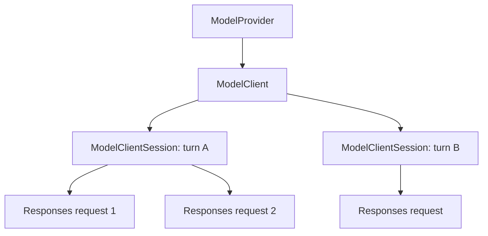
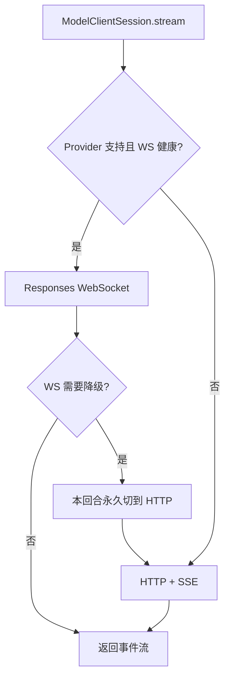

# 08｜Provider 与 API 模式：Responses、WebSocket 与 Realtime

> 源码基线：`upstream/main@283bc4cf011047314b4804c0f1ccd06e4f6a95c5`（2026-06-24）。

当前 Codex 的模型层已经不再维护 Chat Completions 与 Responses 两条并行主线。自定义兼容 Provider 也以 Responses API 为边界；`WireApi` 当前只有 `Responses`，配置 `"chat"` 会在反序列化阶段报错。

## 1. 三层模型客户端

模型访问可以拆成三层：

| 层 | 生命周期 | 职责 |
| --- | --- | --- |
| `ModelProvider` | Provider 级 | 认证、能力、模型目录、运行时 URL、错误映射 |
| `ModelClient` | Session 级 | 稳定配置、HTTP client、Provider 与会话元数据 |
| `ModelClientSession` | Turn 级 | 一回合内的多个 Responses 请求、WS 连接与 sticky state |



回合级会话是关键设计：一次用户回合常包含多次采样，连接和路由状态应该在这些请求间复用，但不应无边界泄漏到后续回合。

## 2. `ModelProvider` 的职责

`codex-rs/model-provider/src/provider.rs` 定义 `ModelProvider` trait。它负责：

- Provider 基本信息与能力；
- 首选模型及模型管理器；
- 认证管理和当前认证状态；
- API Provider 标识；
- 运行时 base URL；
- API 请求认证材料；
- Provider 特有错误映射；
- attestation 等能力声明。

该 trait 使用显式返回 `Send` future 的接口形态，而不是依赖 `async_trait`。这与仓库对异步 trait 的当前约定一致。

Provider 抽象并不等于“任意协议适配器”。它允许认证和能力不同，但模型调用主协议仍以 Responses 为中心。

## 3. `ModelProviderInfo`

Provider 的静态配置由 `ModelProviderInfo` 描述，主要包括：

- 名称与 `base_url`；
- API key 环境变量及提示；
- bearer token 或认证命令；
- AWS 认证选项；
- query parameters；
- 固定 HTTP headers 与环境变量 headers；
- request retry / stream retry；
- stream idle timeout；
- WebSocket connect timeout；
- 是否要求 OpenAI 登录；
- 是否支持 WebSocket。

不同认证模式存在互斥约束。例如 AWS 认证不能随意与普通 `env_key` 或 WebSocket 能力组合。配置校验会尽早拒绝无法成立的组合，而不是等到请求阶段产生模糊错误。

## 4. Responses 是唯一 Wire API 主线

当前 `WireApi` 只有：

```text
Responses
```

这意味着旧资料中以下说法已经失效：

- “可以在 Chat Completions 和 Responses 之间切换”；
- “自定义 Provider 默认走 chat”；
- “工具循环同时维护两套消息协议”。

统一到 Responses 后，模型输出、function call、reasoning、增量事件和前序响应衔接可以使用同一套 item 语义。

## 5. HTTP/SSE 与 WebSocket

Responses 仍有两种传输方式：



WebSocket 是传输优化，不是另一种模型 API。它与 HTTP/SSE 共享 Responses 请求语义。

若 WebSocket 在本回合内达到降级条件，`ModelClientSession` 会重置连接并强制后续采样使用 HTTP。降级作用域是当前 turn，而不是永久修改整个应用配置。

## 6. WebSocket 预热与增量请求

支持 WebSocket v2 时，客户端可以发送 `response.create` 且 `generate=false` 进行预热。预热是 best effort：失败不应阻止正常请求。

后续请求在满足复用条件时，可以基于前一次完整请求与 response ID 只发送输入增量。要成立，模型、工具、指令和其他影响请求语义的属性必须兼容；否则发送完整请求。

这是一种协议级缓存优化，而不是重写历史。历史仍按增量事件构建，客户端只是在传输层计算安全的 request delta。

## 7. Turn-scoped sticky routing

服务端可能通过 `x-codex-turn-state` 返回 sticky routing 状态。客户端会在同一 `ModelClientSession` 的后续请求中回放该值，使一回合内的多次采样尽量保持路由一致。

它不应跨回合无限复用，因为：

- turn 是自然的执行隔离边界；
- 不同回合可能切换模型、配置或认证；
- 长期 sticky state 会放大失效状态的影响。

因此，`ModelClient` 保存稳定会话资源，`ModelClientSession` 保存回合粘性资源。

## 8. 重试分为两层

模型请求的恢复不只发生在一个位置：

1. **传输与 Provider 层**：处理认证刷新、连接错误、HTTP 状态和流空闲超时。
2. **Agent 采样层**：`run_sampling_request` 根据错误类型和重试预算决定是否重新采样。

WebSocket 降级也属于恢复策略的一部分。正确理解重试时，需要区分：

- request retry；
- stream retry；
- auth recovery；
- WS → HTTP fallback；
- 整个 sampling request 的重新执行。

这些预算不能无界叠加，否则一次失败可能造成不可控的延迟。

## 9. 请求元数据

Responses 请求会携带用于运行和诊断的元数据，例如：

- installation / session / thread 标识；
- turn 和窗口相关信息；
- 客户端兼容性信息；
- sticky routing header；
- Provider 要求的 query 参数和 header。

元数据用于路由、观测和兼容性，不等同于模型可见 Prompt。再次体现了控制面与模型上下文的分离。

## 10. OpenAI Provider、自定义 Provider 与 Bedrock

### OpenAI Provider

可以使用 Codex 登录态或 API 认证，支持相应模型目录、Responses 传输和 WebSocket 能力。

### OpenAI-compatible 自定义 Provider

通过 `base_url`、认证环境变量、headers、超时和重试等字段配置。协议边界是 Responses，不再提供 Chat Completions 兼容模式。

### Amazon Bedrock

Bedrock 作为独立 Provider 处理 AWS 凭证与 SigV4 签名。目前它不与普通 bearer/env-key 配置任意混搭，也不声明 Responses WebSocket 能力。

Provider 抽象的价值是统一上层 Agent 循环，而不是假设所有后端在认证与传输上完全相同。

## 11. Realtime 是另一条能力线

Realtime 不应与 Responses WebSocket 混淆：

| 能力 | Responses WebSocket | Realtime |
| --- | --- | --- |
| 目标 | 优化普通 Agent 采样传输 | 实时双向音视频或低延迟会话 |
| 请求语义 | Responses items | Realtime session/events |
| 生命周期 | 通常是 turn-scoped | Realtime call/session |
| 传输 | WebSocket | WebSocket 或 WebRTC |

Realtime WebRTC 还包含 sideband 控制连接，并受平台实现能力限制。两者可能复用认证材料，但不是同一个协议状态机。

## 12. 为什么这种分层重要

模型层的设计目标是让上层 Agent 循环只关心“得到规范化事件流”，同时把差异限制在合理位置：

```text
Agent loop
  ↓ normalized Responses events
ModelClientSession
  ↓ HTTP/SSE or WS
ModelClient
  ↓ stable session state
ModelProvider
  ↓ auth / URL / capabilities / model catalog
Backend
```

如果把 Provider 差异、传输重试和 Agent 工具循环混在一起，任何新认证模式都会穿透整个代码栈。当前分层让新增后端主要聚焦 Provider 边界。

## 13. 源码阅读路线

```bash
rg -n "pub trait ModelProvider|ModelProviderFuture" \
  codex-rs/model-provider/src

rg -n "struct ModelProviderInfo|enum WireApi|supports_websockets" \
  codex-rs/model-provider-info codex-rs

rg -n "struct ModelClient|struct ModelClientSession|x-codex-turn-state" \
  codex-rs/core/src/client

rg -n "force.*http|websocket|prewarm|generate.*false" \
  codex-rs/core/src/client codex-rs/api

rg -n "RealtimeCall|WebRTC|sideband" \
  codex-rs/realtime* codex-rs
```

本章最重要的结论是：

> Provider 决定“向谁、如何认证、有哪些能力”，Responses 决定“请求和事件长什么样”，HTTP/SSE 或 WebSocket 只决定“怎样传输”；Realtime 则是另一条独立能力线。
