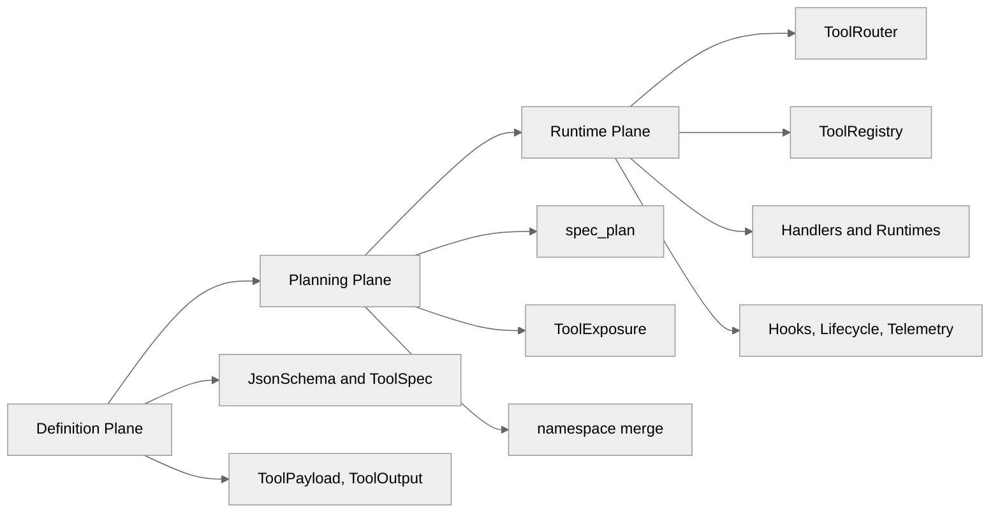
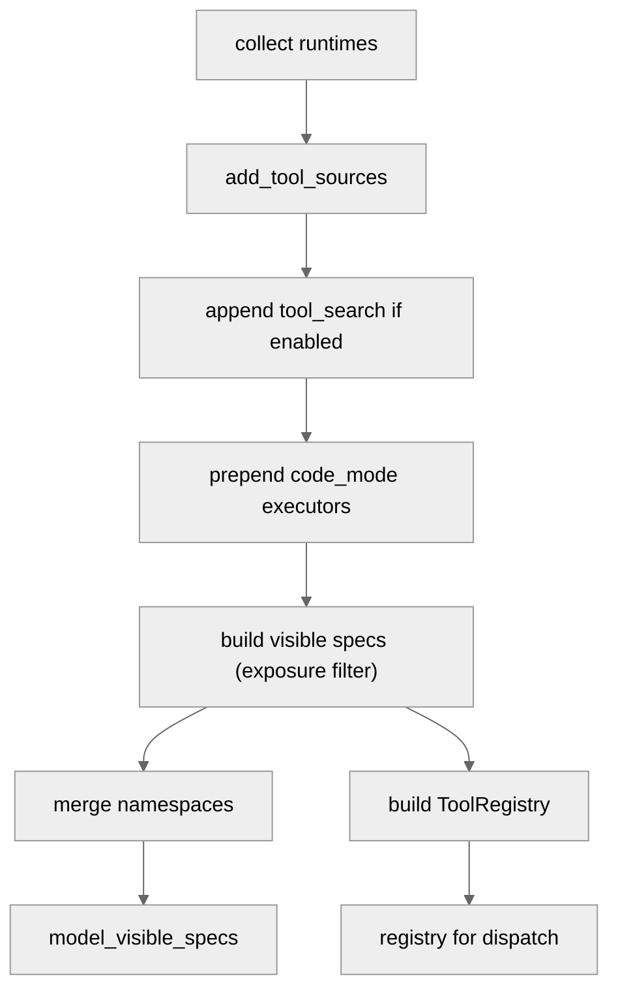
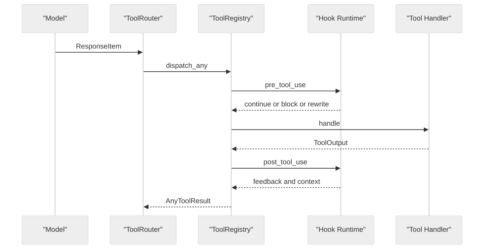
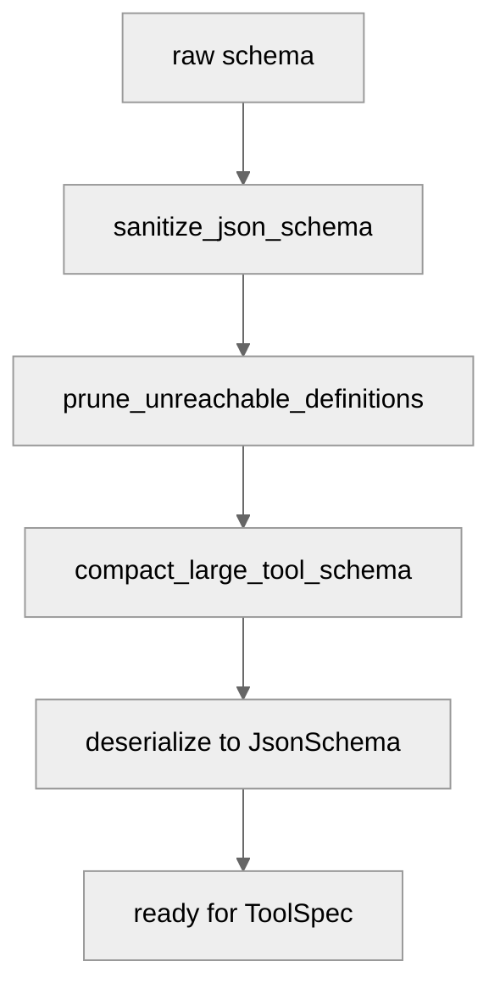

# 第 09 章 工具系统总览

## 引言

在 Codex 的整体架构里，"工具系统"并不只是模型能调用的一组函数。它更像一个连接"模型对话面"与"本地执行面"的中间层：模型在 `tools[]` 里看到的是协议化的能力描述，而真正落地时，需要经历工具规划、可见性裁剪、payload 校验、权限策略、Hook 生命周期、事件回写和 telemetry 统计等多道工序。

因此，本章关心的核心问题不是"某个具体工具是怎么实现的"——这是后续章节的事——而是：**Codex 是用什么样的结构，把"内建工具 / MCP 工具 / 动态工具 / hosted 工具"这些异构来源的能力，组织成一个可演进、可治理、可审计的运行系统的？**

本章源码基线沿用 `tools/` crate 中的若干基础类型文件，以及 `core/src/tools/` 下的 `spec_plan.rs`、`registry.rs`、`router.rs` 三个桥接文件；这三者构成"定义 → 规划 → 执行"的主链路，缺一不可。如果只看单个 handler，看到的只是某个执行节点，而无法解释 registry / handlers / schema 之间的全链路关系。

---

## 全网调研补充（近 12 个月）

### 社区共识

围绕 `Codex tools registry handlers` 与 `Codex tool spec JSON schema` 的检索结果，可以看到几个相对稳定的共识：

1. **工具 schema 是硬契约**：`invalid_function_parameters` 这种错误高发，往往并不代表模型退化，而是 schema 在不同 provider 端被解释为不同形状。
2. **MCP 已经成为编码 Agent 的基础能力**：在最近一年的讨论中，MCP 不再被视为"可选增强"，而更接近"最低可用门槛"。
3. **问题常在 harness 层，而不是模型层**：尤其是工具过滤、schema 归一化、并发策略、Hook 重写这些中间层逻辑，往往决定了一次失败到底是"模型理解错"还是"harness 把题给错了"。

### 主要争议与误解

- 把 `strict=false` 简单等同于"弱校验"，忽略了不同 provider 对同一 schema 的解释差异；严格与否更多反映的是契约协商策略，而不是单一开关。
- 把工具调用失败一律归因于"模型不会用"，忽略 schema 预处理和工具暴露策略带来的"模型其实没看到"或"看到的形状已经被改写"的情形。
- 误以为 MCP 工具默认可以并发；从源码看，Codex 对并发是有显式判定条件的（详见 4.3）。
- 把 `apply_patch` 当成普通文本 patch，忽略其语法验证、权限推导、runtime 委托和流式事件机制。

### 中文社区盲区

中文平台（知乎、少数派、CSDN、掘金）在过去 12 个月的高频内容集中于安装、代理接入和"我用它干了什么"，对以下话题的系统拆解相对少：

- `json_schema.rs` 的 sanitize / prune / compact 三段式处理流程；
- `ToolExposure`（Direct / Deferred / Hidden）与 `tool_search` 是怎样配合，让"未直接暴露的工具"仍可被发现；
- pre / post hook 对模型可见输入输出的重写能力；
- multi-agent v1 / v2 工具面在并存期带来的认知与迁移成本。

本章希望把这些盲区填一部分。

---

## 七维分析

## 1) 本质是什么：工具系统在 Codex 架构中的定位

工具系统的本质，可以用一句话概括：

> **把"模型可调用能力描述（ToolSpec）"映射为"本地可执行运行时（CoreToolRuntime）"，并在两者之间插入一条可治理的执行链路。**

这里的关键词是"中间还有一层"。如果工具系统只是"接收模型调用 → 跑函数 → 返回结果"，那它就只是一个函数表。但 Codex 在这两点之间塞入了 schema 预处理、可见性裁剪、Hook、权限、生命周期通知、telemetry——这才让它成为一个"系统"而不是"目录"。

先看 `codex-rs/tools/src/lib.rs`。它本身并不执行任何业务，只承担"类型契约层"的角色——聚合并对外导出类型与适配器（本地统计：16 个 `mod` 声明、约 70 余条 `pub use`）：

```32:36:codex-rs/tools/src/lib.rs
pub use json_schema::AdditionalProperties;
pub use json_schema::JsonSchema;
pub use json_schema::JsonSchemaPrimitiveType;
pub use json_schema::JsonSchemaType;
pub use json_schema::parse_tool_input_schema;
```

```89:92:codex-rs/tools/src/lib.rs
pub use tool_spec::ResponsesApiWebSearchFilters;
pub use tool_spec::ResponsesApiWebSearchUserLocation;
pub use tool_spec::ToolSpec;
pub use tool_spec::create_tools_json_for_responses_api;
```

可以看到，它对外暴露的核心抽象主要是 `JsonSchema`、`ToolSpec`、`ToolPayload`、`ToolExecutor`、`ToolOutput` 这些"协议侧类型"。它不知道也不关心"怎么执行"。

再看 core 侧的入口。`build_tool_router()` 同时产出两件东西："模型可见的 spec 列表"和"本地的 registry"：

```145:151:codex-rs/core/src/tools/spec_plan.rs
pub(crate) fn build_tool_router(
    turn_context: &TurnContext,
    params: ToolRouterParams<'_>,
) -> ToolRouter {
    let (model_visible_specs, registry) = build_tool_specs_and_registry(turn_context, params);
    ToolRouter::from_parts(registry, model_visible_specs)
}
```

这两个返回值的形状几乎决定了一切：

- `model_visible_specs: Vec<ToolSpec>` 决定"模型在这次 turn 看到什么"；
- `registry: ToolRegistry` 决定"工具调用真正会落到哪个 handler"。

这两个集合并不一一对应。`spec_plan.rs` 中 `build_model_visible_specs_and_registry` 的实现里可以直接看到：runtime 全部进 registry，但只有 `exposure.is_direct()` 且不被 code-mode-only 隐藏的 runtime 才进入 specs：

```183:213:codex-rs/core/src/tools/spec_plan.rs
fn build_model_visible_specs_and_registry(
    turn_context: &TurnContext,
    planned_tools: PlannedTools,
) -> (Vec<ToolSpec>, ToolRegistry) {
    let PlannedTools {
        runtimes,
        hosted_specs,
    } = planned_tools;
    let mut specs = Vec::new();
    let mut seen_tool_names = HashSet::new();
    for runtime in &runtimes {
        let tool_name = runtime.tool_name();
        if !seen_tool_names.insert(tool_name.clone()) {
            continue;
        }
        let exposure = runtime.exposure();
        if exposure.is_direct() && !is_hidden_by_code_mode_only(turn_context, &tool_name, exposure)
        {
            let spec = runtime.spec();
            specs.push(spec_for_model_request(turn_context, exposure, spec));
        }
    }
    // ... hosted specs + 命名空间合并 + 过滤 ...
}
```

这说明工具系统在架构上是"协议层 + 执行层"的耦合边界，而不是一组平铺的函数。从本质上看，它接近一个"小型的工具运行时"——只是这个运行时的对外接口形状由模型 API 决定。

<div style="background:#ffffff !important; background-color:#ffffff !important; padding:16px; border-radius:8px; margin:16px 0;" bgcolor="#ffffff">



</div>

三个 plane 的边界并不是物理的——很多类型横跨两层——但在阅读源码时把它们分开，可以显著降低跟踪难度。

---

## 2) 核心问题和痛点：它到底要解决哪些难题

工具系统是一个被多个独立约束同时压迫的模块：模型协议、provider 差异、生态扩展、权限、UI 事件……下面把这些压力拆成 3 个具体痛点。

### 痛点 A：工具来源异构

Codex 同时需要把至少五类来源拼成同一个 `tools[]`：

- 内建工具：`shell` / `apply_patch` / `plan` / `update_plan` / `view_image` / `unified_exec` / `request_user_input` / `request_permissions` 等；
- MCP 工具：来自外部 MCP server，可能上百个；
- dynamic tools：从配置或运行时动态添加；
- extension tools：扩展机制注入；
- hosted model tools：由模型 provider 托管（`web_search`、`image_generation`）。

拼装入口在 `add_tool_sources()`：

```499:510:codex-rs/core/src/tools/spec_plan.rs
fn add_tool_sources(context: &CoreToolPlanContext<'_>, planned_tools: &mut PlannedTools) {
    add_shell_tools(context, planned_tools);
    add_mcp_resource_tools(context, planned_tools);
    add_core_utility_tools(context, planned_tools);
    add_collaboration_tools(context, planned_tools);
    add_mcp_runtime_tools(context, planned_tools);
    add_dynamic_tools(context, planned_tools);
    add_extension_tools(context, planned_tools);
    for spec in hosted_model_tool_specs(context.turn_context) {
        planned_tools.add_hosted_spec(spec);
    }
}
```

这些子函数各自决定"在当前 turn 是否要加进来、怎么加"，最终汇聚成同一份 `PlannedTools`。可以看出 Codex 没有采用"用 trait 装饰子模块"的对称式抽象，而是显式列出每一类来源——这种写法的好处是分类边界清晰，代价是新增来源需要改这一处。

### 痛点 B：输入 schema 不可靠

来自外部 MCP / dynamic 工具的 schema，质量参差不齐：可能缺字段、类型不完整、definitions 冗余、深度过深、描述过长。直接喂给模型 API 容易触发"模型解析失败"或"provider 拒绝注册"。

Codex 的策略不是"快速失败"，而是"先清洗，再解析"：

```159:171:codex-rs/tools/src/json_schema.rs
pub fn parse_tool_input_schema(input_schema: &JsonValue) -> Result<JsonSchema, serde_json::Error> {
    let mut input_schema = input_schema.clone();
    sanitize_json_schema(&mut input_schema);
    prune_unreachable_definitions(&mut input_schema);
    compact_large_tool_schema(&mut input_schema);
    let schema: JsonSchema = serde_json::from_value(input_schema)?;
    if matches!(
        schema.schema_type,
        Some(JsonSchemaType::Single(JsonSchemaPrimitiveType::Null))
    ) {
        return Err(singleton_null_schema_error());
    }
    Ok(schema)
}
```

这条函数链体现了一种"工程优先"的取向：与其因为 schema 形状不规范让一个 MCP server 整体不可用，不如先做无损或可接受降级的清洗，让工具最终可注册、可调用。代价见 5.1（语义可能被削弱）。

### 痛点 C：执行链路必须可治理

工具调用不是"拿到请求就执行"，否则就退化为远程函数调用。Codex 在派发函数里把 Hook、权限、Telemetry、生命周期通知串成一条治理链。`registry.rs` 中的派发入口承担了这条链：

```393:404:codex-rs/core/src/tools/registry.rs
    #[expect(
        clippy::await_holding_invalid_type,
        reason = "tool dispatch must keep active-turn accounting atomic"
    )]
    pub(crate) async fn dispatch_any_with_terminal_outcome(
        &self,
        mut invocation: ToolInvocation,
        terminal_outcome_reached: Option<Arc<AtomicBool>>,
    ) -> Result<AnyToolResult, FunctionCallError> {
        let tool_name = invocation.tool_name.clone();
        let tool_name_flat = flat_tool_name(&tool_name);
        let call_id_owned = invocation.call_id.clone();
```

整段函数里穿插了 `run_pre_tool_use_hooks` / `run_post_tool_use_hooks` 与 `notify_tool_start` / `notify_tool_finish`（见同文件 11–25 行 use、487 行附近的调用点）。从源码可以观察到：派发函数把 Hook、生命周期与执行体绑定在同一个 `async fn` 里——这有助于让一次工具调用在 Hook 视角看起来是原子的，但也意味着任何一段的延迟都会卡住其他段。

---

## 3) 解决思路与方案：架构设计、核心结构、关键算法

### 3.1 统一规划：先收集，再裁剪，再暴露

`spec_plan.rs` 的关键设计是：**把"全部 runtime 集合"和"模型可见 spec 集合"分开构建**，然后用 `ToolExposure`、namespace、feature gate 统一裁剪。

```183:189:codex-rs/core/src/tools/spec_plan.rs
fn build_model_visible_specs_and_registry(
    turn_context: &TurnContext,
    planned_tools: PlannedTools,
) -> (Vec<ToolSpec>, ToolRegistry) {
    let PlannedTools {
        runtimes,
        hosted_specs,
    } = planned_tools;
```

整个 `build_tool_specs_and_registry` 的步骤顺序也很重要：

```176:181:codex-rs/core/src/tools/spec_plan.rs
    let mut planned_tools = PlannedTools::default();
    add_tool_sources(&context, &mut planned_tools);
    append_tool_search_executor(&context, &mut planned_tools);
    prepend_code_mode_executors(&context, &mut planned_tools);
    build_model_visible_specs_and_registry(turn_context, planned_tools)
}
```

顺序选择有其内在含义：先把所有来源添加完，再 append `tool_search`（保证它出现在"可被搜索的清单"之后才作用），最后 prepend code-mode executors（因为它需要"看到"前面的工具）。这种"声明顺序即语义"的写法对新读者并不友好，但保留了显式控制权。

<div style="background:#ffffff !important; background-color:#ffffff !important; padding:16px; border-radius:8px; margin:16px 0;" bgcolor="#ffffff">



</div>

### 3.2 统一调度：Router 做协议适配，Registry 做执行编排

ToolRouter 不直接执行工具，它做的是"协议适配"——把不同形状的 `ResponseItem` 翻译成内部的 `ToolCall`：

```89:106:codex-rs/core/src/tools/router.rs
    #[instrument(level = "trace", skip_all, err)]
    pub fn build_tool_call(item: ResponseItem) -> Result<Option<ToolCall>, FunctionCallError> {
        match item {
            ResponseItem::FunctionCall {
                name,
                namespace,
                arguments,
                call_id,
                ..
            } => {
                let tool_name = ToolName::new(namespace, name);
                Ok(Some(ToolCall {
                    tool_name,
                    call_id,
                    payload: ToolPayload::Function { arguments },
                }))
            }
```

```125:136:codex-rs/core/src/tools/router.rs
            ResponseItem::CustomToolCall {
                name,
                input,
                call_id,
                ..
            } => Ok(Some(ToolCall {
                tool_name: ToolName::plain(name),
                call_id,
                payload: ToolPayload::Custom { input },
            })),
            _ => Ok(None),
        }
    }
```

注意中间还有一段处理 `ResponseItem::ToolSearchCall` 的分支（106–124 行附近），仅当 `execution == "client"` 时才会被转成内部 `tool_search` 调用，这是"客户端/服务端两侧都可能承担工具发现"的体现。

ToolRegistry 才是真正的执行编排者：在 `dispatch_any_with_terminal_outcome` 内部按 `pre_tool_use → handle → post_tool_use → lifecycle` 的顺序贯通 hook、handler 和事件。

<div style="background:#ffffff !important; background-color:#ffffff !important; padding:16px; border-radius:8px; margin:16px 0;" bgcolor="#ffffff">



</div>

这条管线意味着：handler 永远不直接面对 hook，hook 也永远不直接面对 handler；它们之间隔着 registry 这层"政策中枢"。这种"中心化派发"是一把双刃剑——治理统一、但单点复杂度高（详见 7.1）。

### 3.3 Schema 降级算法：sanitize → prune → compact

`json_schema.rs` 的算法策略可以总结成两句话：**先保证可解析，再控制预算**。

```194:198:codex-rs/tools/src/json_schema.rs
const LARGE_SCHEMA_COMPACTION_PASSES: &[LargeSchemaCompactionPass] = &[
    strip_schema_descriptions,
    drop_schema_definitions,
    collapse_deep_schema_objects_from_root,
];
```

三个 pass 是顺序触发的：先剥描述（语义信息密度最低、模型可以从工具名补回），再丢 definitions（破坏性最强但语义损失可控），最后塌缩深层对象。这种"先无损再有损"的退化次序，是一种可辩护的工程权衡——很难说它是"最优"的，但它的失败模式比"直接拒绝大 schema"更温和。

<div style="background:#ffffff !important; background-color:#ffffff !important; padding:16px; border-radius:8px; margin:16px 0;" bgcolor="#ffffff">



</div>

---

## 4) 实现细节关键点：关键路径 / 函数 / 数据流

### 4.1 `shell`：spec、参数解析、执行编排分层

shell 工具在源码中拆成三段：

- `handlers/shell_spec.rs`（381 行）：定义参数与 JSON Schema 描述；
- `handlers/shell/shell_command.rs`（251 行）：解析参数并构造 `ExecParams`；
- `handlers/shell.rs`（240 行）：跑审批、权限归并、调度 runtime。

`spec()` 是 handler 暴露给 ToolRouter 的"协议面"：

```133:137:codex-rs/core/src/tools/handlers/shell/shell_command.rs
    fn spec(&self) -> ToolSpec {
        create_shell_command_tool(CommandToolOptions {
            allow_login_shell: self.options.allow_login_shell,
            exec_permission_approvals_enabled: self.options.exec_permission_approvals_enabled,
        })
    }
```

而 `shell.rs` 中的实际执行路径，则要把"会话特性"折叠进权限决策：

```80:91:codex-rs/core/src/tools/handlers/shell.rs
    let explicit_env_overrides = turn.shell_environment_policy.r#set.clone();
    let exec_permission_approvals_enabled =
        session.features().enabled(Feature::ExecPermissionApprovals);
    let requested_additional_permissions = additional_permissions.clone();
    #[allow(deprecated)]
    let effective_additional_permissions = apply_granted_turn_permissions(
        session.as_ref(),
        turn.cwd.as_path(),
        exec_params.sandbox_permissions,
        additional_permissions,
    )
    .await;
```

同时，shell 路径会前置拦截 `apply_patch` 命令——shell.rs 在 use 段就显式引入 `intercept_apply_patch`：

```16:16:codex-rs/core/src/tools/handlers/shell.rs
use crate::tools::handlers::apply_patch::intercept_apply_patch;
```

这种"shell 路径里能识别 apply_patch 字面量"的设计避免了 patch 退化为普通 shell 执行；但它也带来一个排障复杂性：同一个语义事件可能从两条调用栈进来（详见 5.3）。

### 4.2 `apply_patch`：freeform grammar + 校验优先

`apply_patch` 没有用 JSON 函数参数，而是采用 freeform grammar——这让模型可以直接以 patch 文本作为输入，而不必先把整段 diff 包成 JSON 字符串：

```9:27:codex-rs/core/src/tools/handlers/apply_patch_spec.rs
pub fn create_apply_patch_freeform_tool(include_environment_id: bool) -> ToolSpec {
    let definition = if include_environment_id {
        APPLY_PATCH_LARK_GRAMMAR.replace(
            "start: begin_patch hunk+ end_patch",
            "start: begin_patch environment_id? hunk+ end_patch\nenvironment_id: \"*** Environment ID: \" filename LF",
        )
    } else {
        APPLY_PATCH_LARK_GRAMMAR.to_string()
    };
    ToolSpec::Freeform(FreeformTool {
        name: "apply_patch".to_string(),
        description: "Use the `apply_patch` tool to edit files. This is a FREEFORM tool, so do not wrap the patch in JSON.".to_string(),
        format: FreeformToolFormat {
            r#type: "grammar".to_string(),
            syntax: "lark".to_string(),
            definition,
        },
    })
}
```

语法骨架由 `apply_patch.lark`（19 行）定义：

```1:8:codex-rs/core/src/tools/handlers/apply_patch.lark
start: begin_patch hunk+ end_patch
begin_patch: "*** Begin Patch" LF
end_patch: "*** End Patch" LF?

hunk: add_hunk | delete_hunk | update_hunk
add_hunk: "*** Add File: " filename LF add_line+
delete_hunk: "*** Delete File: " filename LF
update_hunk: "*** Update File: " filename LF change_move? change?
```

handler 在内部第一步就是 parse / verify，失败就直接回写模型而不进入执行：

```329:336:codex-rs/core/src/tools/handlers/apply_patch.rs
        let args = match codex_apply_patch::parse_patch(&patch_input) {
            Ok(args) => args,
            Err(parse_error) => {
                return Err(FunctionCallError::RespondToModel(format!(
                    "apply_patch verification failed: {parse_error}"
                )));
            }
        };
```

`FunctionCallError::RespondToModel` 这个 variant 的语义很关键——它表示"不是 harness 的崩溃，而是要把错误信息当作工具结果反馈给模型"。从设计上看，这种"把错误也作为可对话内容"的处理倾向贯穿整个 Codex 工具系统。

<div style="background:#ffffff !important; background-color:#ffffff !important; padding:16px; border-radius:8px; margin:16px 0;" bgcolor="#ffffff">


</div>

### 4.3 `mcp`：namespace 包装与并发判定

`McpHandler` 主要解决两件事：

1. 把 MCP 工具包装成 Codex 的 `ToolSpec::Namespace`（每个 server 一个命名空间）；
2. 并行调用只在 server 显式声明，或工具 annotation 标了 `read_only_hint` 时允许。

```46:57:codex-rs/core/src/tools/handlers/mcp.rs
    fn supports_parallel_tool_calls(&self) -> bool {
        // Correctly implemented MCP servers should tolerate parallel calls to
        // tools that advertise themselves as read-only.
        self.tool_info.supports_parallel_tool_calls
            || self
                .tool_info
                .tool
                .annotations
                .as_ref()
                .and_then(|annotations| annotations.read_only_hint)
                .unwrap_or(false)
    }
```

```162:166:codex-rs/core/src/tools/handlers/mcp.rs
    Ok(ToolSpec::Namespace(ResponsesApiNamespace {
        name: tool_info.callable_namespace.clone(),
        description,
        tools: vec![ResponsesApiNamespaceTool::Function(tool)],
    }))
```

源码上方的注释 "Correctly implemented MCP servers should tolerate parallel calls..." 体现了一种"保守默认"的态度：默认串行，仅在服务端明确说明可并发或工具明确说明只读时才允许并发。这是对外部生态质量不可控的一种风险控制。

### 4.4 `multi_agents`：入口薄层，schema 厚层

`multi_agents.rs` 文件本身只有 96 行，主要负责：常量定义、agent id 解析辅助函数，以及把子模块里的 Handler 重新导出：

```82:92:codex-rs/core/src/tools/handlers/multi_agents.rs
pub(crate) use close_agent::Handler as CloseAgentHandler;
pub(crate) use resume_agent::Handler as ResumeAgentHandler;
pub(crate) use send_input::Handler as SendInputHandler;
pub(crate) use spawn::Handler as SpawnAgentHandler;
pub(crate) use wait::Handler as WaitAgentHandler;

pub(crate) mod close_agent;
mod resume_agent;
mod send_input;
mod spawn;
pub(crate) mod wait;
```

真正的复杂度落在 `multi_agents_spec.rs`（837 行）里：参数 schema、agent 类型描述、namespace 组织、v1 / v2 兼容都在那。这种"执行逻辑薄、接口定义厚"的拆法让"做什么"和"长什么样"分离，但代价是跨文件阅读成本上升——读 handler 的时候，往往需要跳到 spec 文件才能完整理解参数语义。

---

## 5) 易错点和注意事项：陷阱、边界条件、隐式依赖

### 5.1 schema 归一化会改变原始语义

当 schema 过深时，压缩阶段会把"被认为复杂"的对象替换成空对象 `{}`：

```360:367:codex-rs/tools/src/json_schema.rs
            if depth >= MAX_COMPACT_TOOL_SCHEMA_DEPTH && is_complex_schema_object(map) {
                *value = json!({});
                return;
            }
```

`MAX_COMPACT_TOOL_SCHEMA_DEPTH` 当前定义为 2（同文件 177 行）。这意味着：从根算起超过两层、且被 `is_complex_schema_object` 判定为复杂的子树会被整段塌缩。这能提高可调用性，但也会让"工具明明声明了某个嵌套约束、模型却看不到"成为可能。排障时如果只读原始 schema 文件，会得不到一致结论。

### 5.2 `strict=false` 在多 provider 生态下有漂移风险

Codex 为 MCP 工具生成的 ResponsesApi 工具默认非严格：

```131:131:codex-rs/tools/src/responses_api.rs
        strict: false,
```

官方 OpenAI / Codex backend 链路可以接受这种宽松校验，并不意味着第三方 provider 一致接受。同一个 schema 形状跨 provider 时的稳定性，需要在接入层另做适配，不能依赖 `strict=false` 一刀切。

### 5.3 `apply_patch` 的双入口路径

`apply_patch` 既可能走 freeform handler 直接进来，也可能因为模型把它写成 `apply_patch ...` 形式的 shell 命令、被 shell 路径中的 `intercept_apply_patch` 截走。两条路径最终都会汇聚到 patch 校验，但在 Hook 视角里看到的 `tool_name` 是不同的（一个是 `apply_patch`，一个仍是 `shell`）。排障时若只看一条路径，容易把"是否触发 Hook""权限是否计入"等结论归错因。

### 5.4 deferred 工具不是默认可见

`ToolExposure` 区分了 Direct / Deferred / Hidden。Deferred 的工具会注册进 registry，但不会进入 `model_visible_specs`——只有当 `tool_search` 命中并把它的 spec 注入回 turn 时，模型才能调用。这类"看不见但已注册"的状态是调试时的高频坑点：日志里看得到注册事件，但模型行为表现得像"没这个工具"。

### 5.5 顺序敏感的规划阶段

`add_tool_sources` → `append_tool_search_executor` → `prepend_code_mode_executors` 这三步顺序并不是任意的（见 3.1）。如果新增一类工具来源时插错位置，可能出现"被 code_mode 包装后才出现"或"未被 tool_search 收录"等微妙错配，这类问题在单元测试里不一定能直接被捕捉。

---

## 6) 竞品对比：Claude Code / Opencode / Aider / Goose / Continue

> 本节 Codex 侧基于本章源码；竞品侧基于公开文档与社区公开实现，不做逐行源码断言；对竞品的表述保持在"可观察的接口与文档"层级。

| 对比维度 | Codex | Claude Code | Opencode | Aider | Goose / Continue |
|---|---|---|---|---|---|
| 工具注册中心化 | `spec_plan + registry` 集中规划 | 更强调流程规则与策略约束 | 偏统一接口与 provider 适配 | 偏命令协作与人工控制 | 偏扩展连接器与平台集成 |
| schema 预处理 | 内建 sanitize / prune / compact 三段式 | 强调工具契约与使用说明 | 常见协议转换层 | 相对轻量 | 视扩展生态而定 |
| 并行调用判定 | per-tool 能力判定（如 MCP `read_only_hint`） | 有并发能力但策略实现不同 | 多代理场景较常见 | 偏串行 | 取决于产品形态 |
| 生态扩展模型 | MCP + dynamic + extension 三路统一规划 | 工具生态较成熟 | 多 provider 灵活 | 以 Git/CLI 流程为主 | 插件与连接器导向 |
| 工具可见性策略 | `ToolExposure` 三态 + `tool_search` 动态注入 | 以系统消息与规则文本为主 | 通常静态暴露 | 静态暴露 | 因扩展而异 |
| Hook 治理 | 全局 pre/post hook 接入派发链路 | 有策略层但 Hook 模型不同 | 较轻 | 较轻 | 视扩展生态 |

从这张表看，Codex 的相对差异并不在"工具数量多/少"，而在"工具治理的标准化程度"上：它把 schema 清洗、可见性、并发、Hook 都集中在同一条派发链路里。这种集中带来一致性，但也意味着规划层（特别是 `spec_plan.rs`）成为系统中"决策密度最高的单点"。是否值得这样集中，取决于使用者更看重一致性还是更看重模块独立性——两种取向都有合理性。

---

## 7) 仍存在的问题和缺陷：设计局限与改进空间

### 7.1 规划层复杂度集中

`spec_plan.rs` 单文件 **934 行、约 50 个函数**（本地 `wc -l` 与 `grep` 计数），同时承担"收集 / 顺序编排 / 可见性裁剪 / 命名空间合并 / 特性门控"等多重决策。这种集中化让"模型这次能看到什么"很容易在一个地方读完，但也使得任何新工具来源或新可见性策略都要在此处改动，回归测试压力较大。一种可能的改进方向是把"特性门控"与"顺序编排"分离到独立模块，但代价是引入更多间接层。

### 7.2 schema 压缩策略偏"保可用"

当前压缩算法优先保证"可解析、不超预算"，对深层语义表达的保留较为粗糙——例如 `MAX_COMPACT_TOOL_SCHEMA_DEPTH = 2` 是一个全局常量，不区分工具类别。后续可能值得探索"按工具类别分级预算"或"按可观察失败率回退"的更精细策略，但需要先有相应的 telemetry 支持。

### 7.3 多 provider 兼容性受外部生态质量影响

社区里大量 `invalid_function_parameters` 类反馈显示：只要 provider 侧对 schema 的解释、工具过滤、wire 协议与 Codex 内部假设不一致，稳定性就会下降。这类问题本质上是接口契约的耦合问题，并非完全可以在 Codex 一侧根治，但可以通过更详细的"按 provider 的契约差异"文档与回归测试缓解。

### 7.4 多 Agent 工具面并存期的技术债

v1 namespace（`MULTI_AGENT_V1_NAMESPACE`）与 v2 plain function 并存的阶段是有迁移价值的，但同时引入了文档负担——读者需要分辨"当前在哪个工具面下、参数 schema 该读哪份"。当 v2 稳定后清理 v1 是一个自然的方向，但何时清理涉及对外部依赖者的兼容承诺。

### 7.5 可观测性仍有提升空间

例如 `apply_patch` 被 shell 路径拦截时，从用户视角看到的工具名与 harness 内部派发路径并不完全一致；如果 telemetry 不显式标注"拦截来源"，排障成本会偏高。又如 deferred 工具被 `tool_search` 注入时，可能缺少端到端 trace 把"未注入 → 被检索 → 被使用"串起来，定位"为什么这次模型用了它而上次没用"会比较吃力。

---

## 定量快照（本章核验口径）

口径说明：所有数字均通过 `wc -l`、`grep -c` 或对 `Cargo.toml` 的解析得到，可被本地复核。

- workspace member：`codex-rs/Cargo.toml` 经解析约为 **120** 个 crate。
- 关键文件行数（`wc -l`）：
  - `codex-rs/tools/src/lib.rs`：**92** 行（含 16 个 `mod` 声明、约 70 余条 `pub use`）
  - `codex-rs/tools/src/json_schema.rs`：**727** 行
  - `codex-rs/tools/src/responses_api.rs`：**140** 行
  - `codex-rs/core/src/tools/spec_plan.rs`：**934** 行（约 50 个函数）
  - `codex-rs/core/src/tools/registry.rs`：**725** 行（约 39 个函数）
  - `codex-rs/core/src/tools/router.rs`：**239** 行
  - `codex-rs/core/src/tools/handlers/shell.rs`：**240** 行
  - `codex-rs/core/src/tools/handlers/shell_spec.rs`：**381** 行
  - `codex-rs/core/src/tools/handlers/shell/shell_command.rs`：**251** 行
  - `codex-rs/core/src/tools/handlers/apply_patch.rs`：**601** 行
  - `codex-rs/core/src/tools/handlers/apply_patch_spec.rs`：**31** 行
  - `codex-rs/core/src/tools/handlers/apply_patch.lark`：**19** 行
  - `codex-rs/core/src/tools/handlers/mcp.rs`：**452** 行
  - `codex-rs/core/src/tools/handlers/multi_agents.rs`：**96** 行
  - `codex-rs/core/src/tools/handlers/multi_agents_spec.rs`：**837** 行

这些数字会随版本演进，但当前快照足以支撑本章的源码引用。

---

## 小结

把本章的源码证据收束成一句工程判断：

> **Codex 工具系统的特点，不在工具数量多，而在"工具定义、可见性规划、执行治理、生态接入"这四件事被组织在同一条派发链路里。**

从源码看，Codex 在工具系统上做了三件较有辨识度的事：

1. **定义与执行解耦**：`tools` crate 只承担类型契约与协议转换，`core` 侧承担调度与治理，类型在二者之间往返。
2. **可见性动态计算**：模型可见的工具集合是每个 turn 的动态结果，由 `ToolExposure`、namespace、feature gate 和 `tool_search` 共同决定，而不是一份静态清单。
3. **执行链路治理化**：Hook、权限、Telemetry、Lifecycle 全部纳入统一派发流程，handler 与 hook 之间没有直接耦合。

这也解释了为什么社区里很多"看似模型问题"的故障，其根因往往在 schema、注册、暴露、治理这四层之间的错配。下一章进入命令执行与 `unified_exec`，会继续拆开本章最关键的执行通道——也就是"治理链路落地到具体进程"的那一段。
