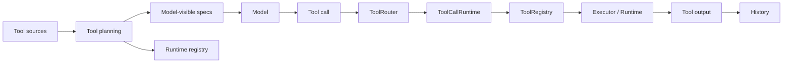

# 09｜工具系统总览：声明、暴露、路由与执行

> 源码基线：`upstream/main@283bc4cf011047314b4804c0f1ccd06e4f6a95c5`（2026-06-24）。

Codex 的工具系统不是一个函数表，而是一条把模型协议映射到受治理执行环境的流水线：



## 1. 协议层与执行层

`codex-rs/tools` 定义协议侧类型，`codex-rs/core/src/tools` 负责当前回合的规划、路由和执行。

| 概念 | 入口 | 作用 |
| --- | --- | --- |
| `ToolSpec` | `tools/src/tool_spec.rs` | 给模型看的名称、描述、schema 或 freeform grammar |
| `ToolPayload` | `tools/src/tool_payload.rs` | 规范化 function/custom/tool-search 输入 |
| `ToolOutput` | `tools/src/tool_output.rs` | 规范化成功、失败与结构化结果 |
| `ToolExecutor` | `tools/src/tool_executor.rs` | 工具执行契约与暴露属性 |
| `ToolRouter` | `core/src/tools/router.rs` | 将 Responses item 解析为内部调用 |
| `ToolRegistry` | `core/src/tools/registry.rs` | 按工具名找到 executor 并执行治理链 |
| `ToolCallRuntime` | `core/src/tools/parallel.rs` | 并发、取消与结果排序 |

模型看到 `ToolSpec`，系统运行 `ToolExecutor`。二者不要求一一对应：某个 runtime 可以注册在本地但不直接出现在当前请求的工具列表中。

## 2. 工具来源

`spec_plan.rs` 的 `add_tool_sources` 汇总当前 Step 的能力：

- shell、unified exec、apply_patch；
- MCP resource 与 MCP runtime tools；
- core utility tools；
- collaboration / multi-agent tools；
- dynamic tools；
- extension / plugin tools；
- provider 托管工具。

最终产物分成两份：

```text
model_visible_specs: 发送给模型
registry:            留在本地等待调用
```

这种分离让工具可以延迟暴露、通过搜索发现，或只供 Code Mode 等特定运行时使用。

## 3. Direct、Deferred 与 Hidden

`ToolExposure` 当前表达三种工具面：

| 暴露方式 | 模型是否直接看到 | 是否可被运行时发现 |
| --- | --- | --- |
| Direct | 是 | 是 |
| Deferred | 初始不直接看到 | 可通过 tool search 等机制加载 |
| Hidden | 否 | 不作为普通可发现工具 |

Deferred 的目的不是“隐藏安全风险”，而是控制工具 schema 的上下文成本。大量 MCP、Plugin 或 Dynamic tools 如果全量直出，会迅速占满请求预算。

安全仍由审批、策略与沙箱决定，不能把“模型当前看不见”当成安全边界。

## 4. Tool planning 是每个 Step 的工作

工具面会受以下状态影响：

- 模型支持哪些 tool shape；
- feature flags；
- Code Mode；
- 当前执行环境；
- permission profile；
- MCP 连接与 tool exposure；
- Plugin / Connector 选择；
- dynamic tools；
- delayed tool-search 结果。

因此工具列表不是会话启动时固定一次。`build_tool_specs_and_registry` 会基于当前 `StepContext` 创建一致的 specs 与 registry。

## 5. Schema 清洗

外部工具提供的 JSON Schema 质量不一。`parse_tool_input_schema` 在解析前执行：

1. `sanitize_json_schema`；
2. `prune_unreachable_definitions`；
3. `compact_large_tool_schema`；
4. 转换为内部 `JsonSchema`；
5. 拒绝无意义的 singleton-null schema。

清洗的目标是在 Provider 可接受性、模型可理解性和原始语义之间取得平衡。Schema 既是校验契约，也是 Prompt 成本。

## 6. 路由与 payload 归一化

`ToolRouter` 将 Responses 中不同 item 归一为统一内部调用：

```text
FunctionCall       → ToolPayload::Function
CustomToolCall     → ToolPayload::Custom
client ToolSearch  → ToolPayload::ToolSearch
server-side item   → 不由本地 router 执行
```

工具名还可能包含 namespace。这样后续 registry 不需要关心调用最初来自哪一种 wire item，只需处理 `{tool_name, call_id, payload}`。

## 7. 并发不是模型单方面决定

模型可以在一轮中发出多个调用，但实际能否并发由 executor 元数据决定。`ToolCallRuntime` 使用读写锁实现：

- 支持并行的调用获取共享读锁；
- 不支持并行的调用获取独占写锁。

因此多个只读工具可并行，而副作用工具默认保持串行。MCP 工具还会参考 server opt-in 与只读 hint，不能仅凭模型的 `parallel_tool_calls` 假设安全并行。

## 8. 取消与终态

取消工具调用时，需要区分：

- 可直接中止 future 的短任务；
- 必须等待 runtime 清理的进程、PTY 或远程任务；
- 已经到达终态、只差收集结果的任务。

后两类不能简单 `abort`，否则可能遗留进程树或远程状态。运行时会生成明确的 aborted output，让模型知道调用没有正常完成。

## 9. 治理链

Registry 派发并非直接调用 handler，而会串联：

```text
解析与校验
→ pre-tool hook
→ approval / reviewer
→ permission / sandbox / network policy
→ runtime execution
→ post-tool hook
→ lifecycle events
→ telemetry
→ model-visible output
```

不同工具可以复用相同治理骨架，同时在 runtime 中实现自己的审批键、沙箱请求和清理语义。

## 10. 错误如何返回

可恢复错误通常转成 `success=false` 的工具输出，再进入历史供模型修正；真正破坏运行时一致性的错误才升级为 fatal。

| 错误 | 常见处理 |
| --- | --- |
| 参数 JSON / grammar 错误 | 模型可见失败输出 |
| 未知或未暴露工具 | 模型可见失败输出 |
| 审批拒绝 | 明确拒绝结果 |
| 沙箱或策略拒绝 | 结构化安全错误 |
| 超时 / 取消 | 终止状态与保留输出 |
| runtime fatal | 结束当前执行 |

## 11. 源码阅读路线

```bash
rg -n "enum ToolExposure|trait ToolExecutor" codex-rs/tools/src
rg -n "build_tool_specs_and_registry|add_tool_sources" codex-rs/core/src/tools/spec_plan.rs
rg -n "struct ToolRouter|build_tool_call" codex-rs/core/src/tools/router.rs
rg -n "struct ToolRegistry|dispatch_any" codex-rs/core/src/tools/registry.rs
rg -n "struct ToolCallRuntime|supports_parallel" codex-rs/core/src/tools/parallel.rs
rg -n "sanitize_json_schema|compact_large_tool_schema" codex-rs/tools/src
```

工具系统的核心边界可以浓缩为一句话：

> ToolSpec 决定模型能提出什么动作，Registry 与 Runtime 决定系统会如何受控地执行该动作。
