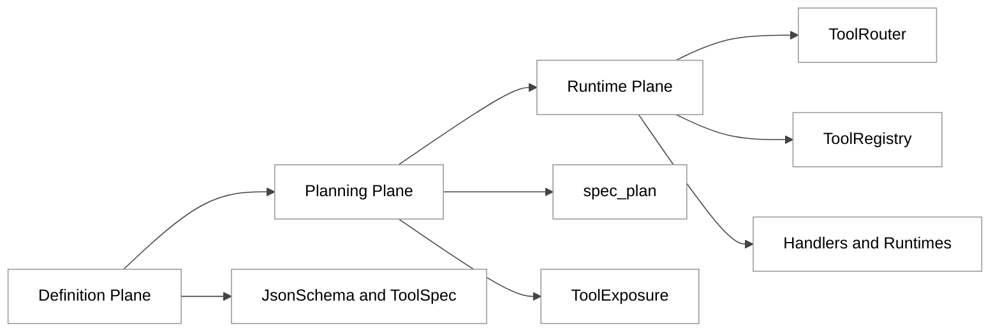
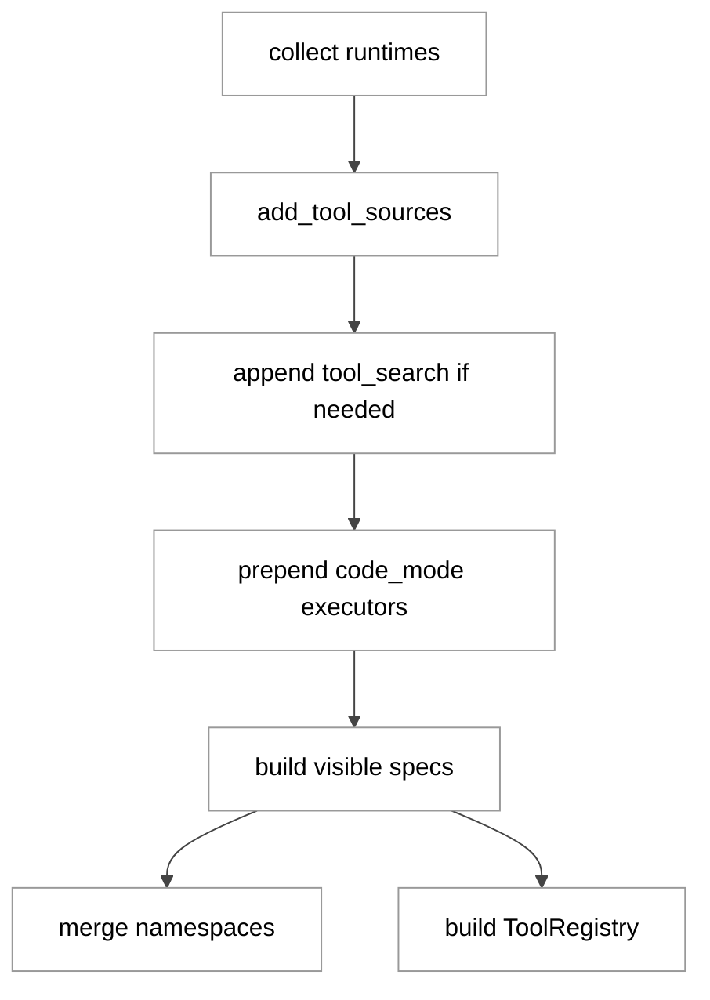
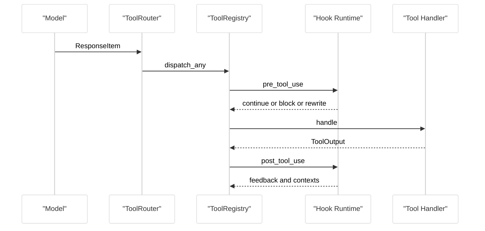
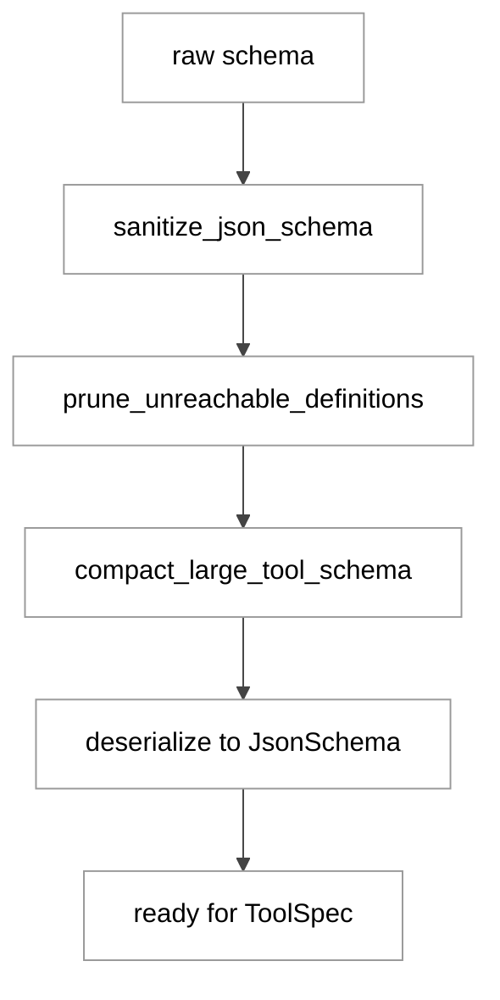
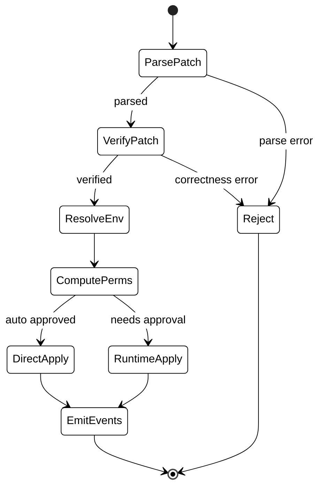

# 第 09 章 工具系统总览

## 引言

在 Codex 架构里，“工具系统”不是附属模块，而是 Agent 从“会说”走向“会做”的执行平面。模型在 `tools[]` 里看到的是协议化能力，真正落地时却要经历工具规划、可见性裁剪、payload 校验、权限策略、Hook 生命周期、事件回写和 telemetry 统计。  
因此，本章的核心问题不是“某个工具怎么实现”，而是“Codex 怎样把不同来源的工具能力组织成一个可演进、可治理、可审计的运行系统”。

本章源码基线为你指定的核心路径，并补充 `core/src/tools/spec_plan.rs`、`core/src/tools/registry.rs`、`core/src/tools/router.rs` 三个关键桥接文件；否则只能看到单个 handler，无法解释 registry/handlers/schema 的全链路关系。

---

## 全网调研补充（近 12 个月）

### 社区共识

围绕 `Codex tools registry handlers` 与 `Codex tool spec JSON schema` 的检索结果，稳定共识主要有三点：

1. **工具 schema 是硬契约**：`invalid_function_parameters` 高发并不代表模型退化，很多是 schema shape 与 provider 约束不一致。
2. **MCP 已经是编码 Agent 的基础能力**：社区讨论中，MCP 不再是“可选增强”，而是“最低可用门槛”。
3. **问题常在 harness 层而不是模型层**：尤其是工具过滤、schema 归一化、并发策略、Hook 重写这些中间层逻辑。

### 主要争议与误解

- 把 `strict=false` 简化成“弱校验”，忽略了不同 provider 对同一 schema 的解释差异。
- 把工具失败都归因于模型调用错误，忽略 schema 预处理和工具暴露策略。
- 误以为 MCP 工具默认可并发；实际上 Codex 有显式并发判定条件。
- 把 `apply_patch` 视为普通文本 patch，忽略其语法验证、权限推导、runtime 委托和流式事件机制。

### 中文社区盲区

中文平台（知乎、少数派、CSDN、掘金）在过去 12 个月的高频内容集中于安装和代理接入；系统拆解以下主题的文章较少：

- `json_schema.rs` 的 sanitize/prune/compact 三段式处理；
- `ToolExposure`（Direct/Deferred/Hidden）与 `tool_search` 的配合；
- pre/post hook 对模型可见输入输出的重写；
- multi-agent v1/v2 工具面并存期的兼容成本。

---

## 七维分析

## 1) 本质是什么：工具系统在 Codex 架构中的定位

工具系统的本质是：  
**把“模型可调用能力描述（ToolSpec）”映射为“本地可执行运行时（CoreToolRuntime）”，并在二者之间插入可治理执行链路。**

先看 `codex-rs/tools/src/lib.rs`，它并不执行业务，而是聚合导出类型与适配器（本地统计：16 个 `mod`、72 条 `pub use`）：

```rust
// codex-rs/tools/src/lib.rs:32
pub use json_schema::AdditionalProperties;
pub use json_schema::JsonSchema;
pub use json_schema::parse_tool_input_schema;
pub use tool_spec::ToolSpec;
```

再看 core 侧，`build_tool_router()` 同时产出“模型可见 spec”和“本地 registry”：

```rust
// codex-rs/core/src/tools/spec_plan.rs:145
pub(crate) fn build_tool_router(
    turn_context: &TurnContext,
    params: ToolRouterParams<'_>,
) -> ToolRouter {
    let (model_visible_specs, registry) = build_tool_specs_and_registry(turn_context, params);
    ToolRouter::from_parts(registry, model_visible_specs)
}
```

这说明工具系统在架构上是“协议层 + 执行层”的耦合边界，而不是一组平铺函数。

<div style="background:#ffffff !important; background-color:#ffffff !important; padding:16px; border-radius:8px; margin:16px 0;" bgcolor="#ffffff">



</div>

---

## 2) 核心问题和痛点：它到底要解决哪些难题

### 痛点 A：工具来源异构

Codex 同时接入：

- 内建工具（shell/apply_patch/plan 等）
- MCP 工具
- dynamic tools
- extension tools
- hosted model tools（web_search/image_generation）

拼装入口在 `add_tool_sources()`：

```rust
// codex-rs/core/src/tools/spec_plan.rs:499
fn add_tool_sources(context: &CoreToolPlanContext<'_>, planned_tools: &mut PlannedTools) {
    add_shell_tools(context, planned_tools);
    add_mcp_resource_tools(context, planned_tools);
    add_core_utility_tools(context, planned_tools);
    add_collaboration_tools(context, planned_tools);
    add_mcp_runtime_tools(context, planned_tools);
}
```

### 痛点 B：输入 schema 不可靠

MCP/dynamic 工具给到的 schema 可能缺字段、类型不完整、definitions 冗余。Codex 采用“先清洗再解析”而不是直接失败：

```rust
// codex-rs/tools/src/json_schema.rs:159
pub fn parse_tool_input_schema(input_schema: &JsonValue) -> Result<JsonSchema, serde_json::Error> {
    let mut input_schema = input_schema.clone();
    sanitize_json_schema(&mut input_schema);
    prune_unreachable_definitions(&mut input_schema);
    compact_large_tool_schema(&mut input_schema);
    serde_json::from_value(input_schema)
}
```

### 痛点 C：执行链路必须可治理

工具调度不是“拿到请求就执行”，而是需要 Hook、权限、Telemetry、生命周期通知。`registry.rs` 的核心派发函数承担了这条治理链：

```rust
// codex-rs/core/src/tools/registry.rs:397
pub(crate) async fn dispatch_any_with_terminal_outcome(
    &self,
    mut invocation: ToolInvocation,
    terminal_outcome_reached: Option<Arc<AtomicBool>>,
) -> Result<AnyToolResult, FunctionCallError> {
    // pre hook -> handle -> post hook -> lifecycle
}
```

---

## 3) 解决思路与方案：架构设计、核心结构、关键算法

### 3.1 统一规划：先收集，再裁剪，再暴露

`spec_plan.rs` 的关键是把“全部 runtime 集合”和“模型可见 spec 集合”分开构建，然后用 `ToolExposure`、namespace、feature gate 统一裁剪。

```rust
// codex-rs/core/src/tools/spec_plan.rs:183
fn build_model_visible_specs_and_registry(
    turn_context: &TurnContext,
    planned_tools: PlannedTools,
) -> (Vec<ToolSpec>, ToolRegistry) {
    // build specs + build registry
}
```

<div style="background:#ffffff !important; background-color:#ffffff !important; padding:16px; border-radius:8px; margin:16px 0;" bgcolor="#ffffff">



</div>

### 3.2 统一调度：Router 做协议适配，Registry 做执行编排

Router 把 `ResponseItem` 转成内部 `ToolCall`，Registry 再执行：

```rust
// codex-rs/core/src/tools/router.rs:90
pub fn build_tool_call(item: ResponseItem) -> Result<Option<ToolCall>, FunctionCallError> {
    match item {
        ResponseItem::FunctionCall { name, namespace, arguments, call_id, .. } => {
            Ok(Some(ToolCall {
                tool_name: ToolName::new(namespace, name),
                call_id,
                payload: ToolPayload::Function { arguments },
            }))
        }
        ResponseItem::CustomToolCall { name, input, call_id, .. } => {
            Ok(Some(ToolCall {
                tool_name: ToolName::plain(name),
                call_id,
                payload: ToolPayload::Custom { input },
            }))
        }
        _ => Ok(None),
    }
}
```

<div style="background:#ffffff !important; background-color:#ffffff !important; padding:16px; border-radius:8px; margin:16px 0;" bgcolor="#ffffff">



</div>

### 3.3 Schema 降级算法：sanitize -> prune -> compact

`json_schema.rs` 的算法策略非常明确：先保证可解析，再控制预算。

```rust
// codex-rs/tools/src/json_schema.rs:194
const LARGE_SCHEMA_COMPACTION_PASSES: &[LargeSchemaCompactionPass] = &[
    strip_schema_descriptions,
    drop_schema_definitions,
    collapse_deep_schema_objects_from_root,
];
```

<div style="background:#ffffff !important; background-color:#ffffff !important; padding:16px; border-radius:8px; margin:16px 0;" bgcolor="#ffffff">



</div>

---

## 4) 实现细节关键点：关键路径 / 函数 / 数据流

### 4.1 `shell`：spec、权限、执行拆层

shell 工具分成三段：

- `shell_spec.rs` 定义参数与描述；
- `shell/shell_command.rs` 负责解析参数转 `ExecParams`；
- `shell.rs` 统一跑审批、权限归并、runtime orchestrator。

```rust
// codex-rs/core/src/tools/handlers/shell/shell_command.rs:133
fn spec(&self) -> ToolSpec {
    create_shell_command_tool(CommandToolOptions {
        allow_login_shell: self.options.allow_login_shell,
        exec_permission_approvals_enabled: self.options.exec_permission_approvals_enabled,
    })
}
```

```rust
// codex-rs/core/src/tools/handlers/shell.rs:81
let exec_permission_approvals_enabled =
    session.features().enabled(Feature::ExecPermissionApprovals);
let requested_additional_permissions = additional_permissions.clone();
```

同时，shell 路径会前置拦截 `apply_patch` 命令，避免 patch 退化为普通 shell 执行。

### 4.2 `apply_patch`：自由格式语法 + 校验优先

`apply_patch` 采用 freeform grammar，而非 JSON 函数参数：

```rust
// codex-rs/core/src/tools/handlers/apply_patch_spec.rs:9
pub fn create_apply_patch_freeform_tool(include_environment_id: bool) -> ToolSpec {
    ToolSpec::Freeform(FreeformTool { /* grammar definition */ })
}
```

语法骨架来自 `apply_patch.lark`：

```lark
// codex-rs/core/src/tools/handlers/apply_patch.lark:1
start: begin_patch hunk+ end_patch
begin_patch: "*** Begin Patch" LF
end_patch: "*** End Patch" LF?
```

handler 内部先 parse/verify，再决定 direct output 还是 delegate runtime：

```rust
// codex-rs/core/src/tools/handlers/apply_patch.rs:329
let args = match codex_apply_patch::parse_patch(&patch_input) {
    Ok(args) => args,
    Err(parse_error) => {
        return Err(FunctionCallError::RespondToModel(format!(
            "apply_patch verification failed: {parse_error}"
        )));
    }
};
```

<div style="background:#ffffff !important; background-color:#ffffff !important; padding:16px; border-radius:8px; margin:16px 0;" bgcolor="#ffffff">



</div>

### 4.3 `mcp`：namespace 包装与并行门槛

`McpHandler` 的关键点有两个：

1. 把 MCP 工具转成 Codex 的 `ToolSpec::Namespace`；
2. 并行调用只在 server opt-in 或 read_only_hint 下允许。

```rust
// codex-rs/core/src/tools/handlers/mcp.rs:46
fn supports_parallel_tool_calls(&self) -> bool {
    self.tool_info.supports_parallel_tool_calls
        || self.tool_info.tool.annotations.as_ref()
            .and_then(|annotations| annotations.read_only_hint)
            .unwrap_or(false)
}
```

```rust
// codex-rs/core/src/tools/handlers/mcp.rs:162
Ok(ToolSpec::Namespace(ResponsesApiNamespace {
    name: tool_info.callable_namespace.clone(),
    description,
    tools: vec![ResponsesApiNamespaceTool::Function(tool)],
}))
```

### 4.4 `multi_agents`：入口薄层，schema 厚层

`multi_agents.rs` 只负责解析和导出 handler，真正复杂度在 `multi_agents_spec.rs`。  
这个拆法让“执行逻辑”和“接口定义”分离，但也会导致跨文件阅读成本较高。

```rust
// codex-rs/core/src/tools/handlers/multi_agents.rs:82
pub(crate) use close_agent::Handler as CloseAgentHandler;
pub(crate) use resume_agent::Handler as ResumeAgentHandler;
pub(crate) use send_input::Handler as SendInputHandler;
pub(crate) use spawn::Handler as SpawnAgentHandler;
pub(crate) use wait::Handler as WaitAgentHandler;
```

---

## 5) 易错点和注意事项：陷阱、边界条件、隐式依赖

### 5.1 schema 归一化会改变原始语义

当 schema 过深时，压缩阶段会把复杂对象替换成空对象 `{}`：

```rust
// codex-rs/tools/src/json_schema.rs:363
if depth >= MAX_COMPACT_TOOL_SCHEMA_DEPTH && is_complex_schema_object(map) {
    *value = json!({});
    return;
}
```

这能提高可调用性，但可能削弱参数约束的表达力。

### 5.2 `strict=false` 在多 provider 生态有漂移风险

Codex 工具定义默认非严格：

```rust
// codex-rs/tools/src/responses_api.rs:131
strict: false,
```

官方链路可接受，不代表第三方 provider 一致接受。

### 5.3 `apply_patch` 双链路排障

`apply_patch` 既可能走 freeform handler，也可能被 shell 预拦截。  
如果排障只看一条调用路径，很容易误判权限或 Hook 问题归因。

### 5.4 deferred 工具不是默认可见

deferred 工具要满足 search + namespace 条件才会由 `tool_search` 注入；这类“看不见但已注册”的状态是调试高频坑点。

---

## 6) 竞品对比：Claude Code / Opencode / Aider / Goose / Continue

> 本节 Codex 侧基于本章源码；竞品侧基于公开文档与社区公开实现，不做逐行源码断言。

| 对比维度 | Codex | Claude Code | Opencode | Aider | Goose / Continue |
|---|---|---|---|---|---|
| 工具注册中心化 | `spec_plan + registry` 高中心化 | 更强调流程规则与策略约束 | 偏统一接口与 provider 适配 | 偏命令协作与人工控制 | 偏扩展连接器与平台集成 |
| schema 预处理 | 内建 sanitize/prune/compact | 强调工具契约与使用说明 | 常见协议转换层 | 相对轻量 | 视扩展生态而定 |
| 并行调用判定 | per-tool 能力判定（如 MCP hint） | 有并发能力但策略实现不同 | 多代理场景较常见 | 偏串行 | 依产品形态差异 |
| 生态扩展模型 | MCP + dynamic + extension 三路统一规划 | 工具生态成熟 | 多 provider 灵活 | 以 Git/CLI 流程为主 | 插件与连接器导向 |

Codex 的相对优势是“类型定义到执行治理的一体化闭环”；代价是规划层复杂度较高、迁移期（例如 multi-agent v1/v2）认知成本较高。

---

## 7) 仍存在的问题和缺陷：设计局限与改进空间

### 7.1 规划层复杂度集中

`spec_plan.rs` 单文件 934 行（本地统计），承担过多决策分支。统一性强，但单点复杂度高，回归测试压力大。

### 7.2 schema 压缩策略仍偏“保可用”

当前压缩算法优先确保可解析与预算内；对于深层语义表达仍不够精细，后续可考虑分级预算而非统一塌缩。

### 7.3 多 provider 兼容性仍受外部生态质量影响

社区中大量 `invalid_function_parameters` 反馈显示：只要 provider 侧 schema 解释、工具过滤、wire 协议与 Codex 假设不一致，稳定性就会下降。

### 7.4 多 Agent 工具面并存期技术债

v1 namespace 与 v2 plain function 并存阶段有迁移价值，但也引入了文档负担和行为理解分叉。

### 7.5 可观测性仍可加强

例如 `apply_patch` 被 shell 拦截时，用户心智模型和内部执行路径并不一致；若 telemetry 不显式标注“拦截来源”，排障成本会偏高。

---

## 定量快照（本章核验口径）

- workspace member：`codex-rs/Cargo.toml` 统计 **113** 个 crate。
- 用户指定 7 个核心文件总行数：**2319** 行。
- 核心辅助文件：
  - `core/src/tools/spec_plan.rs`：**934** 行（本地统计 47 函数）
  - `core/src/tools/registry.rs`：**725** 行（本地统计 31 函数）
  - `core/src/tools/router.rs`：**239** 行
  - `core/src/tools/handlers/multi_agents_spec.rs`：**837** 行
- `tools/src/lib.rs`：**16** 个模块声明、**72** 条导出。
- `core/src/tools/handlers/apply_patch.lark`：**20** 行 grammar。

---

## 小结

本章可以落成一个工程判断：  
**Codex 工具系统的竞争力，不在工具数量，而在“工具定义、可见性规划、执行治理、生态接入”的闭环能力。**

从源码证据看，Codex 在工具系统上做了三件关键事：

1. **定义与执行解耦**：`tools` crate 做类型契约，`core` 做调度治理。
2. **可见性动态计算**：模型可见工具集是 turn 级动态结果，不是静态清单。
3. **执行链路治理化**：Hook、权限、Telemetry、Lifecycle 全部纳入统一派发流程。

这也解释了社区里大量“看似模型问题”的现象：真正问题常出在 schema、注册、暴露和治理四层之间的错配。下一章进入命令执行与 `unified_exec`，会继续拆开工具系统最关键的执行通道。

