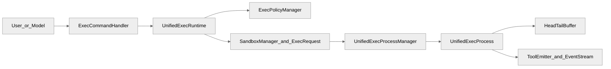
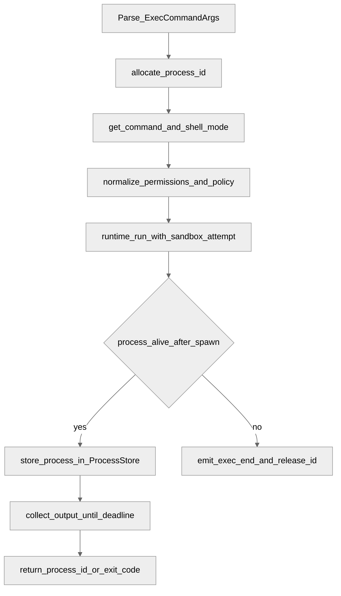
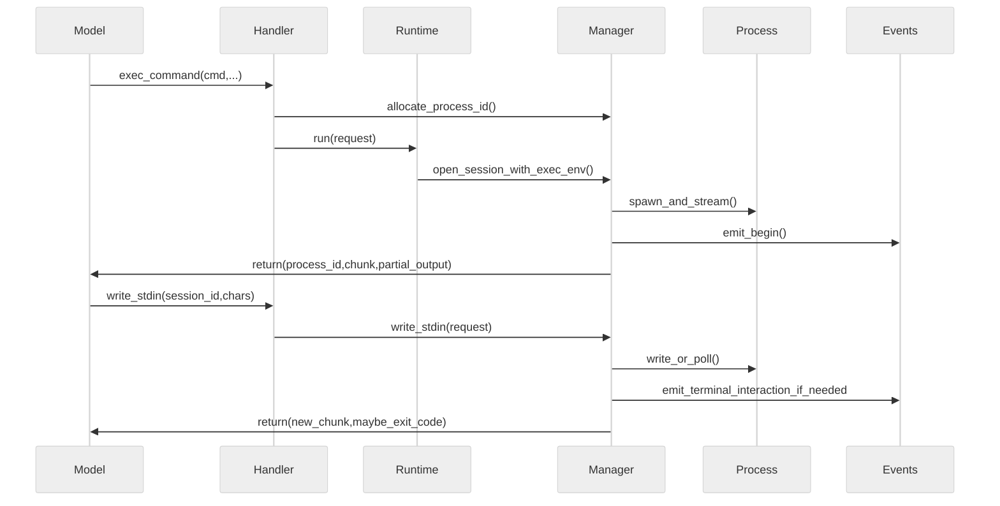
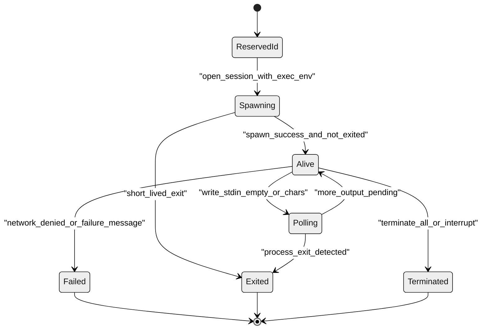
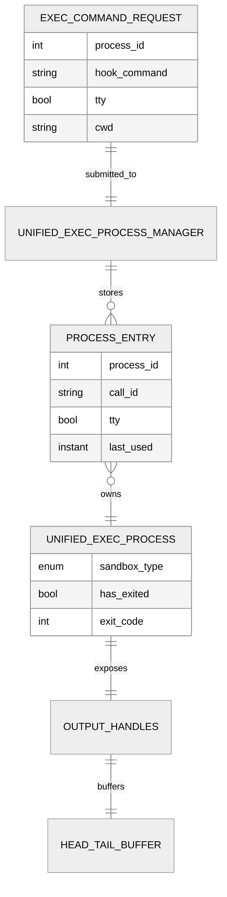
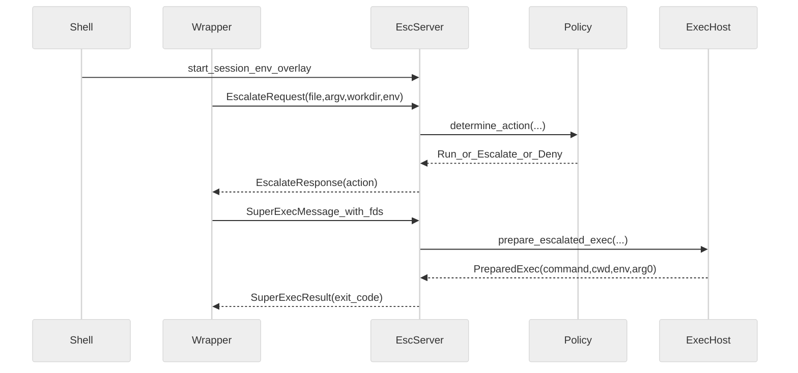

# 第10章 命令执行与 unified_exec

## 引言

在 Codex 的工程体系里，“命令执行”不是一个孤立功能，而是连接模型推理、权限审批、沙箱边界、实时事件流和会话生命周期的一条主链路。本章聚焦的 `unified_exec`，从源码可以观察到一个明显的取向：把“短命令执行”和“长生命周期交互进程”收敛到同一个可审批、可回放、可中断、可复用的执行平面中。它并不只是在 `exec` 上再套一层 API，而是在运行时语义上引入了 `process_id`、`write_stdin`、延迟网络审批、输出缓冲裁剪和后台清理策略——这些都是可在源码里直接定位的实体。

从源码规模看（基于 `wc -l` 实测），这条链路跨度较大：`codex-rs/core/src/exec.rs`（1510 行）、`codex-rs/core/src/unified_exec/process_manager.rs`（1299 行）、`codex-rs/shell-command/src/parse_command.rs`（2526 行）、`codex-rs/shell-escalation/src/unix/escalate_server.rs`（1064 行）、`codex-rs/core/src/exec_policy.rs`（1047 行）共同组成了“命令从模型 token 到 OS 进程”的执行闭环。仓库层面约有 `~120` 个 Rust crate / `Cargo.toml`，绝大多数位于 `codex-rs/` 子树下。可见这一机制并非“单文件工具函数”，而是跨 crate 的基础设施能力。

本章按“全网调研补充 + 七维分析框架”展开，强调两件事：第一，所有核心判断尽量回到可定位的源码证据；第二，凡是涉及“为什么这样设计”的解释，区分“源码事实”与“合理推测”。

## 全网调研补充

### 调研范围与口径

本章 Step 0 对近 12 个月中英文材料做了定向检索，关键词围绕：

- `Codex unified_exec long process`
- `Codex shell-command parser`
- `Codex shell escalation`

参考了官方与社区源：OpenAI Developers、OpenAI 工程博文、Simon Willison、Hacker News、知乎/CSDN/博客园/中文教程站点，以及竞品官方文档（Claude Code / OpenCode / Aider / Goose / Continue）。下面的“共识”和“分歧”都属于二手观察，不代表源码强证据，仅作为讨论入口。

### 社区共识（高置信）

1. **“沙箱边界 + 审批策略”通常被视为双层控制，而不是二选一。**  
   官方文档反复强调 sandbox 决定技术边界，approval 决定交互闸门，`on-request` + `workspace-write` 是默认实践；`yolo` 等价于绕过两层控制。
2. **长任务一般需要进程级持续语义。**  
   社区案例（例如 Simon Willison 的长时任务记录）反复出现“多小时连续 tool call + 大量 token 消耗”，与 `unified_exec` 的后台 process 设计方向一致。
3. **execpolicy 正在被讨论为“可编排信任”的入口之一。**  
   讨论从“硬编码 safelist 是否够用”转向“prefix_rule 是否能表达团队信任边界”。

### 主要分歧与常见误解

1. **误解 A：`--full-auto` 等于 `--yolo`。**  
   实际上二者安全语义不同；前者仍可在 sandbox+approval 体系内工作，后者直接旁路。
2. **误解 B：有命令解析器就能“判定命令绝对安全”。**  
   OpenCode 社区与 Aider/Goose 外部审计都指出，纯 pattern matching 永远存在边界条件，最终仍需 OS 级约束。
3. **误解 C：`auto_review` 会自动扩大权限。**  
   官方说明是“reviewer 替换”，权限边界仍由当前 sandbox/approval 配置决定。
4. **误解 D：输出异常一定是 Codex 执行层 bug。**  
   社区 issue 有不少其实是本地 shell 环境破损导致，体现了运行时与用户环境的耦合复杂性。

### 社区盲区（本章重点补齐）

1. 很少有人系统讲清 `process_id` 的分配/回收/淘汰策略。
2. 很少讨论“网络审批延迟拒绝”如何异步终止已启动进程。
3. 较少分析 `used_complex_parsing` 对 execpolicy 自动修正规则提案的影响。
4. 对 Unix escalation 协议多停留在“有升权”，而非消息与 FD 转发细节。
5. 对 `HeadTailBuffer` 的“中间截断”语义讨论不足，容易误判输出完整性。

---

## 一、本质是什么：`unified_exec` 在 Codex 架构中的定位

从源码可以观察到，`unified_exec` 不只是“再发一次 shell 命令”：它把交互式进程运行时**显式建模为一个有状态资源**——拥有生命周期、输出流、审批缓存键、沙箱上下文和事件语义。

```rust
// codex-rs/core/src/unified_exec/mod.rs:1
//! Unified Exec: interactive process execution orchestrated with approvals + sandboxing.
```

模块顶层注释直接表明定位：审批、沙箱、重试、PTY 进程管理统一编排，并明确拆分 `process.rs / process_manager.rs / process_state.rs` 三层职责。

```rust
// codex-rs/core/src/unified_exec/mod.rs:13
//! 1) Build a small request `{ command, cwd }`.
//! 2) Orchestrator: approval (bypass/cache/prompt) -> select sandbox -> run.
//! 3) Runtime: transform `SandboxTransformRequest` -> `ExecRequest` -> spawn PTY.
```

从调用面看，`exec` 与 `unified_exec` 并非对立：前者仍是基础执行路径，后者把“可持续交互”叠加到统一的 runtime orchestration 上。

```rust
// codex-rs/core/src/exec.rs:295
pub async fn process_exec_tool_call(...) -> Result<ExecToolCallOutput> {
    let exec_req = build_exec_request(...)?;
    crate::sandboxing::execute_env(exec_req, stdout_stream).await
}
```

`unified_exec` 运行时则显式实现 `Sandboxable + Approvable + ToolRuntime` 三个能力接口，可以看出它在工具运行时层面被作为“受控工具运行时”一等公民处理。

```rust
// codex-rs/core/src/tools/runtimes/unified_exec.rs:120
impl Sandboxable for UnifiedExecRuntime<'_> { ... }
// codex-rs/core/src/tools/runtimes/unified_exec.rs:130
impl Approvable<UnifiedExecRequest> for UnifiedExecRuntime<'_> { ... }
// codex-rs/core/src/tools/runtimes/unified_exec.rs:221
impl<'a> ToolRuntime<UnifiedExecRequest, UnifiedExecProcess> for UnifiedExecRuntime<'a> { ... }
```

会话层面，它是 Session 服务的一等成员，由配置驱动创建与销毁：

```rust
// codex-rs/core/src/session/session.rs:984
unified_exec_manager: UnifiedExecProcessManager::new(
    config.background_terminal_max_timeout,
),
```

判断：基于上述源码证据，`unified_exec` 更接近 Codex “可执行性”的状态化内核，而不是“shell 工具别名”。这是从结构定位、Trait 实现和 Session 持有关系三方面综合得出的，源码可证。

---

## 二、核心问题和痛点：它到底在解决什么难题

### 2.1 痛点一：模型表达无限，命令安全判定有限

命令字符串可以无限复杂，但审批与安全判定必须可计算、可解释、可回放。`parse_command` 文件自己就给出“不要手改”的维护警告，可以视为复杂度的告警信号。

```rust
// codex-rs/shell-command/src/parse_command.rs:20
/// DO NOT REVIEW THIS CODE BY HAND
/// This parsing code is quite complex and not easy to hand-modify.
```

量化上（脚本统计），`parse_command.rs` 2526 行，`summarize_main_tokens()` 单函数 426 行（2074-2499），同文件 `#[test]` 数量 79 个，说明其复杂度已接近“独立子系统”。

### 2.2 痛点二：长进程不能等同于短命令

一次性命令可以“执行-返回-结束”；交互进程必须支持：

- 先返回 `process_id`，后续继续写入 stdin；
- 在 turn 结束与后台存活之间保持一致语义；
- 既要流式事件，也要快照式结果；
- 还要在审批拒绝、网络拒绝、会话关闭时可回收。

源码里有一句直接针对“turn 被中断导致进程提前 drop”的注释，可以看作该问题在工程历史上确实出现过：

```rust
// codex-rs/core/src/unified_exec/process_manager.rs:413
// Persist live sessions before the initial yield wait so interrupting the
// turn cannot drop the last Arc and terminate the background process.
```

### 2.3 痛点三：审批策略、execpolicy、沙箱要协同而不是互相打架

`ExecPolicyManager` 在 unmatched command 分支同时看 safelist、dangerous heuristic、approval policy、sandbox 可用性，逻辑不是“允许/拒绝”二分，而是三态 `Allow/Prompt/Forbidden` 的组合推导。

```rust
// codex-rs/core/src/exec_policy.rs:632
pub(crate) fn render_decision_for_unmatched_command(
    command: &[String],
    context: UnmatchedCommandContext<'_>,
) -> Decision {
    let is_known_safe = ... is_known_safe_command(command);
    let command_is_dangerous = ... command_might_be_dangerous(command);
}
```

同时还要处理“复杂解析回退”标记，避免错误自动生成 policy amendment：

```rust
// codex-rs/core/src/exec_policy.rs:294
let auto_amendment_allowed = !used_complex_parsing;
```

### 2.4 痛点四：跨平台执行边界与升权协议

Unix 场景下，升权不是“直接 sudo”，而是单独协议通道 + FD 转发 + policy 决策。`EscalationExecution` 三态（`Unsandboxed/TurnDefault/Permissions`）说明系统要支持“细粒度重执行语义”，不只是 yes/no。

```rust
// codex-rs/shell-escalation/src/unix/escalate_protocol.rs:45
pub enum EscalationExecution {
    Unsandboxed,
    TurnDefault,
    Permissions(EscalationPermissions),
}
```

---

## 三、解决思路与方案：架构设计与关键机制

### 3.1 总体架构图（从 Tool 到 Process）

<div style="background:#ffffff !important; background-color:#ffffff !important; padding:16px; border-radius:8px; margin:16px 0;" bgcolor="#ffffff">



</div>

可以观察到的结构特点是“策略在前、进程在后”：`Handler` 只做参数与请求构建，`Runtime` 负责审批与沙箱编排，`ProcessManager` 才负责状态化进程实体。

### 3.2 启动流程图（`exec_command` 首次调用）

<div style="background:#ffffff !important; background-color:#ffffff !important; padding:16px; border-radius:8px; margin:16px 0;" bgcolor="#ffffff">



</div>

此处可观察到的设计是 **ID 先分配 + 失败路径主动释放**，从源码看可以避免僵尸保留。

```rust
// codex-rs/core/src/unified_exec/process_manager.rs:332
pub(crate) async fn allocate_process_id(&self) -> i32 { ... }
// codex-rs/core/src/unified_exec/process_manager.rs:359
pub(crate) async fn release_process_id(&self, process_id: i32) { ... }
```

### 3.3 时序图（首启 + 轮询 + 续写）

<div style="background:#ffffff !important; background-color:#ffffff !important; padding:16px; border-radius:8px; margin:16px 0;" bgcolor="#ffffff">



</div>

### 3.4 状态图（进程生命周期）

<div style="background:#ffffff !important; background-color:#ffffff !important; padding:16px; border-radius:8px; margin:16px 0;" bgcolor="#ffffff">



</div>

### 3.5 数据结构 ER 图（请求、存储、输出）

<div style="background:#ffffff !important; background-color:#ffffff !important; padding:16px; border-radius:8px; margin:16px 0;" bgcolor="#ffffff">



</div>

### 3.6 升权协议时序图（Unix）

<div style="background:#ffffff !important; background-color:#ffffff !important; padding:16px; border-radius:8px; margin:16px 0;" bgcolor="#ffffff">



</div>

---

## 四、实现细节关键点：关键代码路径 / 关键函数 / 关键数据流

### 4.1 入口层：`exec_command` 如何塑形请求

`ExecCommandHandler::handle` 是统一入口，先做环境解析、命令解析、权限归一化，再委托 `UnifiedExecProcessManager`。

```rust
// codex-rs/core/src/tools/handlers/unified_exec/exec_command.rs:142
let process_id = manager.allocate_process_id().await;
let resolved_command = get_command(...)?;
...
manager.exec_command(ExecCommandRequest { ... }, &context).await
```

`ExecCommandArgs` 11 个字段（`cmd/workdir/shell/login/tty/yield_time_ms/max_output_tokens/sandbox_permissions/additional_permissions/justification/prefix_rule`）用于承接模型参数；`ExecCommandRequest` 16 个字段用于运行时结构化请求。

```rust
// codex-rs/core/src/tools/handlers/unified_exec.rs:27
pub(crate) struct ExecCommandArgs { ... }
// codex-rs/core/src/unified_exec/mod.rs:90
pub(crate) struct ExecCommandRequest { ... 16 fields ... }
```

登录 shell 是否允许由配置硬约束：

```rust
// codex-rs/core/src/tools/handlers/unified_exec.rs:105
Some(true) if !allow_login_shell => {
    return Err(
        "login shell is disabled by config; omit `login` or set it to false.".to_string(),
    );
}
```

### 4.2 运行时层：审批键、缓存与网络审批触发

`UnifiedExecApprovalKey` 把命令、cwd、tty、sandbox 权限等合并为缓存键，有助于减少“同类命令重复弹窗”。

```rust
// codex-rs/core/src/tools/runtimes/unified_exec.rs:82
pub struct UnifiedExecApprovalKey {
    pub command: Vec<String>,
    pub cwd: AbsolutePathBuf,
    pub tty: bool,
    pub sandbox_permissions: SandboxPermissions,
    pub additional_permissions: Option<AdditionalPermissionProfile>,
}
```

审批流优先走 `with_cached_approval`，失败才进入真实请求：

```rust
// codex-rs/core/src/tools/runtimes/unified_exec.rs:176
with_cached_approval(&session.services, "unified_exec", keys, || async move {
    session.request_command_approval(...).await
})
```

网络审批采用 deferred 模式，命令先跑，网络越界时再触发拒绝路径：

```rust
// codex-rs/core/src/tools/runtimes/unified_exec.rs:233
Some(NetworkApprovalSpec {
    mode: NetworkApprovalMode::Deferred,
    ...
})
```

可以观察到的取向是：在“启动时延”和“风险控制”之间做权衡，不强求“启动前先拿到全部网络许可”。

### 4.3 策略层：execpolicy 与 safe/dangerous heuristic 的并联

`create_exec_approval_requirement_for_command` 负责把策略计算成三态结果：`Forbidden / NeedsApproval / Skip`。

```rust
// codex-rs/core/src/exec_policy.rs:272
pub(crate) async fn create_exec_approval_requirement_for_command(...) -> ExecApprovalRequirement
```

unmatched 命令会走 `render_decision_for_unmatched_command`，同时使用 `is_known_safe_command()` 与 `command_might_be_dangerous()`：

```rust
// codex-rs/core/src/exec_policy.rs:646
ExecPolicyCommandOrigin::Generic => is_known_safe_command(command),
// codex-rs/core/src/exec_policy.rs:677
ExecPolicyCommandOrigin::Generic => command_might_be_dangerous(command),
```

且“复杂解析回退”会禁用自动 amendment：

```rust
// codex-rs/core/src/exec_policy.rs:294
let auto_amendment_allowed = !used_complex_parsing;
```

### 4.4 解析层：`parse_command` 与 bash tree-sitter 组合

`parse_command` 的顶层策略是“先解析、后去重、若含 unknown 则整体降级为单 unknown”，可以视为保守优先的设计取向。

```rust
// codex-rs/shell-command/src/parse_command.rs:30
pub fn parse_command(command: &[String]) -> Vec<ParsedCommand> {
    ...
    if deduped.iter().any(|cmd| matches!(cmd, ParsedCommand::Unknown { .. })) {
        vec![single_unknown_for_command(command)]
    } else {
        deduped
    }
}
```

`ParsedCommand` 枚举只有 4 类（`Read / ListFiles / Search / Unknown`），可以观察到这是一种“低维语义摘要”的取向，便于 UI 与日志统一展示。

```rust
// codex-rs/protocol/src/parse_command.rs:9
pub enum ParsedCommand {
    Read { ... },
    ListFiles { ... },
    Search { ... },
    Unknown { ... },
}
```

bash 侧用 tree-sitter 做“仅词级命令序列”解析，强约束允许节点/符号：

```rust
// codex-rs/shell-command/src/bash.rs:36
const ALLOWED_KINDS: &[&str] = &[ ... ];
// codex-rs/shell-command/src/bash.rs:52
const ALLOWED_PUNCT_TOKENS: &[&str] = &["&&", "||", ";", "|", "\"", "'"];
```

量化（脚本统计）：`ALLOWED_KINDS` 11 项、`ALLOWED_PUNCT_TOKENS` 6 项、`bash.rs` 中 `#[test]` 29 个。

### 4.5 安全判定层：safe list 与危险选项筛查

`is_safe_to_call_with_exec()` 对 24 个常见只读命令（`cat/cd/cut/echo/expr/false/grep/head/id/ls/nl/paste/pwd/rev/seq/stat/tail/tr/true/uname/uniq/wc/which/whoami`）直接放行，再对 `find/rg/git/sed/base64` 做特判。

```rust
// codex-rs/shell-command/src/command_safety/is_safe_command.rs:72
Some(
    "cat" | "cd" | "cut" | ... | "whoami") => true
```

危险选项常量化，便于减少回归：

```rust
// codex-rs/shell-command/src/command_safety/is_safe_command.rs:115
const UNSAFE_FIND_OPTIONS: &[&str] = &["-exec", "-execdir", "-ok", "-okdir", "-delete", ...];
// codex-rs/shell-command/src/command_safety/is_safe_command.rs:131
const UNSAFE_RIPGREP_OPTIONS_WITH_ARGS: &[&str] = &["--pre", "--hostname-bin"];
// codex-rs/shell-command/src/command_safety/is_safe_command.rs:233
const UNSAFE_GIT_GLOBAL_OPTIONS: &[GitOptionPattern] = &[ ... 18 entries ... ];
```

dangerous heuristic 目前很克制：核心是 `rm -f/-rf` 与 `sudo` 递归展开。

```rust
// codex-rs/shell-command/src/command_safety/is_dangerous_command.rs:149
Some("rm") => matches!(command.get(1).map(String::as_str), Some("-f" | "-rf")),
// codex-rs/shell-command/src/command_safety/is_dangerous_command.rs:152
Some("sudo") => is_dangerous_to_call_with_exec(&command[1..]),
```

### 4.6 执行层：`exec.rs` 的统一执行与拒绝检测

`exec.rs` 仍是底座：`process_exec_tool_call -> build_exec_request -> execute_env`。

```rust
// codex-rs/core/src/exec.rs:303
let exec_req = build_exec_request(...)?;
crate::sandboxing::execute_env(exec_req, stdout_stream).await
```

超时与取消语义通过 `ExecExpiration` 统一建模（`Timeout / DefaultTimeout / Cancellation / TimeoutOrCancellation`）：

```rust
// codex-rs/core/src/exec.rs:153
pub enum ExecExpiration {
    Timeout(Duration),
    DefaultTimeout,
    Cancellation(CancellationToken),
    TimeoutOrCancellation { ... },
}
```

沙箱拒绝判定采用“关键词 + 退出码 + seccomp 信号”的启发式融合：

```rust
// codex-rs/core/src/exec.rs:789
pub(crate) fn is_likely_sandbox_denied(...) -> bool {
    const SANDBOX_DENIED_KEYWORDS: [&str; 7] = [ ... ];
    const QUICK_REJECT_EXIT_CODES: [i32; 3] = [2, 126, 127];
}
```

源码注释明确承认这是一种概率判定，不是形式化证明，存在边界条件——这意味着维护成本会随 shell 生态变化而持续。

### 4.7 进程层：`UnifiedExecProcessManager` 与 `UnifiedExecProcess`

`exec_command()` 函数 225 行（369-593，脚本统计），属于“编排函数”而非“单点算法”。其关键动作：

1. 打开会话并接收 deferred network approval。
2. 启动输出流转发并发出 Begin 事件。
3. 活进程先存储，再首轮采样。
4. 若短命令已退出，立即 Emit End + 释放 ID。
5. 若仍存活，返回 `process_id` 等待后续 `write_stdin`。

`write_stdin()`（144 行）把“交互输入”和“纯轮询”分开处理：空输入走后台 poll 语义，且 `yield_time_ms` 下限 5000ms。

```rust
// codex-rs/core/src/unified_exec/process_manager.rs:647
if request.input.is_empty() {
    time_ms.clamp(MIN_EMPTY_YIELD_TIME_MS, self.max_write_stdin_yield_time_ms)
}
```

`collect_output_until_deadline()`（88 行）支持 pause 扩展 deadline，避免 out-of-band elicitation 阶段误超时。

```rust
// codex-rs/core/src/unified_exec/process_manager.rs:1108
Self::extend_deadlines_while_paused(&mut pause_state, &mut deadline, &mut post_exit_deadline).await;
```

`UnifiedExecProcess` 抽象本地 PTY 与 exec-server 两种 handle，并提供统一的输出句柄、退出状态和拒绝检测。

```rust
// codex-rs/core/src/unified_exec/process.rs:74
pub(crate) struct UnifiedExecProcess {
    process_handle: ProcessHandle,
    output_buffer: OutputBuffer,
    ...
    sandbox_type: SandboxType,
}
```

输出缓冲采用 `HeadTailBuffer`，默认上限 1MiB，50% 头 + 50% 尾，明确丢弃中间字节：

```rust
// codex-rs/core/src/unified_exec/head_tail_buffer.rs:4
/// A capped buffer that preserves a stable prefix ("head") and suffix ("tail")
// codex-rs/core/src/unified_exec/head_tail_buffer.rs:31
pub(crate) fn new(max_bytes: usize) -> Self {
    let head_budget = max_bytes / 2;
    let tail_budget = max_bytes.saturating_sub(head_budget);
}
```

### 4.8 升权层：`shell-escalation` 的协议化执行

`EscalateServer::start_session()` 只生成环境 overlay，不接管 shell 的完整生命周期，边界相对清晰。

```rust
// codex-rs/shell-escalation/src/unix/escalate_server.rs:206
env.insert(ESCALATE_SOCKET_ENV_VAR.to_string(), client_socket_fd.to_string());
env.insert(EXEC_WRAPPER_ENV_VAR.to_string(), self.execve_wrapper.to_string_lossy().to_string());
```

`handle_escalate_session_with_policy()` 根据策略走三分支：`Run / Escalate / Deny`，并在 `Escalate` 分支执行 FD 映射后重启命令。

```rust
// codex-rs/shell-escalation/src/unix/escalate_server.rs:289
match decision {
    EscalationDecision::Run => { ... }
    EscalationDecision::Escalate(execution) => { ... }
    EscalationDecision::Deny { reason } => { ... }
}
```

### 4.9 事件与会话收尾：防泄漏与可观测

`ToolEmitter::unified_exec()` 在 Begin 阶段即集成 `parse_command()`，UI 与日志侧能在第一时间拿到统一语义摘要。

```rust
// codex-rs/core/src/tools/events.rs:151
pub fn unified_exec(command: &[String], cwd: AbsolutePathBuf, source: ExecCommandSource, process_id: Option<String>) -> Self {
    let parsed_cmd = parse_command(command);
    ...
}
```

后台清理入口是会话 handler 的 `clean_background_terminals()`：

```rust
// codex-rs/core/src/session/handlers.rs:70
pub async fn clean_background_terminals(sess: &Arc<Session>) {
    sess.close_unified_exec_processes().await;
}
```

最终落到 `terminate_all_processes()`，shutdown 时也会统一调用：

```rust
// codex-rs/core/src/tasks/mod.rs:839
pub(crate) async fn close_unified_exec_processes(&self) {
    self.services.unified_exec_manager.terminate_all_processes().await;
}
```

可以观察到的设计是：显式清理与隐式 shutdown 两条路径都会汇聚到同一终止函数，有助于减少残留后台进程。

---

## 五、易错点和注意事项：高频陷阱清单

### 1) `login shell` 配置与工具参数冲突

如果配置 `allow_login_shell=false`，而模型传 `login=true`，会直接拒绝执行。这个拒绝并不是 runtime error，而是参数约束错误。

```rust
// codex-rs/core/src/tools/handlers/unified_exec.rs:105
Some(true) if !allow_login_shell => return Err("login shell is disabled ...")
```

### 2) 解析降级导致“全局 unknown”

`parse_command()` 只要包含一个 `Unknown`，就会整体降级为单 `Unknown`。这种取向有助于保守安全，但会损失部分结构化可解释性。

```rust
// codex-rs/shell-command/src/parse_command.rs:40
if deduped.iter().any(|cmd| matches!(cmd, ParsedCommand::Unknown { .. })) {
    vec![single_unknown_for_command(command)]
}
```

### 3) `used_complex_parsing=true` 会抑制自动规则修正提案

这条逻辑容易被忽略，导致“为什么某些命令不建议自动写入规则”的疑问。

```rust
// codex-rs/core/src/exec_policy.rs:294
let auto_amendment_allowed = !used_complex_parsing;
```

### 4) 空轮询并非“立即返回”

`write_stdin` 空输入下限是 `MIN_EMPTY_YIELD_TIME_MS=5000`，如果 UI 预期“秒回”，会误认为阻塞。

```rust
// codex-rs/core/src/unified_exec/mod.rs:65
pub(crate) const MIN_EMPTY_YIELD_TIME_MS: u64 = 5_000;
```

### 5) 进程池到达上限会触发淘汰，不是无限增长

默认最多 64 个进程；策略是保护最近 8 个，优先清理已退出且最久未使用。

```rust
// codex-rs/core/src/unified_exec/mod.rs:71
pub(crate) const MAX_UNIFIED_EXEC_PROCESSES: usize = 64;
// codex-rs/core/src/unified_exec/process_manager.rs:1246
let protected: HashSet<i32> = by_recency.iter().take(8).map(...).collect();
```

### 6) `zsh-fork` 后端不支持 remote environment

这是带显式边界条件的硬约束，不是“性能优化可选项”。

```rust
// codex-rs/core/src/tools/runtimes/unified_exec.rs:307
if req.environment.is_remote() {
    return Err(ToolError::Rejected("unified_exec zsh-fork is not supported for remote environments".to_string()));
}
```

### 7) 安全判定是启发式，不是形式化证明

`is_likely_sandbox_denied()` 本质是概率判定（关键词 + 特殊退出码），源码注释自身就承认存在不确定性，因而存在误报/漏报边界。

```rust
// codex-rs/core/src/exec.rs:784
/// We don't have a fully deterministic way to tell if our command failed
/// because of the sandbox ...
```

### 8) 清理路径有多个入口，漏掉任一入口都可能残留后台进程

除了显式清理命令，session shutdown 也要走终止流程，工程上不能只测 happy path。

```rust
// codex-rs/core/src/session/handlers.rs:599
async fn shutdown_session_runtime(sess: &Arc<Session>) {
    ...
    sess.services.unified_exec_manager.terminate_all_processes().await;
}
```

---

## 六、竞品对比：同类系统在命令执行面怎么做

> 说明：本节对比基于公开文档与公开仓库信息；Codex 侧论据来自源码，其他系统侧来自官方文档/公开审计材料，不推断其私有实现细节，结论以可辩护表述为主。

### 6.1 对比维度

- 命令执行是否支持“长生命周期 + 续写 stdin”
- 审批是否可编程（规则、hook、策略）
- 是否具备 OS 级沙箱与越权重执行协议
- headless/CI 下审批语义是否清晰

### 6.2 Codex 的可观察特点（源码可证）

1. **有状态进程模型**：`exec_command + write_stdin + process_id`，进程在 manager 里持续存活。  
2. **审批缓存键显式化**：`UnifiedExecApprovalKey` 把命令上下文组合成可重用键。  
3. **execpolicy 与 heuristic 组合**：不是单 allowlist，也不是纯手工规则。  
4. **Unix 升权协议化**：`EscalationDecision + EscalationExecution + FD 转发`。  
5. **输出中间截断策略**：`HeadTailBuffer` 对超长输出保头保尾。  

### 6.3 与 Claude Code / Continue / Aider / Goose / OpenCode 的差异（基于公开资料）

1. **Claude Code**  
   官方文档重点在 hooks 与 permission rules，可在 `PreToolUse` 拦截工具调用，治理面较完善；公开材料更强调“规则/Hook 编排”，从公开文档看不到类似 `process_id + write_stdin` 的统一长进程 API。

2. **Continue CLI**  
   `allow/ask/exclude` 策略体系清晰，`--readonly/--auto` 模式优先级明确；headless 下 `ask` 工具会被排除，对 CI 友好，但公开资料中长进程交互抽象不如 Codex `unified_exec` 突出。

3. **Aider**  
   `/run` 与 `/test` 走用户触发模型建议，公开资料显示默认并无内建 OS 沙箱，更多依赖用户外部隔离（容器/runner）。

4. **Goose**  
   有 tool permission 配置与模式切换，公开资料普遍提到“默认运行在本机权限下”，沙箱通常由外部包装实现。

5. **OpenCode**  
   权限配置较灵活，社区也有 sandbox plugin；从公开材料看，“exec 语义是否拆分成统一长进程运行时”这一点描述不如 Codex 明确，更多体现为插件/策略组合。

### 6.4 对比小结

可以观察到，Codex 在“命令执行面”的差异化不仅在安全策略层面，更体现在**把策略、进程状态、输出语义、审批缓存和会话生命周期合并到同一个运行时对象**这一取向上。是否更优要看场景；对长任务、交互式 REPL、分段执行等需要持续控制面的工作流，这种统一抽象的可控性体感会更明显。

---

## 七、仍存在的问题和缺陷：设计局限与改进空间

### 7.1 启发式判定仍可能误报/漏报

`is_likely_sandbox_denied()` 依赖关键词与退出码，难以覆盖全部 shell 初始化噪声、工具链自定义错误文本，工程上需要持续补词和回归。

### 7.2 解析器复杂度高，维护成本持续上升

`parse_command.rs` 的复杂度与“手改风险”已经在源码注释中明确，虽然测试覆盖较高（79 个 `#[test]`），但仍建议继续模块化拆分 `summarize_main_tokens`（426 行）。

### 7.3 safelist 是静态集合，领域迁移成本高

24 项固定安全命令 + 若干特判规则在常见场景实用，但面对新工具链（语言生态命令、企业内工具）时，仍需依赖 execpolicy 才能避免“频繁 prompt / 误判阻塞”。

### 7.4 进程池淘汰策略偏经验法则

“总量 64 + 保护最近 8 + 优先淘汰已退出”是合理默认，但在高并发自动化场景下，仍可能误伤长时间 idle 但语义上关键的后台进程；目前没有“用户级 pin 进程”机制。

### 7.5 配置分层对用户心智仍有门槛

`allow_login_shell`、`background_terminal_max_timeout`、`use_experimental_unified_exec_tool`、approval policy、execpolicy、runtime feature flag 同时存在，排障时需要较强的配置意识。

```rust
// codex-rs/core/src/config/mod.rs:943
pub use_experimental_unified_exec_tool: bool,
// codex-rs/core/src/config/mod.rs:947
pub background_terminal_max_timeout: u64,
```

### 7.6 升权链路虽清晰，但跨平台一致性仍是长期课题

Unix escalation 协议设计相对完整，但不同平台的沙箱/升权能力与行为细节仍可能有偏差；这类偏差通常在边缘命令与企业环境中暴露。

## 附：七维深入拆解（工程复盘版）

前文已经给出结构化结论，但如果把目标从“理解功能”提升到“可维护、可演进、可排障”，还需要再往下走一层：不仅看“做了什么”，还要看“为什么这样做”“这样做的副作用是什么”“未来改动会碰到哪些硬边界”。这一节就是这层复盘。需要说明：以下“为什么”的部分中，凡是无法从源码直接证明的部分，都尽量加上“可能/或许”等审慎措辞。

### A. 本质层复盘：为何选择做成状态化运行时

在很多工具里，命令执行只是一次函数调用：给定命令，得到结果，生命周期在函数内闭合。Codex 的 `unified_exec` 从结构上明显偏离了这种模型。它把执行行为抽象为**可续写、可观察、可回收**的状态资源，这个资源贯穿 turn 甚至会话级别。这种取向背后的动机源码未直接说明，但可以从以下三处观察到一致的设计意图：

1. **请求对象是长生命周期导向的**：`ExecCommandRequest` 不只有命令和 cwd，还有 `process_id`、`yield_time_ms`、`tty`、`additional_permissions`、`prefix_rule` 等行为控制字段。  
2. **存储对象显式保存进程实体**：`ProcessEntry` 记录 `process`、`call_id`、`network_approval`、`last_used`，不是“执行完即丢”。  
3. **关闭路径在 Session 生命周期中可达**：`clean_background_terminals` 与 shutdown 都会触发终止。

```rust
// codex-rs/core/src/unified_exec/mod.rs:90
pub(crate) struct ExecCommandRequest { ... }
// codex-rs/core/src/unified_exec/mod.rs:152
struct ProcessEntry { ... }
// codex-rs/core/src/session/handlers.rs:70
pub async fn clean_background_terminals(sess: &Arc<Session>) {
    sess.close_unified_exec_processes().await;
}
```

这种选择的工程意义可能比较大：它允许 Codex 处理“持续输出、分段输入、策略变更后续处理”这类传统 shell 调用不易优雅表达的场景。代价是系统复杂度明显上升，但收益体现在自治任务的稳定性和一致性上。

### B. 痛点层复盘：真正棘手的是“多约束同时成立”

从代码阅读体验看，`unified_exec` 最难的不是任何单个函数，而是跨层约束同时成立：

- 审批体验不能过度打断，也不能绕过风险；
- 沙箱要先保护默认路径，又要允许受控升级；
- 输出要可流式观察，也要能在响应体里落快照；
- 进程要能长期存活，又不能无限占资源；
- turn 结束逻辑不能错误提前收口。

这类“多目标优化”在源码里一个比较典型的体现是 turn 的 `needs_follow_up` 逻辑：模型流结束并不等于回合业务结束，工具执行结果会继续影响回合推进。

```rust
// codex-rs/core/src/session/turn.rs:1729
let mut needs_follow_up = false;
...
// codex-rs/core/src/session/turn.rs:1873
needs_follow_up |= output_result.needs_follow_up;
```

这条链路可以解释一个常见误区：很多用户以为“模型回复 completed”就说明系统空闲。事实上，在 `unified_exec` 场景里，后台 process 仍可能活着，后续 `write_stdin` 轮询会继续推进状态。

### C. 方案层复盘：审批、策略、执行的顺序为什么重要

`unified_exec` 的一个关键工程取向是把流程拆成三段并固定顺序：

1. **可否执行（policy + approval）**  
2. **如何执行（sandbox + environment transform）**  
3. **执行后如何持续管理（process manager）**

如果顺序倒置（例如先跑再补审批），会直接破坏审计可解释性；如果把审批与策略分散在多个地方，可能导致同命令在不同入口行为不一致。Codex 通过 runtime trait 组合把这件事收敛到了单路径，源码上可以看到 `Approvable` 与 `ToolRuntime` 接口的分离。

```rust
// codex-rs/core/src/tools/runtimes/unified_exec.rs:130
impl Approvable<UnifiedExecRequest> for UnifiedExecRuntime<'_> { ... }
// codex-rs/core/src/tools/runtimes/unified_exec.rs:221
impl<'a> ToolRuntime<UnifiedExecRequest, UnifiedExecProcess> for UnifiedExecRuntime<'a> { ... }
```

再看策略侧，`create_exec_approval_requirement_for_command()` 的输出不是简单 bool，而是 `Forbidden / NeedsApproval / Skip` 三态，并可附带 amendment 提案。这让“决策”和“后续治理建议”在同一个计算点上产出，可以减少跨层信息丢失。

### D. 实现层复盘：最容易被忽略的四条暗线

#### D.1 暗线一：`process_id` 的保留集合用于防竞态

系统先把 ID 放进 `reserved_process_ids`，再进行真实启动。这样即使启动失败，也不会因为并发分配导致“同 ID 双占用”。

#### D.2 暗线二：`store_process` 的调用时机是稳定性关键

代码里明确注释“在首次 yield 等待前持久化 live session”，这行注释背后可以推测对应一次并发回收竞态修复经验：如果不提前存储，turn 被中断会直接 drop 最后引用导致后台进程被误杀。

```rust
// codex-rs/core/src/unified_exec/process_manager.rs:413
// Persist live sessions before the initial yield wait ...
```

#### D.3 暗线三：输出系统有三层语义，不可混用

1. `ToolEvent` 的流式输出（可观测）  
2. `ExecCommandToolOutput.raw_output` 的响应快照（可消费）  
3. `HeadTailBuffer` 的进程级保留（可续轮）  

排障时如果不先区分这三层，容易出现“日志里看见了，响应里没看到”或“响应里看见了，后续轮询没看到”的误判。

#### D.4 暗线四：网络审批 deferred 模式是“先执行后仲裁”

`NetworkApprovalMode::Deferred` 意味着系统允许命令先在当前边界启动，再在网络触发点进行审批。拒绝后由异步路径终止进程。这一取向可以理解为把“启动时延”和“风险控制”分离，优先保证可用性。

### E. 风险层复盘：8 个“看起来像 bug，实际是设计结果”的现象

1. **空轮询等待长**：因为 `MIN_EMPTY_YIELD_TIME_MS=5000`，不是卡死。  
2. **命令摘要退化成 Unknown**：因为有 unknown 即全局降级。  
3. **同命令有时会再弹审批**：approval key 受 cwd/tty/permissions 影响。  
4. **输出被截断**：`HeadTailBuffer` 会丢中间段，不是丢头尾。  
5. **后台进程“突然消失”**：可能被 prune 或 shutdown 清理。  
6. **规则建议时有时无**：`used_complex_parsing=true` 禁止自动 amendment。  
7. **zsh-fork 在远程不可用**：设计硬限制，不是临时故障。  
8. **sandbox denied 文案不稳定**：启发式关键词判定决定了文本依赖。

这些现象如果提前被团队认知，故障工单往往能显著减少。

### F. 竞品层复盘：同题不同解的工程取舍

对比主流工具后可以看到，大家都在做“命令执行安全化”，但主路径不同：

- **规则优先型**：强调 hooks/permissions 组合；
- **交互优先型**：强调 ask/allow 节奏与用户体验；
- **外部隔离优先型**：强调容器或 wrapper；
- **运行时统一型**（Codex 较为接近）：把策略、审批、进程状态、事件统一到一个执行模型。

不能简单说谁优劣，关键看目标：  
如果主要是一次性代码修改，规则优先模型一般就够用；  
如果目标是长时自治任务，运行时统一模型的可控性体感会更明显。

### G. 缺陷层复盘：未来值得考虑的几条演进线

#### G.1 更结构化的拒绝与失败语义

目前不少失败信息仍通过字符串传播。可以考虑引入稳定错误码分层（policy_reject / sandbox_deny / network_defer_cancel / process_pruned / io_truncated），便于平台化观测与 A/B 调优。

#### G.2 更可学习的规则建议系统

当前 amendment 仍偏“静态前缀提案”。一种可能的演进是引入“会话内成功执行频次 + 风险标签 + 工作区范围”联合评分，自动生成更保守但更实用的建议。

#### G.3 面向长任务的进程优先级管理

64 上限 + LRU 保护是合理默认，但对复杂自治流可能不够。未来可考虑：

- pin/unpin 进程；
- 按进程类型（watcher、test、repl）分级；
- 对被 prune 进程发显式诊断事件而非静默淘汰。

### H. 三个典型链路推演（从源码逻辑到用户感知）

#### H.1 链路一：启动长测试 + 空轮询

用户看到的行为：执行后立即返回 `process_id`，之后每隔一段时间 poll。  
源码发生的动作：分配 ID -> 启动进程 -> store_process -> collect_output_until_deadline -> 返回快照。  
关键点：空轮询不是 busy loop，而是受最小等待时间约束。

#### H.2 链路二：`bash -lc` 复杂脚本 + 规则提案

用户看到的行为：有些脚本会提示可写规则，有些不会。  
源码发生的动作：plain parser 优先，失败后 complex parser 回退并打标；打标后 amendment 被禁用。  
关键点：这是“置信度保护”，不是产品不一致。

#### H.3 链路三：网络触发拒绝后的中断

用户看到的行为：进程先输出几行，然后失败退出。  
源码发生的动作：deferred 审批监听触发 -> fail_and_terminate -> 释放 ID -> 写入失败消息。  
关键点：该行为说明“控制在运行中生效”，不是单纯启动前静态校验。

### I. 维护建议（面向未来贡献者）

1. **改 parser 先补测试样例**：尤其是 heredoc、connector、quoted operator。  
2. **改审批逻辑要串读 3 处**：`exec_policy.rs`、`unified_exec runtime`、`session/handlers.rs`。  
3. **改进程回收策略要压测并发边界**：至少验证 64+ 进程与交互轮询混合场景。  
4. **改输出逻辑时区分“展示层”和“返回层”**：不要把 event 输出当作 response 完整性证明。  
5. **改 escalation 必做 FD 一致性检查**：否则可能出现隐性 IO 串线。

### J. 扩展结论

从源码工程角度给本章一个综合判断：`unified_exec` 可以理解为 Codex 把“命令调用能力”升级为“可治理执行系统”的一个分水岭节点。它的复杂度并非偶然堆积，而是目标函数变化后的合理代价。  

过去我们评估命令执行，关注的常常是“能不能执行”；  
在 `unified_exec` 之后，评估标准更接近四点同时成立：

- 能不能执行；
- 谁批准执行；
- 在什么边界执行；
- 执行之后如何持续纳入会话状态与审计链路。

这四点一起成立，更可能成为长时自治编码代理可落地的前提条件。

## 附：实现路径逐步推演（详细版）

这一节按“真实一次调用”的顺序，给出从模型发起 `exec_command` 到 turn 结束、再到后台清理的完整推演。与前文不同，这里强调“每一步的输入输出是什么、失败点在哪里、系统如何恢复”。

### Step 1：模型生成工具调用参数

模型先产出 `exec_command` 参数（`cmd/workdir/login/tty/...`）。此时系统面对的第一个风险不是命令本身，而是**参数语义歧义**：例如模型把 shell 运算符错误当成普通 argv 字符串、把 `login=true` 与配置约束冲突、或者提交了错误的 `additional_permissions` 结构。

因此入口层先做参数解析与规范化，而不是立刻执行。这个顺序的好处是“错误越早被发现，恢复成本越低”。如果参数级失败，系统会在模型回合内给出可解释错误，而不是在 OS 执行层抛出难读异常。

### Step 2：分配 `process_id`，建立运行标识

`allocate_process_id` 会先锁住 `process_store`，再做 deterministic 或 random 分配。这个动作虽然快，但语义关键：从这一刻开始，这次执行拥有了可追踪 identity。后续所有输出事件、stdin 续写、清理动作都依赖这个 ID。

需要注意：ID 分配成功并不代表进程已启动。它只是“占位符”。如果后续启动失败，会走 `release_process_id` 做回收，避免把失败执行留成假活跃状态。

### Step 3：`get_command` 决定 shell 参数形态

`get_command` 会基于 `UnifiedExecShellMode` 决定命令如何包装：`Direct` 模式走当前 shell 推导参数，`ZshFork` 模式构造显式 `zsh -c/-lc` 参数。  

这一步对最终行为影响很大：同样的 `cmd` 字符串，在不同 shell 模式、不同 `login` 组合下可能产生完全不同环境初始化副作用（profile 脚本、PATH、alias）。因此它是排障中高频关注点。

### Step 4：权限归一化与提权语义检查

系统会把 turn 级授予权限与本次请求权限合并，形成 `effective_additional_permissions`。  

随后会检查一个比较关键的约束：当当前审批策略不允许请求升级权限时，必须拒绝这次提权请求。这个拒绝发生在执行前，可以避免“先运行后回滚”的高风险路径。

### Step 5：构造 Approval Key，命中或发起审批

`UnifiedExecApprovalKey` 组合了 canonical command、cwd、tty、sandbox 权限与 additional permissions。这里的 canonicalization 不是表面去空格，更接近“减少语义等价命令的重复审批弹窗”这一意图。

若 key 命中缓存，可直接沿用先前审批结果；未命中则请求审批。这样在长任务里可以明显减少“同命令反复确认”的交互噪声。

### Step 6：执行策略计算（execpolicy + heuristic）

策略层拿到命令后，会先做 `commands_for_exec_policy` 拆分。  

- 如果能被 plain parser 稳定解析，按子命令逐段评估；
- 如果只能 complex fallback，标记 `used_complex_parsing=true`；
- 最终由 `render_decision_for_unmatched_command` 在 safelist / dangerous / approval policy / sandbox context 下给出决策。

这一步比较有价值的地方在于：它不会把不确定命令“伪装成确定安全”，而是把不确定性交给 Prompt 或 Forbidden 分支处理。

### Step 7：Runtime 组装 sandbox 执行请求

`UnifiedExecRuntime::run` 会把命令、env、network、sandbox permissions 合并成 `ExecRequest`。  

如果启用了受管网络，会把网络代理参数注入环境；如果是 PowerShell 且在特定 sandbox 级别，会走 profile 关闭逻辑；如果是 `ZshFork` 且远程环境，会直接拒绝。  

这一步体现了 Codex 的“执行前重写”取向：尽可能在 spawn 前把边界与副作用约束清楚，而不是 spawn 后靠字符串猜测。

### Step 8：`open_session_with_exec_env` 启动进程并接管输出

启动成功后会创建 `UnifiedExecProcess`，统一管理本地 PTY 或 exec-server 句柄。输出路径也在这里统一：无论后端是什么，都会写入 `OutputBuffer + broadcast + notify` 三件套。

`UnifiedExecProcess` 同时持有 `cancellation_token` 与 `state_tx/state_rx`，这让退出检测、失败传播和外部终止拥有一致接口。

### Step 9：Begin 事件发出，前端进入可观测状态

`ToolEmitter::unified_exec` 会在 Begin 阶段就触发事件，让 UI 立刻知道“命令已启动，process_id 是什么，摘要语义是什么”。  

这一步看似简单，实际是交互体验关键：如果等首轮输出才发事件，长启动命令会给用户“无响应”错觉。

### Step 10：活进程先持久化，再做首轮输出采样

前文提过，这一步可以视为对竞态问题的修复。其效果是：即便 turn 在启动后很快被中断，后台进程也不会因为 Arc 引用链断裂而被误杀。

换句话说，系统显式把“启动成功”与“首轮采样完成”拆开了，这是长任务稳定性的关键差别。

### Step 11：首轮响应返回（可能带 `process_id`，也可能已退出）

`exec_command` 首轮返回分两类：

1. **进程仍活着**：返回 `process_id`，后续靠 `write_stdin` 继续交互；
2. **短命令已退出**：立刻返回 exit_code 并释放 ID。

这两类统一在同一 API 下，调用侧无需区分“短命令接口”和“长命令接口”，可降低模型工具使用复杂度。

### Step 12：`write_stdin` 续写或轮询

`write_stdin` 收到请求后先拿进程句柄：

- 若 `chars` 非空，且进程非 tty，会返回 `StdinClosed`；
- 若 `chars` 为空，视为后台 poll，按 `MIN_EMPTY_YIELD_TIME_MS` 下限等待；
- 无论写入还是轮询，都会再走一次输出采样并构造 chunk 返回。

这种设计让一个接口同时覆盖“主动输入”和“被动读输出”两种交互模式。

### Step 13：延迟网络拒绝与失败传播

当网络审批采用 deferred 时，进程可能先启动；若后续审批拒绝，系统会异步调用 `fail_and_terminate`。  

对用户而言，这表现为“命令跑了一小段后终止”，但从治理视角看这是有意设计：优先保障低时延启动，同时保留边界控制。

### Step 14：输出裁剪与长日志处理

`HeadTailBuffer` 在输出超限时保留头尾并丢弃中间，避免内存失控。  

这意味着日志排障时应注意：你看到的是“首段 + 尾段”拼接，而非完整连续文本。某些中间错误可能被截掉，需要结合外部日志或缩小命令输出范围复现。

### Step 15：turn 层 `needs_follow_up` 合并

即便模型输出流 completed，只要工具输出标记需要后续推进，turn 仍可继续。这确保长流程不会被“模型流事件”过早截断。  

这也是 `unified_exec` 能在多轮持续执行中保持状态一致的关键点之一。

### Step 16：显式清理与会话 shutdown 收口

系统提供两类收口：

1. 用户显式 `clean_background_terminals`；
2. 会话 shutdown 统一 `terminate_all_processes`。

这两条路径都必须有效，因为真实场景里用户不一定记得手动清理。

### Step 17：进程上限与淘汰策略生效

当进程数量达到上限 64，系统会触发 prune。策略是：

- 保护最近使用的 8 个；
- 优先淘汰“已退出且最久未使用”；
- 再淘汰未保护的最久未使用。

这个策略在活跃交互与资源约束之间做了权衡，但并不等于“永不误伤”。高并发自动化场景仍建议结合业务层做进程管理。

### Step 18：Unix escalation 在何时介入

当命令触发越权路径，Unix escalation 通过 socket + FD 协议介入。流程是：

1. wrapper 发送 `EscalateRequest`；
2. policy 返回 `Run/Escalate/Deny`；
3. 若 `Escalate`，再做 `SuperExecMessage` FD 传递；
4. server 侧 `prepare_escalated_exec` 并执行；
5. 返回 `SuperExecResult`。

这里的重点是“协议化”而非“命令替换”，可审计性相对更强。

### Step 19：为什么这套设计适合长时自治任务

当任务持续数十分钟到数小时，传统“短命令 + 人工串联”可能会出现三类问题：

- 上下文丢失：每次命令都像全新请求；
- 权限漂移：不同回合审批语义不一致；
- 观测断裂：输出在多个通道中不可追踪。

`unified_exec` 通过 process_id、approval key、统一事件流和统一清理路径，正好可以对齐这三类问题。

### Step 20：对维护者最有价值的实务建议

1. 排障先看“当前是哪一层”：参数层、策略层、运行时层、进程层、事件层。  
2. 看到输出异常，先确认是 event 流、response 快照还是 head-tail 缓冲。  
3. 调整审批策略时，同步验证 execpolicy 命中与 fallback 行为。  
4. 高并发场景务必观察 prune 是否触发以及触发频率。  
5. 涉及 escalation 的改动，必须补 FD 数量与映射一致性测试。  

### 常见故障库（15 条）

1. **症状**：命令拒绝且提示 login shell disabled。  
   **根因**：`allow_login_shell=false` 与 `login=true` 冲突。  
   **建议**：统一在配置或 prompt 层约束 login 参数。

2. **症状**：同命令偶发重复审批。  
   **根因**：cwd 或 sandbox permissions 变化导致 approval key 不同。  
   **建议**：检查调用上下文是否稳定。

3. **症状**：命令摘要从结构化变 Unknown。  
   **根因**：命令包含 parser 无法稳定处理的结构。  
   **建议**：拆分命令、减少复杂 shell 语法嵌套。

4. **症状**：空轮询“像卡住”。  
   **根因**：空 poll 下限 5000ms。  
   **建议**：根据任务类型调整轮询节奏认知。

5. **症状**：输出缺中间段。  
   **根因**：HeadTailBuffer 中间截断。  
   **建议**：缩小输出或把关键日志落盘。

6. **症状**：后台进程突然不存在。  
   **根因**：prune 或 shutdown 清理。  
   **建议**：观察进程数量与最近使用时间。

7. **症状**：zsh-fork 在远程报不支持。  
   **根因**：运行时硬限制。  
   **建议**：远程环境回退 direct shell 模式。

8. **症状**：sandbox denied 文案不稳定。  
   **根因**：启发式关键词命中差异。  
   **建议**：结合 exit_code 与 stderr 原文联合判断。

9. **症状**：规则建议没有出现。  
   **根因**：used_complex_parsing 抑制 auto amendment。  
   **建议**：简化命令形态，提高 plain parser 命中。

10. **症状**：write_stdin 写入后立即报 StdinClosed。  
    **根因**：目标进程非 tty 或已退出。  
    **建议**：检查首轮返回的 process_id 与 tty 参数。

11. **症状**：首轮返回很快但没有 process_id。  
    **根因**：短命令已在首轮退出。  
    **建议**：将其视为一次性命令，不再轮询。

12. **症状**：网络相关命令先输出后失败。  
    **根因**：deferred 网络审批后置拒绝。  
    **建议**：检查审批策略和网络权限配置。

13. **症状**：session 结束后系统仍有命令在跑。  
    **根因**：外部进程逃逸或自建子进程行为。  
    **建议**：核查子进程组与 kill 语义，必要时增强外层隔离。

14. **症状**：模型误把 shell 运算符加引号。  
    **根因**：工具契约理解偏差。  
    **建议**：在系统提示中强化“cmd 是脚本字符串”约束。

15. **症状**：CI 场景审批行为与本地不同。  
    **根因**：headless 模式权限策略差异、配置层叠差异。  
    **建议**：显式固化 sandbox 与 approval 参数，避免隐式默认值。

### 这一节的归纳

从工程复盘角度看，`unified_exec` 一个比较显著的特点是：它把“策略、执行、状态、观测、回收”五件事收敛到了同一套约束模型中。  

当你维护这条链路时，最容易犯的错误是只改其中一个点（例如 parser 或 approval）而忽略其余四个点的联动后果。更可靠的变更方式通常是“链路视角”：看完整路径，再动局部实现。

## 附：命令执行治理方法论（长期维护指南）

如果把 `unified_exec` 放到“长期维护”语境里，它实际上对应一个更大的命题：**如何在 AI 代理持续自治时，保持命令执行的可控性与可恢复性**。本节给出一套可参考的方法论，便于其他章节甚至其他项目复用。需要说明：方法论部分属于工程经验类总结，相比源码事实，置信度更偏“可辩护建议”而非“确定结论”。

### 方法一：把需求拆成四层，而不是一个“执行命令”需求

很多团队在需求文档里只写“支持运行命令并回传结果”，可能直接导致实现偏短命令思维。更合理的拆法是四层：

1. **表达层**：模型如何表达命令意图（字符串、结构化参数、上下文路径）。  
2. **决策层**：系统如何判定是否执行（policy、approval、dangerous heuristic）。  
3. **执行层**：系统如何执行（sandbox、network、spawn、escalation）。  
4. **运行层**：执行后如何持续管理（process state、poll、回收、观测）。  

`unified_exec` 一个比较有借鉴价值的地方，正是把四层明确拆开并建立连接。如果后续扩展功能（例如多进程并行、跨环境迁移）依然遵循这四层，系统复杂度可能更可控。

### 方法二：变更评审要做“跨层影响检查”

在此类系统里，单层改动几乎都会跨层传导。建议在代码评审里逐项回答：

1. 这次改动会影响 approval key 吗？  
2. 会改变 execpolicy 的命中集合吗？  
3. 会影响 `parse_command` 生成摘要吗？  
4. 会改变 Begin/End 事件字段或时序吗？  
5. 会改变 `process_id` 生命周期吗？  
6. 会改变 `write_stdin` 空轮询语义吗？  
7. 会改变 prune 行为吗？  
8. 会影响 shutdown 回收吗？  
9. 会改变 sandbox denied 文案来源吗？  
10. 会影响远程环境与本地环境的一致性吗？

如果其中任何一项回答不清楚，往往说明改动范围尚未被充分理解。

### 方法三：测试矩阵覆盖“组合维度”，不只是 happy path

`unified_exec` 的风险点往往在组合，而非单点。建议最小矩阵包含以下维度：

- shell_mode：Direct / ZshFork  
- environment：Local / Remote  
- approval_policy：on-request / on-failure / unless-trusted / never  
- sandbox：read-only / workspace-write / danger-full-access（或等价 profile）  
- command_shape：plain / connector / heredoc / unknown  
- process_shape：short-lived / long-lived / interactive tty / non-tty  
- network：none / managed / deferred approval deny  
- lifecycle：normal finish / user interrupt / shutdown / prune

即使每维只取 2 个值，也会产生大量组合。实践中可以采用“核心组合全量 + 边缘组合抽样 + 回归故障复现集”三层策略，以平衡测试成本与稳定性。

### 方法四：为“可观察性”设计稳定字段，不依赖日志文本

命令系统常见问题是：出了故障只能翻自然语言日志，无法做统计与告警。建议在事件或 metrics 层至少稳定以下维度：

- `process_id`  
- `call_id`  
- `command_origin`（generic/powershell/complex_fallback）  
- `approval_source`（cache/user/auto_review/policy）  
- `sandbox_type`  
- `termination_reason`（exit/timeout/cancel/network_deny/pruned/shutdown）  
- `output_truncation_applied`  
- `escalation_action`（run/escalate/deny）

有了这些字段，更容易回答“失败率升高是 parser 抖动、策略变化还是环境问题”这类运维问题。

### 方法五：把“恢复策略”当作一等能力

在长时任务里，失败不可避免。真正决定可用性的不是“有没有失败”，而是“失败后是否可恢复”。  

对 `unified_exec` 而言，恢复至少包括：

1. **审批恢复**：相同上下文可复用缓存审批，不重复打断；  
2. **执行恢复**：短失败可重试，且重试路径可解释；  
3. **状态恢复**：进程异常终止时及时释放 ID，避免资源泄漏；  
4. **会话恢复**：shutdown 后保证无僵尸进程，下一会话干净启动。  

这也可以解释为什么 `release_process_id + terminate_all_processes + shutdown cleanup` 在源码上被作为主功能维护，而不是边缘清理代码。

### 方法六：风险分级要与用户心智一致

很多代理系统做了复杂风险评估，但用户感知仍然混乱，根因常常是分级语言不一致。建议统一成用户可理解的三档：

- **低风险**：只读、工作区内、安全命令，默认可自动执行；  
- **中风险**：可能改动状态但可回滚，需按策略确认；  
- **高风险**：越权、破坏性、不可逆，默认拒绝或强提示。  

然后把每一档映射到明确机制（allow/prompt/forbidden、sandbox override、network gate）。这样用户能预测系统行为，模型也更容易学习稳定策略。

### 方法七：把“边界案例”沉淀成长期故障样本库

`unified_exec` 的很多 bug 不在主路径，而在边界组合。建议把每次线上或社区反馈的问题沉淀为固定样本：

- 命令文本；  
- 执行上下文（cwd、policy、sandbox）；  
- 期望行为；  
- 真实行为；  
- 修复 commit；  
- 回归测试链接。  

长期维护中，这个样本库通常比抽象规范更有价值，因为它直接绑定真实故障模式。

### 方法八：团队协作时明确“策略改动”和“执行改动”的职责边界

在多人协作中比较容易出现的问题是：A 修改策略，B 修改执行，二者各自合理，组合后回归。  

建议把职责拆成两类 owner：

1. **策略 owner**：负责 approval、execpolicy、heuristics；  
2. **执行 owner**：负责 runtime、sandbox、process manager、escalation。  

任何跨 owner 的改动需要联合评审，并至少跑一轮组合回归。

### 方法九：版本演进建议（按季度可执行）

#### Q1（稳定性优先）
- 强化失败原因结构化字段；
- 增补 parser fallback 与 amendment 抑制测试；
- 完成 prune 行为观测埋点。

#### Q2（可用性优先）
- 优化 approval 缓存命中解释；
- 提供更清晰的空轮询状态提示；
- 改进 sandbox denied 诊断信息。

#### Q3（治理优先）
- 引入进程 pin/priority 机制试点；
- 建立故障样本库自动回归流水线；
- 统一本地与远程环境行为差异提示。

#### Q4（平台化优先）
- 对外暴露稳定执行诊断接口；
- 支持更细粒度策略建议生成；
- 评估跨平台 escalation 一致性基线。

这种分阶段推进可以减少“同时追求功能、体验、安全、治理”导致的失焦。

### 方法十：给使用者的实践建议

1. 默认使用受限 sandbox 与 on-request 审批策略，不要把全量权限作为常态。  
2. 对长任务尽量采用可拆分命令，减少 parser 不确定性。  
3. 把关键输出落盘，不要只依赖终端瞬时输出。  
4. 遇到重复审批优先检查命令上下文是否稳定。  
5. 会话结束前养成清理后台进程习惯，避免资源隐患。  
6. 在 CI/headless 场景显式固定策略参数，不依赖环境默认值。  

这些建议看似保守，但能显著降低“偶发不可复现问题”的占比。

### 方法论小结

`unified_exec` 给到的一个核心启示是：AI 代理时代的命令执行系统，可能不再适合按 shell 包装器去构建，而更接近一个治理子系统。  

治理子系统的评判标准也随之变化：  
不只是“执行成功率”一项，而是“成功率 + 可解释性 + 可恢复性 + 可观测性 + 可演进性”的组合。  

当你用这套标准回看 `unified_exec` 的设计，会发现很多看似“啰嗦”的逻辑（比如多层策略、状态持久化、统一事件、冗余清理）其实都有它的位置。它们共同支撑了一个判断：命令执行不只是能跑，还要在长期自治中**跑得稳、跑得明白、跑得可控**。

## 附：源码证据索引与阅读路径建议

为了让本章可复核、可复读，这里给出一个“按问题找源码”的阅读导航。它不是简单列文件，而是把常见问题映射到最短证据路径。后续你在读第 11 章、第 12 章时，也可以沿用这种导航法。

### 问题 1：为什么 `unified_exec` 会被视为独立子系统？

先看 `core/src/unified_exec/mod.rs` 顶部注释，再看 `tools/runtimes/unified_exec.rs` 的 trait 实现。前者说明职责分层，后者说明它在工具运行时中的正式地位。  

阅读顺序建议：
1. `mod.rs` 职责注释；  
2. `UnifiedExecRequest` 与 `UnifiedExecApprovalKey` 结构；  
3. `ToolRuntime::run` 具体执行；  
4. 回看 `process_manager` 如何消费这些输入。

这样读能快速建立“架构视图”，避免直接扎进 1000+ 行函数细节迷路。

### 问题 2：安全判断到底在哪一层发生？

安全判断分三层：

- **命令语义层**：`parse_command`、`is_safe_command`、`is_dangerous_command`；  
- **策略决策层**：`exec_policy` 三态决策；  
- **执行边界层**：`sandbox` 与 `escalation`。  

很多争论来自把三层混为一层：有人把 parser 当 policy，有人把 sandbox 当审批。源码结构清楚地告诉我们：这三层各司其职，且更适合叠加而非互替。

### 问题 3：为什么有些命令“看起来安全”还会提示？

答案通常在 `render_decision_for_unmatched_command()`：  

1. 命令可能不在 safelist；  
2. 命令可能命中 dangerous heuristic；  
3. 当前审批策略可能要求 prompt；  
4. 当前文件系统沙箱可能不允许直接放行。  

因此“看起来安全”不是决策条件，真正条件是“在当前上下文是否可被策略证明安全”。

### 问题 4：长进程为什么会出现“先有输出后失败”？

先看 runtime 的 deferred network approval，再看 process_manager 的异步终止路径。若网络审批在运行中被拒绝，进程会被 fail_and_terminate，这正是“先输出后失败”的来源。  

这类行为在日志上常被误判成随机崩溃；按源码看，它其实是受控终止。

### 问题 5：为什么输出有时不完整？

看 `head_tail_buffer.rs` 即可。它明确采用“保头保尾、丢中间”策略。  

这在代理系统中可以视为一种合理的内存防御：比起 OOM，保留最具诊断价值的前后文更可取。但副作用是中间错误行可能丢失，所以高价值任务应考虑落盘完整日志。

### 问题 6：如何快速定位“是策略问题还是执行问题”？

建议使用“三问法”：

1. **是否进了审批/策略分支？**（看 approval 与 execpolicy 事件）  
2. **是否进了运行时执行分支？**（看 Begin 事件与 process_id）  
3. **失败发生在启动前还是启动后？**（看是否有输出、是否进入 write_stdin）  

三问基本能把问题缩小到正确模块，再决定是改规则、改命令、还是改执行边界。

### 问题 7：阅读 `parse_command.rs` 的正确姿势是什么？

不要从头到尾线性读 2500 行。建议：

1. 先读 `parse_command()` 顶层收敛逻辑；  
2. 再读 `parse_command_impl()` 的拆分流程；  
3. 最后只挑与你场景相关的 `summarize_main_tokens` 分支；  
4. 用测试反查具体命令案例。  

这比“硬啃全文件”效率高很多，也更贴近真实维护方式。

### 问题 8：阅读 `process_manager.rs` 的正确姿势是什么？

同样不建议线性读。可以按调用链切片：

- `allocate_process_id` / `release_process_id`（资源生命周期）  
- `exec_command`（首轮启动）  
- `write_stdin`（续轮交互）  
- `collect_output_until_deadline`（输出采样）  
- `prune_processes_if_needed`（资源上限）  

这个切片正好对应“资源、启动、交互、输出、回收”五大责任域。

### 问题 9：如何理解 `shell-escalation` 的价值？

如果只看功能，你会觉得它只是“允许升权执行”。  
如果看协议设计，它的一个重要价值是把越权路径纳入可审计通道：请求、决策、FD 转发、执行结果都有明确消息边界。  

这对企业场景尤其关键，因为审计和复盘通常比“临时跑通命令”更重要。

### 问题 10：本章最值得记住的阅读闭环

建议最终形成这个闭环：

`ExecCommandHandler`（入口）  
-> `UnifiedExecRuntime`（审批与边界）  
-> `ExecPolicyManager`（策略决策）  
-> `process_manager`（状态化执行）  
-> `tools/events`（可观测）  
-> `session handlers + tasks`（生命周期收口）  

当你能把这条链路在脑中走通，`unified_exec` 基本就掌握得差不多了。

## 附：术语与误解澄清（便于跨章节对齐）

为了避免后续章节出现术语漂移，这里把本章高频概念做一次统一定义，并附上常见误解。

### 1. “审批”不等于“沙箱”

审批（approval）是“是否需要人或 reviewer 同意”；  
沙箱（sandbox）是“即使执行，也被限制到什么边界”。  

两者是并联关系，不是替代关系。可以无审批但强沙箱，也可以高审批但弱沙箱；更稳妥的做法通常是两者协同。

### 2. “已批准”不等于“永远放行”

在 `unified_exec` 语义里，审批缓存基于 key。key 一旦变化（例如 cwd、权限、tty），即使命令文本相似，也可能触发新的审批路径。  

因此“我上次点过允许，为什么这次还问”通常不是 bug，而是上下文变化导致的理性行为。

### 3. “未知命令”不等于“危险命令”

`Unknown` 代表解析器无法稳定抽象语义，不代表命令一定危险。  
系统通常会在未知情况下选择更保守的审批/策略路径，这属于风险控制策略，而非价值判断。

### 4. “命令失败”不等于“系统失败”

命令本身失败可能是业务结果（测试失败、lint 报错）。  
系统失败则是执行框架失败（进程异常、策略异常、输出链路异常）。  

排障时要先区分这两类失败，否则会出现“修工具去解决业务错误”或“改业务命令掩盖框架问题”的偏差。

### 5. “输出不全”不等于“数据丢失”

本章提到的输出不全，很多时候是有意截断策略（例如 head-tail）导致，不是随机丢失。  
如果任务要求完整日志，应主动采用落盘或分批输出策略，而不是依赖默认缓冲。

### 6. “短命令接口”与“长命令接口”在本章中已合并

`exec_command` 首轮就能覆盖两种模式：  
- 短命令直接返回 exit_code；  
- 长命令返回 `process_id` 供续轮交互。  

这个统一设计是 `unified_exec` 的核心收益之一，后续章节提到“命令执行”默认都以这套语义理解。

### 7. “自动审查”不是“自动提权”

无论是 Codex 的 `auto_review` 语义还是其他系统的 reviewer 机制，本质上是“谁来做审批判断”，不是“直接提升权限”。  
权限边界是否变化，仍由 sandbox/profile/规则共同决定。

### 8. “规则放行”不是“无风险”

execpolicy 的 allow 规则是效率工具，不是风险消除器。  
任何规则都应有清晰范围、清晰理由、可回滚策略，并配合最小权限沙箱使用。

### 9. “会话结束”不是“系统无状态”

在命令系统里，会话结束意味着要触发回收动作，而不是天然清空一切。  
如果清理路径缺失，后台进程、资源句柄、审批状态都可能残留，长期运行会累积隐患。

### 10. “能跑起来”不是本章完成标准

本章关注的完整标准是：  
**能跑 + 可解释 + 可审计 + 可恢复 + 可维护**。  

只有同时满足这五项，`unified_exec` 才更接近从“功能模块”到“执行系统”的升级。

补充一句实践层建议：在团队落地时，最好把本章提到的策略参数、审批模式、默认沙箱和规则文件样例固化到仓库内文档，并配一份最小可执行的演练脚本。这样新成员不会把命令系统当黑盒，也能在出现故障时快速按章节路径定位问题，减少“经验依赖型排障”。
再补一条：每次升级 Codex 版本后都应重跑一次命令执行回归套件，重点覆盖审批、沙箱、长进程轮询与回收四条主链路，避免配置默认值变化引入隐蔽行为漂移。

---

## 关键量化汇总（可复核）

以下数据通过 `wc -l`、`find`、`grep -c "^\s*#\[test\]"` 等命令脚本统计得出，复核时直接用相同命令即可。

### A. 核心文件规模

- `codex-rs/core/src/exec.rs`：1510 行  
- `codex-rs/core/src/unified_exec/mod.rs`：185 行  
- `codex-rs/core/src/unified_exec/process_manager.rs`：1299 行  
- `codex-rs/core/src/unified_exec/process.rs`：507 行  
- `codex-rs/core/src/tools/runtimes/unified_exec.rs`：436 行  
- `codex-rs/shell-command/src/parse_command.rs`：2526 行  
- `codex-rs/shell-command/src/command_safety/is_safe_command.rs`：751 行  
- `codex-rs/shell-command/src/bash.rs`：601 行  
- `codex-rs/shell-escalation/src/unix/escalate_server.rs`：1064 行  
- `codex-rs/core/src/exec_policy.rs`：1047 行  

### B. 关键函数跨度（脚本核对）

- `exec_command`：225 行（369-593）  
- `write_stdin`：144 行（595-738）  
- `collect_output_until_deadline`：88 行（1093-1180）  
- `create_exec_approval_requirement_for_command`：108 行（272-379）  
- `render_decision_for_unmatched_command`：119 行（632-750）  
- `parse_command_impl`：62 行（1275-1336）  
- `summarize_main_tokens`：426 行（2074-2499）  
- `handle_escalate_session_with_policy`：116 行（260-375）  

### C. 结构体与规则项

- `ExecCommandRequest`：16 字段  
- `ProcessEntry`：8 字段  
- `ParsedCommand`：4 个变体  
- `is_safe_command.rs` 中 `#[test]`：19 个；`parse_command.rs`：79 个；`bash.rs`：29 个  
- `UNSAFE_FIND_OPTIONS`：9 项  
- `UNSAFE_RIPGREP_OPTIONS_WITH_ARGS`：2 项  
- `UNSAFE_GIT_GLOBAL_OPTIONS`：18 项  
- `UNSAFE_GIT_SUBCOMMAND_OPTIONS`：6 项  

---

## 小结

回到源码事实层：`unified_exec` 的价值不在“能运行命令”这一点，而在“把命令运行抽象为可治理的状态机”。从源码可以观察到：命令在 Codex 内部拥有与消息相近的生命周期语义，能被审批、被策略推导、被沙箱约束、被事件系统观察、被会话系统清理。

这套设计有一个比较明显的工程权衡：**用复杂度换一致性**。  
- 复杂度体现在 parser、policy、runtime、process manager 的多层协同；  
- 一致性体现在同一命令无论短跑还是长跑，都走相同的信任边界与观测通道。  

对读者而言，比较值得带走的结论是三条：

1. **命令执行更接近 Codex 的“系统能力”，而不是“工具能力”。**  
2. **安全性来自“策略 + 沙箱 + 生命周期管理”的组合，而非任一单点。**  
3. **未来优化空间主要在可维护性（解析复杂度）、可配置性（规则体验）与可预测性（启发式误差）上。**
