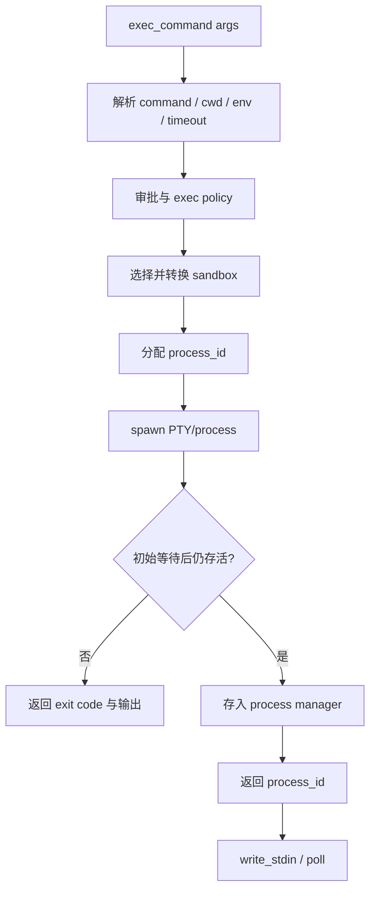

# 10｜命令执行与 unified exec：把进程变成可管理资源

> 源码基线：`upstream/main@283bc4cf011047314b4804c0f1ccd06e4f6a95c5`（2026-06-24）。

Codex 的命令执行必须同时解决短命令、交互进程、PTY、流式输出、超时、中断、审批、沙箱和远程环境。`unified_exec` 的核心价值，是把“正在运行的进程”建模成有 ID、有状态、可继续写入和可回收的资源。

## 1. 两类执行语义

| 模式 | 适合场景 | 返回形态 |
| --- | --- | --- |
| 一次性 exec | 快速命令、无需继续交互 | exit code + bounded output |
| unified exec | 长任务、REPL、服务器、PTY | 初始输出 + `process_id`，后续 `write_stdin` |

两者都要经过 permission、approval 和 sandbox。差异在于 unified exec 会把仍存活的子进程交给 `UnifiedExecProcessManager` 管理。

## 2. 从工具调用到进程



命令不会直接进入 `sh -c`。运行时会先结构化 cwd、环境变量、timeout、shell mode、permission profile 与 sandbox request，再转换成平台可执行请求。

## 3. `UnifiedExecProcessManager`

Manager 负责：

- 分配与释放进程 ID；
- 保存活动进程；
- 根据 ID 写 stdin 或轮询；
- 处理初始 yield 与后续 yield；
- 清理已退出或过期进程；
- 在 turn 中断时保持后台进程所需引用；
- 协调取消与延迟网络拒绝。

进程必须在初始等待前正确持久化，否则用户中断当前 turn 时，最后一个 `Arc` 被释放就可能意外终止后台任务。

## 4. `write_stdin` 同时承担写入和轮询

后续调用可以：

- 写入非空字符；
- 发送控制字符；
- 传空字符串，仅等待新输出；
- 指定有限的 yield 时间。

空写入的 yield 会被限制在运行时范围内，避免模型制造无界阻塞。进程已经结束或 ID 不存在时，返回明确错误，而不是悄悄新建会话。

## 5. 输出的三个视图

同一进程输出要服务不同消费者：

1. UI 的实时 delta；
2. 当前工具调用的返回文本；
3. 后续 `write_stdin` 的增量快照。

输出不会无限保留。当前 unified exec 的字节上限为 1 MiB，并由 `HeadTailBuffer` 保留头部与尾部，中间过长部分被截断。模型通常更需要开头的报错上下文和结尾的最新状态，而不是重复日志的完整中段。

一次性 exec 也有独立 retained-output 上限与最多 10,000 个 UI delta 的保护。

## 6. 超时、过期与后台存活

需要区分三种时间：

| 时间 | 含义 |
| --- | --- |
| command timeout | 命令允许执行多久 |
| yield time | 本次工具调用等待输出多久 |
| manager expiration | 后台进程无人使用多久后回收 |

yield 到期不代表进程失败；只要仍存活，就返回 `process_id`。真正的 command timeout 会触发进程组终止，并形成超时结果。

## 7. 取消必须清理进程树

简单取消 Rust future 不等于杀掉 OS 进程。执行层会：

- 向进程组或 Windows job/process tree 发终止信号；
- 等待短暂 grace period；
- 必要时升级为 kill；
- drain 已产生的 stdout/stderr；
- 记录最终状态。

PTY、远程执行和 Windows runner 的清理方式不同，但上层工具输出应保持一致的“已取消”语义。

## 8. 审批与命令策略

执行前要综合：

- approval policy；
- session approval cache；
- execpolicy 的 allow / prompt / forbidden；
- dangerous-command heuristic；
- sandbox 是否能约束该动作；
- 模型请求的额外权限或升级执行。

复杂 shell 脚本的静态解析不可能完美。解析结果用于提升可解释性和减少不必要提示，真正的资源边界仍由平台沙箱兜底。

## 9. 网络拒绝可能晚于 spawn

受代理治理的进程可能先启动，再在真实连接发生时触发网络审批。如果审批被拒绝，运行时需要异步终止已启动进程，并把拒绝原因映射回工具结果。

这就是“late denial”：网络意图有时只能在执行时观察，不能总在 spawn 前从命令字符串精确推导。

## 10. 本地与远程环境

执行层使用环境与 PathUri 抽象，避免把本地 `PathBuf` 假设带到远程机器：

```text
environment selection
→ resolve PathUri cwd
→ local process or exec-server
→ normalized stdout/stderr/status
```

远程断连、环境不存在、文件系统不可达都必须成为结构化失败，而不是退回本机误执行。

## 11. 源码阅读路线

```bash
rg -n "process_exec_tool_call|build_exec_request|consume_output" codex-rs/core/src/exec.rs
rg -n "struct UnifiedExecProcessManager|allocate_process_id|write_stdin" \
  codex-rs/core/src/unified_exec
rg -n "struct HeadTailBuffer|UNIFIED_EXEC_OUTPUT_MAX_BYTES" \
  codex-rs/core/src/unified_exec
rg -n "background_terminal|max_write_stdin" codex-rs/core/src codex-rs/protocol
rg -n "PathUri|ExecutorEnvironment" codex-rs/exec-server codex-rs/utils/path-uri
```

unified exec 的设计结论是：

> 命令不是一次函数调用，而是一个受策略约束、可观察、可交互、可取消并有明确终态的进程资源。
