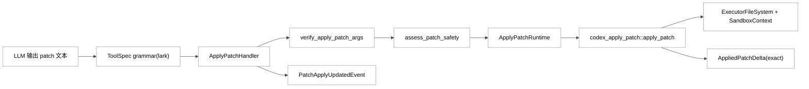
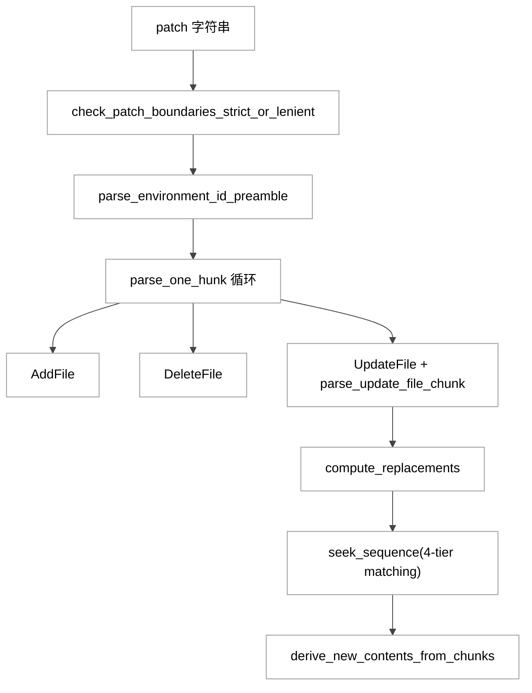
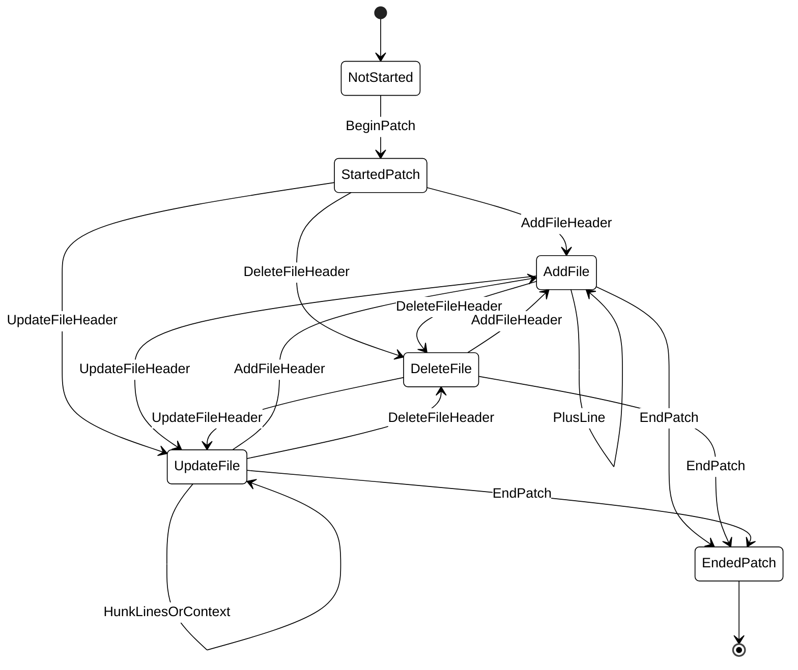
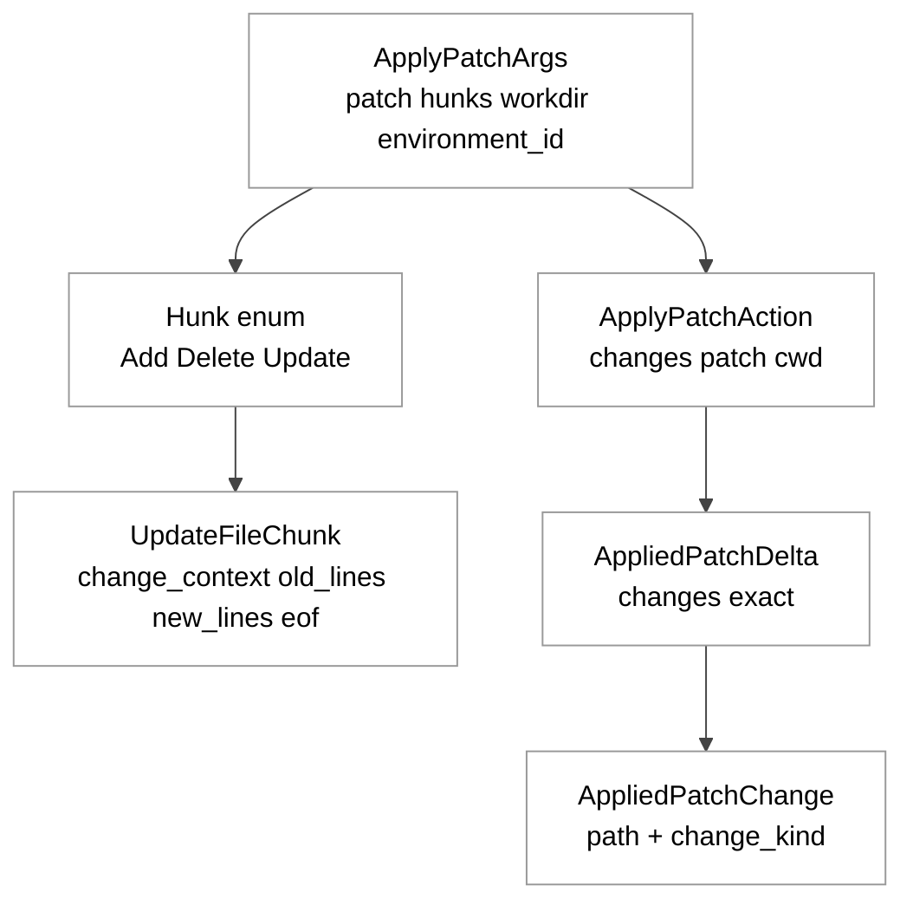
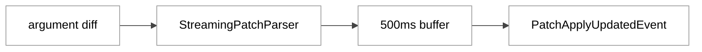

# 第11章 apply_patch 工具

## 引言

`apply_patch` 在 Codex 中不是普通编辑命令，而是受约束的补丁执行通道。本章聚焦：**模型文本如何稳定转换为可控文件系统事务**。

---

## 全网调研补充

### 1. 讨论来源分布（按你指定的站点）

- **OpenAI 工程侧**：`openai/codex` PR/Issue + 官方文档，覆盖语法、解析器与拦截问题。
- **Simon / Latent Space / Hacker News**：讨论集中在 harness 视角与实战稳定性反馈。
- **知乎 / 少数派 / CSDN / 掘金 / 机器之心**：近 12 个月以使用指南为主，源码级解析稀缺。

### 2. 社区共识

1. `apply_patch` 不是任意 diff 文本，而是 Codex 模型被显式训练过的一套结构化编辑协议。  
2. 该协议对多文件、多 hunk 编辑更稳定，且天然适合做审批与审计。  

### 3. 主要分歧与常见误解

- **误解 A**：`apply_patch` 等于 `git apply`。  
- **误解 B**：输出像 patch 就一定命中工具。  
- **误解 C**：流式 parser 输出可直接执行。  
- 实际上三者都不成立：Codex 有独立 grammar、调用拦截条件和最终执行链路。

### 4. 目前讨论盲区（本章重点补齐）

1. `AppliedPatchDelta(exact)` 的失败语义。  
2. streaming parser 与最终执行 parser 的一致性边界。  
3. 文档与实现偏差（绝对路径、空补丁、连续 `@@`）。  
4. 多环境 `Environment ID` 注入机制。

---

## 七维分析

## 1) 本质是什么：`apply_patch` 在 Codex 架构中的定位

`apply_patch` 的本质是一个 **“模型输出约束层 + 变更验证层 + 执行编排层”** 的组合模块。它把“改文件”从开放式自然语言动作，转成可机读协议，并挂接审批、沙箱、事件、diff 跟踪。

首先，工具暴露层明确把 `apply_patch` 定义为 freeform grammar 工具（Lark 语法）：

```rust
// codex-rs/core/src/tools/handlers/apply_patch_spec.rs:9
pub fn create_apply_patch_freeform_tool(include_environment_id: bool) -> ToolSpec {
    let definition = if include_environment_id {
        APPLY_PATCH_LARK_GRAMMAR.replace(
            "start: begin_patch hunk+ end_patch",
            "start: begin_patch environment_id? hunk+ end_patch\nenvironment_id: \"*** Environment ID: \" filename LF",
        )
    } else { APPLY_PATCH_LARK_GRAMMAR.to_string() };
    // ...构造 FreeformTool，语法为 lark definition
}
```

而 grammar 基线定义在 `core` 中（19 行）：

```lark
// codex-rs/core/src/tools/handlers/apply_patch.lark:1
start: begin_patch hunk+ end_patch
begin_patch: "*** Begin Patch" LF
end_patch: "*** End Patch" LF?

hunk: add_hunk | delete_hunk | update_hunk
add_hunk: "*** Add File: " filename LF add_line+
delete_hunk: "*** Delete File: " filename LF
update_hunk: "*** Update File: " filename LF change_move? change?
```

`codex-apply-patch` 同时提供库与可执行入口（`codex-rs/apply-patch/Cargo.toml:7` 与 `codex-rs/apply-patch/Cargo.toml:12`）。

**定量定位（本章核对结果）**：

- `codex-rs/**/Cargo.toml` 总数：`120`（与“~120 个 crate”基线一致）。
- `codex-rs/apply-patch/src/` Rust 文件：`7` 个。
- 关键文件行数：`lib.rs=1692`、`parser.rs=954`、`streaming_parser.rs=851`、`invocation.rs=926`。
- 仅四个核心文件合计：`4423` 行；含 `seek_sequence/main/standalone` 后，crate 主要源码约 `4672` 行。

<div style="background:#ffffff !important; background-color:#ffffff !important; padding:16px; border-radius:8px; margin:16px 0;" bgcolor="#ffffff">



</div>

---

## 2) 核心问题和痛点：它究竟要解决什么

### 痛点一：模型“会写补丁”不等于“补丁可安全执行”

parser 层把错误拆成 patch 级和 hunk 级，并带行号，便于回传模型修复：

```rust
// codex-rs/apply-patch/src/parser.rs:55
pub enum ParseError {
    #[error("invalid patch: {0}")]
    InvalidPatchError(String),
    #[error("invalid hunk at line {line_number}, {message}")]
    InvalidHunkError { message: String, line_number: usize },
}
```

### 痛点二：模型调用形式不稳定（literal / heredoc / 各 shell 差异）

`invocation.rs` 既支持 `["apply_patch", "<patch>"]`，也支持 shell heredoc 提取，再进入统一 parse 流程：

```rust
// codex-rs/apply-patch/src/invocation.rs:105
pub fn maybe_parse_apply_patch(argv: &[String]) -> MaybeApplyPatch {
    match argv {
        [cmd, body] if APPLY_PATCH_COMMANDS.contains(&cmd.as_str()) => match parse_patch(body) {
            Ok(source) => MaybeApplyPatch::Body(source),
            Err(e) => MaybeApplyPatch::PatchParseError(e),
        },
        _ => { /* shell 形态解析与 heredoc 提取 */ }
    }
}
```

### 痛点三：边流式生成边展示进度，但不能牺牲正确性

`core` 里通过 `StreamingPatchParser` 消费参数 diff，仅在 feature 开启时发布 patch 更新事件，并做 500ms 节流：

```rust
// codex-rs/core/src/tools/handlers/apply_patch.rs:56
const APPLY_PATCH_ARGUMENT_DIFF_BUFFER_INTERVAL: Duration = Duration::from_millis(500);

// codex-rs/core/src/tools/handlers/apply_patch.rs:84
if !turn.features.enabled(Feature::ApplyPatchStreamingEvents) {
    return None;
}
```

### 痛点四：文件系统可能“部分成功、部分失败”

`apply_hunks_to_files` 明确建模“部分成功”：写失败会把 `delta.exact` 置 `false`，但已提交前缀变更仍保留（`codex-rs/apply-patch/src/lib.rs:378`）。

---

## 3) 解决思路与方案：架构设计、核心数据结构、关键算法

### 3.1 三层方案：语法约束、语义验证、受控执行

#### A. 语法约束（ToolSpec + parser）

- ToolSpec 用 Lark 约束可解析形状；
- `parser.rs` 负责运行时宽容解析；
- 结果进入 `ApplyPatchArgs`。

```rust
// codex-rs/apply-patch/src/lib.rs:97
pub struct ApplyPatchArgs {
    pub patch: String,
    pub hunks: Vec<Hunk>,
    pub workdir: Option<String>,
    pub environment_id: Option<String>,
}
```

#### B. 语义验证（verify）

`verify_apply_patch_args` 会把 hunk 映射成“将要变更什么文件、预期新内容是什么”，并在 update 时先计算 unified diff：

```rust
// codex-rs/apply-patch/src/invocation.rs:161
pub async fn verify_apply_patch_args(
    args: ApplyPatchArgs,
    cwd: &AbsolutePathBuf,
    fs: &dyn ExecutorFileSystem,
    sandbox: Option<&codex_exec_server::FileSystemSandboxContext>,
) -> MaybeApplyPatchVerified {
    let ApplyPatchArgs { patch, hunks, workdir, .. } = args;
    let effective_cwd = workdir.as_ref().map(|dir| cwd.join(Path::new(dir))).unwrap_or_else(|| cwd.clone());
```

#### C. 受控执行（safety + runtime）

在 `core/src/apply_patch.rs` 先 `assess_patch_safety`，再决定自动放行、请求审批或拒绝：

```rust
// codex-rs/core/src/apply_patch.rs:33
pub(crate) async fn apply_patch(
    turn_context: &TurnContext,
    file_system_sandbox_policy: &FileSystemSandboxPolicy,
    action: ApplyPatchAction,
) -> InternalApplyPatchInvocation {
    match assess_patch_safety(
        &action,
        turn_context.approval_policy.value(),
        &turn_context.permission_profile(),
        file_system_sandbox_policy,
        &action.cwd,
        turn_context.windows_sandbox_level,
    ) {
```

最终由 runtime 执行并回收 `AppliedPatchDelta`（`codex-rs/core/src/tools/runtimes/apply_patch.rs:231`）。

### 3.2 关键算法：context 定位与多级匹配

`compute_replacements()` 先按 `change_context` 定位，再用 `seek_sequence` 对 `old_lines` 查找；`seek_sequence` 采用四级宽松匹配（精确、rstrip、trim、Unicode 归一化）：

```rust
// codex-rs/apply-patch/src/lib.rs:694
fn compute_replacements(
    original_lines: &[String],
    path: &Path,
    chunks: &[UpdateFileChunk],
) -> std::result::Result<Vec<(usize, usize, Vec<String>)>, ApplyPatchError> {
```

```rust
// codex-rs/apply-patch/src/seek_sequence.rs:34
// Exact match first.
for i in search_start..=lines.len().saturating_sub(pattern.len()) {
    if lines[i..i + pattern.len()] == *pattern {
        return Some(i);
    }
}
// Then rstrip match.
// ...
// Finally, trim both sides ...
// ...
// Final, most permissive pass – normalise Unicode punctuation.
```

这等价于“命中率优先 + 不确定性显式上报”。

<div style="background:#ffffff !important; background-color:#ffffff !important; padding:16px; border-radius:8px; margin:16px 0;" bgcolor="#ffffff">



</div>

### 3.3 流式解析：状态机而非全量重扫

`StreamingPatchParser` 维护 `line_buffer + state + line_number`，逐行推进：

```rust
// codex-rs/apply-patch/src/streaming_parser.rs:22
pub struct StreamingPatchParser {
    line_buffer: String,
    state: StreamingParserState,
    line_number: usize,
}
```

```rust
// codex-rs/apply-patch/src/streaming_parser.rs:35
enum StreamingParserMode {
    NotStarted,
    StartedPatch,
    AddFile,
    DeleteFile,
    UpdateFile { hunk_line_number: usize },
    EndedPatch,
}
```

`push_delta()` 按字符流累积，遇到 `\n` 才触发行处理；`finish()` 负责收尾并强制 `*** End Patch`：

```rust
// codex-rs/apply-patch/src/streaming_parser.rs:124
pub fn push_delta(&mut self, delta: &str) -> Result<Vec<Hunk>, ParseError> {
    for ch in delta.chars() {
        if ch == '\n' {
            let mut line = std::mem::take(&mut self.line_buffer);
            line.truncate(line.strip_suffix('\r').map_or(line.len(), str::len));
            self.line_number += 1;
            self.process_line(&line)?;
        } else {
            self.line_buffer.push(ch);
        }
    }
    Ok(self.state.hunks.clone())
}
```

<div style="background:#ffffff !important; background-color:#ffffff !important; padding:16px; border-radius:8px; margin:16px 0;" bgcolor="#ffffff">



</div>

---

## 4) 实现细节关键点：关键路径、关键函数、关键数据流

### 4.1 关键路径总览（从 tool input 到文件写入）

1. `ApplyPatchHandler::handle()` 接收 `ToolPayload::Custom`；
2. `parse_patch()` 做语法解析；
3. `verify_apply_patch_args()` 做语义预演；
4. `assess_patch_safety()` 决策审批；
5. `ApplyPatchRuntime::run()` 调 `codex_apply_patch::apply_patch()`；
6. `apply_hunks_to_files()` 执行具体增删改移；
7. 汇总 `AppliedPatchDelta` 与事件回传。

handler 入口的关键逻辑如下：

```rust
// codex-rs/core/src/tools/handlers/apply_patch.rs:329
let args = match codex_apply_patch::parse_patch(&patch_input) {
    Ok(args) => args,
    Err(parse_error) => {
        return Err(FunctionCallError::RespondToModel(format!(
            "apply_patch verification failed: {parse_error}"
        )));
    }
};
// ...
match codex_apply_patch::verify_apply_patch_args(args, &cwd, fs.as_ref(), Some(&sandbox)).await {
    codex_apply_patch::MaybeApplyPatchVerified::Body(changes) => {
```

### 4.2 关键数据结构（字段级）

`ApplyPatchAction`（3 字段）是“可执行动作”的核心载体：

```rust
// codex-rs/apply-patch/src/lib.rs:138
pub struct ApplyPatchAction {
    changes: HashMap<PathBuf, ApplyPatchFileChange>,
    pub patch: String,
    pub cwd: AbsolutePathBuf,
}
```

`UpdateFileChunk`（4 字段）是 update hunk 的最小语义单元：

```rust
// codex-rs/apply-patch/src/parser.rs:113
pub struct UpdateFileChunk {
    pub change_context: Option<String>,
    pub old_lines: Vec<String>,
    pub new_lines: Vec<String>,
    pub is_end_of_file: bool,
}
```

`AppliedPatchDelta`（2 字段）用于失败后“已提交事实”回传：

```rust
// codex-rs/apply-patch/src/lib.rs:187
pub struct AppliedPatchDelta {
    changes: Vec<AppliedPatchChange>,
    exact: bool,
}
```

<div style="background:#ffffff !important; background-color:#ffffff !important; padding:16px; border-radius:8px; margin:16px 0;" bgcolor="#ffffff">



</div>

### 4.3 “shell 形态”解析的保守策略

`extract_apply_patch_from_bash()` 不是字符串正则拼接，而是 Tree-sitter query，且要求“单顶层语句锚定”，降低误命中：

```rust
// codex-rs/apply-patch/src/invocation.rs:279
static APPLY_PATCH_QUERY: LazyLock<Query> = LazyLock::new(|| {
    let language = BASH.into();
    Query::new(
        &language,
        r#"
        (
          program
            . (redirected_statement
                body: (command
                        name: (command_name (word) @apply_name) .)
                (#any-of? @apply_name "apply_patch" "applypatch")
```

这解释了为什么不少社区反馈会出现“看起来像 apply_patch，实际上没被拦截”：实现故意保守，不追求“猜测式宽匹配”。

### 4.4 隐式调用防呆

如果用户/模型把“裸 patch 文本”当成 command（没有显式 `apply_patch`），会被标记为 `ImplicitInvocation`：

```rust
// codex-rs/apply-patch/src/invocation.rs:140
if let [body] = argv
    && parse_patch(body).is_ok()
{
    return MaybeApplyPatchVerified::CorrectnessError(ApplyPatchError::ImplicitInvocation);
}
```

这是避免“误把任意 shell 字符串当作 patch”的关键防线。

### 4.5 执行期 delta 汇总与沙箱拒绝识别

runtime 在失败场景仍会追加 `committed_delta`，并识别可能的 sandbox denied：

```rust
// codex-rs/core/src/tools/runtimes/apply_patch.rs:248
self.committed_delta.append(delta);
if failed && is_likely_sandbox_denied(attempt.sandbox, &output) {
    return Err(ToolError::Codex(CodexErr::Sandbox(SandboxErr::Denied {
        output: Box::new(output),
        network_policy_decision: None,
    })));
}
```

---

## 5) 易错点和注意事项：陷阱、边界条件、隐式依赖

### 5.1 文档与实现并不总是完全一致

#### 差异 A：文档写“路径必须相对”，实现允许绝对路径

文档：

```md
<!-- codex-rs/apply-patch/apply_patch_tool_instructions.md:69 -->
- File references can only be relative, NEVER ABSOLUTE.
```

实现测试明确接受绝对路径：

```rust
// codex-rs/apply-patch/src/parser.rs:729
fn test_parse_patch_accepts_relative_and_absolute_hunk_paths() {
    // ...
    assert_eq!(
        parse_patch_text(&patch_text, ParseMode::Strict).unwrap().hunks,
        vec![
            AddFile { path: PathBuf::from("relative-add.py"), ... },
            DeleteFile { path: absolute_delete.to_path_buf() },
            UpdateFile { path: absolute_update.to_path_buf(), ... },
        ]
    );
}
```

#### 差异 B：grammar `hunk+`，parser 允许空 hunk 集

tool grammar 要求至少一个 hunk（`hunk+`），但 parser 单元测试允许仅 Begin/End：

```rust
// codex-rs/apply-patch/src/parser.rs:623
assert_eq!(
    parse_patch_text(
        "*** Begin Patch\n\
         *** End Patch",
        ParseMode::Strict
    )
    .unwrap()
    .hunks,
    Vec::new()
);
```

这意味着：工具定义层和运行时解析层在“空补丁合法性”上存在语义缝隙。

### 5.2 连续 `@@` header（无实质行）会报错

在 streaming parser 中，连续 `@@` 会触发“update hunk 无有效行”语义错误：

```rust
// codex-rs/apply-patch/src/streaming_parser.rs:821
parser.push_delta("*** Begin Patch\n*** Update File: file.txt\n@@\n@@\n")
// -> Err(InvalidHunkError { message: "Unexpected line found in update hunk: '@@' ..."})
```

这与很多提示模板里“多级 @@ 连续收窄”写法有潜在冲突，必须在提示工程里避免“header 紧挨 header 无 diff 行”。

### 5.3 `ParseMode::Lenient` 默认打开（全局）

```rust
// codex-rs/apply-patch/src/parser.rs:52
const PARSE_IN_STRICT_MODE: bool = false;
```

这有利于兼容模型输出（尤其 heredoc 形态），但代价是会掩盖部分调用层错误，增加“为什么这次通过、下次失败”的认知复杂度。

### 5.4 进度事件不是最终执行结果

`StreamingPatchParser` 仅用于参数流阶段，最终写盘仍走 `apply_patch` 完整流程。把流式预览当“已提交事实”会导致状态幻觉。

### 5.5 `exact=false` 的含义必须理解到位

`exact=false` 不是“彻底失败”，而是“已知发生了改动，但无法精确断言全部文本边界”。例如写入异常、不可读目标文件、symlink 删除等都可能触发：

```rust
// codex-rs/apply-patch/src/lib.rs:1635
assert!(!failure.delta().is_exact());
```

```rust
// codex-rs/apply-patch/src/lib.rs:1663
assert!(!delta.is_exact());
```

```rust
// codex-rs/apply-patch/src/lib.rs:1690
assert!(!delta.is_exact());
```

---

## 6) 竞品对比：Claude Code / Opencode / Aider / Goose / Continue

> 本节比较编辑原语与执行链路。

| 维度 | Codex `apply_patch` | Claude Code | Opencode | Aider | Goose / Continue |
|---|---|---|---|---|---|
| 编辑原语 | 结构化 patch grammar | 常见 `old_string/new_string` + 写文件 | patch/replace 混合 | git diff 驱动 | IDE 编辑抽象 |
| 执行链路 | parse + verify + safety + runtime | 偏直接编辑执行 | 依实现 | 偏 Git 工作流 | 依宿主扩展 |
| 失败语义 | `AppliedPatchDelta(exact)` | 通常输出错误文本 | 依实现 | git 冲突语义清晰 | 依工具层 |

Codex 优势是可验证、可审批；代价是格式约束更严。

---

## 7) 仍存在的问题和缺陷：局限、改进空间、生态风险

### 7.1 规范一致性仍有技术债

- 文档 “relative only” 与实现支持 absolute path 的偏差，长期会导致开发者错误心智。  
- grammar `hunk+` 与 parser 可接受空 hunk 的偏差，会让上层 harness 在边界行为上难统一。

### 7.2 两套 parser 的一致性维护成本

“流式 parser（进度）+ 最终 parser（执行）”双路径天然有同步成本：流式看起来合法但最终执行失败，是最典型体感问题。

### 7.3 Shell 生态复杂度仍在增长

虽已支持 Unix/PowerShell/Cmd 分类与 `-NoProfile`，但 shell 方言与脚本拼接仍会带来拦截盲点。

### 7.4 `seek_sequence` 的“宽松匹配”有误配风险

四级匹配提高命中率，也提高误配概率（尤其在重复片段密集文件）。当前依赖 context 与顺序约束降低风险，但没有形式化“冲突评分”机制。

### 7.5 事件体验与执行语义仍需持续对齐

`APPLY_PATCH_ARGUMENT_DIFF_BUFFER_INTERVAL = 500ms` 是实时性与开销之间的折中。

<div style="background:#ffffff !important; background-color:#ffffff !important; padding:16px; border-radius:8px; margin:16px 0;" bgcolor="#ffffff">



</div>

---

## 小结

`apply_patch` 的核心价值不在“改文件”，而在把 LLM 编辑行为工程化为 **语法可验、权限可控、失败可追踪** 的完整链路。Codex 在这条链路上体现了三点：约束优先（grammar + parser）、安全前置（verify + safety）、失败可解释（`AppliedPatchDelta(exact)`）。

现实摩擦层仍在：文档/实现偏差、双 parser 一致性、跨 shell 兼容、宽松匹配误配风险。下一阶段关键是“改得可预期”。

