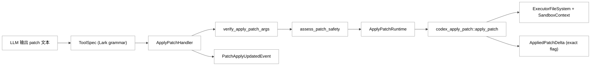
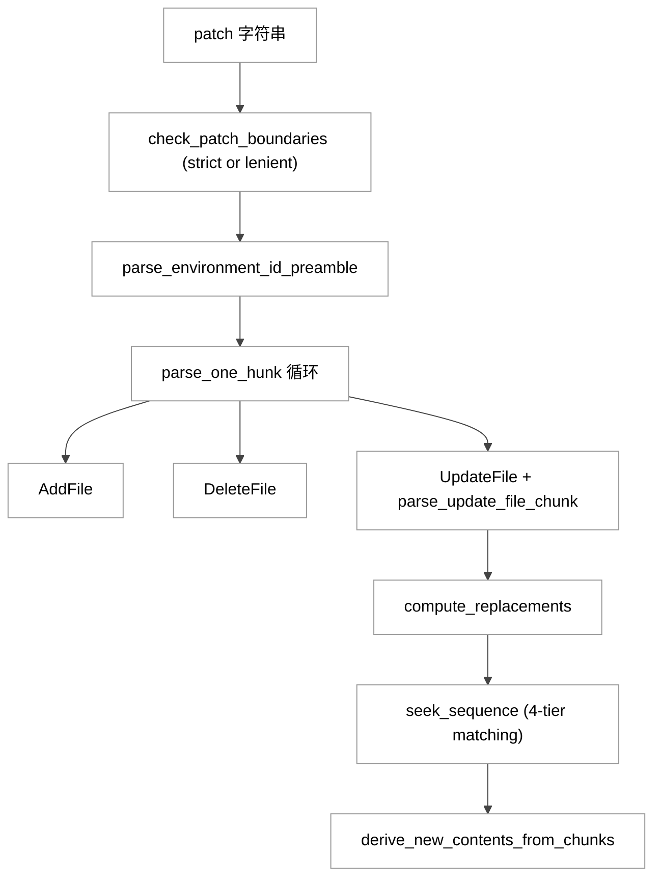
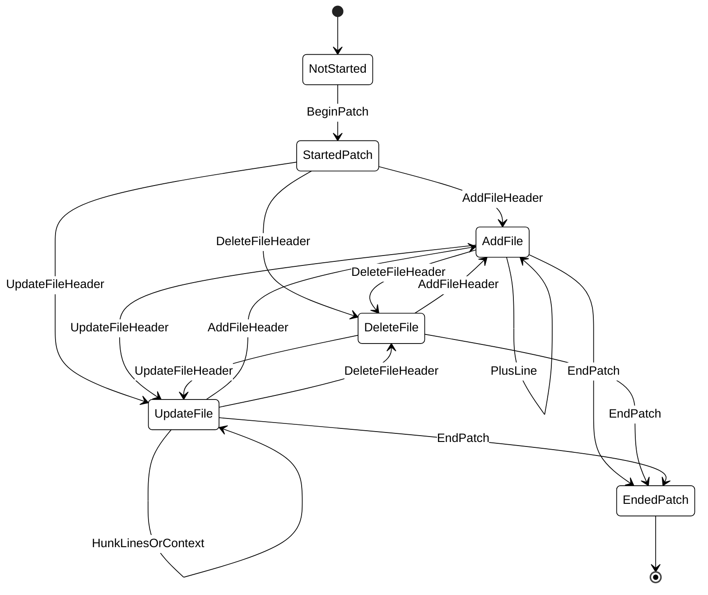
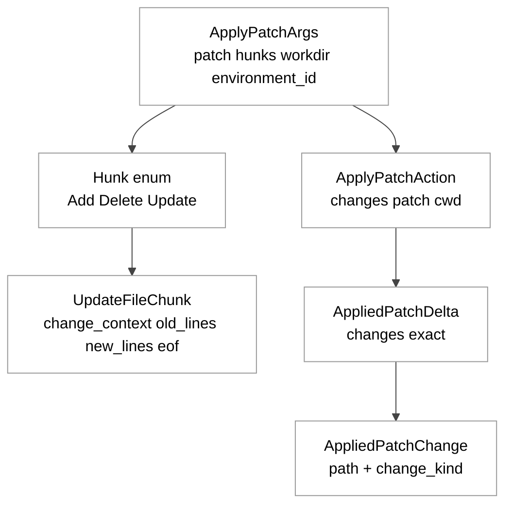
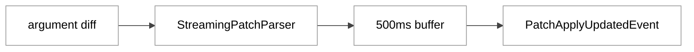

# 第11章 apply_patch 工具

## 引言

`apply_patch` 在 Codex 中并不是一个普通的文件编辑命令，而是一条**受语法约束、可审批、可回滚断言的补丁执行通道**。本章聚焦一个具体的问题：**模型输出的纯文本补丁，是如何被稳定地转换为可控的文件系统事务的**。

为了避免在叙述中混淆“工具协议”“解析器”“执行器”三个层面，下文先以源码定位事实，再做解释，最后给出判断。

---

## 全网调研补充

### 1. 讨论来源分布

- **OpenAI 工程侧**：`openai/codex` 仓库的 PR / Issue / 文档（如 `apply_patch_tool_instructions.md`），主要覆盖语法、解析器与拦截策略。
- **Simon Willison / Latent Space / Hacker News**：讨论倾向于 harness 视角与实际稳定性反馈，对“为什么不直接用 unified diff”有较多猜测。
- **知乎 / 少数派 / CSDN / 掘金 / 机器之心**：近 12 个月以使用指南为主，源码级解析较少。

### 2. 社区相对收敛的几点共识

1. `apply_patch` 不是任意 diff 文本，而是一套结构化编辑协议；Codex 模型在训练阶段对它有显式适配（可由模型行为间接观察，但并未在公开文档完全披露）。
2. 该协议在多文件、多 hunk 编辑下相对稳定，且天然容易接入审批与审计。

### 3. 主要分歧与常见误解

- **误解 A**：`apply_patch` 等于 `git apply`。
- **误解 B**：输出“看起来像 patch”就一定命中工具。
- **误解 C**：流式 parser 的输出可以当作已提交事实。

源码层面上这三点均不成立：Codex 有独立的 Lark grammar、严格的调用拦截条件，以及与流式预览分离的最终执行链路。

### 4. 讨论盲区（本章重点补齐）

1. `AppliedPatchDelta.exact` 的失败语义。
2. 流式 parser 与最终执行 parser 的一致性边界。
3. 工具说明文档与实现之间的若干偏差（绝对路径、空补丁、连续 `@@`）。
4. 多环境 `Environment ID` 注入与 freeform grammar 的关系。

---

## 七维分析

## 1) 本质是什么：`apply_patch` 在 Codex 架构中的定位

先看事实。

工具暴露层把 `apply_patch` 注册为一个 **freeform 工具**，其语法由 Lark 文法定义，且可选注入 `Environment ID`：

```9:27:codex-rs/core/src/tools/handlers/apply_patch_spec.rs
pub fn create_apply_patch_freeform_tool(include_environment_id: bool) -> ToolSpec {
    let definition = if include_environment_id {
        APPLY_PATCH_LARK_GRAMMAR.replace(
            "start: begin_patch hunk+ end_patch",
            "start: begin_patch environment_id? hunk+ end_patch\nenvironment_id: \"*** Environment ID: \" filename LF",
        )
    } else {
        APPLY_PATCH_LARK_GRAMMAR.to_string()
    };
    ToolSpec::Freeform(FreeformTool {
        name: "apply_patch".to_string(),
        // ...
    })
}
```

基础 grammar 本身只有 19 行，定义了 `Begin Patch / End Patch` 包裹的 hunk 序列：

```1:19:codex-rs/core/src/tools/handlers/apply_patch.lark
start: begin_patch hunk+ end_patch
begin_patch: "*** Begin Patch" LF
end_patch: "*** End Patch" LF?

hunk: add_hunk | delete_hunk | update_hunk
add_hunk: "*** Add File: " filename LF add_line+
delete_hunk: "*** Delete File: " filename LF
update_hunk: "*** Update File: " filename LF change_move? change?
```

而 `codex-apply-patch` crate 同时提供库与可执行入口：

```7:14:codex-rs/apply-patch/Cargo.toml
[lib]
name = "codex_apply_patch"
path = "src/lib.rs"
doctest = false

[[bin]]
name = "apply_patch"
path = "src/main.rs"
```

**定量定位（本章重新核对的结果）**：

- `codex-rs/**/Cargo.toml` 总数：`120`，与项目“约 120 个 crate”的基线一致。
- `codex-rs/apply-patch/src/` 共 `7` 个 Rust 文件：`lib.rs / parser.rs / streaming_parser.rs / invocation.rs / seek_sequence.rs / main.rs / standalone_executable.rs`。
- 关键文件行数：`lib.rs=1692`、`parser.rs=954`、`streaming_parser.rs=851`、`invocation.rs=926`，四者合计 `4423` 行；连同 `seek_sequence (163) / main (3) / standalone (83)` 后整个 crate 主源码合计 `4672` 行。

**判断**：以行数 / 文件数为粗略观察，`apply_patch` 在 Codex 中的代码权重明显高于一个“写文件工具”应有的复杂度。它实际上是一个由三层组成的子系统：

- **模型输出约束层**：通过 Lark grammar 把生成形态收敛到可机读协议；
- **变更验证层**：在执行前先把 hunk 映射成文件级语义，并尝试预演 diff；
- **执行编排层**：与审批、沙箱、事件、`AppliedPatchDelta` 跟踪挂接。

这三层共同构成“稳定的文本到事务的通道”。是否每一层都是“最优解”不在本章断言范围内，下文按层展开。

<div style="background:#ffffff !important; background-color:#ffffff !important; padding:16px; border-radius:8px; margin:16px 0;" bgcolor="#ffffff">



</div>

---

## 2) 核心问题和痛点：它究竟要解决什么

### 痛点一：模型“会写补丁”不等于“补丁可安全执行”

`parser.rs` 把错误分成 patch 级（结构整体错误）和 hunk 级（单 hunk 错误并带行号），便于回传给模型让它精确修复：

```54:60:codex-rs/apply-patch/src/parser.rs
#[derive(Debug, PartialEq, Error, Clone)]
pub enum ParseError {
    #[error("invalid patch: {0}")]
    InvalidPatchError(String),
    #[error("invalid hunk at line {line_number}, {message}")]
    InvalidHunkError { message: String, line_number: usize },
}
```

`line_number` 字段对“模型自纠错”有现实意义——错误信息回到模型时，模型可以把上下文精确定位到出错的那一行，而不必重写整段 patch。

### 痛点二：模型调用形式不稳定（literal / heredoc / 各 shell 差异）

`invocation.rs::maybe_parse_apply_patch` 既支持 `["apply_patch", "<patch>"]` 的直接形态，也支持 shell heredoc 形态，最后都汇入同一条 `parse_patch` 流：

```105:130:codex-rs/apply-patch/src/invocation.rs
pub fn maybe_parse_apply_patch(argv: &[String]) -> MaybeApplyPatch {
    match argv {
        // Direct invocation: apply_patch <patch>
        [cmd, body] if APPLY_PATCH_COMMANDS.contains(&cmd.as_str()) => match parse_patch(body) {
            Ok(source) => MaybeApplyPatch::Body(source),
            Err(e) => MaybeApplyPatch::PatchParseError(e),
        },
        // Shell heredoc form: (optional `cd <path> &&`) apply_patch <<'EOF' ...
        _ => match parse_shell_script(argv) {
            Some((shell, script)) => match extract_apply_patch_from_shell(shell, script) {
                Ok((body, workdir)) => match parse_patch(&body) {
                    Ok(mut source) => { source.workdir = workdir; MaybeApplyPatch::Body(source) }
                    Err(e) => MaybeApplyPatch::PatchParseError(e),
                },
                Err(ExtractHeredocError::CommandDidNotStartWithApplyPatch) => MaybeApplyPatch::NotApplyPatch,
                Err(e) => MaybeApplyPatch::ShellParseError(e),
            },
            None => MaybeApplyPatch::NotApplyPatch,
        },
    }
}
```

这意味着调用拦截不是单纯的“前缀匹配”，而是从 argv 形态出发判断属于哪一类调用形态，再走对应解析路径。

### 痛点三：边流式生成边展示进度，但不能牺牲正确性

`core` 侧用 `StreamingPatchParser` 边消费“工具参数 diff”边推进状态，并对事件做 500ms 节流；只有显式开启 feature 才会发布事件：

```56:90:codex-rs/core/src/tools/handlers/apply_patch.rs
const APPLY_PATCH_ARGUMENT_DIFF_BUFFER_INTERVAL: Duration = Duration::from_millis(500);
// ...
impl ToolArgumentDiffConsumer for ApplyPatchArgumentDiffConsumer {
    fn consume_diff(
        &mut self,
        turn: &TurnContext,
        call_id: String,
        diff: &str,
    ) -> Option<EventMsg> {
        if !turn.features.enabled(Feature::ApplyPatchStreamingEvents) {
            return None;
        }
        self.push_delta(call_id, diff)
            .map(EventMsg::PatchApplyUpdated)
    }
```

判断：500ms 是一个折中数（更小=更实时但更耗 UI 渲染；更大=更省但显得卡顿），源码本身没有解释具体取值的依据，因此不必将其理解为“某个理论最优值”。

### 痛点四：文件系统可能“部分成功、部分失败”

`apply_hunks_to_files` 在 try-write 宏中显式把这种语义建模出来：写失败的瞬间，已写入前缀不可逆，因此 `delta.exact` 必须降级为 `false`：

```378:391:codex-rs/apply-patch/src/lib.rs
    // A failed write can still have modified the target before surfacing an
    // error (for example by truncating before ENOSPC), so the accumulated
    // delta is no longer exact when a write fails.
    macro_rules! try_write {
        ($result:expr) => {
            match $result {
                Ok(value) => value,
                Err(error) => {
                    delta.exact = false;
                    return Err(anyhow::Error::from(error));
                }
            }
        };
    }
```

这就是 `AppliedPatchDelta` 与“仅返回 ok/err”不同的根本原因：部分失败必须被诚实表达。

---

## 3) 解决思路与方案：架构设计、核心数据结构、关键算法

### 3.1 三层方案：语法约束、语义验证、受控执行

#### A. 语法约束（ToolSpec + parser）

- ToolSpec 用 Lark 语法约束“能产出什么形状的 patch 文本”；
- `parser.rs` 在运行时做更宽容的解析（默认 lenient 模式，见 5.3 节）；
- 最终结果固化为 `ApplyPatchArgs`。

```96:102:codex-rs/apply-patch/src/lib.rs
pub struct ApplyPatchArgs {
    pub patch: String,
    pub hunks: Vec<Hunk>,
    pub workdir: Option<String>,
    pub environment_id: Option<String>,
}
```

#### B. 语义验证（verify）

`verify_apply_patch_args` 会把 hunk 映射为“将要变更什么文件、预期新内容是什么”，update 类型还会先计算 unified diff，便于上层做审批界面与权限决策：

```161:189:codex-rs/apply-patch/src/invocation.rs
pub async fn verify_apply_patch_args(
    args: ApplyPatchArgs,
    cwd: &AbsolutePathBuf,
    fs: &dyn ExecutorFileSystem,
    sandbox: Option<&codex_exec_server::FileSystemSandboxContext>,
) -> MaybeApplyPatchVerified {
    let ApplyPatchArgs { patch, hunks, workdir, .. } = args;
    let effective_cwd = workdir
        .as_ref()
        .map(|dir| cwd.join(Path::new(dir)))
        .unwrap_or_else(|| cwd.clone());
```

这一层不写文件，只构造 `MaybeApplyPatchVerified` 状态，是后续“审批 / 自动放行 / 拒绝”决策的输入。

#### C. 受控执行（safety + runtime）

`core/src/apply_patch.rs::apply_patch` 在执行前先调 `assess_patch_safety`：

```33:74:codex-rs/core/src/apply_patch.rs
pub(crate) async fn apply_patch(
    turn_context: &TurnContext,
    file_system_sandbox_policy: &FileSystemSandboxPolicy,
    action: ApplyPatchAction,
) -> InternalApplyPatchInvocation {
    match assess_patch_safety(
        &action,
        turn_context.approval_policy.value(),
        &turn_context.permission_profile(),
        file_system_sandbox_policy,
        &action.cwd,
        turn_context.windows_sandbox_level,
    ) {
        SafetyCheck::AutoApprove { user_explicitly_approved, .. } => {
            InternalApplyPatchInvocation::DelegateToRuntime(ApplyPatchRuntimeInvocation {
                action,
                auto_approved: !user_explicitly_approved,
                exec_approval_requirement: ExecApprovalRequirement::Skip { /* ... */ },
            })
        }
        SafetyCheck::AskUser => { /* 需要审批 */ }
        SafetyCheck::Reject { reason } => InternalApplyPatchInvocation::Output(Err(
            FunctionCallError::RespondToModel(format!("patch rejected: {reason}")),
        )),
    }
}
```

最终由 runtime 调用 `codex_apply_patch::apply_patch()` 真正落盘，并把 `AppliedPatchDelta` 累积到 `committed_delta` 上：

```220:267:codex-rs/core/src/tools/runtimes/apply_patch.rs
    async fn run(
        &mut self,
        req: &ApplyPatchRequest,
        attempt: &SandboxAttempt<'_>,
        _ctx: &ToolCtx,
    ) -> Result<ApplyPatchRuntimeOutput, ToolError> {
        // ...
        let result = codex_apply_patch::apply_patch(
            &req.action.patch,
            &req.action.cwd,
            &mut stdout,
            &mut stderr,
            fs.as_ref(),
            sandbox.as_ref(),
        ).await;
        // ...
        let delta = match result {
            Ok(delta) => delta,
            Err(failure) => failure.into_parts().1,
        };
        self.committed_delta.append(delta);
        // ...
        if failed && is_likely_sandbox_denied(attempt.sandbox, &output) {
            return Err(ToolError::Codex(CodexErr::Sandbox(SandboxErr::Denied {
                output: Box::new(output),
                network_policy_decision: None,
            })));
        }
```

判断：这三层并不是“同一件事拆三次”，而是有明确分工——语法层保证“形状”，语义层保证“可解释”，执行层保证“可审计”。

### 3.2 关键算法：context 定位与多级宽松匹配

`compute_replacements()` 是 update hunk 落盘的核心：先按 `change_context` 在原文件中找到锚点，再用 `seek_sequence` 在锚点后定位 `old_lines`。

```694:712:codex-rs/apply-patch/src/lib.rs
fn compute_replacements(
    original_lines: &[String],
    path: &Path,
    chunks: &[UpdateFileChunk],
) -> std::result::Result<Vec<(usize, usize, Vec<String>)>, ApplyPatchError> {
    let mut replacements: Vec<(usize, usize, Vec<String>)> = Vec::new();
    let mut line_index: usize = 0;

    for chunk in chunks {
        if let Some(ctx_line) = &chunk.change_context {
            if let Some(idx) = seek_sequence::seek_sequence(
                original_lines,
                std::slice::from_ref(ctx_line),
                line_index,
                /*eof*/ false,
            ) {
                line_index = idx + 1;
```

`seek_sequence` 采用四级递减严格度匹配：精确 → rstrip → trim → Unicode 归一化。其中最末一级会把多种 dash、引号、空格归一为 ASCII：

```34:65:codex-rs/apply-patch/src/seek_sequence.rs
    // Exact match first.
    for i in search_start..=lines.len().saturating_sub(pattern.len()) {
        if lines[i..i + pattern.len()] == *pattern {
            return Some(i);
        }
    }
    // Then rstrip match.
    // ...
    // Finally, trim both sides to allow more lenience.
    // ...
```

```76:107:codex-rs/apply-patch/src/seek_sequence.rs
    fn normalise(s: &str) -> String {
        s.trim().chars().map(|c| match c {
            '\u{2010}' | '\u{2011}' | '\u{2012}' | '\u{2013}' | '\u{2014}' | '\u{2015}'
            | '\u{2212}' => '-',
            '\u{2018}' | '\u{2019}' | '\u{201A}' | '\u{201B}' => '\'',
            '\u{201C}' | '\u{201D}' | '\u{201E}' | '\u{201F}' => '"',
            '\u{00A0}' | '\u{2002}' | '\u{2003}' | '\u{2004}' | '\u{2005}' | '\u{2006}'
            | '\u{2007}' | '\u{2008}' | '\u{2009}' | '\u{200A}' | '\u{202F}' | '\u{205F}'
            | '\u{3000}' => ' ',
            other => other,
        }).collect::<String>()
    }
```

判断：这是“命中率优先 + 不确定性显式上报”的工程取舍。可能的好处是模型产出的 patch 在面对 Unicode 标点污染的源码时仍能匹配；潜在风险是在重复代码片段密集的文件里会增加误配概率（见 7.4）。

<div style="background:#ffffff !important; background-color:#ffffff !important; padding:16px; border-radius:8px; margin:16px 0;" bgcolor="#ffffff">



</div>

### 3.3 流式解析：状态机而非全量重扫

`StreamingPatchParser` 维护 `line_buffer + state + line_number`，按字符流逐字符推进，遇到 `\n` 才提交一整行进入状态机处理：

```22:45:codex-rs/apply-patch/src/streaming_parser.rs
pub struct StreamingPatchParser {
    line_buffer: String,
    state: StreamingParserState,
    line_number: usize,
}

#[derive(Debug, Default, Clone)]
struct StreamingParserState {
    mode: StreamingParserMode,
    hunks: Vec<Hunk>,
}

#[derive(Debug, Default, Clone, Copy)]
enum StreamingParserMode {
    #[default]
    NotStarted,
    StartedPatch,
    AddFile,
    DeleteFile,
    UpdateFile { hunk_line_number: usize },
    EndedPatch,
}
```

```124:137:codex-rs/apply-patch/src/streaming_parser.rs
pub fn push_delta(&mut self, delta: &str) -> Result<Vec<Hunk>, ParseError> {
    for ch in delta.chars() {
        if ch == '\n' {
            let mut line = std::mem::take(&mut self.line_buffer);
            line.truncate(line.strip_suffix('\r').map_or(line.len(), str::len));
            self.line_number += 1;
            self.process_line(&line)?;
        } else {
            self.line_buffer.push(ch);
        }
    }

    Ok(self.state.hunks.clone())
}
```

`finish()` 还要求最后一行必须收尾为 `*** End Patch`，否则报错。这保证了 UI 上显示的 patch 预览永远是“**结构合法、但未必落盘**”的中间态。

<div style="background:#ffffff !important; background-color:#ffffff !important; padding:16px; border-radius:8px; margin:16px 0;" bgcolor="#ffffff">



</div>

---

## 4) 实现细节关键点：关键路径、关键函数、关键数据流

### 4.1 关键路径总览（tool input → 文件写入）

1. `ApplyPatchHandler::handle()` 接收 `ToolPayload::Custom`；
2. `parse_patch()` 做语法解析；
3. `verify_apply_patch_args()` 做语义预演；
4. `assess_patch_safety()` 决策审批；
5. `ApplyPatchRuntime::run()` 调 `codex_apply_patch::apply_patch()`；
6. `apply_hunks_to_files()` 执行实际增删改移；
7. 汇总 `AppliedPatchDelta` 并通过事件回传。

handler 入口的关键逻辑：

```324:367:codex-rs/core/src/tools/handlers/apply_patch.rs
        let ToolPayload::Custom { input: patch_input } = payload else {
            return Err(FunctionCallError::RespondToModel(
                "apply_patch handler received unsupported payload".to_string(),
            ));
        };
        let args = match codex_apply_patch::parse_patch(&patch_input) {
            Ok(args) => args,
            Err(parse_error) => {
                return Err(FunctionCallError::RespondToModel(format!(
                    "apply_patch verification failed: {parse_error}"
                )));
            }
        };
        let selected_environment_id =
            require_environment_id(args.environment_id.as_deref(), self.multi_environment)?;
        // ...
        match codex_apply_patch::verify_apply_patch_args(args, &cwd, fs.as_ref(), Some(&sandbox))
            .await
        {
            codex_apply_patch::MaybeApplyPatchVerified::Body(changes) => {
                let (file_paths, effective_additional_permissions, file_system_sandbox_policy) =
                    effective_patch_permissions(session.as_ref(), turn.as_ref(), &changes, &cwd)
                        .await;
                match apply_patch::apply_patch(turn.as_ref(), &file_system_sandbox_policy, changes)
                    .await
```

注意 `selected_environment_id` 这一步：在多环境部署中（例如 exec server 跨容器），它决定 patch 真正写到哪个文件系统沙箱，而不是“当前进程的 cwd”。这把“文件系统”从隐式默认变成了显式选择。

### 4.2 关键数据结构（字段级）

`ApplyPatchAction`（3 字段）是“可执行动作”的核心载体：

```137:147:codex-rs/apply-patch/src/lib.rs
pub struct ApplyPatchAction {
    changes: HashMap<PathBuf, ApplyPatchFileChange>,

    /// The raw patch argument that can be used to apply the patch. i.e., if the
    /// original arg was parsed in "lenient" mode with a
    /// heredoc, this should be the value without the heredoc wrapper.
    pub patch: String,

    pub cwd: AbsolutePathBuf,
}
```

`UpdateFileChunk`（4 字段）是 update hunk 的最小语义单元：

```112:120:codex-rs/apply-patch/src/parser.rs
pub struct UpdateFileChunk {
    /// A single line of context used to narrow down the position of the chunk
    pub change_context: Option<String>,

    /// A contiguous block of lines that should be replaced with `new_lines`.
    pub old_lines: Vec<String>,
    pub new_lines: Vec<String>,
    pub is_end_of_file: bool,
}
```

`AppliedPatchDelta`（2 字段）是“执行后事实”的承载者，`exact=false` 意味着“已经改动，但无法精确断言全部边界”：

```186:200:codex-rs/apply-patch/src/lib.rs
pub struct AppliedPatchDelta {
    changes: Vec<AppliedPatchChange>,
    exact: bool,
}

impl AppliedPatchDelta {
    fn new(changes: Vec<AppliedPatchChange>, exact: bool) -> Self {
        Self { changes, exact }
    }
```

<div style="background:#ffffff !important; background-color:#ffffff !important; padding:16px; border-radius:8px; margin:16px 0;" bgcolor="#ffffff">



</div>

### 4.3 “shell 形态”解析的保守策略

`extract_apply_patch_from_bash()` 不用字符串正则，而是用 Tree-sitter query，且要求 `apply_patch ... <<EOF` 作为**单个顶层语句**出现：

```279:321:codex-rs/apply-patch/src/invocation.rs
    static APPLY_PATCH_QUERY: LazyLock<Query> = LazyLock::new(|| {
        let language = BASH.into();
        Query::new(
            &language,
            r#"
            (
              program
                . (redirected_statement
                    body: (command
                            name: (command_name (word) @apply_name) .)
                    (#any-of? @apply_name "apply_patch" "applypatch")
                    redirect: (heredoc_redirect
                                . (heredoc_start)
                                . (heredoc_body) @heredoc
                                . (heredoc_end)
                                .))
                .)

            (
              program
                . (redirected_statement
                    body: (list
                            . (command
                                name: (command_name (word) @cd_name) .
                                argument: [...] .)
                            "&&"
                            . (command
                                name: (command_name (word) @apply_name))
                            .)
                    (#eq? @cd_name "cd")
                    (#any-of? @apply_name "apply_patch" "applypatch")
                    redirect: (heredoc_redirect ...))
                .)
            "#,
        )
    });
```

只支持两种形态：`apply_patch <<EOF ...` 与 `cd <path> && apply_patch <<EOF ...`，且必须是**整个脚本的唯一顶层语句**。

可能的设计意图（源码注释中明确解释）：

> we want to be conservative and only match the intended forms, as other forms are likely to be model errors, or incorrectly interpreted by later code.

这能解释为什么社区反馈中会出现“看起来像 `apply_patch`、实际未被拦截”的情况——例如 `echo hi; apply_patch <<EOF ...` 或 `apply_patch <<EOF ... && echo done`。实现选择宁可不拦截，也不冒“误把任意 shell 当 patch 执行”的风险。

### 4.4 隐式调用防呆

如果模型把“裸 patch 文本”当成 command 直接交上来（没有显式 `apply_patch`），会被标记为 `ImplicitInvocation`：

```140:151:codex-rs/apply-patch/src/invocation.rs
    if let [body] = argv
        && parse_patch(body).is_ok()
    {
        return MaybeApplyPatchVerified::CorrectnessError(ApplyPatchError::ImplicitInvocation);
    }
    if let Some((_, script)) = parse_shell_script(argv)
        && parse_patch(script).is_ok()
    {
        return MaybeApplyPatchVerified::CorrectnessError(ApplyPatchError::ImplicitInvocation);
    }
```

这一步的作用，是让上层能区分“这是一次失败的 apply_patch 调用，应回传明确错误让模型改写”与“这是一次普通 shell 调用”。

### 4.5 执行期 delta 汇总与沙箱拒绝识别

runtime 在失败场景下仍会 `append(delta)`，确保“即使最后失败，也记录已提交的事实”；同时识别可能的沙箱拒绝并转译为 `SandboxErr::Denied`：

```242:262:codex-rs/core/src/tools/runtimes/apply_patch.rs
        let failed = result.is_err();
        let exit_code = if failed { 1 } else { 0 };
        let delta = match result {
            Ok(delta) => delta,
            Err(failure) => failure.into_parts().1,
        };
        self.committed_delta.append(delta);
        let output = ExecToolCallOutput {
            exit_code,
            stdout: StreamOutput::new(stdout.clone()),
            stderr: StreamOutput::new(stderr.clone()),
            aggregated_output: StreamOutput::new(format!("{stdout}{stderr}")),
            duration: started_at.elapsed(),
            timed_out: false,
        };
        if failed && is_likely_sandbox_denied(attempt.sandbox, &output) {
            return Err(ToolError::Codex(CodexErr::Sandbox(SandboxErr::Denied {
                output: Box::new(output),
                network_policy_decision: None,
            })));
        }
```

判断：这两点合在一起意味着 `apply_patch` 的失败路径是**有形状的失败**——既不丢弃已写入的事实，也不把沙箱拒绝当成普通错误吞掉。

---

## 5) 易错点和注意事项：陷阱、边界条件、隐式依赖

### 5.1 工具说明文档与实现并非完全一致

#### 差异 A：文档写“路径必须相对”，实现接受绝对路径

工具说明文档：

```67:69:codex-rs/apply-patch/apply_patch_tool_instructions.md
- You must include a header with your intended action (Add/Delete/Update)
- You must prefix new lines with `+` even when creating a new file
- File references can only be relative, NEVER ABSOLUTE.
```

但 parser 单元测试明确允许相对+绝对混合：

```729:770:codex-rs/apply-patch/src/parser.rs
fn test_parse_patch_accepts_relative_and_absolute_hunk_paths() {
    let dir = tempfile::tempdir().unwrap();
    let absolute_delete = dir.path().join("absolute-delete.py").abs();
    let absolute_update = dir.path().join("absolute-update.py").abs();
    // ...
    assert_eq!(
        parse_patch_text(&patch_text, ParseMode::Strict)
            .unwrap()
            .hunks,
        vec![
            AddFile { path: PathBuf::from("relative-add.py"), /* ... */ },
            DeleteFile { path: absolute_delete.to_path_buf() },
            UpdateFile { path: absolute_update.to_path_buf(), /* ... */ },
        ]
    );
}
```

含义：模型读到的“规则”可能比实现更严，于是会出现“模型按文档报错、实际可放行”的不一致。提示工程角度建议仍然遵循文档的“relative only”，避免依赖隐式宽容。

#### 差异 B：grammar `hunk+`，parser 允许空 hunk 集

工具 grammar 要求至少一个 hunk（`hunk+`），但 parser 单元测试允许仅 `Begin/End`：

```623:632:codex-rs/apply-patch/src/parser.rs
    assert_eq!(
        parse_patch_text(
            "*** Begin Patch\n\
             *** End Patch",
            ParseMode::Strict
        )
        .unwrap()
        .hunks,
        Vec::new()
    );
```

但执行层在 `apply_hunks_to_files` 里又把空 hunks 视为错误：

```370:373:codex-rs/apply-patch/src/lib.rs
) -> anyhow::Result<AffectedPaths> {
    if hunks.is_empty() {
        anyhow::bail!("No files were modified.");
    }
```

所以语义缝隙发生在“语法层 vs 解析层 vs 执行层”三者之间：grammar 严，parser 宽，executor 又重新严。harness 集成者需要意识到“parse 成功”并不一定等价于“可以执行”。

### 5.2 连续 `@@` header（无实质行）会报错

streaming parser 中，update hunk 内连续两个 `@@`（中间没有 diff 行）会立即报 `InvalidHunkError`：

```819:827:codex-rs/apply-patch/src/streaming_parser.rs
        let mut parser = StreamingPatchParser::default();
        assert_eq!(
            parser.push_delta("*** Begin Patch\n*** Update File: file.txt\n@@\n@@\n"),
            Err(InvalidHunkError {
                message: "Unexpected line found in update hunk: '@@'. Every line should start with ' ' (context line), '+' (added line), or '-' (removed line)"
                    .to_string(),
                line_number: 4,
            })
        );
```

如果提示模板里诱导“多级 `@@` 连续收窄定位”的写法，需要在中间塞入至少一行实际 diff 行；否则会被流式 parser 直接拒绝。

### 5.3 `ParseMode::Lenient` 默认打开（全局）

```46:52:codex-rs/apply-patch/src/parser.rs
/// Currently, the only OpenAI model that knowingly requires lenient parsing is
/// gpt-4.1. While we could try to require everyone to pass in a strictness
/// param when invoking apply_patch, it is a pain to thread it through all of
/// the call sites, so we resign ourselves allowing lenient parsing for all
/// models. See [`ParseMode::Lenient`] for details on the exceptions we make for
/// gpt-4.1.
const PARSE_IN_STRICT_MODE: bool = false;
```

注释里直接给出了动机（且承认这是“偷懒”而非“最优”），可视为一个工程权衡：兼容 gpt-4.1 的代价是对所有模型放宽语法。代价是：相同 patch 在不同模型 / 不同上下文里可能呈现“为什么这次通过、下次失败”的不直觉行为。

### 5.4 进度事件不是最终执行结果

`StreamingPatchParser` 只用于**参数流阶段**（tool 输入还在生成时的实时预览），最终落盘走的是 `apply_patch` 完整流程（重新解析 + verify + safety + runtime）。把流式预览当“已提交事实”会导致状态幻觉：UI 看见的 hunk 列表，未必都通过了 verify。

### 5.5 `exact=false` 的含义必须理解到位

`exact=false` 不是“彻底失败”，而是“已经发生了改动，但无法精确断言全部文本边界”。源码中至少三个测试明确触发了 inexact：

- 目录被锁住导致写失败（`test_atomic_write_failure_marks_delta_inexact`）：

```1620:1636:codex-rs/apply-patch/src/lib.rs
        let result = apply_patch(
            &patch,
            &AbsolutePathBuf::from_absolute_path(dir.path()).unwrap(),
            &mut stdout,
            &mut stderr,
            LOCAL_FS.as_ref(),
            /*sandbox*/ None,
        )
        .await;
        let failure = result.expect_err("write should fail");

        fs::set_permissions(&locked_dir, fs::Permissions::from_mode(0o755)).unwrap();

        assert!(!failure.delta().is_exact());
    }
```

- 目标文件不可读（二进制）：`test_unreadable_destinations_return_inexact_delta`（lib.rs:1639-1665）；
- 删除 symlink：`test_delete_symlink_returns_inexact_delta`（lib.rs:1669-1691）。

上层 UI / 审计需要把 `exact=false` 当作“需要人工 verify”的状态，而不是简单的 ✓ / ✗。

---

## 6) 竞品对比：Claude Code / Opencode / Aider / Goose / Continue

> 本节比较“编辑原语 + 执行链路 + 失败语义”三个维度，不评优劣。

| 维度 | Codex `apply_patch` | Claude Code | Opencode | Aider | Goose / Continue |
|---|---|---|---|---|---|
| 编辑原语 | 结构化 patch（Lark grammar 约束） | 常见 `old_string/new_string` + 写文件 | patch / replace 混合 | git diff 驱动 | IDE 编辑抽象 |
| 调用拦截 | argv + heredoc + Tree-sitter | function-call 形态 | 按实现 | shell 子进程 | IDE 扩展协议 |
| 执行链路 | parse → verify → safety → runtime | 偏直接编辑执行 | 按实现 | 偏 Git 工作流 | 按宿主扩展 |
| 失败语义 | `AppliedPatchDelta(exact)` | 通常输出错误文本 | 按实现 | git 冲突语义清晰 | 按工具层 |
| 多环境 | 支持 `Environment ID` 注入 | 单环境为主 | 按实现 | 单 worktree | 单 IDE 工作区 |

判断：把这些工具放在同一个坐标系下看，Codex 的 `apply_patch` 走的是“**先把模型输出约束到可机读形状，再做语义验证和执行**”这条路；而 Claude Code 等更偏“**直接给 LLM 提供 string-level diff API**”这条路。两条路线的差别：

- **Codex 路线**：语法约束更强，模型必须学会一套协议，但好处是失败模式有限、可审批、可审计；
- **string-level diff 路线**：心智更轻，模型 prompt 也更简单，但更容易出现“看起来对其实没改对”的隐性错误，且失败语义难以表达“部分成功”。

至于哪条路线更优，目前没有公开评测能给出收敛结论。本节只能说，两者各自服务于不同的产品定位（CLI agent 长任务 vs IDE 助手交互）。

---

## 7) 仍存在的问题和缺陷：局限、改进空间、生态风险

### 7.1 规范一致性的技术债

- 工具说明文档写“relative only”但实现允许 absolute path；
- grammar 写 `hunk+` 但 parser 允许空 hunks，executor 又把空 hunks 当错误；
- 不同层对“合法 patch”的定义不完全收敛。

短期不影响功能，长期会让 harness 集成者难以建立稳定的心智模型，特别是在做“dry-run / 预审”这类需要精确边界的产品功能时。

### 7.2 两套 parser 的一致性维护成本

“流式 parser（用于预览）+ 最终 parser（用于执行）”是双路径设计，天然存在同步成本。当 grammar 演进时，必须同步维护两套实现，否则会出现“流式 OK、最终失败”的体感问题。从单元测试覆盖看，两侧都有较全的 case，但**没有自动化机制保证两者“恒等”**——目前依赖人工 review 与回归测试。

### 7.3 Shell 生态复杂度仍在增长

`invocation.rs` 虽已支持 Unix / PowerShell / Cmd 分类，并显式刻画 `cd <path> && apply_patch <<EOF` 与 `apply_patch <<EOF` 两种形态，但 shell 方言与脚本拼接仍存在拦截盲点：

- 多语句脚本（`echo ...; apply_patch ...`）会被拒绝匹配；
- 反引号、`$()`、变量展开包裹 `apply_patch` 时不被识别；
- 注释、空行干扰可能影响 Tree-sitter 解析结果。

这是源码注释里明确承认的“保守换可靠”取舍。对终端用户而言，意味着如果模型生成的脚本稍微复杂一点，可能根本走不到 `apply_patch` 路径，而是被当成普通 shell 命令执行（甚至失败）。

### 7.4 `seek_sequence` 的“宽松匹配”有误配风险

四级宽松匹配提高了在 Unicode 标点 / 末尾空格 / 缩进差异下的命中率，但同时也会提高在**重复片段密集文件**里的误配概率。典型场景：

- 多个 `def __init__(self):` 的类文件；
- 大量重复样板代码的生成文件；
- copy-paste 的测试 case。

当前 `compute_replacements` 通过“`change_context` 锚点 + 严格递增的 `line_index`”降低了误配概率，但**没有形式化的冲突评分或多匹配告警**——若锚点本身在文件中出现两次，且 `old_lines` 在两次锚点之后都能匹配，行为依赖于 `seek_sequence` 的“首匹配优先”，并不会向调用方报告“存在歧义”。

一种潜在改进方向是：在 `seek_sequence` 找到匹配后，继续扫描剩余文件，如果存在第二个等效匹配，则降级 `exact` 或要求模型补充更长 context。当然这是猜测性方案，源码层面目前没有这种机制。

### 7.5 事件体验与执行语义的对齐仍是开放问题

`APPLY_PATCH_ARGUMENT_DIFF_BUFFER_INTERVAL = 500ms` 是实时性与开销之间的折中：

<div style="background:#ffffff !important; background-color:#ffffff !important; padding:16px; border-radius:8px; margin:16px 0;" bgcolor="#ffffff">



</div>

体验侧的真正难点不是“多快推一次事件”，而是“**流式预览的 hunk** 与 **最终落盘的 hunk** 之间，UI 怎么诚实表达差别”。这要求 UI 把 `PatchApplyUpdated`（预览中）与 `PatchApplied`（已提交、并带 `exact` 标）区别开，而不只是合并为一条编辑流。源码侧已经做了区分，体验侧的落地则因前端实现而异。

### 7.6 多环境与 `Environment ID` 的协议演化

`create_apply_patch_freeform_tool(include_environment_id)` 通过字符串替换把 `environment_id` 注入 grammar，本质上是“老协议 + 旁路扩展”的兼容策略。未来如果再增加协议字段（例如显式的目标 OS、字符编码标记），同样的策略会让 grammar 变得碎片化。目前来看可行，但不是可持续的演化路径。

---

## 小结

把上面所有事实串起来看：`apply_patch` 的价值并不仅在“能改文件”，更在它把 LLM 的文件编辑行为，工程化为一条**语法可验、权限可控、失败可追踪**的链路。Codex 在这条链路上做了三件相对一致的事：

1. **约束优先**：用 Lark grammar + parser 双层把生成形态收敛到可机读协议，宁可拒绝模糊调用，不冒误执行的风险。
2. **安全前置**：用 `verify_apply_patch_args` + `assess_patch_safety` 把“能不能执行”和“怎么执行”分开。
3. **失败可解释**：用 `AppliedPatchDelta.exact` 显式表达“部分成功”，让上层有机会做差异化处理。

现实摩擦层也依然存在：文档与实现的偏差、两套 parser 的一致性维护、跨 shell 兼容的盲点、宽松匹配的误配风险。对生态而言，下一阶段的难点不是“写得更巧”，而是“**改得可预期**”——让 grammar、parser、executor 三层对“什么是合法 patch”的定义彻底收敛。
