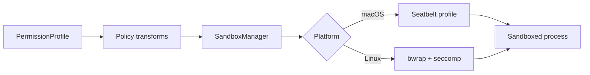

# 12｜macOS 与 Linux 沙箱：同一策略，不同 OS 原语

> 源码基线：`upstream/main@283bc4cf011047314b4804c0f1ccd06e4f6a95c5`（2026-06-24）。

Codex 先用统一的文件系统与网络权限表达“允许什么”，再把策略转换成平台实现：

- macOS：Seatbelt / `sandbox-exec`；
- Linux：bubblewrap + seccomp，必要时配合代理桥；
- Landlock：保留的显式 legacy 路径，不是 bwrap 失败后的静默兜底。

## 1. 沙箱不是审批

审批决定“本次动作是否获准”，沙箱决定“获准后进程最多能触达什么”。一次命令可能无需询问，但仍在只读文件系统和禁网沙箱中运行。



## 2. 统一策略层

核心输入包括：

- readable / writable roots；
- unreadable paths 与 globs；
- protected metadata，例如可写项目中的 `.git`、`.agents`、`.codex`；
- network enabled / restricted；
- approved additional permissions；
- external sandbox 或 unrestricted 模式；
- managed network requirements。

`should_require_platform_sandbox` 判断当前权限是否必须落到 OS 级隔离；`SandboxManager::select_initial` 再结合 `Auto / Require / Forbid` 和平台能力选后端。

## 3. macOS Seatbelt

Seatbelt 侧以基础 SBPL 模板为起点，运行时加入：

- 可读与可写路径；
- 可写根中的只读子路径；
- unreadable carve-outs；
- 网络与代理端口；
- Unix socket 例外；
- 临时目录及系统运行所需规则。

最终通过 `sandbox-exec` 和 `-D` 参数传入动态路径。策略模板是静态的，具体权限不是。

## 4. Linux bwrap 的文件系统视图

bwrap 通过 mount namespace 构造受限视图。目标语义与 Seatbelt 对齐：

1. 建立只读基线；
2. 叠加明确 writable roots；
3. 在可写根内重新覆盖受保护子路径为只读；
4. 屏蔽 unreadable paths；
5. 配置 `/proc`、设备、临时目录与 helper；
6. 进入 seccomp / network 模式后启动命令。

挂载顺序很重要：后加入的更具体规则必须覆盖更宽泛规则，否则 writable root 可能意外开放 `.git` 等元数据。

## 5. unreadable glob

bwrap 只能屏蔽具体路径，不能直接理解 glob。因此实现会：

- 用 ripgrep 等机制在有限深度内展开匹配；
- 同时记录逻辑路径与可能的 symlink target；
- 去重并限制匹配总量；
- 将结果转成空文件、空目录或 tmpfs mask。

超过硬上限、模式无效或扫描失败时应报错，而不是因为无法展开就放弃保护。

## 6. Symlink 与 TOCTTOU

如果 deny-read 路径穿过可写 symlink，只在构建沙箱时解析一次目标是不安全的：进程可在运行后改写 symlink，使静态 mask 指向旧目标。

因此这类场景选择 fail closed。沙箱实现必须保护“路径语义”，不能只保护创建瞬间解析出的 inode 快照。

## 7. 不存在的受保护路径

`.git` 等受保护路径在进程启动前可能不存在，但进程可以在可写根中创建它们。Linux 实现会注册 protected-create targets，并在执行后检查和清理违规创建，避免“启动时不存在”成为绕过条件。

## 8. Linux bwrap 选择与兼容

Linux helper 会处理：

- PATH 中可用且可信的系统 bwrap；
- 不支持 `--argv0` 的旧版本兼容；
- 随 Codex 分发的 bundled bwrap；
- user namespace 不可用；
- WSL1 明确不支持；
- nested container / mount capability 失败。

bundled bwrap 还会校验资源摘要。环境不满足隔离前提时应给出明确错误，不能假装已沙箱化。

## 9. Landlock 的位置

Landlock 仍存在于源码中，但当前主线不是：

```text
bwrap 失败 → 自动改用 Landlock
```

而是由显式 legacy 选择进入。静默降级会改变安全语义，所以不应在后端失败时自动发生。

## 10. 网络隔离

网络策略不是一个简单布尔值。运行时可能需要：

- 完全禁网；
- 仅通过受管代理；
- 放行特定 loopback 代理端口；
- 保留必要 Unix socket；
- DNS 与本地绑定限制。

macOS 将规则写入 Seatbelt profile；Linux 可使用独立 network namespace 与 proxy routing，把受限进程的 TCP 流量桥接到宿主代理。即便设置了 `HTTP_PROXY`，也仍需 OS 级约束防止进程绕过代理直连。

## 11. 失败判定

平台失败可能表现为：

- `sandbox-exec` 不可用或 profile 编译失败；
- bwrap 无法创建 user namespace；
- mount `/proc` 或 bind mount 被容器策略拒绝；
- unreadable mask 无法安全构造；
- 进程输出包含 OS denial。

上层会尽量把“普通命令失败”和“沙箱拒绝”区分开，但基于 stderr 的 denial 判断仍是启发式。

## 12. 源码阅读路线

```bash
rg -n "enum SandboxType|select_initial" codex-rs/sandboxing/src/manager.rs
rg -n "should_require_platform_sandbox" codex-rs/sandboxing/src/policy_transforms.rs
rg -n "sandbox-exec|seatbelt" codex-rs/sandboxing/src/seatbelt.rs
rg -n "create_bwrap_command_args|unreadable_glob|protected_create" \
  codex-rs/linux-sandbox/src
rg -n "use_legacy_landlock|Landlock" codex-rs
rg -n "proxy_routing|network_mode" codex-rs/linux-sandbox/src
```

这套设计的关键是：

> 共享层定义资源权限，平台层负责用真实 OS 原语强制执行；任何兼容或降级路径都必须显式维护相同的安全承诺。
