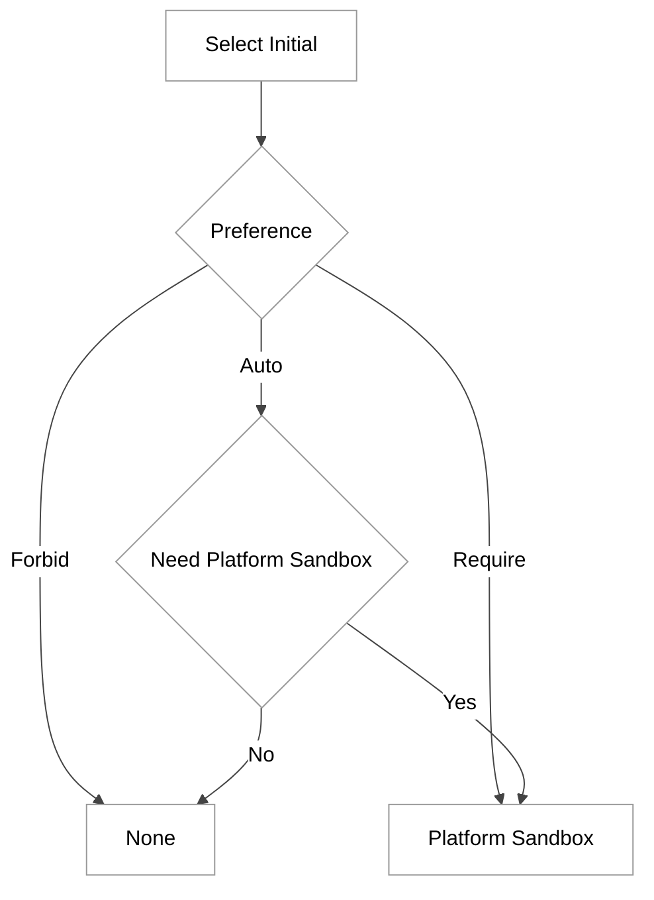
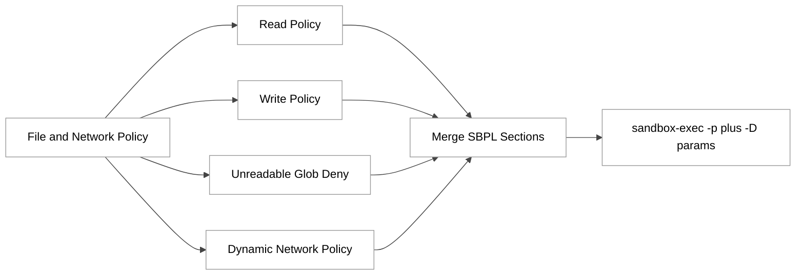
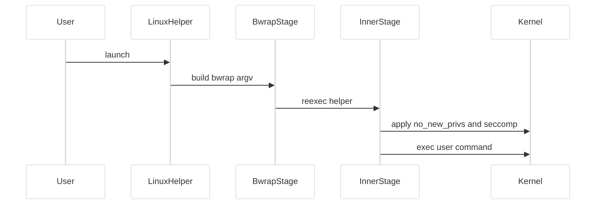
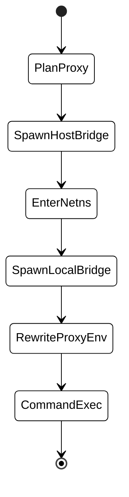

# 第 12 章：macOS Seatbelt 与 Linux Bwrap 沙箱

## 引言

Codex 的沙箱实现不是“附属安全插件”，而是 Agent 能否在本地长期自动运行的基础设施。本章聚焦两个后端：macOS 的 Seatbelt（`sandbox-exec`）与 Linux 的 bwrap 两阶段沙箱。  
按本章复核口径，核心代码体量如下：

- `manager.rs` 345 行
- `seatbelt.rs` 745 行
- `policy_transforms.rs` 533 行
- `bwrap.rs` 2707 行
- `linux_run_main.rs` 1470 行
- `proxy_routing.rs` 802 行
- `docs/sandbox.md` 3 行

合计 **6605 行**，其中 `bwrap.rs` 一文件占比约 **41%**。这已经说明 Linux 侧不是“参数拼接”，而是重工程实现。

---

## 全网调研补充（近 12 个月）

### 1) 检索来源

按你给定关键词完成检索，并补齐指定社区来源。主要样本来自：

- 官方：OpenAI Developers（Sandbox / Security）、`openai/codex` 仓库与 issue
- 英文社区：Simon Willison、Latent Space、Hacker News
- 中文社区：知乎、少数派、CSDN、掘金
- 指定补充：机器之心（检索到的近 12 个月结果几乎无 Codex 沙箱技术深文）

### 2) 社区共识

1. **沙箱与审批是两层机制**：沙箱是技术边界，审批是交互边界。  
2. **Linux 兼容性问题真实存在**：尤其 Ubuntu 24.04+、容器、Flatpak、受限 userns 环境。  
3. **macOS 仍普遍使用 Seatbelt 路径**：虽然 `sandbox-exec` 常被讨论为 deprecated，但工程上依然可运行。

### 3) 争议与常见误解

1. **误解：`workspace-write` 等于“完全安全”**  
   实际是“受限写 + 受控网络”，不是绝对最小可见面。  
2. **误解：Landlock 会自动兜底 bwrap 失败**  
   现实现主要是显式 legacy 分支，不是任意失败自动回退。  
3. **误解：Seatbelt 是静态模板**  
   Codex 在运行时动态拼接读写根、不可读 glob、proxy 端口、unix socket 规则。

### 4) 社区盲区（本章重点）

- unreadable glob 如何从策略语义落地到 bwrap 可执行掩码
- 可写 symlink 场景为何要 fail-closed（TOCTTOU）
- proxy-only 模式下 host/netns 双桥细节
- 仓库内文档极简，真正语义在源码

---

## 七维分析

## 1. 本质是什么：策略优先，平台原语执行

`SandboxManager` 先做后端选择，再做命令变换；真正执行由 OS 原语完成。

```rust
// codex-rs/sandboxing/src/manager.rs:23
pub enum SandboxType {
    None,
    MacosSeatbelt,
    LinuxSeccomp,
    WindowsRestrictedToken,
}
```

平台识别是显式分支：

```rust
// codex-rs/sandboxing/src/manager.rs:48
pub fn get_platform_sandbox(windows_sandbox_enabled: bool) -> Option<SandboxType> {
    if cfg!(target_os = "macos") {
        Some(SandboxType::MacosSeatbelt)
    } else if cfg!(target_os = "linux") {
        Some(SandboxType::LinuxSeccomp)
    } else if cfg!(target_os = "windows") {
        ...
    } else {
        None
    }
}
```

<div style="background:#ffffff !important; background-color:#ffffff !important; padding:16px; border-radius:8px; margin:16px 0;" bgcolor="#ffffff">


</div>

## 2. 核心问题和痛点

### 痛点 A：跨 OS 语义对齐

Linux 文件头直说“镜像 macOS Seatbelt 语义”：

```rust
// codex-rs/linux-sandbox/src/bwrap.rs:3
//! This module mirrors the semantics used by the macOS Seatbelt sandbox:
//! - the filesystem is read-only by default,
//! - explicit writable roots are layered on top, and
//! - sensitive subpaths such as `.git`, `.agents`, and `.codex` remain
//!   read-only even when their parent root is writable.
```

### 痛点 B：兼容性与强约束冲突

Linux README 对 bwrap 兼容路径写得非常工程化：

```markdown
<!-- codex-rs/linux-sandbox/README.md:10 -->
On Linux, Codex prefers the first `bwrap` found on `PATH`
...
WSL1 is not supported for bubblewrap sandboxing ...
```

### 痛点 C：网络不是开关，而是策略矩阵

Seatbelt 动态网络策略有多个触发条件：

```rust
// codex-rs/sandboxing/src/seatbelt.rs:266
let should_use_restricted_network_policy = !proxy.ports.is_empty()
    || proxy.has_proxy_config
    || enforce_managed_network
    || (!network_policy.is_enabled() && has_some_unix_socket_access);
```

---

## 3. 解决思路与方案（架构、数据结构、关键算法）

### 3.1 入口决策：先判断“是否必须平台沙箱”

`should_require_platform_sandbox()` 是关键门槛函数：

```rust
// codex-rs/sandboxing/src/policy_transforms.rs:509
pub fn should_require_platform_sandbox(
    file_system_policy: &FileSystemSandboxPolicy,
    network_policy: NetworkSandboxPolicy,
    has_managed_network_requirements: bool,
) -> bool {
    if has_managed_network_requirements {
        return true;
    }
    ...
}
```

`select_initial()` 再结合 `Auto/Require/Forbid` 输出后端类型：

```rust
// codex-rs/sandboxing/src/manager.rs:139
pub fn select_initial(
    &self,
    file_system_policy: &FileSystemSandboxPolicy,
    network_policy: NetworkSandboxPolicy,
    pref: SandboxablePreference,
    windows_sandbox_level: WindowsSandboxLevel,
    has_managed_network_requirements: bool,
) -> SandboxType { ... }
```

<div style="background:#ffffff !important; background-color:#ffffff !important; padding:16px; border-radius:8px; margin:16px 0;" bgcolor="#ffffff">



</div>

### 3.2 Seatbelt 路径：组合式 SBPL

核心常量显示 Seatbelt 是“基础策略 + 网络策略 + 平台默认策略”拼装：

```rust
// codex-rs/sandboxing/src/seatbelt.rs:20
const MACOS_SEATBELT_BASE_POLICY: &str = include_str!("seatbelt_base_policy.sbpl");
const MACOS_SEATBELT_NETWORK_POLICY: &str = include_str!("seatbelt_network_policy.sbpl");
const MACOS_RESTRICTED_READ_ONLY_PLATFORM_DEFAULTS: &str =
    include_str!("restricted_read_only_platform_defaults.sbpl");
```

执行入口固定系统路径：

```rust
// codex-rs/sandboxing/src/seatbelt.rs:29
pub const MACOS_PATH_TO_SEATBELT_EXECUTABLE: &str = "/usr/bin/sandbox-exec";
```

Seatbelt 基础策略明确是 deny-default：

```scheme
; codex-rs/sandboxing/src/seatbelt_base_policy.sbpl:7
; start with closed-by-default
(deny default)
```

<div style="background:#ffffff !important; background-color:#ffffff !important; padding:16px; border-radius:8px; margin:16px 0;" bgcolor="#ffffff">



</div>

### 3.3 Linux 路径：两阶段执行

`run_main()` 注释定义了标准流程：bwrap 外层，seccomp 内层。

```rust
// codex-rs/linux-sandbox/src/linux_run_main.rs:142
/// 1. ... bubblewrap ...
/// 2. Apply in-process restrictions (no_new_privs + seccomp).
/// 3. `execvp` into the final command.
pub fn run_main() -> ! { ... }
```

`--apply-seccomp-then-exec` 与 `--use-legacy-landlock` 明确互斥：

```rust
// codex-rs/linux-sandbox/src/linux_run_main.rs:295
fn ensure_inner_stage_mode_is_valid(apply_seccomp_then_exec: bool, use_legacy_landlock: bool) {
    if apply_seccomp_then_exec && use_legacy_landlock {
        panic!("--apply-seccomp-then-exec is incompatible with --use-legacy-landlock");
    }
}
```

<div style="background:#ffffff !important; background-color:#ffffff !important; padding:16px; border-radius:8px; margin:16px 0;" bgcolor="#ffffff">



</div>

---

## 4. 实现细节关键点（关键路径 / 函数 / 数据流）

### 4.1 命令变换中枢：`SandboxManager::transform()`

它先算 `effective_permission_profile`，再按后端包装 argv：

```rust
// codex-rs/sandboxing/src/manager.rs:185
let effective_permission_profile =
    effective_permission_profile(permissions, additional_permissions.as_ref());
...
let (argv, arg0_override) = match sandbox {
    SandboxType::None => ...
    SandboxType::MacosSeatbelt => ...
    SandboxType::LinuxSeccomp => ...
    ...
};
```

### 4.2 Seatbelt 的细粒度拼接

读写路径不是裸 allow，而是支持排除子路径和 metadata 名称：

```rust
// codex-rs/sandboxing/src/seatbelt.rs:356
let mut require_parts = vec![format!("(subpath (param \"{root_param}\"))")];
...
require_parts.push(format!(
    "(require-not (subpath (param \"{excluded_param}\")))"
));
```

对 unreadable glob，Seatbelt 直接生成 deny regex：

```rust
// codex-rs/sandboxing/src/seatbelt.rs:450
policy_components.push(format!(r#"(deny file-read* (regex #"{regex}"))"#));
policy_components.push(format!(r#"(deny file-write-unlink (regex #"{regex}"))"#));
```

### 4.3 bwrap 挂载顺序是“算法”

`create_filesystem_args()` 的 6 步顺序决定了可写重开与只读回灌谁优先：

```rust
// codex-rs/linux-sandbox/src/bwrap.rs:353
/// 1. ... `--ro-bind / /` ...
/// 4. `--bind <root> <root>` re-enables writes ...
/// 5. `--ro-bind <subpath> <subpath>` re-applies read-only protections ...
fn create_filesystem_args(...) -> Result<BwrapArgs> { ... }
```

该函数行区间 `367..630`，单函数约 **264 行**，是 Linux 文件系统策略核心。

### 4.4 unreadable glob 扩展与降级策略

```rust
// codex-rs/linux-sandbox/src/bwrap.rs:700
fn expand_unreadable_globs_with_ripgrep(
    patterns: &[String],
    cwd: &Path,
    max_depth: Option<usize>,
) -> Result<Vec<AbsolutePathBuf>> { ... }
```

`rg` 不存在才 fallback，其他错误直接 fatal，且有 8192 路径上限（`bwrap.rs:56`）。

### 4.5 fail-closed：可写 symlink 场景直接拒绝构建

```rust
// codex-rs/linux-sandbox/src/bwrap.rs:1148
return Err(CodexErr::Fatal(format!(
    "cannot enforce sandbox deny-read path {} because it crosses writable symlink {}",
    unreadable_root.display(),
    symlink.display()
)));
```

这是典型“宁可失败，不静默放宽”。

### 4.6 `/proc` 预探测与自动降级

```rust
// codex-rs/linux-sandbox/src/linux_run_main.rs:444
fn preflight_proc_mount_support(...) -> CodexResult<bool> {
    let stderr = run_bwrap_in_child_capture_stderr(preflight_argv);
    Ok(!is_proc_mount_failure(stderr.as_str()))
}
```

### 4.7 受保护 metadata 的运行时违规检测

```rust
// codex-rs/linux-sandbox/src/linux_run_main.rs:1277
fn exit_with_wait_status_or_policy_violation(
    status: libc::c_int,
    protected_create_violation: bool,
) -> ! {
    if protected_create_violation && libc::WIFEXITED(status) && libc::WEXITSTATUS(status) == 0 {
        std::process::exit(1);
    }
    exit_with_wait_status(status);
}
```

### 4.8 proxy routing 数据流（仅 loopback）

```rust
// codex-rs/linux-sandbox/src/proxy_routing.rs:205
fn parse_loopback_proxy_endpoint(proxy_url: &str) -> Option<SocketAddr> {
    ...
    if !is_loopback_host(host) {
        return None;
    }
    ...
}
```

```rust
// codex-rs/linux-sandbox/src/proxy_routing.rs:419
fn spawn_host_bridge(endpoint: SocketAddr, uds_path: &Path) -> io::Result<libc::pid_t> { ... }
```

<div style="background:#ffffff !important; background-color:#ffffff !important; padding:16px; border-radius:8px; margin:16px 0;" bgcolor="#ffffff">



</div>

---

## 5. 易错点和注意事项

1. **仓库内文档极薄**：`docs/sandbox.md` 只有 3 行跳转，不能替代源码理解。  
2. **WSL1 与受限容器**：bwrap 路径可能不可用；需要识别 fallback 与报错语义。  
3. **proxy 环境变量格式**：非 loopback 或不可解析会触发 fail-closed。  
4. **glob deny 规模**：大仓库应配置 `glob_scan_max_depth`，避免启动扫描膨胀。  
5. **legacy Landlock 预期**：不是“默认兜底”，需要显式模式并满足策略约束。  

---

## 6. 竞品对比（Claude Code / Opencode / Aider / Goose / Continue）

### 6.1 Claude Code

- 官方文档明确：macOS 使用 Seatbelt，Linux/WSL2 使用 bubblewrap；这是与 Codex 最接近的一类实现。  
- 差异在于产品编排与配置入口，Codex 在本仓里把 Linux helper 细节做得更重。  

参考：[Claude sandboxing](https://code.claude.com/docs/en/sandboxing)、[sandbox environments](https://code.claude.com/docs/en/sandbox-environments)

### 6.2 Continue

- 公开资料主轴是工具权限（`allow/ask/exclude`、`--auto/--readonly`），更偏调度治理。  
- 与 Codex 的“内核边界优先”相比，侧重点不同。  

参考：[Continue tool permissions](https://docs.continue.dev/cli/tool-permissions)

### 6.3 Opencode

- 官方文档突出 permission 系统；OS-level 沙箱多见于插件链路。  

参考：[OpenCode permissions](https://opencode.ubitools.com/permissions)、[opencode sandbox plugin](https://github.com/clinta/opencode-sandbox-plugin)

### 6.4 Aider / Goose

- 从公开 issue 与社区实践看，Aider 与 Goose 常通过外部容器或外部 sandbox 包装补强，不是像 Codex 一样把 OS 沙箱后端作为内建核心路径。  

参考：[Aider #4679](https://github.com/Aider-AI/aider/issues/4679)、[Aider #4882](https://github.com/Aider-AI/aider/issues/4882)

---

## 7. 仍存在的问题和缺陷

### 7.1 可读性与维护成本

`bwrap.rs`（2707 行）与 `linux_run_main.rs`（1470 行）耦合 mount、signal、cleanup、bridge 逻辑，后续重构压力很高。

### 7.2 文档层缺口

仓库本地文档无法承载关键行为描述，外部读者很难只靠 docs 理解失败路径。

```markdown
<!-- docs/sandbox.md:1 -->
## Sandbox & approvals
...
```

### 7.3 默认策略仍是“安全与可用性折中”

Seatbelt 基础策略为兼容运行时放行了若干系统能力，降低误杀，但也扩大可见面，需要持续做细化。

### 7.4 平台依赖风险

- Linux 依赖 bwrap / userns / AppArmor 生态状态
- macOS 依赖 `sandbox-exec` 工具链可用性
- proxy-only 依赖本地网络与环境变量一致性

---

## 小结

本章的核心结论：

1. **Codex 沙箱是策略系统，不是单点开关**：`policy_transforms -> manager -> platform backend` 分层清晰。  
2. **Linux 是复杂度中心**：两阶段执行、overlay 挂载顺序、glob 扩展、proxy 双桥、违规清理共同构成防线。  
3. **真正价值在失败路径**：fail-closed、预探测降级、违规退出码，决定了它能否在真实开发环境稳定运行。  

如果只看“是否用了 Seatbelt/bwrap”，会错过 Codex 在工程层面的关键创新：它把权限语义、执行约束、异常处理放进同一条可审计流水线里。

