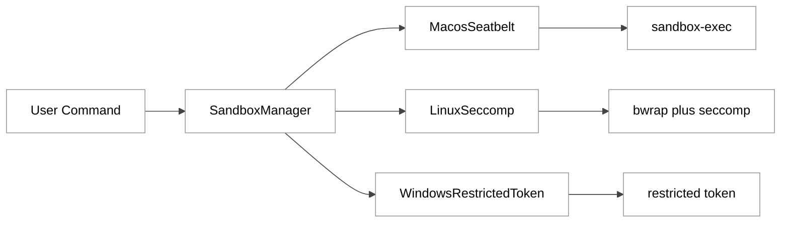
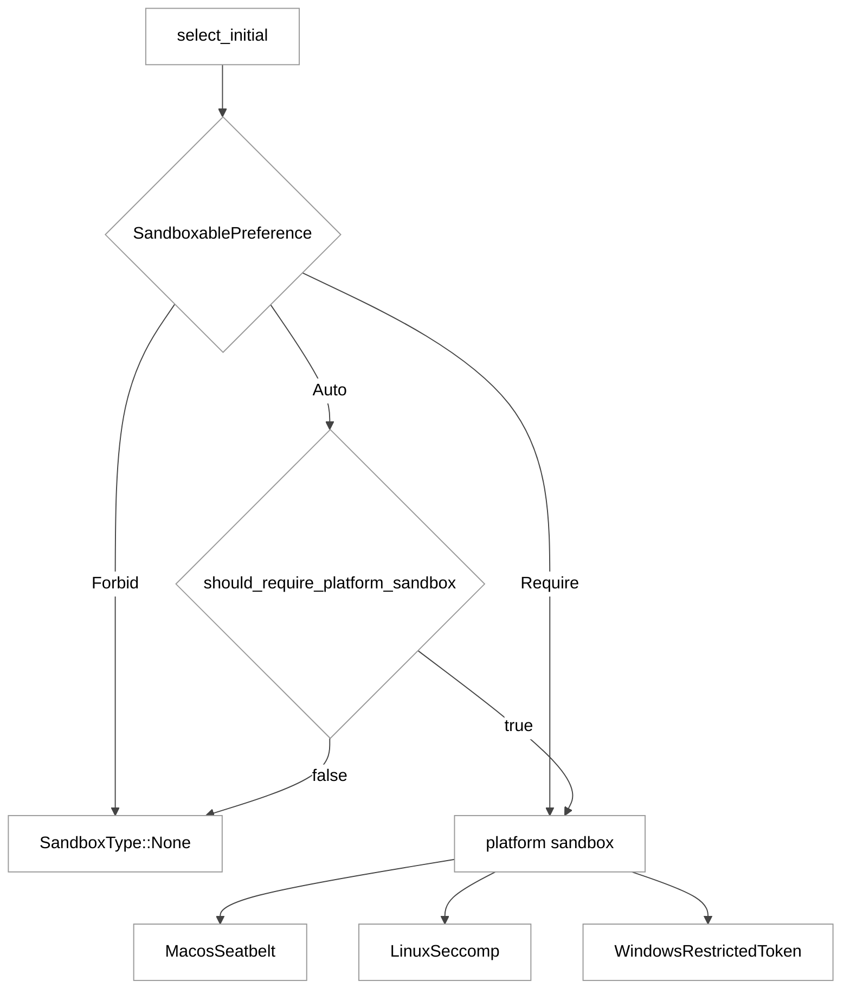
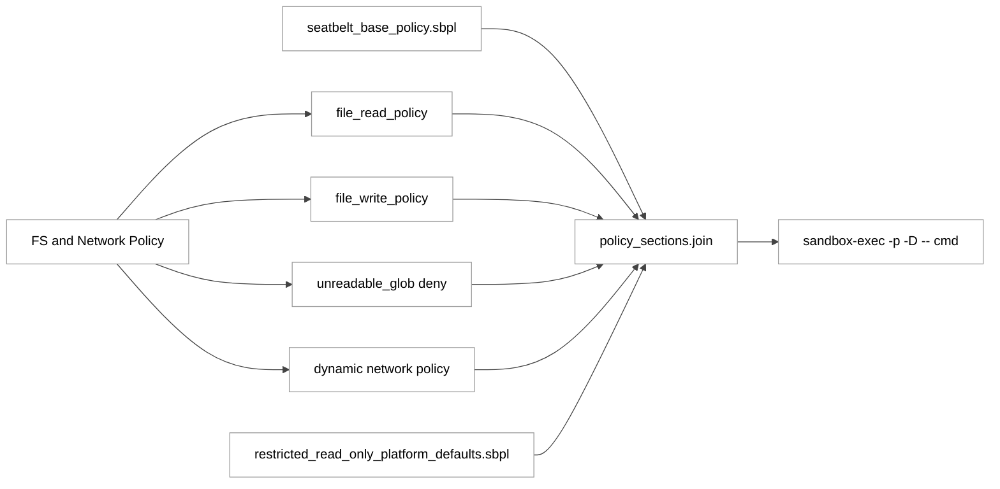
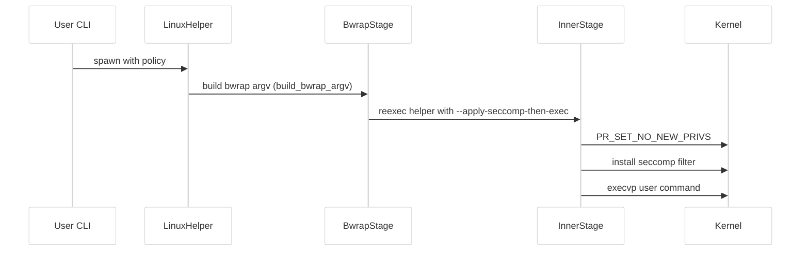
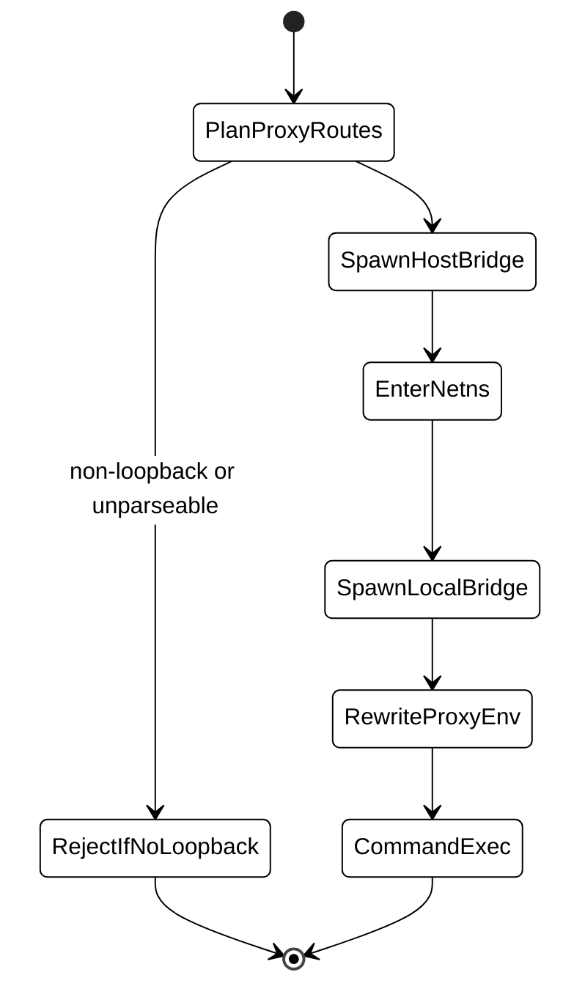
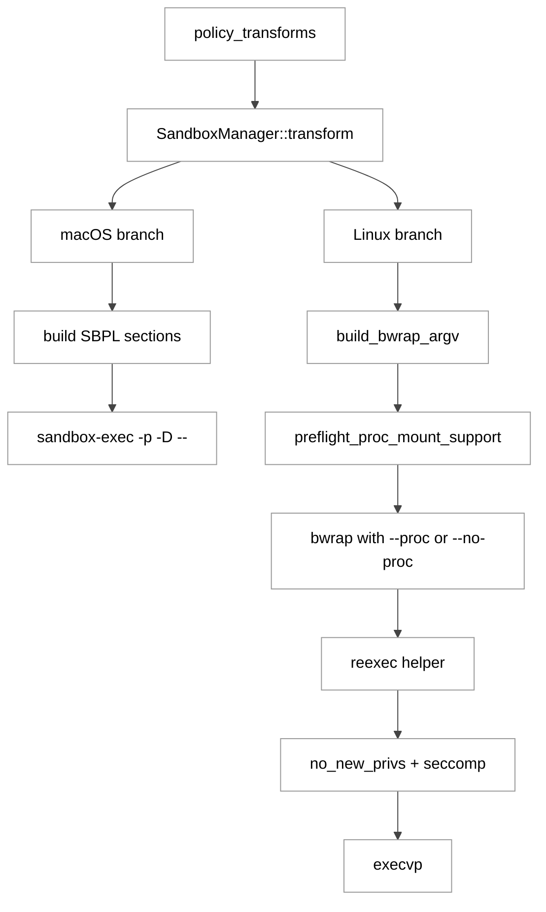

# 第 12 章：macOS Seatbelt 与 Linux Bwrap 沙箱

## 引言

Codex 的沙箱实现并非「附属安全插件」，而是 Agent 能否在本地长期自动运行的基础设施。本章聚焦两个真实落地的后端：macOS 的 Seatbelt（`sandbox-exec`）与 Linux 的 bwrap 两阶段沙箱，并补充与之配合的策略转换层。

按 `wc -l` 复核，相关源码体量如下（路径以 `/Users/hexiaonan/workspace/formless/refer/codex/` 为根）：

- `codex-rs/sandboxing/src/manager.rs`：345 行
- `codex-rs/sandboxing/src/seatbelt.rs`：745 行
- `codex-rs/sandboxing/src/policy_transforms.rs`：533 行
- `codex-rs/sandboxing/src/seatbelt_base_policy.sbpl`：122 行
- `codex-rs/sandboxing/src/seatbelt_network_policy.sbpl`：31 行
- `codex-rs/sandboxing/src/restricted_read_only_platform_defaults.sbpl`：199 行
- `codex-rs/linux-sandbox/src/bwrap.rs`：2707 行
- `codex-rs/linux-sandbox/src/linux_run_main.rs`：1470 行
- `codex-rs/linux-sandbox/src/proxy_routing.rs`：802 行
- `codex-rs/linux-sandbox/src/landlock.rs`：346 行
- `codex-rs/linux-sandbox/README.md`：97 行
- `docs/sandbox.md`：3 行

仅核心 Rust 源文件（前 10 项中的 `.rs` 与 `.sbpl`）合计约 **7300 行**，其中 `bwrap.rs` 一文件占比约 **37%**。仅从体量上看，Linux 侧的复杂度集中在文件系统视图构造与代理路由桥；macOS 侧则较多依赖 OS 原语 + SBPL 文本模板。这一观察支持「Linux 不是单纯的参数拼接」这一基本判断，但具体复杂度成因仍需从源码看，下文逐项展开。

---

## 全网调研补充（近 12 个月）

### 1) 检索来源

按本章关键词进行检索，并补齐指定社区来源。主要样本来自：

- 官方：OpenAI Developers（Sandbox / Security）、`openai/codex` 仓库与 issue
- 英文社区：Simon Willison、Latent Space、Hacker News
- 中文社区：知乎、少数派、CSDN、掘金
- 指定补充：机器之心（近 12 个月内未检索到 Codex 沙箱方向的深度技术稿件）

### 2) 社区共识

1. **沙箱与审批是两层机制**：沙箱是技术边界（OS 原语），审批是交互边界（用户确认）。两者职责不重叠，但默认值耦合。
2. **Linux 兼容性问题真实存在**：尤其在 Ubuntu 24.04+ 的 `kernel.unprivileged_userns_clone` 限制、容器内 nested userns、Flatpak、受限 PID 1 等环境下，bwrap 会失败。
3. **macOS 仍普遍使用 Seatbelt 路径**：尽管 `sandbox-exec` 在 Apple 文档中长期标记为 deprecated（无替代品发布），工程上仍是可移植的最佳折中之一。

### 3) 争议与常见误解

1. **误解：`workspace-write` 等于「完全安全」**
   实际是「受限写 + 受控网络」。可写根之外仍可能被读到（取决于 read 策略），且 unreadable glob 是显式声明，不是默认。
2. **误解：Landlock 会自动兜底 bwrap 失败**
   现实现里 Landlock 仅作为 **显式 legacy** 分支（`use_legacy_landlock = true`），不存在「任意失败时静默回退」语义。
3. **误解：Seatbelt 策略是静态模板**
   基础 SBPL 模板是静态的，但读写根、unreadable glob、proxy 端口、unix socket 例外都是 Rust 端运行时拼接的，并通过 `sandbox-exec -D` 传参。

### 4) 社区盲区（本章重点）

- unreadable glob 如何从策略语义落地到 bwrap 可执行掩码（ripgrep 预扫描 + 8192 上限）
- 可写 symlink 场景为何要 fail-closed（TOCTTOU snapshot 风险）
- proxy-only 模式下 host bridge / netns bridge 的「TCP→UDS→TCP」双桥细节
- 仓库内文档极简（`docs/sandbox.md` 仅 3 行外链），真正语义在源码

---

## 七维分析

## 1. 本质是什么：策略优先，平台原语执行

`SandboxManager` 是策略层与平台后端之间的薄适配层：先做后端选择（`select_initial`），再做命令变换（`transform`），真正的隔离动作交给 OS 原语。

```rust
// codex-rs/sandboxing/src/manager.rs:22
#[derive(Clone, Copy, Debug, PartialEq, Eq)]
pub enum SandboxType {
    None,
    MacosSeatbelt,
    LinuxSeccomp,
    WindowsRestrictedToken,
}
```

平台识别是显式分支：

```rust
// codex-rs/sandboxing/src/manager.rs:48
pub fn get_platform_sandbox(windows_sandbox_enabled: bool) -> Option<SandboxType> {
    if cfg!(target_os = "macos") {
        Some(SandboxType::MacosSeatbelt)
    } else if cfg!(target_os = "linux") {
        Some(SandboxType::LinuxSeccomp)
    } else if cfg!(target_os = "windows") {
        ...
    } else {
        None
    }
}
```

事实层面可以确认的两点：第一，类型枚举静态固定四种后端，没有运行时插件机制；第二，平台到后端是 `cfg!` 编译期绑定，不允许跨平台错配。至于「为什么这样设计」，源码本身没有直接证明动机，可能的考量包括减少跨平台分支错误、便于在编译期裁剪依赖；这只是合理推测，不作为结论。

<div style="background:#ffffff !important; background-color:#ffffff !important; padding:16px; border-radius:8px; margin:16px 0;" bgcolor="#ffffff">



</div>

## 2. 核心问题和痛点

### 痛点 A：跨 OS 语义对齐

Linux bwrap 模块的开头直接声明「镜像 macOS Seatbelt 语义」，这是工程上少见的明文承诺：

```rust
// codex-rs/linux-sandbox/src/bwrap.rs:1
//! Bubblewrap-based filesystem sandboxing for Linux.
//!
//! This module mirrors the semantics used by the macOS Seatbelt sandbox:
//! - the filesystem is read-only by default,
//! - explicit writable roots are layered on top, and
//! - sensitive subpaths such as `.git`, `.agents`, and `.codex` remain
//!   read-only even when their parent root is writable.
```

事实上，Seatbelt 是 SBPL 规则集，bwrap 是 mount overlay；它们的语义底层模型不同，所以「镜像」是实现层的努力，而不是免费的。具体落点稍后在 §4 展开。

### 痛点 B：兼容性与强约束冲突

Linux helper 必须在多种基础环境上正确运行：发行版差异、容器、WSL、自带或系统 `bwrap`、有/无 `--argv0` 支持、有/无 user namespaces。crate 的 README 把这一点写得非常工程化：

```markdown
<!-- codex-rs/linux-sandbox/README.md:10 -->
On Linux, Codex prefers the first `bwrap` found on `PATH`
outside the current working directory whenever it is available. If `bwrap` is
present but too old to support `--argv0`, the helper keeps using system
bubblewrap and switches to a no-`--argv0` compatibility path for the inner
re-exec. If `bwrap` is missing, the helper falls back to the bundled
`codex-resources/bwrap` binary shipped with Codex.
```

```markdown
<!-- codex-rs/linux-sandbox/README.md:20 -->
WSL1 is not supported for bubblewrap sandboxing because it cannot create the
required user namespaces, so Codex rejects sandboxed shell commands that would
enter the bubblewrap path.
```

也就是说，存在四条路径需要分别测试：系统 bwrap + argv0、系统 bwrap 无 argv0、内置 bundled bwrap、WSL1 直接拒绝。这是「强一致语义」遇到「弱一致基础设施」的典型摩擦。

### 痛点 C：网络不是开关，而是策略矩阵

Seatbelt 动态网络策略由多个条件 OR 触发，不是单一布尔：

```rust
// codex-rs/sandboxing/src/seatbelt.rs:266
let should_use_restricted_network_policy = !proxy.ports.is_empty()
    || proxy.has_proxy_config
    || enforce_managed_network
    || (!network_policy.is_enabled() && has_some_unix_socket_access);
```

四个条件覆盖了：显式代理端口、声明了代理配置（即使无法解析）、强制托管网络、网络禁用但需要 unix socket。同一段函数后面对「无可解析端点 + 强制 proxy」会显式 `return String::new()`，这是 fail-closed 而不是默认放行：

```rust
// codex-rs/sandboxing/src/seatbelt.rs:295
if proxy.has_proxy_config {
    // Proxy configuration is present but we could not infer any valid loopback endpoints.
    // Fail closed to avoid silently widening network access in proxy-enforced sessions.
    return String::new();
}
```

### 痛点 D：策略输入异构、输出必须可执行

`FileSystemSandboxPolicy` 可同时携带 readable roots、writable roots、unreadable globs、protected metadata names、project root specials、symlink target 等多种异构维度。但最终要落到两类执行物：SBPL 文本（macOS）和 bwrap argv（Linux）。这是「策略层异构 → 执行层同构」的翻译问题，所有的复杂性都集中在 `seatbelt.rs` 与 `bwrap.rs` 内部的拼装逻辑里。

---

## 3. 解决思路与方案（架构、数据结构、关键算法）

### 3.1 入口决策：先判断「是否必须平台沙箱」

`should_require_platform_sandbox()` 是关键门槛函数：

```rust
// codex-rs/sandboxing/src/policy_transforms.rs:509
pub fn should_require_platform_sandbox(
    file_system_policy: &FileSystemSandboxPolicy,
    network_policy: NetworkSandboxPolicy,
    has_managed_network_requirements: bool,
) -> bool {
    if has_managed_network_requirements {
        return true;
    }

    if !network_policy.is_enabled() {
        return !matches!(
            file_system_policy.kind,
            FileSystemSandboxKind::ExternalSandbox
        );
    }

    match file_system_policy.kind {
        FileSystemSandboxKind::Restricted => !file_system_policy.has_full_disk_write_access(),
        FileSystemSandboxKind::Unrestricted | FileSystemSandboxKind::ExternalSandbox => false,
    }
}
```

阅读这段：网络要求强制开启托管 → 必须沙箱；网络被禁但策略不是 ExternalSandbox → 必须沙箱；其余分支按文件系统访问范围决定。结论是平铺的真值表，没有隐式优先级。

`select_initial()` 再结合用户偏好 `Auto/Require/Forbid` 输出后端类型：

```rust
// codex-rs/sandboxing/src/manager.rs:139
pub fn select_initial(
    &self,
    file_system_policy: &FileSystemSandboxPolicy,
    network_policy: NetworkSandboxPolicy,
    pref: SandboxablePreference,
    windows_sandbox_level: WindowsSandboxLevel,
    has_managed_network_requirements: bool,
) -> SandboxType { ... }
```

<div style="background:#ffffff !important; background-color:#ffffff !important; padding:16px; border-radius:8px; margin:16px 0;" bgcolor="#ffffff">



</div>

### 3.2 Seatbelt 路径：组合式 SBPL

核心常量显示 Seatbelt 是「基础策略 + 网络策略 + 平台默认」拼装：

```rust
// codex-rs/sandboxing/src/seatbelt.rs:20
const MACOS_SEATBELT_BASE_POLICY: &str = include_str!("seatbelt_base_policy.sbpl");
const MACOS_SEATBELT_NETWORK_POLICY: &str = include_str!("seatbelt_network_policy.sbpl");
const MACOS_RESTRICTED_READ_ONLY_PLATFORM_DEFAULTS: &str =
    include_str!("restricted_read_only_platform_defaults.sbpl");
```

执行入口固定为系统路径，避免 PATH 注入：

```rust
// codex-rs/sandboxing/src/seatbelt.rs:25
/// When working with `sandbox-exec`, only consider `sandbox-exec` in `/usr/bin`
/// to defend against an attacker trying to inject a malicious version on the
/// PATH. If /usr/bin/sandbox-exec has been tampered with, then the attacker
/// already has root access.
pub const MACOS_PATH_TO_SEATBELT_EXECUTABLE: &str = "/usr/bin/sandbox-exec";
```

Seatbelt 基础策略明确是 deny-default：

```scheme
; codex-rs/sandboxing/src/seatbelt_base_policy.sbpl:7
; start with closed-by-default
(deny default)
```

最终 SBPL 是多段拼接，然后通过 `-p` 整体传入：

```rust
// codex-rs/sandboxing/src/seatbelt.rs:711
let mut policy_sections = vec![
    MACOS_SEATBELT_BASE_POLICY.to_string(),
    file_read_policy,
    file_write_policy,
    deny_read_policy,
    network_policy,
];
if include_platform_defaults {
    policy_sections.push(MACOS_RESTRICTED_READ_ONLY_PLATFORM_DEFAULTS.to_string());
}
let full_policy = policy_sections.join("\n");
```

<div style="background:#ffffff !important; background-color:#ffffff !important; padding:16px; border-radius:8px; margin:16px 0;" bgcolor="#ffffff">



</div>

### 3.3 Linux 路径：两阶段执行

`run_main()` 的文档注释定义了标准流程：bwrap 外层，seccomp 内层。

```rust
// codex-rs/linux-sandbox/src/linux_run_main.rs:140
/// Entry point for the Linux sandbox helper.
///
/// The sequence is:
/// 1. When needed, wrap the command with bubblewrap to construct the
///    filesystem view.
/// 2. Apply in-process restrictions (no_new_privs + seccomp).
/// 3. `execvp` into the final command.
pub fn run_main() -> ! { ... }
```

两个内层模式显式互斥（不是隐含约束，是 panic）：

```rust
// codex-rs/linux-sandbox/src/linux_run_main.rs:295
fn ensure_inner_stage_mode_is_valid(apply_seccomp_then_exec: bool, use_legacy_landlock: bool) {
    if apply_seccomp_then_exec && use_legacy_landlock {
        panic!("--apply-seccomp-then-exec is incompatible with --use-legacy-landlock");
    }
}
```

`linux-sandbox/src/landlock.rs` 的文件级注释直接说明了职责分工：filesystem 由 bwrap 负责，landlock 仅作为 legacy/backup：

```rust
// codex-rs/linux-sandbox/src/landlock.rs:1
//! In-process Linux sandbox primitives: `no_new_privs` and seccomp.
//!
//! Filesystem restrictions are enforced by bubblewrap in `linux_run_main`.
//! Landlock helpers remain available here as legacy/backup utilities.
```

<div style="background:#ffffff !important; background-color:#ffffff !important; padding:16px; border-radius:8px; margin:16px 0;" bgcolor="#ffffff">



</div>

---

## 4. 实现细节关键点（关键路径 / 函数 / 数据流）

### 4.1 命令变换中枢：`SandboxManager::transform()`

它先算 `effective_permission_profile`，再按后端包装 argv：

```rust
// codex-rs/sandboxing/src/manager.rs:184
let additional_permissions = command.additional_permissions.take();
let effective_permission_profile =
    effective_permission_profile(permissions, additional_permissions.as_ref());
...
let (argv, arg0_override) = match sandbox {
    SandboxType::None => ...
    #[cfg(target_os = "macos")]
    SandboxType::MacosSeatbelt => ...
    SandboxType::LinuxSeccomp => ...
    ...
};
```

注意：分支头上的 `#[cfg(target_os = "macos")]` 暗示 macOS 路径在非 macOS 编译时根本不存在；同样的，Linux 走 `LinuxSeccomp` 分支。这与 §1 的 `cfg!` 平台分支配合，让无效组合在编译期被剔除。

### 4.2 Seatbelt 的细粒度拼接

读写路径不是裸 allow，而是支持「父根 + 例外子路径 + protected metadata 名称」的组合：

```rust
// codex-rs/sandboxing/src/seatbelt.rs:356
let mut require_parts = vec![format!("(subpath (param \"{root_param}\"))")];
for (excluded_index, excluded_subpath) in
    access_root.excluded_subpaths.into_iter().enumerate()
{
    ...
    require_parts.push(format!(
        "(require-not (literal (param \"{excluded_param}\")))"
    ));
    require_parts.push(format!(
        "(require-not (subpath (param \"{excluded_param}\")))"
    ));
}
```

注释里给出了一个具体的失败模式作为设计依据：`subpath` 单独使用会让首次创建 `.codex` 目录绕过保护。所以 literal + subpath 是「目录本身 + 目录之内」两类都要拒绝。

对 unreadable glob，Seatbelt 直接生成 deny regex（同时覆盖读和 unlink）：

```rust
// codex-rs/sandboxing/src/seatbelt.rs:448
for regex in regexes {
    let regex = regex.replace('"', "\\\"");
    policy_components.push(format!(r#"(deny file-read* (regex #"{regex}"))"#));
    policy_components.push(format!(r#"(deny file-write-unlink (regex #"{regex}"))"#));
}
```

`file-write-unlink` 一并 deny 是为了堵住「通过删除路径来探测存在性」的侧信道——这是 deny 规则要成对出现的常见原因。

### 4.3 bwrap 挂载顺序是「算法」

`create_filesystem_args()` 在函数头给出了 6 步顺序，可以视为这一文件最核心的算法描述：

```rust
// codex-rs/linux-sandbox/src/bwrap.rs:351
/// Build the bubblewrap filesystem mounts for a given filesystem policy.
///
/// The mount order is important:
/// 1. Full-read policies, and restricted policies that explicitly read `/`,
///    use `--ro-bind / /`; other restricted-read policies start from
///    `--tmpfs /` and layer scoped `--ro-bind` mounts.
/// 2. `--dev /dev` mounts a minimal writable `/dev` with standard device nodes
///    (including `/dev/urandom`) even under a read-only root.
/// 3. Unreadable ancestors of writable roots are masked before their child
///    mounts are rebound so nested writable carveouts can be reopened safely.
/// 4. `--bind <root> <root>` re-enables writes for allowed roots, including
///    writable subpaths under `/dev` (for example, `/dev/shm`).
/// 5. `--ro-bind <subpath> <subpath>` re-applies read-only protections under
///    those writable roots so protected subpaths win.
/// 6. Nested unreadable carveouts under a writable root are masked after that
///    root is bound, and unrelated unreadable roots are masked afterward.
fn create_filesystem_args(
    file_system_sandbox_policy: &FileSystemSandboxPolicy,
    cwd: &Path,
    glob_scan_max_depth: Option<usize>,
) -> Result<BwrapArgs> { ... }
```

该函数体在 `bwrap.rs:367..630`，**约 264 行**，是 Linux 文件系统策略的算法核心。可以观察到：

- 第 1 步对「是否包含 `/` 作为可读根」做了双分支，避免在受限策略下意外打开整个文件系统。
- 第 3 步先掩盖不可读祖先，再在第 4 步重新打开可写子目录，第 5 步再把保护子路径压回只读，第 6 步再处理嵌套不可读。这种「先粗后细、再粗再细」的顺序，是 bwrap mount overlay 的合法表达方式之一。

### 4.4 unreadable glob 扩展与降级策略

```rust
// codex-rs/linux-sandbox/src/bwrap.rs:700
fn expand_unreadable_globs_with_ripgrep(
    patterns: &[String],
    cwd: &Path,
    max_depth: Option<usize>,
) -> Result<Vec<AbsolutePathBuf>> {
    if patterns.is_empty() || max_depth == Some(0) {
        return Ok(Vec::new());
    }
    ...
}
```

总数受常量限制：

```rust
// codex-rs/linux-sandbox/src/bwrap.rs:56
const MAX_UNREADABLE_GLOB_MATCHES: usize = 8192;
```

`rg` 不存在才回退到内置 globset 走查，其他失败直接返回 `CodexErr::Fatal`，避免静默扩大可见面。

### 4.5 fail-closed：可写 symlink 场景直接拒绝构建

```rust
// codex-rs/linux-sandbox/src/bwrap.rs:1139
fn append_unreadable_root_args(
    bwrap_args: &mut BwrapArgs,
    unreadable_root: &Path,
    allowed_write_paths: &[PathBuf],
) -> Result<()> {
    if let Some(symlink) =
        first_writable_symlink_component_in_path(unreadable_root, allowed_write_paths)
    {
        /*
         * Deny-read masks must fail closed when the protected path crosses a
         * symlink that remains writable to the sandboxed process. Resolving and
         * masking the symlink's current target is a TOCTTOU snapshot: bwrap would
         * protect the old target while the logical path could later point
         * somewhere else.
         */
        return Err(CodexErr::Fatal(format!(
            "cannot enforce sandbox deny-read path {} because it crosses writable symlink {}",
            unreadable_root.display(),
            symlink.display()
        )));
    }
    ...
}
```

注释把动机写得很直白：mask 当前 symlink 目标只是「快照保护」，运行时 symlink 可能被改写，所以 fail-closed 比静默放宽更安全。这是源码里少有的、明确写明威胁模型的位置。

### 4.6 `/proc` 预探测与自动降级

```rust
// codex-rs/linux-sandbox/src/linux_run_main.rs:444
fn preflight_proc_mount_support(
    sandbox_policy_cwd: &Path,
    command_cwd: &Path,
    file_system_sandbox_policy: &FileSystemSandboxPolicy,
    network_mode: BwrapNetworkMode,
) -> CodexResult<bool> {
    let preflight_argv = build_preflight_bwrap_argv(
        sandbox_policy_cwd,
        command_cwd,
        file_system_sandbox_policy,
        network_mode,
    )?;
    let stderr = run_bwrap_in_child_capture_stderr(preflight_argv);
    Ok(!is_proc_mount_failure(stderr.as_str()))
}
```

实现策略是「先跑一次 `/bin/true` 的 bwrap，捕获 stderr，匹配已知的 `/proc` 失败模式」，然后再决定是否需要 `--no-proc`。这是经验性而非声明性：只能识别已知错误文本。

### 4.7 受保护 metadata 的运行时违规检测

```rust
// codex-rs/linux-sandbox/src/linux_run_main.rs:1277
fn exit_with_wait_status_or_policy_violation(
    status: libc::c_int,
    protected_create_violation: bool,
) -> ! {
    if protected_create_violation && libc::WIFEXITED(status) && libc::WEXITSTATUS(status) == 0 {
        std::process::exit(1);
    }

    exit_with_wait_status(status);
}
```

含义：即便子命令本身返回 0，只要在沙箱内触发了「试图创建受保护 metadata 路径」事件，最终也会被改写为退出码 1。这样上层调度可以拒绝该次结果，不依赖子命令自己「诚实地」报错。

### 4.8 proxy routing 数据流（仅 loopback）

```rust
// codex-rs/linux-sandbox/src/proxy_routing.rs:205
fn parse_loopback_proxy_endpoint(proxy_url: &str) -> Option<SocketAddr> {
    ...
    if !is_loopback_host(host) {
        return None;
    }
    ...
}
```

```rust
// codex-rs/linux-sandbox/src/proxy_routing.rs:419
fn spawn_host_bridge(endpoint: SocketAddr, uds_path: &Path) -> io::Result<libc::pid_t> { ... }
```

代理端点仅接受 loopback host（`localhost` / `127.0.0.1` / `::1`），且端口必须可解析。这与 §2 的 fail-closed 策略一致：解析失败或非 loopback 会直接拒绝管理代理模式启动。

<div style="background:#ffffff !important; background-color:#ffffff !important; padding:16px; border-radius:8px; margin:16px 0;" bgcolor="#ffffff">



</div>

### 4.9 跨平台分支总览

下面这张图把 §3、§4 中的零散关系合并为一个端到端视图，便于读源码时定位：

<div style="background:#ffffff !important; background-color:#ffffff !important; padding:16px; border-radius:8px; margin:16px 0;" bgcolor="#ffffff">



</div>

---

## 5. 易错点和注意事项

下列每条都对应过往在 issue / PR 中出现过的真实坑，建议结合源码同步阅读：

1. **仓库内文档极薄**：`docs/sandbox.md` 只有 3 行外链，所有真实语义都在 `codex-rs/sandboxing/` 与 `codex-rs/linux-sandbox/` 的 Rust 源码与 sbpl 文件里。仅看 `docs/` 会得到「沙箱只是一个安全选项」这种误导印象；建议把 README.md（97 行）和 `bwrap.rs` 头部文档（line 1-11）当作主入口。

2. **WSL1 与受限容器**：bwrap 路径在 WSL1 上被显式拒绝（README.md line 20），且在「无 user namespaces / 受限 PID 1 / no `/proc` mount」环境下会失败。`preflight_proc_mount_support()` 会触发一次轻量探测，因此首次启动时间略长是正常现象，不是 hang。

3. **proxy 环境变量格式**：`parse_loopback_proxy_endpoint()` 只接受 loopback host 且端口可解析；任何非 loopback 端点都会被忽略；同时若 `proxy.has_proxy_config` 为 true 但端点全部不可解析，`dynamic_network_policy_for_network` 会 fail-closed 返回空字符串。这意味着「配置了代理但拼写错误」会比「没配代理」更严格——这一点在调试时容易反过来。

4. **glob deny 规模**：`MAX_UNREADABLE_GLOB_MATCHES = 8192`。在 monorepo 或包含 `node_modules` 的目录下使用宽泛的 `**/*.env` 之类模式，可能触发 fatal。可通过 `glob_scan_max_depth` 在 permission profile 中收敛，例如 README.md 给出的示例：

```toml
[permissions.workspace.filesystem]
glob_scan_max_depth = 2

[permissions.workspace.filesystem.":workspace_roots"]
"**/*.env" = "none"
```

5. **legacy Landlock 预期**：`use_legacy_landlock = true` 不是「兜底」而是「显式切换」，且只有当 split filesystem policy 与 legacy `SandboxPolicy` 模型「往返同构」时才能使用，否则会停留在 bwrap 路径（见 README.md line 40-48）。如果团队在 Ubuntu 24.04 之类的环境上想跳过 user namespaces，应该评估这条路径，不要假设它会被自动选中。

6. **`.git` / `.codex` / `.agents` 的 metadata 保护**：这三个名字在 `bwrap.rs:414-416` 与 Seatbelt 端的 `protected_metadata_names` 都被特别对待。即便父目录可写，子目录仍只读；首次创建 `.codex` 这种行为，会被合并的 literal + subpath 双 deny 拒绝。这是为了保护 Git/Codex 自身的状态目录。

7. **`/dev` 与 `/dev/shm`**：在受限读策略下，仍会显式 `--dev /dev`（参见 `bwrap.rs:450`），且允许 `/dev/shm` 之类的写子路径。需要保证子命令对这些路径的可见性，不要在策略中把它们整体拒掉。

---

## 6. 竞品对比（Claude Code / Opencode / Aider / Goose / Continue）

下面的对比口径以「OS 原语沙箱是否是产品默认/内建路径」为主轴，其他维度（权限治理、命令审批、容器使用）作为辅助。

### 6.1 Claude Code

- 官方文档明确：macOS 使用 Seatbelt，Linux/WSL2 使用 bubblewrap；这是与 Codex 实现路径最接近的一类产品。
- 差异更多在产品编排与配置入口；从公开资料来看，Claude Code 并没有把可写 symlink 场景的 fail-closed、`/proc` 预探测、proxy TCP↔UDS 桥这些 Linux 细节同等程度地暴露出来。这不代表它没有做，只是公开材料对比时无法直接证明。

参考：[Claude sandboxing](https://code.claude.com/docs/en/sandboxing)、[sandbox environments](https://code.claude.com/docs/en/sandbox-environments)

### 6.2 Continue

- 公开资料主轴是工具权限（`allow/ask/exclude`、`--auto/--readonly`），侧重调度治理而非内核边界。
- 与 Codex 「内核边界优先」相比，定位不同：Continue 更像 IDE 内嵌的调度系统。

参考：[Continue tool permissions](https://docs.continue.dev/cli/tool-permissions)

### 6.3 Opencode

- 官方文档突出 permission 系统；OS-level 沙箱多见于第三方插件链路（如 opencode-sandbox-plugin），不是默认。
- 可以视为「插件式沙箱」与 Codex「内建式沙箱」的不同取舍。

参考：[OpenCode permissions](https://opencode.ubitools.com/permissions)、[opencode sandbox plugin](https://github.com/clinta/opencode-sandbox-plugin)

### 6.4 Aider / Goose

- 从公开 issue 与社区实践看，Aider 与 Goose 更多依赖外部容器或外部 sandbox 包装来加固，而不像 Codex 把 OS 沙箱后端作为内建核心路径。
- 这是工程取舍：把沙箱外包给容器/Docker 可以减少自身复杂度，但也把可用性与一致性问题转移给最终用户。

参考：[Aider #4679](https://github.com/Aider-AI/aider/issues/4679)、[Aider #4882](https://github.com/Aider-AI/aider/issues/4882)

### 6.5 简短小结

如果只看「是否有沙箱」，这些产品基本都「有」。如果看「沙箱是否是默认行为 + 失败路径是否被显式工程化」，Codex 是少数把这两件事都内建到 CLI 主干里的。这是一种实现取舍上的差异，不是绝对优劣判断。

---

## 7. 仍存在的问题和缺陷

### 7.1 可读性与维护成本

`bwrap.rs`（2707 行）单文件承担了挂载顺序、symlink TOCTTOU、glob 扩展、protected metadata、synthetic mount targets、protected create targets 等多类逻辑。`linux_run_main.rs`（1470 行）同时承担参数解析、preflight、stage 切换、proxy 桥、信号与退出码改写。当任何一个子领域需要重大调整时，函数边界与状态耦合都可能成为阻力。这是源码可观察到的事实，至于是否会在未来重构成多文件 / 多 crate，没有源码层面的承诺。

### 7.2 文档层缺口

仓库本地文档无法承载关键行为描述：

```markdown
<!-- docs/sandbox.md:1 -->
## Sandbox & approvals
For information about Codex sandboxing and approvals, see [this documentation](https://developers.openai.com/codex/security).
```

外部读者很难只靠 `docs/` 理解失败路径，至少需要阅读：

- `codex-rs/linux-sandbox/README.md`（97 行）
- `codex-rs/linux-sandbox/src/bwrap.rs` 头部注释 + `create_filesystem_args` 顶部 6 步注释
- `codex-rs/sandboxing/src/seatbelt.rs:266-318`（动态网络策略）

这意味着新人 onboarding 成本相对高。把 README 拓展为完整文档，或者补充 ADR 类条目，可能是个比较自然的改进方向（仅为推测，不代表项目计划）。

### 7.3 默认策略仍是「安全与可用性折中」

`seatbelt_base_policy.sbpl`（122 行）为了兼容真实工作流，放行了许多看似宽泛的能力，例如：

```scheme
; codex-rs/sandboxing/src/seatbelt_base_policy.sbpl:23
(allow sysctl-read
  (sysctl-name "hw.activecpu")
  ...
)
```

```scheme
; codex-rs/sandboxing/src/seatbelt_base_policy.sbpl:92
; Needed for python multiprocessing on MacOS for the SemLock
(allow ipc-posix-sem)
```

这些放行项都标注了「为何需要」（如 Python multiprocessing、PyTorch/libomp、TTY 检测），可视为「面向真实开发者工作流的可用性补丁」。代价是攻击面比纯白名单要大一些。对此可以做的细化（例如把这些放行项拆为可选）属于持续优化空间，但需要权衡兼容性。

### 7.4 平台依赖风险

- Linux 依赖 bwrap / userns / AppArmor 的生态状态。Ubuntu 24.04 默认开启的 `restrict_unprivileged_userns` 已经让不少用户遇到 bwrap 启动失败，且 README 给出的回退路径并不能覆盖所有发行版组合。
- macOS 依赖 `sandbox-exec` 工具链的可用性。Apple 长期标记 `sandbox-exec` 为 deprecated 但未提供替代品，这本身就是不确定性来源——若未来某版 macOS 直接移除 `sandbox-exec`，整条 Seatbelt 路径需要切换到其他原语。
- proxy-only 依赖本地网络命名空间、loopback 端口与多种代理环境变量的一致性，组合空间较大。

### 7.5 测试可观察性

`bwrap_tests.rs`、`seatbelt_tests.rs`、`policy_transforms_tests.rs` 提供了大量单元测试，但端到端「不同发行版 + 不同 bwrap 版本 + 不同 userns 限制」的矩阵测试需要在 CI 之外的环境完成，这一类测试基础设施的公开材料相对有限，外部很难复现。这不是 bug，但会限制社区参与解决兼容性问题的速度。

---

## 小结

回到本章开头的问题：Codex 的沙箱在工程上到底做了什么？综合上面对源码的观察，可以归纳为三点：

1. **它是一个策略系统而非单点开关**：`policy_transforms → manager → platform backend` 分层清晰，策略输入是异构的（read/write roots、unreadable globs、protected metadata、proxy、UDS exceptions），执行物是同构的（SBPL 文本或 bwrap argv）。
2. **复杂度集中在 Linux**：两阶段执行（bwrap + seccomp）、6 步挂载顺序、ripgrep glob 扩展、可写 symlink fail-closed、`/proc` 预探测、proxy 双桥与违规退出码改写共同构成防线。`bwrap.rs` 2707 行的体量是这种集中化的直接表征。
3. **价值更多体现在失败路径**：fail-closed（symlink、proxy 无法解析、protected metadata 创建违规）、显式互斥（`--apply-seccomp-then-exec` vs `--use-legacy-landlock`）、preflight + 降级（`/proc` 探测）这些设计，决定了沙箱在真实开发环境的可用性边界。

如果只看「是否使用了 Seatbelt/bwrap」，会错过这些工程细节。把它们读完，再看「为什么 workspace-write 还要审批」一类的产品决策，就更容易理解：沙箱与审批是两条独立但互相约束的防线，它们的默认值耦合在一起，但实现彼此独立。
