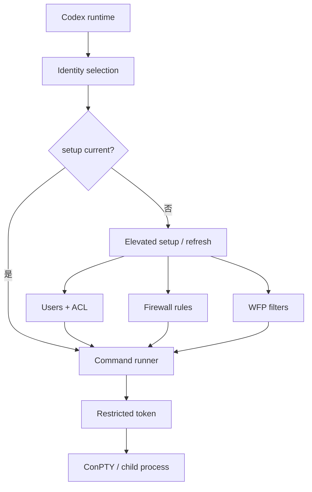

# 13｜Windows 沙箱与 WFP：身份、ACL、Token 与网络过滤

> 源码基线：`upstream/main@283bc4cf011047314b4804c0f1ccd06e4f6a95c5`（2026-06-24）。

Windows 没有与 Seatbelt 或 bwrap 完全等价的单一原语。Codex 因而组合多层机制：

- 独立 sandbox 用户身份；
- 文件系统 ACL；
- restricted token 与进程创建；
- elevated setup helper；
- Windows Firewall 规则；
- 持久化 WFP filters；
- ConPTY / stdio bridge。

## 1. 总体结构



Setup 和每次命令执行分离：高权限 helper 负责系统级准备，普通 runtime 选择身份并启动受限子进程。

## 2. Offline 与 Online 双身份

当前 elevated 模式维护两个 sandbox 账户：

- `CodexSandboxOffline`
- `CodexSandboxOnline`

`SandboxNetworkIdentity::from_permissions` 根据 permission profile 和 proxy enforcement 选择身份：

- 网络禁用或强制代理时使用 Offline；
- 明确允许网络且未强制代理时使用 Online。

网络能力由 OS 身份承载，比只设置环境变量更难被子进程绕过。

## 3. Setup 不是一次性安装

`SetupMarker` 不只记录版本，还记录：

- offline / online 用户名；
- proxy ports；
- `allow_local_binding`；
- 创建信息。

运行时会比较期望网络策略与 marker。Offline 身份的代理端口或本地绑定规则发生变化时，会触发 refresh。换言之，setup 是持续维护系统状态与当前权限配置的一致性。

## 4. ACL 与文件系统边界

Elevated helper 根据 read/write/deny roots 配置 sandbox 用户 ACL。其目的包括：

- 允许读取工具链和必要系统路径；
- 允许写入明确工作区；
- 拒绝敏感路径；
- 保护工作区元数据；
- 为新增读取根做后台 refresh。

ACL 变更成本高，且容易受继承规则、符号链接、用户目录与企业组策略影响，因此实现包含幂等、缓存、审计与错误分类。

## 5. Restricted token

Command runner 在 sandbox 用户上下文中创建 restricted token，并用它启动实际子进程。Token 主要约束：

- 用户与 capability SID；
- Windows 权限和组；
- 进程访问能力；
- child process identity。

Token 本身不能完整解决网络隔离，所以还需要 Firewall 和 WFP。

## 6. ConPTY 与 stdio

交互命令通过 command runner 与 ConPTY 启动，父进程通过桥接通道转发输入输出。这样 unified exec 的 PTY 语义可以保持一致，同时真实 child 仍运行在 sandbox identity 和 restricted token 下。

不能为了 TTY 体验绕开 token，否则交互命令会比非交互命令拥有更大权限。

## 7. Windows Firewall

Offline 身份的 Firewall 规则会：

- 阻断非 loopback 出站；
- 阻断 loopback UDP；
- 对 loopback TCP 仅允许配置的代理端口；
- 根据配置决定是否允许本地绑定。

实现会把允许的代理端口转换为其余端口的阻断区间。规则绑定 sandbox 账户，而不是依赖命令是否自觉使用代理。

## 8. WFP filters

WFP 层安装持久化 provider、sublayer 和 filters，并以稳定 GUID 标识。当前静态过滤项覆盖高风险或容易旁路的流量，例如：

- ICMP v4/v6；
- DNS 53；
- DNS-over-TLS 853；
- SMB 445 / 139。

安装使用 WFP transaction，成功后提交，失败则回滚。WFP setup 失败会被记录和计量，但当前 elevated setup 会继续；因此必须把它理解为额外防线，而不是唯一成功条件。

## 9. Firewall 与 WFP 不是二选一

两者职责互补：

| 层 | 主要作用 |
| --- | --- |
| Firewall rules | 用户身份级的常规出站、loopback 与端口策略 |
| WFP filters | 更底层、持久化的特定协议/端口阻断 |

再加上 Offline/Online 身份与 token，形成多层防御。任何单层缺失都不应被描述为“Windows 沙箱完全失效”，但其安全强度和可绕过面会变化。

## 10. Elevated 与 unelevated

Elevated 模式能创建用户、调整 ACL 并安装系统网络规则，是更强的主线。Unelevated 模式只能使用当前权限范围内的机制，网络和文件系统保证更弱，应被视为兼容路径而非等价实现。

WSL2 则走 Linux 执行与沙箱体系，不属于 Windows native sandbox 的同一实现。

## 11. 常见失败

- UAC 被拒绝；
- 企业策略禁止创建本地用户；
- ACL 继承或文件占用导致 setup 失败；
- Firewall COM 操作失败；
- WFP provider/filter 安装失败；
- marker 与实际系统状态漂移；
- runner 无法以目标身份启动；
- ConPTY 或 stdio bridge 断开。

源码将 setup 阶段、identity 阶段和 spawn 阶段的错误分开编码，排障时不应全部归为“命令执行失败”。

## 12. 源码阅读路线

```bash
rg -n "SandboxNetworkIdentity|SetupMarker|run_elevated_setup|run_setup_refresh" \
  codex-rs/windows-sandbox-rs/src
rg -n "OFFLINE_USERNAME|ONLINE_USERNAME|proxy_ports|allow_local_binding" \
  codex-rs/windows-sandbox-rs/src
rg -n "restricted token|create_restricted" codex-rs/windows-sandbox-rs/src/token.rs
rg -n "Block Non-Loopback|blocked_loopback_tcp_remote_ports" \
  codex-rs/windows-sandbox-rs/src/bin/setup_main/win/firewall.rs
rg -n "install_wfp_filters|FilterSpec|SESSION_NAME" \
  codex-rs/windows-sandbox-rs/src
rg -n "ConPTY|stdio_bridge" codex-rs/windows-sandbox-rs/src
```

Windows 沙箱的核心结论是：

> 安全边界不是一个开关，而是身份、文件 ACL、restricted token、进程边界和网络过滤共同组成的系统。
