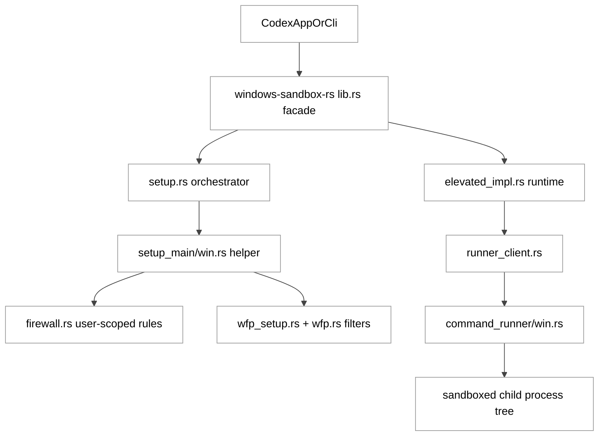
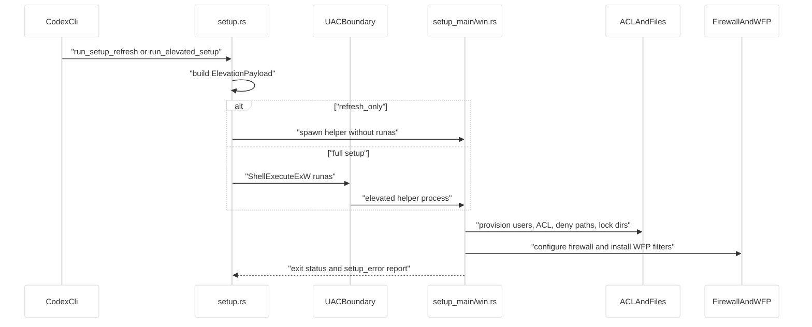
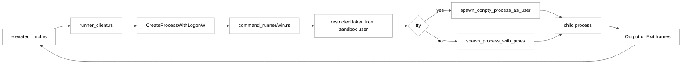
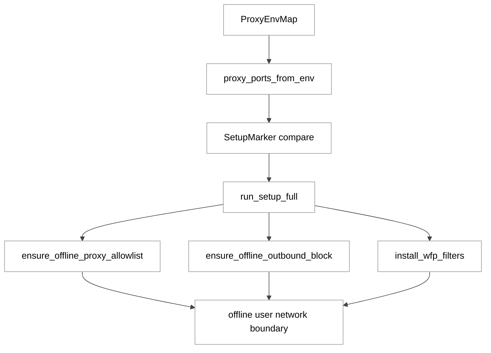
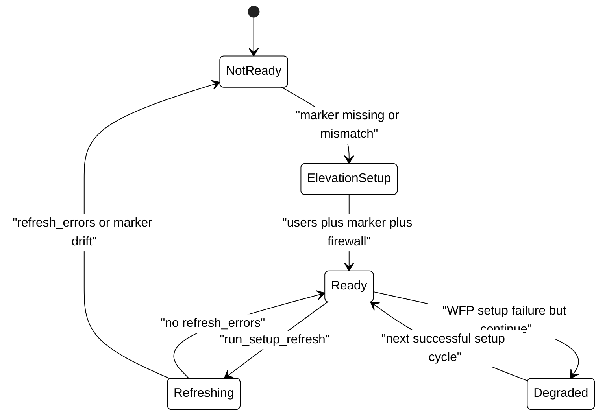
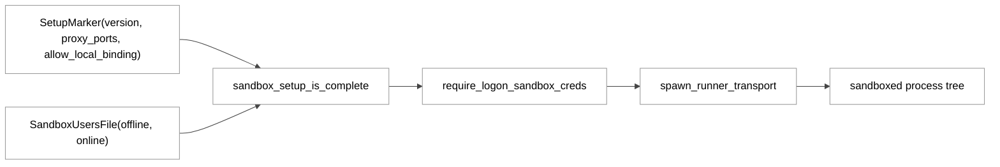

# 第 13 章：Windows 沙箱与 WFP 防火墙

## 引言

在 Codex 的跨平台沙箱体系里，Windows 不是“把 macOS/Linux 方案平移一遍”那么简单。Linux 有 `bwrap + seccomp`，macOS 有 Seatbelt，而 Windows 这条线最终演化成了 **多二进制协作 + 双沙箱用户 + ACL + Windows Firewall + WFP** 的组合系统。  
如果只看产品文案，读者容易把它理解为“一个 sandbox 开关”；但从源码看，这其实是一个明确分层的执行基础设施：

- 上层是 orchestrator（`setup.rs`）决定何时 setup/refresh；
- 中层是 elevated helper（`setup_main/win.rs`）执行用户创建、ACL、防火墙、WFP 安装；
- 下层是 command runner（`command_runner/win.rs`）在沙箱用户上下文里铸造 restricted token 并启动真实子进程；
- 旁路是 ConPTY/IPC 管线，保障 `tty=true` 的统一执行语义。

本章以 `codex-rs/windows-sandbox-rs` 为主线，重点聚焦你指定的三条核心路径，并补充 `wfp.rs` 与 `firewall.rs` 来还原网络隔离的真实边界。

按本章复核口径（2026-05-26）：

- `codex-rs` 中 `Cargo.toml` 文件共 **120** 个（`Glob` 统计）
- `windows-sandbox-rs/src/**/*.rs` 共 **52** 个 Rust 源文件（`Glob` 统计）
- 关键文件规模：
  - `src/setup.rs`：**1665 行**，`fn` 约 **60** 个
  - `src/bin/setup_main/win.rs`：**1104 行**，`fn` 约 **17** 个
  - `src/lib.rs`：**731 行**，`fn` 约 **11** 个
  - `src/bin/setup_main/win/firewall.rs`：**605 行**，`fn` 约 **16** 个
  - `src/wfp.rs`：**422 行**，`fn` 约 **21** 个
  - `src/bin/command_runner/win.rs`：**652 行**，`fn` 约 **13** 个

这组数字本身就说明：Windows 沙箱并非一个薄封装，而是一个完整子系统。

---

## 全网调研补充（近 12 个月）

### 1) 资料来源覆盖

按章节专属关键词检索：

- `Codex Windows sandbox WFP firewall`
- `windows-sandbox-rs ConPTY`

并补充了指定渠道（OpenAI 工程团队、Simon Willison、Latent Space、HackerNews、知乎、少数派、机器之心、CSDN、掘金）的可得样本。高价值来源主要集中在：

1. OpenAI 官方工程文《Building a safe, effective sandbox to enable Codex on Windows》（2026-05-13）
2. OpenAI Developers 的 Windows 文档页（elevated/unelevated 模式说明）
3. `openai/codex` 的 PR / issue（例如 #15578、#20708、#17686、#22428）
4. 第三方深拆（Jonathan Johnson 的 Medium 分析）

### 2) 社区共识

过去 12 个月，围绕该主题的稳定共识基本有四条：

1. **Windows 需要独立沙箱工程，不存在“现成等价原语”**。  
2. **elevated 模式是推荐路径，unelevated 是退化兜底**。  
3. **网络隔离是 Windows 方案的核心分水岭**：从环境变量“软约束”转向用户 SID 维度的防火墙/WFP 约束。  
4. **实际故障多发生在 setup 与系统策略边界**（UAC、组策略、防火墙 COM 接口、PowerShell 分发差异），而不是模型层。

### 3) 社区分歧 / 常见误解

最常见的误解主要有三类：

1. **误解 A：有 restricted token 就等于网络也被硬隔离**  
   事实恰好相反：restricted token 主要解决文件与进程权限，网络硬隔离在 Windows 上需要额外走 Firewall/WFP 与用户身份绑定。

2. **误解 B：WFP 与 Windows Firewall 是二选一**  
   实际上二者是叠加关系：Windows Firewall 本身构建在 WFP 之上，源码里也同时存在 COM 规则配置和 WFP filter 安装路径。

3. **误解 C：setup 成功后就不会再触发 setup 逻辑**  
   源码明确有 `refresh` 路径，并且会根据 `proxy_ports` / `allow_local_binding` 漂移做重新校验。

### 4) 盲区（社区讨论不足，但源码很重）

对比英文社区和中文社区，当前盲区集中在四个点：

- **离线代理端口补集算法**（如何把“允许代理端口”转译成“其余端口全部阻断”）  
- **read ACL helper 的并发与幂等设计**（mutex + 后台刷新）  
- **WFP 安装失败的策略选择**（为何“记录并继续 setup”而不是 hard fail）  
- **ConPTY 与 sandbox identity 的组合路径**（TTY 会话如何保持 token 边界）

另外，Simon Willison / Latent Space 对 Codex 的宏观讨论很多，但针对 **Windows WFP + setup helper + runner** 这条细分链路的系统分析相对稀缺；中文社区样本在近 12 个月里仍以“安装/排障”内容为主，深度机制拆解明显不足。

---

## 七维分析

## 1. 本质是什么：这是 Codex 在 Windows 上的“执行边界内核”

Windows 沙箱模块的本质，不是“工具前置校验器”，而是 **命令执行边界的底座**。`lib.rs` 的模块导出已经把这一点写得非常直白：它同时暴露 setup、identity、runner、WFP、ACL、ConPTY 的完整链路。

```rust
// codex-rs/windows-sandbox-rs/src/lib.rs:41
mod token;
mod wfp;
mod wfp_setup;
...
mod setup;
mod setup_error;
mod spawn_prep;
mod unified_exec;
```

`lib.rs` 还把 setup 与 runtime 的关键入口统一 re-export 给上层调用方：

```rust
// codex-rs/windows-sandbox-rs/src/lib.rs:218
pub use setup::SETUP_VERSION;
pub use setup::SandboxSetupRequest;
pub use setup::SetupRootOverrides;
pub use setup::run_elevated_setup;
pub use setup::run_setup_refresh;
```

以及 elevated runtime 的 capture 入口：

```rust
// codex-rs/windows-sandbox-rs/src/lib.rs:144
pub use elevated_impl::run_windows_sandbox_capture as run_windows_sandbox_capture_elevated;
```

从产品语义上，它对应 Developers 文档里的三路运行面：`elevated`、`unelevated`、`WSL2`；从代码语义上，它对应一个“优先 elevated、保留 fallback” 的执行框架，而不是单一实现。

<div style="background:#ffffff !important; background-color:#ffffff !important; padding:16px; border-radius:8px; margin:16px 0;" bgcolor="#ffffff">



</div>

---

## 2. 核心问题和痛点：既要可用，又要把边界“压到 OS 层”

### 痛点 A：Windows 上网络硬隔离不能只靠 token

OpenAI 官方工程文明确指出：unelevated 原型在网络控制上是 advisory，不能满足对抗性场景。源码对应的设计后果是：必须引入 offline/online 双账户，并把规则绑定到账户 SID。

`setup.rs` 里 network identity 的判定逻辑是关键入口：

```rust
// codex-rs/windows-sandbox-rs/src/setup.rs:515
pub(crate) fn from_permissions(
    permissions: &ResolvedWindowsSandboxPermissions,
    proxy_enforced: bool,
) -> Self {
    if proxy_enforced || !permissions.network_policy().is_enabled() {
        Self::Offline
    } else {
        Self::Online
    }
}
```

### 痛点 B：setup 不是一次性动作，而是持续一致性维护

`SetupMarker` 里不仅有 `version`，还有 `proxy_ports` 与 `allow_local_binding`；这意味着 setup 的语义是“版本 + 网络策略快照”的组合，而非单纯安装标记。

```rust
// codex-rs/windows-sandbox-rs/src/setup.rs:243
pub struct SetupMarker {
    pub version: u32,
    pub offline_username: String,
    pub online_username: String,
    pub proxy_ports: Vec<u16>,
    pub allow_local_binding: bool,
}
```

并且 `request_mismatch_reason` 直接把“离线防火墙漂移”变成可触发 setup 的条件：

```rust
// codex-rs/windows-sandbox-rs/src/setup.rs:261
pub(crate) fn request_mismatch_reason(
    &self,
    network_identity: SandboxNetworkIdentity,
    offline_proxy_settings: &OfflineProxySettings,
) -> Option<String> {
    ...
    Some(format!(
        "offline firewall settings changed ...",
```

### 痛点 C：权限边界必须兼容真实开发流程（Git、工具链、TTY）

这也是为什么 Windows 路径最终拆成 orchestrator/helper/runner 三段：  
setup 在 UAC 边界做一次“重活”，runner 在沙箱用户上下文里做 restricted token 和真正 spawn，避免主进程承担不稳定的跨边界 token 责任。

---

## 3. 解决思路与方案：双身份 + 双阶段 setup + 双层网络控制

### 3.1 架构主线

先看 orchestrator 在 `setup.rs` 里生成 payload 的字段（14 个字段），已经把方案骨架写全：

```rust
// codex-rs/windows-sandbox-rs/src/setup.rs:480
struct ElevationPayload {
    version: u32,
    offline_username: String,
    online_username: String,
    codex_home: PathBuf,
    command_cwd: PathBuf,
    read_roots: Vec<PathBuf>,
    write_roots: Vec<PathBuf>,
    deny_read_paths: Vec<PathBuf>,
    deny_write_paths: Vec<PathBuf>,
    proxy_ports: Vec<u16>,
    allow_local_binding: bool,
    otel: Option<codex_otel::StatsigMetricsSettings>,
    real_user: String,
    refresh_only: bool,
}
```

在 helper 侧，`Payload` 增加了 `mode`，支持 Full 和 ReadAclsOnly 两种执行模式（15 字段）：

```rust
// codex-rs/windows-sandbox-rs/src/bin/setup_main/win.rs:78
struct Payload {
    version: u32,
    offline_username: String,
    online_username: String,
    ...
    mode: SetupMode,
    refresh_only: bool,
}
```

### 3.2 Setup 时序：refresh 与 full 分离

`run_setup_refresh_inner` 明确“refresh 不触发 UAC”，只做轻量刷新：

```rust
// codex-rs/windows-sandbox-rs/src/setup.rs:178
fn run_setup_refresh_inner(...) -> Result<()> {
    ...
    // Refresh should never request elevation; ensure verb isn't set and we don't trigger UAC.
    let mut cmd = Command::new(&exe);
```

`run_elevated_setup` 则在需要时走 `runas`：

```rust
// codex-rs/windows-sandbox-rs/src/setup.rs:775
pub fn run_elevated_setup(...) -> Result<()> {
    ...
    let needs_elevation = !is_elevated()?;
    run_setup_exe(&payload, needs_elevation, request.codex_home)
}
```

`run_setup_exe` 的两条路径分别是：

- 非提权：普通 `Command::new(...).status()`
- 提权：`ShellExecuteExW` + `lpVerb = "runas"`

```rust
// codex-rs/windows-sandbox-rs/src/setup.rs:731
let verb_w = crate::winutil::to_wide("runas");
...
let ok = unsafe { ShellExecuteExW(&mut sei) };
```

<div style="background:#ffffff !important; background-color:#ffffff !important; padding:16px; border-radius:8px; margin:16px 0;" bgcolor="#ffffff">



</div>

### 3.3 网络策略：Firewall + WFP 双层

helper 在 `run_setup_full` 里的顺序是：

1. `ensure_offline_proxy_allowlist`
2. `ensure_offline_outbound_block`
3. `install_wfp_filters`

```rust
// codex-rs/windows-sandbox-rs/src/bin/setup_main/win.rs:600
let proxy_allowlist_result = firewall::ensure_offline_proxy_allowlist(...);
...
let firewall_result = firewall::ensure_offline_outbound_block(&offline_sid_str, log);
...
install_wfp_filters(&payload.codex_home, &payload.offline_username, ...);
```

`firewall.rs` 中可见 4 条核心规则名（3 条 block + 1 条 proxy allow 历史兼容）：

```rust
// codex-rs/windows-sandbox-rs/src/bin/setup_main/win/firewall.rs:32
const OFFLINE_BLOCK_RULE_NAME: &str = "codex_sandbox_offline_block_outbound";
const OFFLINE_BLOCK_LOOPBACK_TCP_RULE_NAME: &str = "codex_sandbox_offline_block_loopback_tcp";
const OFFLINE_BLOCK_LOOPBACK_UDP_RULE_NAME: &str = "codex_sandbox_offline_block_loopback_udp";
const OFFLINE_PROXY_ALLOW_RULE_NAME: &str = "codex_sandbox_offline_allow_loopback_proxy";
```

WFP 侧则是持久 provider/sublayer + 静态 filter specs（12 条）：

```rust
// codex-rs/windows-sandbox-rs/src/wfp.rs:72
const PROVIDER_KEY: GUID = GUID::from_u128(0x2e31d31c_3948_4753_9117_e5d1a6496f41);
const SUBLAYER_KEY: GUID = GUID::from_u128(0xe65054fd_4d32_4c7c_95ef_621f0cf6431a);
```

```rust
// codex-rs/windows-sandbox-rs/src/wfp/filter_specs.rs:25
pub(super) const FILTER_SPECS: &[FilterSpec] = &[
    ...
];
```

该数组实测含 **12** 个 `FilterSpec` 条目（ICMP v4/v6、DNS 53/853、SMB 139/445 等）。此外源码还显式注释了一个盲点：`NAME_RESOLUTION_CACHE` 过滤器暂时 omitted，因为静态规则形态在校验阶段触发 `FWP_E_OUT_OF_BOUNDS`。

```rust
// codex-rs/windows-sandbox-rs/src/wfp/filter_specs.rs:66
// NAME_RESOLUTION_CACHE filters are intentionally omitted ...
```

### 3.4 runtime 执行：runner 在沙箱身份内铸 token

`runner_client.rs` 用 `CreateProcessWithLogonW` 启动 `codex-command-runner`，把“跨用户登录”与“最终 restricted token spawn”分离：

```rust
// codex-rs/windows-sandbox-rs/src/elevated/runner_client.rs:256
CreateProcessWithLogonW(
    user_w.as_ptr(),
    domain_w.as_ptr(),
    password_w.as_ptr(),
    LOGON_WITH_PROFILE,
```

runner 进程内再根据 permission profile 选择 token mode，并构建 capability SID 集合：

```rust
// codex-rs/windows-sandbox-rs/src/bin/command_runner/win.rs:236
let token_mode = token_mode_for_permission_profile(...)?;
...
match token_mode {
    WindowsSandboxTokenMode::ReadOnlyCapability => ...
    WindowsSandboxTokenMode::WritableRootsCapability => ...
}
```

TTY 情况下走 ConPTY 分支：

```rust
// codex-rs/windows-sandbox-rs/src/bin/command_runner/win.rs:285
if req.tty {
    let (pi, mut conpty) = codex_windows_sandbox::spawn_conpty_process_as_user(...)?;
```

<div style="background:#ffffff !important; background-color:#ffffff !important; padding:16px; border-radius:8px; margin:16px 0;" bgcolor="#ffffff">



</div>

---

## 4. 实现细节关键点：关键函数与关键数据流

### 4.1 setup 主函数链路（`setup_main/win.rs`）

`real_main()` 做三件硬校验：

1. 参数只有一个 payload；
2. base64 + JSON 解码成功；
3. payload 版本与 `SETUP_VERSION` 一致。

```rust
// codex-rs/windows-sandbox-rs/src/bin/setup_main/win.rs:406
fn real_main() -> Result<()> {
    let mut args = std::env::args().collect::<Vec<_>>();
    if args.len() != 2 { ... }
    let payload_b64 = args.remove(1);
    ...
    if payload.version != SETUP_VERSION {
        return Err(...);
    }
```

随后 `run_setup()` 决定 Full vs ReadAclsOnly：

```rust
// codex-rs/windows-sandbox-rs/src/bin/setup_main/win.rs:476
fn run_setup(payload: &Payload, log: &mut dyn Write, sbx_dir: &Path) -> Result<()> {
    match payload.mode {
        SetupMode::ReadAclsOnly => run_read_acl_only(payload, log),
        SetupMode::Full => run_setup_full(payload, log, sbx_dir),
    }
}
```

`run_setup_full` 单函数从 546 行写到 953 行，长度约 **408 行**，涵盖账户、ACL、防火墙、WFP、目录锁定、刷新失败策略，是整个 helper 的“总控平面”。

### 4.2 用户与凭据：offline/online 双账号 + DPAPI

账户 provisioning 的入口：

```rust
// codex-rs/windows-sandbox-rs/src/bin/setup_main/win/sandbox_users.rs:60
pub fn provision_sandbox_users(
    codex_home: &Path,
    offline_username: &str,
    online_username: &str,
    proxy_ports: &[u16],
    allow_local_binding: bool,
    log: &mut dyn Write,
) -> Result<()> {
```

凭据落盘不是明文，而是 DPAPI 后 base64：

```rust
// codex-rs/windows-sandbox-rs/src/bin/setup_main/win/sandbox_users.rs:428
let offline_blob = dpapi_protect(offline_pwd.as_bytes())?;
let online_blob = dpapi_protect(online_pwd.as_bytes())?;
...
password: BASE64.encode(offline_blob),
```

并同步写 `sandbox_users.json` 与 `setup_marker.json`：

```rust
// codex-rs/windows-sandbox-rs/src/bin/setup_main/win/sandbox_users.rs:461
let users_path = secrets_dir.join("sandbox_users.json");
let marker_path = sandbox_dir.join("setup_marker.json");
```

### 4.3 ACL 数据流：读授权异步、deny-read 同步、deny-write 预物化

`run_setup_full` 的读权限有一个很关键的策略：

- `deny-read` 必须同步完成，防止命令启动前出现空窗；
- `read grants` 可以走后台 helper，降低 setup 阻塞时长。

```rust
// codex-rs/windows-sandbox-rs/src/bin/setup_main/win.rs:635
// Deny-read ACEs must be present before the sandboxed command starts.
let applied_deny_read_paths = unsafe {
    sync_persistent_deny_read_acls(...)
}
```

而 deny-write 路径会先 `create_dir_all`，避免“先创建后绕过 ACL”：

```rust
// codex-rs/windows-sandbox-rs/src/bin/setup_main/win.rs:820
// Deny ACEs attach to filesystem objects...
if !path.exists() {
    std::fs::create_dir_all(path)?;
}
```

这段是典型的 fail-closed 思路：先确保对象存在，再挂 deny ACE。

### 4.4 代理端口算法：从 allowlist 推出 block 补集

`setup.rs` 先从环境变量抽取 loopback 代理端口，只认 `localhost` / `127.0.0.1` / `::1`：

```rust
// codex-rs/windows-sandbox-rs/src/setup.rs:563
pub(crate) fn proxy_ports_from_env(env_map: &HashMap<String, String>) -> Vec<u16> {
    let mut ports = BTreeSet::new();
    for key in PROXY_ENV_KEYS {
        if let Some(value) = env_map.get(*key)
            && let Some(port) = loopback_proxy_port_from_url(value)
        {
            ports.insert(port);
        }
    }
    ports.into_iter().collect()
}
```

firewall 侧再算“禁止的 loopback TCP 端口范围补集”：

```rust
// codex-rs/windows-sandbox-rs/src/bin/setup_main/win/firewall.rs:422
fn blocked_loopback_tcp_remote_ports(proxy_ports: &[u16]) -> Option<String> {
    ...
    if start <= u32::from(u16::MAX) {
        blocked_ranges.push(port_range_string(start, u32::from(u16::MAX)));
    }
```

这保证了代理端口开洞是“最小开口”，其余端口仍被 block。

### 4.5 WFP 安装策略：事务化 + 持久化 + 非致命

`install_wfp_filters_for_account` 的实现是典型事务式：

```rust
// codex-rs/windows-sandbox-rs/src/wfp.rs:79
pub fn install_wfp_filters_for_account(account: &str) -> Result<usize> {
    let engine = Engine::open()?;
    let mut transaction = engine.begin_transaction()?;
    ensure_provider(engine.handle)?;
    ensure_sublayer(engine.handle)?;
    ...
    transaction.commit()?;
    Ok(installed_filter_count)
}
```

filter action 明确是 `FWP_ACTION_BLOCK`：

```rust
// codex-rs/windows-sandbox-rs/src/wfp.rs:290
action: FWPM_ACTION0 {
    r#type: FWP_ACTION_BLOCK,
```

但 `wfp_setup.rs` 又把安装失败定义为“记录 + 继续 elevated setup”，避免单点阻断全链路：

```rust
// codex-rs/windows-sandbox-rs/src/wfp_setup.rs:148
Ok(Err(err)) => {
    log("WFP setup failed ...; continuing elevated setup");
    ...
}
```

这是一个明确的工程权衡：安全增强尽量做，但不把 WFP 安装抖动变成“所有命令不可执行”。

<div style="background:#ffffff !important; background-color:#ffffff !important; padding:16px; border-radius:8px; margin:16px 0;" bgcolor="#ffffff">



</div>

### 4.6 ConPTY：Windows 交互会话不是特例旁支，而是主链路分支

`conpty/mod.rs` 注释已明确：ConPTY helper 同时服务 legacy path 和 elevated runner path。

```rust
// codex-rs/windows-sandbox-rs/src/conpty/mod.rs:1
//! ConPTY helpers for spawning sandboxed processes with a PTY on Windows.
//! ... shared by both the legacy restricted-token path and the elevated runner path ...
```

`spawn_conpty_process_as_user` 使用 `PROC_THREAD_ATTRIBUTE_PSEUDOCONSOLE` 后调用 `CreateProcessAsUserW`：

```rust
// codex-rs/windows-sandbox-rs/src/conpty/mod.rs:126
let mut attrs = ProcThreadAttributeList::new(/*attr_count*/ 1)?;
attrs.set_pseudoconsole(hpc)?;
...
CreateProcessAsUserW(...)
```

这解释了为什么 Windows 文档里会强调 ConPTY 基线（Windows 10 1809+）——它不是 UI 功能，而是 runtime 能否支持 TTY 工具链的关键依赖。

---

## 5. 易错点和注意事项：坑主要在“系统边界交叉区”

### 5.1 `SetRemotePorts` 与协议组合约束

源码在 `configure_rule_network_scope()` 中只有在 `remote_ports` 存在时才调 `SetRemotePorts`：

```rust
// codex-rs/windows-sandbox-rs/src/bin/setup_main/win/firewall.rs:408
if let Some(remote_ports) = spec.remote_ports {
    rule.SetRemotePorts(&BSTR::from(remote_ports))?;
}
```

这与 issue #17686 报告的 `NET_FW_IP_PROTOCOL_ANY + RemotePorts` 兼容性问题高度相关：规则建模若写错组合，setup 会在 COM 层失败。

### 5.2 本地策略可写不等于策略有效

`validate_local_policy_modify_result` 不仅要求 API 调用成功，还要求 `S_OK + NET_FW_MODIFY_STATE_OK`，否则视为“策略无效”并 fail：

```rust
// codex-rs/windows-sandbox-rs/src/bin/setup_main/win/firewall.rs:237
fn validate_local_policy_modify_result(...) -> Result<()> {
    if result != S_OK { ... HelperFirewallPolicyIneffective ... }
    if modify_state == NET_FW_MODIFY_STATE_OK { return Ok(()); }
    Err(... HelperFirewallPolicyIneffective ...)
}
```

在企业机器上，这往往就是“代码没错但策略被组策略覆盖”的根因。

### 5.3 setup refresh 的失败传播

`refresh_only` 下如果 `refresh_errors` 非空会直接 `bail!`：

```rust
// codex-rs/windows-sandbox-rs/src/bin/setup_main/win.rs:945
if refresh_only && !refresh_errors.is_empty() {
    ...
    anyhow::bail!("setup refresh had errors");
}
```

这意味着 refresh 不是“尽力而为”，而是带有一致性门槛。

### 5.4 WFP 安装是“增强项”不是“阻断项”

如前所述，`wfp_setup.rs` 的策略是失败继续。好处是鲁棒性，风险是：

- 若防火墙规则部分成功而 WFP 过滤器未生效，安全边界可能退化到“仅规则层”；
- 需要运维侧补充日志与指标观测（代码里已有 success/failure metric）。

### 5.5 online 身份天然更弱隔离

`SandboxNetworkIdentity::from_permissions()` 决定了当 `network_policy().is_enabled()` 且非 proxy_enforced 时会走 `Online`。这不是 bug，而是产品语义要求。但对企业安全基线来说，要清楚这是“显式放行”路径，而非同强度沙箱。

---

## 6. 竞品对比：谁在做 OS 级边界，谁在做工具级审批

> 本节对比口径以“Windows 本地执行时的默认安全边界”为准，不比较模型能力。

### 6.1 Claude Code

- 官方文档明确：sandbox 支持 macOS/Linux/WSL2，**native Windows 不支持**，Windows 需走 WSL2 或容器/VM。  
- 它的 Bash sandbox 也是 OS 原语（Seatbelt/bubblewrap），但在 native Windows 没有等价实现。
- 参考：<https://code.claude.com/docs/en/sandboxing>

### 6.2 Continue CLI

- 核心是工具权限系统（`allow/ask/exclude`），`Bash` 默认 `ask`；headless 下 `ask` 工具会被排除。  
- 文档强调的是权限策略，而非 Windows OS 层隔离，因此它更像“审批治理层”，不是“主机内核边界层”。
- 参考：<https://docs.continue.dev/cli/tool-permissions>

### 6.3 OpenCode

- 官方权限模型同样是 `allow/ask/deny` 规则树，可按 `bash` / `edit` / `external_directory` 粒度配置。  
- 同时社区 issue（如 #21733）持续请求“独立于 permission prompts 的 filesystem sandbox”，说明当前主路径仍偏工具层策略。
- 参考：<https://raw.githubusercontent.com/sst/opencode/dev/packages/web/src/content/docs/permissions.mdx>  
- 参考：<https://github.com/anomalyco/opencode/issues/21733>

### 6.4 Aider

- 官方命令体系提供 `/run`、`/test`，强调命令执行与反馈回路；  
- 社区 issue（#4679、#4882）集中讨论“需要外接 sandbox / VM”，反映其主路径并未内建类似 Codex Windows elevated 的 OS 级边界。
- 参考：<https://aider.chat/docs/usage/commands.html>  
- 参考：<https://github.com/Aider-AI/aider/issues/4679>  
- 参考：<https://github.com/Aider-AI/aider/issues/4882>

### 6.5 Goose

- Goose 的主叙事是 permission mode + tool permission；  
- 有 macOS sandbox PR（#7197）探索，但并非“Windows 双身份 + Firewall + WFP”这种默认主路径。
- 参考：<https://goose-docs.ai/docs/guides/goose-permissions/>  
- 参考：<https://github.com/block/goose/pull/7197>

### 6.6 小结：Codex 的差异点

Codex 在 Windows 本地场景的差异不在“有无审批”，而在以下三点同时成立：

1. 运行身份与真实用户分离（offline/online 用户）；
2. 网络策略绑定用户 SID（Firewall + WFP）；
3. runner 在沙箱用户上下文内再做 restricted token spawn（不是主进程一把梭）。

这套组合目前在同类工具里公开实现得最完整，也最重。

---

## 7. 仍存在的问题和缺陷：设计边界与后续改进空间

### 7.1 复杂度成本高，调试面大

当前链路至少涉及 `codex.exe`、`setup helper`、`command runner` 三进程协作，加上 ACL helper、named pipe、job object、ConPTY，任何一层兼容性抖动都可能表现为“命令无输出”或“CreateProcess* failed”。

### 7.2 WFP 静态规则仍有空白带

`filter_specs.rs` 明确 omits `NAME_RESOLUTION_CACHE` 类过滤形态，这说明 WFP 规则集仍在“可验证稳定形态”与“覆盖完备性”之间做取舍。

### 7.3 refresh 依赖环境漂移检测，仍可能出现策略滞后

`proxy_ports` 来自环境变量解析。若外部工具链对代理变量做动态修改、或企业策略对本地防火墙施加异步覆盖，refresh 机制虽能部分兜底，但不是强一致配置中心。

### 7.4 “继续执行”策略带来的可观测性要求

WFP 安装失败继续 setup 的策略提升了可用性，但必须配套更强的可观测闭环，否则用户只会看到“能跑”，却不知道网络边界是否完整生效。

### 7.5 Windows 平台生态依赖仍重

从官方文档与 issue 轨迹看，PowerShell 分发来源、组策略、登录权限、ACL 继承链都可能影响最终体验。换句话说，这套系统“工程上正确”不代表“所有企业镜像即插即用”。

<div style="background:#ffffff !important; background-color:#ffffff !important; padding:16px; border-radius:8px; margin:16px 0;" bgcolor="#ffffff">



</div>

<div style="background:#ffffff !important; background-color:#ffffff !important; padding:16px; border-radius:8px; margin:16px 0;" bgcolor="#ffffff">



</div>

---

## 小结

把 Windows 沙箱模块放在全局视角看，它解决的不是“如何弹少一点确认框”，而是 **如何把 AI 代理的执行权限约束从应用层规则下沉到 OS 可强制边界**。  

`setup.rs`、`setup_main/win.rs`、`lib.rs` 三条主路径连起来后，可以得到一个清晰结论：

1. Codex 在 Windows 上选择的是“工程重、但边界清晰”的路线；
2. WFP 与 Firewall 不是装饰组件，而是 offline 身份网络隔离的核心；
3. runner 分层让 token 创建与命令执行留在沙箱身份域内，避免主进程跨边界不稳定；
4. 当前实现仍保留“可用性优先”的权衡（如 WFP fail-continue），后续演进重点会落在可观测性、策略一致性与企业环境兼容面。

如果只用一句话收束本章：**Windows 版 Codex 沙箱的竞争力，不是某个 API，而是“身份、文件、网络、执行路径”四层同时落地并且可持续维护。**

---

## 外部来源索引（本章）

- OpenAI 工程博文（Windows 沙箱设计演进）：<https://openai.com/index/building-codex-windows-sandbox/>
- OpenAI Developers（Windows 模式与版本矩阵）：<https://developers.openai.com/codex/windows>
- Claude Code Sandboxing 文档：<https://code.claude.com/docs/en/sandboxing>
- Continue CLI Tool Permissions：<https://docs.continue.dev/cli/tool-permissions>
- OpenCode Permission 文档（源码原文）：<https://raw.githubusercontent.com/sst/opencode/dev/packages/web/src/content/docs/permissions.mdx>
- OpenCode sandbox 诉求 issue：<https://github.com/anomalyco/opencode/issues/21733>
- Aider in-chat commands：<https://aider.chat/docs/usage/commands.html>
- Aider sandboxing 相关 issue：<https://github.com/Aider-AI/aider/issues/4679>、<https://github.com/Aider-AI/aider/issues/4882>
- Goose permissions 文档：<https://goose-docs.ai/docs/guides/goose-permissions/>
- Goose macOS sandbox PR：<https://github.com/block/goose/pull/7197>
