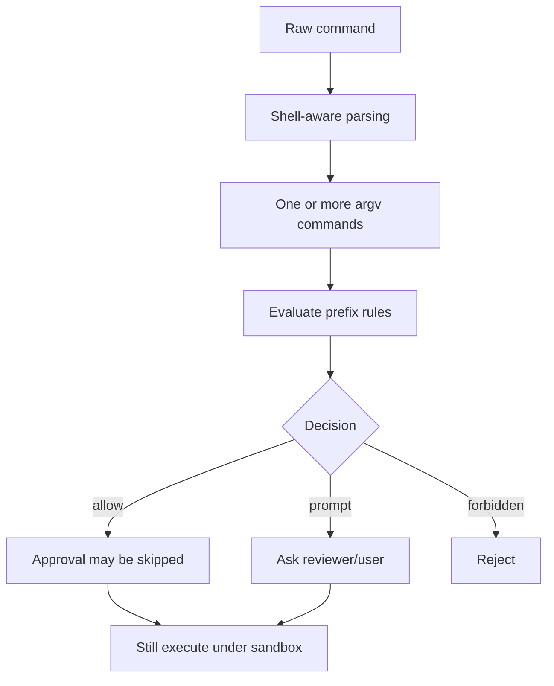

# 14｜执行策略 execpolicy：可审查的命令信任规则

> 源码基线：`upstream/main@283bc4cf011047314b4804c0f1ccd06e4f6a95c5`（2026-06-24）。

execpolicy 位于审批与沙箱之间：它根据命令 token 判断某类执行应自动允许、提示审批还是禁止。它不能替代 OS 沙箱，但能把团队信任边界写成可版本化、可测试的 Starlark 规则。

## 1. 三态决策

`codex-rs/execpolicy/src/decision.rs` 定义：

- `Allow`
- `Prompt`
- `Forbidden`

多条规则命中时按更严格的结果合成，避免一条宽松规则覆盖更具体的禁令。

## 2. `prefix_rule`

主要规则形态是：

```starlark
prefix_rule(
    pattern = ["git", "status"],
    decision = "allow",
)
```

它匹配 argv token 前缀，不是字符串包含。`["git", "status"]` 不等于任意含有这两个词的 shell 文本。



## 3. Shell 解析边界

Core 侧先将 command 转为可评估的 argv 列表，处理常见：

- 直接 argv；
- `bash -lc` / `sh -c`；
- PowerShell；
- command chain；
- heredoc 与复杂脚本。

复杂 shell 语法无法总被安全拆解。运行时会记录 `used_complex_parsing`；一旦使用保守 fallback，就不会自动建议持久化新规则，避免从不可靠解析推出过宽授权。

## 4. 未命中规则时

未命中并不等于一律提示。`render_decision_for_unmatched_command` 还结合：

- known-safe command heuristic；
- dangerous-command heuristic；
- approval policy；
- 当前沙箱能否约束该命令；
- 是否要求升级执行。

所以 execpolicy 是安全决策的一项输入，不是唯一真值。

## 5. Basename 与可执行文件身份

命令可能以 `git`、`/usr/bin/git` 或宿主映射路径出现。策略支持可执行名与路径归一化，但必须谨慎：只按 basename 匹配，可能将攻击者放在 PATH 前部的同名程序误当可信二进制。

规则需要在可移植性与可执行身份精度之间取舍。高风险命令更适合绑定明确路径或保持审批。

## 6. 自动 amendment

用户批准后，Codex 可以提议追加 allow prefix rule。流程为：

1. 从已解析命令或显式 `prefix_rule` 派生候选；
2. 排除复杂解析；
3. 排除已知过宽或危险前缀；
4. 在临时 policy 中验证候选不会批准所有命令；
5. 用户确认后写入规则文件；
6. 更新内存 policy。

`blocking_append_allow_prefix_rule` 负责以标准格式追加。网络规则也通过同一 amendment 模块写入。

## 7. 为什么需要禁止“过宽建议”

例如仅允许 `bash`、`python` 或 `env`，实际等价于允许执行几乎任意程序。候选规则会经过 banned prefix 与“是否放行所有测试命令”的检查。

自动规则的目标是减少重复审批，不是把一次同意升级为永久无界授权。

## 8. 分层加载

execpolicy 会受配置层与企业 requirements 影响。系统/管理层规则不能被低优先级用户配置简单抹除。加载错误会保留来源文件和行号，便于审计与修复。

## 9. 新旧实现

当前主线是：

- `codex-rs/execpolicy`
- `codex-rs/core/src/exec_policy.rs`

`execpolicy-legacy` 仍在仓库中承担兼容用途，但不应作为理解新功能的首选入口。

## 10. CLI 验证

规则应使用仓库提供的 check 路径验证，而不是只凭肉眼判断：

```bash
codex execpolicy check --pretty --rules ~/.codex/rules/default.rules -- git status
```

阅读源码：

```bash
rg -n "enum Decision|prefix_rule|add_prefix_rule" codex-rs/execpolicy/src
rg -n "commands_for_exec_policy|used_complex_parsing" codex-rs/core/src
rg -n "derive_requested_execpolicy_amendment|prefix_rule_would_approve_all" \
  codex-rs/core/src/exec_policy.rs
rg -n "blocking_append_allow_prefix_rule" codex-rs/execpolicy/src
```

execpolicy 的准确定位是：

> 它把重复的命令信任判断变成显式规则，但真正的资源强制边界仍由 approval、permission profile 与平台沙箱共同完成。
