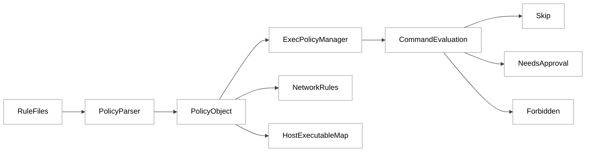
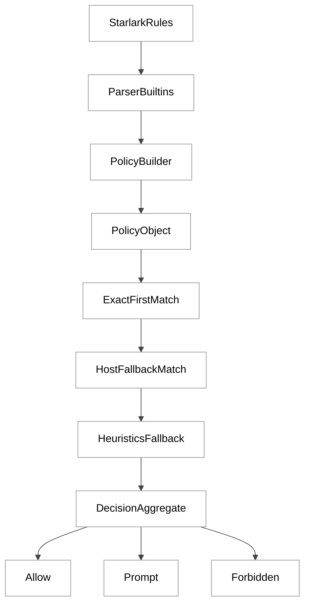
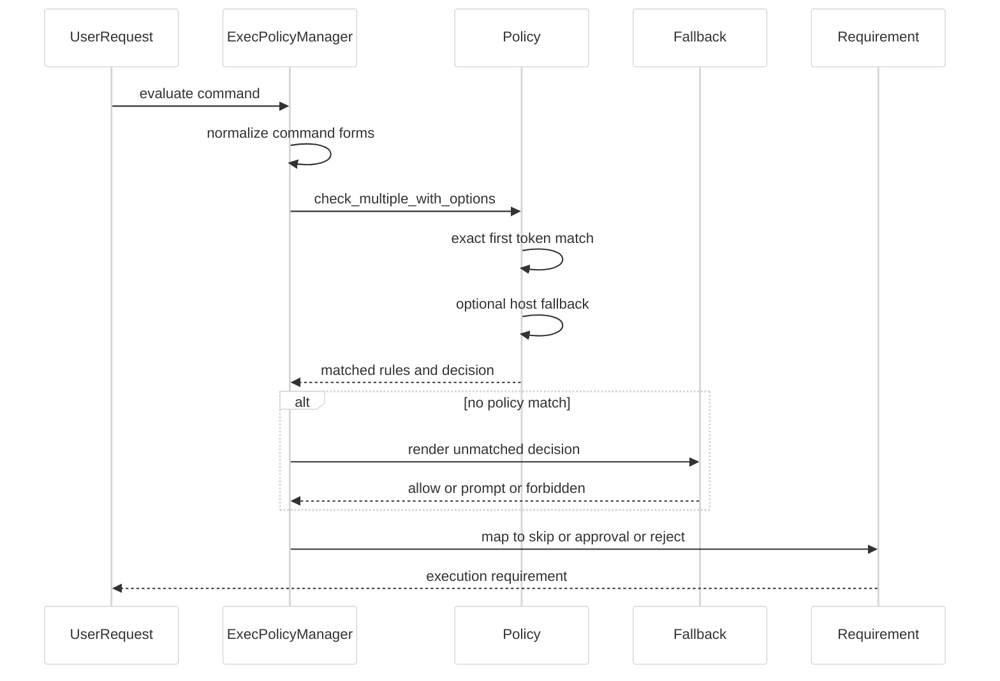
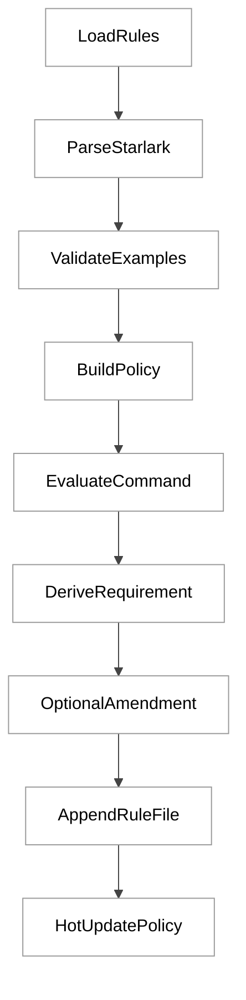
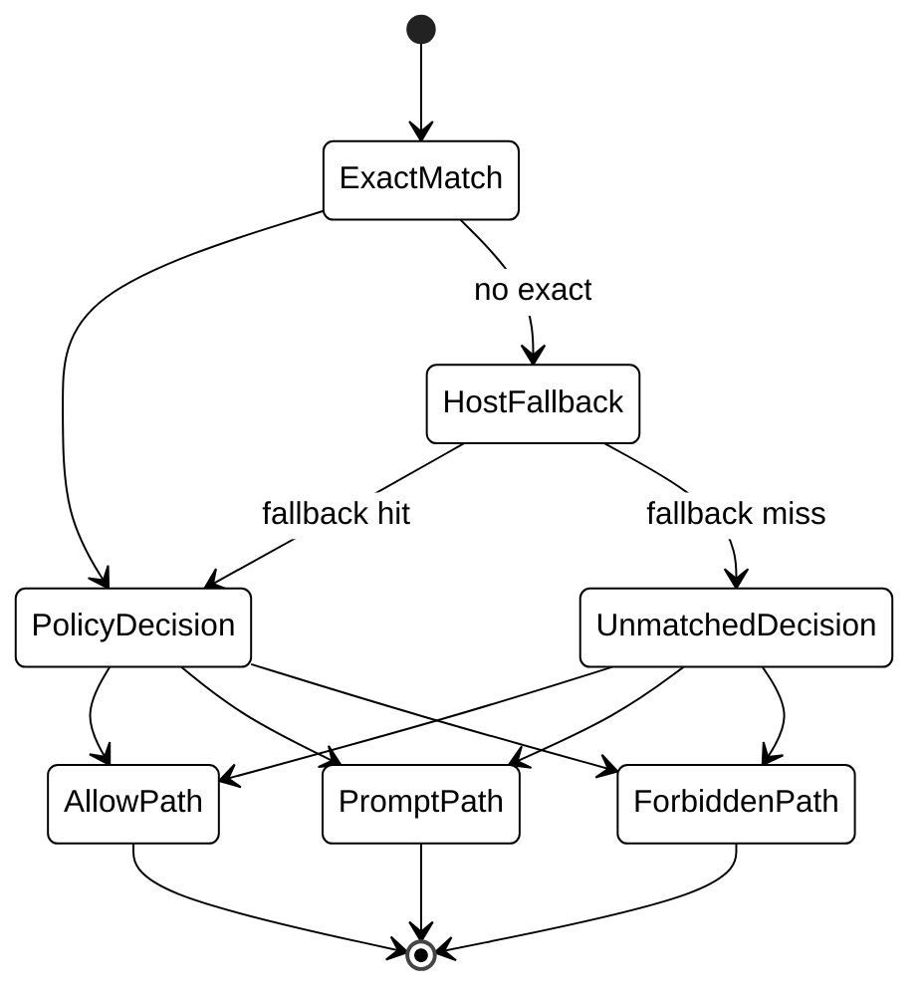
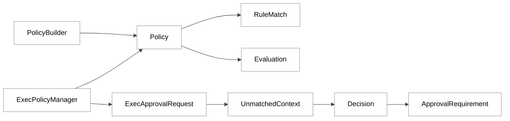

# 第 14 章：执行策略 Starlark execpolicy

## 引言

在 Codex 的安全体系里，`execpolicy` 不是“附加功能”，而是把“模型想执行什么”转换成“系统实际允许什么”的核心闸门。  
如果没有这个闸门，系统只能依赖沙箱和审批策略做粗粒度保护；有了它，团队才可能把“哪类命令可以自动放行、哪类必须人工确认、哪类永远禁止”写成可审查、可测试、可版本化的策略代码。

这一章聚焦 `codex-rs/execpolicy` 与 `codex-rs/core/src/exec_policy.rs` 的真实实现：  
- 规则如何用 Starlark 解析并装配成高效匹配结构；  
- 命令如何在“精确匹配 -> basename fallback -> 启发式兜底”链路中决策；  
- 决策如何和审批模式、沙箱权限、自动建议规则联动。  

按本章复核口径（2026-05-26，本地源码统计）：

- `codex-rs` 下 `Cargo.toml` 文件数：**120**  
- `codex-rs/Cargo.toml` workspace member 数：**113**  
- 本章核心 6 个文件总计：**2248 行**
  - `execpolicy/src/parser.rs`：472 行  
  - `execpolicy/src/policy.rs`：375 行  
  - `execpolicy/src/rule.rs`：306 行  
  - `execpolicy-legacy/src/lib.rs`：45 行  
  - `docs/execpolicy.md`：3 行  
  - `core/src/exec_policy.rs`：1047 行  
- `execpolicy` 新实现 `src/*.rs`：**10 文件 / 1800 行**  
- `execpolicy-legacy` `src/*.rs`：**14 文件 / 1821 行**  

这些数字说明一个事实：`execpolicy` 已经从“几条 if 规则”演化为独立子系统，并且还处于新旧并存阶段。

---

## 全网调研补充（近 12 个月）

### 1) 权威来源分布

按章节专属关键词检索：

- `Codex execpolicy Starlark`
- `codex execv_checker`

并对指定平台做定向补检（OpenAI 工程团队、Simon Willison、Latent Space、HackerNews、知乎、少数派、机器之心、CSDN、掘金）。

近 12 个月可作为高权重参考的来源，集中在以下几类：

1. **OpenAI 官方工程叙事**  
   - [Running Codex safely at OpenAI](https://openai.com/index/running-codex-safely/)  
   - [Unrolling the Codex agent loop](https://openai.com/index/unrolling-the-codex-agent-loop/)  
   - 开发者文档中的 execution policies / approvals 页面  
2. **OpenAI 官方仓库一手材料**  
   - `codex-rs/execpolicy/README.md`  
   - `core/src/exec_policy.rs` 及相关 PR（例如 host executable path mapping）  
3. **第三方高信号讨论**  
   - Simon Willison 对 Codex CLI 发布与命名语境的追踪  
   - HackerNews 在版本更新、agent loop、审批体验上的持续反馈  
   - Latent Space 对 Codex 系列模型与 agent workflow 的观察（偏宏观）  

中文平台（知乎、少数派、CSDN、掘金）在近 12 个月里主要是上手与配置文章，深度源码拆解稀少，且存在不少“概念转述式”二手内容。

### 2) 社区共识

跨平台能形成共识的点主要有：

1. `execpolicy` 是 Codex 安全体系里与 sandbox 并行的一层，而不是替代 sandbox。  
2. 规则表达的核心是 `prefix_rule`，决策三态是 `allow/prompt/forbidden`。  
3. 多规则命中时会走“更严格优先”语义。  
4. 规则校验工具 `codex execpolicy check` 是官方推荐调试入口。  

### 3) 主要分歧与常见误解

检索结果里最常见的分歧/误解有四类：

1. **误解 A：execpolicy 只影响“是否弹窗”，不影响执行路径**  
   实际上它直接影响是否 `Skip`、`NeedsApproval`、`Forbidden`，并参与 sandbox bypass 判断。  

2. **误解 B：规则匹配是“字符串包含”**  
   实际是 token 前缀匹配；并且第一 token 精确匹配优先，host basename fallback 需要显式选项。  

3. **误解 C：`host_executable` 是“必须配置项”**  
   代码语义是“可选收敛器”：配置后可把 basename fallback 限制到指定绝对路径；不配则更宽松。  

4. **误解 D：`execv_checker` 仍是当前主路径**  
   现在主路径在 `codex-rs/execpolicy` + `core/src/exec_policy.rs`，`execpolicy-legacy` 仍保留但不再代表主实现方向。  

### 4) 当前盲区（社区讨论不足）

真正有工程含量但社区讨论稀薄的点包括：

1. `commands_for_exec_policy()` 对 `bash -lc` 与 PowerShell 的“降维解析”策略。  
2. `used_complex_parsing` 如何影响自动建议规则（auto amendment）是否启用。  
3. `BANNED_PREFIX_SUGGESTIONS`（46 条）如何抑制过宽建议，避免“一条规则放飞全系统”。  
4. 规则文件加载的层级顺序与 requirements overlay 叠加语义。  
5. 错误消息如何从 Starlark 原始报错中恢复到“文件+行号”并做用户可读化。  

这些点决定了系统的可靠性与可运维性，但在社区文章里往往被“allow/prompt/forbidden 三态介绍”覆盖掉了。

---

### 全网平台逐项观察（按你指定渠道）

为了避免“泛泛而谈”，这里把你指定的平台逐项拆开，给出近 12 个月内与本章主题相关的有效信号。

#### 1) OpenAI 工程团队（最高权重）

OpenAI 官方文章在近 12 个月的价值主要有两类：

1. **安全叙事层**：强调 approvals、sandbox、rules 的防御纵深关系。  
2. **实现信号层**：通过博客与仓库 PR 暗示策略引擎正在从“规则匹配器”扩展到“治理基础设施”。  

值得注意的是，官方工程文通常不会展开到 `core/src/exec_policy.rs` 这种函数级细节，所以如果只读博客，读者会误以为 execpolicy 只是概念开关。  
本章源码实证恰好填补了这个缺口：`execpolicy` 实际上深度参与了命令解析、匹配、审批映射、自动建议和策略热更新。

#### 2) Simon Willison（高权重独立观察）

Simon 对 Codex 的跟踪强项是“语境澄清”与“命名去混淆”：  
- 区分 2021 Codex 模型与新一代 Codex CLI/云端产品；  
- 强调 harness 与执行环境的重要性，而不只盯模型能力。  

但针对 execpolicy 的函数级解读并不多，这也是正常的：Simon 的定位更偏产品与开发者生态观察。  
因此，如果读者把 Simon 文章当成“源码等价解释”，会出现信息层级错位。

#### 3) Latent Space（宏观高信号，微观低覆盖）

Latent Space 在过去 12 个月对 Codex 相关讨论更多聚焦：
- agentic coding 模型能力演进；
- 长任务、compaction、协作式工作流；
- 生态竞争格局。

这些内容对“为什么要做策略系统”有启发，但对“策略系统如何在源码里实现”覆盖有限。  
换言之，它更擅长回答“为什么有必要”，不直接回答“怎么做、做到什么程度”。

#### 4) HackerNews（高频体感反馈，适合抓痛点）

HN 价值在于高频、真实、噪音与信号并存。  
与本章最相关的讨论集中在三点：

1. 审批打断与效率的矛盾；  
2. 规则系统是否足够细粒度；  
3. 复杂命令（包装器、脚本、绝对路径）在规则下的行为可预测性。  

这些讨论与源码中的热点区域高度一致：  
`commands_for_exec_policy`、`render_decision_for_unmatched_command`、`derive_requested_execpolicy_amendment_from_prefix_rule`，都是“体感痛点”在代码里的直接映射。

#### 5) 知乎（样本多，但质量分化极大）

检索到的知乎内容大致分三类：
- 安装教程与配置经验；  
- 使用体感与故障排查；  
- 二次转述的“机制解释”。  

问题在第三类：部分文章会把其他产品的权限系统、工作流框架或通用 Agent 术语直接套在 Codex 上，导致明显错配。  
典型误解包括：
- 误称 Codex CLI 不使用 Starlark 规则；  
- 把 hooks 系统（其他产品语义）等同于 execpolicy；  
- 把 `approval_policy` 与 `execpolicy` 混成同一层。  

这类内容不能直接作为章节结论来源，但可作为“社区误解样本”。

#### 6) 少数派（实战经验价值高）

少数派近 12 个月内容里，和 execpolicy 相关的有效信号是“真实配置片段”：  
有作者会贴出 `~/.codex/rules/default.rules` 或对比其他工具权限配置。  
这种材料虽然不深讲源码，但对“真实用户怎么写规则”非常有参考价值。  

它揭示了一个现实：  
很多用户并不追求完美策略模型，而是追求“减少打断 + 保持基本安全”。  
这正是自动建议规则功能存在的业务动机。

#### 7) 机器之心（本主题覆盖稀薄）

在本次检索窗口内，机器之心对 execpolicy/Starlark 级主题几乎没有系统覆盖。  
这不是质量问题，而是媒体选题偏好导致：其重点通常在模型、论文、行业趋势，而非 CLI 工具链内部策略引擎。  
对研究者的启示是：该平台可用来补宏观背景，不适合作为本章核心证据源。

#### 8) CSDN（教程密集，二手转述风险高）

CSDN 与相关聚合站有大量“Codex 完整指南/权限管理/配置技巧”文章。  
其优点是可快速了解用户实际关注点：  
- 怎么减少审批弹窗；  
- 怎么配 sandbox 与 approval；  
- 怎么在 CI 里跑。  

但要警惕两个风险：
1. 同一篇内容往往混合多个产品语义；  
2. 部分“源码引用”并非来自官方仓库主线，或缺乏可复核上下文。  

因此，本章把这类内容主要用于“问题清单输入”，而不用作“实现结论证据”。

#### 9) 掘金（经验分享多，术语漂移明显）

掘金样本显示，作者经常把 Codex、Claude Code、OpenCode、iFlow 等产品并列讨论。  
这种横向讨论有价值，但容易造成术语漂移：  
比如把某产品的 hooks 事件模型迁移为另一产品的执行策略机制。  

从本章视角看，掘金最有价值的不是机制解释，而是“用户实际遇到哪些审批与执行摩擦”。  
这些摩擦大多可回到源码中的四个点：  
规则粒度、fallback 语义、建议规则边界、策略层级覆盖。

#### 10) 小结：为什么本章要“源码实证优先”

跨平台检索后的核心结论是：  
**社区对 execpolicy 的讨论很多，但大多停留在配置层；真正决定行为差异的细节，主要藏在源码函数里。**

因此本章坚持以下证据优先级：

1. 核心结论：以 `parser.rs/policy.rs/rule.rs/core/src/exec_policy.rs` 为主证据；  
2. 演进背景：以官方工程博客与仓库 PR/issue 为补充；  
3. 体感与误区：以 HN 与中文社区样本作为外围信号。  

这个优先级能最大限度避免“把社区叙事误当源码事实”的研究偏差。

---

## 七维分析

## 1. 本质是什么：把自然语言代理行为收敛成可验证执行边界

`execpolicy` 的本质是 **策略语言 + 匹配引擎 + 执行编排桥接** 三件套，而不是单独的规则文件解析器。

先看入口 API 的形态：`execpolicy` crate 对外 re-export 了规则解析、匹配、评估、规则追加能力（21 个公开 re-export），这说明它被当作通用组件使用，而不是 CLI 私有逻辑。

```rust
// /Users/hexiaonan/workspace/formless/refer/codex/codex-rs/execpolicy/src/lib.rs:10
pub use amend::AmendError;
pub use amend::blocking_append_allow_prefix_rule;
pub use amend::blocking_append_network_rule;
pub use decision::Decision;
pub use parser::PolicyParser;
pub use policy::Evaluation;
pub use policy::MatchOptions;
pub use policy::Policy;
pub use rule::RuleMatch;
```

然后看核心数据载体：`Policy` 并不只存“命令前缀规则”，还并列管理网络规则和 host executable 映射，反映它已经是“命令+网络”统一策略容器。

```rust
// /Users/hexiaonan/workspace/formless/refer/codex/codex-rs/execpolicy/src/policy.rs:28
pub struct Policy {
    rules_by_program: MultiMap<String, RuleRef>,
    network_rules: Vec<NetworkRule>,
    host_executables_by_name: HashMap<String, Arc<[AbsolutePathBuf]>>,
}
```

在 `core` 层，`ExecPolicyManager` 用 `ArcSwap<Policy>` 做热更新可见性，用 `Semaphore(1)` 串行化策略文件追加与内存更新，明确这是运行态组件。

```rust
// /Users/hexiaonan/workspace/formless/refer/codex/codex-rs/core/src/exec_policy.rs:236
pub(crate) struct ExecPolicyManager {
    policy: ArcSwap<Policy>,
    update_lock: Semaphore,
}
```

所以从架构定位看，`execpolicy` 在 Codex 里扮演的是“可编排执行边界内核”：  
它把 Starlark 规则转成可执行判定，再把判定结果映射到代理执行流程（跳过审批、发起审批、直接拒绝）。

<div style="background:#ffffff !important; background-color:#ffffff !important; padding:16px; border-radius:8px; margin:16px 0;" bgcolor="#ffffff">



</div>

---

## 2. 核心问题和痛点：安全、可用、可解释三角冲突

`execpolicy` 需要同时解决三个互相拉扯的问题：

1. **安全约束要足够硬**：高风险命令不能靠“模型自觉”。  
2. **开发体验不能崩**：安全规则不能把常规开发流全部变成人工审批。  
3. **结果要可解释**：团队要知道“为什么被允许/被拦截”，并可追溯到规则文本。  

### 痛点 A：命令形态复杂，不能只做字符串比较

同一意图可能出现为：
- `git status`
- `/usr/bin/git status`
- `bash -lc "git status && git diff"`
- PowerShell 命令串

如果匹配逻辑过于简单，误判会非常高。`core` 里专门做了命令降维：

```rust
// /Users/hexiaonan/workspace/formless/refer/codex/codex-rs/core/src/exec_policy.rs:772
fn commands_for_exec_policy(command: &[String]) -> ExecPolicyCommands {
    if let Some(commands) = parse_shell_lc_plain_commands(command)
        && !commands.is_empty()
    {
        return ExecPolicyCommands { ... };
    }
    ...
    if let Some(single_command) = parse_shell_lc_single_command_prefix(command) {
        return ExecPolicyCommands {
            commands: vec![single_command],
            used_complex_parsing: true,
            ...
        };
    }
    ExecPolicyCommands { commands: vec![command.to_vec()], ... }
}
```

### 痛点 B：安全默认与审批策略组合非常容易互相打架

未命中规则时，系统不能“盲 allow”也不能“一律 forbid”，而要结合：
- `approval_policy`
- 当前 sandbox 形态
- 命令是否在 safe list / dangerous list

`render_decision_for_unmatched_command()` 就是专门处理这个冲突面：

```rust
// /Users/hexiaonan/workspace/formless/refer/codex/codex-rs/core/src/exec_policy.rs:631
pub(crate) fn render_decision_for_unmatched_command(
    command: &[String],
    context: UnmatchedCommandContext<'_>,
) -> Decision {
    ...
    if command_is_dangerous || environment_lacks_sandbox_protections {
        return match approval_policy {
            AskForApproval::Never => { ... Decision::Forbidden ... }
            ... => Decision::Prompt,
        };
    }
    ...
}
```

### 痛点 C：规则建议自动化容易“建议过宽”

Codex 会在合适时机建议把某些命令前缀加入 allow 规则，但如果建议范围过宽，等于把安全边界打穿。  
因此 `core` 里硬编码了一组黑名单前缀（46 条）禁止自动建议，例如 `bash -lc`、`python -c`、`sudo`。

```rust
// /Users/hexiaonan/workspace/formless/refer/codex/codex-rs/core/src/exec_policy.rs:52
static BANNED_PREFIX_SUGGESTIONS: &[&[&str]] = &[
    &["python3"], &["python3", "-c"], &["bash", "-lc"], &["sh", "-c"],
    &["pwsh", "-Command"], &["sudo"], &["node", "-e"], ...
];
```

---

## 3. 解决思路与方案：Starlark 规则到执行判定的四段流水线

`execpolicy` 的主方案可以概括为四段：

1. **规则解析**：Starlark -> 内存 Policy  
2. **规则验证**：`match/not_match` 在加载时就执行  
3. **命令匹配**：精确匹配优先，必要时 basename fallback  
4. **策略编排**：`Decision` 映射到 `Skip/NeedsApproval/Forbidden`

### 3.1 规则解析：前缀 DSL + 内建函数

`PolicyParser::parse()` 用 Starlark AST + evaluator 执行内建函数，构建策略对象：

```rust
// /Users/hexiaonan/workspace/formless/refer/codex/codex-rs/execpolicy/src/parser.rs:57
pub fn parse(&mut self, policy_identifier: &str, policy_file_contents: &str) -> Result<()> {
    let mut dialect = Dialect::Extended.clone();
    dialect.enable_f_strings = true;
    let ast = AstModule::parse(policy_identifier, policy_file_contents.to_string(), &dialect)
        .map_err(Error::Starlark)?;
    let globals = GlobalsBuilder::standard().with(policy_builtins).build();
    ...
    eval.eval_module(ast, &globals).map_err(Error::Starlark)?;
    ...
}
```

规则内建函数不是一个，而是三类：
- `prefix_rule(...)`
- `network_rule(...)`
- `host_executable(...)`

```rust
// /Users/hexiaonan/workspace/formless/refer/codex/codex-rs/execpolicy/src/parser.rs:346
#[starlark_module]
fn policy_builtins(builder: &mut GlobalsBuilder) {
    fn prefix_rule<'v>(...) -> anyhow::Result<NoneType> { ... }
    fn network_rule<'v>(...) -> anyhow::Result<NoneType> { ... }
    fn host_executable<'v>(...) -> anyhow::Result<NoneType> { ... }
}
```

### 3.2 加载时验证：把规则样例当单元测试

`match/not_match` 并非文档注释，而是加载时校验逻辑的一部分。  
解析器里先记录 pending validations，再在 parse 结束后验证：

```rust
// /Users/hexiaonan/workspace/formless/refer/codex/codex-rs/execpolicy/src/parser.rs:132
fn validate_pending_examples_from(&self, start: usize) -> Result<()> {
    ...
    validate_not_match_examples(&policy, &validation.rules, &validation.not_matches)?;
    validate_match_examples(&policy, &validation.rules, &validation.matches)?;
    ...
}
```

这使规则文件具有“自校验属性”：错误在加载阶段暴露，而不是运行到线上才发现。

### 3.3 匹配算法：exact-first + 可选 basename fallback

匹配主路径在 `matches_for_command_with_options()`：

```rust
// /Users/hexiaonan/workspace/formless/refer/codex/codex-rs/execpolicy/src/policy.rs:268
pub fn matches_for_command_with_options(...) -> Vec<RuleMatch> {
    let matched_rules = self
        .match_exact_rules(cmd)
        .filter(|matched_rules| !matched_rules.is_empty())
        .or_else(|| {
            options.resolve_host_executables
                .then(|| self.match_host_executable_rules(cmd))
                .filter(|matched_rules| !matched_rules.is_empty())
        })
        .unwrap_or_default();
    ...
}
```

host fallback 的关键约束是：  
如果配置了 `host_executable(name=..., paths=[...])`，basename fallback 只对这些绝对路径生效。

```rust
// /Users/hexiaonan/workspace/formless/refer/codex/codex-rs/execpolicy/src/policy.rs:307
fn match_host_executable_rules(&self, cmd: &[String]) -> Vec<RuleMatch> {
    let Ok(program) = AbsolutePathBuf::try_from(first.clone()) else { return Vec::new(); };
    let Some(basename) = executable_path_lookup_key(program.as_path()) else { return Vec::new(); };
    ...
    if let Some(paths) = self.host_executables_by_name.get(&basename)
        && !paths.iter().any(|path| path == &program)
    {
        return Vec::new();
    }
    ...
}
```

### 3.4 决策聚合：严格度优先

`Evaluation::from_matches()` 通过 `max()` 选最严格决策；  
`Decision` 定义顺序是 `Allow < Prompt < Forbidden`（依赖 `Ord` 派生）。

```rust
// /Users/hexiaonan/workspace/formless/refer/codex/codex-rs/execpolicy/src/decision.rs:7
#[derive(Clone, Copy, Debug, Eq, PartialEq, Ord, PartialOrd, Serialize, Deserialize)]
pub enum Decision {
    Allow,
    Prompt,
    Forbidden,
}
```

```rust
// /Users/hexiaonan/workspace/formless/refer/codex/codex-rs/execpolicy/src/policy.rs:365
fn from_matches(matched_rules: Vec<RuleMatch>) -> Self {
    let decision = matched_rules.iter().map(RuleMatch::decision).max();
    ...
}
```

<div style="background:#ffffff !important; background-color:#ffffff !important; padding:16px; border-radius:8px; margin:16px 0;" bgcolor="#ffffff">



</div>

<div style="background:#ffffff !important; background-color:#ffffff !important; padding:16px; border-radius:8px; margin:16px 0;" bgcolor="#ffffff">



</div>

---

## 4. 实现细节关键点：关键代码路径与关键数据流

这一节按“加载期 -> 匹配期 -> 执行期 -> 更新期”顺序展开。

### 4.1 加载期：多配置层 `.rules` 合并 + requirements 叠加

`core` 会按配置层从低到高收集 `rules/*.rules`，再顺序 parse，最后叠加 requirements policy：

```rust
// /Users/hexiaonan/workspace/formless/refer/codex/codex-rs/core/src/exec_policy.rs:572
pub async fn load_exec_policy(config_stack: &ConfigLayerStack) -> Result<Policy, ExecPolicyError> {
    let mut policy_paths = Vec::new();
    for layer in config_stack.get_layers(ConfigLayerStackOrdering::LowestPrecedenceFirst, false) {
        ...
        let policy_dir = config_folder.join(RULES_DIR_NAME);
        let layer_policy_paths = collect_policy_files(&policy_dir).await?;
        policy_paths.extend(layer_policy_paths);
    }
    ...
    let policy = parser.build();
    ...
    Ok(policy.merge_overlay(requirements_policy.as_ref()))
}
```

`collect_policy_files()` 明确只接收 `.rules` 扩展名并排序，保证加载稳定性：

```rust
// /Users/hexiaonan/workspace/formless/refer/codex/codex-rs/core/src/exec_policy.rs:993
async fn collect_policy_files(dir: impl AsRef<Path>) -> Result<Vec<PathBuf>, ExecPolicyError> {
    ...
    if path.extension().and_then(|ext| ext.to_str()).is_some_and(|ext| ext == RULE_EXTENSION)
        && file_type.is_file()
    {
        policy_paths.push(path);
    }
    policy_paths.sort();
    Ok(policy_paths)
}
```

### 4.2 匹配期：规则命中与启发式兜底的边界

`matches_for_command_with_options()` 的设计细节非常关键：  
- 有规则命中时，返回真实规则命中；  
- 没命中且提供 fallback 时，才返回 `HeuristicsRuleMatch`；  
- 这让系统可以区分“策略规则命中”与“启发式兜底命中”。

`is_policy_match()` 在 `core` 里就专门做了这个分离：

```rust
// /Users/hexiaonan/workspace/formless/refer/codex/codex-rs/core/src/exec_policy.rs:162
fn is_policy_match(rule_match: &RuleMatch) -> bool {
    match rule_match {
        RuleMatch::PrefixRuleMatch { .. } => true,
        RuleMatch::HeuristicsRuleMatch { .. } => false,
    }
}
```

这一个小函数直接影响：
- 是否允许自动建议新规则；  
- 是否认为“已经被显式策略覆盖”；  
- 是否给出 policy 驱动的提示文案。

### 4.3 执行期：`Decision` 到 `ExecApprovalRequirement` 的映射

`create_exec_approval_requirement_for_command()` 是执行策略与工具系统的接缝点。  
它做了 4 个关键动作：

1. 解析命令形态（含 shell wrapper）  
2. 执行策略评估（带 host resolution）  
3. 尝试导出建议规则  
4. 映射到 `Forbidden/NeedsApproval/Skip`

```rust
// /Users/hexiaonan/workspace/formless/refer/codex/codex-rs/core/src/exec_policy.rs:272
pub(crate) async fn create_exec_approval_requirement_for_command(...) -> ExecApprovalRequirement {
    ...
    let evaluation = exec_policy.check_multiple_with_options(commands.iter(), &exec_policy_fallback, &match_options);
    ...
    match evaluation.decision {
        Decision::Forbidden => ExecApprovalRequirement::Forbidden { ... },
        Decision::Prompt => ExecApprovalRequirement::NeedsApproval { ... },
        Decision::Allow => ExecApprovalRequirement::Skip { ... },
    }
}
```

一个很容易被忽略的点是 `Skip.bypass_sandbox` 不是简单 `decision == allow`，而是 **所有命令段都必须被显式 allow 规则命中** 才能 bypass sandbox：

```rust
// /Users/hexiaonan/workspace/formless/refer/codex/codex-rs/core/src/exec_policy.rs:357
Decision::Allow => ExecApprovalRequirement::Skip {
    bypass_sandbox: commands.iter().all(|command| {
        exec_policy.matches_for_command_with_options(command, None, &match_options)
            .iter()
            .any(|rule_match| is_policy_match(rule_match) && rule_match.decision() == Decision::Allow)
    }),
    ...
}
```

### 4.4 自动建议规则：保守原则优先

当用户发起 `prefix_rule` 请求时，系统并不会无脑建议。  
`derive_requested_execpolicy_amendment_from_prefix_rule()` 至少做四道闸：

1. 前缀不能为空  
2. 黑名单前缀不得建议（46 条）  
3. 如果已有 policy 命中，不重复建议  
4. 先模拟把规则加进去，确认所有命令段都能变成 Allow

```rust
// /Users/hexiaonan/workspace/formless/refer/codex/codex-rs/core/src/exec_policy.rs:864
fn derive_requested_execpolicy_amendment_from_prefix_rule(...) -> Option<ExecPolicyAmendment> {
    let prefix_rule = prefix_rule?;
    if prefix_rule.is_empty() { return None; }
    if BANNED_PREFIX_SUGGESTIONS.iter().any(...) { return None; }
    if matched_rules.iter().any(is_policy_match) { return None; }
    ...
    if prefix_rule_would_approve_all_commands(...) { Some(amendment) } else { None }
}
```

这套逻辑的核心目标不是“多给建议”，而是“避免错误放权”。

### 4.5 报错可读性：从 Starlark 异常回退到人类可定位文本

生产里最常见的问题不是匹配，而是规则写错。  
`format_exec_policy_error_with_source()` 会尽量拼接出 `path:line: message` 形式，并在有定位时加“around line N”提示。

```rust
// /Users/hexiaonan/workspace/formless/refer/codex/codex-rs/core/src/exec_policy.rs:529
pub fn format_exec_policy_error_with_source(error: &ExecPolicyError) -> String {
    match error {
        ExecPolicyError::ParsePolicy { path, source } => {
            ...
            match location {
                Some((path, line)) => format!("{}:{}: {} (problem is on or around line {})", ...),
                None => format!("{path}: {message}"),
            }
        }
        _ => error.to_string(),
    }
}
```

### 4.6 新旧实现分层：legacy 仍在，但主路径已迁移

`execpolicy-legacy` 的 `lib.rs` 明确保留了 `execv_checker`、`arg_matcher` 等旧实现模块：

```rust
// /Users/hexiaonan/workspace/formless/refer/codex/codex-rs/execpolicy-legacy/src/lib.rs:6
mod arg_matcher;
mod arg_resolver;
mod execv_checker;
mod policy_parser;
...
pub use execv_checker::ExecvChecker;
```

`ExecvChecker` 的思路是“按参数类型判定文件路径可读写边界”，偏静态参数语义检查：

```rust
// /Users/hexiaonan/workspace/formless/refer/codex/codex-rs/execpolicy-legacy/src/execv_checker.rs:44
pub fn check(
    &self,
    valid_exec: ValidExec,
    cwd: &Option<OsString>,
    readable_folders: &[PathBuf],
    writeable_folders: &[PathBuf],
) -> Result<String> {
    ...
    match arg_type {
        ArgType::ReadableFile => { ... }
        ArgType::WriteableFile => { ... }
        ...
    }
}
```

而新实现主路径已经转向前缀规则 + runtime policy evaluation；二者功能重叠但抽象层明显不同。

### 4.7 文档现状：官方仓库内文档很薄

`docs/execpolicy.md` 当前几乎只做跳转：

```markdown
// /Users/hexiaonan/workspace/formless/refer/codex/docs/execpolicy.md:1
# Execution policy

For an overview of execution policy rules, see [this documentation](https://developers.openai.com/codex/exec-policy).
```

这解释了为什么社区常见“概念理解有、源码机制缺”的断层。

<div style="background:#ffffff !important; background-color:#ffffff !important; padding:16px; border-radius:8px; margin:16px 0;" bgcolor="#ffffff">



</div>

<div style="background:#ffffff !important; background-color:#ffffff !important; padding:16px; border-radius:8px; margin:16px 0;" bgcolor="#ffffff">



</div>

---

### 4.8 解析器内部机制：为什么它不是“读文件 + split 字符串”

很多团队第一次看策略系统时会低估解析器复杂度，觉得“反正就是几条规则”。  
但 `parser.rs` 里的逻辑说明它至少在做三层工作：  

1. **语法解析**（Starlark AST）  
2. **结构归一化**（pattern token、example token）  
3. **语义校验**（rule shape、example validity、location）  

其中 `parse_pattern_token()` 直接决定了“ alternatives 写法到底有没有语义价值”：

```rust
// /Users/hexiaonan/workspace/formless/refer/codex/codex-rs/execpolicy/src/parser.rs:183
fn parse_pattern_token<'v>(value: Value<'v>) -> Result<PatternToken> {
    if let Some(s) = value.unpack_str() {
        Ok(PatternToken::Single(s.to_string()))
    } else if let Some(list) = ListRef::from_value(value) {
        ...
        match tokens.as_slice() {
            [] => Err(Error::InvalidPattern("pattern alternatives cannot be empty".to_string())),
            [single] => Ok(PatternToken::Single(single.clone())),
            _ => Ok(PatternToken::Alts(tokens)),
        }
    } else {
        Err(Error::InvalidPattern(...))
    }
}
```

这个分支很关键：  
- 空 alternatives 被拒绝；  
- 只有一个元素时自动退化成 `Single`；  
- 两个及以上才形成 `Alts`。  

这让规则表达更稳，不会出现“看起来像 alternatives，实际上和单值等价”的无效复杂写法。

同样，样例解析也不是“随便切空格”。字符串样例走 `shlex`，列表样例要求全是 string，空样例会报错：

```rust
// /Users/hexiaonan/workspace/formless/refer/codex/codex-rs/execpolicy/src/parser.rs:296
fn parse_string_example(raw: &str) -> Result<Vec<String>> {
    let tokens = shlex::split(raw).ok_or_else(|| {
        Error::InvalidExample("example string has invalid shell syntax".to_string())
    })?;
    if tokens.is_empty() {
        Err(Error::InvalidExample("example cannot be an empty string".to_string()))
    } else {
        Ok(tokens)
    }
}
```

因此，`match/not_match` 不是“文档演示字段”，而是真正可失败、可阻断加载流程的执行校验点。

### 4.9 host executable 约束：一个容易被忽略的安全收敛器

社区文章经常把 `host_executable` 说成“可选增强”，这句话只说对了一半。  
它确实可选，但一旦配置，它会显著收紧绝对路径命令的 fallback 匹配面，降低路径劫持类风险。

解析器在写入 host 映射前做了两道硬校验：

1. `name` 必须是 bare executable name（不能带路径）  
2. `paths` 必须是绝对路径，且 basename 必须等于 `name`

```rust
// /Users/hexiaonan/workspace/formless/refer/codex/codex-rs/execpolicy/src/parser.rs:233
fn validate_host_executable_name(name: &str) -> Result<()> {
    if name.is_empty() { ... }
    let path = Path::new(name);
    if path.components().count() != 1
        || path.file_name().and_then(|value| value.to_str()) != Some(name)
    {
        return Err(Error::InvalidRule(...));
    }
    Ok(())
}
```

```rust
// /Users/hexiaonan/workspace/formless/refer/codex/codex-rs/execpolicy/src/parser.rs:436
fn host_executable<'v>(name: &'v str, paths: UnpackList<Value<'v>>, ...) -> anyhow::Result<NoneType> {
    validate_host_executable_name(name)?;
    ...
    let path = parse_literal_absolute_path(raw)?;
    let Some(path_name) = executable_path_lookup_key(path.as_path()) else { ... };
    if path_name != executable_lookup_key(name) { ... }
    ...
}
```

这个设计的工程意义在于：  
如果组织策略明确了“允许哪几个 `git` 可执行路径”，那么即便系统上存在同名可执行文件，basename fallback 也不会盲目放行。

### 4.10 network rule 归一化：规则系统已经不止命令前缀

虽然本章主题是执行策略，但新实现里网络规则已经被并入同一个策略容器，且 host 归一化逻辑非常严格。

`normalize_network_rule_host()` 的校验点包括：
- 不能为空；  
- 不能带 scheme/path/query/fragment；  
- 支持 bracketed IPv6 但要校验端口格式；  
- 去尾点并转小写；  
- 禁止 wildcard 与空白字符。  

```rust
// /Users/hexiaonan/workspace/formless/refer/codex/codex-rs/execpolicy/src/rule.rs:156
pub(crate) fn normalize_network_rule_host(raw: &str) -> Result<String> {
    let mut host = raw.trim();
    if host.is_empty() { ... }
    if host.contains("://") || host.contains('/') || host.contains('?') || host.contains('#') { ... }
    ...
    let normalized = host.trim_end_matches('.').trim().to_ascii_lowercase();
    if normalized.contains('*') {
        return Err(Error::InvalidRule(
            "network_rule host must be a specific host; wildcards are not allowed".to_string(),
        ));
    }
    ...
}
```

再配合 `Policy::compiled_network_domains()` 的 allow/deny 编译逻辑，策略系统可输出给下游网络控制组件的明确域集合。

```rust
// /Users/hexiaonan/workspace/formless/refer/codex/codex-rs/execpolicy/src/policy.rs:167
pub fn compiled_network_domains(&self) -> (Vec<String>, Vec<String>) {
    let mut allowed = Vec::new();
    let mut denied = Vec::new();
    for rule in &self.network_rules {
        match rule.decision {
            Decision::Allow => { ... }
            Decision::Forbidden => { ... }
            Decision::Prompt => {}
        }
    }
    (allowed, denied)
}
```

这也是一个典型“社区盲区”：大家都在讲命令 allowlist，较少讲“同一套策略对象里还承载了网络决策”。

### 4.11 规则文件自动追加：并发、幂等、文件锁三件事

很多人把“自动建议规则”理解为 UI 行为，其实它在底层是严格的文件写入流程。  
`amend.rs` 明确写了这条路径需要 blocking I/O + advisory lock，且建议在 async 环境用 `spawn_blocking`。

```rust
// /Users/hexiaonan/workspace/formless/refer/codex/codex-rs/execpolicy/src/amend.rs:63
/// Note this thread uses advisory file locking and performs blocking I/O, so it should be used with
/// [`tokio::task::spawn_blocking`] when called from an async context.
pub fn blocking_append_allow_prefix_rule(...) -> Result<(), AmendError> { ... }
```

真正写入前，会先读完整文件判断“这一行是否已存在”，避免重复追加：

```rust
// /Users/hexiaonan/workspace/formless/refer/codex/codex-rs/execpolicy/src/amend.rs:147
fn append_locked_line(policy_path: &Path, line: &str) -> Result<(), AmendError> {
    let mut file = OpenOptions::new().create(true).read(true).append(true).open(policy_path)?;
    file.lock()?;
    ...
    if contents.lines().any(|existing| existing == line) {
        return Ok(());
    }
    ...
    file.write_all(format!("{line}\n").as_bytes())?;
    Ok(())
}
```

在 `core` 侧，这套写入又被 `ExecPolicyManager.update_lock` 串行化，避免并发更新相互覆盖：

```rust
// /Users/hexiaonan/workspace/formless/refer/codex/codex-rs/core/src/exec_policy.rs:381
pub(crate) async fn append_amendment_and_update(...) -> Result<(), ExecPolicyUpdateError> {
    let _update_guard = self.update_lock.acquire().await ...?;
    ...
    spawn_blocking(...blocking_append_allow_prefix_rule...).await ...?;
    ...
    self.policy.store(Arc::new(updated_policy));
    Ok(())
}
```

这是典型“从建议到落盘”的工程闭环：  
**建议逻辑保守** + **文件写入幂等** + **内存策略热更新**。

### 4.12 提示信息生成：用户可解释性的最后一公里

`prompt` 和 `forbidden` 的用户提示并不是固定文案，而是从“最具体命中的规则”中提取 justification。  
这让策略文件既是执行规范，也是用户沟通文本源。

```rust
// /Users/hexiaonan/workspace/formless/refer/codex/codex-rs/core/src/exec_policy.rs:928
fn derive_prompt_reason(command_args: &[String], evaluation: &Evaluation) -> Option<String> {
    ...
    let most_specific_prompt = evaluation.matched_rules.iter()
        .filter_map(|rule_match| match rule_match {
            RuleMatch::PrefixRuleMatch { matched_prefix, decision: Decision::Prompt, justification, .. } => Some((matched_prefix.len(), justification.as_deref())),
            _ => None,
        })
        .max_by_key(|(matched_prefix_len, _)| *matched_prefix_len);
    ...
}
```

```rust
// /Users/hexiaonan/workspace/formless/refer/codex/codex-rs/core/src/exec_policy.rs:964
fn derive_forbidden_reason(command_args: &[String], evaluation: &Evaluation) -> String {
    ...
    match most_specific_forbidden {
        Some((_matched_prefix, Some(justification))) => format!("`{command}` rejected: {justification}"),
        Some((matched_prefix, None)) => {
            let prefix = render_shlex_command(matched_prefix);
            format!("`{command}` rejected: policy forbids commands starting with `{prefix}`")
        }
        None => format!("`{command}` rejected: blocked by policy"),
    }
}
```

这部分看似“文案层”，但它直接影响策略可维护性：  
如果团队在规则里写了具体替代建议（比如“请改用只读命令”），系统就能把治理意图透明传递给执行者。

### 4.13 CLI 检查命令：策略调试的最小闭环

`execpolicycheck.rs` 给了一个非常务实的能力：离线检查规则命中，不必先跑完整 agent 回合。  
参数模型包含：
- 可重复 `--rules`  
- `--pretty`  
- `--resolve-host-executables`  
- trailing command tokens

```rust
// /Users/hexiaonan/workspace/formless/refer/codex/codex-rs/execpolicy/src/execpolicycheck.rs:15
#[derive(Debug, Parser, Clone)]
pub struct ExecPolicyCheckCommand {
    #[arg(short = 'r', long = "rules", value_name = "PATH", required = true)]
    pub rules: Vec<PathBuf>,
    #[arg(long)]
    pub pretty: bool,
    #[arg(long)]
    pub resolve_host_executables: bool,
    #[arg(value_name = "COMMAND", required = true, trailing_var_arg = true, allow_hyphen_values = true)]
    pub command: Vec<String>,
}
```

输出 JSON 的时候，如果没有任何规则命中，`decision` 会被省略，仅保留空的 `matchedRules`。  
这与 README 的输出约定保持一致，也方便工具链判定“无策略命中”。

### 4.14 定量复盘：这个子系统到底有多“重”

仅从本章核心路径就能看出 `execpolicy` 的工程密度：

1. `core/src/exec_policy.rs` 1047 行，承担 **配置加载、决策编排、错误可读化、规则增量更新**。  
2. `execpolicy/src/parser.rs` 472 行，承担 **Starlark 内建函数、样例验证、error location 绑定**。  
3. `execpolicy/src/policy.rs` 375 行，承担 **匹配引擎与决策聚合**。  
4. `execpolicy/src/rule.rs` 306 行，承担 **模式匹配模型、网络 host 归一化、样例校验**。  
5. 自动建议黑名单前缀数量：**46**。  
6. `ExecApprovalRequest` 字段数：**7**；`UnmatchedCommandContext` 字段数：**7**；`PolicyBuilder` 字段数：**4**。  

这些数字对应的不是“实现冗长”，而是“边界明确”：  
每一层都在试图把不可控因素（用户命令形态、平台差异、策略冲突）压缩成稳定决策。

<div style="background:#ffffff !important; background-color:#ffffff !important; padding:16px; border-radius:8px; margin:16px 0;" bgcolor="#ffffff">



</div>

---

## 5. 易错点和注意事项：高频陷阱与边界条件

这一节不只列“错误清单”，更给出每类错误为什么会发生，以及怎样在团队里避免反复踩坑。

### 5.1 解析期陷阱：规则写法看似正确，加载时直接失败

**陷阱 1：把 `decision="deny"` 写在 `prefix_rule` 上**  
在新实现里，`Decision::parse()` 只接受 `allow/prompt/forbidden`；`deny` 只在 `network_rule` 的解析分支里做了映射。  
这意味着很多从旧文档抄来的配置会在解析期直接失败。

```rust
// /Users/hexiaonan/workspace/formless/refer/codex/codex-rs/execpolicy/src/decision.rs:19
pub fn parse(raw: &str) -> Result<Self> {
    match raw {
        "allow" => Ok(Self::Allow),
        "prompt" => Ok(Self::Prompt),
        "forbidden" => Ok(Self::Forbidden),
        other => Err(Error::InvalidDecision(other.to_string())),
    }
}
```

```rust
// /Users/hexiaonan/workspace/formless/refer/codex/codex-rs/execpolicy/src/parser.rs:252
fn parse_network_rule_decision(raw: &str) -> Result<Decision> {
    match raw {
        "deny" => Ok(Decision::Forbidden),
        other => Decision::parse(other),
    }
}
```

**陷阱 2：`justification` 留空字符串**  
规则作者常把 justification 先占位成 `""`，但 parser 会直接拒绝空白 justification。  
这不是风格问题，而是语义约束。

```rust
// /Users/hexiaonan/workspace/formless/refer/codex/codex-rs/execpolicy/src/parser.rs:361
let justification = match justification {
    Some(raw) if raw.trim().is_empty() => {
        return Err(Error::InvalidRule("justification cannot be empty".to_string()).into());
    }
    Some(raw) => Some(raw.to_string()),
    None => None,
};
```

**陷阱 3：误把 `match/not_match` 当注释样例**  
只要写进规则文件，就会在加载时校验；任何失败都会阻断该策略加载。  
这要求团队把样例维护当成测试资产，而不是文档资产。

### 5.2 匹配期陷阱：规则命中逻辑与直觉不一致

**陷阱 4：把规则当子串匹配，不是前缀 token 匹配**  
`PrefixPattern::matches_prefix()` 明确按 token 位序比较，不是全文模糊匹配。

```rust
// /Users/hexiaonan/workspace/formless/refer/codex/codex-rs/execpolicy/src/rule.rs:46
pub fn matches_prefix(&self, cmd: &[String]) -> Option<Vec<String>> {
    let pattern_length = self.rest.len() + 1;
    if cmd.len() < pattern_length || cmd[0] != self.first.as_ref() {
        return None;
    }
    for (pattern_token, cmd_token) in self.rest.iter().zip(&cmd[1..pattern_length]) {
        if !pattern_token.matches(cmd_token) {
            return None;
        }
    }
    Some(cmd[..pattern_length].to_vec())
}
```

**陷阱 5：以为 absolute path 会自动匹配 basename 规则**  
不是默认行为，需要 `resolve_host_executables` 明确开启；并且可能被 host path allowlist 再次收缩。

**陷阱 6：误解“多规则命中时谁赢”**  
并不是“第一个命中的赢”，而是按决策严格度聚合。  
这会导致“你新增了一个 allow 规则，但仍然被 forbidden 拦截”的典型案例。

### 5.3 执行编排期陷阱：`allow` 不等于“无条件执行”

**陷阱 7：把 `Decision::Allow` 当成无条件 bypass sandbox**  
`Skip.bypass_sandbox` 要求更严格：每个命令段都要有显式 allow policy 命中。  
只靠 heuristics allow 不够。

**陷阱 8：忽略 `used_complex_parsing` 的副作用**  
复杂解析场景下会关闭某些自动 amendment 逻辑，防止基于不稳定解析结果扩权。  
这意味着同一条用户命令在不同解析路径下，建议行为可能不同，属于“有意设计”。

**陷阱 9：把 policy prompt 与 sandbox prompt 混为一谈**  
`prompt_is_rejected_by_policy()` 明确区分规则提示与沙箱提示，granular 配置下二者可独立拒绝。

```rust
// /Users/hexiaonan/workspace/formless/refer/codex/codex-rs/core/src/exec_policy.rs:175
pub(crate) fn prompt_is_rejected_by_policy(
    approval_policy: AskForApproval,
    prompt_is_rule: bool,
) -> Option<&'static str> {
    ...
}
```

### 5.4 运维期陷阱：规则更新与观察性不足

**陷阱 10：并发会话同时追加规则导致互相覆盖**  
`ExecPolicyManager` 里用了 `Semaphore` 串行化更新，这不是可有可无，而是避免竞态破坏。  

**陷阱 11：只看 parse error 文本，不看行号修复提示**  
`format_exec_policy_error_with_source()` 已尽量还原路径与行号，很多团队没有把这条输出纳入 CI 日志解析。  

**陷阱 12：把 legacy 错误经验直接套到新实现**  
`execv_checker` 风格错误（参数类型/路径校验）与新实现错误（前缀匹配/策略冲突）不是同一语义层。

### 5.5 团队落地建议：把规则开发流程工程化

基于上述陷阱，建议采用以下四步流程：

1. **策略分层**：基础安全规则、项目规则、临时实验规则分文件管理。  
2. **样例前置**：高风险规则必须同时写 `match/not_match`。  
3. **CI 检查**：每次规则变更跑 `codex execpolicy check` 覆盖关键命令集。  
4. **审计闭环**：解析错误和高频 prompt reason 做定期聚类，反向改进规则。  

如果缺少这四步，`execpolicy` 会退化成“只在事故后才被想起的文本配置”，无法发挥其治理价值。

---

## 6. 竞品对比：Codex 与同类执行策略实现

这一节重点比较“命令执行边界控制”维度，而不是模型质量。

| 维度 | Codex execpolicy | Claude Code | OpenCode | Aider | Goose | Continue |
|---|---|---|---|---|---|---|
| 规则表达 | Starlark `prefix_rule/network_rule/host_executable` | Hook 回调与 permissionDecision | JSON 权限规则 + 通配匹配 | 以用户手动 `/run` 为主 | mode + tool permission | allow/ask/exclude + mode |
| 决策粒度 | 命令 token 前缀 + host path + unmatched heuristics | 工具调用级（可 allow/deny/ask/defer） | tool + pattern，last match wins | 无内建细粒度 sandbox policy | 全局模式 + 工具级覆盖 | 工具级 + 动态 policy 扩展 |
| 规则可测试性 | `match/not_match` 加载即校验 | 依赖 hook 逻辑与测试 | 配置规则匹配为主 | 主要靠手动流程控制 | 配置驱动 | CLI/TUI 权限配置驱动 |
| 策略与执行耦合 | 深度耦合 `ExecApprovalRequirement` 与 sandbox bypass | 通过 hook 和 permission 系统耦合 | 通过 permission 引擎耦合 | 较弱耦合 | 中等耦合 | 中等耦合 |
| 默认安全姿态 | 明确 allow/prompt/forbidden + unmatched fallback | deny/ask 优先取决于 hook 与规则 | 可配置，常见默认偏宽 | 依赖用户环境隔离 | mode 可切换 | mode 强覆盖 |

### 6.1 Claude Code：高可编排 Hook，低门槛但高治理复杂度

Claude Code 通过 `PreToolUse` / `PermissionRequest` 等 hook 提供 allow/deny/ask/defer 控制。  
优点是灵活：你可以在 hook 里做上下文化判断、甚至动态改写输入。  
代价是策略语义更多散落在脚本与 SDK 回调中，团队审计时不如 DSL 规则集中。

从工程治理角度看，Codex 的优势在于：
- 策略意图更接近声明式文本（规则可 code review）；  
- 规则示例可在加载时强制验证。  

Claude 的优势在于：
- 更容易按业务上下文做细粒度动态策略。  

结论：如果团队偏“平台治理”，Codex 语义更稳；如果偏“业务脚本化控制”，Claude hook 更灵活。

### 6.2 OpenCode：权限配置直观，但语义层级相对扁平

OpenCode 的 permission 设计非常直观：`allow/ask/deny` + pattern 匹配，last match wins。  
这对个人开发者很友好，学习成本低。  
但在复杂组织策略场景里，纯 pattern 覆盖容易出现“局部例外叠加过多，最终难以解释”的问题。

Codex 在这方面的差异是：
- 通过 `RuleMatch` 区分 policy vs heuristics；
- 通过 `derive_prompt_reason` / `derive_forbidden_reason` 对解释链路做系统化输出；
- 通过 host executable / network rule 引入更明确的安全边界对象。  

### 6.3 Aider：人工审批思维，策略引擎能力弱

Aider 的典型安全模型更接近“人工控制触发命令”，如 `/run`、`/test`。  
这在单人开发里是可行的，但在 agent 自主性增强、批量任务执行、企业审计场景下会遇到瓶颈：  
策略不可版本化、行为解释依赖人工习惯、很难形成统一治理基线。

与 Codex 对比，Aider 的主要短板不是功能少，而是“规则系统不是一等公民”。

### 6.4 Goose：模式治理成熟，命令语义治理仍偏工具层

Goose 提供 `auto/approve/smart_approve` 与工具级权限覆盖，这是非常实用的产品化能力。  
但它的核心治理颗粒度仍以“工具调用”优先，而不是命令 token 语义本身。  
对“只允许 `git status` 但限制绝对路径 fallback”这类约束，Codex 这套模型表达更自然。

### 6.5 Continue：权限系统清晰，正在补动态 policy

Continue 的 `allow/ask/exclude` 模型和 mode 覆盖做得非常清晰；  
近阶段还在推进动态 policy（按工具调用参数临时调整）。  
这条路线与 Codex 其实在收敛：都在从静态权限走向“动态评估 + 明确解释”。  
差异在于 Codex 已把命令前缀与审批编排紧耦合到了执行主链，Continue 还更偏工具平台抽象层。

### 6.6 对比结论（工程视角）

1. **Codex 的差异点在“语言化策略 + 执行期桥接”**  
   不是只有规则文件，而是把规则结果直接编排到执行 requirement。  

2. **Claude Code 强在 hook 可编排，弱在规则可迁移性不如 DSL 稳定**  
   对高度定制团队更灵活，但策略文本化审查门槛更高。  

3. **OpenCode 规则表达更轻，但缺少 Starlark 级语义扩展能力**  
   上手成本低，复杂策略表达能力相对有限。  

4. **Aider 当前仍更像“人工触发安全门”而非“策略引擎安全门”**  
   适合轻量交互，不适合把策略审计当一等需求的团队。  

5. **Goose 与 Continue 在“模式切换 + 工具权限”路径上更直接**  
   但在命令前缀语义、host 路径归一化、加载时样例验证方面，Codex 更工程化。  

---

## 7. 仍存在的问题和缺陷：设计局限与改进空间

### 7.1 语言能力仍是“前缀规则子集”

官方 README 明确写了当前 release 覆盖的是 prefix-rule subset，后续还会扩展 richer language。  
这意味着当前表达能力在复杂条件组合上仍有限。

```markdown
// /Users/hexiaonan/workspace/formless/refer/codex/codex-rs/execpolicy/README.md:5
- Policy engine and CLI built around `prefix_rule(...)` plus `host_executable(...)`.
- This release covers the prefix-rule subset of the execpolicy language plus host executable metadata; a richer language will follow.
```

### 7.2 文档与源码细节存在信息断层

仓库内 `docs/execpolicy.md` 极简跳转，导致很多实现细节只能靠读源码或 issue 才能理解。  
这提高了企业落地时的学习成本与误配风险。

从工程实践看，这会带来两个连锁问题：  
1) 新团队成员倾向直接复制社区样例而不理解语义细节；  
2) 规则库增长后，出现问题时很难快速定位是“语法误用”还是“策略冲突”。  

一个可行改进是官方补一份“与源码对齐的错误模式手册”：  
按 `InvalidPattern`、`InvalidExample`、`InvalidRule`、`ParsePolicy` 分类给出最小复现示例。

### 7.3 自动建议规则是静态黑名单策略

`BANNED_PREFIX_SUGGESTIONS` 的保守设计很必要，但它是硬编码静态列表。  
随着新工具链出现，列表维护成本会上升；未来可考虑引入可配置策略层或 profile 级黑名单。

更深一层的问题是：静态黑名单无法覆盖“语义等价但写法变种”的扩权前缀。  
例如同样可引出任意执行的包装器，可能会通过参数变体绕开简单列表。  
因此中长期应考虑：
- 黑名单 + 结构化命令分类双轨；  
- 或在建议规则前引入“命令类别评分”机制。

### 7.4 unmatched fallback 行为复杂，跨平台语义维护成本高

`render_decision_for_unmatched_command()` 同时依赖：
- 安全命令识别
- 危险命令识别
- approval policy
- sandbox kind
- 平台差异（尤其 Windows 分支）

这让系统更安全，但也意味着行为解释和测试矩阵复杂度上升。

尤其在企业环境里，不同团队常同时使用不同 approval policy 与 sandbox profile。  
一旦没有足够测试覆盖，极易出现“同一条命令在 A 团队 allow、在 B 团队 prompt”的体感分裂。  
这不是 bug，而是策略组合导致的自然结果；问题在于组织是否建立了可观察性与可解释性工具链。

### 7.5 legacy 共存仍带来认知与维护负担

`execpolicy-legacy` 保留有现实意义（兼容与迁移），但也会让外部读者误判“哪条路径是主线”。  
特别是社区仍常把 `execv_checker` 当“现行机制”，实际已不是核心路径。

短期建议是：
- 在仓库文档中明确“legacy 面向兼容，new implementation 面向主路径”；  
- 给出迁移对照表：旧 API / 新 API / 语义差异 / 推荐替代。  

否则团队在排障时容易出现“读到 legacy 代码却调试新链路”的认知错配。

### 7.6 preview 状态意味着 API 仍可能调整

README 已标注 `execpolicy` commands 仍是 preview，存在 breaking changes 可能。  
对企业团队来说，应避免把当前行为细节写死到不可升级流程里。

### 7.7 配置层叠加语义对大型组织是双刃剑

`load_exec_policy()` 的层级加载 + requirements overlay 能实现强治理，但也提高了策略推理难度：  
你需要同时回答“这条规则来自哪一层”“是否被更高层覆盖”“requirements 是否强制注入了额外限制”。

这在单仓库场景可控，但在多团队多项目共享企业策略时，若缺少可视化工具，排障成本会迅速上升。  
未来可以考虑提供：
- `effective policy explain` 命令（给定命令输出完整匹配链路）；  
- 分层来源标注（每条命中规则标记来源层）。

### 7.8 当前设计对“策略冲突解释”的支持仍可增强

虽然已有 `derive_prompt_reason/derive_forbidden_reason`，但它们主要聚焦最具体命中的规则。  
在复杂冲突场景里，用户可能更关心：
- 为什么 allow 规则没有生效；  
- 哪条更严格规则覆盖了它；  
- 规则来自哪个文件。  

这些信息现在需要靠外部调试手段拼接。  
改进方向是把“冲突解释”做成一等输出结构，而不仅是最终原因文案。

### 7.9 改进路线图（建议）

基于现有代码边界，较现实的改进顺序是：

1. **可解释性增强**：扩充 `execpolicy check` 的 explain 输出，加入来源层和冲突链。  
2. **策略可视化**：提供规则图与命中统计，降低团队维护成本。  
3. **动态建议升级**：黑名单从静态列表升级为“结构化禁推类别”。  
4. **文档补全**：给出“常见误配 -> 对应源码路径 -> 修复模板”的官方手册。  
5. **legacy 迁移治理**：明确 deprecation 与迁移窗口，减少双轨长期心智负担。

---

## 专题补充：从源码到落地的策略工程方法

这一节专门回答一个现实问题：  
**看懂 `execpolicy` 源码之后，团队该如何把它变成稳定的工程流程，而不是“写几条规则就算完事”？**

### A. 规则分层方法：先治理“来源”，再治理“内容”

在大型团队里，规则冲突往往不是因为某一条规则写错，而是因为规则来源混杂。  
`load_exec_policy()` 的分层加载与 overlay 语义，天然支持“多层治理”：

```rust
// /Users/hexiaonan/workspace/formless/refer/codex/codex-rs/core/src/exec_policy.rs:579
for layer in config_stack.get_layers(
    ConfigLayerStackOrdering::LowestPrecedenceFirst,
    /*include_disabled*/ false,
) {
    ...
    let policy_dir = config_folder.join(RULES_DIR_NAME);
    let layer_policy_paths = collect_policy_files(&policy_dir).await?;
    policy_paths.extend(layer_policy_paths);
}
...
Ok(policy.merge_overlay(requirements_policy.as_ref()))
```

建议按组织责任划分 4 层：

1. **安全基线层**（平台团队维护）  
   - 禁止高风险命令前缀  
   - 限制关键网络域名  
   - 强制 justification 写法规范  

2. **业务团队层**（仓库维护者维护）  
   - 允许本项目常见构建、测试、lint、只读查询命令  
   - 对写操作命令保持 `prompt` 或收紧匹配前缀  

3. **个人偏好层**（开发者本地维护）  
   - 仅允许改进效率的低风险规则  
   - 禁止覆盖组织层 `forbidden` 的安全条款  

4. **requirements 强制层**（合规/企业策略）  
   - 对特定动作做 hard prompt/hard forbid  
   - 不承担日常效率优化职责  

这套分层的关键是“责任明确”。  
如果把所有规则都堆在一个 `default.rules`，随着时间推移，任何团队都会失去可维护性。

### B. 规则粒度方法：先窄后宽，逐步放行

策略设计最常见反模式是“先图省事写宽规则，再试图补丁修正”。  
在命令前缀系统里，这会快速演化成安全债。

推荐流程：

1. 初始规则只覆盖最短安全前缀（例如 `git status`、`cargo test`）。  
2. 每条放行规则都必须配 `match/not_match` 样例。  
3. 通过 `execpolicy check` 回放真实命令历史，确认命中行为。  
4. 只有在频繁 prompt 且风险可控时，才扩展前缀。  

这背后有代码层的支持：  
`validate_match_examples` / `validate_not_match_examples` 让“样例即测试”成为可执行约束。

```rust
// /Users/hexiaonan/workspace/formless/refer/codex/codex-rs/execpolicy/src/rule.rs:245
pub(crate) fn validate_match_examples(
    policy: &Policy,
    rules: &[RuleRef],
    matches: &[Vec<String>],
) -> Result<()> {
    ...
}
```

```rust
// /Users/hexiaonan/workspace/formless/refer/codex/codex-rs/execpolicy/src/rule.rs:281
pub(crate) fn validate_not_match_examples(
    policy: &Policy,
    _rules: &[RuleRef],
    not_matches: &[Vec<String>],
) -> Result<()> {
    ...
}
```

### C. 前缀建议治理：把“自动建议”视作高风险入口

自动建议规则是提升体验的重要能力，但绝不是“默认接受越多越好”。  
源码里之所以维护 46 条 `BANNED_PREFIX_SUGGESTIONS`，就是为了压制“看似便利、实则过宽”的建议前缀。

实践里建议把建议规则分成三类处理：

1. **可自动采纳**：读操作、无副作用、边界清晰命令。  
2. **需人工审查**：写操作或会触发外部状态变更命令。  
3. **默认拒绝**：解释器/脚本执行器/通用 shell wrapper 前缀。  

这与 `derive_requested_execpolicy_amendment_from_prefix_rule()` 的保守设计一致：  
建议不是“只要用户点了就加”，而是要先模拟验证“加了之后是否把所有命令段稳定导向可控结果”。

### D. 命令解析治理：统一命令归一化口径

同一意图在不同包装层（shell、PowerShell、绝对路径可执行文件）会表现为不同 argv。  
如果团队日志、规则、审计工具采用不同归一化口径，最终会出现“规则没生效”幻觉。

建议全链路统一使用 `commands_for_exec_policy()` 的归一化结果做分析样本。  
这能减少三类误报：

1. `bash -lc` 包装命令被误判为“前缀不匹配”；  
2. PowerShell 命令与 generic 命令使用了不同安全分类器；  
3. heredoc/复杂解析导致建议规则行为与直觉不一致。  

在企业实践里，这一条比“多写十条规则”更重要，因为它决定了团队能否稳定复现问题。

### E. 解释链路治理：把原因文本升级为审计信号

`derive_prompt_reason` 和 `derive_forbidden_reason` 给出的文本，常被当成“仅用于用户界面显示”。  
这是一种浪费。  
更高阶做法是把这两类原因文本按规则来源、命令前缀、仓库路径聚类，形成季度策略回顾报告。

可复盘指标示例：

1. Top N 被 prompt 的命令前缀（按团队/仓库分组）  
2. Top N 被 forbidden 的命令前缀  
3. justification 缺失率（prompt/forbidden）  
4. 规则冲突率（allow 与 forbidden 共命中）  
5. 自动建议接受率与后续回滚率  

这些指标能帮助团队把 `execpolicy` 从“配置文件”升级为“治理系统”。

### F. 与审批策略联动：避免“规则写得很好，审批配置抵消掉”

`prompt_is_rejected_by_policy()` 已经说明了一个现实：  
即使规则层要求 prompt，审批策略也可能在更高层拒绝弹出审批，最终变成直接 forbidden。

这在组织落地中很常见：  
安全团队修改了审批策略，但业务团队不知道，最后以为是规则引擎异常。

建议形成一条组织规范：

1. 每次调整 approval policy，都要同步执行一次关键命令集回归。  
2. 回归报告必须同时包含 `evaluation.decision` 与最终 `ExecApprovalRequirement`。  
3. 对“规则决定为 prompt、最终行为却是 forbidden”的样本做专项解释。  

否则团队会把系统行为不一致归咎于模型，而真正的问题是策略组合。

### G. 故障排查手册：五分钟定位框架

当团队遇到“命令被错误放行/错误拦截”时，可以按以下顺序排查：

1. **先看解析**：规则文件是否成功 parse，错误是否落在实际行号。  
2. **再看匹配**：exact 命中还是 host fallback 命中，`resolvedProgram` 是否存在。  
3. **再看聚合**：是否有更严格规则覆盖了预期 allow。  
4. **再看 fallback**：是否走到了 unmatched heuristics 分支。  
5. **最后看编排**：最终 requirement 为何与 evaluation 不一致（通常是审批策略或 sandbox override）。  

这个顺序的本质是：  
先定位“策略引擎问题”，再定位“执行编排问题”，不要把两者混在一起。

### H. 面向企业的策略资产化建议

如果组织准备长期依赖 agent 编码，建议把 `execpolicy` 纳入正式工程资产：

1. **版本化**：规则文件走和代码同级别的 review 流程。  
2. **测试化**：规则样例进入 CI，失败直接阻断合并。  
3. **可观测化**：命中统计、冲突统计、建议规则统计纳入看板。  
4. **审计化**：关键仓库定期导出策略变更与命中差异。  
5. **演进化**：按季度回收无效规则，避免规则库持续膨胀。  

如果不做资产化，系统初期看起来“能跑”，中后期必然会遇到：
- 规则越来越多但没人敢改；  
- prompt 越来越多却没人能解释；  
- 安全与效率拉扯长期无解。  

### I. 与社区讨论的关系：为什么“盲区”会持续存在

从调研结果看，社区内容大多停留在“如何写第一条规则”。  
这是自然的，因为入门教程关注可用性，而不是治理复杂度。  
但企业落地真正困难的部分恰恰是后者：  
规则冲突、层级覆盖、解释链路、自动建议扩权边界、跨平台 fallback 语义。

因此，本章的核心价值并不在于再解释一遍 `allow/prompt/forbidden`，  
而是在于给出可直接映射到源码的治理视角：  
**你不只是在写规则，你是在维护一个执行边界操作系统。**

### J. 这一专题的结论

`execpolicy` 的最佳实践不是“写得最严格”或“写得最宽松”，而是“可持续治理”：

1. 规则来源分层清晰；  
2. 规则行为可测试、可解释；  
3. 规则更新有并发与幂等保障；  
4. 规则效果有数据闭环；  
5. 规则演进有明确淘汰机制。  

做到这五点，`execpolicy` 才能从“安全功能”升级为“组织级工程能力”。

---

## 附录：函数级源码实证清单（面向复核与二次研究）

这一附录给出“从函数到结论”的映射，目的不是重复正文，而是给后续章节或团队二次分析提供快速跳板。  
如果读者只想验证某个判断是否可靠，可以直接按下面的索引跳转。

### 1) `PolicyParser::parse`：为什么说它是执行式解析而非静态读取

结论：解析器不是把规则当配置文本读取，而是执行 Starlark 模块并调用内建函数构建策略对象。  
证据点：`AstModule::parse` + `Evaluator::eval_module` + `policy_builtins` 全链路在同一函数里串起。  
这意味着规则语言的演进空间天然存在，不局限于固定 JSON/TOML 字段集合。

### 2) `policy_builtins::prefix_rule`：为什么说它具备“编译期校验”属性

结论：每条 `prefix_rule` 在写入规则索引前，会同时记录样例并在后续执行样例验证。  
证据点：`add_pending_example_validation` 发生在 `add_rule` 之前，且 parse 末尾会统一触发验证。  
这使策略加载具备“失败即阻断”的守门能力，避免无效规则悄悄进入运行态。

### 3) `parse_pattern` 与 `parse_pattern_token`：为什么 alternatives 语义是严格定义

结论：alternatives 不是语法糖，而是明确的数据结构分支；空 alternatives 与非法元素直接报错。  
证据点：`PatternToken::Single/Alts` 的分流与 error 分支。  
这解释了为什么很多社区“简化写法”在真实源码里会被拒绝。

### 4) `parse_example` 系列：为什么字符串样例有时会失败

结论：字符串样例需要通过 `shlex::split`，不合法 shell 语法会被识别为 `InvalidExample`。  
证据点：`parse_string_example` 中对 `shlex::split` 的错误处理。  
这提醒团队：样例并非展示文本，必须是可解析命令片段。

### 5) `Policy::matches_for_command_with_options`：为什么要强调 exact-first

结论：执行顺序是 exact-first，只有 exact miss 且启用选项时才做 host fallback。  
证据点：`match_exact_rules(...).or_else(resolve_host_executables.then(...))` 结构。  
这意味着规则调优时应优先优化 first token 精确命中，而不是依赖 fallback 挽救。

### 6) `Policy::match_host_executable_rules`：为什么 host_executable 是风险收敛器

结论：当某 basename 配置了 host path allowlist，非 allowlist 路径会被硬拒绝 fallback。  
证据点：`if let Some(paths) ... && !paths.iter().any(...) { return Vec::new(); }`。  
这对防止“同名可执行文件污染”非常关键，尤其在多工具链机器上。

### 7) `Evaluation::from_matches`：为什么最终决策不是“首命中规则”

结论：最终决策由所有命中规则聚合，取严格度最大值。  
证据点：`matched_rules.iter().map(RuleMatch::decision).max()`。  
这正是“allow 看似命中但仍被 forbidden 拦截”的根因，也解释了策略冲突排查的必要性。

### 8) `render_decision_for_unmatched_command`：为什么 unmatched 语义如此复杂

结论：未命中规则并不等于直接 prompt；它受 approval policy、sandbox kind、dangerous/safe 分类共同影响。  
证据点：函数内部的多层分支与平台差异逻辑。  
这类复杂性是功能需求驱动的结果，不是实现偶然复杂。

### 9) `create_exec_approval_requirement_for_command`：为什么说 execpolicy 已深度嵌入执行主链

结论：规则评估、fallback、自动建议、最终 requirement 映射都在同一流程内完成。  
证据点：函数内的 `check_multiple_with_options`、`derive_requested...`、`match evaluation.decision`。  
这说明 execpolicy 在 Codex 中不是“外挂审批器”，而是主链控制器。

### 10) `derive_requested_execpolicy_amendment_from_prefix_rule`：为什么自动建议是“谨慎设计”

结论：建议生成不是简单复制用户前缀，而是经过黑名单、冲突、全命令段验证三重过滤。  
证据点：`BANNED_PREFIX_SUGGESTIONS`、`matched_rules.iter().any(is_policy_match)`、`prefix_rule_would_approve_all_commands`。  
这防止了“为了减少 prompt 而一次性打开过宽边界”。

### 11) `format_exec_policy_error_with_source`：为什么错误输出可用于自动化排障

结论：函数会综合结构化 location 与文本解析 location，尽可能输出 `path:line` 可读格式。  
证据点：`structured_location` + `parse_starlark_line_from_message` 的融合逻辑。  
这给 CI/IDE 做自动跳转与错误聚类提供了稳定基础。

### 12) `collect_policy_files`：为什么文件层行为可预测

结论：只加载 `.rules` 文件、按路径排序，确保加载顺序稳定可复现。  
证据点：extension 过滤 + `policy_paths.sort()`。  
这看似简单，却是策略回归测试可复现的前提条件。

### 13) `blocking_append_allow_prefix_rule`：为什么建议规则写入需要锁

结论：规则写入采用 advisory lock + 幂等写入判断，目的是避免并发会话冲突与重复行污染。  
证据点：`OpenOptions + file.lock + existing line check`。  
这也是“策略可维护性”在实现层的重要保障。

### 14) `execpolicycheck`：为什么建议把它纳入团队 CI

结论：`ExecPolicyCheckCommand` 支持多规则文件、host fallback 开关、结构化 JSON 输出，非常适合批量回归。  
证据点：参数定义与 `format_matches_json` 输出逻辑。  
把它纳入 CI 后，团队可以在 merge 前发现规则误配，而不是在线上对话中被动暴露。

### 15) `execpolicy-legacy::ExecvChecker`：为什么它不再代表主路径

结论：legacy 方案强调参数类型与目录边界检查，新方案强调前缀策略与运行时编排，抽象层级已不同。  
证据点：legacy `check()` 依赖 `ArgType::ReadableFile/WriteableFile` 的参数语义驱动。  
因此阅读 legacy 代码时应明确其定位：理解演进脉络，而非直接映射当前主行为。

### 16) 复核建议：如何快速验证本文关键结论

若你要独立复核本章，建议按以下顺序：

1. 先复核 `decision.rs` 与 `policy.rs`，确认决策优先级与聚合机制；  
2. 再复核 `parser.rs`，确认 DSL 语义与样例校验机制；  
3. 再复核 `core/src/exec_policy.rs`，确认执行编排映射；  
4. 最后复核 `amend.rs` 与 `execpolicycheck.rs`，确认落地与调试路径。  

按这个顺序，你会发现本文所有核心判断都能在源码中找到直接锚点，而不是依赖二手推断。

---

## 规则设计补充：模板与反模式

为了让本章更可直接复用，这里给出一套“可落地模板 + 常见反模式”。

### 模板 1：只读命令放行模板

适用场景：状态查询、日志读取、构建信息采集。  
设计原则：前缀尽量短且明确，不要把可执行脚本入口放进 allow。

建议写法思路：

1. 先写最小前缀（例如 `git status`）；  
2. 补 `match` 覆盖常见参数；  
3. 补 `not_match` 排除相似危险命令；  
4. justification 说明“为什么可自动放行”。  

这套写法能让后续审查者快速理解“允许范围”和“不允许范围”。

### 模板 2：写操作命令提示模板

适用场景：可能修改远端、修改关键配置、触发发布流程。  
设计原则：默认 `prompt`，并在 justification 中写出审查关注点。

实践经验是：  
如果 justification 只写“需要确认”，用户长期会忽略；  
如果写成“会影响远端状态/会触发不可逆操作/建议先检查分支”，审批质量会明显提升。  

因此 justification 应该写成“可执行审查说明”，而不是“礼貌提示语”。

### 模板 3：危险命令禁止模板

适用场景：高破坏命令、绕过审计路径命令、越权执行入口。  
设计原则：`forbidden` + 明确替代方案。  

源码层面对 forbidden 原因有专门拼接逻辑，若给出 justification，最终拒绝文案会更可读。  
这意味着“替代方案”不是文档附注，而是运行时提示的一部分。  
长期来看，这能减少用户与策略系统的对抗心理。

### 反模式 1：超宽前缀一次性放行

典型写法是直接放行 `bash -lc`、`python -c`、`sh -c`。  
这类规则看起来能减少弹窗，实则把执行边界整体打开。  
`BANNED_PREFIX_SUGGESTIONS` 之所以存在，就是为了阻止这类扩权建议自动落地。  

建议做法是：
- 放行具体工具前缀，不放行通用解释器入口；  
- 对必须通过解释器执行的任务，用 prompt + justification 维持人工审查。

### 反模式 2：只写 allow，不写拒绝边界

很多规则库会积累大量 allow，而几乎没有 forbidden。  
这会导致两类问题：
1. 策略表达逐渐失去“组织底线”；  
2. 发生事故时无法快速证明“哪些行为本应被禁止”。  

建议至少维护一组稳定 forbidden 基线，覆盖不可逆破坏与越权路径。

### 反模式 3：规则增长但不做回收

规则系统最怕“只增不减”。  
如果每次遇到 prompt 都追加 allow，最终会出现：
- 规则冲突增多；  
- 命中解释困难；  
- 新成员不敢改。  

建议每个迭代周期做一次规则回收：
1. 删除长期未命中的例外规则；  
2. 合并语义重复规则；  
3. 把高频冲突规则重写为更清晰的层级结构。  

这一步不是“文档整理”，而是安全边界维护。

### 反模式 4：把策略问题当模型问题

当团队发现命令行为异常时，第一反应常是“模型不稳定”。  
但从本章源码可见，很多行为差异来自策略编排与配置组合。  

一个简单判断标准：
- 如果同一命令在不同配置下稳定复现差异，优先查策略层；  
- 只有在策略层行为一致但结果随机时，才优先怀疑模型输出波动。  

这个心智模型能显著缩短排障时间。

---

## 小结

`execpolicy` 在 Codex 体系里的价值，不是“多一个规则文件”，而是把代理执行边界工程化为可验证系统：

1. **可表达**：Starlark 规则把团队安全策略文本化；  
2. **可验证**：`match/not_match` 把规则样例前置为加载期检查；  
3. **可执行**：决策结果直接驱动 `Skip/NeedsApproval/Forbidden`；  
4. **可演进**：host executable、network rule、requirements overlay 已显示出向企业治理扩展的路径；  
5. **可审计**：错误定位、规则追加、策略更新在 `core` 中都有明确链路。  

如果把 Codex 看成“模型 + harness + execution surfaces”，那么 `execpolicy` 正是 harness 里最接近“组织级安全制度”的那一层。  
它把“我信不信模型”转成“我是否能证明执行边界可控”，这是工程团队从玩具自动化走向生产自动化的分水岭。

再往前走一步，`execpolicy` 的真正价值并不止于“减少误操作”。  
它把组织经验沉淀成可执行规则，把安全边界沉淀成可审计资产，把团队协作沉淀成可复盘流程。  
当规则体系、审批体系、沙箱体系三者形成闭环时，团队获得的不只是更安全的代理，而是更可预测的工程生产线：  
新成员可以快速理解边界，老成员可以稳定扩展自动化，平台团队可以持续迭代治理能力而不牺牲开发速度。  
这也是为什么本章要把大量篇幅放在“实现细节和治理方法”上——因为在 agent 时代，真正稀缺的不是“会不会写规则”，而是“能不能长期维护一套可信的规则系统”。
只有把规则视为长期工程资产，自动化能力才不会在规模化后反噬团队效率与安全。

