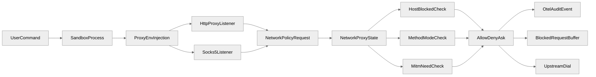
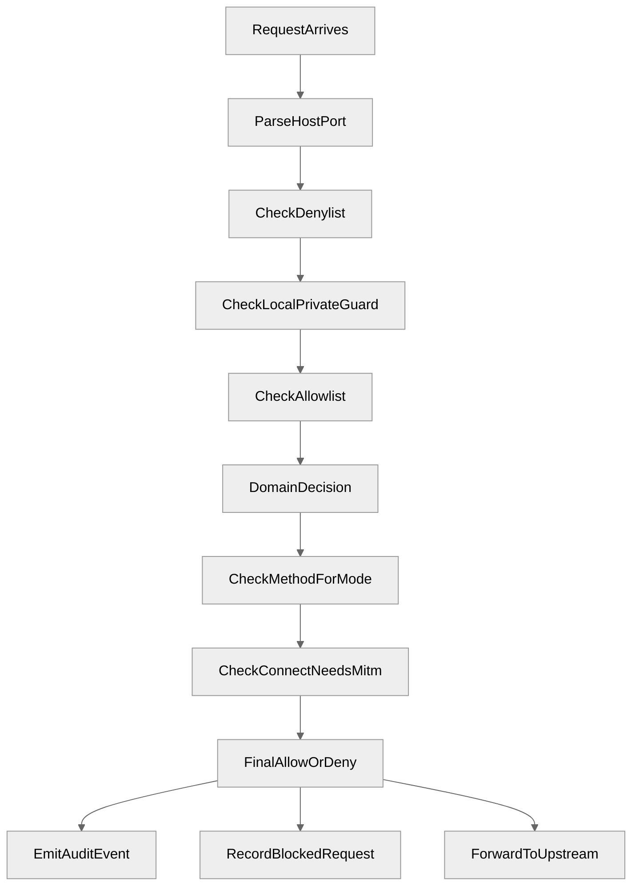
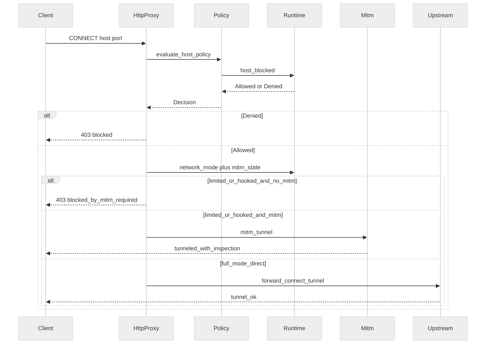
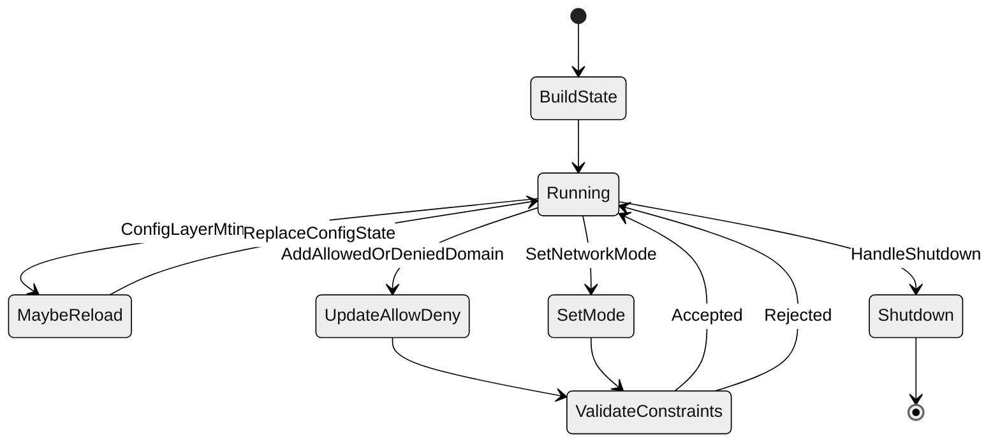
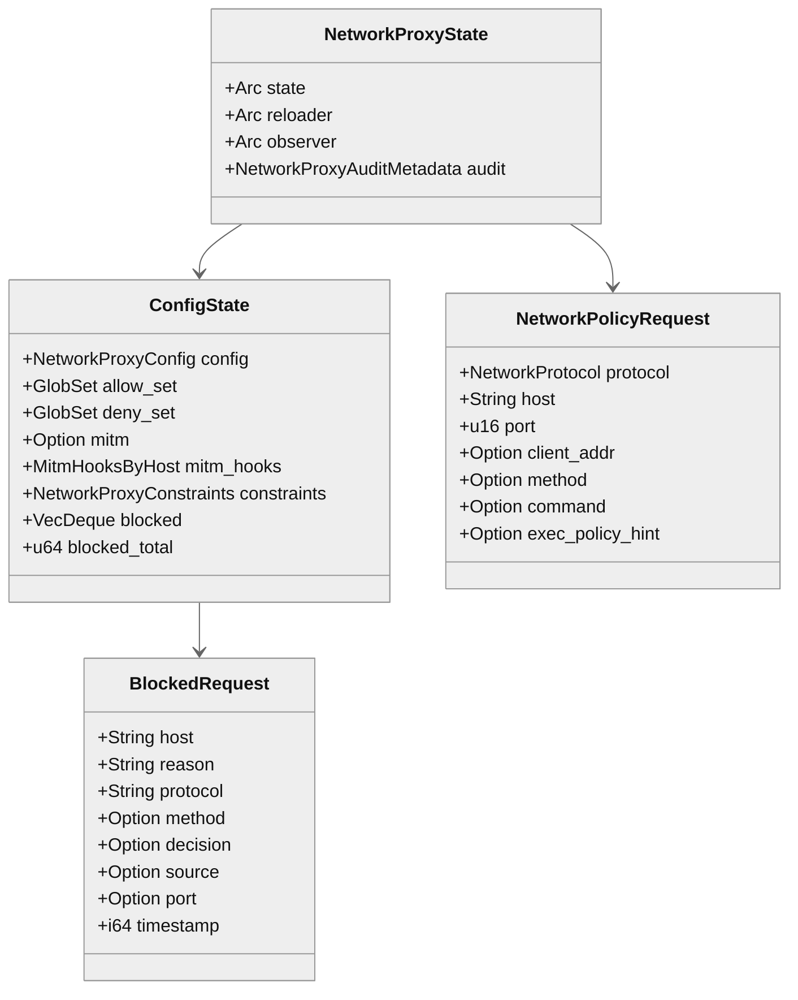

# 第 15 章：网络代理与策略

## 引言

`network-proxy` 在 Codex 的安全架构里，承担的是“沙箱内命令的网络能力如何被受控放行”这件事。它不是把网络变成一个二元开关（能上网 / 不能上网），而是把请求一步步拆成可被策略评估的对象：目的地是哪个域、走什么协议、当前处于什么模式、有没有 MITM、是否触发审计。

可以这样理解：如果只有沙箱，`workspace-write + network_access=true` 大致只能给到“全部直连出网”；加上 `network-proxy` 后，Codex 才能把域名 allow/deny、私网保护、LIMITED 模式方法限制、MITM 与审计串成同一条执行链。是不是“必须如此设计”、是不是“最优解”，源码本身并没有给答案；本章只就当前代码能直接证明的事实展开。

本章聚焦下面 5 条核心源码路径：

- `codex-rs/network-proxy/src/runtime.rs`
- `codex-rs/network-proxy/src/http_proxy.rs`
- `codex-rs/network-proxy/src/proxy.rs`
- `codex-rs/network-proxy/src/network_policy.rs`
- `codex-rs/core/src/network_proxy_loader.rs`

按本章复核口径（2026-05-26，本地源码基线 `/Users/hexiaonan/workspace/formless/refer/codex/codex-rs`）：

- `codex-rs` 下 `Cargo.toml` 文件数：**~120**（当前基线为 120）
- workspace member 数：**113**（`Cargo.toml` 顶层 `members` 列表）
- `network-proxy/src/*.rs`：**17 文件 / 10898 行**（不含 `core/src/network_proxy_loader.rs` 的 395 行）
- 本章核心 5 文件总计：**5857 行**
  - `runtime.rs`：1963 行
  - `http_proxy.rs`：1414 行
  - `proxy.rs`：1187 行
  - `network_policy.rs`：898 行
  - `network_proxy_loader.rs`：395 行
- 关键函数体量（按当前 HEAD 静态扫描；行号见正文）
  - `http_plain_proxy()`：约 325 行
  - `http_connect_accept()`：约 174 行
  - `apply_proxy_env_overrides()`：约 86 行
  - `host_blocked()`：约 76 行
  - `evaluate_host_policy()`：约 71 行（`network_policy.rs:289-359`）
- 测试注解数（`#[tokio::test...]` / `#[test]`）：
  - `runtime.rs` 61
  - `http_proxy.rs` 13
  - `proxy.rs` 15
  - `network_policy.rs` 7

这些数字本身只说明一件事：`network-proxy` 在 Codex 仓库里已经是一组体量稳定、测试覆盖较密的代码，而不是临时拼凑的 if-else。是否“足够成熟”仍取决于线上场景，下文会按七维框架尝试给出更具体的判断依据。

---

## 全网调研补充（近 12 个月）

### 1）检索范围与高权重来源

本章 Step 0 围绕下列关键词执行了全网检索：

- `Codex network proxy MITM`
- `Codex network policy egress`

并按项目要求覆盖了 OpenAI 工程团队、Simon Willison、Latent Space、HackerNews、知乎、少数派、机器之心、CSDN、掘金等渠道。可被复核的高权重来源大致分三类：

1. **OpenAI 官方文档与仓库一手材料**
   - `developers.openai.com/codex/agent-approvals-security`
   - `codex-rs/network-proxy/README.md`
   - `openai/codex` 中与网络策略直接相关的 Issue / PR（如 #8442、#9859、#17040、#20147、#16242）
2. **独立技术观察**
   - Simon Willison 关于 `httpjail` 的文章，把 Codex CLI 放入“代理 + 进程隔离”讨论框架
3. **社区操作经验**
   - HackerNews 上关于“如何用好 Codex network proxy”的实践讨论
   - 知乎 / 少数派 / CSDN / 掘金 等中文平台对连接性与代理配置的经验

### 2）社区共识

可被多方独立印证的几条：

1. Codex 的网络控制不是单一配置项，而是 `sandbox network_access` 与 `network_proxy` 联合生效；
2. 域名策略是 allowlist-first，且 deny 优先级高于 allow；
3. LIMITED 模式如果不启用 MITM，HTTPS CONNECT 隧道内方法不可见，方法级限制无法生效；
4. 多个独立来源倾向于把“出网策略”放在网络层而不是 prompt 层来约束，理由是“prompt 约束不可强制”。

### 3）主要争议与常见误解

1. **误解 A：开了 `network_access=true` 就等于启用代理策略**  
   官方文档明确说明 `network_proxy` 只在“网络已被授权”的前提下改变其约束方式，并不会自行授予网络能力。
2. **误解 B：domain allowlist 通过后，内网解析也会放行**  
   源码实现采取 fail-close 的“解析到私网即拦截”策略，并且 DNS 超时 / 失败同样拦截（详见 `runtime.rs:763`）。
3. **误解 C：LIMITED 模式天然支持 HTTPS 方法限制**  
   源码显示必须有 MITM 才能读到隧道内方法，否则只能在 CONNECT 层阻断（`http_proxy.rs:269`）。
4. **误解 D：网络策略只是 CLI 参数，不涉及配置治理**  
   `core/src/network_proxy_loader.rs` 中存在 trusted layer 约束验证、exec policy overlay、mtime reload 等机制，属于“配置治理路径”。

### 4）当前盲区（公开讨论较少）

1. `NetworkProxyState` 与 reload 路径之间的并发一致性细节；
2. `replace_config_state()` 中“可热更新字段 / 不可热更新字段”的精确边界；
3. `network_policy` 审计事件字段模型（`scope/source/override`）的下游治理用法；
4. `features.network_proxy`、legacy `sandbox_workspace_write`、permission profile 三套开关并存时的迁移路径。

也就是说，社区材料偏向“怎么配”，对“为什么这样实现、哪里会踩坑”的覆盖仍然有限。本章重点放在后者。

---

## 七维分析

## 1. 本质是什么

先看源码再下结论。`core` 这一侧负责把分层配置变成可执行的运行态状态：

```rust
// codex-rs/core/src/network_proxy_loader.rs:42
pub async fn build_network_proxy_state() -> Result<NetworkProxyState> {
    let (state, reloader) = build_network_proxy_state_and_reloader().await?;
    Ok(NetworkProxyState::with_reloader(state, Arc::new(reloader)))
}
```

`network-proxy` 这一侧负责把状态绑定到监听器和任务生命周期：

```rust
// codex-rs/network-proxy/src/proxy.rs:651
pub async fn run(&self) -> Result<NetworkProxyHandle> {
    let current_cfg = self.state.current_cfg().await?;
    if !current_cfg.network.enabled {
        warn!("network.enabled is false; skipping proxy listeners");
        return Ok(NetworkProxyHandle::noop());
    }
    // ... 后续 spawn HTTP / 可选 SOCKS 任务
}
```

运行期的核心状态收敛在 `ConfigState`：

```rust
// codex-rs/network-proxy/src/runtime.rs:159
#[derive(Clone)]
pub struct ConfigState {
    pub config: NetworkProxyConfig,
    pub allow_set: GlobSet,
    pub deny_set: GlobSet,
    pub mitm: Option<Arc<MitmState>>,
    pub mitm_hooks: MitmHooksByHost,
    pub constraints: NetworkProxyConstraints,
    pub blocked: VecDeque<BlockedRequest>,
    pub blocked_total: u64,
}
```

把这三处代码放在一起，可以得到一个相对克制的结论：`network-proxy` 在源码里被组织成“配置 → 状态 → 监听 / 决策 / 审计”的链路，而不是某个工具的可选参数。称它“执行平面”是观察结果，并不是官方表述。

<div style="background:#ffffff !important; background-color:#ffffff !important; padding:16px; border-radius:8px; margin:16px 0;" bgcolor="#ffffff">



</div>

一句话归纳：从源码组织看，它更接近“网络层的执行 + 审计通道”，而非“一组网络参数”。

## 2. 核心问题和痛点

### 痛点 1：策略顺序必须可预测，否则安全语义会漂移

`host_blocked()` 把判定顺序写死成 “deny → local/private guard → allowlist”：

```rust
// codex-rs/network-proxy/src/runtime.rs:376
// Decision order matters:
//  1) explicit deny always wins
//  2) local/private networking is opt-in (defense-in-depth)
//  3) allowlist is enforced when configured
if globset_matches_host_or_unscoped(&deny_set, host_str) {
    return Ok(HostBlockDecision::Blocked(HostBlockReason::Denied));
}
```

注释本身就把这一点提到了“顺序很重要”。如果交换顺序，例如 allowlist 先于 deny，就有可能让“先白名单通过，再被 deny”的边界场景变得不可预期。源码选择把 deny 放最前，是一种相对保守的做法。

### 痛点 2：DNS 重绑定防护倾向“宁可错杀”

DNS 行为是 fail-close：查询超时或错误都按风险处理。

```rust
// codex-rs/network-proxy/src/runtime.rs:763
// Block the request if this DNS lookup fails. We resolve the hostname again when we connect,
let addrs = match timeout(lookup_timeout, lookup(host.to_string(), port)).await {
    Ok(Ok(addrs)) => addrs,
    Ok(Err(err)) => {
        debug!("blocking host because DNS lookup failed ...");
        return true;
    }
    Err(_) => {
        debug!("blocking host because DNS lookup timed out ...");
        return true;
    }
};
```

这条策略对安全友好，对可用性会有摩擦：在企业 DNS 抖动场景下，可能出现“偶发的策略性拦截”。这是设计取舍，不是 bug，需要在排障侧区分。

### 痛点 3：HTTPS CONNECT 是策略盲点，LIMITED 模式没有 MITM 会被绕过

`http_connect_accept()` 在 LIMITED 或命中 MITM hook 时显式要求 MITM 状态：

```rust
// codex-rs/network-proxy/src/http_proxy.rs:269
let connect_needs_mitm = mode == NetworkMode::Limited || host_has_mitm_hooks;

if connect_needs_mitm && mitm_state.is_none() {
    // CONNECT needs MITM whenever HTTPS policy depends on inner-request inspection
    // ... blocked with REASON_MITM_REQUIRED
}
```

也就是说：声明 LIMITED 不等于自动拿到方法级控制；没有 MITM 状态时，源码选择直接阻断而不是放行。

### 痛点 4：子进程网络要被代理接管，先得对付环境变量碎片化

不同工具读不同变量，且大小写敏感性各异。`apply_proxy_env_overrides()` 直接把一组常见键统一覆盖：

```rust
// codex-rs/network-proxy/src/proxy.rs:493
set_env_keys(
    env,
    &[
        "HTTP_PROXY", "HTTPS_PROXY", "http_proxy", "https_proxy",
        "YARN_HTTP_PROXY", "YARN_HTTPS_PROXY",
        "npm_config_http_proxy", "npm_config_https_proxy", "npm_config_proxy",
        "NPM_CONFIG_HTTP_PROXY", "NPM_CONFIG_HTTPS_PROXY", "NPM_CONFIG_PROXY",
        "BUNDLE_HTTP_PROXY", "BUNDLE_HTTPS_PROXY", "PIP_PROXY",
        "DOCKER_HTTP_PROXY", "DOCKER_HTTPS_PROXY",
    ],
    &http_proxy_url,
);
```

这种做法不一定优雅，但在“工具生态各自为政”的现实里属于成本较低的折中。

### 痛点 5：运行中改配置不能“随便热更”

监听端口、SOCKS 开关这一类涉及监听拓扑的字段，运行时被显式禁止热改：

```rust
// codex-rs/network-proxy/src/proxy.rs:611
pub async fn replace_config_state(&self, new_state: ConfigState) -> Result<()> {
    let current_cfg = self.state.current_cfg().await?;
    anyhow::ensure!(
        new_state.config.network.proxy_url == current_cfg.network.proxy_url,
        "cannot update network.proxy_url on a running proxy"
    );
    // ... 同样拒绝 socks_url / enable_socks5 / enable_socks5_udp 的热改
}
```

可以这样理解：可以热更新策略（allowlist / denylist / mode 等），但不允许热更新“底层监听拓扑”。这样做对会话一致性是友好的，对“想换端口又不想断会话”的运维场景则是限制。

<div style="background:#ffffff !important; background-color:#ffffff !important; padding:16px; border-radius:8px; margin:16px 0;" bgcolor="#ffffff">



</div>

## 3. 解决思路与方案

### 3.1 架构主线：加载器 → 状态机 → 协议处理器

`network_proxy_loader` 的角色是把“配置层”变成“运行态”：

1. 读取并合并配置层；
2. 提取 trusted layer 约束；
3. 把 exec policy 的网络规则叠加进去；
4. 生成 `ConfigState + reloader`。

```rust
// codex-rs/core/src/network_proxy_loader.rs:271
fn config_from_layers(
    layers: &ConfigLayerStack,
    exec_policy: &codex_execpolicy::Policy,
) -> Result<NetworkProxyConfig> {
    let mut merged = toml::Value::Table(toml::map::Map::new());
    // ... merge layers
    let mut accumulator = NetworkConfigAccumulator::default();
    accumulator.apply_network_tables(parsed)?;
    let mut config = accumulator.finish()?;
    apply_exec_policy_network_rules(&mut config, exec_policy);
    Ok(config)
}
```

trusted constraints 只取“非用户可控层”，以避免用户层把受控策略放宽：

```rust
// codex-rs/core/src/network_proxy_loader.rs:124
fn network_constraints_from_trusted_layers(
    layers: &ConfigLayerStack,
) -> Result<NetworkProxyConstraints> {
    let mut constraints = NetworkProxyConstraints::default();
    let mut merged = toml::Value::Table(toml::map::Map::new());
    for layer in layers.get_layers(
        ConfigLayerStackOrdering::LowestPrecedenceFirst,
        /*include_disabled*/ false,
    ) {
        if is_user_controlled_layer(&layer.name) {
            continue;
        }
        merge_toml_values(&mut merged, &layer.config);
    }
    // ... 解析 + 应用 constraints
}
```

注意 `is_user_controlled_layer()` 在 `network_proxy_loader.rs:321` 把 `User / Project / SessionFlags` 三类标记为“用户可控”，其余层（system、legacy managed）才被视为可信源。这层切分的设计意图可以被理解为“防止 user-level config 偷偷放宽 system-level 边界”，但严格说，这只是源码现状的一种合理解释。

### 3.2 策略决策：baseline policy 与 decider 的职责边界

`evaluate_host_policy()` 的关键语义：

- baseline `Denied` 与 `NotAllowedLocal` 不允许被 decider 推翻；
- 只有 `NotAllowed`（allowlist miss）才可以被 decider override 为 Allow / Ask。

```rust
// codex-rs/network-proxy/src/network_policy.rs:289
pub(crate) async fn evaluate_host_policy(
    state: &NetworkProxyState,
    decider: Option<&Arc<dyn NetworkPolicyDecider>>,
    request: &NetworkPolicyRequest,
) -> Result<NetworkDecision> {
    let host_decision = state.host_blocked(&request.host, request.port).await?;
    let (decision, policy_override) = match host_decision {
        HostBlockDecision::Allowed => (NetworkDecision::Allow, false),
        HostBlockDecision::Blocked(HostBlockReason::NotAllowed) => {
            if let Some(decider) = decider {
                let decider_decision = map_decider_decision(decider.decide(request.clone()).await);
                let policy_override = matches!(decider_decision, NetworkDecision::Allow);
                (decider_decision, policy_override)
            } else {
                (
                    NetworkDecision::deny_with_source(
                        HostBlockReason::NotAllowed.as_str(),
                        NetworkDecisionSource::BaselinePolicy,
                    ),
                    false,
                )
            }
        }
        HostBlockDecision::Blocked(reason) => (
            NetworkDecision::deny_with_source(reason.as_str(), NetworkDecisionSource::BaselinePolicy),
            false,
        ),
    };
    // ... 写审计
}
```

这意味着：decider 是“向上放宽”的能力，而不是“万能 override”。`NotAllowedLocal` 这种私网解析阻断不会被业务层 decider 推翻，这是显式的设计选择。

### 3.3 协议分治：HTTP Plain / HTTPS CONNECT / SOCKS5

`http_proxy.rs` 把 CONNECT 和 plain request 分开处理。CONNECT 路径会先做 host policy，再判断是否需要 MITM 或走 tunnel：

```rust
// codex-rs/network-proxy/src/http_proxy.rs:347
if upgraded
    .extensions()
    .get::<ConnectMitmEnabled>()
    .is_some_and(|enabled| enabled.0)
    && upgraded
        .extensions()
        .get::<Arc<mitm::MitmState>>()
        .is_some()
{
    let host = normalize_host(&target.host.to_string());
    let port = target.port;
    info!("CONNECT MITM enabled (host={host}, port={port}, mode={mode:?})");
    if let Err(err) = mitm::mitm_tunnel(upgraded).await {
        warn!("MITM tunnel error: {err}");
    }
    return Ok(());
}
```

<div style="background:#ffffff !important; background-color:#ffffff !important; padding:16px; border-radius:8px; margin:16px 0;" bgcolor="#ffffff">



</div>

### 3.4 审计字段：让 allow / deny 都可回放

`network_policy` 的审计事件字段是结构化的，便于下游 SIEM 消费：

```rust
// codex-rs/network-proxy/src/network_policy.rs:228
fn emit_policy_audit_event(state: &NetworkProxyState, args: PolicyAuditEventArgs<'_>) {
    let metadata = state.audit_metadata();
    tracing::event!(
        target: AUDIT_TARGET,
        tracing::Level::INFO,
        event.name = POLICY_DECISION_EVENT_NAME,
        event.timestamp = %audit_timestamp(),
        conversation.id = metadata.conversation_id.as_deref(),
        app.version = metadata.app_version.as_deref(),
        auth_mode = metadata.auth_mode.as_deref(),
        originator = metadata.originator.as_deref(),
        user.account_id = metadata.user_account_id.as_deref(),
        user.email = metadata.user_email.as_deref(),
        terminal.type = metadata.terminal_type.as_deref(),
        model = metadata.model.as_deref(),
        slug = metadata.slug.as_deref(),
        network.policy.scope = args.scope,
        network.policy.decision = args.decision,
        network.policy.source = args.source,
        network.policy.reason = args.reason,
        network.transport.protocol = args.protocol.as_policy_protocol(),
        server.address = args.server_address,
        server.port = args.server_port,
        http.request.method = args.method.unwrap_or(DEFAULT_METHOD),
        client.address = args.client_addr.unwrap_or(DEFAULT_CLIENT_ADDRESS),
        network.policy.override = args.policy_override,
    );
}
```

一个直接好处是：“允许是 baseline allow 还是 decider override”是可观测的，而不是黑盒结果。这一点对治理侧很重要，但下游能不能利用得起来，仍取决于实际接入。

### 3.5 热更新策略：可改策略，不改拓扑

`maybe_reload()` 自动检测层级配置 mtime，并构建新状态：

```rust
// codex-rs/core/src/network_proxy_loader.rs:374
async fn maybe_reload(&self) -> Result<Option<ConfigState>> {
    if !self.needs_reload().await {
        return Ok(None);
    }
    let (state, layer_mtimes) = build_config_state_with_mtimes().await?;
    let mut guard = self.layer_mtimes.write().await;
    *guard = layer_mtimes;
    Ok(Some(state))
}
```

`replace_config_state()`（`proxy.rs:611`）则限定“可变字段”的范围，把监听拓扑类字段挡在热更新之外。两者合起来形成“策略热、拓扑冷”的边界。

## 4. 实现细节关键点

### 4.1 `runtime.rs`：真正的决策中枢

`HostBlockReason` 把所有阻断原因压缩成三个枚举：

```rust
// codex-rs/network-proxy/src/runtime.rs:60
#[derive(Clone, Copy, Debug, PartialEq, Eq)]
pub enum HostBlockReason {
    Denied,
    NotAllowed,
    NotAllowedLocal,
}
```

阻断遥测采用 ring-buffer + 总计数双轨：

```rust
// codex-rs/network-proxy/src/runtime.rs:432
pub async fn record_blocked(&self, entry: BlockedRequest) -> Result<()> {
    let mut guard = self.state.write().await;
    guard.blocked.push_back(entry);
    guard.blocked_total = guard.blocked_total.saturating_add(1);
    while guard.blocked.len() > MAX_BLOCKED_EVENTS {
        guard.blocked.pop_front();
    }
    Ok(())
}
```

这种实现可以解读为“近期窗口可读 + 总趋势不丢”的折中，避免无界缓冲带来的内存压力。

### 4.2 `network_policy.rs`：把策略变成协议无关决策

`NetworkPolicyRequest` 已经把 exec policy 联动入口预留好：

```rust
// codex-rs/network-proxy/src/network_policy.rs:78
pub struct NetworkPolicyRequest {
    pub protocol: NetworkProtocol,
    pub host: String,
    pub port: u16,
    pub client_addr: Option<String>,
    pub method: Option<String>,
    pub command: Option<String>,
    pub exec_policy_hint: Option<String>,
}
```

这意味着决策并不局限于域名匹配；`command` 与 `exec_policy_hint` 字段为“按来源命令收紧策略”留下了接口。当前实现是否充分利用了这些字段，是值得在后续观察的演进点。

### 4.3 `http_proxy.rs`：协议细节与防绕过补丁集中地

`validate_absolute_form_host_header()` 是一种针对 HTTP absolute-form 请求的混淆校验：

```rust
// codex-rs/network-proxy/src/http_proxy.rs:840
fn validate_absolute_form_host_header(
    req: &Request,
    request_ctx: &RequestContext,
) -> Result<(), &'static str> {
    if req.uri().scheme_str().is_none() {
        return Ok(());
    }

    let Some(host_header) = req
        .headers()
        .typed_try_get::<Host>()
        .map_err(|_| "invalid Host header")?
    else {
        return Ok(());
    };

    if host_header.0.host != request_ctx.authority.host {
        return Err("Host header does not match request target");
    }
}
```

被阻断响应统一返回结构化 body 并写入 `x-proxy-error` 头：

```rust
// codex-rs/network-proxy/src/http_proxy.rs:908
fn json_blocked(host: &str, reason: &str, details: Option<&PolicyDecisionDetails<'_>>) -> Response {
    let (message, decision, source, protocol, port) = details
        .map(|details| {
            (
                Some(blocked_message_with_policy(reason, details)),
                Some(details.decision.as_str()),
                Some(details.source.as_str()),
                Some(details.protocol.as_policy_protocol()),
                Some(details.port),
            )
        })
        .unwrap_or((None, None, None, None, None));
    let response = BlockedResponse {
        status: "blocked",
        host,
        reason,
        decision,
        source,
        protocol,
        port,
        message,
    };
    let mut resp = json_response(&response);
    *resp.status_mut() = StatusCode::FORBIDDEN;
    resp.headers_mut().insert(
        "x-proxy-error",
        HeaderValue::from_static(blocked_header_value(reason)),
    );
    resp
}
```

这样做的可见好处是：上游链路问题和策略拒绝可以从响应头区分开，不必只靠错误码猜。

### 4.4 `proxy.rs`：托管生命周期与环境注入

`build()` 在 managed 模式下会优先预留 loopback ephemeral listener，避免端口竞争：

```rust
// codex-rs/network-proxy/src/proxy.rs:166
pub async fn build(self) -> Result<NetworkProxy> {
    let state = self.state.ok_or_else(|| {
        anyhow::anyhow!(
            "NetworkProxyBuilder requires a state; supply one via builder.state(...)"
        )
    })?;
    state
        .set_blocked_request_observer(self.blocked_request_observer.clone())
        .await;
    let current_cfg = state.current_cfg().await?;
    let (requested_http_addr, requested_socks_addr, reserved_listeners) = if self
        .managed_by_codex
    {
        let runtime = config::resolve_runtime(&current_cfg)?;
        #[cfg(target_os = "windows")]
        let (managed_http_addr, managed_socks_addr) = config::clamp_bind_addrs(
            runtime.http_addr,
            runtime.socks_addr,
            &current_cfg.network,
        );
        #[cfg(target_os = "windows")]
        let reserved = reserve_windows_managed_listeners(
            managed_http_addr,
            managed_socks_addr,
            current_cfg.network.enable_socks5,
        )
        .context("reserve managed loopback proxy listeners")?;
        #[cfg(not(target_os = "windows"))]
        let reserved = reserve_loopback_ephemeral_listeners(current_cfg.network.enable_socks5)
            .context("reserve managed loopback proxy listeners")?;
        let http_addr = reserved.http_addr()?;
        let socks_addr = reserved.socks_addr(runtime.socks_addr)?;
        (
            http_addr,
            socks_addr,
            Some(reserved.into_reserved_listeners()),
        )
    } else {
        let runtime = config::resolve_runtime(&current_cfg)?;
        (
            self.http_addr.unwrap_or(runtime.http_addr),
            self.socks_addr.unwrap_or(runtime.socks_addr),
            None,
        )
    };

    // Reapply bind clamping for caller overrides so unix-socket proxying stays loopback-only.
    let (http_addr, socks_addr) = config::clamp_bind_addrs(
        requested_http_addr,
        requested_socks_addr,
        &current_cfg.network,
    );

    Ok(NetworkProxy {
        state,
        http_addr,
        socks_addr,
        socks_enabled: current_cfg.network.enable_socks5,
        runtime_settings: Arc::new(RwLock::new(NetworkProxyRuntimeSettings::from_config(
            &current_cfg,
        ))),
        reserved_listeners,
        policy_decider: self.policy_decider,
    })
}
```

`run()` 会把 HTTP 与可选 SOCKS5 监听任务并发拉起，并通过 `NetworkProxyHandle` 托管关闭：

```rust
// codex-rs/network-proxy/src/proxy.rs:671
let http_task = tokio::spawn(async move {
    match http_listener {
        Some(listener) => {
            http_proxy::run_http_proxy_with_std_listener(http_state, listener, http_decider).await
        }
        None => http_proxy::run_http_proxy(http_state, http_addr, http_decider).await,
    }
});

let socks_task = if current_cfg.network.enable_socks5 {
    let socks_state = self.state.clone();
    let socks_decider = self.policy_decider.clone();
    let socks_addr = self.socks_addr;
    let enable_socks5_udp = current_cfg.network.enable_socks5_udp;
    Some(tokio::spawn(async move {
        match socks_listener {
            Some(listener) => {
                socks5::run_socks5_with_std_listener(
                    socks_state,
                    listener,
                    socks_decider,
                    enable_socks5_udp,
                )
                .await
            }
            None => {
                socks5::run_socks5(
                    socks_state,
                    socks_addr,
                    socks_decider,
                    enable_socks5_udp,
                )
                .await
            }
        }
    }))
} else {
    None
};
```

这种“并发监听 + 显式 handle 收尾”的写法，让上层既能容忍 SOCKS 关闭，也能保证 HTTP 监听一旦失败可以被正确观察。

### 4.5 `network_proxy_loader.rs`：策略治理边界

这一层的关键价值是“把可相信层和用户层分开处理”，并在启动时就强制约束验证：

```rust
// codex-rs/core/src/network_proxy_loader.rs:113
fn enforce_trusted_constraints(
    layers: &ConfigLayerStack,
    config: &NetworkProxyConfig,
) -> Result<NetworkProxyConstraints> {
    let constraints = network_constraints_from_trusted_layers(layers)?;
    validate_policy_against_constraints(config, &constraints)
        .map_err(NetworkProxyConstraintError::into_anyhow)
        .context("network proxy constraints")?;
    Ok(constraints)
}
```

MITM 的启用条件在 accumulator 的 `finish()` 收尾处显式收口：

```rust
// codex-rs/core/src/network_proxy_loader.rs:265
self.config.network.mitm = self.config.network.mode == NetworkMode::Limited
    || !self.config.network.mitm_hooks.is_empty();
```

也就是：只要进入 LIMITED 模式或配置了 MITM hook，MITM 就会被自动启用。这是一种“按需开启”的取舍，看起来能减少用户在两个独立开关之间反复对齐的成本。

<div style="background:#ffffff !important; background-color:#ffffff !important; padding:16px; border-radius:8px; margin:16px 0;" bgcolor="#ffffff">



</div>

<div style="background:#ffffff !important; background-color:#ffffff !important; padding:16px; border-radius:8px; margin:16px 0;" bgcolor="#ffffff">



</div>

## 5. 易错点和注意事项

1. **双开关误用**：`network_access` 与 `features.network_proxy` 作用层不同；后者只在网络已被授权的前提下改变约束方式，不自行授予网络能力（官方文档明示）。
2. **legacy 与 permission profile 混配**：`[sandbox_workspace_write]` 与 `[permissions.*.network]` 混用容易出现“看起来配了，实际不生效”的情况；Issue #16242 给出了相关的真实反馈。
3. **LIMITED + HTTPS 的误判**：LIMITED 模式并不天然意味着方法级限制；没有 MITM 时 HTTPS 隧道内方法不可见（`http_proxy.rs:269`）。
4. **DNS 失败即阻断**：从安全角度可以理解，但企业 DNS 抖动时会带来误阻断；排障时优先排除 DNS 链路。
5. **本地地址例外必须显式**：`allow_local_binding=false` 时，`localhost` 与私网字面量需要显式 allow，wildcard 不会自动覆盖本地地址。
6. **Host 头一致性**：absolute-form 请求若 URI host 与 Host header 不一致会被 400，链路中常被误诊为“上游服务异常”（`http_proxy.rs:840`）。
7. **Unix socket 语义平台限制**：当前实现明确把 `allowUnixSockets / dangerouslyAllowAllUnixSockets` 标记为 macOS-only（`proxy.rs:658-662` 的 warn）；其他平台会拒绝。
8. **热更新边界**：监听拓扑类字段（`proxy_url / socks_url / enable_socks5 / enable_socks5_udp / enabled`）运行时不能改，硬限制写在 `replace_config_state()`。
9. **环境变量覆盖副作用**：代理会主动覆盖大量 `*_PROXY` 变量，若已有自定义代理链，需先规划好优先级，否则容易出现“看起来在走 A，其实走了 B”。
10. **审计 ≠ 持久化**：源码只负责发出 tracing 事件；事件是否被采集、是否能告警，取决于运行环境的 telemetry 接入，不要默认有了字段就等于有了治理闭环。

## 6. 竞品对比

下表只对照“网络代理与策略”这一维，不展开其他能力维度。表中“关键差异”一栏是基于公开材料的观察，并不构成绝对结论。

| 项目 | 默认网络策略 | 细粒度策略形态 | 执行隔离实现 | 关键差异（基于公开材料） |
| --- | --- | --- | --- | --- |
| **Codex** | 默认本地命令网络关闭；可开启并叠加 `network_proxy` | 域名 allow/deny、mode、local/private guard、MITM hooks、审计字段 | OS sandbox + 本地托管代理（HTTP / SOCKS / 可选 MITM） | 代理执行面与配置治理层耦合，支持 decider override 与 trusted-layer 约束验证 |
| **Claude Code** | 沙箱内默认无预置域名，按域审批 / 管理策略约束 | `allowedDomains`、managed lockdown、可自定义代理 | Seatbelt / bwrap + 沙箱外代理 | 在“沙箱与审批模式”的文档表达更系统；公开材料中较少强调 MITM 方法级判定 |
| **OpenCode** | 以 tool permission 为主，网络更偏工具层授权 | `permission` 规则（allow / ask / deny），可按工具输入匹配 | 取决于部署（本机 / 容器 / 外部沙箱） | 默认策略中心在工具权限，不是内置 egress policy 引擎 |
| **Aider** | 社区共识是主机直跑；`/run` `/test` 走本机子进程 | 暂无内建强制网络策略；依赖外置 runner 或沙箱 | 依赖用户外部基础设施（容器、VM、防火墙） | 透明，但风险边界基本交给用户 |
| **Goose** | 官方文档强调会话与扩展，隔离多靠容器模式 | 通过扩展 / 容器策略间接限制 | 支持 `--container` 运行扩展 | 网络与进程隔离能力依赖部署方式 |
| **Continue CLI** | 以工具权限为中心，非网络 egress 引擎 | `allow / ask / exclude` + 模式覆盖 | 依赖宿主与调用环境 | 工具权限工作流强，统一 egress 执行面较弱 |

对比要点（按当前公开信息看，可能随版本变化）：

- Codex 把 network policy 作为独立可观测的执行通道，相比单纯审批 UI 的项目，更接近“可被治理系统消费”的形态；
- Claude Code 在“沙箱 + 审批”产品表达上较成熟，但其公开材料中较少展开 MITM 方法级策略；
- Aider / Goose / Continue 在网络策略上更依赖外部基础设施（容器、防火墙、代理网关）。

## 7. 仍存在的问题和缺陷

### 7.1 配置面仍有认知成本

`network_access`、`features.network_proxy`、permission profile、legacy sandbox 并存，虽然 Issue #20147 给出了行为矩阵，但 Issue #16242 的反馈说明“多套开关并存”导致的认知冲突仍然存在。降低这部分心智负担更多是文档与诊断输出层的工作。

### 7.2 DNS 安全与可用性的天然冲突

fail-close（DNS timeout / error 即阻断）在安全侧是合理的，但企业 DNS 抖动场景会有可用性代价。README 也提示需要更底层的 egress 防护配合，源码不打算单独承担 DNS rebinding 的全部风险。

### 7.3 MITM 的运维复杂度

MITM 解决了 LIMITED + HTTPS 的方法盲区，但同时引入证书信任链、终端兼容、合规审批等运维成本。证书路径已经收敛到 `$CODEX_HOME/proxy`，跨组织落地仍是一个独立工程问题。

### 7.4 热更新边界带来的“重启需求”

运行时禁止热改监听拓扑字段，对一致性是好的，对“想换端口又不想断会话”的运维场景是限制。这是设计取舍，不构成实现缺陷，但仍然会被一些用户感受为“摩擦”。

### 7.5 生态依赖风险

代理执行面再强，仍依赖下游工具尊重环境变量或受控通道。`apply_proxy_env_overrides()` 已覆盖大量常见变量，但实现上无法穷举所有工具。外层网络隔离（容器、宿主防火墙）仍是必要补强，而不是冗余。

### 7.6 失败模式的分层拆解（实现视角）

把线上问题按请求生命周期切开，可以分成三层：

**第一层：配置装配失败（启动前）**

典型症状是代理根本不启动、或者启动后立刻 no-op。常见根因在 `network_proxy_loader`：

- 配置层解析失败（`default_permissions` 指向 profile 但 `[permissions]` 缺失）；
- trusted constraints 与用户层配置冲突（用户层尝试放宽 mode 或扩大域范围）；
- exec policy 叠加后改写了域规则，触发约束校验失败。

这一层失败发生在运行态之前，避免了请求进入“灰色状态”。代价是用户会感觉“配置明明写了却没生效”。从运维角度，把 `source_label`、层级顺序、约束冲突原因同时暴露给用户是收益较高的改进方向。

**第二层：运行态策略失败（请求判定期）**

发生在 `host_blocked()`、`evaluate_host_policy()` 与 mode guard。典型分歧：

- DNS fail-close 与 DNS 抖动的冲突；
- local/private guard 的“严格度超预期”：用户以为 allow `*.corp.internal` 就能访问内网解析，实际依旧会被私网解析拦截（属于 `NotAllowedLocal` 类阻断）；
- decider override 的边界：很多人期望 decider 能覆盖所有 deny，源码中只允许覆盖 allowlist miss。

这层故障的好处是“行为确定”，但用户主观感受可能像随机失败，因此审计字段里 `source` 与 `reason` 的区分至关重要——否则所有 403 在用户眼里都一样。

**第三层：转发链路失败（请求执行期）**

策略允许后，请求仍可能在 forwarding 阶段失败：

- 上游代理不可用 / 证书链异常；
- CONNECT 隧道建立成功但中途中断；
- Unix socket 目标进程未监听或路径解析失败；
- 子进程工具不遵守环境变量，逃逸到直连路径（取决于工具栈）。

这层故障与安全策略无关，却很容易被误判为“策略误拦截”。`http_proxy.rs` 在响应头与日志语义上区分“策略拒绝”与“上游失败”，有助于降低这种误诊。

### 7.7 一次真实请求的端到端时间线（从命令到审计）

为了把实现与体感对齐，下面按时间线描述一次典型的 `curl https://api.openai.com/...`：

**T0：命令执行前的环境注入**  
`NetworkProxy.apply_to_env()`（通过 `apply_proxy_env_overrides()`）覆盖 `HTTP_PROXY/HTTPS_PROXY/ALL_PROXY/NO_PROXY` 等变量，目的在于“把流量导向本地代理”，本身还不涉及策略判定。

**T1：请求到达 HTTP 代理监听器**  
如果是 HTTPS，会先进入 CONNECT 分支。`http_connect_accept()` 主要做三件事：读取当前状态、做 host policy、判断是否需要 MITM。这里的实现顺序是“先策略、后通道”，避免“通道建好后再发现违规”。

**T2：域名策略与 override 判定**  
`evaluate_host_policy()` 调用 `host_blocked()` 得到 baseline 决策，再根据是否存在 decider 决定是否 override。当 override 发生时，`network.policy.override=true` 会写入审计事件；这让后续排查能区分“系统允许”与“策略豁免允许”。

**T3：模式守卫（method / MITM）**  
即便域名层放行，LIMITED 模式仍会在方法层进行一轮检查。对 CONNECT 而言，若没有 MITM 状态，源码选择直接以 `mitm_required` 阻断，避免“加密隧道绕过方法策略”。

**T4：转发执行**  
通过前面所有门槛的请求才会进入 `forward_connect_tunnel()` 或 `UpstreamClient::serve()`。此时的失败属于链路问题，不应再归因于 domain policy。

**T5：事件与缓冲**  
无论 allow / deny，都会写审计事件；deny 还会写 `BlockedRequest`。前者面向治理系统，后者面向会话级排障与用户反馈。两者并存，让系统同时具备全局可观测性和会话可解释性——前提是 telemetry 接入到位。

### 7.8 面向下一阶段的改进方向（按投入产出排序）

下面只是基于源码现状与社区讨论的观察，不构成官方路线图。

**短期、低侵入**

1. **配置诊断输出统一化**：在启动日志里直接打印“当前生效开关矩阵”（`network_access`、`features.network_proxy`、profile 网络位），减少配置错觉；
2. **阻断原因用户态翻译**：把 `reason / source / protocol` 显式呈现在 CLI 层，而不是只留在 header 与 trace；
3. **DNS 失败的可观测细分**：把 timeout、NXDOMAIN、SERVFAIL 分别落日志，避免“一切看起来都是 `not_allowed_local`”。

**中期、中等改造**

1. **热更新能力扩边**：在不破坏监听拓扑的前提下，支持更多运行时参数的原子更新，并提供变更摘要；
2. **审计字段版本化**：给 `codex.network_proxy.policy_decision` 增加 schema version，便于外部 SIEM 长期兼容；
3. **策略 dry-run**：提供输入 host / method / mode、输出最终决策与来源的模拟器，让“试错”前移。

**长期、高投入**

1. **DNS rebinding 的更强防护**：引入连接阶段 IP pinning 或与底层 egress firewall 联动；
2. **统一网络策略模型**：渐进式合并 legacy 与 profile 双路径，减少历史兼容负担；
3. **跨平台 Unix socket 策略**：在 Linux/Windows 上给出等价能力或明确替代方案，减少“macOS 特例”。

如果只取一句话给读者：把 Codex 的网络代理设计当成“策略执行平面”的实现模板来参考，比当成“代理参数集合”来抄要划算得多。值得复制的不是某一条规则，而是三个原则：**决策顺序固定、失败原因可归类、审计字段可追踪**。

### 7.9 给一线团队的落地清单

如果要把这套机制用于真实团队而非个人试验，可以按下面的顺序推进：

**阶段 A：先把边界跑通（1-2 天）**

- 只用最小 allowlist，先验证“所有命令都走代理”；
- 在 CI 或预发环境故意触发 3 类请求（allow、deny、local/private），确认响应与审计字段都可见；
- 固定一组 smoke 命令（curl、git、包管理器）做回归，避免工具升级后悄悄绕开代理。

**阶段 B：再把规则收紧（3-5 天）**

- 打开 LIMITED 模式，明确哪些域允许写操作、哪些域只读；
- 对必须 HTTPS 写入的域逐步引入 MITM hook，而不是一次性全量 MITM；
- 对本地服务访问建立“显式白名单 + 工单备注”流程，防止规则无序膨胀。

**阶段 C：最后做治理闭环（持续）**

- 建立 `network.policy.source` 的周报视图：看 baseline allow、decider override、mode guard deny 的比例；
- 对 `blocked_total` 做趋势监控，区分“策略收紧导致拦截上升”与“异常流量导致拦截上升”；
- 每次变更后跑一次配置矩阵回归（profile、legacy、feature flag），防止历史兼容路径回归。

清单背后的思路是：**先确认不会漏，再优化误杀率，最后治理长期演化成本**。反过来做容易在体验侧先松后紧，安全债越压越多。

### 7.10 阅读与复核建议

如果你打算在自己的仓库复现本章推导，建议按“先静态、后动态”的顺序：

1. 静态复核 `loader → runtime → network_policy → http_proxy → proxy` 的调用边界，确认每一步输入输出的字段语义；
2. 跑三个最小场景：`allow host`、`deny host`、`local/private host`，把响应、日志、审计事件逐项对齐；
3. 引入 LIMITED + MITM，单独检查 CONNECT 失败是否落在 `mitm_required`，避免把链路错误误当策略错误。

这样能减少“连接失败”和“策略拒绝”之间来回猜测的成本，也能更快定位是配置层、判定层还是转发层的问题。

## 小结

这一章的核心结论可以浓缩为三句话：

1. Codex 的网络代理在源码组织上更接近“网络执行通道”，而不仅是一组网络参数；
2. 它的工程价值不在“能不能拦请求”，而在“约束可验证、决策可审计、运行可热更新（且边界明确）”；
3. 真正比较难的部分不是单条规则，而是三组平衡：**安全 vs 可用性、热更新 vs 一致性、产品易用性 vs 治理严谨性**。

从源码看，`runtime / http_proxy / proxy / network_policy / loader` 这 5 个文件把这三组平衡组织成了相对清晰的分层；从公开讨论看，下一阶段更可能的方向不是再加规则，而是降低配置心智负担、并把策略效果可视化做得更直接。能否做到，更多取决于产品与运维侧的接入，而不只取决于 `network-proxy` 自身。
