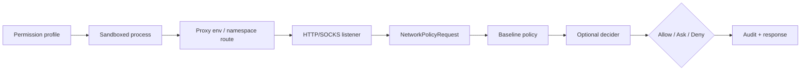

# 15｜网络代理与策略：从“能联网”到逐请求治理

> 源码基线：`upstream/main@283bc4cf011047314b4804c0f1ccd06e4f6a95c5`（2026-06-24）。

网络治理有两层：

1. permission profile 决定进程是否拥有网络能力；
2. managed proxy 决定已授权流量可访问哪些目标、方法和协议。

启用代理不会自动授予网络权限；允许网络也不代表绕过代理策略。

## 1. 执行链



OS 沙箱负责防止直连绕过；代理负责理解 host、port、协议和 HTTP 方法。

## 2. `NetworkPolicyRequest`

一次真实连接会形成结构化请求，包含：

- host / port；
- HTTP 或 CONNECT 等协议；
- method；
- environment ID；
- 触发该连接的执行上下文。

`NetworkPolicyDecider` 返回 allow、ask 或 deny，并记录决策来源：

- baseline policy；
- dynamic decider；
- mode guard；
- proxy state。

来源字段很重要：它让 UI 和审计能区分“配置明确拒绝”与“本次需要用户判断”。

## 3. 基线策略优先级

域名策略的基本顺序是：

1. 显式 deny；
2. localhost / private-address guard；
3. allowlist；
4. 未命中后的 ask 或 deny。

即使域名在 allowlist 中，解析结果落到受保护私网地址也可能被拒绝。DNS 失败或超时不能默认放行，否则可利用解析不确定性绕过策略。

## 4. Late approval

命令字符串通常无法提前确定所有网络目标。进程运行到真实连接时，代理才知道目的地并触发审批：

```text
spawn process
→ process connects to proxy
→ proxy produces NetworkPolicyRequest
→ user / Guardian decides
→ allow connection or return denial
→ denial may terminate triggering process
```

因此网络拒绝可能晚于进程启动。执行管理器必须能把代理拒绝映射回原工具调用并清理进程。

## 5. 网络 amendment

审批响应可包含 `NetworkPolicyAmendment`，表达：

- allow / deny；
- host；
- protocol；
- port 等边界。

若用户选择持久化规则，execpolicy amendment 模块将其写入规则文件。一次连接的批准不能无意扩大成任意网络访问。

## 6. HTTP 与 CONNECT

明文 HTTP 代理能看见 host、method 和完整请求。HTTPS 通常通过 CONNECT 建立隧道，未启用 MITM 时只能看到目标 host/port，看不到隧道内部 method。

因此 LIMITED 模式下的方法限制若要覆盖 HTTPS，需要 MITM；否则必须在 CONNECT 层采取更保守策略。

## 7. MITM

MITM 路径会：

- 管理本地 CA；
- 为目标生成叶证书；
- 将 CA 或 trust bundle 注入受控进程；
- 解密并重新代理 HTTPS；
- 执行方法与 host 策略；
- 记录审计。

这是高敏感能力，只应在受管环境中使用。证书材料有独立目录、锁和清理逻辑，不能把它当普通缓存。

## 8. Upstream proxy

Codex 可以在本地治理代理之后再使用 `HTTP_PROXY` / `HTTPS_PROXY` 等 upstream proxy。是否允许 upstream 以及是否允许非 loopback proxy 都受约束，避免用户环境变量把流量引向任意本地或远程代理。

## 9. Unix socket 与本地绑定

部分 macOS 服务通过 Unix socket 暴露。代理仅在平台支持且路径显式允许时转发。Windows Offline 身份还单独控制 loopback 代理端口和 `allow_local_binding`。

“允许 localhost”同样需要细分：连接代理端口、访问任意本地服务、监听本地端口不是同一权限。

## 10. 热更新

`NetworkProxyState` 支持受约束的配置替换与 reload。更新要重新构建 allow/deny matcher，并保留不可热更新字段的安全约束。

加载器还会验证配置来自可信层，防止项目级文件开启企业禁止的代理能力。

## 11. 审计与错误

代理会记录：

- 决策；
- 决策来源；
- policy override；
- blocked request；
- host/method/protocol；
- environment。

拒绝响应还带有可解析的 proxy error 信息，供 core 构造 `NetworkPolicyDecisionPayload`，而不是只给模型一条模糊的连接失败。

## 12. 源码阅读路线

```bash
rg -n "NetworkPolicyDecision|NetworkDecisionSource|NetworkPolicyRequest" \
  codex-rs/network-proxy/src/network_policy.rs
rg -n "http_connect_proxy|http_plain_proxy" codex-rs/network-proxy/src/http_proxy.rs
rg -n "host_blocked|private|allow_set|deny_set" codex-rs/network-proxy/src/runtime.rs
rg -n "NetworkPolicyAmendment|NetworkApprovalContext" codex-rs/protocol/src
rg -n "network_policy_decision|late" codex-rs/core/src
```

网络层的核心原则是：

> Prompt 可以提醒模型不要联网，但只有沙箱路由、逐请求策略与可终止进程共同工作，网络限制才是强制边界。
